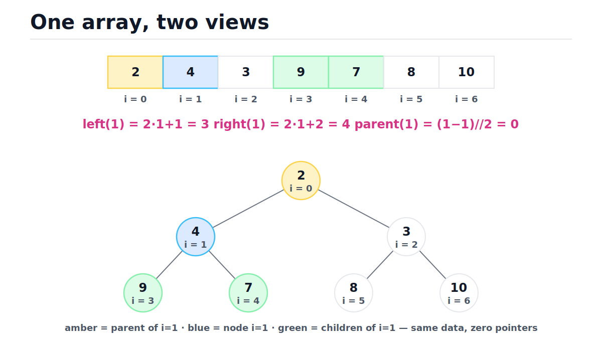
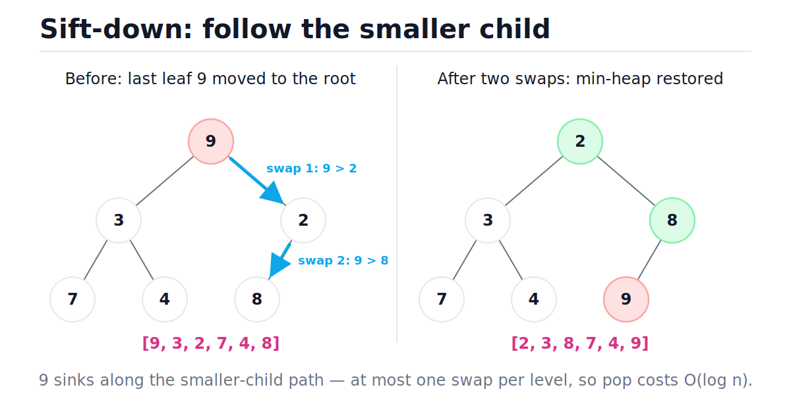
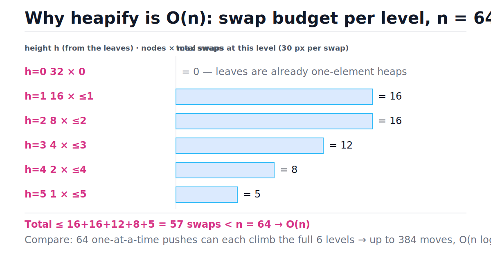
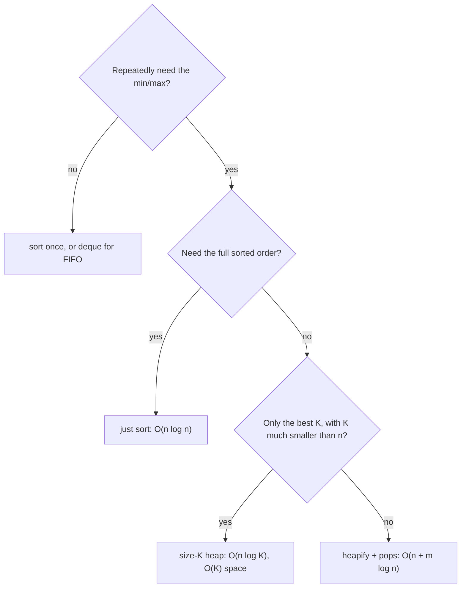

# Heaps and Priority Queues

[toc]

> **TL;DR:** A binary heap is a complete binary tree stored in a flat array — no pointers, just index arithmetic — that serves the smallest (or largest) element in O(1) and repairs itself after any push or pop in O(log n). Python's `heapq` turns any list into a min-heap in O(n), and the size-K heap idiom answers "top K of n" in O(n log K) time with O(K) memory. If you remember one thing: heapify a batch is O(n), pushing the same batch one-by-one is O(n log n).

## Vocabulary

These are the load-bearing terms for everything below. Each gets its canonical formula, then a one-line definition in plain prose.

**Binary heap**

```math
A[0..n-1] \ \text{such that} \ A[\lfloor (i-1)/2 \rfloor] \le A[i] \ \text{for all} \ 1 \le i < n
```

A complete binary tree flattened into an array. The tree exists only in your head; the data structure is a plain array plus index arithmetic.

**Min-heap / max-heap property**

```math
\text{min-heap: } A[\text{parent}(i)] \le A[i] \qquad \text{max-heap: } A[\text{parent}(i)] \ge A[i]
```

Every parent is no larger (min-heap) or no smaller (max-heap) than its children. This orders parent–child *chains* only — siblings are unordered.

**Complete binary tree**

```math
n \ \text{nodes} \Rightarrow \text{height} = \lfloor \log_2 n \rfloor
```

Every level is full except possibly the last, which fills left to right. Completeness is what lets the array have no holes.

**Sift up (bubble up)**

```math
i \leftarrow \lfloor (i-1)/2 \rfloor \ \text{while} \ A[i] < A[\text{parent}(i)]
```

Repair routine after a push: swap the new element with its parent until the heap property holds. At most one swap per level.

**Sift down (bubble down)**

```math
\text{swap } A[i] \leftrightarrow \min(A[2i+1], A[2i+2]) \ \text{until} \ A[i] \le \text{both children}
```

Repair routine after a pop: swap the displaced element with its *smaller* child until it is no larger than both children.

**Heapify (build-heap)**

```math
T(n) = O(n)
```

Floyd's bottom-up construction: sift down every internal node from the last one back to the root. Linear time — the surprising bound this note derives.

**Priority queue**

```math
\text{insert} \ / \ \text{find-min} \ / \ \text{delete-min}
```

The abstract data type: serve elements by priority, not arrival order. A binary heap is its standard implementation.

**Top-K pattern**

```math
O(n \log k) \ \text{time}, \quad O(k) \ \text{space}
```

Stream n items through a heap capped at size k; what survives is the k best. The workhorse idiom for "largest/smallest K of a huge stream".

## Intuition

Picture a corporate org chart with one rule: nobody's number is smaller than their boss's. That tells you nothing about who outranks whom across departments — only that the CEO (the root) has the smallest number in the building. A heap is exactly this: a *weak* ordering that is cheap to maintain and answers exactly one question instantly — "who's first?"

The second trick is the storage. Because the tree is complete, you can lay its levels end-to-end in an array with zero gaps and recover every parent/child relationship by arithmetic. The figure below shows the same seven values as an array and as the tree that array encodes — same data, zero pointers.



> [!NOTE]
> Completeness is the load-bearing assumption. If the tree could have holes, the array would need sentinel gaps and the index math would break. Every heap operation is designed to preserve completeness: push appends at the end, pop removes from the end.

## How it works

Every heap operation is the same two-step dance: make the cheap structural change at the array's end (append or swap-and-truncate), then repair the heap property along *one* root-to-leaf path. The path has at most ⌊log₂ n⌋ edges, which is where every O(log n) bound comes from.

### The index map: tree edges as arithmetic

There are no child pointers. Given a 0-based index i, the neighbors are computed, not stored. This is the whole reason heaps are fast in practice — navigation costs one shift and one add, not a pointer dereference.

```math
\text{left}(i) = 2i + 1 \qquad \text{right}(i) = 2i + 2 \qquad \text{parent}(i) = \left\lfloor \frac{i - 1}{2} \right\rfloor
```

The min-heap invariant, stated on the array directly — this single inequality is everything a heap guarantees:

```math
A\!\left[\lfloor (i-1)/2 \rfloor\right] \le A[i] \quad \text{for all } 1 \le i < n
```

### Push: append, then sift up

To insert, append the new value at index n — this keeps the tree complete but may violate the heap property at exactly one edge: the new leaf and its parent. Sift up walks that one path toward the root, swapping while the child is smaller. Each comparison either swaps and climbs one level or stops, so the cost is O(log n) worst case.

Trace of pushing **4** onto the valid min-heap `[3, 9, 5, 14, 20, 8]`:

| Step | Heap array | i | parent = (i−1)//2 | Compare | Decision |
| :--: | :--- | :--: | :--: | :--- | :--- |
| 0 | [3, 9, 5, 14, 20, 8, **4**] | 6 | (6−1)//2 = 2 → value 5 | 4 < 5 | swap up |
| 1 | [3, 9, **4**, 14, 20, 8, 5] | 2 | (2−1)//2 = 0 → value 3 | 4 ≥ 3 | stop — heap valid |

### Pop: swap to the end, then sift down

To remove the minimum, you cannot just delete index 0 — that leaves a hole. Instead, swap the root with the *last* element, truncate the array (completeness preserved), and now the wrong element sits at the root. Sift down repeatedly swaps it with its **smaller** child — picking the larger child would put a too-big value above the smaller sibling and re-break the invariant.

Trace: popping from the valid min-heap `[1, 3, 2, 7, 4, 8, 9]` removes 1 and moves the last leaf 9 to the root, leaving `[9, 3, 2, 7, 4, 8]` to repair:

| Step | Heap array | i | Children (index → value) | Smaller child | Decision |
| :--: | :--- | :--: | :--- | :--- | :--- |
| 0 | [**9**, 3, 2, 7, 4, 8] | 0 | 1 → 3, 2 → 2 | index 2 (value 2) | 9 > 2 → swap |
| 1 | [2, 3, **9**, 7, 4, 8] | 2 | 5 → 8, 6 → none | index 5 (value 8) | 9 > 8 → swap |
| 2 | [2, 3, 8, 7, 4, **9**] | 5 | none — leaf | — | stop — heap valid |

The figure shows this exact trace as a tree: 9 sinks along the smaller-child path, one swap per level.



### A complete min-heap from scratch

Here is the whole structure in ~40 lines. Notice that `push` and `pop` are one structural edit plus one sift; there is no rebalancing, no rotation, no node allocation beyond the list append. The asserts replay both traces above.

```python
class MinHeap:
    """Array-backed binary min-heap. push/pop O(log n), peek O(1)."""

    def __init__(self) -> None:
        self._a: list[int] = []

    def __len__(self) -> int:
        return len(self._a)

    def peek(self) -> int:                      # O(1): min lives at index 0
        return self._a[0]

    def push(self, value: int) -> None:         # O(log n)
        self._a.append(value)
        self._sift_up(len(self._a) - 1)

    def pop(self) -> int:                       # O(log n)
        a = self._a
        a[0], a[-1] = a[-1], a[0]               # last leaf -> root, min -> end
        top = a.pop()                           # truncate: completeness kept
        if a:
            self._sift_down(0)
        return top

    def _sift_up(self, i: int) -> None:
        a = self._a
        while i > 0:
            parent = (i - 1) // 2
            if a[i] >= a[parent]:
                break
            a[i], a[parent] = a[parent], a[i]
            i = parent

    def _sift_down(self, i: int) -> None:
        a, n = self._a, len(self._a)
        while True:
            left, right, smallest = 2 * i + 1, 2 * i + 2, i
            if left < n and a[left] < a[smallest]:
                smallest = left
            if right < n and a[right] < a[smallest]:
                smallest = right
            if smallest == i:
                return
            a[i], a[smallest] = a[smallest], a[i]
            i = smallest


h = MinHeap()
for v in [3, 9, 5, 14, 20, 8]:
    h.push(v)
h.push(4)                                       # the sift-up trace
assert h._a == [3, 9, 4, 14, 20, 8, 5]
assert h.peek() == 3
assert [h.pop() for _ in range(len(h))] == [3, 4, 5, 8, 9, 14, 20]

g = MinHeap()
for v in [1, 3, 2, 7, 4, 8, 9]:
    g.push(v)
assert g.pop() == 1                             # the sift-down trace
assert g._a == [2, 3, 8, 7, 4, 9]
```

### Build-heap: O(n), not O(n log n)

Given n unsorted items, you could push them one at a time — n pushes at O(log n) each is O(n log n). Floyd's bottom-up construction is better: every leaf (indices n//2 through n−1, half the array) is already a valid one-element heap for free, so you only sift down the internal nodes, from the last internal node `n//2 - 1` back to the root. The cost of each sift is bounded by the node's *height*, and almost all nodes have tiny heights — the bar chart makes the sum visible for n = 64.



```python
import random


def build_heap(a: list[int]) -> None:
    """Floyd's bottom-up heap construction: O(n) total, in place."""
    n = len(a)
    for start in range(n // 2 - 1, -1, -1):     # last internal node -> root
        i = start
        while True:                             # sift a[start] down
            left, right, smallest = 2 * i + 1, 2 * i + 2, i
            if left < n and a[left] < a[smallest]:
                smallest = left
            if right < n and a[right] < a[smallest]:
                smallest = right
            if smallest == i:
                break
            a[i], a[smallest] = a[smallest], a[i]
            i = smallest


random.seed(20260611)
data = [random.randrange(1000) for _ in range(257)]
build_heap(data)
assert all(data[(i - 1) // 2] <= data[i] for i in range(1, len(data)))
```

### Python heapq: the standard-library heap

CPython ships `heapq`, a set of functions that treat a plain `list` as a min-heap — there is no heap class, the list *is* the heap. It is min-heap only; for max-heap behavior you negate keys on the way in and out. For composite entries, use `(priority, tiebreak, item)` tuples so comparison never reaches the payload.

```python
import heapq
import itertools

nums = [14, 3, 20, 9, 5, 8]
heapq.heapify(nums)                       # O(n), in place — Floyd's algorithm
assert nums[0] == 3                       # peek is just nums[0]

heapq.heappush(nums, 4)                   # O(log n)
assert heapq.heappop(nums) == 3           # O(log n)
assert heapq.heappop(nums) == 4

# Max-heap: negate on the way in, negate on the way out.
mx = [-v for v in [14, 3, 20]]
heapq.heapify(mx)
assert -heapq.heappop(mx) == 20

# (priority, tiebreak, item): the counter breaks ties so payloads
# are never compared, and equal priorities stay FIFO.
counter = itertools.count()
pq: list[tuple[int, int, dict]] = []
heapq.heappush(pq, (2, next(counter), {"job": "reindex"}))
heapq.heappush(pq, (1, next(counter), {"job": "page-oncall"}))
heapq.heappush(pq, (1, next(counter), {"job": "send-email"}))
priority, _, job = heapq.heappop(pq)
assert (priority, job["job"]) == (1, "page-oncall")   # FIFO among equals

# Without the tiebreak, equal priorities compare the payloads -> TypeError.
bad: list[tuple[int, dict]] = []
heapq.heappush(bad, (1, {"job": "a"}))
try:
    heapq.heappush(bad, (1, {"job": "b"}))
    raise AssertionError("expected TypeError")
except TypeError:
    pass

# nsmallest / nlargest: O(n log k), with optional key=
data = [9, 1, 8, 2, 7, 3]
assert heapq.nsmallest(3, data) == [1, 2, 3]
assert heapq.nlargest(2, data) == [9, 8]
assert heapq.nlargest(1, ["go", "python", "c"], key=len) == ["python"]
```

> [!IMPORTANT]
> `heapq` guarantees only one position: `heap[0]` is the minimum. `heap[1]` is **not** the second-smallest (that is `min(heap[1], heap[2])`), and iterating the list does not yield sorted order. Pop repeatedly or call `sorted()` if you need order.

> [!WARNING]
> Tuple entries compare element by element, so two entries with equal priorities fall through to comparing the payloads. If payloads are dicts, sockets, or any objects without `<`, the push raises `TypeError` — at runtime, on the unlucky tie. The `itertools.count()` tiebreak (shown above) makes that comparison unreachable and gives you FIFO ordering for free.

### The top-K pattern

"Find the K largest of n items" does not need sorting (O(n log n)) or even a heap of all n items. Keep a *min*-heap of size K: its root is the weakest of your current best K, i.e. the bar a newcomer must beat. Each of the n items costs at most one O(log K) heap operation, and memory stays O(K) — which is why this works on streams too big to hold.

```python
import heapq
from typing import Iterable


def top_k_largest(stream: Iterable[int], k: int) -> list[int]:
    """K largest from a stream. O(n log k) time, O(k) space."""
    heap: list[int] = []                  # min-heap of the current best k
    for x in stream:
        if len(heap) < k:
            heapq.heappush(heap, x)
        elif x > heap[0]:                 # beats the weakest of the best
            heapq.heapreplace(heap, x)    # pop + push in a single sift
    return sorted(heap, reverse=True)


assert top_k_largest(iter([5, 1, 9, 3, 7, 8, 2]), 3) == [9, 8, 7]
assert top_k_largest(iter([4]), 3) == [4]
assert top_k_largest(iter([]), 3) == []
```

> [!TIP]
> The polarity is always the *opposite* of what you keep: K **largest** → size-K **min**-heap; K **smallest** → size-K **max**-heap (negated in Python). Use `heapq.heapreplace` (pop-then-push) or `heappushpop` (push-then-pop) instead of separate calls — one sift instead of two, and `heappushpop` short-circuits entirely when the new item loses to the root.

### Heapsort in one breath

Heapsort is build-heap plus n extractions, in place: build a *max*-heap in O(n), then repeatedly swap the root (current maximum) with the last unsorted slot and sift down over the shrunken prefix. Worst case O(n log n), O(1) extra space, not stable — the long-range root-to-end swaps reorder equal elements.

```python
def heapsort(items: list[int]) -> list[int]:
    """O(n log n) worst case, O(1) extra space, NOT stable."""
    a = list(items)
    n = len(a)

    def sift_down(i: int, end: int) -> None:
        while True:
            left, right, largest = 2 * i + 1, 2 * i + 2, i
            if left < end and a[left] > a[largest]:
                largest = left
            if right < end and a[right] > a[largest]:
                largest = right
            if largest == i:
                return
            a[i], a[largest] = a[largest], a[i]
            i = largest

    for i in range(n // 2 - 1, -1, -1):   # build max-heap: O(n)
        sift_down(i, n)
    for end in range(n - 1, 0, -1):       # n-1 extractions: O(n log n)
        a[0], a[end] = a[end], a[0]       # max -> its final slot
        sift_down(0, end)
    return a


assert heapsort([5, 1, 4, 2, 3]) == [1, 2, 3, 4, 5]
assert heapsort([2, 2, 1]) == [1, 2, 2]
assert heapsort([]) == []
```

## Complexity

One table for everything in this note. The headline asymmetry: `peek` is free because the answer is pre-positioned at index 0; everything else pays for one root-to-leaf path — except `heapify`, which cleverly pays mostly for short paths.

| Operation | Best | Average | Worst | Space | Why |
| :--- | :---: | :---: | :---: | :---: | :--- |
| `peek` (find-min) | O(1) | O(1) | O(1) | O(1) | minimum always at index 0 |
| `push` | O(1) | O(1)* | O(log n) | O(1) | sift up one path; *random items rarely climb far |
| `pop` (delete-min) | O(log n) | O(log n) | O(log n) | O(1) | replacement comes from leaf level, sinks ~all the way |
| `heapify` (build) | O(n) | O(n) | O(n) | O(1) | per-level sum below |
| search arbitrary value | O(1) | O(n) | O(n) | O(1) | siblings unordered → no pruning |
| `nsmallest`/`nlargest`(k) | — | O(n log k) | O(n log k) | O(k) | top-K pattern internally |
| top-K stream pattern | — | O(n log k) | O(n log k) | O(k) | one heap op per item, heap capped at k |
| heapsort | O(n log n) | O(n log n) | O(n log n) | O(1) | build O(n) + n sift-downs |

The bound worth deriving is heapify. A node at height h costs at most h swaps to sift down, and a heap on n nodes has at most ⌈n/2^(h+1)⌉ nodes at height h — heights shrink the population exponentially:

```math
T(n) \;=\; \sum_{h=0}^{\lfloor \log_2 n \rfloor} \left\lceil \frac{n}{2^{h+1}} \right\rceil \cdot O(h)
\;\le\; c\,n \sum_{h=0}^{\infty} \frac{h}{2^{h+1}}
\;=\; c\,n \cdot 1 \;=\; O(n)
```

The series converges because of the standard geometric-derivative identity evaluated at x = 1/2:

```math
\sum_{h=0}^{\infty} h\,x^{h} = \frac{x}{(1-x)^2}
\;\;\Rightarrow\;\;
\sum_{h=0}^{\infty} \frac{h}{2^{h}} = 2
\;\;\Rightarrow\;\;
\sum_{h=0}^{\infty} \frac{h}{2^{h+1}} = 1
```

In words: half the nodes are leaves and cost 0, a quarter cost at most 1, an eighth cost at most 2 — the expensive nodes are exponentially rare, so the total is a constant per node. Pushing one-by-one inverts this: the *common* nodes (leaves) pay the *maximum* distance (to the root), hence O(n log n).

## Memory model in Python

A `heapq` heap is a plain `PyListObject`: a contiguous C array of `PyObject*` pointers (8 bytes each on 64-bit), over-allocated so `append` is amortized O(1) — the same machinery covered in [Arrays and Dynamic Arrays](./02-arrays-and-dynamic-arrays.md). The *pointers* are contiguous; the values they point to are boxed objects scattered across the heap, so every comparison is a pointer dereference plus a dynamic-dispatch `<` call (see [Memory Model and PyObject Layout](../Programming-Languages/Python/13-memory-model-and-pyobject-layout.md)).

Cache behavior follows the index map. The top few levels (indices 0..15 or so) live in one or two cache lines of the pointer array and stay hot. The bottom levels stride exponentially: in a million-element heap, one sift-down step near the bottom jumps from index i to 2i+1 — megabytes apart in the pointer array — so deep sifts are effectively a cache miss per level, plus another for the boxed value. This is why a heap of raw C ints (or a NumPy-backed heap) can be 10–50× faster than the same algorithm over boxed Python ints.

```python
import heapq
import _heapq

h: list[int] = []
for v in [5, 2, 8, 1]:
    heapq.heappush(h, v)
assert type(h) is list                    # the heap IS a list — no wrapper
assert h[0] == min(h)                     # only index 0 is guaranteed

# CPython swaps in a C accelerator; Lib/heapq.py is the documented fallback.
assert heapq.heappush is _heapq.heappush
assert heapq.heapify is _heapq.heapify
```

> [!NOTE]
> CPython's `heappop` does something smarter than the textbook sift-down: it moves the last leaf to the root, sinks the *hole* all the way to leaf level by always promoting the smaller child (one comparison per level instead of two), then sifts the moved leaf back up a step or two. The comments in CPython's `Lib/heapq.py` explain why: the displaced element came from leaf level, so it almost always belongs back near the bottom — checking "am I done?" at every level wastes comparisons.

## Real-world example

An on-call alert dispatcher: alerts arrive tagged `critical`, `warning`, or `info`, and the dispatcher must always hand the responder the most severe outstanding alert — FIFO among equal severities so old criticals are not starved by new ones. This is the `(priority, tiebreak, item)` pattern doing production work; the same shape runs schedulers, timer wheels (`asyncio` keeps its timer callbacks in a `heapq` heap), and Dijkstra's frontier.

```python
import heapq
import itertools
from typing import Optional

SEVERITY = {"critical": 0, "warning": 1, "info": 2}   # lower rank = served first


class AlertQueue:
    """Priority queue for an on-call dispatcher.

    Most severe first; FIFO among equal severities; O(log n) per operation.
    """

    def __init__(self) -> None:
        self._heap: list[tuple[int, int, str]] = []
        self._seq = itertools.count()                 # arrival order tiebreak

    def publish(self, severity: str, message: str) -> None:
        rank = SEVERITY[severity]
        heapq.heappush(self._heap, (rank, next(self._seq), message))

    def next_alert(self) -> Optional[str]:
        if not self._heap:
            return None
        return heapq.heappop(self._heap)[2]


q = AlertQueue()
q.publish("info", "disk 71% on cache-3")
q.publish("critical", "p99 latency 4s on checkout")
q.publish("warning", "cert expires in 13 days")
q.publish("critical", "5xx spike on payments")

assert q.next_alert() == "p99 latency 4s on checkout"   # critical, arrived first
assert q.next_alert() == "5xx spike on payments"        # critical, arrived second
assert q.next_alert() == "cert expires in 13 days"      # then warnings
assert q.next_alert() == "disk 71% on cache-3"          # then info
assert q.next_alert() is None
```

> [!CAUTION]
> Never mutate the priority of an entry that is already inside the heap — the heap has no idea its invariant just broke, and pops silently return wrong answers from then on. The production fix is **lazy deletion**: push a fresh entry with the new priority, mark the old one dead (a tombstone set or a flag in the payload), and skip dead entries as they surface at pop time. Dijkstra implementations over `heapq` do exactly this.

## When to use / When NOT to use

The decision hinges on one question: do you repeatedly need only the *extreme* element, or do you need broader order/search? Heaps are unbeatable for the first and useless for the second.



**Reach for a heap when:**

- Repeated extract-min/max interleaved with inserts: schedulers, timer wheels, simulation event queues.
- Top-K / bottom-K of a large or unbounded stream (size-K heap).
- K-way merge of sorted streams (`heapq.merge`) — root of a K-element heap picks the next output in O(log K).
- Graph algorithms: Dijkstra and Prim's frontier (see [Shortest Paths](./16-shortest-paths-dijkstra-and-bellman-ford.md)).
- Running median: a max-heap for the lower half and a min-heap for the upper half.

**Skip the heap when:**

- You need everything sorted anyway — `sorted()` is simpler and Timsort is brutally fast on real data.
- You need membership tests, arbitrary lookup, or range queries — that's a hash table ([Hash Tables](./05-hash-tables.md)) or a balanced BST ([BSTs and Balanced Trees](./07-binary-search-trees-and-balanced-trees.md)).
- Strict FIFO/LIFO with no priorities — `collections.deque` is O(1) at both ends with none of the log factors.
- n is tiny (tens of items): a sorted list and `bisect` beat the constant factors.

## Common mistakes

- **"`heapq` has a max-heap mode"** — it does not. Negate numeric keys, negate the priority field of tuples, or use `heapq.nlargest` for one-shot queries.
- **"The heap list is sorted"** — only `heap[0]` is positioned. Siblings are unordered; `heap[1]` may not be the second-smallest, and slicing or iterating gives near-arbitrary order.
- **"Pushing n items ≈ heapify"** — n pushes cost O(n log n); `heapq.heapify` costs O(n). On a 10M-element batch that is a real, measurable gap.
- **"I can update an entry's priority in place"** — silent corruption; the heap never re-checks old entries. Re-push with the new priority and lazily skip stale ones.
- **"For the K largest, build a max-heap of all n"** — works, but it is O(n) memory and O(n + K log n) time; the size-K min-heap is O(K) memory and O(n log K), and K ≪ n is the whole point.
- **"Tuples with equal priorities are fine"** — equal first elements fall through to comparing payloads: `TypeError` at runtime if they aren't orderable. Always insert an `itertools.count()` tiebreak.
- **"Heapsort is what Python's `sorted` uses"** — CPython uses Timsort: stable, adaptive to existing runs, better cache behavior. Heapsort's wins are guaranteed O(n log n) with O(1) extra space, which matters for embedded/kernel code, not for `sorted()`.

## Interview questions and answers

These come up constantly because heaps sit at the intersection of arrays, trees, and greedy algorithms. Practice saying the answers out loud — the phrasing below is spoken-style on purpose.

**1. Why is building a heap from n items O(n) when a single insert is O(log n)?**
**Answer:** Because build-heap sifts *down*, and sift-down cost is bounded by a node's height, not its depth. Half the nodes are leaves with height 0, a quarter have height 1, and so on — the sum n × Σ h/2^(h+1) converges to n. Inserting one-by-one sifts *up*, where the common nodes (the leaves) pay the maximum distance, so that's O(n log n).

**2. Python's `heapq` is min-heap only. How do you get max-heap behavior?**
**Answer:** Negate the keys — push −x, negate again on pop. For tuples, negate the priority field. For a one-shot query, `heapq.nlargest(k, items, key=...)` avoids the dance entirely. There's no flag for it; the library is deliberately minimal.

**3. You need the 100 largest values out of 10 billion log lines that don't fit in memory. Walk me through it.**
**Answer:** Stream the lines through a size-100 *min*-heap. The root is the weakest of my current best 100 — the bar to beat. If a new value beats the root, `heapreplace` it in O(log 100); otherwise it's one comparison and gone. Total O(n log 100) time, O(100) memory, single pass, and it parallelizes: each shard keeps its own top-100, then merge the shards' heaps.

**4. How do you track the median of a stream?**
**Answer:** Two heaps: a max-heap holding the smaller half and a min-heap holding the larger half, rebalanced so their sizes never differ by more than one. The median is a root (or the mean of both roots). Insert is O(log n), median read is O(1). In Python the max-heap side stores negated values.

**5. Why is finding the min O(1) but finding an arbitrary value O(n)?**
**Answer:** The heap property only orders ancestor chains. When I'm looking for value v at some node, both subtrees can legally contain it — there's no comparison that prunes a side, unlike a BST. So search degrades to a linear scan, and that's also why heaps don't support efficient delete-by-value.

**6. Dijkstra needs decrease-key but `heapq` doesn't offer it. What do you do?**
**Answer:** Lazy deletion. When a node's distance improves, push a new (distance, node) entry and don't touch the old one. At pop time, check the entry against the current best-known distance and skip it if it's stale. The heap grows to O(E) entries instead of O(V), but log E ≤ 2 log V, so the bound stays O(E log V). The alternative — an indexed heap with a position map — is more code for rarely-better real performance.

**7. Is heapsort stable? Why does Python use Timsort instead?**
**Answer:** Not stable — swapping the root to the end of the array leapfrogs equal elements over each other. Timsort is stable, exploits already-sorted runs that dominate real-world data, and is much friendlier to caches and branch predictors. Heapsort's selling point is the guaranteed O(n log n) with O(1) extra space — that's why introsort (C++ `std::sort`) keeps it as the fallback when quicksort recursion gets too deep.

**8. What do `heappushpop` and `heapreplace` do, and why prefer them over separate calls?**
**Answer:** `heappushpop(h, x)` pushes then pops; `heapreplace(h, x)` pops then pushes — both in a single sift instead of two. In a top-K loop `heappushpop` even short-circuits: if x is ≤ the root it returns x without touching the heap at all. Roughly halves heap work in tight streaming loops.

## Practice path

Drill these in order; each one forces the previous concept into muscle memory before adding a twist.

1. On paper: push 6 onto `[2, 4, 3, 9, 7, 8, 10]`, then pop twice — write the full array after every swap, checking against the trace-table format above.
2. Implement `MinHeap` from scratch (no peeking), then differential-test it: 1,000 random push/pop operations mirrored against `heapq`, asserting equal pops.
3. LeetCode 215 *Kth Largest Element in an Array* — solve with a size-K heap, then with `heapq.nlargest`, and state both complexities.
4. LeetCode 703 *Kth Largest Element in a Stream* — the top-K pattern as a class.
5. LeetCode 347 *Top K Frequent Elements* — hash-count then heap; combine with [Hash Tables](./05-hash-tables.md).
6. LeetCode 23 *Merge k Sorted Lists* — K-way merge with `(value, list_index)` entries; compare with `heapq.merge`.
7. LeetCode 295 *Find Median from Data Stream* — the two-heap pattern with a negated max-heap.
8. Implement heapsort, then demonstrate non-stability with `(key, payload)` pairs that share keys.
9. Capstone: Dijkstra with lazy deletion over `heapq` — then read [Shortest Paths](./16-shortest-paths-dijkstra-and-bellman-ford.md) and check your version.

## Copyable takeaways

A heap is the cheapest possible answer to "who's next?" — here is the whole note in nine lines.

- A binary heap is a complete binary tree in a flat array: `left = 2i+1`, `right = 2i+2`, `parent = (i−1)//2`. No pointers.
- Only guarantee: parent ≤ children (min-heap). `heap[0]` is the min; nothing else is positioned.
- Push = append + sift up. Pop = swap root with last, truncate, sift down via the **smaller** child. Both O(log n).
- `heapify` is O(n): per-level work Σ h·n/2^(h+1) converges to n. n individual pushes are O(n log n).
- `heapq` is min-heap-only over a plain list; max-heap = negate keys; C accelerator under the hood.
- Composite entries: `(priority, itertools.count(), payload)` — tiebreak prevents payload comparison and gives FIFO ties.
- Top-K largest of a stream: size-K **min**-heap, `heapreplace` when beaten — O(n log K) time, O(K) space.
- No decrease-key in `heapq`: push duplicates, skip stale entries at pop (lazy deletion).
- Heapsort: build max-heap + n extractions, O(n log n) worst, O(1) space, not stable.

## Sources

Primary references only — the original algorithms papers, the canonical textbook chapter, and the actual CPython code.

- Williams, J. W. J. (1964). "Algorithm 232 — Heapsort". *Communications of the ACM* 7(6): 347–348. (The original binary heap.)
- Floyd, R. W. (1964). "Algorithm 245 — Treesort 3". *Communications of the ACM* 7(12): 701. (The O(n) bottom-up build-heap.)
- Cormen, Leiserson, Rivest, Stein. *Introduction to Algorithms*, Chapter 6 "Heapsort". (Heap property, BUILD-MAX-HEAP analysis.)
- Python documentation — `heapq`: https://docs.python.org/3/library/heapq.html
- CPython source, `Lib/heapq.py` (algorithm notes and the sift-to-leaf pop optimization in the comments): https://github.com/python/cpython/blob/main/Lib/heapq.py
- Python wiki — TimeComplexity (list operations backing the heap): https://wiki.python.org/moin/TimeComplexity

## Related

Heaps lean on the dynamic array for storage and feed the greedy/graph algorithms downstream. These notes are the immediate neighbors.

- [Big-O Notation and Complexity Analysis](./01-big-o-notation-and-complexity-analysis.md)
- [Arrays and Dynamic Arrays](./02-arrays-and-dynamic-arrays.md)
- [Trees and Binary Trees](./06-trees-and-binary-trees.md)
- [Binary Search Trees and Balanced Trees](./07-binary-search-trees-and-balanced-trees.md)
- [Comparison Sorting Algorithms](./11-comparison-sorting-algorithms.md)
- [Shortest Paths: Dijkstra and Bellman-Ford](./16-shortest-paths-dijkstra-and-bellman-ford.md)
