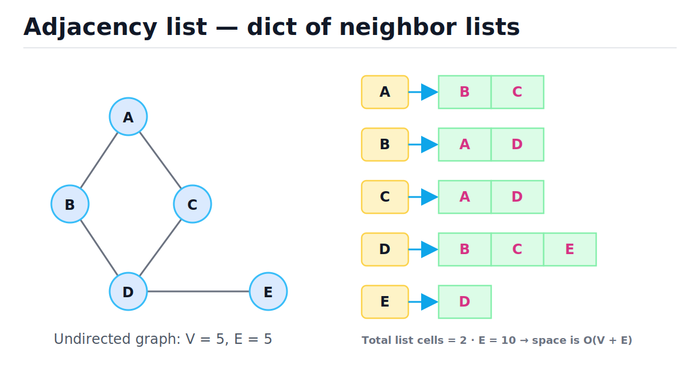
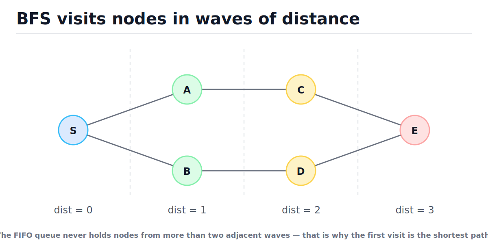
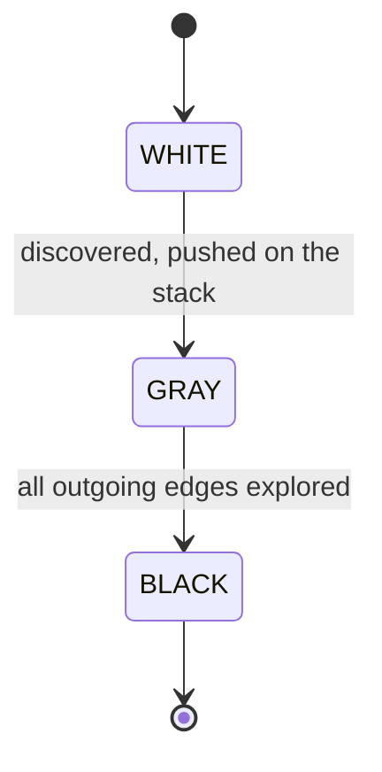
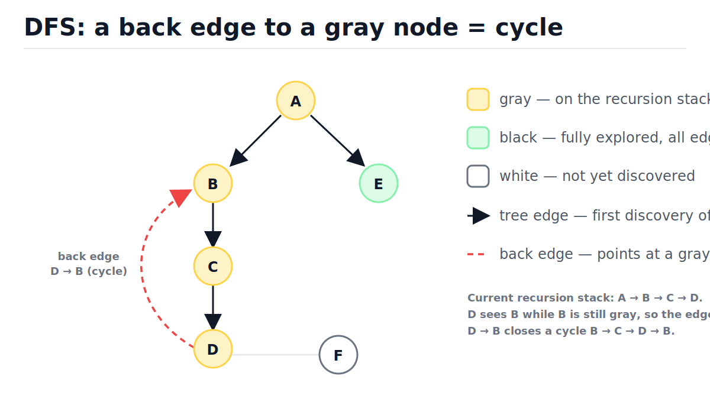
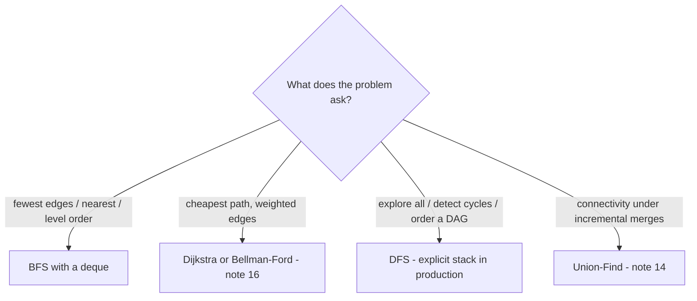

# Graphs, BFS, and DFS

[toc]

> **TL;DR:** A graph is a set of nodes plus a set of pairwise connections, stored almost always as a dict of neighbor lists. BFS explores it with a FIFO queue and visits nodes in increasing distance order, which makes it the shortest-path algorithm for unweighted graphs. DFS explores it with a stack (explicit or the call stack) and is the backbone of cycle detection, connected components, topological sort, and backtracking — both run in O(V + E).

## Vocabulary

These terms carry the rest of the note. Each one gets a canonical symbol and a one-paragraph definition.

**Graph**

```math
G = (V, E)
```

A set of vertices V and a set of edges E connecting pairs of vertices. V and E are also used for the *counts* |V| and |E| inside Big-O expressions.

**Vertex (node)**

```math
u, v \in V
```

A single entity in the graph: a user, an airport, a grid cell, a package. Anything with identity that can be a dict key works as a vertex in Python.

**Edge**

```math
(u, v) \in E \quad \text{(directed)} \qquad \{u, v\} \in E \quad \text{(undirected)}
```

A connection between two vertices. Directed edges are ordered pairs (u → v means you can go from u to v but not back). Undirected edges go both ways and are stored twice in an adjacency list, once per endpoint.

**Degree**

```math
\sum_{u \in V} \deg(u) = 2|E|
```

The number of edges touching a vertex. The identity above is the handshake lemma: every undirected edge contributes to exactly two degrees. It is the entire reason traversals cost O(V + E) and not O(V·E).

**Weighted graph**

```math
w : E \to \mathbb{R}
```

A graph where each edge carries a cost (distance, latency, price). BFS ignores weights; weighted shortest paths need [Dijkstra or Bellman-Ford](./16-shortest-paths-dijkstra-and-bellman-ford.md).

**Path and cycle**

```math
u_0 \to u_1 \to \cdots \to u_k, \qquad \text{cycle when } u_k = u_0 \text{ and } k \ge 1
```

A path is a sequence of vertices connected by consecutive edges. A cycle is a path that returns to its start. A graph with no cycles is *acyclic*; a directed acyclic graph is a DAG (see [Topological Sort](./15-topological-sort-and-dags.md)).

**Connected component**

```math
S \subseteq V \text{ maximal such that every pair in } S \text{ is joined by a path}
```

A maximal island of mutually reachable vertices in an undirected graph. One traversal discovers exactly one component.

**Adjacency list**

```math
\text{adj}[u] = [\, v : (u, v) \in E \,]
```

A mapping from each vertex to the list of its neighbors. Space O(V + E). The default representation for sparse graphs, i.e., almost all real graphs.

**Adjacency matrix**

```math
A \in \{0, 1\}^{|V| \times |V|}, \qquad A_{uv} = 1 \iff (u, v) \in E
```

A 2-D array with a cell for every possible vertex pair. O(1) edge lookup, O(V²) space regardless of how few edges exist.

**Frontier (BFS wave)**

```math
F_k = \{\, v \in V : \text{dist}(s, v) = k \,\}
```

The set of vertices at exactly distance k from the source s. BFS processes the frontiers in order: all of F₀, then all of F₁, then F₂, and so on.

**Back edge**

```math
(u, v) \text{ with } v \text{ an ancestor of } u \text{ on the current DFS stack}
```

An edge from the node being explored to a node that is still *gray* (still on the recursion stack). In a directed graph, a back edge is exactly a cycle.

**Bipartite graph**

```math
V = L \cup R, \quad L \cap R = \varnothing, \quad \text{every edge has one end in } L \text{ and one in } R
```

A graph whose vertices split into two camps with no internal edges. Equivalent to "2-colorable" and to "contains no odd-length cycle".

## Intuition

Forget the math for a second: a graph is a *who-knows-whom* table. Trees and linked lists are graphs with extra promises (no cycles, limited fan-out); a general graph drops all promises, so traversal must remember where it has been. The two traversals differ only in which node they expand next: BFS expands the *oldest* discovered node (queue), DFS expands the *newest* (stack). That one-word difference — queue vs stack — produces completely different exploration shapes.

The figure below shows the representation you will use 95% of the time. Look at how each undirected edge appears twice on the right (B is in A's list, and A is in B's list), and count the cells: 10 cells for 5 edges.



Vertices do not have to be letters or integers. Any hashable object — strings, tuples, frozen dataclasses — can be a dict key, so `("row", "col")` grid coordinates or `"us-east-1b"` zone names work directly as graph nodes. See [Hash Tables](./05-hash-tables.md) for what "hashable" buys you.

## How it works

Everything below runs on the same example graph: undirected edges A–B, A–C, B–D, C–D, D–E. Each subsection is one tool; together they cover the traversal questions interviews and production code actually ask.

### Representations: list vs matrix vs edge list

Three storage layouts dominate, and the choice is a space/lookup tradeoff. Sparse graphs (E ≪ V²) — social networks, road maps, dependency graphs — want adjacency lists. Dense small graphs or workloads dominated by "is there an edge u–v?" checks want a matrix. An edge list is rarely the *working* format, but it is the standard *interchange* format (CSV rows, database tables) and the input [Union-Find / Kruskal](./14-union-find-disjoint-sets.md) consumes directly.

| Representation | Space | Edge check (u, v) | Enumerate neighbors of u | Best for |
| :--- | :--- | :--- | :--- | :--- |
| Adjacency list (dict of lists) | O(V + E) | O(deg u) | O(deg u) | Sparse graphs, all traversals — the default |
| Adjacency matrix (2-D array) | O(V²) | O(1) | O(V) | Dense graphs, V ≤ a few thousand, heavy edge checks |
| Edge list (list of pairs) | O(E) | O(E) | O(E) | Input/interchange format, Kruskal's MST, sorting by weight |

### Building an adjacency list from an edge list

Real input arrives as an edge list — rows from a database, lines from a file. First step of nearly every graph problem: convert it to a dict of lists. For undirected graphs insert each edge in both directions; for directed graphs make sure pure sinks (nodes with no outgoing edges) still get a key, or later lookups will raise `KeyError`.

```python
from collections import defaultdict
from collections.abc import Iterable


def build_adj(
    edges: Iterable[tuple[str, str]], directed: bool = False
) -> dict[str, list[str]]:
    """Edge list -> adjacency dict. O(V + E) time and space."""
    adj: defaultdict[str, list[str]] = defaultdict(list)
    for u, v in edges:
        adj[u].append(v)
        if not directed:
            adj[v].append(u)
        elif v not in adj:
            adj[v] = []          # sink nodes still need a key
    return dict(adj)             # freeze: plain dict, no autovivification


edges = [("A", "B"), ("A", "C"), ("B", "D"), ("C", "D"), ("D", "E")]
adj = build_adj(edges)

assert adj["A"] == ["B", "C"]
assert adj["D"] == ["B", "C", "E"]
# handshake lemma: total list cells == 2 * E
assert sum(len(nbrs) for nbrs in adj.values()) == 2 * len(edges)
```

> [!WARNING]
> Returning the raw `defaultdict` is a footgun: merely *reading* `adj[v]` for an unknown `v` silently inserts an empty list, and inserting keys while you iterate over the dict raises `RuntimeError: dictionary changed size during iteration`. Convert to a plain `dict` once construction is done.

### BFS: traversal in distance order

BFS keeps a FIFO queue of discovered-but-unexpanded nodes. Because the queue is first-in-first-out, every node at distance k is dequeued before any node at distance k+1 — so the *first* time you reach a node is via a fewest-edges path. Record `dist` when you enqueue, record `parent` to reconstruct the path later, and you have unweighted shortest paths for free.

The figure shows the wave structure: nodes are colored by the BFS layer they belong to, and the queue never spans more than two adjacent layers.



```python
from collections import deque
from typing import Optional


def bfs(
    adj: dict[str, list[str]], source: str
) -> tuple[dict[str, int], dict[str, Optional[str]]]:
    """Distances and parents from source. O(V + E) time, O(V) space."""
    dist: dict[str, int] = {source: 0}
    parent: dict[str, Optional[str]] = {source: None}
    queue: deque[str] = deque([source])
    while queue:
        u = queue.popleft()                 # O(1) on deque
        for v in adj[u]:
            if v not in dist:               # mark visited at ENQUEUE time
                dist[v] = dist[u] + 1
                parent[v] = u
                queue.append(v)
    return dist, parent


def reconstruct_path(
    parent: dict[str, Optional[str]], target: str
) -> Optional[list[str]]:
    """Walk parent pointers back to the source. O(path length)."""
    if target not in parent:
        return None                         # unreachable
    path: list[str] = []
    node: Optional[str] = target
    while node is not None:
        path.append(node)
        node = parent[node]
    path.reverse()
    return path


dist, parent = bfs(adj, "A")
assert dist == {"A": 0, "B": 1, "C": 1, "D": 2, "E": 3}
assert reconstruct_path(parent, "E") == ["A", "B", "D", "E"]
assert reconstruct_path(parent, "ZZZ") is None
```

Full trace of `bfs(adj, "A")` — follow the queue and watch the distances only ever increase:

| Step | Dequeued | dist after this step | Queue after | Decision |
| :---: | :---: | :--- | :--- | :--- |
| 1 | A | A:0, B:1, C:1 | [B, C] | B, C unseen → set dist 1, parent A, enqueue both |
| 2 | B | + D:2 | [C, D] | A already seen, skip; D unseen → dist 2, parent B |
| 3 | C | no change | [D] | A and D both seen → nothing to do |
| 4 | D | + E:3 | [E] | B, C seen; E unseen → dist 3, parent D |
| 5 | E | no change | [] | D seen; queue empty → done |

> [!IMPORTANT]
> Mark a node visited when you **enqueue** it, not when you dequeue it. Marking late lets the same node sit in the queue many times (once per incoming edge), inflating memory to O(E) and re-scanning neighbors on every duplicate pop. The `if v not in dist` check at enqueue time is the whole invariant.

> [!WARNING]
> Never use `list.pop(0)` as your queue — it shifts every remaining element left, making each pop O(n) and the whole BFS O(V²). `collections.deque.popleft()` is O(1). Details in [Stacks and Queues](./04-stacks-and-queues.md).

### DFS: recursive and iterative

DFS commits to one neighbor and goes as deep as possible before backtracking. The recursive form is the algorithm stated directly — the call stack *is* the data structure. The iterative form replaces it with an explicit list-as-stack, which you need in production because CPython's default recursion limit is about 1000 frames.

```python
from typing import Optional


def dfs_recursive(
    adj: dict[str, list[str]], u: str, visited: Optional[set[str]] = None
) -> list[str]:
    """Preorder DFS. O(V + E) time, O(V) space (visited + call stack)."""
    if visited is None:
        visited = set()
    visited.add(u)
    order: list[str] = [u]
    for v in adj[u]:
        if v not in visited:
            order.extend(dfs_recursive(adj, v, visited))
    return order


def dfs_iterative(adj: dict[str, list[str]], source: str) -> list[str]:
    """Same visit order as the recursive version, explicit stack."""
    visited: set[str] = set()
    order: list[str] = []
    stack: list[str] = [source]
    while stack:
        u = stack.pop()
        if u in visited:        # may have been pushed twice — skip
            continue
        visited.add(u)
        order.append(u)
        for v in reversed(adj[u]):   # reversed => match recursive order
            if v not in visited:
                stack.append(v)
    return order


assert dfs_recursive(adj, "A") == ["A", "B", "D", "C", "E"]
assert dfs_iterative(adj, "A") == ["A", "B", "D", "C", "E"]
```

Two details people miss in the iterative version. First, a node can be pushed more than once (C above is pushed by A and again by D), so you must skip already-visited nodes at *pop* time. Second, `reversed(adj[u])` makes the stack pop neighbors in their original left-to-right order, matching the recursive version exactly — without it the traversal is still a valid DFS, just mirrored.

| Step | Popped | Visited? | Pushed | Stack after |
| :---: | :---: | :---: | :--- | :--- |
| 1 | A | new → visit | C, B | [C, B] |
| 2 | B | new → visit | D | [C, D] |
| 3 | D | new → visit | E, C | [C, E, C] |
| 4 | C | new → visit | — | [C, E] |
| 5 | E | new → visit | — | [C] |
| 6 | C | already visited → skip | — | [] |

> [!CAUTION]
> Recursive DFS on a path-shaped graph of ~1000 nodes raises `RecursionError` in CPython (default limit 1000). `sys.setrecursionlimit` can raise the cap, but past a few tens of thousands of frames you risk an actual C-stack segfault that no `except` can catch. For graphs of unknown size, write the iterative version.

### Connected components

In an undirected graph, "how many islands of nodes are there?" is answered by looping over all vertices and launching a traversal from every vertex not yet seen. Each launch flood-fills exactly one component. The visited set is shared across launches, so the total work over all launches is still O(V + E).

```python
def connected_components(
    adj: dict[str, list[str]], nodes: list[str]
) -> list[list[str]]:
    """All components of an undirected graph. O(V + E)."""
    seen: set[str] = set()
    components: list[list[str]] = []
    for start in nodes:
        if start in seen:
            continue
        comp: list[str] = []
        stack: list[str] = [start]
        seen.add(start)
        while stack:
            u = stack.pop()
            comp.append(u)
            for v in adj[u]:
                if v not in seen:
                    seen.add(v)
                    stack.append(v)
        components.append(comp)
    return components


two_islands = build_adj([("A", "B"), ("C", "D")])
comps = connected_components(two_islands, list(two_islands))
assert sorted(sorted(c) for c in comps) == [["A", "B"], ["C", "D"]]
```

One scoping caveat: if edges arrive *incrementally* and you only ever ask "are u and v connected right now?", a traversal per query is wasteful — that workload belongs to [Union-Find](./14-union-find-disjoint-sets.md), which answers connectivity in near-O(1) amortized per operation.

### Cycle detection

Undirected and directed graphs need different tests. **Undirected:** during traversal, seeing an already-visited neighbor is normal *if* it is the node you just came from (every undirected edge points back at your parent). Seeing any *other* visited node means two different paths reached the same place — a cycle. **Directed:** the parent trick fails (u → v and v → u are two distinct edges), so use three colors: white = untouched, gray = currently on the stack, black = fully explored. An edge into a *gray* node is a back edge, and a back edge is exactly a cycle.

```python
from typing import Optional


def has_cycle_undirected(adj: dict[str, list[str]], nodes: list[str]) -> bool:
    """Parent-tracking DFS over every component. O(V + E)."""
    seen: set[str] = set()
    for start in nodes:
        if start in seen:
            continue
        seen.add(start)
        stack: list[tuple[str, Optional[str]]] = [(start, None)]
        while stack:
            u, par = stack.pop()
            for v in adj[u]:
                if v not in seen:
                    seen.add(v)
                    stack.append((v, u))
                elif v != par:          # visited and NOT the way we came
                    return True
    return False


WHITE, GRAY, BLACK = 0, 1, 2


def has_cycle_directed(adj: dict[str, list[str]], nodes: list[str]) -> bool:
    """White/gray/black coloring DFS. O(V + E)."""
    color: dict[str, int] = {u: WHITE for u in nodes}

    def visit(u: str) -> bool:
        color[u] = GRAY                  # entered the stack
        for v in adj[u]:
            if color[v] == GRAY:         # back edge -> cycle
                return True
            if color[v] == WHITE and visit(v):
                return True
        color[u] = BLACK                 # left the stack, fully done
        return False

    return any(visit(u) for u in nodes if color[u] == WHITE)


tree = build_adj([("A", "B"), ("A", "C")])
assert has_cycle_undirected(tree, list(tree)) is False
assert has_cycle_undirected(adj, list(adj)) is True      # A-B-D-C-A

dag = build_adj([("A", "B"), ("B", "C"), ("A", "C")], directed=True)
loop = build_adj([("A", "B"), ("B", "C"), ("C", "A")], directed=True)
assert has_cycle_directed(dag, list(dag)) is False
assert has_cycle_directed(loop, list(loop)) is True
```

The color lifecycle is a tiny state machine — a node only ever moves forward through it:



The figure freezes a DFS mid-run: A → B → C → D are gray (on the stack), E is black (finished), F is white (untouched). D discovers an edge to gray B — that single observation proves the cycle B → C → D → B.



> [!IMPORTANT]
> An edge into a **black** node is *not* a cycle — it is a cross or forward edge, two different paths into already-finished work (think diamond A → B, A → C, B → D, C → D). Only **gray** targets mean a cycle. Collapsing gray and black into one "visited" flag is the classic wrong answer for directed graphs.

### Bipartite check by 2-coloring

A graph is bipartite when its vertices can be split into two camps with every edge crossing camps — users vs items in a recommender, jobs vs machines in matching. Test it by BFS-coloring: the source gets color 0, every neighbor gets the opposite color, and if an edge ever joins two same-colored nodes the graph contains an odd cycle and is not bipartite. Loop over all components, since the graph may be disconnected.

```python
from collections import deque


def is_bipartite(adj: dict[str, list[str]], nodes: list[str]) -> bool:
    """2-color with BFS; conflict == odd cycle. O(V + E)."""
    color: dict[str, int] = {}
    for start in nodes:
        if start in color:
            continue
        color[start] = 0
        queue: deque[str] = deque([start])
        while queue:
            u = queue.popleft()
            for v in adj[u]:
                if v not in color:
                    color[v] = color[u] ^ 1     # flip 0 <-> 1
                    queue.append(v)
                elif color[v] == color[u]:
                    return False
    return True


assert is_bipartite(adj, list(adj)) is True       # only even cycles
triangle = build_adj([("A", "B"), ("B", "C"), ("C", "A")])
assert is_bipartite(triangle, list(triangle)) is False
```

### Grids as implicit graphs

A 2-D grid is a graph you never build: each cell is a vertex and the 4-neighbor offsets *are* its adjacency list, computed on the fly. This is the single highest-frequency interview pattern in this note — number of islands, shortest path in a maze, flood fill, rotting oranges are all "traversal over an implicit grid graph". Counting islands is connected components where the component launch loop scans cells.

```python
def count_islands(grid: list[str]) -> int:
    """Connected components of '1' cells, 4-directional. O(rows * cols)."""
    if not grid:
        return 0
    rows, cols = len(grid), len(grid[0])
    seen = [[False] * cols for _ in range(rows)]
    offsets = ((-1, 0), (1, 0), (0, -1), (0, 1))   # up, down, left, right

    def flood(r: int, c: int) -> None:
        stack = [(r, c)]
        seen[r][c] = True
        while stack:
            cr, cc = stack.pop()
            for dr, dc in offsets:
                nr, nc = cr + dr, cc + dc
                if (
                    0 <= nr < rows
                    and 0 <= nc < cols
                    and grid[nr][nc] == "1"
                    and not seen[nr][nc]
                ):
                    seen[nr][nc] = True
                    stack.append((nr, nc))

    count = 0
    for r in range(rows):
        for c in range(cols):
            if grid[r][c] == "1" and not seen[r][c]:
                count += 1
                flood(r, c)
    return count


grid = [
    "11000",
    "11000",
    "00100",
    "00011",
]
assert count_islands(grid) == 3
```

> [!TIP]
> Always bounds-check **before** indexing (`0 <= nr < rows and 0 <= nc < cols` first in the `and` chain). Python's negative indexing means `grid[-1][c]` silently wraps to the last row instead of failing — a wrong-answer bug, not a crash, so tests are the only thing that catches it.

## Complexity

Both traversals touch every vertex once and examine every edge a constant number of times, so they are linear in the *size of the graph*, which is V + E, not V alone. Everything in this note inherits that bound because everything is a traversal with O(1) extra work per node or edge. See [Big-O Notation](./01-big-o-notation-and-complexity-analysis.md) for the analysis toolkit.

| Operation / algorithm | Best | Average | Worst | Extra space |
| :--- | :---: | :---: | :---: | :---: |
| Build adjacency list from edge list | O(V + E) | O(V + E) | O(V + E) | O(V + E) |
| Edge check (u, v) — adjacency list | O(1) | O(deg u) | O(deg u) | — |
| Edge check (u, v) — adjacency matrix | O(1) | O(1) | O(1) | O(V²) total |
| Enumerate neighbors — list / matrix | O(deg u) / O(V) | O(deg u) / O(V) | O(deg u) / O(V) | — |
| BFS (full traversal) | O(V + E) | O(V + E) | O(V + E) | O(V) queue + maps |
| BFS (search for target) | O(1) | O(V + E) | O(V + E) | O(V) |
| DFS — recursive or iterative | O(V + E) | O(V + E) | O(V + E) | O(V) stack + set |
| Connected components | O(V + E) | O(V + E) | O(V + E) | O(V) |
| Cycle detection (undirected / directed) | O(V + E) | O(V + E) | O(V + E) | O(V) |
| Bipartite 2-coloring | O(V + E) | O(V + E) | O(V + E) | O(V) |
| Grid traversal / island count | O(R·C) | O(R·C) | O(R·C) | O(R·C) |

The key bound falls out of the handshake lemma. Each vertex is dequeued (or popped) exactly once at constant cost c₁, and at that moment its whole neighbor list is scanned at cost c₂ per neighbor:

```math
T(V, E) = \sum_{u \in V} \bigl( c_1 + c_2 \deg(u) \bigr)
        = c_1 |V| + c_2 \sum_{u \in V} \deg(u)
        = c_1 |V| + 2 c_2 |E|
        = O(V + E)
```

For directed graphs the sum of out-degrees equals |E| exactly (each edge counted once instead of twice) — same bound. The visited-set check is what makes the "exactly once" claim true: without it, a cycle re-feeds nodes into the queue forever. A grid is the special case V = R·C with at most 2·R·C distinct undirected adjacencies, so O(V + E) collapses to O(R·C).

## Memory model in Python

The Big-O hides constant factors that CPython makes unusually large, and knowing them changes how you write graph code at scale. The dict-of-lists is three layers of pointer indirection: a hash table of key/value pointer pairs, each value pointing to a `PyListObject` (56-byte header plus an over-allocated array of 8-byte pointers), each pointer pointing to a heap-allocated node object. Traversal is pure pointer chasing — nearly every neighbor dereference is a cache miss because neighbor objects live at unrelated heap addresses. An adjacency *matrix* row, by contrast, is contiguous memory the prefetcher loves, which is why for small dense graphs the "worse" O(V²) structure can win on the wall clock. Object layout details live in [Memory Model and PyObject Layout](../Programming-Languages/Python/13-memory-model-and-pyobject-layout.md).

The supporting structures matter too:

- **`collections.deque`** is a doubly-linked list of fixed 64-slot blocks. `append` and `popleft` are true O(1) with no reallocation, and memory is reclaimed block-by-block as the BFS frontier shrinks. A plain `list` used as a queue pays an O(n) `memmove` on every `pop(0)`.
- **`set` / `dict` visited checks** are open-addressing hash tables — O(1) average lookups, but each entry costs ~60–100 bytes. A visited set for 10 million int nodes is on the order of a gigabyte; for dense integer ID spaces a preallocated list of booleans (or a `bytearray`) is roughly 10× smaller and faster.
- **Recursion** allocates a Python frame object per call on top of C-stack usage. The ~1000-frame default limit means recursive DFS dies on a 1000-node path graph. Iterative DFS keeps the pending-node stack as a flat list of pointers on the heap — bounded only by RAM.
- **Grid problems** don't need a visited set at all if you may mutate the input: flipping `"1"` cells to `"0"` (or marking a NumPy array in place) removes the hash overhead entirely.

Library reality check: `networkx` stores graphs as dict-of-dict-of-dict, paying these constants several times over for flexibility — fine for analysis, wrong for hot paths. Performance-critical Python graph code usually flattens to integer node IDs and list-of-lists (or CSR arrays in `scipy.sparse`). More on stdlib performance tradeoffs in [Performance and the Standard Library](../Programming-Languages/Python/10-performance-and-the-standard-library.md).

## Real-world example

You operate a flight-search backend. Airports are vertices, direct flights are undirected edges, and "fewest connections from SFO to SYD" is exactly unweighted shortest path — BFS with a parent map, then walk the parents backward. The same shape appears as "degrees of separation" in social graphs and "minimum hops" in network routing.

```python
from typing import Optional


def fewest_hops(
    flights: list[tuple[str, str]], origin: str, dest: str
) -> Optional[list[str]]:
    """Route with fewest connections, or None if unreachable. O(V + E)."""
    adj = build_adj(flights)                 # undirected: flights go both ways
    if origin not in adj:
        return None
    _, parent = bfs(adj, origin)
    return reconstruct_path(parent, dest)


flights = [
    ("SFO", "LAX"), ("SFO", "SEA"),
    ("SEA", "NRT"), ("LAX", "NRT"),
    ("NRT", "SYD"),
    ("JFK", "BOS"),                          # separate component
]

route = fewest_hops(flights, "SFO", "SYD")
assert route == ["SFO", "LAX", "NRT", "SYD"]   # 3 hops, provably minimal
assert fewest_hops(flights, "SFO", "BOS") is None   # different component
assert fewest_hops(flights, "XXX", "SYD") is None   # unknown origin
```

Note what BFS guarantees and what it does not: the route has the fewest *legs*, but says nothing about total flight time or price. The moment edges carry weights (minutes, dollars), reach for [Dijkstra](./16-shortest-paths-dijkstra-and-bellman-ford.md).

## When to use / when NOT to use

Choosing between BFS, DFS, and their neighbors is a one-question decision tree: what does the problem actually ask for? Distance questions force BFS; exhaustive-exploration and structure questions (cycles, ordering, components) usually read more naturally as DFS; weighted or union-heavy workloads leave this note entirely.



- **Use BFS** for shortest path in unweighted graphs, level-by-level processing, "minimum number of moves" puzzles, web-crawl frontiers, and nearest-match searches that should stop early.
- **Use DFS** for cycle detection, [topological sort](./15-topological-sort-and-dags.md), connected components, maze/flood fill, and as the engine inside [backtracking](./21-backtracking.md).
- **Do NOT use BFS/DFS** for weighted shortest paths (wrong answer, not just slow), for repeated connectivity queries under edge insertions (Union-Find amortizes far better), or when the graph is an explicit tree with parent pointers and a simpler walk exists ([Trees and Binary Trees](./06-trees-and-binary-trees.md)).
- **Watch memory on huge breadth.** BFS's frontier on a wide graph (branching factor b, depth d) holds O(b^d) nodes; DFS holds only O(depth). On bushy state-space searches that asymmetry decides which one fits in RAM.

## Common mistakes

- **"Mark visited when dequeuing is the same thing"** — marking at dequeue lets one node enter the queue once per incoming edge: memory bloats to O(E) and neighbors get re-scanned per duplicate. Mark at enqueue.
- **"DFS finds shortest paths too"** — DFS reaches the target by whatever path it stumbles into first; only BFS's distance-ordered dequeue proves minimality.
- **"`visited` is optional if the graph looks tree-like"** — one cycle anywhere and the traversal loops forever. The visited set is load-bearing, always.
- **"Recursive DFS is fine, Python will manage"** — ~1000-frame default recursion limit; a 1500-node path graph crashes. Iterative with an explicit stack for unknown inputs.
- **"For directed cycles, one visited flag is enough"** — a diamond (A→B→D, A→C→D) revisits D with no cycle present. You need gray-vs-black: only an edge to a *gray* node is a back edge.
- **"The undirected parent trick is bulletproof"** — it breaks on multigraphs: a parallel edge or self-loop *is* a cycle but `v == par` masks it. Deduplicate edges or count parent sightings.
- **"`list.pop(0)` is a queue"** — it is an O(n) shift per pop, turning BFS into O(V²). Use `collections.deque`.
- **"Bipartite means acyclic"** — bipartite means no *odd* cycles. A square (4-cycle) is bipartite; a triangle is not.

## Interview questions and answers

A short setup, then the answer the interviewer wants to hear, in spoken style.

**1. Why is BFS O(V + E) and not O(V·E)?**
**Answer:** Each vertex enters the queue at most once because we mark it visited at enqueue time. When it's dequeued we scan its adjacency list once, so the total edge work is the sum of all degrees — which is 2E by the handshake lemma. Constant work per vertex plus constant work per edge gives O(V + E).

**2. When does BFS give shortest paths, and when does it break?**
**Answer:** BFS is optimal exactly when every edge costs the same — it dequeues nodes in nondecreasing distance, so first arrival is minimal. The moment edges have different weights that invariant dies, and I'd switch to Dijkstra, or Bellman-Ford if weights can be negative. One fun middle case: 0/1 weights work with a deque variant that pushes 0-edges to the front.

**3. How do you actually return the path, not just the distance?**
**Answer:** Keep a parent map — when I discover v from u, I record parent[v] = u. After the search, I walk from the target back through parents to the source and reverse the list. It's O(path length) extra, and the map doubles as my visited set.

**4. Cycle detection: how does it differ between undirected and directed graphs?**
**Answer:** Undirected — during DFS, any visited neighbor other than the node I just came from means a cycle, because undirected edges always point back at the parent once. Directed — that fails since u→v and v→u are different edges, so I use three colors: an edge into a gray node, one still on my stack, is a back edge and proves a cycle. An edge into a black node is just a cross or forward edge and is harmless.

**5. Recursive vs iterative DFS — when does each break?**
**Answer:** Recursive is cleaner but rides the call stack: CPython caps it near 1000 frames, so a long path graph throws RecursionError, and cranking the limit risks a real C-stack crash. Iterative uses a heap-allocated list as the stack and only dies when RAM does. One subtlety in the iterative version: nodes can be pushed twice, so you skip already-visited nodes at pop time.

**6. Adjacency list vs matrix — when would you ever take the matrix?**
**Answer:** Lists are the default: O(V+E) space and you only pay for edges that exist. I'd take the matrix when the graph is dense or small and the workload is dominated by O(1) edge-existence checks — say Floyd-Warshall, or a few thousand nodes with heavy pairwise queries. It also has a cache-locality edge since rows are contiguous, while list traversal is pointer chasing.

**7. How do you check if a graph is bipartite, and what's the underlying theorem?**
**Answer:** BFS and alternate two colors level by level; if I ever see an edge whose endpoints share a color, it's not bipartite. The theorem is that a graph is bipartite iff it has no odd-length cycle — the color conflict is exactly the moment an odd cycle closes. You have to run it per component since the graph might be disconnected.

**8. Number of islands — talk through your approach and its cost.**
**Answer:** Treat the grid as an implicit graph: each land cell is a node, the four offsets are its edges computed on the fly. Scan every cell; when I hit unvisited land, that's one new island, and I flood-fill it with an iterative DFS or BFS marking cells as seen. Every cell is visited a constant number of times, so it's O(rows × cols) time, and space is the seen matrix plus the worst-case stack — same order.

**9. Your BFS is correct but too slow on a huge graph — what do you look at first?**
**Answer:** Constant factors, in order: am I using deque or list.pop(0); am I marking visited at enqueue or letting duplicates flood the queue; are my nodes heavy objects when integer IDs plus a flat boolean array would do; and can I terminate early once the target is dequeued instead of exhausting the graph. If it's a known-target search, bidirectional BFS cuts the explored frontier from b^d to roughly two b^(d/2) balls.

## Practice path

Work these in order; each drill adds exactly one new mechanic on top of the previous one.

1. Hand-build the adjacency list for edges A–B, A–C, B–D, C–D, D–E and verify the cell count equals 2E.
2. Run BFS from A on paper, filling a trace table (queue, dist, parent) — then check it against the table in this note.
3. Implement `bfs` + `reconstruct_path` from memory; test the unreachable-target case.
4. Implement iterative DFS and make its output match the recursive version (the `reversed` trick).
5. Implement connected components and test on a two-island graph.
6. Implement both cycle detectors; construct a diamond DAG that fools a one-flag directed detector and confirm yours rejects it.
7. Implement `is_bipartite`; test an even cycle (passes) and a triangle (fails).
8. Solve number-of-islands on a grid without building an explicit graph, then re-solve replacing the seen matrix with in-place mutation.
9. Graduate to [Topological Sort](./15-topological-sort-and-dags.md) and [Dijkstra](./16-shortest-paths-dijkstra-and-bellman-ford.md) — both are this note's traversals plus one new idea each.

## Copyable takeaways

- Graph = dict of neighbor lists; build it from the edge list in O(V + E), insert undirected edges twice, give sinks a key.
- BFS = deque + visited-at-enqueue; visits in distance order, so first arrival = fewest edges. Parent map gives the path.
- DFS = stack (call stack or explicit); recursive dies near 1000 frames in CPython — iterative for real inputs.
- Both traversals are O(V + E) by the handshake lemma: constant work per vertex, constant work per edge.
- Components: launch a traversal from every unseen node; each launch = one component.
- Cycles: undirected → visited neighbor that isn't your parent; directed → edge into a gray (on-stack) node. Black targets are not cycles.
- Bipartite ⇔ 2-colorable ⇔ no odd cycle; check by alternate-coloring BFS per component.
- Grids are implicit graphs: 4 offsets, bounds-check before indexing, O(R·C).
- `list.pop(0)` is not a queue. `collections.deque` is.

## Sources

Primary references only — these are the chapters and docs this note compresses.

- Cormen, Leiserson, Rivest, Stein, *Introduction to Algorithms*, 4th ed., Chapter 20 "Elementary Graph Algorithms" (BFS §20.2, DFS §20.3; Chapter 22 in the 3rd ed.).
- Sedgewick & Wayne, *Algorithms*, 4th ed., §4.1 "Undirected Graphs" and §4.2 "Directed Graphs" — companion site: https://algs4.cs.princeton.edu/40graphs/
- `collections.deque` — https://docs.python.org/3/library/collections.html#collections.deque
- Python operation costs — https://wiki.python.org/moin/TimeComplexity
- `sys.setrecursionlimit` and its caveats — https://docs.python.org/3/library/sys.html#sys.setrecursionlimit

## Related

- [Stacks and Queues](./04-stacks-and-queues.md) — the deque and stack machinery both traversals run on.
- [Hash Tables](./05-hash-tables.md) — why dict/set visited checks are O(1).
- [Trees and Binary Trees](./06-trees-and-binary-trees.md) — graphs with the no-cycle promise restored.
- [Union-Find / Disjoint Sets](./14-union-find-disjoint-sets.md) — connectivity under incremental edge insertion.
- [Topological Sort and DAGs](./15-topological-sort-and-dags.md) — DFS finish order put to work.
- [Shortest Paths: Dijkstra and Bellman-Ford](./16-shortest-paths-dijkstra-and-bellman-ford.md) — what replaces BFS when edges have weights.
