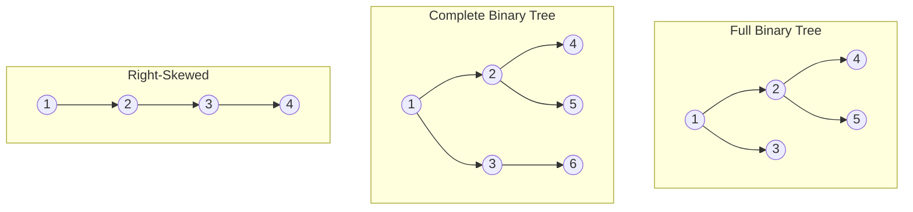

# Trees

[toc]

> **TL;DR:** A tree is a hierarchical, non-linear data structure built from nodes connected by directed edges, with exactly one root and no cycles. Binary trees — where every node has at most two children — are the foundation for BSTs, heaps, expression trees, and countless algorithms. Mastering traversals (DFS preorder/inorder/postorder, BFS level-order) and structural queries (height, diameter, LCA, balance) covers the bulk of tree interview problems and system internals alike.

## Vocabulary

**Tree** — a connected, acyclic, directed graph of nodes where every non-root node has exactly one parent.

**Root** — the unique top-level node with no parent (e.g., node 10 in a tree rooted at 10).

**Edge** — a directed link connecting a parent node to a child node.

**Parent / Child** — a node P is the parent of C if there is an edge from P to C.

**Siblings** — nodes that share the same parent.

**Leaf (external node)** — a node with zero children; degree 0.

**Internal node** — any non-leaf node; has at least one child.

**Depth of a node** — number of edges on the path from the root to that node. Root has depth 0.

**Height of a node** — number of edges on the longest path from that node down to a leaf. A leaf has height 0.

**Height of the tree** — height of the root node.

**Level** — all nodes at the same depth form a level. Level 0 = {root}.

**Degree** — number of direct children of a node. Leaves have degree 0.

**Ancestor** — any node on the path from the root to a given node (exclusive of the node itself, or inclusive depending on definition — the notes use inclusive of root, exclusive of self).

**Descendant** — any node in the subtree rooted at a given node (excluding the node itself).

**Binary tree** — a tree where every node has at most 2 children, conventionally called left and right.

**Full binary tree** — every node has exactly 0 or 2 children (no node has exactly 1 child).

**Complete binary tree** — all levels are fully filled except possibly the last, which is filled left to right.

**Perfect binary tree** — all internal nodes have exactly 2 children and all leaves are at the same level.

**Balanced binary tree (height-balanced)** — for every node, the absolute difference in heights of its left and right subtrees is at most 1.

**Skewed tree** — a degenerate tree where every node has at most one child; effectively a linked list.

**BST property** — in a binary search tree, for every node N: all values in N's left subtree are strictly less than N's value, and all in the right subtree are strictly greater.

**Heap property (min-heap)** — every node's value is less than or equal to its children's values; the minimum is always at the root.

**Heap property (max-heap)** — every node's value is greater than or equal to its children's values; the maximum is at the root.

**Trie (prefix tree)** — a tree where each path from root to a node spells a prefix; edges represent characters. Used for O(L) string lookup where L is string length.

**Traversal** — a systematic visit of every node exactly once. DFS variants (preorder, inorder, postorder) use a stack (explicit or call stack). BFS level-order uses a queue.

**LCA (Lowest Common Ancestor)** — for nodes n1 and n2, the deepest node that is an ancestor of both.

**Diameter** — the longest path between any two leaves in the tree (measured in number of edges or nodes depending on convention).

**Serialization** — encoding a tree to a string/array that can later be decoded back to the identical structure.

---

## Intuition

Think of a file system: `/` is the root, directories are internal nodes, files are leaves. Every file has exactly one parent directory, and every directory can have many children. That hierarchical structure — no cycles, single parent, branching downward — is a tree. Algorithms on trees almost always have a recursive flavor: "solve for the left subtree, solve for the right subtree, combine at the root." This divide-and-conquer structure is what makes trees fast: you eliminate half the search space at each level in a balanced tree, giving O(log n) operations instead of O(n).

For heaps, picture a tournament bracket where the winner of each match (the smaller value in a min-heap) bubbles up. The array representation exploits the complete-tree property to compute parent and child indices with arithmetic alone — no pointers needed, cache-friendly, and used by every production priority queue.

---

## Math foundations

Five foundational results that explain *why* tree algorithms have the complexities they do. Understanding these derivations prevents cargo-culting O(log n) and O(n) claims without justification.

### Counting nodes in a perfect binary tree

At depth d, a perfect binary tree has exactly 2^d nodes — one root doubles into two, each doubles into four, and so on. Summing all levels from 0 to h gives the total node count as a geometric series. Inverting to solve for h as a function of n is the basis for every "BST operations are O(log n)" claim.

```math
\text{Nodes at depth } d = 2^d
```

```math
n = \sum_{d=0}^{h} 2^d = 2^{h+1} - 1 \quad \Longrightarrow \quad h = \lfloor \log_2 n \rfloor
```

> [!IMPORTANT]
> This bound only holds for **perfect** binary trees. A BST built from sorted input degenerates to a right-skewed list with h = n - 1. The O(log n) height guarantee requires the tree to be balanced — it is not automatic.

### Height vs number-of-nodes — AVL recurrence

The AVL height bound comes from asking: what is the *minimum* number of nodes N(h) a height-balanced tree of height h can contain? The worst case is a Fibonacci tree — each subtree is as sparse as possible while still satisfying the balance invariant. This gives a Fibonacci-like recurrence whose closed form bounds AVL height to 1.44 log2 n.

```math
N(h) = N(h-1) + N(h-2) + 1, \quad N(0) = 1,\quad N(1) = 2
```

The closed form follows from the substitution M(h) = N(h) + 1, which satisfies M(h) = M(h-1) + M(h-2) — pure Fibonacci. Using the Fibonacci closed form:

```math
N(h) \approx \frac{\varphi^{h+3}}{\sqrt{5}} - 1, \quad \varphi = \frac{1 + \sqrt{5}}{2} \approx 1.618
```

Inverting — if a height-balanced tree has n nodes, its height satisfies:

```math
h \leq 1.44 \cdot \log_2(n + 2) - 0.328
```

This is why AVL operations are O(log n) in the worst case: the height is bounded by a constant factor times log2 n, and that constant is at most 1.44.

### Number of distinct binary trees on n nodes — Catalan numbers

The number of structurally distinct binary trees (and of distinct BSTs on n keys in fixed sorted order) is the nth Catalan number. This arises because each of the n! insertion orders into an empty BST can produce a different shape, and the number of distinct shapes is C_n. Catalan numbers appear whenever a recursive binary split partitions a sequence of size n into a left part of size k and right part of size n-1-k for k = 0, 1, ..., n-1.

```math
C_n = \frac{1}{n+1} \binom{2n}{n} = \frac{(2n)!}{(n+1)!\, n!}
```

The first few values: C_0 = 1, C_1 = 1, C_2 = 2, C_3 = 5, C_4 = 14, C_5 = 42. Asymptotically C_n ~ 4^n / (n^(3/2) * sqrt(pi)), growing exponentially. See also [[07-stacks]] for Catalan numbers in the context of valid parenthesizations and stack-sortable permutations.

> [!NOTE]
> The number of structurally distinct BSTs on n *distinct keys* is C_n because the relative order of the keys — not their actual values — determines tree shape. C_3 = 5 means there are exactly 5 BST shapes for any 3-element set.

### Build-heap O(n) proof

The naive analysis counts n calls to `heapify_down` each costing O(log n) and concludes O(n log n) — but this overcounts badly. Nodes near the bottom of the tree are the vast majority, and they have small heights, so their sift-down calls are cheap. The exact cost is a sum weighted by node height that evaluates via the derivative of the geometric series.

```math
\sum_{h=0}^{\lfloor \log n \rfloor} \left\lfloor \frac{n}{2^{h+1}} \right\rfloor \cdot h
\;\leq\; n \sum_{h=0}^{\infty} \frac{h}{2^{h+1}}
= \frac{n}{2} \sum_{h=0}^{\infty} h \cdot \left(\frac{1}{2}\right)^h
```

Using the identity obtained by differentiating the geometric series sum x^k = 1/(1-x) with respect to x:

```math
\sum_{h=0}^{\infty} h \cdot x^h = \frac{x}{(1-x)^2}
```

Substituting x = 1/2:

```math
\sum_{h=0}^{\infty} h \cdot \left(\frac{1}{2}\right)^h = \frac{1/2}{(1 - 1/2)^2} = \frac{1/2}{1/4} = 2
```

Therefore:

```math
\text{Total build-heap work} \leq \frac{n}{2} \cdot 2 = n \quad \Longrightarrow \quad \text{build-heap} \in O(n)
```

> [!TIP]
> The intuition: roughly n/2 leaves do zero sift-down work, n/4 nodes at height 1 do one swap, n/8 at height 2 do two swaps, and so on. Work is front-loaded at the bottom of the tree where nodes are cheap to fix. The O(n log n) estimate comes from incorrectly applying O(log n) to every node — it only applies to the root.

### Tree traversal as a recurrence

Every recursive tree traversal satisfies the same recurrence regardless of tree shape, explaining why preorder, inorder, postorder, and BFS all cost Theta(n). Contrasting traversal with BST search makes the O(log n) of search feel earned rather than assumed.

For any single-visit DFS traversal (preorder, inorder, postorder):

```math
T(n) = T(L) + T(R) + O(1), \quad L + R + 1 = n
```

No matter how L and R partition n-1 (skewed: L=0, R=n-1; balanced: L=R=(n-1)/2), the recurrence tree has exactly n leaves each contributing O(1), giving T(n) = Theta(n).

For BST *search* on a balanced tree, only one subtree is visited per level:

```math
T(n) = T(n/2) + O(1) \quad \Longrightarrow \quad T(n) = O(\log n)
```

On a skewed BST, search degenerates:

```math
T(n) = T(n-1) + O(1) \quad \Longrightarrow \quad T(n) = O(n)
```

This is why balancing is critical for *search* (and insert/delete) but irrelevant for *traversal* — traversal visits every node regardless.

## Memory Layout

Understanding the two physical representations prevents confusion about when to use each.

### Linked-node representation

Each node is a heap-allocated object with a data field and pointers (references) to left and right children. This is the natural choice for general binary trees — structure is not constrained to be complete.

```
    ┌─────────────────┐
    │  data = 10      │
    │  left  ─────────┼──►  ┌────────────┐
    │  right ─────────┼──►  │  data = 30 │
    └─────────────────┘     │  left  ────┼──► NULL
                            │  right ────┼──► ...
                            └────────────┘
```

```python
from __future__ import annotations
from dataclasses import dataclass, field
from typing import Optional

@dataclass
class TreeNode:
    val: int
    left: Optional["TreeNode"] = field(default=None)
    right: Optional["TreeNode"] = field(default=None)
```

Pointer overhead: 2 references per node (16 bytes on 64-bit Python). Cache locality is poor for large trees because nodes are scattered across the heap.

### Array representation (complete trees only)

For a **complete** binary tree stored in a 1-indexed array (index 0 unused or used for size), node at index `i` has:

```
parent(i)       = i // 2
left_child(i)   = 2*i
right_child(i)  = 2*i + 1
```

For 0-indexed arrays (Python lists), node at index `i` has:

```math
\text{left}(i) = 2i + 1, \quad \text{right}(i) = 2i + 2, \quad \text{parent}(i) = \lfloor (i-1)/2 \rfloor
```

**Example — complete tree with values [10, 20, 30, 40, 5, 8, 80]:**

```
Index:   0   1   2   3   4   5   6
Array: [10, 20, 30, 40,  5,  8, 80]

         10          (idx 0)
        /  \
      20    30       (idx 1, 2)
     / \   / \
   40   5  8  80     (idx 3, 4, 5, 6)
```

This is why heaps always use the array representation: the complete-tree invariant is maintained by design (heapify only touches the filled prefix), and index arithmetic is O(1) with no pointer chasing.

> [!IMPORTANT]
> The array representation is **only valid for complete trees**. An arbitrary binary tree stored in an array would waste O(n) space in the worst case (right-skewed tree: index 2^k for node at depth k).

---

## How it works

### Tree types

Trees come in several structural flavors, each with different algorithmic consequences. The key ones to recognize on sight:

A **full binary tree** has no node with exactly one child — every internal node branches into exactly two. A **complete binary tree** fills levels left to right, which is precisely the property that makes array indexing work for heaps. A **perfect binary tree** is both full and complete, with all leaves at the same depth — it has exactly 2^(h+1) - 1 nodes at height h. A **height-balanced tree** bounds the height to O(log n), ensuring BST and other operations stay efficient; AVL trees and red-black trees are the classical self-balancing variants.



### Traversals

The four traversals visit nodes in different orders that encode different semantics. DFS traversals come in three flavors distinguished by *when the root is visited* relative to its subtrees. Level-order (BFS) visits nodes layer by layer.

**Traversal visit orders on this example tree:**

```
        1
       / \
      2   3
     / \
    4   5
```

| Traversal | Order | Visit sequence |
| :--- | :--- | :--- |
| Preorder (Root-Left-Right) | root first | 1, 2, 4, 5, 3 |
| Inorder (Left-Root-Right) | root middle | 4, 2, 5, 1, 3 |
| Postorder (Left-Right-Root) | root last | 4, 5, 2, 3, 1 |
| Level-order (BFS) | level by level | 1, 2, 3, 4, 5 |

> [!NOTE]
> Inorder traversal of a BST yields nodes in **sorted ascending order**. This is not true for arbitrary binary trees — only BSTs.

**Recursive implementations** — clean and direct, but limited by Python's default recursion depth (~1000 frames):

```python
from __future__ import annotations
from typing import Optional

class TreeNode:
    def __init__(self, val: int = 0,
                 left: Optional["TreeNode"] = None,
                 right: Optional["TreeNode"] = None) -> None:
        self.val = val
        self.left = left
        self.right = right

def preorder(root: Optional[TreeNode]) -> list[int]:
    """Root → Left → Right."""
    if root is None:
        return []
    return [root.val] + preorder(root.left) + preorder(root.right)

def inorder(root: Optional[TreeNode]) -> list[int]:
    """Left → Root → Right. Gives sorted order on a BST."""
    if root is None:
        return []
    return inorder(root.left) + [root.val] + inorder(root.right)

def postorder(root: Optional[TreeNode]) -> list[int]:
    """Left → Right → Root. Good for deletion / expression evaluation."""
    if root is None:
        return []
    return postorder(root.left) + postorder(root.right) + [root.val]
```

**Iterative implementations** — necessary for skewed trees to avoid stack overflow:

```python
from collections import deque

def preorder_iterative(root: Optional[TreeNode]) -> list[int]:
    """Explicit stack mirrors the call stack of recursive preorder."""
    if root is None:
        return []
    result: list[int] = []
    stack: list[TreeNode] = [root]
    while stack:
        node = stack.pop()
        result.append(node.val)
        # push right first so left is processed first (LIFO)
        if node.right:
            stack.append(node.right)
        if node.left:
            stack.append(node.left)
    return result

def inorder_iterative(root: Optional[TreeNode]) -> list[int]:
    """Simulate the call stack: go left until None, then process, then right."""
    result: list[int] = []
    stack: list[TreeNode] = []
    current: Optional[TreeNode] = root
    while current is not None or stack:
        while current is not None:
            stack.append(current)
            current = current.left
        current = stack.pop()
        result.append(current.val)
        current = current.right
    return result

def postorder_iterative(root: Optional[TreeNode]) -> list[int]:
    """Two-stack trick: push to result stack in reverse postorder, then reverse."""
    if root is None:
        return []
    result: list[int] = []
    stack: list[TreeNode] = [root]
    while stack:
        node = stack.pop()
        result.append(node.val)
        if node.left:
            stack.append(node.left)
        if node.right:
            stack.append(node.right)
    return result[::-1]

def level_order(root: Optional[TreeNode]) -> list[list[int]]:
    """BFS with a deque; returns nodes grouped by level."""
    if root is None:
        return []
    result: list[list[int]] = []
    queue: deque[TreeNode] = deque([root])
    while queue:
        level_size = len(queue)
        level: list[int] = []
        for _ in range(level_size):
            node = queue.popleft()
            level.append(node.val)
            if node.left:
                queue.append(node.left)
            if node.right:
                queue.append(node.right)
        result.append(level)
    return result
```

**Recursive inorder call-stack trace** on the tree `1 → left:2 → left:4`:

```
call inorder(1)
  call inorder(2)
    call inorder(4)
      call inorder(None)  → return []
      visit 4             → [4]
      call inorder(None)  → return []
    return [4]
    visit 2               → [4, 2]
    call inorder(5)       → [5]
  return [4, 2, 5]
  visit 1                 → [4, 2, 5, 1]
  call inorder(3)         → [3]
return [4, 2, 5, 1, 3]
```

### Tree views

Tree views ask: "what do you see when looking at the tree from a particular direction?" Left view and right view use level-order BFS, capturing the first (or last) node at each level. Top view and bottom view require a horizontal-distance (HD) coordinate assigned to each node: root gets HD=0, left child gets HD-1, right child gets HD+1.

```python
from collections import deque, OrderedDict

def left_view(root: Optional[TreeNode]) -> list[int]:
    """First node at each level when viewed from the left."""
    if root is None:
        return []
    result: list[int] = []
    queue: deque[TreeNode] = deque([root])
    while queue:
        level_size = len(queue)
        for i in range(level_size):
            node = queue.popleft()
            if i == 0:           # leftmost node at this level
                result.append(node.val)
            if node.left:
                queue.append(node.left)
            if node.right:
                queue.append(node.right)
    return result

def top_view(root: Optional[TreeNode]) -> list[int]:
    """Nodes visible from above; one per horizontal distance column."""
    if root is None:
        return []
    hd_map: dict[int, int] = {}            # hd -> first node val seen (top)
    queue: deque[tuple[TreeNode, int]] = deque([(root, 0)])
    while queue:
        node, hd = queue.popleft()
        if hd not in hd_map:
            hd_map[hd] = node.val
        if node.left:
            queue.append((node.left, hd - 1))
        if node.right:
            queue.append((node.right, hd + 1))
    return [hd_map[k] for k in sorted(hd_map)]
```

### Height and Diameter

Height is defined recursively: the height of a node is 1 + the maximum height of its children (or 0 if it is a leaf). Diameter is the longest path between any two nodes — it passes through some node as the "highest point," so for each node we compute `left_height + right_height` and track the global maximum.

```python
def height(root: Optional[TreeNode]) -> int:
    """Height of tree = longest root-to-leaf path (edge count)."""
    if root is None:
        return -1         # -1 so a single node has height 0
    return 1 + max(height(root.left), height(root.right))

def diameter(root: Optional[TreeNode]) -> int:
    """Longest path between any two nodes (in edges)."""
    max_diameter: list[int] = [0]

    def _height(node: Optional[TreeNode]) -> int:
        if node is None:
            return -1
        lh = _height(node.left)
        rh = _height(node.right)
        max_diameter[0] = max(max_diameter[0], lh + rh + 2)
        return 1 + max(lh, rh)

    _height(root)
    return max_diameter[0]
```

> [!TIP]
> Compute height and diameter in a single DFS pass by returning height from the helper while updating a nonlocal max. The naive approach (call `height()` separately for each node) is O(n^2) on a balanced tree — easy mistake to make.

### Lowest Common Ancestor (LCA)

The LCA of two nodes n1 and n2 is the deepest ancestor that has both as descendants (a node is considered an ancestor of itself). The recursive approach is elegant: if the current root equals n1 or n2, return it; otherwise recurse left and right. If both sides return non-None, the current node is the LCA. If only one side returns non-None, that side contains both nodes.

```python
def lca(root: Optional[TreeNode],
        n1: Optional[TreeNode],
        n2: Optional[TreeNode]) -> Optional[TreeNode]:
    """LCA for a general binary tree (not necessarily BST). O(n) time."""
    if root is None:
        return None
    if root is n1 or root is n2:
        return root
    left_lca = lca(root.left, n1, n2)
    right_lca = lca(root.right, n1, n2)
    if left_lca is not None and right_lca is not None:
        return root       # n1 and n2 split across left and right subtrees
    return left_lca if left_lca is not None else right_lca
```

### Serialize and Deserialize

Serialization converts a tree to a flat representation (string or array) that can be reconstructed later — used to persist trees, send over the wire, or compare trees for equality. The key insight from the notes: preorder traversal with NULL markers is sufficient; inorder alone is not enough (cannot reconstruct uniquely without the other traversal).

```python
def serialize(root: Optional[TreeNode], buf: list[str] | None = None) -> str:
    """Preorder serialization with -1 as null sentinel."""
    if buf is None:
        buf = []
    if root is None:
        buf.append("-1")
        return ",".join(buf)
    buf.append(str(root.val))
    serialize(root.left, buf)
    serialize(root.right, buf)
    return ",".join(buf)

def deserialize(data: str) -> Optional[TreeNode]:
    """Reconstruct from preorder-with-nulls serialization."""
    arr = data.split(",")
    idx: list[int] = [0]          # mutable index across recursive calls

    def _build() -> Optional[TreeNode]:
        if arr[idx[0]] == "-1":
            idx[0] += 1
            return None
        node = TreeNode(int(arr[idx[0]]))
        idx[0] += 1
        node.left = _build()
        node.right = _build()
        return node

    return _build()
```

### Height-Balanced Check

A tree is height-balanced if for every node the absolute difference between the heights of its left and right subtrees is at most 1, and both subtrees are themselves balanced. The efficient approach computes height and balance simultaneously in a single post-order pass, returning -1 as a sentinel for "unbalanced."

```python
def is_balanced(root: Optional[TreeNode]) -> bool:
    """O(n) single-pass check using -1 sentinel for unbalanced subtrees."""
    def _check(node: Optional[TreeNode]) -> int:
        if node is None:
            return 0
        lh = _check(node.left)
        if lh == -1:
            return -1
        rh = _check(node.right)
        if rh == -1:
            return -1
        if abs(lh - rh) > 1:
            return -1
        return 1 + max(lh, rh)

    return _check(root) != -1
```

### Heaps

A heap is a complete binary tree stored as an array that satisfies the heap property. The two operations that maintain the property are **heapify-up** (used after insertion — bubble the new element up until its parent is smaller) and **heapify-down** (used after extracting the root — the last element is placed at the root and sifted down).

Python's `heapq` module implements a **min-heap** on a plain list. Every `heappush` does heapify-up in O(log n); every `heappop` does heapify-down in O(log n). Building a heap from an unsorted list via `heapify()` is O(n) — not O(n log n) — because most of the sift-down calls on shallow nodes do very little work.

```python
import heapq
from typing import Any

def heap_demo() -> None:
    # Min-heap
    h: list[int] = []
    for val in [5, 3, 8, 1, 4]:
        heapq.heappush(h, val)
    print(heapq.heappop(h))   # 1

    # Max-heap: negate values
    maxh: list[int] = []
    for val in [5, 3, 8, 1, 4]:
        heapq.heappush(maxh, -val)
    print(-heapq.heappop(maxh))  # 8

    # O(n) build
    data = [5, 3, 8, 1, 4]
    heapq.heapify(data)          # in-place, O(n)
    print(data[0])               # 1 (min)

    # Heap with tuples: sort by priority first
    task_heap: list[tuple[int, str]] = []
    heapq.heappush(task_heap, (2, "medium priority task"))
    heapq.heappush(task_heap, (1, "high priority task"))
    print(heapq.heappop(task_heap))  # (1, 'high priority task')

heap_demo()
```

**Manual heapify-up and heapify-down (for reference):**

```python
def heapify_up(arr: list[int], i: int) -> None:
    """Bubble element at index i up to restore min-heap property."""
    while i > 0:
        parent = (i - 1) // 2
        if arr[parent] > arr[i]:
            arr[parent], arr[i] = arr[i], arr[parent]
            i = parent
        else:
            break

def heapify_down(arr: list[int], i: int, size: int) -> None:
    """Sift element at index i down to restore min-heap property."""
    while True:
        smallest = i
        left = 2 * i + 1
        right = 2 * i + 2
        if left < size and arr[left] < arr[smallest]:
            smallest = left
        if right < size and arr[right] < arr[smallest]:
            smallest = right
        if smallest == i:
            break
        arr[i], arr[smallest] = arr[smallest], arr[i]
        i = smallest

def heap_sort(arr: list[int]) -> list[int]:
    """O(n log n) sort using a max-heap (sort ascending in-place)."""
    n = len(arr)
    # Build max-heap: start from last internal node, sift down
    # For max-heap, invert comparisons in heapify_down (not shown for brevity)
    import heapq
    heapq.heapify(arr)                 # min-heap
    return [heapq.heappop(arr) for _ in range(n)]
```

### Tries

A trie (prefix tree) is a tree where each node represents a prefix, and edges represent the next character in the string. The key operations are insert (O(L)), search (O(L)), and startsWith (O(L)) where L is the length of the string. Tries dramatically outperform hash maps for prefix queries and autocomplete since you can enumerate all words sharing a prefix by traversing from the prefix node.

```python
class TrieNode:
    def __init__(self) -> None:
        self.children: dict[str, "TrieNode"] = {}
        self.is_end: bool = False

class Trie:
    def __init__(self) -> None:
        self.root = TrieNode()

    def insert(self, word: str) -> None:
        node = self.root
        for ch in word:
            if ch not in node.children:
                node.children[ch] = TrieNode()
            node = node.children[ch]
        node.is_end = True

    def search(self, word: str) -> bool:
        node = self.root
        for ch in word:
            if ch not in node.children:
                return False
            node = node.children[ch]
        return node.is_end

    def starts_with(self, prefix: str) -> bool:
        node = self.root
        for ch in prefix:
            if ch not in node.children:
                return False
            node = node.children[ch]
        return True
```

> [!NOTE]
> A trie with a fixed 26-character alphabet can use a fixed-size array of children (`children: list[Optional[TrieNode]] = [None]*26`) instead of a dict, trading memory (26 pointers per node) for O(1) child lookup by index instead of hash lookup.

### Build Tree from Traversals

Given preorder and inorder sequences, you can reconstruct a unique binary tree. The first element of preorder is always the root; find its position in inorder to split left and right subtrees. Given preorder and postorder, the tree is not always unique (ambiguous when nodes have one child).

```python
def build_from_pre_in(
    preorder: list[int],
    inorder: list[int]
) -> Optional[TreeNode]:
    """Reconstruct binary tree from preorder + inorder. O(n^2) naive."""
    if not preorder:
        return None
    root_val = preorder[0]
    root = TreeNode(root_val)
    mid = inorder.index(root_val)   # position of root in inorder
    root.left = build_from_pre_in(preorder[1:mid+1], inorder[:mid])
    root.right = build_from_pre_in(preorder[mid+1:], inorder[mid+1:])
    return root
```

### Zigzag (Spiral) Level-Order Traversal

Zigzag traversal alternates direction at each level: left-to-right at even levels, right-to-left at odd levels. The two-stack approach from the notes maintains two stacks S1 and S2; when processing from S1 push children left-then-right, and vice versa for S2.

```python
from collections import deque

def zigzag_order(root: Optional[TreeNode]) -> list[list[int]]:
    """Level-order but alternate direction each level."""
    if root is None:
        return []
    result: list[list[int]] = []
    queue: deque[TreeNode] = deque([root])
    left_to_right = True
    while queue:
        level_size = len(queue)
        level: deque[int] = deque()
        for _ in range(level_size):
            node = queue.popleft()
            if left_to_right:
                level.append(node.val)
            else:
                level.appendleft(node.val)
            if node.left:
                queue.append(node.left)
            if node.right:
                queue.append(node.right)
        result.append(list(level))
        left_to_right = not left_to_right
    return result
```

### Count Nodes in a Complete Binary Tree

For a general tree, counting nodes is O(n). A complete binary tree allows a smarter O(log^2 n) approach: compare the height of the leftmost path to the height of the rightmost path. If equal, the tree is perfect and has 2^h - 1 nodes. Otherwise recurse.

```python
def count_nodes(root: Optional[TreeNode]) -> int:
    """O(log^2 n) node count exploiting the complete-tree property."""
    if root is None:
        return 0
    lh = rh = 0
    left, right = root, root
    while left:
        lh += 1
        left = left.left
    while right:
        rh += 1
        right = right.right
    if lh == rh:
        return (1 << lh) - 1    # 2^lh - 1, perfect tree
    return 1 + count_nodes(root.left) + count_nodes(root.right)
```

---

## Math

### Height of a complete binary tree with n nodes

```math
h = \lfloor \log_2 n \rfloor
```

A perfect binary tree of height h contains exactly:

```math
n = 2^{h+1} - 1 \text{ nodes}
```

### Build-heap in O(n) — why not O(n log n)?

Calling `heapify_down` on every node starting from the last internal node downward:

```math
\sum_{h=0}^{\lfloor \log n \rfloor} \left\lceil \frac{n}{2^{h+1}} \right\rceil \cdot O(h)
= O\!\left(n \sum_{h=0}^{\infty} \frac{h}{2^h}\right) = O(n \cdot 2) = O(n)
```

The geometric series `sum_{h=0}^{inf} h/2^h = 2` is the key. Most nodes are near the bottom (height ~0) and do almost no work when sifted down. The O(n log n) bound comes from incorrectly assuming each sift-down takes O(log n), but that only holds for the root; the average is O(1).

### Diameter formula at a node

For any node N with left subtree height `lh` and right subtree height `rh`, the diameter through N is:

```math
d(N) = (lh + 1) + (rh + 1) = lh + rh + 2 \text{ edges}
```

Global diameter is the maximum over all nodes.

### BST inorder sorted property

For a BST, inorder traversal yields the sorted sequence `a_1 < a_2 < ... < a_n`. Validity check: inorder sequence must be strictly increasing:

```math
\forall i: a_i < a_{i+1}
```

---

## Real-world example

File system traversal, DOM manipulation, and priority queues are the canonical applications. Below is a practical example combining level-order traversal with a heap-based top-k extraction — representative of real interview problems and production scheduler internals.

### Expression tree evaluation

An expression tree stores operators at internal nodes and operands at leaves. Postorder traversal naturally evaluates it: process both operands before applying the operator. This is how compilers evaluate arithmetic expressions.

```python
from typing import Union

@dataclass
class ExprNode:
    val: Union[str, int]          # operator (str) or operand (int)
    left: Optional["ExprNode"] = None
    right: Optional["ExprNode"] = None

def eval_expr_tree(root: Optional[ExprNode]) -> int:
    """Evaluate an arithmetic expression tree via postorder traversal."""
    if root is None:
        return 0
    if root.left is None and root.right is None:
        return int(root.val)      # leaf = operand
    left_val = eval_expr_tree(root.left)
    right_val = eval_expr_tree(root.right)
    op = root.val
    if op == "+":
        return left_val + right_val
    elif op == "-":
        return left_val - right_val
    elif op == "*":
        return left_val * right_val
    elif op == "/":
        return left_val // right_val
    raise ValueError(f"Unknown operator: {op}")

# Build: (3 + 5) * (2 - 1)
root = ExprNode("*",
    ExprNode("+", ExprNode(3), ExprNode(5)),
    ExprNode("-", ExprNode(2), ExprNode(1)))
print(eval_expr_tree(root))   # 8
```

### Heap-based top-k and median from two heaps

These two patterns appear everywhere: ranking systems, stream analytics, scheduling.

```python
import heapq
from typing import Iterator

def top_k_frequent(nums: list[int], k: int) -> list[int]:
    """Return k most frequent elements. O(n log k) time, O(n) space."""
    from collections import Counter
    freq = Counter(nums)
    # min-heap of size k: (count, val) — smallest count popped first
    heap: list[tuple[int, int]] = []
    for val, count in freq.items():
        heapq.heappush(heap, (count, val))
        if len(heap) > k:
            heapq.heappop(heap)
    return [val for _, val in heap]

class MedianFinder:
    """
    Maintain running median using two heaps:
      - max-heap (lo): stores the smaller half
      - min-heap (hi): stores the larger half
    Invariant: len(lo) == len(hi) or len(lo) == len(hi) + 1
    """
    def __init__(self) -> None:
        self._lo: list[int] = []    # max-heap (negate for heapq)
        self._hi: list[int] = []    # min-heap

    def add_num(self, num: int) -> None:
        heapq.heappush(self._lo, -num)
        # Balance: ensure every element in lo <= every element in hi
        if self._hi and -self._lo[0] > self._hi[0]:
            heapq.heappush(self._hi, -heapq.heappop(self._lo))
        # Re-balance sizes: lo can be at most 1 larger
        if len(self._lo) > len(self._hi) + 1:
            heapq.heappush(self._hi, -heapq.heappop(self._lo))
        elif len(self._hi) > len(self._lo):
            heapq.heappush(self._lo, -heapq.heappop(self._hi))

    def find_median(self) -> float:
        if len(self._lo) > len(self._hi):
            return float(-self._lo[0])
        return (-self._lo[0] + self._hi[0]) / 2.0

mf = MedianFinder()
for n in [1, 2, 3, 4, 5]:
    mf.add_num(n)
    print(mf.find_median())   # 1.0, 1.5, 2.0, 2.5, 3.0
```

> [!WARNING]
> The two-heap median finder assumes you never remove elements. Adding deletion support requires lazy deletion with a hash map tracking "dead" entries — a common follow-up interview question.

---

## In practice

### Python recursion depth on skewed trees

Python's default recursion limit is 1000. A right-skewed tree with 10,000 nodes will crash the recursive traversal with `RecursionError`. Always use iterative traversal in production code that might receive adversarial or unbalanced input.

```python
import sys
sys.setrecursionlimit(10_000)   # band-aid — prefer iterative instead
```

> [!CAUTION]
> `sys.setrecursionlimit` only raises the Python-level frame limit. The OS thread stack is still finite (typically 8 MB on Linux). Deep recursion on very large trees can still cause a segfault that bypasses Python's exception handling entirely.

### heapq is min-heap only

Python's `heapq` module always builds a min-heap. For a max-heap, **negate all values** before pushing and negate again after popping. For objects, implement `__lt__` with reversed comparison, or wrap in a `(-priority, item)` tuple.

> [!TIP]
> For the common pattern of "find k largest elements," use `heapq.nlargest(k, iterable)` — it uses a heap of size k internally and runs in O(n log k), which is faster than sorting (O(n log n)) when k << n.

### Build-heap vs repeated insertion

`heapq.heapify(lst)` builds a heap in O(n). Calling `heapq.heappush` n times is O(n log n). For batch loading always prefer `heapify`.

### Complete binary tree node count: O(log^2 n)

The count_nodes trick works because you only recurse down the "non-perfect" spine. Each recursive call reduces the height by 1, and each call costs O(log n) to measure the two side heights, giving O(log n * log n) total.

### Serialization format choice matters

Preorder with null markers is the most common (LeetCode default). Level-order with nulls (BFS order) is what LeetCode actually uses in its input format. Using -1 as a null sentinel breaks if -1 is a valid node value — use a distinct string like `"#"` or `"null"` instead.

> [!WARNING]
> The notes use -1 as a null sentinel in serialization. In a system that allows negative values, this is a silent bug — the deserializer will misinterpret a valid node with val=-1 as a null marker.

### Trie memory usage

A trie with a 26-char fixed array per node uses 26 pointers * 8 bytes * n nodes = ~200 bytes per node for n nodes. For a dictionary of 100,000 words averaging 8 chars, that's ~160 MB. Dict-based children (`dict[str, TrieNode]`) are more memory-efficient for sparse alphabets (Unicode, mixed-case, symbols) but have higher per-lookup constant.

---

## Pitfalls

- **Depth vs height confusion** — depth is measured from the root downward (root depth = 0); height is measured from a node upward to the furthest leaf (leaf height = 0). Many sources define height as the number of nodes (not edges) on the longest path, making root height = 1 for a single node. Be consistent within a problem.

- **Confusing complete vs full vs perfect** — "complete" means filled left-to-right (heap property); "full" means every node has 0 or 2 children; "perfect" means both. These are not synonyms.

- **BST property violated by duplicates** — the strict definition (`left < root < right`) means equal values don't fit cleanly. Some implementations put equals in the left subtree, some in the right, some disallow duplicates. Know which convention a problem uses before writing the BST invariant check.

- **LCA requires node identity, not value equality** — in Python, `root is n1` not `root.val == n1.val`. If the tree contains duplicate values, value comparison gives wrong LCA.

- **Max-heap from heapq requires negation** — forgetting to negate when popping (`-heapq.heappop(h)`) is a one-character bug that causes wrong answers silently.

- **Naive height + diameter is O(n^2)** — calling `height()` at every node separately makes diameter O(n^2). The fix is a single postorder pass that returns height and updates a global max, giving O(n).

- **Preorder alone cannot reconstruct a tree** — you need preorder + inorder, or preorder with null markers. "Given pre and post, reconstruct" only works for full binary trees.

- **BFS level-order sentinel NULL trick** — the notes push NULL into the queue as a level separator. This requires careful handling: popping NULL when the queue is otherwise empty must terminate the loop, not continue. The alternative (snapshot `queue_size` at the start of each level) is cleaner.

- **Balanced check naive approach is O(n^2)** — calling `height()` independently for left and right subtrees at each node repeats work. The O(n) approach uses the -1 sentinel to propagate "unbalanced" up the call stack without extra traversal.

---

## Exercises

### Exercise 1 — Height of a binary tree

**Problem:** Given a binary tree root, return its height (number of edges on the longest root-to-leaf path). A tree with a single node has height 0.

> [!TIP]
> Think recursively: height(node) = 1 + max(height(left), height(right)). The base case is height(None) = -1.

```python
def height(root: Optional[TreeNode]) -> int:
    if root is None:
        return -1
    return 1 + max(height(root.left), height(root.right))
```

**Complexity:** Time O(n), Space O(h) call stack where h is the height (O(n) worst case for skewed trees).

---

### Exercise 2 — Diameter of a binary tree

**Problem:** Return the length of the longest path between any two nodes in the tree (in number of edges). The path does not need to pass through the root.

> [!TIP]
> For each node, the path through it has length `height(left) + height(right) + 2`. Compute height and update a global max in a single DFS.

```python
def diameter_of_binary_tree(root: Optional[TreeNode]) -> int:
    ans: list[int] = [0]

    def dfs(node: Optional[TreeNode]) -> int:
        if node is None:
            return -1
        lh = dfs(node.left)
        rh = dfs(node.right)
        ans[0] = max(ans[0], lh + rh + 2)
        return 1 + max(lh, rh)

    dfs(root)
    return ans[0]
```

**Complexity:** Time O(n), Space O(h).

---

### Exercise 3 — Invert a binary tree

**Problem:** Mirror a binary tree — swap every left and right child, recursively. Return the new root.

> [!TIP]
> Postorder: swap children after processing subtrees. Or preorder: swap first, then recurse. Both work.

```python
def invert_tree(root: Optional[TreeNode]) -> Optional[TreeNode]:
    if root is None:
        return None
    root.left, root.right = invert_tree(root.right), invert_tree(root.left)
    return root
```

**Complexity:** Time O(n), Space O(h).

---

### Exercise 4 — Symmetric tree check

**Problem:** Determine if a binary tree is a mirror of itself (symmetric around the center).

> [!TIP]
> A tree is symmetric iff its left subtree is a mirror of its right subtree. Write a helper `is_mirror(t1, t2)`.

```python
def is_symmetric(root: Optional[TreeNode]) -> bool:
    def mirror(t1: Optional[TreeNode], t2: Optional[TreeNode]) -> bool:
        if t1 is None and t2 is None:
            return True
        if t1 is None or t2 is None:
            return False
        return (t1.val == t2.val
                and mirror(t1.left, t2.right)
                and mirror(t1.right, t2.left))

    return root is None or mirror(root.left, root.right)
```

**Complexity:** Time O(n), Space O(h).

---

### Exercise 5 — Level-order traversal

**Problem:** Return the node values grouped by level (list of lists).

> [!TIP]
> BFS with a deque. Snapshot `len(queue)` at the start of each iteration to know how many nodes belong to the current level.

```python
def level_order(root: Optional[TreeNode]) -> list[list[int]]:
    if root is None:
        return []
    result: list[list[int]] = []
    q: deque[TreeNode] = deque([root])
    while q:
        level = [q.popleft() for _ in range(len(q))]   # snapshot level
        # Re-add children (we already consumed from q above)
        result.append([n.val for n in level])
        for n in level:
            if n.left:
                q.append(n.left)
            if n.right:
                q.append(n.right)
    return result
```

**Complexity:** Time O(n), Space O(n) (last level can hold n/2 nodes in the queue).

---

### Exercise 6 — Zigzag (spiral) level-order traversal

**Problem:** Return level-order values but alternating left-to-right and right-to-left directions at each level.

> [!TIP]
> Keep a `left_to_right` flag. Use a `deque` for the level buffer and append to left or right based on the flag.

```python
def zigzag_level_order(root: Optional[TreeNode]) -> list[list[int]]:
    if root is None:
        return []
    result: list[list[int]] = []
    q: deque[TreeNode] = deque([root])
    ltr = True
    while q:
        buf: deque[int] = deque()
        for _ in range(len(q)):
            node = q.popleft()
            if ltr:
                buf.append(node.val)
            else:
                buf.appendleft(node.val)
            if node.left:
                q.append(node.left)
            if node.right:
                q.append(node.right)
        result.append(list(buf))
        ltr = not ltr
    return result
```

**Complexity:** Time O(n), Space O(n).

---

### Exercise 7 — Validate BST

**Problem:** Given a binary tree, determine if it is a valid BST. Every node must satisfy `min_val < node.val < max_val` given the constraints from its ancestors.

> [!TIP]
> Pass `(min_bound, max_bound)` down the recursion. Left subtree gets `(min_bound, node.val)`; right subtree gets `(node.val, max_bound)`. Initialize bounds as `(-inf, +inf)`.

```python
import math

def is_valid_bst(root: Optional[TreeNode]) -> bool:
    def validate(node: Optional[TreeNode],
                 lo: float, hi: float) -> bool:
        if node is None:
            return True
        if not (lo < node.val < hi):
            return False
        return (validate(node.left, lo, node.val)
                and validate(node.right, node.val, hi))

    return validate(root, -math.inf, math.inf)
```

**Complexity:** Time O(n), Space O(h).

---

### Exercise 8 — LCA in binary tree

**Problem:** Given a binary tree (not necessarily a BST) and two nodes n1, n2, find their lowest common ancestor.

> [!TIP]
> Recurse: if root is null, return null. If root matches n1 or n2, return root. The LCA is at the node where left and right recursions both return non-null.

```python
def lowest_common_ancestor(
    root: Optional[TreeNode],
    p: Optional[TreeNode],
    q: Optional[TreeNode]
) -> Optional[TreeNode]:
    if root is None or root is p or root is q:
        return root
    left = lowest_common_ancestor(root.left, p, q)
    right = lowest_common_ancestor(root.right, p, q)
    if left is not None and right is not None:
        return root
    return left if left is not None else right
```

**Complexity:** Time O(n), Space O(h).

---

### Exercise 9 — Serialize and deserialize binary tree

**Problem:** Design algorithms to serialize a binary tree to a string and deserialize it back to the original structure.

> [!TIP]
> Use preorder DFS. Represent null nodes with a sentinel (e.g., `"#"`). Use `","` as delimiter. The index into the token array naturally advances through the preorder visit order during deserialization.

```python
def serialize(root: Optional[TreeNode]) -> str:
    parts: list[str] = []
    def dfs(node: Optional[TreeNode]) -> None:
        if node is None:
            parts.append("#")
            return
        parts.append(str(node.val))
        dfs(node.left)
        dfs(node.right)
    dfs(root)
    return ",".join(parts)

def deserialize(data: str) -> Optional[TreeNode]:
    tokens = iter(data.split(","))
    def build() -> Optional[TreeNode]:
        tok = next(tokens)
        if tok == "#":
            return None
        node = TreeNode(int(tok))
        node.left = build()
        node.right = build()
        return node
    return build()
```

**Complexity:** Time O(n), Space O(n).

---

### Exercise 10 — Top-k frequent elements (heap)

**Problem:** Given a list of integers, return the k most frequent elements. Order does not matter. Must do better than O(n log n).

> [!TIP]
> Count frequencies with a Counter. Maintain a min-heap of size k. When the heap exceeds k, pop the least-frequent element. At the end, the heap contains the k most frequent.

```python
from collections import Counter

def top_k_frequent(nums: list[int], k: int) -> list[int]:
    freq = Counter(nums)
    # min-heap keyed by frequency; pop the smallest when size exceeds k
    heap: list[tuple[int, int]] = []
    for val, cnt in freq.items():
        heapq.heappush(heap, (cnt, val))
        if len(heap) > k:
            heapq.heappop(heap)
    return [val for _, val in heap]
```

**Complexity:** Time O(n log k), Space O(n).

---

### Exercise 11 — Implement a Trie

**Problem:** Implement a Trie supporting `insert(word)`, `search(word)`, and `starts_with(prefix)`.

> [!TIP]
> Each TrieNode holds a dict of children (keyed by character) and an `is_end` flag. All three operations traverse from root following character edges, creating nodes on insert, returning False early on miss for search/startsWith.

```python
class TrieNode:
    def __init__(self) -> None:
        self.children: dict[str, "TrieNode"] = {}
        self.is_end: bool = False

class Trie:
    def __init__(self) -> None:
        self.root = TrieNode()

    def insert(self, word: str) -> None:
        node = self.root
        for ch in word:
            node = node.children.setdefault(ch, TrieNode())
        node.is_end = True

    def search(self, word: str) -> bool:
        node = self.root
        for ch in word:
            if ch not in node.children:
                return False
            node = node.children[ch]
        return node.is_end

    def starts_with(self, prefix: str) -> bool:
        node = self.root
        for ch in prefix:
            if ch not in node.children:
                return False
            node = node.children[ch]
        return True

# Test
t = Trie()
t.insert("apple")
print(t.search("apple"))       # True
print(t.search("app"))         # False
print(t.starts_with("app"))    # True
```

**Complexity:** All operations O(L) time and space, where L is the word/prefix length.

---

## Sources

- Lecture notes: "Tree Data Structure" — handwritten course notes (9. Trees.pdf), 2024
- Cormen, T. et al. *Introduction to Algorithms* (CLRS), 4th ed. — Chapter 6 (Heaps), Chapter 12 (BSTs)
- Python `heapq` module documentation: https://docs.python.org/3/library/heapq.html
- LeetCode problem set — Trees tag: https://leetcode.com/tag/tree/
- LeetCode problem set — Trie tag: https://leetcode.com/tag/trie/

---

## Related

- [[01-intro-and-recursion]]
- [[06-linked-list]]
- [[08-queues]]
- [[10-binary-search-trees]]
- [[13-graphs]]
