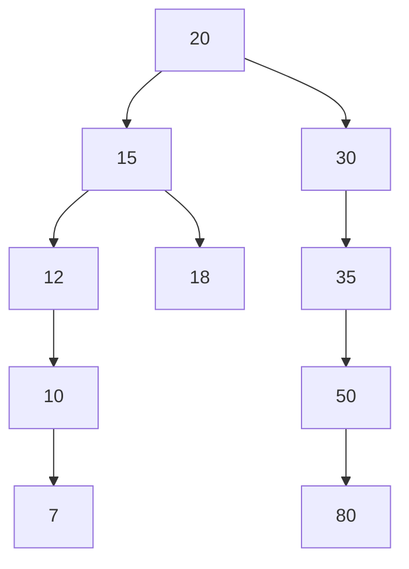
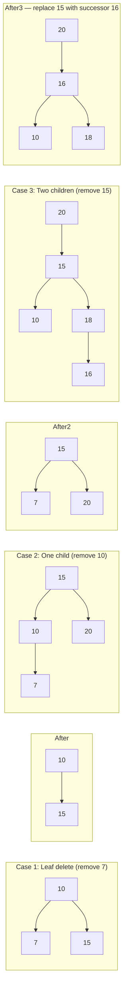
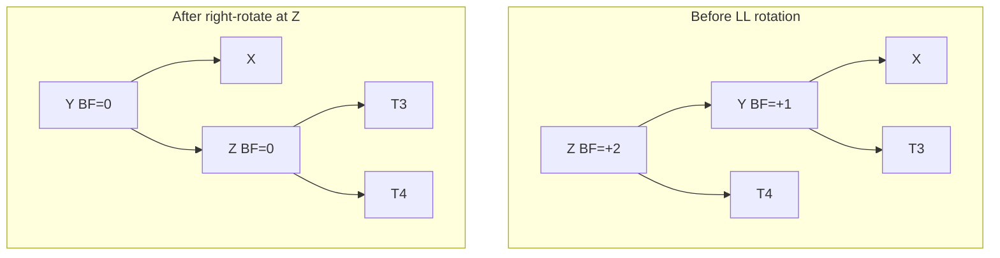

# Binary Search Trees

[toc]

> **TL;DR:** A Binary Search Tree (BST) is a linked binary tree where every node satisfies the ordering invariant: all keys in the left subtree are strictly less than the node's key, and all keys in the right subtree are strictly greater. This ordering collapses search, insert, and delete to O(log n) on a balanced tree — giving you the lookup speed of binary search over a sorted array without the O(n) insertion cost. The value of BSTs over hash tables is that they maintain sorted order, enabling range queries, floor/ceil, and k-th element in O(log n).

## Vocabulary

**BST property** — for every node N with key k: all keys in `N.left` subtree < k, and all keys in `N.right` subtree > k. This holds recursively for every node, not just direct children.

**Height (h)** — the number of edges on the longest root-to-leaf path. Determines the worst-case complexity of all core operations.

**Balanced BST** — a BST where the height is O(log n). The exact balance criterion differs by variant (AVL, Red-Black, etc.).

**Inorder traversal** — left → node → right. On a BST this visits nodes in ascending sorted order, which is the key invariant exploited by sorted-output operations.

**Inorder successor** — the node with the smallest key strictly greater than a given node's key. In a BST it is the leftmost node of the right subtree if one exists; otherwise it is the lowest ancestor for which the given node is in the left subtree.

**Inorder predecessor** — symmetric: the node with the largest key strictly less than the given node. It is the rightmost node of the left subtree.

**Self-balancing BST** — a BST that automatically rebalances after insert and delete, maintaining O(log n) height. Examples: AVL tree, Red-Black tree, B-tree.

**Balance factor (BF)** — in AVL trees: `height(left subtree) - height(right subtree)`. The AVL invariant requires |BF| <= 1 for every node.

**AVL invariant** — every node's balance factor is in {-1, 0, +1}. Guarantees height h <= 1.44 log2(n+2) - 0.328.

**Rotation** — a local pointer rearrangement that restores balance without violating the BST property. Four cases: LL (right rotation), RR (left rotation), LR (left-right double rotation), RL (right-left double rotation).

**Red-Black invariant** — five properties (see How it works) that together guarantee the longest path is at most twice the shortest, bounding height at 2 log2(n+1).

**B-tree** — a multi-way self-balancing tree where each node holds multiple keys and has multiple children. Designed for block-oriented storage: minimizes disk I/O by storing many keys per node.

**B+ tree** — a B-tree variant where all actual data (or record pointers) reside only in the leaf nodes, and internal nodes hold only routing keys. Leaves are linked in a doubly-linked list, enabling efficient range scans.

**Successor swap** — the delete strategy for two-child nodes: replace the node's key with its inorder successor's key, then delete the (now-duplicate) successor from the right subtree.

## Intuition

Think of a BST as a sorted linked list that has been folded into a binary tree. In a sorted array, binary search works because you can always discard half the remaining space — a BST gives you the same halving property but in a pointer-based structure that supports O(log n) insert and delete without shifting elements.

The tree's shape is determined entirely by insertion order. The same set of values, inserted in different orders, produces trees of wildly different heights — from a perfectly balanced tree (if you insert in level-order) to a degenerate linked list (if you insert in sorted order). This fragility is exactly what AVL and Red-Black trees fix by enforcing a structural invariant after every mutation.

The key intuition for why inorder traversal is sorted: by the BST property, every node visited before a given node N in inorder order must have a key smaller than N's key. The BST property is, in essence, a recursive definition of sorted order in tree form.

```
BST property visualized (root = 50):

        50
       /  \
      35   70
     /  \  / \
    10  40 60  80

  Inorder: 10 → 35 → 40 → 50 → 60 → 70 → 80  (sorted)
  
  For any node X:
    left subtree keys  <  X.key  <  right subtree keys
```

## Memory Layout

A BST node in memory is a small heap-allocated struct: two child pointers plus a key (and optionally a value and parent pointer). The tree has no array backing; nodes are scattered in the heap, connected only by pointers.

```
Balanced BST (h = log n, O(log n) ops):      Skewed BST (h = n-1, O(n) ops):

        50                                    10
       /  \                                     \
      25   75                                   20
     / \   / \                                    \
    10  35 60  90                                 30
                                                   \
                                                   40
                                                    \
                                                    50

  Lookup 90: 3 comparisons                  Lookup 50: 5 comparisons
  (h = 3 = floor(log2(7)))                  (h = 4 = n-1, degenerate)
```

> [!WARNING]
> Inserting values in sorted order into a plain BST produces this degenerate linked-list shape. If your data arrives sorted (e.g., log timestamps, monotonically increasing IDs), an unbalanced BST is O(n) for every operation. Use a self-balancing variant or shuffle before inserting.

## Math foundations

The BST's correctness and performance are grounded in three interlocking mathematical facts: the ordering invariant that makes navigation work, the probabilistic argument that explains why random BSTs are "usually" short, and the balance recurrences that prove self-balancing variants are always short. Understanding these from first principles lets you reason about any tree variant — AVL, Red-Black, splay, treap — without memorizing height constants.

### The BST property formalized

The BST ordering invariant is deceptively simple to state but applies to the *entire* subtree rooted at each node, not just the immediate children. For every node x with key x.key, every key in x's left subtree is strictly less than x.key, and every key in x's right subtree is strictly greater. Formally, for any node y in the tree:

```math
y \in \text{left-subtree}(x) \;\Rightarrow\; y.\text{key} < x.\text{key}
\qquad
y \in \text{right-subtree}(x) \;\Rightarrow\; y.\text{key} > x.\text{key}
```

This invariant directly implies that inorder traversal (left → node → right) visits keys in strictly ascending sorted order. The proof is by strong induction on tree size n.

**Base case (n = 1):** A single-node tree has empty subtrees. Inorder visits that node alone — trivially sorted.

**Inductive step:** Assume every BST of size less than n produces a sorted inorder sequence. For a BST of size n with root r, left subtree L (size < n) and right subtree R (size < n): by the induction hypothesis, inorder(L) is sorted and all its keys are less than r.key; inorder(R) is sorted and all its keys are greater than r.key. Inorder visits: sorted(L) then r.key then sorted(R). Since all keys of L are less than r.key and all keys of R are greater, the concatenation is strictly ascending. QED.

> [!IMPORTANT]
> The BST property constrains the entire subtree, not just direct children. A node can be locally consistent — larger than its left child, smaller than its right child — yet globally invalid because an ancestor's bound is violated. This is why BST validation must thread min/max bounds through the full recursion (see the Validation subsection in How it works).

### Expected height of a random BST is O(log n)

If n distinct keys are inserted into an initially empty BST in a uniformly random order, the expected height E[h(n)] is Theta(log n). This is the same analysis as quicksort's expected recursion depth, because the first key inserted becomes the root and partitions the remaining n-1 keys into a left subtree of size L and right subtree of size n-1-L, where L is uniformly distributed on {0, 1, ..., n-1}.

The height satisfies the recurrence: the root contributes depth 1, and the tree height is 1 plus the maximum of the two subtree heights.

```math
E[h(n)] \;\leq\; 1 + E\!\left[\max\!\left(h(L),\, h(n-1-L)\right)\right]
\qquad L \sim \text{Uniform}\{0,\ldots,n-1\}
```

Solving this recurrence — which mirrors the analysis of the expected depth of a random quicksort pivot — yields E[h(n)] ~ 4.311 ln n, or about 6.22 log2(n) asymptotically (Reed 2003). For practical n (up to millions), the constant factor is closer to 2 log2(n), which is why random BSTs perform comparably to Red-Black trees in practice.

> [!WARNING]
> "Random insertion order" is a fragile assumption. Real-world keys often arrive in monotonically increasing order (timestamps, auto-increment IDs, sorted imports). In that case, every new key is larger than all existing keys, always lands as the rightmost leaf, and the tree degenerates into a right-leaning linked list with height n-1 and O(n) operations. Never rely on probabilistic balance guarantees with real-world data unless you can prove the ordering is random.

### AVL height bound via Fibonacci-like recurrence

AVL trees enforce the balance condition |BF(x)| <= 1 at every node, where BF(x) = height(x.left) - height(x.right). To derive the height bound, ask: what is the *minimum* number of nodes N(h) in an AVL tree of height h? The tightest (most skewed) AVL tree of height h has one subtree of height h-1 and one of height h-2 — the smallest legally unbalanced configuration.

This yields the recurrence, with base cases for a single-node tree (height 0) and a two-node tree (height 1):

```math
N(h) = N(h-1) + N(h-2) + 1, \qquad N(0) = 1,\quad N(1) = 2
```

This has the same structure as the Fibonacci recurrence (shifted by 1: N(h) = F(h+3) - 1, where F is the standard Fibonacci sequence). Its closed form follows from the characteristic root phi = (1+sqrt(5))/2 ≈ 1.618:

```math
N(h) \approx \frac{\phi^{h+2}}{\sqrt{5}} - 1, \qquad \phi = \frac{1+\sqrt{5}}{2}
```

Inverting to get the maximum height h for a tree containing n nodes:

```math
h \;\leq\; \log_\phi(n+2) - 2 \;\approx\; 1.44\,\log_2(n+2) - 0.328
```

So an AVL tree of n nodes has height at most about 1.44 log2(n) — roughly 44% taller than a perfect binary tree, but still firmly O(log n).

### Red-Black tree height bound

A Red-Black tree maintains five structural invariants (see How it works), of which invariants 4 and 5 are the load-bearing ones for the height bound. Invariant 5 says every root-to-null path has the same number of Black nodes, called the *Black height* b. Invariant 4 says no two consecutive nodes on any path are Red.

These two together bound the tree height. First, the subtree rooted at any node x contains at least 2^b(x) - 1 internal nodes, where b(x) is the Black height below x (proof by induction on tree structure). For the root with Black height b, this gives:

```math
n \;\geq\; 2^b - 1 \;\;\Longrightarrow\;\; b \;\leq\; \log_2(n+1)
```

Second, because Red nodes cannot be consecutive (invariant 4), on any root-to-null path the Red nodes number at most as many as the Black nodes, so the total path length is at most 2b. Combining:

```math
h \;\leq\; 2b \;\leq\; 2\,\log_2(n+1)
```

This is a weaker bound than AVL's 1.44 log2(n), but it comes with a cheaper rebalancing cost: Red-Black insert requires at most 2 rotations, and delete at most 3, versus AVL's potential O(log n) rotations propagating up the path on delete.

> [!NOTE]
> The AVL bound (1.44 log2 n) versus the Red-Black bound (2 log2 n) is the core engineering trade-off: AVL trees are shorter and thus faster for lookup-heavy workloads; Red-Black trees do fewer rotations per mutation and are thus faster for write-heavy workloads. C++ `std::map` and the Linux CFS scheduler choose Red-Black. Read-optimized in-memory databases sometimes choose AVL.

### Amortized cost of splay tree operations (preview)

Splay trees are self-adjusting BSTs that perform no explicit balancing — instead, every accessed node is moved to the root via a sequence of "zig," "zig-zig," and "zig-zag" rotations. Individual operations can cost O(n) in the worst case, but the *amortized* cost per operation is O(log n), proved via the potential method.

The potential function assigns to each node x a rank r(x) = floor(log2(size(x))), where size(x) is the number of nodes in the subtree rooted at x. The total potential of a tree T is the sum over all nodes:

```math
\Phi(T) = \sum_{x \in T} \lfloor \log_2 \operatorname{size}(x) \rfloor
```

The amortized cost of each splay operation — access, insert, or delete — is then at most 3(r(root) - r(x)) + 1, which is O(log n). This "access lemma" is the core of the splay tree analysis. The full derivation is non-trivial and will be covered in the Self-Adjusting Structures note; what matters here is that the potential captures how "unbalanced" the tree is, and the splay operation's rotations systematically reduce potential while doing useful work.

> [!TIP]
> Splay trees have excellent cache locality for access-skewed workloads: recently accessed nodes are near the root and thus near the top of the pointer-chasing chain. If your workload has a power-law access distribution (a small set of keys dominate), splay trees can outperform Red-Black trees in practice even though their worst-case per-operation cost is higher.

## How it works

The BST supports four primitive operations — search, insert, delete, and validation — all built on the same left/right navigation logic. Self-balancing variants (AVL, Red-Black) layer a rebalancing pass on top of insert and delete.

### Search

Search navigates from the root by comparing the target value against each node's key, going left if the target is smaller and right if larger, until it either finds the key or falls off a null pointer. This is exactly binary search, expressed as pointer-following rather than index arithmetic.

Time: O(h) where h is the tree height — O(log n) if balanced, O(n) in the degenerate case. The call stack consumes O(h) auxiliary space.

```python
from __future__ import annotations
from typing import Optional


class BSTNode:
    def __init__(self, key: int) -> None:
        self.key: int = key
        self.left: Optional[BSTNode] = None
        self.right: Optional[BSTNode] = None


def search(root: Optional[BSTNode], val: int) -> bool:
    """Return True if val exists in the BST rooted at root."""
    if root is None:
        return False
    if root.key == val:
        return True
    if val < root.key:
        return search(root.left, val)
    return search(root.right, val)
```

### Insert

Insert finds the correct null slot for the new key using the same left/right navigation as search, then allocates a new node there. The recursive implementation threads the new child pointer back up through the return value, which is idiomatic Python (and C with double-pointer is equivalent).

> [!IMPORTANT]
> Insert always lands at a leaf position. The BST property guarantees exactly one valid insertion point for any new key, assuming the tree contains no duplicates. If duplicates must be supported, pick a consistent tie-breaking convention (e.g., equal keys always go right) and apply it uniformly.

```python
def insert(root: Optional[BSTNode], val: int) -> BSTNode:
    """Insert val into the BST and return the (possibly new) root."""
    if root is None:
        return BSTNode(val)
    if val < root.key:
        root.left = insert(root.left, val)
    elif val > root.key:
        root.right = insert(root.right, val)
    # If val == root.key, ignore duplicate
    return root
```

Insert sequence 20, 15, 30, 10, 50, 12, 18, 35, 80, 7 produces:



### Delete

Delete is the most complex BST operation because it must preserve the BST property after removing a node. There are three cases based on the node's child count.

**Case 1 — No children (leaf):** Simply remove the node and set the parent's pointer to null.

**Case 2 — One child:** Replace the node with its single child. The child's subtree already satisfies the BST property relative to the parent.

**Case 3 — Two children:** Replace the node's key with its inorder successor's key (the minimum of the right subtree), then recursively delete the inorder successor from the right subtree. The inorder successor has at most one child (no left child, by definition of "minimum"), so the recursive call reduces to Case 1 or Case 2.



```python
def get_min(node: BSTNode) -> BSTNode:
    """Return the leftmost (minimum) node in the subtree."""
    current = node
    while current.left is not None:
        current = current.left
    return current


def delete(root: Optional[BSTNode], val: int) -> Optional[BSTNode]:
    """Delete val from the BST and return the (possibly new) root."""
    if root is None:
        return None
    if val < root.key:
        root.left = delete(root.left, val)
    elif val > root.key:
        root.right = delete(root.right, val)
    else:
        # Node to delete found
        if root.left is None:
            return root.right          # Case 1 or Case 2 (right child)
        if root.right is None:
            return root.left           # Case 2 (left child)
        # Case 3: two children — replace with inorder successor
        successor = get_min(root.right)
        root.key = successor.key
        root.right = delete(root.right, successor.key)
    return root
```

### Validation

A common mistake is checking only that each node is greater than its left child and less than its right child. This misses violations deeper in the tree — for example, a node in a right subtree whose value is actually less than the root. The correct approach threads `min_bound` and `max_bound` constraints down the recursion.

> [!WARNING]
> The node-to-immediate-child comparison is not sufficient for BST validation. Counter-example: a node with key 5 as a right child of key 3, but with key 8 as a right child of key 3's parent (key 10) — the node with key 5 violates the bound from the ancestor even though it is locally consistent with its parent.

```python
import math


def is_valid_bst(
    root: Optional[BSTNode],
    min_val: float = -math.inf,
    max_val: float = math.inf,
) -> bool:
    """Return True iff the tree rooted at root is a valid BST."""
    if root is None:
        return True
    if not (min_val < root.key < max_val):
        return False
    return is_valid_bst(root.left, min_val, root.key) and \
           is_valid_bst(root.right, root.key, max_val)
```

### AVL Rotations

An AVL tree is a BST that maintains the invariant |BF(node)| <= 1 at every node after every insert or delete, where BF = height(left) - height(right). When an operation creates a node with |BF| = 2, exactly one of four rotation cases applies. All rotations run in O(1) — they rearrange at most three pointers.

**LL case (right rotation):** A node Z is left-heavy (BF = +2) and its left child Y is also left-heavy or balanced (BF >= 0). Y becomes the new subtree root; Z becomes Y's right child; Y's former right child becomes Z's left child.

**RR case (left rotation):** Mirror of LL. Z is right-heavy, its right child Y is right-heavy or balanced. Y becomes root; Z becomes Y's left child.

**LR case (left-right double rotation):** Z is left-heavy, but its left child Y is right-heavy. First rotate Y left (turning it into an LL case), then rotate Z right.

**RL case (right-left double rotation):** Mirror of LR.

```
LL rotation (right rotate at Z):

    Z (BF=+2)          Y (BF=0)
   / \                / \
  Y   T4    -->      X   Z
 / \                / \ / \
X   T3             T1 T2 T3 T4
```



```python
def height(node: Optional[BSTNode]) -> int:
    return 0 if node is None else getattr(node, 'h', 1)


def balance_factor(node: Optional[BSTNode]) -> int:
    if node is None:
        return 0
    return height(node.left) - height(node.right)


def right_rotate(z: BSTNode) -> BSTNode:
    """LL case: right rotation at z. Returns new subtree root."""
    y = z.left
    assert y is not None
    t3 = y.right
    y.right = z
    z.left = t3
    # update heights (assuming BSTNode has .h attribute)
    z.h = 1 + max(height(z.left), height(z.right))  # type: ignore[attr-defined]
    y.h = 1 + max(height(y.left), height(y.right))  # type: ignore[attr-defined]
    return y


def left_rotate(z: BSTNode) -> BSTNode:
    """RR case: left rotation at z. Returns new subtree root."""
    y = z.right
    assert y is not None
    t2 = y.left
    y.left = z
    z.right = t2
    z.h = 1 + max(height(z.left), height(z.right))  # type: ignore[attr-defined]
    y.h = 1 + max(height(y.left), height(y.right))  # type: ignore[attr-defined]
    return y
```

### Red-Black Tree Overview

A Red-Black tree is a BST where each node carries a 1-bit color (Red or Black) and the following five invariants are maintained at all times. Together they bound the tree's height to at most 2 log2(n+1), guaranteeing O(log n) worst-case for all operations.

1. Every node is either Red or Black.
2. The root is Black.
3. Every leaf (null sentinel) is Black.
4. If a node is Red, both its children are Black (no two consecutive Red nodes on any path).
5. All paths from any node to its descendant null leaves contain the same number of Black nodes (the "Black height").

> [!NOTE]
> Red-Black trees are used in C++ `std::map` / `std::set`, Java `TreeMap` / `TreeSet`, and the Linux kernel's completely fair scheduler (CFS) — which stores runnable tasks keyed by virtual runtime. AVL trees are slightly more rigidly balanced (h <= 1.44 log n vs 2 log n for RB), making them faster for lookup-heavy workloads; Red-Black trees require fewer rotations on insert/delete, making them faster for write-heavy workloads.

### B-Tree and B+ Tree Overview

B-trees extend the BST idea to multi-way branching: each internal node holds between t-1 and 2t-1 keys (for some minimum degree t >= 2) and between t and 2t children. All leaves are at the same depth. Because one node maps to one disk block, B-trees minimize I/O by maximizing keys-per-block.

B+ trees are the database variant: internal nodes hold only routing keys (no actual data), and all records are stored in the leaf layer. Leaves are linked in a doubly-linked list, which makes range scans — the bread-and-butter of SQL `BETWEEN` queries — a sequential leaf traversal rather than repeated tree navigation.

```
B+ tree with t=2 (min 1 key, max 3 keys per node):

Internal:    [20 | 40]
            /    |    \
Leaves: [10|15] [20|30] [40|50|60] -> linked list across leaves
```

## Math

The height of a balanced BST determines whether all operations are efficient. Here we derive the key bounds.

**Height of a perfect binary tree with n nodes:**

```math
h = \lfloor \log_2 n \rfloor
```

A perfect binary tree with height h has exactly `2^(h+1) - 1` nodes. Inverting: for n nodes, h = floor(log2(n)).

**AVL height bound (Adelson-Velsky and Landis, 1962):**

Let N(h) be the minimum number of nodes in an AVL tree of height h. The tightest (most unbalanced) AVL tree of height h has one subtree of height h-1 and one of height h-2:

```math
N(h) = N(h-1) + N(h-2) + 1, \quad N(0) = 1, \quad N(1) = 2
```

This recurrence has the same structure as Fibonacci. Its solution is:

```math
N(h) \approx \frac{1}{\sqrt{5}} \phi^{h+2} - 1, \quad \phi = \frac{1+\sqrt{5}}{2} \approx 1.618
```

Inverting to get h in terms of n:

```math
h \leq 1.44 \log_2(n + 2) - 0.328
```

So an AVL tree of n nodes has height at most approximately 1.44 log2(n), about 44% taller than the ideal log2(n). All operations remain O(log n).

**Red-Black height bound:**

```math
h \leq 2 \log_2(n + 1)
```

The factor of 2 comes from invariants 4 and 5: on the longest root-to-leaf path, at most half the nodes can be Red (none are consecutive), so the Black height bh satisfies `2^bh - 1 <= n`, giving `bh <= log2(n+1)`, and since h <= 2*bh, the bound follows.

**BST operation complexity:**

| Operation | Unbalanced (worst) | Balanced (AVL/RB) |
| :--- | :---: | :---: |
| Search | O(n) | O(log n) |
| Insert | O(n) | O(log n) |
| Delete | O(n) | O(log n) |
| Min/Max | O(n) | O(log n) |
| Inorder traversal | O(n) | O(n) |
| Range query [lo, hi] | O(n) | O(log n + k) |

where k is the number of results in a range query.

## Hash Table vs BST

Choosing between a hash table and a BST is a recurring engineering decision. The table below uses amortized complexity for hash tables and balanced-BST complexity for BSTs.

| Operation | Hash Table | Balanced BST | Notes |
| :--- | :---: | :---: | :--- |
| Lookup | O(1) avg | O(log n) | Hash wins |
| Insert | O(1) amortized | O(log n) | Hash wins |
| Delete | O(1) avg | O(log n) | Hash wins |
| Min / Max | O(n) | O(log n) | BST wins |
| Ordered traversal | O(n log n) | O(n) | BST wins (inorder is free) |
| Range query [lo, hi] | O(n) | O(log n + k) | BST wins |
| Floor / Ceil | O(n) | O(log n) | BST wins |
| k-th smallest | O(n) | O(log n) w/ augmentation | BST wins |
| Memory overhead | Low (array) | Higher (3 pointers/node) | Hash wins |
| Cache friendliness | Better (array-backed) | Worse (pointer-chasing) | Hash wins |
| Worst-case guarantee | O(n) collision | O(log n) | BST wins |

**When to choose BST:** you need sorted order, range queries, floor/ceil, or the k-th element. `sortedcontainers.SortedList` in Python or `std::map` / `TreeMap` in C++/Java.

**When to choose hash table:** you only need point lookups, inserts, and deletes, and worst-case doesn't matter. Python `dict`, C++ `unordered_map`.

## Real-world example

Consider a leaderboard service that must support: insert a new (player, score) pair, delete a player's record, query the top-k players, find the rank of a player by name, and answer range queries ("all players with score between 1000 and 2000"). A hash table handles only the first two efficiently. A BST keyed on score handles all five.

The Python standard library has no ordered map. The idiomatic solution is `sortedcontainers.SortedList` (implemented as a list-of-lists with O(log n) insert/delete via bisect, not a true Red-Black tree, but same asymptotic) or `sortedcontainers.SortedDict`.

> [!TIP]
> `sortedcontainers.SortedList` is the Python practitioner's substitute for an ordered multiset. For a true BST with augmentation (rank, k-th element, sum-of-range), you either implement your own or use a segment tree / BIT over compressed coordinates for competitive programming.

```python
from __future__ import annotations
from typing import Optional
import math


class BST:
    """A minimal, fully-typed BST demonstrating search / insert / delete."""

    class Node:
        __slots__ = ("key", "left", "right")

        def __init__(self, key: int) -> None:
            self.key: int = key
            self.left: Optional[BST.Node] = None
            self.right: Optional[BST.Node] = None

    def __init__(self) -> None:
        self._root: Optional[BST.Node] = None

    # ------------------------------------------------------------------ #
    #  Public interface                                                    #
    # ------------------------------------------------------------------ #

    def insert(self, key: int) -> None:
        self._root = self._insert(self._root, key)

    def delete(self, key: int) -> None:
        self._root = self._delete(self._root, key)

    def search(self, key: int) -> bool:
        return self._search(self._root, key)

    def inorder(self) -> list[int]:
        result: list[int] = []
        self._inorder(self._root, result)
        return result

    def is_valid(self) -> bool:
        return self._is_valid(self._root, -math.inf, math.inf)

    # ------------------------------------------------------------------ #
    #  Private helpers                                                     #
    # ------------------------------------------------------------------ #

    def _insert(self, node: Optional[Node], key: int) -> Node:
        if node is None:
            return BST.Node(key)
        if key < node.key:
            node.left = self._insert(node.left, key)
        elif key > node.key:
            node.right = self._insert(node.right, key)
        return node

    def _delete(self, node: Optional[Node], key: int) -> Optional[Node]:
        if node is None:
            return None
        if key < node.key:
            node.left = self._delete(node.left, key)
        elif key > node.key:
            node.right = self._delete(node.right, key)
        else:
            if node.left is None:
                return node.right
            if node.right is None:
                return node.left
            # Two children: replace with inorder successor
            successor = self._get_min(node.right)
            node.key = successor.key
            node.right = self._delete(node.right, successor.key)
        return node

    def _search(self, node: Optional[Node], key: int) -> bool:
        if node is None:
            return False
        if key == node.key:
            return True
        return self._search(node.left, key) if key < node.key \
            else self._search(node.right, key)

    def _inorder(self, node: Optional[Node], result: list[int]) -> None:
        if node is None:
            return
        self._inorder(node.left, result)
        result.append(node.key)
        self._inorder(node.right, result)

    def _get_min(self, node: Node) -> Node:
        while node.left is not None:
            node = node.left
        return node

    def _is_valid(
        self,
        node: Optional[Node],
        lo: float,
        hi: float,
    ) -> bool:
        if node is None:
            return True
        if not (lo < node.key < hi):
            return False
        return self._is_valid(node.left, lo, node.key) and \
               self._is_valid(node.right, node.key, hi)


# --- Demo ---
if __name__ == "__main__":
    tree = BST()
    for v in [50, 35, 70, 10, 40, 60, 80]:
        tree.insert(v)

    print("Inorder:", tree.inorder())       # [10, 35, 40, 50, 60, 70, 80]
    print("Valid BST:", tree.is_valid())    # True
    print("Search 40:", tree.search(40))   # True
    print("Search 99:", tree.search(99))   # False

    tree.delete(35)                         # two-child delete
    print("After delete 35:", tree.inorder())  # [10, 40, 50, 60, 70, 80]
```

## In practice

BSTs are everywhere in systems software, but the raw unbalanced form almost never ships — it is always a self-balancing variant underneath an API.

**Python has no built-in ordered map.** `dict` is a hash table; `sorted()` is O(n log n) each call. The pragmatic answer for ordered-set semantics is `sortedcontainers.SortedList` / `SortedDict`. For interview-style problems requiring frequent insert/delete with k-th-element queries, you either implement an augmented BST or reframe using a heap + lazy deletion.

**C++ `std::map` and Java `TreeMap` are Red-Black trees.** C++ `std::set`, `std::multimap`, and `std::multiset` are also Red-Black. Java `TreeSet` is Red-Black. The Linux CFS scheduler uses a Red-Black tree to store runnable processes keyed by virtual runtime — the leftmost node is always the most deserving task, fetched in O(log n).

**Database indexes are B+ trees, not BSTs.** PostgreSQL, SQLite, MySQL InnoDB all use B+ trees for their primary and secondary indexes. The reason is I/O: a BST node holds one key and two pointers — a single disk block wasted. A B+ tree node with t=100 holds 100 keys, reducing tree height by a factor of log2(100) / log2(3) ≈ 2, meaning dramatically fewer disk seeks per lookup. The linked-leaf layer also makes `BETWEEN` and `ORDER BY` scans sequential rather than O(k log n) traversals.

> [!TIP]
> When choosing a B+ tree order (fan-out), target a node size matching the filesystem block size (4 KB) or the SSD page size (16 KB). PostgreSQL defaults to an 8 KB page; MySQL InnoDB uses 16 KB. A larger page means fewer levels but more memory consumed per node.

**AVL trees vs Red-Black trees in practice.** AVL trees guarantee height <= 1.44 log n — tighter than Red-Black's 2 log n — so lookups are slightly faster in a read-heavy workload. Red-Black trees do at most 2 rotations on insert and 3 on delete; AVL trees may need O(log n) rotations after delete (rebalance propagates up the path). This makes Red-Black trees the dominant choice for write-heavy workloads like kernel task queues and language runtime ordered maps.

> [!CAUTION]
> In a concurrent setting, naively locking the entire BST for every operation serializes all threads. Production concurrent ordered maps (e.g., Java `ConcurrentSkipListMap`) use skip lists instead — skip lists admit fine-grained locking (lock-free CAS on the tower) while maintaining O(log n) expected performance. A globally-locked Red-Black tree is a scalability bottleneck under high-concurrency write workloads.

## Pitfalls

- **Checking only immediate parent-child to validate a BST.** A node can be locally consistent (greater than its left child, less than its right) but globally invalid. The correct check threads min/max bounds through the entire recursion.

- **Deleting a two-child node by directly removing it.** You cannot simply unlink a node with two children — you must replace its key with the inorder successor's key and then delete the successor. Skipping the successor fetch corrupts the BST property.

- **Assuming a BST is balanced without a self-balancing mechanism.** Insertion of sorted or reverse-sorted data degrades a plain BST to O(n) per operation. If you cannot guarantee random insertion order, use AVL, Red-Black, or treap.

- **Confusing inorder successor with right child.** The inorder successor of a node N is the minimum of N's right subtree — it may be several levels below the right child, not the right child itself. Only if N's right child has no left subtree does the right child equal the inorder successor.

- **Using BST where hash table suffices.** If you never need ordered traversal, range queries, or floor/ceil, a hash table's O(1) average ops beat BST's O(log n) at every operation. The overhead of pointer-chasing and tree rebalancing is pure waste.

- **Ignoring integer overflow in the min/max bounds for validation.** Using `INT_MIN` / `INT_MAX` as sentinel bounds in C/C++ fails when the key type is `int` — the tree might legitimately contain `INT_MIN` or `INT_MAX`. Use a nullable/optional bound (pass `None` in Python, a pointer or optional in C++) that skips the check when absent.

## Exercises

These exercises progress from foundational mechanics to nuanced edge cases. For each problem, read the hint before attempting the solution.

---

### Exercise 1: Validate a BST

**Problem:** Given the root of a binary tree, determine if it is a valid BST.

> [!TIP]
> Track lower and upper bounds as you recurse. When going left from node with key k, the upper bound tightens to k. When going right, the lower bound tightens to k. A null pointer is always valid.

```python
def is_valid_bst_ex(
    root: Optional[BSTNode],
    lo: float = -math.inf,
    hi: float = math.inf,
) -> bool:
    """O(n) time, O(h) space."""
    if root is None:
        return True
    if not (lo < root.key < hi):
        return False
    return is_valid_bst_ex(root.left, lo, root.key) and \
           is_valid_bst_ex(root.right, root.key, hi)
```

Complexity: O(n) time (visit every node once), O(h) space for the call stack.

---

### Exercise 2: Lowest Common Ancestor in a BST

**Problem:** Given a BST and two nodes p and q, find their lowest common ancestor (LCA). The LCA is the deepest node that is an ancestor of both p and q.

> [!TIP]
> Exploit the BST property: if both p and q are less than the current node, the LCA is in the left subtree. If both are greater, it's in the right subtree. If one is on each side (or equals the current node), the current node is the LCA.

```python
def lca_bst(
    root: Optional[BSTNode],
    p: int,
    q: int,
) -> Optional[BSTNode]:
    """O(h) time, O(h) space. Iterative to avoid stack overflow on skewed trees."""
    node = root
    while node is not None:
        if p < node.key and q < node.key:
            node = node.left
        elif p > node.key and q > node.key:
            node = node.right
        else:
            return node  # split point — this is the LCA
    return None
```

Complexity: O(h) time, O(1) space (iterative).

---

### Exercise 3: K-th Smallest Element in a BST

**Problem:** Find the k-th smallest element (1-indexed) in a BST.

> [!TIP]
> Inorder traversal visits BST nodes in ascending order. Stop as soon as you have visited k nodes. Use an iterative inorder with an explicit stack to avoid full traversal.

```python
def kth_smallest(root: Optional[BSTNode], k: int) -> int:
    """O(h + k) time, O(h) space. Iterative inorder traversal."""
    stack: list[BSTNode] = []
    count = 0
    current = root
    while current is not None or stack:
        # Go as far left as possible
        while current is not None:
            stack.append(current)
            current = current.left
        current = stack.pop()
        count += 1
        if count == k:
            return current.key
        current = current.right
    raise ValueError(f"k={k} exceeds number of nodes in the BST")
```

Complexity: O(h + k) time, O(h) space for the stack.

---

### Exercise 4: Range Sum of BST

**Problem:** Given a BST root and integers `low` and `high`, return the sum of all node values in the inclusive range [low, high].

> [!TIP]
> Prune branches aggressively using the BST property: if the current node's key is less than `low`, skip the entire left subtree; if it's greater than `high`, skip the entire right subtree.

```python
def range_sum_bst(
    root: Optional[BSTNode],
    low: int,
    high: int,
) -> int:
    """O(n) worst case, O(log n + k) on a balanced BST where k = result count."""
    if root is None:
        return 0
    total = 0
    if low <= root.key <= high:
        total += root.key
    if root.key > low:                          # left subtree may have values >= low
        total += range_sum_bst(root.left, low, high)
    if root.key < high:                         # right subtree may have values <= high
        total += range_sum_bst(root.right, low, high)
    return total
```

Complexity: O(n) worst case; O(log n + k) on a balanced BST.

---

### Exercise 5: Convert Sorted Array to Height-Balanced BST

**Problem:** Given a sorted array of distinct integers, construct a height-balanced BST.

> [!TIP]
> Always pick the middle element as the root. This ensures the left and right subtrees have equal (or off-by-one) sizes, guaranteeing balance. Apply recursively to the left and right halves.

```python
def sorted_array_to_bst(nums: list[int]) -> Optional[BSTNode]:
    """O(n) time, O(log n) space (call stack on balanced tree)."""
    if not nums:
        return None
    mid = len(nums) // 2
    node = BSTNode(nums[mid])
    node.left = sorted_array_to_bst(nums[:mid])
    node.right = sorted_array_to_bst(nums[mid + 1:])
    return node
```

Complexity: O(n) time (create n nodes), O(log n) stack depth.

---

### Exercise 6: Inorder Successor in a BST

**Problem:** Given a BST and a node p, find the inorder successor of p (the node with the smallest key greater than p.key). Return None if no successor exists.

> [!TIP]
> If p has a right subtree, the successor is the minimum of that right subtree. Otherwise, the successor is the lowest ancestor of p for which p is in the left subtree — track this as you navigate down from the root.

```python
def inorder_successor(
    root: Optional[BSTNode],
    p: int,
) -> Optional[BSTNode]:
    """O(h) time, O(1) space."""
    candidate: Optional[BSTNode] = None
    node = root
    while node is not None:
        if p < node.key:
            candidate = node   # this node is greater than p, remember it
            node = node.left
        elif p > node.key:
            node = node.right
        else:
            # Found p — successor is min of right subtree if it exists
            if node.right is not None:
                cur = node.right
                while cur.left is not None:
                    cur = cur.left
                return cur
            break
    return candidate
```

Complexity: O(h) time, O(1) space.

---

### Exercise 7: Two Sum in a BST

**Problem:** Given a BST root and a target integer k, return True if there exist two nodes in the BST such that their keys sum to k.

> [!TIP]
> Use the inorder traversal to extract values into a sorted list, then apply the two-pointer technique. Alternatively, use a hash set while traversing and check if (k - current_key) is already in the set.

```python
def find_target(root: Optional[BSTNode], k: int) -> bool:
    """Two-pointer on inorder list. O(n) time, O(n) space."""
    vals: list[int] = []

    def inorder(node: Optional[BSTNode]) -> None:
        if node is None:
            return
        inorder(node.left)
        vals.append(node.key)
        inorder(node.right)

    inorder(root)
    left, right = 0, len(vals) - 1
    while left < right:
        s = vals[left] + vals[right]
        if s == k:
            return True
        if s < k:
            left += 1
        else:
            right -= 1
    return False
```

Complexity: O(n) time, O(n) space.

---

### Exercise 8: Recover BST with Two Nodes Swapped

**Problem:** Two nodes in a BST have been swapped by mistake. Recover the tree without changing its structure.

> [!TIP]
> An inorder traversal of a valid BST yields a strictly increasing sequence. If two nodes are swapped, either one inversion (adjacent swap) or two inversions (non-adjacent swap) will appear in the inorder sequence. Track `prev`, `first`, and `second`: `first` is set at the first inversion's `prev`; `second` is always updated to the current node at each inversion. At the end, swap `first.key` and `second.key`.

```python
class RecoverBST:
    def __init__(self) -> None:
        self._prev: Optional[BSTNode] = None
        self._first: Optional[BSTNode] = None
        self._second: Optional[BSTNode] = None

    def recover(self, root: Optional[BSTNode]) -> None:
        """Mutates the tree in-place. O(n) time, O(h) space."""
        self._inorder_fix(root)
        if self._first is not None and self._second is not None:
            self._first.key, self._second.key = \
                self._second.key, self._first.key

    def _inorder_fix(self, node: Optional[BSTNode]) -> None:
        if node is None:
            return
        self._inorder_fix(node.left)
        if self._prev is not None and node.key < self._prev.key:
            # Found an inversion
            if self._first is None:
                self._first = self._prev   # first violator: set once
            self._second = node            # second violator: always update
        self._prev = node
        self._inorder_fix(node.right)
```

Complexity: O(n) time, O(h) space. A Morris traversal variant achieves O(1) space.

---

### Exercise 9: Find Closest Value in BST

**Problem:** Given a BST and a target float x, find the key in the BST closest to x.

> [!TIP]
> Navigate the tree using the BST property: at each node, update the closest candidate and go left if x < node.key, right if x > node.key. This is O(h) — you never need to explore both subtrees.

```python
def closest_value(root: Optional[BSTNode], target: float) -> int:
    """O(h) time, O(1) space."""
    closest = root.key if root is not None else 0
    node = root
    while node is not None:
        if abs(node.key - target) < abs(closest - target):
            closest = node.key
        if target < node.key:
            node = node.left
        elif target > node.key:
            node = node.right
        else:
            break  # exact match
    return closest
```

Complexity: O(h) time, O(1) space.

## Sources

- Cormen, T. H., Leiserson, C. E., Rivest, R. L., & Stein, C. (2009). *Introduction to Algorithms* (3rd ed.), Chapters 12–14. MIT Press.
- Adelson-Velsky, G. & Landis, E. (1962). "An algorithm for the organization of information." *Proceedings of the USSR Academy of Sciences*, 146:263–266.
- Sedgewick, R. & Wayne, K. (2011). *Algorithms* (4th ed.), Chapter 3. Addison-Wesley. https://algs4.cs.princeton.edu/home/
- Red-Black Trees: Guibas, L. J. & Sedgewick, R. (1978). "A dichromatic framework for balanced trees." *FOCS '78*. https://dl.acm.org/doi/10.1145/359576.359587
- B+ trees in PostgreSQL: https://www.postgresql.org/docs/current/indexes-types.html
- `sortedcontainers` Python library: http://www.grantjenks.com/docs/sortedcontainers/
- Linux CFS Red-Black tree: https://docs.kernel.org/scheduler/sched-design-CFS.html
- Lecture notes: Binary Search Trees, Data Structures and Algorithms course (2026-05-19)

## Related

- [[02-arrays-and-searching]]
- [[04-hashing]]
- [[09-trees]]
- [[13-graphs]]
