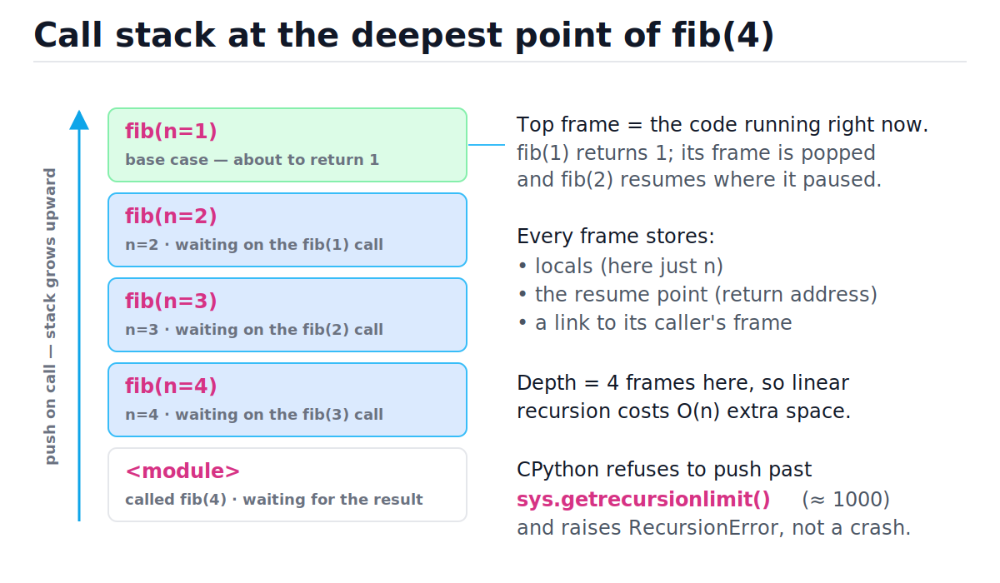
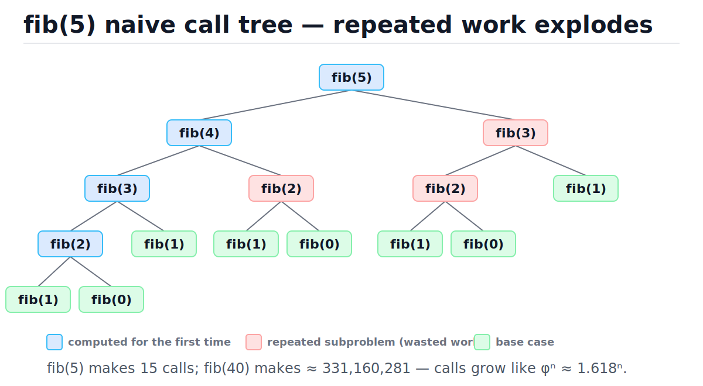
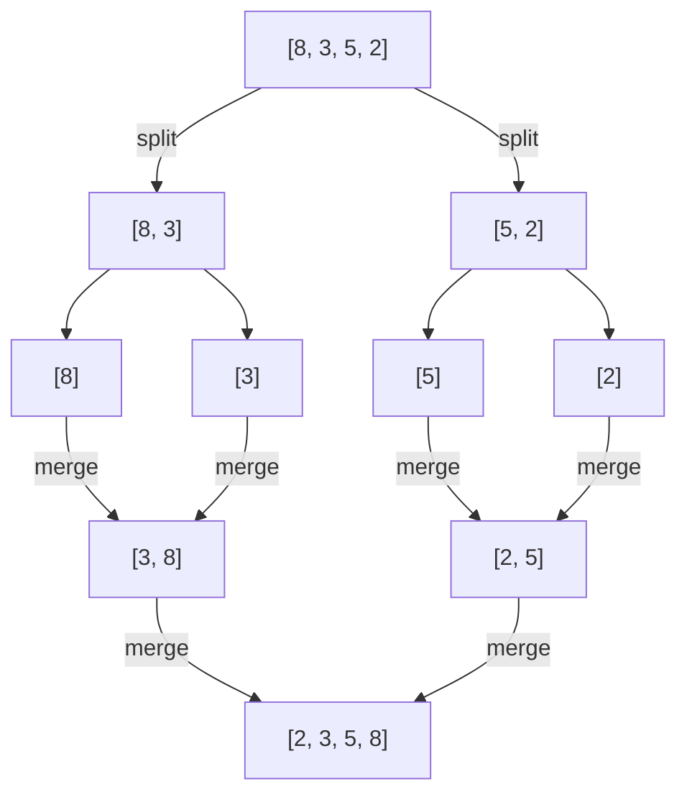
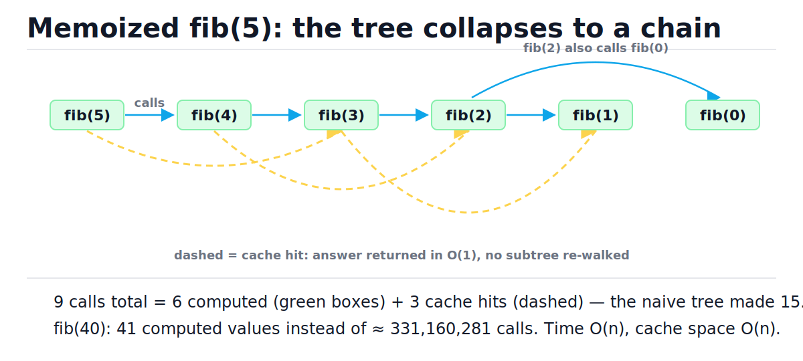
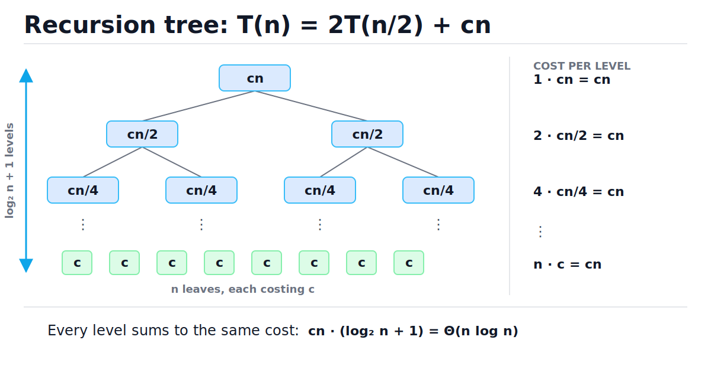

# Recursion and Divide and Conquer

[toc]

> **TL;DR:** Recursion solves a problem by calling itself on strictly smaller input until a base case stops the descent; every active call occupies a stack frame holding its locals and a resume point. Divide and conquer is the disciplined form — split, solve subproblems recursively, merge — and its cost falls out of a recurrence such as T(n) = 2T(n/2) + O(n), which a recursion tree solves to O(n log n). In Python the call stack is capped near 1000 frames and tail calls are never optimized, so deep recursion must become an explicit-stack loop, and overlapping subproblems must be memoized.

## Vocabulary

Each term below is load-bearing for the rest of the note. The symbol or formula under each term is the canonical way it appears in analysis.

**Recursion**

```math
f(n) = \text{combine}\big(f(n')\big), \quad n' \prec n
```

A function defined in terms of itself on strictly smaller input. "Smaller" can mean a smaller number, a shorter list, or a subtree — anything that provably approaches a base case.

**Base case**

```math
f(n_0) = \text{known constant}
```

The input small enough to answer directly, with no recursive call. Every recursive function needs at least one, and every recursive call must make progress toward it.

**Call frame**

```math
\text{frame} = (\text{locals},\ \text{resume point},\ \text{caller link})
```

The record pushed for each function call: local variables, the instruction where this call resumes after its callee returns, and a link to the caller's frame.

**Call stack**

```math
S(n) = O(d_{\max})
```

The stack of all currently active frames. Its peak height equals the maximum recursion depth, which is why recursion's hidden space cost is O(depth).

**Recurrence relation**

```math
T(n) = a\,T(n/b) + f(n)
```

An equation describing total work in terms of the same function on smaller input: a subproblems, each of size n/b, plus f(n) work to split and merge.

**Divide and conquer**

```math
\text{split} \;\to\; \text{solve subproblems recursively} \;\to\; \text{merge}
```

The pattern of cutting a problem into independent subproblems, solving each recursively, and combining results. Merge sort, quicksort, and binary search are all instances.

**Recursion tree**

```math
T(n) = \sum_{\text{levels } i} (\#\text{nodes at level } i) \times (\text{cost per node at level } i)
```

A drawing of every recursive call as a tree node labeled with its non-recursive cost. Summing per-level costs solves the recurrence visually.

**Master theorem**

```math
n^{\log_b a} \ \text{versus}\ f(n)
```

A lookup table for recurrences of the form T(n) = aT(n/b) + f(n): compare the leaf work n^(log_b a) against the root work f(n), and whichever dominates gives the answer.

**Memoization**

```math
T_{\text{memo}} = O(\text{distinct subproblems} \times \text{work per subproblem})
```

Caching each subproblem's answer the first time it is computed, so repeated calls return in O(1). It turns an exponential call tree with overlapping subproblems into linear work.

**Tail call**

```math
f(n) = f(n-1) \quad \text{(no pending work after the call)}
```

A recursive call that is the very last action, with nothing left to combine. Some languages reuse the current frame for tail calls; CPython deliberately does not.

## Intuition

Think of recursion as a stack of sticky notes. Each call writes a note — "I'm fib(3), I'm waiting on fib(2), here's where I left off" — and places it on top of the pile. When a call finishes, its note is removed and the one underneath resumes exactly where it paused. The pile is the call stack, and its height is the recursion depth. The figure below shows the pile at the deepest moment of computing fib(4): four frames live at once, which is why linear recursion costs O(n) space even when it "looks" like it uses no extra memory.



Divide and conquer adds one idea on top: instead of shrinking the problem by 1 each call, cut it in half (or into k pieces), solve the pieces independently, and merge. Halving means the stack only grows to O(log n) deep, and the work splits across the tree instead of piling up linearly.

> [!IMPORTANT]
> Every correct recursive function has three parts: a **base case** (when to stop), **progress** (each call strictly approaches the base case), and a **combine step** (how child answers form the parent answer). Missing any one of the three gives a wrong answer or a RecursionError.

## How it works

### Anatomy of a correct recursive function

The skeleton is always the same: check the base case first, recurse on smaller input, combine on the way back up. Factorial is the minimal honest example — the base case is n ≤ 1, progress is n − 1, and the combine step is the multiplication that happens *after* the recursive call returns. That post-call multiply is exactly the "pending work" the paused frame remembers.

```python
def factorial(n: int) -> int:
    if n <= 1:                       # 1. base case: answer directly
        return 1
    return n * factorial(n - 1)      # 2. progress (n-1), 3. combine (n *)

assert factorial(0) == 1
assert factorial(5) == 120
assert factorial(10) == 3628800
```

Time is O(n) — one frame of O(1) work per value of n. Space is also O(n), because all n frames are alive at the deepest point.

### The call stack and Python's recursion limit

Each Python call pushes a frame holding locals, the resume offset into the bytecode, and a link to the caller's frame. CPython caps the number of stacked frames at `sys.getrecursionlimit()` — **1000 by default** — and raises RecursionError when a call would exceed it. The limit is not bureaucracy: it protects the fixed-size C stack underneath the interpreter from a real crash.

```python
import sys

def depth(n: int) -> int:
    if n == 0:
        return 0
    return 1 + depth(n - 1)

limit = sys.getrecursionlimit()
assert limit >= 1000                  # CPython default: exactly 1000

try:
    _ = depth(limit + 50)             # needs more frames than allowed
    reached = True
except RecursionError:
    reached = False
assert reached is False
assert depth(500) == 500              # comfortably under the limit
```

> [!WARNING]
> `sys.setrecursionlimit(100_000)` does not buy you a bigger stack — it only disables the safety check. Python frames live on the heap, but each call still consumes C stack inside the interpreter; raise the limit far enough and the process dies with a segmentation fault instead of a catchable RecursionError. The fix for deep recursion is conversion to iteration, not a bigger limit.

### The fib(5) call tree — exponential blowup

Naive Fibonacci is the canonical recursion failure mode: `fib(n)` calls both `fib(n-1)` and `fib(n-2)`, and those subtrees overlap massively. The tree below shows all 15 calls for fib(5) — fib(3) is computed twice from scratch, fib(2) three times. The call count satisfies C(n) = C(n−1) + C(n−2) + 1, which grows like φⁿ ≈ 1.618ⁿ.



The counter dict below proves the duplication empirically — and the asserts pin the exact counts.

```python
def make_counted_fib():
    calls: dict[int, int] = {}

    def fib(n: int) -> int:
        calls[n] = calls.get(n, 0) + 1
        if n < 2:
            return n
        return fib(n - 1) + fib(n - 2)

    return fib, calls

fib, calls = make_counted_fib()
assert fib(5) == 5
assert calls[3] == 2                 # fib(3) computed twice
assert calls[2] == 3                 # fib(2) computed three times
assert calls[1] == 5                 # fib(1) hit five times
assert sum(calls.values()) == 15     # 15 calls for n=5
```

Here is the step-by-step execution of fib(4) — note steps 9–13, where the entire fib(2) subtree is rebuilt from nothing:

| Step | Call stack (bottom → top) | Event | Decision / return |
| :--- | :--- | :--- | :--- |
| 1 | fib(4) | n ≥ 2 | recurse into fib(3) |
| 2 | fib(4) → fib(3) | n ≥ 2 | recurse into fib(2) |
| 3 | fib(4) → fib(3) → fib(2) | n ≥ 2 | recurse into fib(1) |
| 4 | fib(4) → fib(3) → fib(2) → fib(1) | base case | return 1; pop frame |
| 5 | fib(4) → fib(3) → fib(2) | resume | recurse into fib(0) |
| 6 | fib(4) → fib(3) → fib(2) → fib(0) | base case | return 0; pop frame |
| 7 | fib(4) → fib(3) → fib(2) | combine 1 + 0 | return 1; pop frame |
| 8 | fib(4) → fib(3) | resume | recurse into fib(1) |
| 9 | fib(4) → fib(3) → fib(1) | base case | return 1; pop frame |
| 10 | fib(4) → fib(3) | combine 1 + 1 | return 2; pop frame |
| 11 | fib(4) | resume | recurse into fib(2) — **recomputed!** |
| 12 | fib(4) → fib(2) → … | repeat steps 3–7 | fib(2) subtree rebuilt |
| 13 | fib(4) | combine 2 + 1 | return 3 |

### Divide and conquer: split, solve, merge

Merge sort is divide and conquer in its purest form. **Split** the array at the midpoint (O(1) to pick the index, O(n) here because slicing copies), **solve** each half by recursion until single-element arrays (trivially sorted), then **merge** two sorted halves in O(n) with two read pointers. Contrast with fib: the two halves share *no* subproblems, so no work is wasted — see [Comparison Sorting Algorithms](./11-comparison-sorting-algorithms.md) for the full sorting context.



```python
def merge_sort(a: list[int]) -> list[int]:
    if len(a) <= 1:                   # base case: trivially sorted
        return a[:]
    mid = len(a) // 2
    left = merge_sort(a[:mid])        # divide + solve left half
    right = merge_sort(a[mid:])       # divide + solve right half
    return merge(left, right)         # combine in O(n)

def merge(left: list[int], right: list[int]) -> list[int]:
    out: list[int] = []
    i = j = 0
    while i < len(left) and j < len(right):
        if left[i] <= right[j]:       # <= keeps equal keys stable
            out.append(left[i])
            i += 1
        else:
            out.append(right[j])
            j += 1
    out.extend(left[i:])
    out.extend(right[j:])
    return out

assert merge_sort([8, 3, 5, 2]) == [2, 3, 5, 8]
assert merge_sort([]) == []
assert merge_sort([7]) == [7]

import random
data = [random.randrange(1000) for _ in range(500)]
assert merge_sort(data) == sorted(data)
```

Binary search is the degenerate case of the same pattern — split in half, recurse into *one* side, no merge — which is why its recurrence T(n) = T(n/2) + O(1) solves to O(log n). See [Binary Search](./23-binary-search.md).

### Memoization: lru_cache turns φⁿ into O(n)

When subtrees overlap (fib, most dynamic programming), caching answers eliminates the duplication. `functools.lru_cache(maxsize=None)` wraps the function in a dict keyed by arguments: the first call for each n computes; every later call returns in O(1). The tree collapses into a chain of n + 1 distinct subproblems.



The timing contrast is dramatic and runnable — naive fib(28) makes about a million calls; memoized makes 29 computations plus a handful of cache hits:

```python
import time
from functools import lru_cache

def fib_naive(n: int) -> int:
    if n < 2:
        return n
    return fib_naive(n - 1) + fib_naive(n - 2)

@lru_cache(maxsize=None)
def fib_memo(n: int) -> int:
    if n < 2:
        return n
    return fib_memo(n - 1) + fib_memo(n - 2)

t0 = time.perf_counter()
slow = fib_naive(28)
t_naive = time.perf_counter() - t0

t0 = time.perf_counter()
fast = fib_memo(28)
t_memo = time.perf_counter() - t0

assert slow == fast == 317811
assert t_memo < t_naive               # typically 1000x+ faster here
print(f"naive: {t_naive*1000:.1f} ms   memo: {t_memo*1000:.3f} ms")
```

> [!TIP]
> On Python 3.9+, `functools.cache` is the idiomatic spelling of `lru_cache(maxsize=None)`. Memoization is the gateway to [Dynamic Programming](./19-dynamic-programming.md) — top-down DP *is* recursion plus a cache; bottom-up DP is the same table filled iteratively.

### Converting recursion to iteration with an explicit stack

Any recursion can become a loop over a heap-allocated stack: instead of the interpreter pushing frames, you push pending work onto a Python list. This trades the 1000-frame limit for "as much memory as the heap has", and it is the standard move for deep tree/graph traversals — the same transformation behind iterative DFS in [Graphs, BFS and DFS](./09-graphs-bfs-and-dfs.md), built on a plain list-as-stack from [Stacks and Queues](./04-stacks-and-queues.md).

```python
from typing import Union

Nested = list[Union[int, "Nested"]]   # ints, arbitrarily nested in lists

def deep_list(levels: int) -> Nested:
    """Build [1, [1, [1, ...]]] nested `levels` levels (iteratively)."""
    node: Nested = [1]
    for _ in range(levels - 1):
        node = [1, node]
    return node

def total_recursive(node: Nested) -> int:
    return sum(total_recursive(x) if isinstance(x, list) else x for x in node)

def total_iterative(node: Nested) -> int:
    total = 0
    stack: list[Nested] = [node]      # explicit stack replaces call frames
    while stack:
        current = stack.pop()
        for x in current:
            if isinstance(x, list):
                stack.append(x)       # defer: "recurse on this later"
            else:
                total += x
    return total

shallow = deep_list(50)
assert total_recursive(shallow) == total_iterative(shallow) == 50

deep = deep_list(100_000)             # 100k levels: far past the limit
try:
    _ = total_recursive(deep)
    crashed = False
except RecursionError:
    crashed = True
assert crashed
assert total_iterative(deep) == 100_000   # heap-backed stack: no limit
```

> [!NOTE]
> CPython does **not** optimize tail calls, and never will: Guido van Rossum rejected tail-call elimination because it destroys stack traces and breaks under Python's dynamic name rebinding. `return f(n-1)` pushes a brand-new frame every time, so "rewrite it tail-recursively" buys you nothing in Python — rewrite it as a loop instead.

## Complexity

Every algorithm in this note, with the stack space made explicit — recursion's space cost is the part people forget. For the recursive entries, "space" counts peak live frames plus any cache or buffer.

| Algorithm | Best | Average | Worst | Space (extra) |
| :--- | :---: | :---: | :---: | :--- |
| `factorial(n)` | O(n) | O(n) | O(n) | O(n) stack |
| `fib_naive(n)` | O(φⁿ) | O(φⁿ) | O(φⁿ) | O(n) stack (deepest path) |
| `fib_memo(n)` (first call) | O(n) | O(n) | O(n) | O(n) cache + O(n) stack |
| `fib_memo(n)` (repeat call) | O(1) | O(1) | O(1) | — |
| `merge_sort(n)` | O(n log n) | O(n log n) | O(n log n) | O(n) buffers + O(log n) stack |
| Binary search (recursive) | O(1) | O(log n) | O(log n) | O(log n) stack; O(1) if iterative |
| `total_iterative` (explicit stack) | O(n) | O(n) | O(n) | O(n) heap list |

The key derivation is the merge-sort recurrence, solved by recursion tree. Each level of the tree does the same total amount of merge work, and there are log₂ n + 1 levels — the figure shows the whole argument at a glance.



```math
T(n) = 2\,T(n/2) + cn, \qquad T(1) = c
```

Level i has 2^i nodes, each costing cn/2^i, so every level sums to exactly cn:

```math
\sum_{i=0}^{\log_2 n} 2^i \cdot \frac{cn}{2^i} \;=\; \sum_{i=0}^{\log_2 n} cn \;=\; cn\,(\log_2 n + 1) \;=\; \Theta(n \log n)
```

The reason it is n log n and not n² is balance: halving guarantees the depth is logarithmic, and the merge work at each level never exceeds n. Compare naive fib, where the input shrinks by only 1 or 2 per call — depth is linear and the branching doubles work at every level:

```math
T(n) = T(n-1) + T(n-2) + O(1) \;\Rightarrow\; T(n) = \Theta(\varphi^{\,n}), \qquad \varphi = \tfrac{1+\sqrt{5}}{2} \approx 1.618
```

### The master theorem

For recurrences of the standard shape, the master theorem skips the tree-drawing: compare the total leaf work n^(log_b a) against the root work f(n), and the heavier side wins. If they balance, multiply in a log factor.

```math
T(n) = a\,T\!\left(\frac{n}{b}\right) + f(n), \qquad a \ge 1,\; b > 1
```

**Case 1 — leaves dominate.** If f(n) grows polynomially *slower* than n^(log_b a), the leaf level carries the cost:

```math
f(n) = O\!\left(n^{\log_b a - \varepsilon}\right) \;\Rightarrow\; T(n) = \Theta\!\left(n^{\log_b a}\right)
```

Example: T(n) = 8T(n/2) + n has log₂ 8 = 3 and f(n) = n ≪ n³, so T(n) = Θ(n³).

**Case 2 — balanced.** If f(n) matches n^(log_b a), every level costs the same and you pay a log factor for the depth:

```math
f(n) = \Theta\!\left(n^{\log_b a}\right) \;\Rightarrow\; T(n) = \Theta\!\left(n^{\log_b a} \log n\right)
```

Example: merge sort, a = b = 2, n^(log₂ 2) = n = f(n), so Θ(n log n). Binary search (a = 1, b = 2, f = O(1)) lands here too: Θ(log n).

**Case 3 — root dominates.** If f(n) grows polynomially *faster* than n^(log_b a) (plus a regularity condition a·f(n/b) ≤ k·f(n) for some k < 1), the top level carries the cost:

```math
f(n) = \Omega\!\left(n^{\log_b a + \varepsilon}\right) \;\Rightarrow\; T(n) = \Theta\!\left(f(n)\right)
```

Example: T(n) = 2T(n/2) + n² has n^(log₂ 2) = n ≪ n², so T(n) = Θ(n²).

The theorem does *not* apply to uneven shrinkage like T(n) = T(n−1) + O(n) (that telescopes to O(n²) directly) or to non-polynomial gaps — fall back to the recursion tree.

## Memory model in Python

A CPython "stack frame" is not a C stack frame. Since Python 3.11, frame data lives in `_PyInterpreterFrame` structs packed into contiguous heap-allocated chunks, and full `PyFrameObject` objects are only materialized lazily when something introspects the stack (tracebacks, debuggers) — the "cheaper, lazy frames" work in the Faster CPython project. Before 3.11, every call heap-allocated a full frame object. Either way, each frame stores the locals array, the evaluation stack, the bytecode resume offset, and the caller link — see [Memory Model and PyObject Layout](../Programming-Languages/Python/13-memory-model-and-pyobject-layout.md) for what those object pointers look like underneath.

The recursion limit exists because pure-Python calls still consume some C stack inside the interpreter loop, and C-implemented calls (`repr` of nested structures, `copy.deepcopy`, pickling) consume much more. The main-thread C stack is typically about 8 MB; the default limit of 1000 keeps even ugly mixed Python/C recursion safely inside it. Two practical consequences:

- A Python function call costs roughly 100–200 ns of frame setup even after 3.11's optimizations — recursion in a hot loop pays that per element, which is why iterative versions of the same algorithm often run 2–3x faster in CPython.
- Each frame also keeps every local alive: a recursive function holding a big list slice per frame keeps O(depth) slices pinned in memory simultaneously. Merge sort's `a[:mid]` slices are exactly this — the O(n) buffer figure in the complexity table is live heap memory, not an abstraction.

> [!CAUTION]
> Decorating an instance *method* with `lru_cache` caches on `(self, args)` — the cache holds a strong reference to every instance ever called, so objects are never garbage collected. In a long-lived service this is a memory leak that looks like "RSS slowly climbing". Cache a module-level function of plain values, or use `functools.cached_property` for per-instance caching.

## Real-world example

An HR system returns an org chart as nested JSON: each node has a name and a list of direct reports. "How many people are in this VP's org?" is inherently recursive — a subtree count — and the recursive solution reads like the definition. The recursive `TypedDict` gives the JSON a checked shape; each node is visited once (O(n) time) and the stack grows with the *depth* of the hierarchy, not the headcount (O(depth) space).

```python
from typing import TypedDict

class OrgNode(TypedDict):
    name: str
    reports: list["OrgNode"]

org: OrgNode = {
    "name": "Dana (CTO)",
    "reports": [
        {"name": "Avi", "reports": [
            {"name": "Bo", "reports": []},
            {"name": "Cy", "reports": []},
        ]},
        {"name": "Eli", "reports": [
            {"name": "Fay", "reports": []},
        ]},
    ],
}

def headcount(node: OrgNode) -> int:
    """People in this subtree, including the manager at its root."""
    return 1 + sum(headcount(r) for r in node["reports"])

assert headcount(org) == 6
assert headcount(org["reports"][0]) == 3        # Avi + Bo + Cy
assert headcount(org["reports"][1]) == 2        # Eli + Fay
```

Real org charts are at most a few dozen levels deep, so recursion is safe here. If the same code processed *arbitrary* user-supplied JSON — comment threads, file trees, parsed expressions — depth becomes attacker-controlled, and the explicit-stack version from earlier is the production-safe choice.

## When to use / When NOT to use

Recursion is a tool for self-similar structure, not a default. The decision is mechanical once you ask two questions: is the depth bounded, and do subproblems overlap?

**Use recursion / divide and conquer when:**

- The data is a tree or is recursively defined (ASTs, file systems, org charts, JSON) — depth is naturally O(log n) or small.
- The problem splits into *independent* halves with cheap merge: sorting, binary search, closest-pair, quickselect.
- Subproblems overlap **and** you add memoization — that is top-down dynamic programming.
- Clarity wins: a 4-line recursive tree walk beats a 20-line manual stack when depth is provably bounded.

**Avoid recursion when:**

- Depth can reach thousands (linked-list-shaped data, user-controlled nesting) — use an explicit stack or a loop.
- The recursion is linear with O(1) combine (factorial, sum, list reversal) — a loop is faster and uses O(1) space.
- It is a hot path in CPython — per-call frame overhead dominates; iterate instead.
- Subproblems overlap and you *forgot* the cache — that is the φⁿ trap.

## Common mistakes

- **"The base case can come after the recursive call"** — the base-case check must run first; otherwise the function recurses on n = 0 forever and dies with RecursionError.
- **"Recursion uses no extra memory"** — every live frame is memory. Linear recursion is O(n) space; the iterative version of the same loop is O(1).
- **"My fib is slow, Python is slow"** — naive fib is Θ(φⁿ) in every language; the fix is memoization (O(n)), not a faster language.
- **"Just raise the recursion limit"** — `sys.setrecursionlimit` removes the guard rail, not the cliff; past the C stack's capacity the process segfaults uncatchably. Convert to an explicit stack.
- **"I made it tail-recursive, so it's fine"** — CPython never reuses frames for tail calls; tail-recursive code hits the same 1000-frame wall.
- **"Slicing is free"** — `a[:mid]` copies O(n) elements. In merge sort it's absorbed into the O(n) level cost; in recursive binary search it silently turns O(log n) into O(n) per query. Pass `lo`/`hi` indices instead.
- **"Mutable default arguments make a handy accumulator"** — `def walk(node, acc=[])` shares one list across *all* top-level calls forever. Pass the accumulator explicitly or build results from return values.

## Interview questions and answers

**1. What exactly is stored in a call frame, and why does deep recursion fail?**

A question about mechanics, not trivia — interviewers use it to check you know recursion has a physical cost.

**Answer:** Each frame holds the call's local variables, an evaluation stack, the resume point in the caller's code, and a link back to the caller's frame. Every active call keeps one alive, so depth d means O(d) memory. CPython additionally caps depth at about 1000 frames to protect the fixed-size C stack under the interpreter, so a 10,000-deep recursion raises RecursionError long before memory runs out.

**2. Why is naive Fibonacci exponential, and what exactly is the growth rate?**

The classic overlapping-subproblems probe.

**Answer:** Each call spawns two more with inputs shrunk by only 1 and 2, so the call tree has linear depth and near-doubling branching. The count satisfies C(n) = C(n−1) + C(n−2) + 1, which grows like the Fibonacci numbers themselves — Θ(φⁿ) with φ ≈ 1.618. Concretely, fib(5) makes 15 calls but fib(40) makes about 331 million. Memoizing makes each of the n distinct subproblems compute once: O(n).

**3. State the master theorem and apply it to merge sort.**

Tests whether you can do complexity analysis without re-deriving everything.

**Answer:** For T(n) = aT(n/b) + f(n), compare f(n) to n^(log_b a). If f is polynomially smaller, the answer is Θ(n^(log_b a)) — leaves dominate. If they match, it's Θ(n^(log_b a) · log n) — every level costs the same. If f is polynomially bigger and regular, it's Θ(f(n)) — the root dominates. Merge sort has a = 2, b = 2, f(n) = n; n^(log₂ 2) = n matches f, so case 2 gives Θ(n log n).

**4. How do you convert a recursive algorithm to an iterative one, and when must you?**

The practical follow-up to any tree problem.

**Answer:** Replace the call stack with an explicit list: push the work the recursion would have deferred, loop while the stack is non-empty, pop and process. For traversals that's pushing children; for algorithms with combine steps you push (node, state) pairs to mimic the resume point. You *must* convert when depth can exceed about 1000 in Python — linked-list-shaped trees, user-controlled nesting — because the heap-backed list has no frame limit.

**5. Does Python optimize tail calls? Why not?**

A favorite trap for people coming from functional languages.

**Answer:** No, and it's a deliberate design decision, not a missing feature. Guido rejected tail-call elimination because it would erase frames from stack traces, making debugging worse, and because Python's dynamic rebinding means the "self" call can't be proven to target the same function at compile time. So tail-recursive Python still pushes a frame per call and still hits the recursion limit — the idiomatic fix is a while loop.

**6. lru_cache versus a hand-rolled memo dict — tradeoffs?**

Checks you actually use the standard library and know its sharp edges.

**Answer:** `lru_cache` is C-implemented, thread-safe, and one line, so it's the default; `maxsize=None` (or `functools.cache`) makes it a plain unbounded dict. Its constraints: arguments must be hashable, the cache key distinguishes f(1) from f(1.0) and positional from keyword calls, and on methods it pins every `self` forever — a real leak in services. A manual dict wins when you need a custom key, eviction policy, or to share the cache across functions.

**7. Merge sort recursion is O(log n) deep, but quicksort can be O(n) deep — why, and what does production code do about it?**

Bridges divide and conquer to real library implementations.

**Answer:** Merge sort always splits at the midpoint, so depth is exactly log₂ n. Quicksort splits at a pivot, and adversarial or sorted input can make every split 1-versus-(n−1), giving linear depth and stack overflow risk. Production quicksorts recurse on the *smaller* partition and loop on the larger (bounding the stack at O(log n)), or use introsort, which switches to heapsort past a depth threshold.

**8. When does the master theorem not apply?**

Separates pattern-matchers from people who understand the tool.

**Answer:** It needs the standard shape — equal-size subproblems n/b with a constant. It says nothing about subtract-and-conquer like T(n) = T(n−1) + O(n), which telescopes to O(n²); uneven splits like T(n) = T(n/3) + T(2n/3) + O(n), which need the recursion-tree argument; or f(n) sitting in a non-polynomial gap such as n log n versus n. For those, draw the tree, sum the levels, or reach for the Akra–Bazzi generalization.

## Practice path

1. Write `factorial`, `sum_list`, and `reverse_string` recursively, then rewrite each as a loop — say out loud where the base case, progress, and combine went in each version.
2. Hand-trace fib(4) with the table from this note, writing the live call stack at every step; predict the call count for fib(6) (25) before verifying with a counter.
3. Implement merge sort from memory; then re-implement passing `lo`/`hi` indices instead of slices and confirm both pass the same randomized tests.
4. Memoize fib with a hand-rolled dict, then with `functools.lru_cache`; time both against the naive version at n = 30.
5. Solve T(n) = 4T(n/2) + n, T(n) = 2T(n/2) + n log n, and T(n) = T(n−1) + n by deciding *first* whether the master theorem applies.
6. Take a recursive nested-list flattener and convert it to an explicit stack; verify it survives a 100,000-deep structure that crashes the recursive one.
7. Do "first true in a sorted boolean array" recursively, then iteratively — see the boundary section of [Binary Search](./23-binary-search.md) — and compare stack behavior.

## Copyable takeaways

- Every recursive function = **base case + progress + combine**; check the base case first.
- Recursion's hidden cost is **O(depth) stack space**; CPython caps depth near **1000 frames** and raises RecursionError.
- `sys.setrecursionlimit` disables the guard, not the danger — deep recursion past the C stack **segfaults**. Convert to an explicit stack instead.
- Divide and conquer = split, solve, merge; balanced halving gives **T(n) = 2T(n/2) + cn = Θ(n log n)** — every tree level costs cn, and there are log₂ n + 1 levels.
- Master theorem: compare f(n) with n^(log_b a) — smaller → leaves win, equal → multiply by log n, bigger → root wins.
- Overlapping subproblems (fib) make naive recursion **Θ(φⁿ)**; `functools.lru_cache` makes it **O(n)**.
- Python has **no tail-call optimization** — tail-recursive code still hits the frame limit; write a loop.
- Slices in recursive calls copy: pass indices to keep binary search O(log n) per query.

## Sources

- Cormen, Leiserson, Rivest, Stein — *Introduction to Algorithms* (CLRS), 4th ed.: §2.3 (merge sort and its recurrence), Ch. 4 (divide-and-conquer, recursion trees, master theorem).
- Python docs — `sys.setrecursionlimit` and its C-stack warning: <https://docs.python.org/3/library/sys.html#sys.setrecursionlimit>
- Python docs — `functools.lru_cache` / `functools.cache`: <https://docs.python.org/3/library/functools.html#functools.lru_cache>
- What's New in Python 3.11 — "Cheaper, lazy Python frames" (Faster CPython): <https://docs.python.org/3/whatsnew/3.11.html>
- Guido van Rossum — "Tail Recursion Elimination" (2009): <https://neopythonic.blogspot.com/2009/04/tail-recursion-elimination.html>

## Related

- [Big-O Notation and Complexity Analysis](./01-big-o-notation-and-complexity-analysis.md)
- [Stacks and Queues](./04-stacks-and-queues.md)
- [Trees and Binary Trees](./06-trees-and-binary-trees.md)
- [Dynamic Programming](./19-dynamic-programming.md)
- [Backtracking](./21-backtracking.md)
- [Binary Search](./23-binary-search.md)
