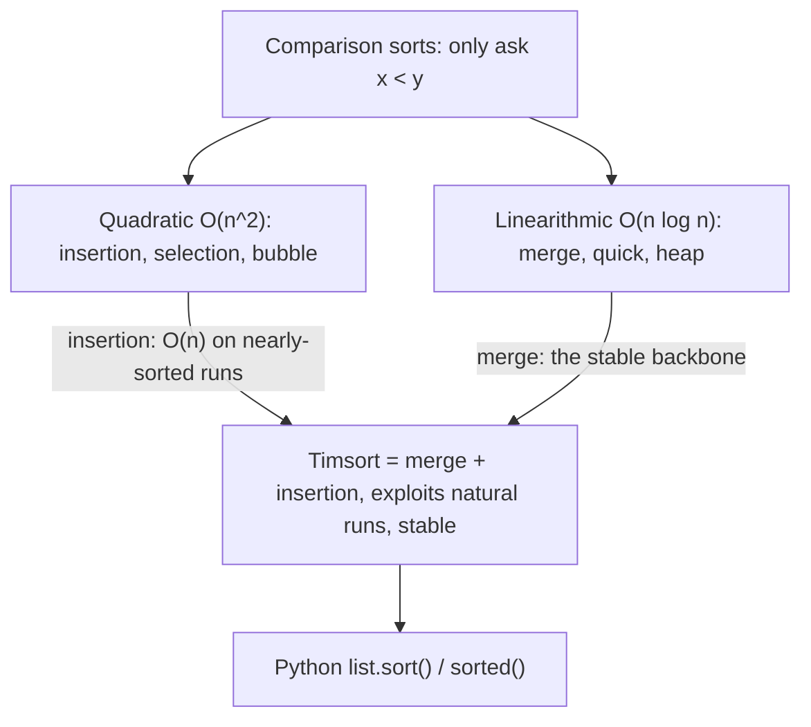
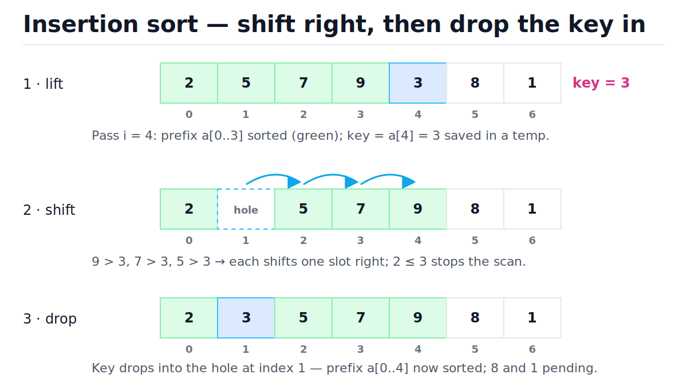
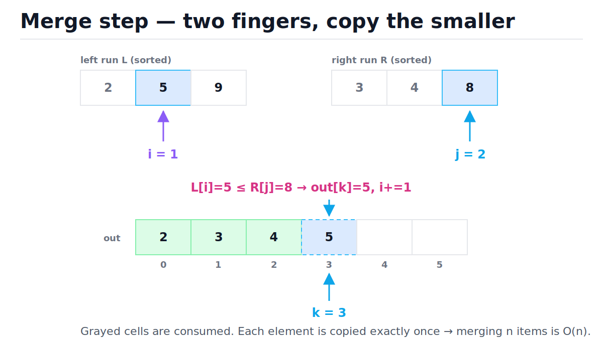
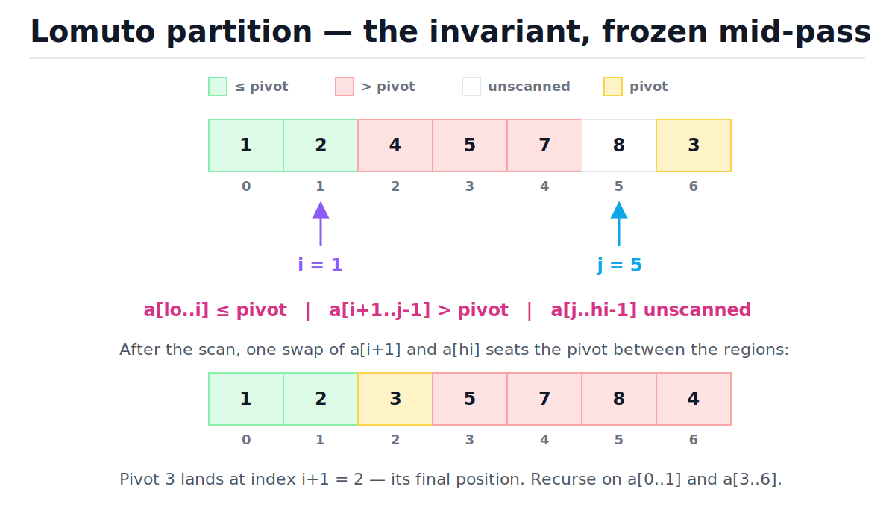

# Comparison Sorting Algorithms

[toc]

> **TL;DR:** Every sort that learns about its input only by asking "is x < y?" is a comparison sort, and no such sort can beat Ω(n log n) in the worst case. The quadratic sorts (insertion, selection, bubble) matter for tiny or nearly-sorted inputs; merge, quick, and heap each hit O(n log n) with different trade-offs in stability, space, and cache behavior. Python's built-in `list.sort()` runs Timsort — a stable merge/insertion hybrid that exploits pre-existing order and finishes sorted input in O(n).

## Vocabulary

Each term below is load-bearing for the rest of the note. The symbol line gives the canonical notation; the prose gives the one-line meaning.

**Comparison sort**

```math
\text{only allowed probe: } a_i < a_j \;\Rightarrow\; T(n) = \Omega(n \log n) \text{ worst case}
```

A sorting algorithm whose only way to inspect elements is a pairwise "less than" test. This restriction is what makes the n log n lower bound provable — counting sorts escape it by reading key values directly (see [Linear-Time Sorting](./12-linear-time-sorting.md)).

**Stable sort**

```math
i < j \;\wedge\; k_i = k_j \;\Rightarrow\; \pi(i) < \pi(j)
```

Equal keys keep their original relative order after sorting. Stability is what makes multi-pass, multi-key sorting work.

**In-place sort**

```math
S(n) = O(1) \text{ or } O(\log n) \text{ auxiliary space}
```

The algorithm rearranges elements inside the input array, using at most a constant (or logarithmic, for recursion stacks) amount of extra memory.

**Inversion**

```math
(i, j) : i < j \;\wedge\; a_i > a_j
```

A pair of elements that is out of order. Inversions measure "unsortedness": insertion sort runs in O(n + I) where I is the inversion count, which is why it flies on nearly-sorted data.

**Pivot / partition**

```math
a[lo..p-1] \le a[p] \le a[p+1..hi]
```

Quicksort's core move: pick one element (the pivot), then rearrange the range so everything smaller sits to its left and everything larger to its right. The pivot lands in its final sorted position.

**Natural run**

```math
\text{maximal ordered slice; Timsort forces } \text{minrun} \in [32, 64]
```

A maximal already-ascending (or strictly descending, then reversed) slice of the input. Timsort finds these runs for free and merges them instead of sorting from scratch.

**Galloping**

```math
\text{exponential search: probe offsets } 1, 3, 7, 15, \dots \text{ after } 7 \text{ one-sided wins}
```

Timsort's merge optimization: when one run keeps winning comparisons, switch from element-by-element merging to exponential (doubling) search to copy whole chunks at once.

## Intuition

Picture three tiers. The quadratic sorts grow a sorted region one element at a time — simple, in-place, great for 10 elements, hopeless for 10 million. The divide-and-conquer sorts cut the problem in half repeatedly, paying only log n levels of O(n) work. Timsort sits on top: it notices the order your data already has and only does the divide-and-conquer work the data actually needs.



> [!IMPORTANT]
> The Ω(n log n) bound applies to the *worst case* of *comparison-based* sorts only. Insertion sort beating it on nearly-sorted input (O(n + I)) and counting sort beating it everywhere (by not comparing) are both consistent with the theorem.

## How it works

Each subsection gives the idea, a trace, and runnable code. All implementations sort ascending and are kept deliberately close to the CLRS pseudocode so you can map between them.

### Insertion sort — shift, don't swap

Maintain a sorted prefix. Take the next element (the *key*), walk left through the prefix shifting every larger element one slot right, then drop the key into the hole. The shifting variant does one write per move instead of three-per-swap, which is why real implementations (including Timsort's small-run sorter) use it. Worst case O(n²); nearly-sorted input costs O(n + I) where I is the inversion count.

Here is the inner-shift trace for the pass i = 4 on `[2, 5, 7, 9, 3, 8, 1]`, key = 3. The "·" marks the hole — in real code the slot briefly holds a stale duplicate, but logically it is empty:

| Step | j | Compare a[j] vs key=3 | Decision | Array state |
| :--- | :---: | :--- | :--- | :--- |
| 0 | — | — | lift key = a[4] = 3 | [2, 5, 7, 9, ·, 8, 1] |
| 1 | 3 | 9 > 3 | shift 9 right | [2, 5, 7, ·, 9, 8, 1] |
| 2 | 2 | 7 > 3 | shift 7 right | [2, 5, ·, 7, 9, 8, 1] |
| 3 | 1 | 5 > 3 | shift 5 right | [2, ·, 5, 7, 9, 8, 1] |
| 4 | 0 | 2 ≤ 3 | stop scanning | [2, ·, 5, 7, 9, 8, 1] |
| 5 | — | — | drop key at index 1 | [2, 3, 5, 7, 9, 8, 1] |

The figure shows the same pass as three frames — lift, shift, drop. Watch how the hole walks left while the key never moves until the end:



```python
def insertion_sort(a: list[int]) -> None:
    """Sort a in place. O(n^2) worst case, O(n) on nearly-sorted input."""
    for i in range(1, len(a)):
        key = a[i]
        j = i - 1
        while j >= 0 and a[j] > key:  # shift, don't swap
            a[j + 1] = a[j]
            j -= 1
        a[j + 1] = key

nums = [2, 5, 7, 9, 3, 8, 1]
insertion_sort(nums)
assert nums == [1, 2, 3, 5, 7, 8, 9]

nearly = [1, 2, 3, 5, 4, 6]
insertion_sort(nearly)  # one inversion -> ~n comparisons total
assert nearly == [1, 2, 3, 4, 5, 6]
```

Stable (the `>` strict comparison never moves a key past an equal element), in-place, and the constant factor is tiny: contiguous memory access, branch-predictable inner loop.

### Selection sort — minimal swaps, always quadratic

Scan the unsorted suffix for its minimum, swap it to the front, repeat. It performs Θ(n²) comparisons *no matter what* — even on sorted input — because finding each minimum requires scanning everything remaining. Its one redeeming feature: at most n − 1 swaps, the fewest of any classic sort, which mattered when writes were expensive (EEPROM, flash with limited write cycles).

```python
def selection_sort(a: list[int]) -> int:
    """Sort a in place; return the number of swaps performed."""
    swaps = 0
    n = len(a)
    for i in range(n - 1):
        m = i
        for j in range(i + 1, n):
            if a[j] < a[m]:
                m = j
        if m != i:
            a[i], a[m] = a[m], a[i]
            swaps += 1
    return swaps

data = [64, 25, 12, 22, 11]
assert selection_sort(data) <= len(data) - 1  # never more than n-1 swaps
assert data == [11, 12, 22, 25, 64]
```

Selection sort is **unstable**: the long-range swap can jump an element over an equal key. The [Stability](#stability--why-equal-keys-keep-their-order) section below demonstrates this concretely.

### Bubble sort — a teaching tool, nothing more

Repeatedly sweep the array, swapping adjacent out-of-order pairs; each sweep bubbles the largest remaining element to the end. With the early-exit flag, sorted input costs one O(n) pass. There is no other reason to use it — it does strictly more writes than insertion sort for the same O(n²) comparisons. Learn it to recognize it, then move on.

```python
def bubble_sort(a: list[int]) -> int:
    """Sort a in place; return passes used. Early exit -> O(n) when sorted."""
    n = len(a)
    passes = 0
    for end in range(n - 1, 0, -1):
        passes += 1
        swapped = False
        for j in range(end):
            if a[j] > a[j + 1]:
                a[j], a[j + 1] = a[j + 1], a[j]
                swapped = True
        if not swapped:
            break
    return passes

xs = [3, 1, 2]
assert bubble_sort(xs) == 2  # pass 2 sees zero swaps and stops
assert xs == [1, 2, 3]
ys = [1, 2, 3, 4, 5]
assert bubble_sort(ys) == 1  # one pass, zero swaps, early exit
```

### Merge sort — split in half, merge with two fingers

Recursively split the array in half until pieces have one element (trivially sorted), then merge pairs of sorted runs back up. The merge is the whole algorithm: one finger per run, repeatedly copy the smaller front element to the output. Time is O(n log n) in *every* case — the input order changes nothing — and the merge needs O(n) extra buffer space. See [Recursion and Divide and Conquer](./10-recursion-and-divide-and-conquer.md) for the recursion pattern itself.

Full trace of merging L = [2, 5, 9] with R = [3, 4, 8]:

| Step | i | j | Compare | Decision | Output so far |
| :---: | :---: | :---: | :--- | :--- | :--- |
| 1 | 0 | 0 | L[0]=2 ≤ R[0]=3 | take 2, i→1 | [2] |
| 2 | 1 | 0 | L[1]=5 > R[0]=3 | take 3, j→1 | [2, 3] |
| 3 | 1 | 1 | L[1]=5 > R[1]=4 | take 4, j→2 | [2, 3, 4] |
| 4 | 1 | 2 | L[1]=5 ≤ R[2]=8 | take 5, i→2 | [2, 3, 4, 5] |
| 5 | 2 | 2 | L[2]=9 > R[2]=8 | take 8, j→3 (R empty) | [2, 3, 4, 5, 8] |
| 6 | 2 | — | R exhausted | copy L tail [9] | [2, 3, 4, 5, 8, 9] |

The figure freezes step 4: both fingers mid-run, three outputs already placed, 5 about to be copied:



```python
def merge(left: list[int], right: list[int]) -> list[int]:
    """Two-finger merge of two sorted lists. O(len(left) + len(right))."""
    out: list[int] = []
    i = j = 0
    while i < len(left) and j < len(right):
        if left[i] <= right[j]:  # <= keeps the merge stable
            out.append(left[i])
            i += 1
        else:
            out.append(right[j])
            j += 1
    out.extend(left[i:])  # at most one of these is non-empty
    out.extend(right[j:])
    return out

def merge_sort(a: list[int]) -> list[int]:
    """Stable, O(n log n) always, O(n) extra space."""
    if len(a) <= 1:
        return a[:]
    mid = len(a) // 2
    return merge(merge_sort(a[:mid]), merge_sort(a[mid:]))

assert merge([2, 5, 9], [3, 4, 8]) == [2, 3, 4, 5, 8, 9]
assert merge_sort([5, 2, 4, 7, 1, 3, 2, 6]) == [1, 2, 2, 3, 4, 5, 6, 7]
```

The `<=` in the merge is the stability guarantee: on ties, the left run's element (which appeared earlier in the original array) wins. Merge sort is also the backbone of external sorting (data bigger than RAM) and linked-list sorting, because merging needs only sequential access.

### Quicksort — partition around a pivot

Pick a pivot, partition so smaller elements land left of it and larger ones right, then recurse on both sides. The pivot is in its final position after each partition, so there is no merge step — the work happens on the way *down*. Expected O(n log n) with randomized pivots, in-place, unstable, with O(log n) expected stack depth.

**Lomuto partition** keeps two regions growing left-to-right: `a[lo..i]` holds values ≤ pivot, `a[i+1..j-1]` holds values > pivot, and `a[j..hi-1]` is unscanned. Each step examines `a[j]`; if it belongs in the small region, grow that region by one (`i += 1`) and swap it in. Trace on `[4, 7, 1, 5, 2, 8, 3]` with pivot = a[6] = 3:

| Step (j) | a[j] | a[j] ≤ 3? | Decision | i after | Array after |
| :---: | :---: | :---: | :--- | :---: | :--- |
| 0 | 4 | no | grow > region | −1 | [4, 7, 1, 5, 2, 8, 3] |
| 1 | 7 | no | grow > region | −1 | [4, 7, 1, 5, 2, 8, 3] |
| 2 | 1 | yes | i→0, swap a[0]↔a[2] | 0 | [1, 7, 4, 5, 2, 8, 3] |
| 3 | 5 | no | grow > region | 0 | [1, 7, 4, 5, 2, 8, 3] |
| 4 | 2 | yes | i→1, swap a[1]↔a[4] | 1 | [1, 2, 4, 5, 7, 8, 3] |
| 5 | 8 | no | grow > region | 1 | [1, 2, 4, 5, 7, 8, 3] |
| end | — | — | swap a[i+1]↔a[hi]: pivot home | — | [1, 2, **3**, 5, 7, 8, 4] → return 2 |

The figure freezes the moment after step 4 — the invariant regions are visible, and the final swap that seats the pivot is shown below:



```python
import random
from typing import Optional

def lomuto_partition(a: list[int], lo: int, hi: int) -> int:
    """Partition a[lo..hi] around pivot a[hi]; return the pivot's final index."""
    pivot = a[hi]
    i = lo - 1  # last index of the <= pivot region
    for j in range(lo, hi):
        if a[j] <= pivot:
            i += 1
            a[i], a[j] = a[j], a[i]
    a[i + 1], a[hi] = a[hi], a[i + 1]  # seat the pivot
    return i + 1

def quicksort(a: list[int], lo: int = 0, hi: Optional[int] = None) -> None:
    """Randomized quicksort: expected O(n log n), in place, unstable."""
    if hi is None:
        hi = len(a) - 1
    if lo >= hi:
        return
    p = random.randint(lo, hi)  # randomized pivot defeats adversarial input
    a[p], a[hi] = a[hi], a[p]
    mid = lomuto_partition(a, lo, hi)
    quicksort(a, lo, mid - 1)
    quicksort(a, mid + 1, hi)

arr = [4, 7, 1, 5, 2, 8, 3]
pos = lomuto_partition(arr, 0, len(arr) - 1)
assert pos == 2 and arr == [1, 2, 3, 5, 7, 8, 4]  # matches the trace table

mixed = list(range(100))
random.shuffle(mixed)
quicksort(mixed)
assert mixed == list(range(100))
```

> [!WARNING]
> A naive "pivot = last element" quicksort degrades to O(n²) on *already sorted* input — the most common input in practice. Every partition puts everything on one side, recursion depth hits n, and large n overflows the stack. Randomizing the pivot (or median-of-three) makes adversarial inputs vanishingly unlikely.

The cliff is measurable. With a fixed last-element pivot, sorted input forces exactly n(n−1)/2 comparisons; one line of randomization collapses it to roughly 1.39 n log₂ n expected:

```python
def quicksort_compares(a: list[int], randomize: bool) -> int:
    """Sort a in place and return how many comparisons the partitions made."""
    count = 0

    def sort(lo: int, hi: int) -> None:
        nonlocal count
        if lo >= hi:
            return
        if randomize:
            p = random.randint(lo, hi)
            a[p], a[hi] = a[hi], a[p]
        pivot = a[hi]
        i = lo - 1
        for j in range(lo, hi):
            count += 1
            if a[j] <= pivot:
                i += 1
                a[i], a[j] = a[j], a[i]
        a[i + 1], a[hi] = a[hi], a[i + 1]
        sort(lo, i)
        sort(i + 2, hi)

    sort(0, len(a) - 1)
    return count

n = 200
naive = quicksort_compares(list(range(n)), randomize=False)
assert naive == n * (n - 1) // 2  # 19900 -- the O(n^2) cliff on sorted input
randomized = quicksort_compares(list(range(n)), randomize=True)
assert randomized < naive // 4  # expected ~1.39 n log2 n ~= 2100
```

Quicksort is unstable: the long-distance swaps in partition reorder equal keys. It wins in practice on random data because partitioning scans memory sequentially (cache-friendly) and does everything in place.

### Heapsort — guaranteed n log n, constant space, cold cache

Build a max-heap over the array in O(n), then repeatedly swap the root (the maximum) with the last heap element, shrink the heap by one, and sift the new root down. Worst case O(n log n) guaranteed, O(1) extra space, no recursion. The catch: sift-down jumps from index i to 2i + 1, so for large arrays nearly every comparison is a cache miss — heapsort is typically 2–4× slower than quicksort on real hardware despite the identical Big-O. See [Heaps and Priority Queues](./08-heaps-and-priority-queues.md) for the heap itself.

```python
def _sift_down(a: list[int], start: int, end: int) -> None:
    """Restore the max-heap property for the subtree rooted at start."""
    root = start
    while 2 * root + 1 <= end:
        child = 2 * root + 1  # left child
        if child + 1 <= end and a[child] < a[child + 1]:
            child += 1  # right child is bigger
        if a[root] >= a[child]:
            return
        a[root], a[child] = a[child], a[root]
        root = child

def heapsort(a: list[int]) -> None:
    """O(n log n) worst case, O(1) extra space, unstable."""
    n = len(a)
    for start in range(n // 2 - 1, -1, -1):  # build max-heap: O(n)
        _sift_down(a, start, n - 1)
    for end in range(n - 1, 0, -1):  # pop max, shrink heap
        a[0], a[end] = a[end], a[0]
        _sift_down(a, 0, end - 1)

h = [12, 11, 13, 5, 6, 7]
heapsort(h)
assert h == [5, 6, 7, 11, 12, 13]
```

Heapsort's niche today: guaranteed worst-case bounds with zero allocation. C++'s `std::sort` (introsort) falls back to heapsort when quicksort's recursion gets suspiciously deep, killing the O(n²) case for good.

### Stability — why equal keys keep their order

Stability sounds academic until you sort the same data by two keys. Suppose contest submissions arrive in time order and you sort by score, descending. A stable sort keeps earlier submissions ahead of later ones *within the same score* — ties break by submission time automatically, with no extra key.

```python
submissions = [("alice", 90), ("bob", 85), ("carol", 90), ("dave", 85)]

by_score = sorted(submissions, key=lambda s: s[1], reverse=True)
assert by_score == [("alice", 90), ("carol", 90), ("bob", 85), ("dave", 85)]
# ties keep submission order: alice before carol, bob before dave
```

An unstable sort destroys that property silently. Watch selection sort flip two equal keys — same sorted order by key, wrong payload order:

```python
def selection_sort_by_key(a: list[tuple[int, str]]) -> None:
    """Selection sort comparing only the int key -- demonstrates instability."""
    n = len(a)
    for i in range(n - 1):
        m = i
        for j in range(i + 1, n):
            if a[j][0] < a[m][0]:
                m = j
        a[i], a[m] = a[m], a[i]

pairs = [(2, "first"), (2, "second"), (1, "x")]
selection_sort_by_key(pairs)
assert pairs == [(1, "x"), (2, "second"), (2, "first")]  # equal keys flipped!

stable = sorted([(2, "first"), (2, "second"), (1, "x")], key=lambda p: p[0])
assert stable == [(1, "x"), (2, "first"), (2, "second")]  # Timsort keeps order
```

The very first swap — moving `(1, "x")` to the front — jumps `(2, "first")` over `(2, "second")`. Insertion sort, bubble sort, merge sort, and Timsort are stable; selection sort, quicksort, and heapsort are not.

### Timsort — what Python actually runs

`list.sort()` and `sorted()` run Timsort, Tim Peters' 2002 hybrid designed around one observation: real-world data is rarely random. The algorithm scans for **natural runs** (already ascending, or strictly descending — those get reversed in place), extends short runs to a **minrun** of 32–64 elements using binary insertion sort, pushes runs onto a stack, and merges them under invariants that keep merge sizes balanced. During a merge, if one run wins 7 comparisons in a row (`MIN_GALLOP`), it switches to **galloping**: exponential search to find how far the winning streak extends, then a bulk copy. The result: stable, O(n log n) worst case, and O(n) — a single detection pass — on already-sorted input. All of this is documented in CPython's `Objects/listsort.txt`.

The O(n) best case is directly observable by counting comparisons:

```python
compare_count = [0]

class Tracked:
    """Wraps an int and counts every < comparison the sort performs."""

    def __init__(self, value: int) -> None:
        self.value: int = value

    def __lt__(self, other: "Tracked") -> bool:
        compare_count[0] += 1
        return self.value < other.value

ascending = [Tracked(i) for i in range(1000)]
compare_count[0] = 0
ascending.sort()
assert compare_count[0] == 999  # one run-detection pass: O(n) best case

descending = [Tracked(i) for i in range(1000, 0, -1)]
compare_count[0] = 0
descending.sort()
assert compare_count[0] == 999  # one strictly-descending run: detect + reverse
```

> [!NOTE]
> CPython 3.11 replaced Timsort's original merge-collapse rules with the *powersort* merge policy (Munro & Wild, 2018), which picks nearly-optimal merge orders for the runs found. Run detection, galloping, and stability are unchanged — it is still called Timsort.

Control the sort with `key=` (a function computed **once per element**, not once per comparison) and `reverse=`:

```python
words = ["bb", "a", "ccc", "dd"]
assert sorted(words, key=len) == ["a", "bb", "dd", "ccc"]  # bb before dd: stable
assert sorted([3, 1, 2], reverse=True) == [3, 2, 1]

events = [("db", 17), ("api", 5), ("db", 3), ("api", 11)]
events.sort(key=lambda e: e[1])  # secondary key first
events.sort(key=lambda e: e[0])  # then primary: stability keeps time order
assert events == [("api", 5), ("api", 11), ("db", 3), ("db", 17)]
```

> [!TIP]
> In production Python, never hand-roll a sort — `list.sort()` is C-speed, stable, and exploits existing order. Your job reduces to designing the `key=` function. For multi-key sorts, either build a tuple key or chain `.sort()` calls from the least significant key to the most significant and let stability do the rest.

## Complexity

One table for everything in this note. "In-place" follows the usual convention of allowing quicksort's recursion stack.

| Algorithm | Best | Average | Worst | Space | Stable | In-place |
| :--- | :---: | :---: | :---: | :---: | :---: | :---: |
| Insertion sort | O(n) | O(n²) | O(n²) | O(1) | Yes | Yes |
| Selection sort | O(n²) | O(n²) | O(n²) | O(1) | No | Yes |
| Bubble sort (early exit) | O(n) | O(n²) | O(n²) | O(1) | Yes | Yes |
| Merge sort | O(n log n) | O(n log n) | O(n log n) | O(n) | Yes | No |
| Quicksort (randomized) | O(n log n) | O(n log n) | O(n²) | O(log n) expected stack | No | Yes |
| Heapsort | O(n log n) | O(n log n) | O(n log n) | O(1) | No | Yes |
| Timsort (`list.sort`) | O(n) | O(n log n) | O(n log n) | O(n) | Yes | No |

Why O(n log n) for merge sort: each split halves the problem and each level of the recursion tree does linear merging work. The recurrence and its solution:

```math
T(n) = 2\,T\!\left(\tfrac{n}{2}\right) + cn, \qquad T(1) = c
```

```math
T(n) = cn \log_2 n + cn = O(n \log n)
```

The recursion tree has log₂ n levels; level k has 2^k subproblems of size n/2^k, so every level costs exactly cn. Total: cn per level × log n levels. The same recurrence governs quicksort's *expected* cost with random pivots; the known exact result is E[Cₙ] = 2(n+1)Hₙ − 4n ≈ 1.39 n log₂ n comparisons.

Why no comparison sort can do better: a deterministic comparison sort is a binary decision tree. Each comparison has two outcomes, and the tree must have at least one leaf per possible input permutation — all n! of them. A binary tree of height h has at most 2^h leaves, so:

```math
2^h \ge n! \;\Rightarrow\; h \ge \log_2(n!) = n\log_2 n - n\log_2 e + O(\log n) = \Omega(n \log n)
```

Some root-to-leaf path — some input — forces at least that many comparisons (the bound on log₂(n!) follows from Stirling's approximation; see [Big-O Notation and Complexity Analysis](./01-big-o-notation-and-complexity-analysis.md)).

## Memory model in Python

A CPython list is a contiguous C array of pointers (`PyObject **ob_item`), not an array of values — details in [Memory Model and PyObject Layout](../Programming-Languages/Python/13-memory-model-and-pyobject-layout.md). Sorting a list therefore moves 8-byte pointers around, never the objects themselves; the integers, strings, or tuples stay wherever the allocator put them. This has real consequences for which algorithm wins in practice.

- **Comparisons dominate, not swaps.** A generic comparison is a dynamic-dispatch rich-compare call. `list.sort` mitigates this with a pre-pass: if every element is the same exact type (all `int`, all `str`, all `float`, or tuples thereof), it swaps in specialized unsafe compare functions and skips the dispatch machinery — often ~2× faster. Mixed-type lists pay full price.
- **`key=` is decorate-sort-undecorate built in.** CPython computes all keys up front into a temporary array — n key calls total, O(n) extra memory — then sorts pointer pairs. A `key=` function is almost always cheaper than the old `cmp` style, which paid a Python-level call per *comparison* (O(n log n) calls).
- **Mutation during sort is detected.** `list.sort` empties the list internally while sorting and reattaches the result; mutating the list from a comparison raises `ValueError` rather than corrupting memory.
- **Cache behavior still shows through.** Merge-style passes touch pointers sequentially (prefetcher-friendly); heapsort's stride-doubling jumps defeat the prefetcher. Even one level removed from the data, locality of the *pointer array* matters at scale — see [Arrays and Dynamic Arrays](./02-arrays-and-dynamic-arrays.md).
- **Timsort's buffer is bounded.** The merge buffer needs at most n/2 pointer slots, allocated lazily and grown only when a merge needs it.

> [!CAUTION]
> Sorting floats containing NaN silently produces garbage ordering — NaN answers `False` to every comparison, which breaks the total-order assumption every comparison sort relies on. `sorted([3.0, float("nan"), 1.0])` returns `[3.0, nan, 1.0]` *unsorted, with no error*. Filter NaNs first or use a key like `math.isnan` to quarantine them.

## Real-world example

You are triaging an incident: thousands of log records, and you want them grouped by severity (most severe first) but chronological *within* each severity, so the first ERROR you read is the earliest one — likely the root cause. This is mixed-direction multi-key sorting, and stability makes it a two-liner: sort by the secondary key first, then by the primary key, and the second pass preserves the first pass's order among ties.

```python
from typing import NamedTuple

class LogRecord(NamedTuple):
    ts: int
    level: str
    msg: str

LEVELS = {"ERROR": 3, "WARN": 2, "INFO": 1}

logs = [
    LogRecord(104, "INFO", "cache warm"),
    LogRecord(101, "ERROR", "db timeout"),
    LogRecord(103, "ERROR", "db retry failed"),
    LogRecord(102, "WARN", "slow query"),
]

triage = sorted(logs, key=lambda r: r.ts)  # pass 1: oldest first
triage.sort(key=lambda r: LEVELS[r.level], reverse=True)  # pass 2: severity desc

assert [r.ts for r in triage] == [101, 103, 102, 104]
assert triage[0].msg == "db timeout"  # oldest ERROR surfaces to the top

# same result in a single pass with a tuple key (all-ascending trick: negate)
single = sorted(logs, key=lambda r: (-LEVELS[r.level], r.ts))
assert single == triage
```

Both passes are Timsort, so total cost is O(n log n) — and if the logs were already mostly chronological, pass 1 approaches O(n) thanks to natural-run detection. The tuple-key version works here because the numeric severity can be negated; the two-pass idiom is the general tool when a key can't be inverted (e.g., descending strings).

## When to use / When NOT to use

Choosing among these is mostly about three questions: how big is n, is the data already partially ordered, and do you need stability or guaranteed bounds?

| Situation | Reach for | Why |
| :--- | :--- | :--- |
| Anything in Python | `list.sort()` / `sorted()` | C-speed Timsort: stable, adaptive, battle-tested |
| n ≲ 32, or nearly-sorted stream | Insertion sort | O(n + I); tiny constants; what hybrids use for small runs |
| Need guaranteed O(n log n) + stability | Merge sort | Worst case is the average case; sequential access |
| Data larger than RAM, linked lists | Merge sort | Merging needs only sequential reads/writes |
| In-place, average speed matters, C/systems | Randomized quicksort | Cache-friendly partition, no allocation |
| Hard real-time / zero allocation | Heapsort | O(n log n) worst case, O(1) space, no recursion |
| Writes are expensive | Selection sort | At most n − 1 swaps |
| Keys are small integers | Don't compare at all | Counting/radix beat n log n — see [Linear-Time Sorting](./12-linear-time-sorting.md) |

Do **not** hand-implement quicksort with a fixed pivot in anything user-facing (sorted input is the common case, and it is also an adversarial DoS vector), don't use bubble sort outside a classroom, and don't use an unstable sort when a later consumer depends on tie order — that dependency is usually undocumented and breaks silently.

## Common mistakes

- **"Quicksort is O(n log n)"** — its *expected* cost is O(n log n); the worst case is O(n²), and with a naive pivot the worst case is triggered by sorted input, the most common input there is.
- **"Swapping and shifting are the same in insertion sort"** — a swap is three writes, a shift is one. The shifting variant does ~3× fewer writes; it is what real implementations use.
- **"Stability doesn't matter, the array ends up sorted either way"** — sorted *by the key you compared*, yes; but payload order among equal keys differs, and multi-pass sorting workflows depend on it.
- **"Merge sort is always worse than quicksort because of the O(n) buffer"** — for linked lists, external data, and stability requirements, merge sort is the only one of the two that works at all.
- **"Selection sort and insertion sort are interchangeable"** — insertion is O(n) on nearly-sorted data and stable; selection is Θ(n²) always and unstable. They overlap only in being quadratic and in-place.
- **"`key=` is called for every comparison"** — it is called exactly once per element (n calls), then cached. That is precisely why it replaced `cmp`.
- **"Python's sort is a textbook merge sort"** — it is Timsort: run detection, binary-insertion minruns, gallop-mode merging, and (since 3.11) the powersort merge policy.

## Interview questions and answers

Sorting questions test whether you know the trade-offs, not whether you can recite pseudocode. Practice saying these out loud.

**Q1. Why can't any comparison sort beat O(n log n)?**
**Answer:** Model the algorithm as a binary decision tree where each node is one comparison. The tree needs a distinct leaf for each of the n! input permutations, and a binary tree with n! leaves has height at least log₂(n!), which is Θ(n log n) by Stirling. So some input forces that many comparisons. The bound only constrains comparison-based sorts — counting sort sidesteps it by indexing on key values.

**Q2. When does quicksort go quadratic, and what do you do about it?**
**Answer:** Whenever partitions are consistently lopsided — classically, a first- or last-element pivot on already-sorted or reverse-sorted input, where every partition peels off one element. Fixes: pick the pivot uniformly at random or use median-of-three, which makes bad splits exponentially unlikely; production libraries go further with introsort, which monitors recursion depth and falls back to heapsort past 2·log n levels.

**Q3. What does stability mean, and give a case where it matters.**
**Answer:** Equal keys keep their input order. It matters whenever you sort by one key but a previous ordering carries meaning: sort time-ordered transactions by account and a stable sort keeps each account's history chronological for free. It's also what makes multi-key sorting composable — sort by secondary key, then by primary, and ties resolve correctly.

**Q4. What algorithm does Python's `sorted()` use and why is it fast on real data?**
**Answer:** Timsort — a stable hybrid of merge sort and binary insertion sort. It scans for natural runs, so partially-ordered data needs fewer, bigger merges; fully sorted input is verified in one O(n) pass. During merges it gallops: after one side wins seven straight comparisons it switches to exponential search and bulk copies. Worst case is still O(n log n).

**Q5. Merge sort vs quicksort — when would you pick each?**
**Answer:** Merge sort when I need stability, guaranteed O(n log n), linked lists, or external sorting, since it only needs sequential access and its worst case equals its average. Quicksort when I'm sorting arrays in memory and want in-place behavior and cache-friendly scans — with a randomized pivot its expected ~1.39 n log₂ n comparisons and low constants usually win.

**Q6. Why does anyone still teach selection sort?**
**Answer:** Two reasons. It cleanly separates "find the minimum" from "place it," which makes it a good first algorithm. And it's write-optimal among the classics — at most n − 1 swaps — which is genuinely relevant when writes are costly, like flash memory with limited erase cycles.

**Q7. Heapsort has O(n log n) worst case and O(1) space. Why isn't it everyone's default?**
**Answer:** Cache behavior and stability. Sift-down jumps from index i to 2i+1, so on large arrays nearly every step is a cache miss, making it 2–4× slower than quicksort in practice. It's also unstable. Its real role is as the fallback inside introsort and in zero-allocation, hard-real-time settings.

**Q8. Why is `key=` preferred over a comparator function in Python?**
**Answer:** The key function runs once per element — n calls — and the results are cached (decorate-sort-undecorate, built into the C implementation). A comparator runs once per comparison, which is n log n Python-level calls. If you truly need a comparator, `functools.cmp_to_key` adapts it, but it's the slow path.

**Q9. You sort a million floats and the output isn't sorted. No exception. What happened?**
**Answer:** Almost certainly NaN. NaN compares false against everything, violating the total order Timsort assumes, so elements end up in arbitrary positions silently. Same failure mode applies to any inconsistent `__lt__` or a key function that isn't a total order. Filter or quarantine NaNs before sorting, e.g. key on `(math.isnan(x), x)`.

## Practice path

Work these in order; each drill isolates one mechanism before the next builds on it.

1. Hand-trace insertion sort on `[5, 2, 4, 6, 1, 3]`, writing the array after every pass. Count total shifts; check it equals the inversion count.
2. Implement `merge(left, right)` from memory; test with overlapping values (`[1, 3, 3]`, `[2, 3]`) and verify which 3s come first (stability).
3. Hand-trace Lomuto partition on `[3, 8, 2, 5, 1, 4, 7, 6]` with pivot 6, tracking i and j at every step.
4. Predict, then measure, comparison counts for naive-pivot quicksort on `list(range(50))`. Confirm n(n−1)/2.
5. Implement heapsort from memory; the only hard part is `_sift_down`'s loop bounds.
6. Build a `(key, payload)` example where quicksort and `sorted()` give different outputs. Explain why in one sentence.
7. Sort a list of dicts by three keys with mixed directions using only stable passes (no tuple negation).
8. Read the first 200 lines of CPython's `listsort.txt` and write down what minrun is for and why it's pinned to 32–64.
9. Then move to [Linear-Time Sorting](./12-linear-time-sorting.md) and establish for yourself exactly where the Ω(n log n) bound stops applying.

## Copyable takeaways

- Comparison sorts can't beat Ω(n log n) worst case: n! permutations need log₂(n!) ≈ n log₂ n bits of comparison answers.
- Insertion sort: O(n + inversions) — the tool for tiny arrays and nearly-sorted data; shift, don't swap; stable.
- Selection sort: Θ(n²) always, unstable, but at most n − 1 swaps. Bubble sort: teaching tool only.
- Merge sort: O(n log n) *always*, stable, O(n) buffer; the `<=` on ties is the stability. Backbone of external sorting.
- Quicksort: expected O(n log n), in-place, unstable; fixed pivot + sorted input = O(n²) — randomize the pivot.
- Heapsort: guaranteed O(n log n), O(1) space, unstable, cache-hostile; introsort's safety net.
- Stability = equal keys keep input order; it's what makes chained multi-key sorts work (sort secondary, then primary).
- Python = Timsort: natural runs, minrun 32–64, galloping merges, O(n) on sorted input, stable; powersort merge policy since 3.11.
- `key=` runs once per element (not per comparison); `reverse=True` beats negating keys for readability.
- NaN or any inconsistent comparison silently corrupts sort order — no exception is raised.

## Sources

- Cormen, Leiserson, Rivest, Stein — *Introduction to Algorithms* (CLRS), 4th ed.: §2.1 insertion sort, §2.3 merge sort, ch. 6 heapsort, ch. 7 quicksort (Lomuto partition, randomized analysis), §8.1 comparison-sort lower bound.
- Tim Peters — `Objects/listsort.txt`, CPython source: <https://github.com/python/cpython/blob/main/Objects/listsort.txt> (runs, minrun, galloping, merge invariants).
- Python docs — Sorting HOW TO: <https://docs.python.org/3/howto/sorting.html> (`key=`, stability guarantee, decorate-sort-undecorate).
- Python wiki — TimeComplexity: <https://wiki.python.org/moin/TimeComplexity>.
- Sedgewick & Wayne — *Algorithms*, 4th ed., ch. 2 (elementary sorts, mergesort, quicksort empirical comparisons).
- Munro & Wild — "Nearly-Optimal Mergesorts: Fast, Practical Sorting Methods That Optimally Adapt to Existing Runs", ESA 2018: <https://arxiv.org/abs/1805.04154> (powersort, adopted by CPython 3.11).

## Related

- [Big-O Notation and Complexity Analysis](./01-big-o-notation-and-complexity-analysis.md) — the notation behind every bound here.
- [Linear-Time Sorting](./12-linear-time-sorting.md) — counting/radix/bucket sorts that escape the Ω(n log n) bound.
- [Heaps and Priority Queues](./08-heaps-and-priority-queues.md) — the data structure heapsort is built on.
- [Recursion and Divide and Conquer](./10-recursion-and-divide-and-conquer.md) — the recurrence patterns behind merge sort and quicksort.
- [Arrays and Dynamic Arrays](./02-arrays-and-dynamic-arrays.md) — why contiguous memory and cache lines decide real-world speed.
- [Memory Model and PyObject Layout](../Programming-Languages/Python/13-memory-model-and-pyobject-layout.md) — what a CPython list actually holds.
