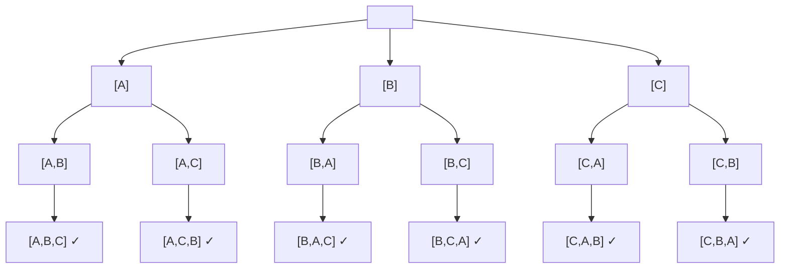

# Greedy Algorithms and Backtracking

[toc]

> **TL;DR:** Greedy algorithms build a solution one locally-optimal choice at a time — they work when the problem has the *greedy-choice property* and *optimal substructure*, but silently produce wrong answers otherwise. Backtracking is the systematic fallback: explore every partial solution in a state-space tree, prune branches that violate constraints, and undo choices on retreat. Together they bracket the landscape between lightning-fast heuristics and exhaustive search.

---

## Vocabulary

**Greedy-choice property** — a globally optimal solution can always be built by making the locally optimal (greedy) choice at each step, without reconsidering past decisions.

**Optimal substructure** — an optimal solution to the problem contains optimal solutions to its sub-problems. Required by both greedy and dynamic programming; the difference is whether one sub-problem suffices (greedy) or you need all of them (DP).

**Exchange argument** — the canonical proof technique for greedy correctness. Show that swapping any non-greedy choice for the greedy one cannot improve the objective; therefore the greedy solution is at least as good as any other.

**Feasible solution** — a candidate that satisfies all constraints (but may not be optimal).

**Backtracking** — a recursive search strategy that builds a solution incrementally, abandons any partial solution that cannot possibly be extended to a valid complete solution (pruning), and backtracks to try an alternative.

**State-space tree** — the implicit tree whose nodes are partial solutions and whose edges are choices. Backtracking performs DFS on this tree.

**Pruning** — cutting off a subtree of the state-space tree when the current partial solution already violates a constraint (constraint-based pruning) or cannot improve on the best solution found so far (bound-based pruning).

**Constraint satisfaction problem (CSP)** — a problem defined by variables, domains for each variable, and constraints that the assignment must satisfy. Backtracking is the textbook engine for CSPs.

**Optimal subproblem overlap** — when sub-problems repeat across the recursion tree, pure backtracking recomputes them; memoisation converts backtracking into top-down DP.

---

## Intuition

### When greedy is enough

Think of activity selection: you have a set of meetings and a single conference room. The myopic rule "always pick the meeting that ends earliest" maximises the number of meetings you can fit. The proof is immediate by exchange: any solution that picks a later-ending meeting first can swap it for the earliest-ending one without losing any subsequent meeting. One pass, O(n log n) for the sort, done.

Greedy works when the problem has a "today's choice doesn't poison tomorrow" structure. The moment taking item A forces you to give up a combination of B+C that was worth more, greedy breaks — that's the 0/1 knapsack, and you need DP.

### When greedy fails and backtracking is correct

Consider coins `{1, 3, 4}` with target 6. The greedy rule "always pick the largest coin that fits" chooses 4+1+1 = 3 coins. The optimal answer is 3+3 = 2 coins. Greedy's local optimum blocked the global one. Backtracking finds the optimal by exploring all possibilities — or DP finds it in O(target × |coins|) time by reusing sub-problem answers.

Backtracking is exponential in the worst case, but pruning can reduce the constant dramatically. For many practical CSPs (Sudoku, N-Queens, scheduling with hard constraints) the pruned search tree is tiny.

### When you need DP over backtracking

If the backtracking search tree has overlapping sub-problems (same subproblem state reached via multiple paths), memoising the results converts exponential backtracking into polynomial DP. The clearest signal: the recursion parameters form a small integer state (e.g., remaining capacity in knapsack, index into a string).
---

## Math foundations

The five sub-sections below formalise the intuitions from the previous section. They are not decoration: each one gives you a *test* you can apply to a new problem to decide whether greedy will work, how expensive brute-force search really is, and why even small pruning fractions matter more than they look.

### The exchange argument — formally

The exchange argument is the proof template for any greedy correctness claim. The strategy is always the same: take an arbitrary optimal solution OPT, locate the first index where it disagrees with the greedy solution G, and show that swapping OPT's choice for G's choice produces a solution that is no worse. Repeating the swap for every disagreement transforms OPT into G without decreasing the objective, proving G is also optimal.

For activity selection with activities sorted by non-decreasing finish time, the inductive claim is:

```math
\text{Claim: } f(g_i) \leq f(o_i) \text{ for all } i \leq \min(|G|, |OPT|)
```

where g_i is the i-th activity picked by greedy and o_i is the i-th activity in OPT (both sorted by finish time). The base case `i = 1` holds because greedy picks the globally earliest-finishing activity. The inductive step: assuming `f(g_{i-1}) ≤ f(o_{i-1})`, greedy at step i picks the earliest-finishing activity compatible with g_{i-1}; since o_i is compatible with o_{i-1}` and `f(g_{i-1}) ≤ f(o_{i-1}) ≤ f(o_i)`, greedy has at least as many compatible choices as OPT, so `f(g_i) ≤ f(o_i)`. Because `f(g_{|G|}) ≤ f(o_{|G|})` (greedy never finishes later than OPT at any position), greedy can always accommodate at least one more activity wherever OPT can — so `|G| ≥ |OPT|`. Together with OPT being optimal:

```math
|G| \geq |OPT| \implies |G| = |OPT|
```

> [!IMPORTANT]
> The exchange argument is inductive over the *position* in the solution, not over the items. You must show that swapping at position i does not disqualify the greedy choices at positions i+1, i+2, … — this is where many informal "proofs" silently assume what they're trying to prove.

### Matroid theory — when greedy is GUARANTEED to work

A matroid is the algebraic structure that exactly characterises the problems where a greedy algorithm is provably optimal. Knowing the matroid conditions tells you in advance whether to trust greedy or switch to DP. A matroid is a pair (E, I) where E is a finite ground set (the candidates) and I is a family of subsets of E called the *independent sets*. Two axioms define a matroid:

```math
\textbf{Hereditary (downward closure):} \quad B \in \mathcal{I},\; A \subseteq B \implies A \in \mathcal{I}
```

```math
\textbf{Exchange property:} \quad A, B \in \mathcal{I},\; |A| < |B| \implies \exists\, x \in B \setminus A \text{ such that } A \cup \{x\} \in \mathcal{I}
```

The fundamental theorem of matroids (Rado–Edmonds): a greedy algorithm that repeatedly adds the maximum-weight independent element correctly maximises a weight function `w: E → ℝ` over all maximal independent sets *if and only if* (E, I) is a matroid.

Two canonical examples show exactly where greedy lands:

- **Graphic matroid (MST):** E = edges of a graph, I = all acyclic edge subsets (forests). Hereditary: any subset of a forest is a forest. Exchange: if forest A has fewer edges than forest B, there is an edge in B not in A whose addition keeps A acyclic (proved by a spanning-tree argument). The matroid structure guarantees Kruskal's greedy algorithm is optimal.
- **0/1 knapsack:** E = items, I = subsets with total weight ≤ W. The exchange property fails: you cannot always extend a lighter-weight set by one item from a heavier set while staying under capacity. No matroid → no greedy guarantee → you need DP.

> [!NOTE]
> The graphic matroid insight is why Kruskal's and Prim's MST algorithms need no proof-by-contradiction argument — the matroid theorem does all the work. If you can show the problem's feasible sets form a matroid, the greedy optimality is automatic.

### Branching factor and depth — the cost of brute-force search

The state-space tree that backtracking explores has a branching factor b (number of choices at each node) and depth d (length of a complete solution). Without any pruning, the total number of nodes visited is bounded by the sum of a geometric series, which in practice is dominated by the leaf count. The three growth regimes that cover most backtracking problems are:

```math
\begin{aligned}
\text{General tree:} & \quad O(b^d) \\
\text{Subsets (b=2, d=n):} & \quad O(2^n) \\
\text{Permutations (b shrinks):} & \quad O(n!) = O\!\left(\prod_{k=1}^{n} k\right)
\end{aligned}
```

Combinations C(n, k) sit between the two:

```math
\binom{n}{k} = \frac{n!}{k!\,(n-k)!} \leq 2^n
```

These are worst-case unpruned bounds. For n = 20: subsets gives 1 048 576 nodes (feasible), permutations gives 2 432 902 008 176 640 000 nodes (not feasible without pruning). This side-by-side comparison makes the asymptotic gap visceral: factorial grows catastrophically faster than exponential, which itself grows catastrophically faster than polynomial.

> [!WARNING]
> Complexity classes like O(2^n) and O(n!) describe the *unpruned* tree. The actual nodes visited after pruning can be orders of magnitude smaller — but the worst case is still exponential/factorial. Never rely on average-case pruning without benchmarking on adversarial inputs.

### Pruning effectiveness as effective branching factor

If a pruning rule eliminates a fraction p of candidate branches at *every* node uniformly, the effective branching factor b_eff = b(1 − p) replaces b in the growth formula:

```math
T_{\text{pruned}} = O\!\left(b_{\text{eff}}^{\,d}\right) = O\!\left(\bigl(b(1-p)\bigr)^d\right) = O\!\left(b^d \cdot (1-p)^d\right)
```

The reduction factor is (1 − p)^d — exponential in the depth. For b = 4, d = 20, and p = 0.5 (pruning half the branches at each node):

```math
\text{Reduction} = (1-0.5)^{20} = 2^{-20} \approx 10^{-6}
```

A million-fold collapse from what looks like a modest pruning fraction. This formalises the intuition behind alpha-beta pruning in game-tree search: with perfect move ordering, alpha-beta reduces the effective branching factor from b to approximately sqrt(b) (p ≈ 1 − 1/√b), turning a depth-d search from O(b^d) to O(b^(d/2)). In chess engines with b ≈ 35 and d ≈ 6, this halves the search depth you can afford, roughly doubling the game-tree horizon.

```math
\text{Alpha-beta (perfect ordering):} \quad b_{\text{eff}} \approx \sqrt{b} \implies T = O\!\left(b^{d/2}\right)
```

> [!TIP]
> The practical implication: invest heavily in move ordering and constraint propagation. Getting p from 0.3 to 0.6 is worth far more than any constant-factor code optimisation, because the savings compound exponentially with depth.

### NP-hardness teaser

Many of the problems that backtracking solves exactly — Boolean satisfiability (SAT), the Travelling Salesman Problem (TSP), graph k-coloring, and generalised N-Queens variants — are NP-complete or NP-hard. This means no polynomial-time algorithm is known for them (and none is expected to exist unless P = NP).

> [!NOTE]
> Formally: a decision problem L is in NP if a "yes" witness can be verified in polynomial time. NP-hard means every problem in NP reduces to L in polynomial time. NP-complete = NP ∩ NP-hard. The Clay Millennium Prize question "Does P = NP?" remains open.

Backtracking is the standard exact solver for NP-hard problems despite its exponential worst-case complexity, because two practical facts rescue it: (1) average-case inputs are far friendlier than worst-case inputs, and (2) good pruning can reduce the effective branching factor so dramatically that the exponential constant becomes acceptable for the problem sizes encountered in practice. The asymptotic class is not the whole story when b_eff^d with a tiny b_eff beats n^3 with a large constant at the problem sizes you actually care about.


---

## How it works

### Greedy template

The greedy template is deceptively simple: sort the candidates by the criterion that encodes the greedy choice, then scan once and add each candidate if it is feasible (does not violate the problem's constraints with respect to what has already been selected). The entire logic lives in the choice of sort key and the feasibility predicate. Getting either wrong produces a solution that looks plausible but is suboptimal or invalid.

```python
from typing import TypeVar, Callable

T = TypeVar("T")

def greedy_solve(
    items: list[T],
    sort_key: Callable[[T], float],
    is_feasible: Callable[[T, list[T]], bool],
) -> list[T]:
    """Generic greedy skeleton.

    sort_key   : maps item → scalar; sort ascending (smaller = better first).
    is_feasible: given a candidate and the current solution, returns True if
                 the candidate can be added without violating constraints.
    """
    items_sorted = sorted(items, key=sort_key)
    solution: list[T] = []
    for item in items_sorted:
        if is_feasible(item, solution):
            solution.append(item)
    return solution
```

### When greedy fails

The 0/1 knapsack is the canonical counterexample. Items cannot be split; you either take the whole item or leave it. The greedy rule "sort by value/weight ratio, take the best-ratio item that fits" fails because it ignores the interaction between items. A high-ratio item may leave the knapsack with just enough wasted capacity to exclude a combination of moderate-ratio items that would have been more valuable overall.

**Figure: greedy vs optimal for 0/1 knapsack.**

```
Items: (weight=10, value=60), (weight=20, value=100), (weight=30, value=120)
Capacity = 50

Ratios: 6.0, 5.0, 4.0  →  greedy takes item 1 (10kg) + item 2 (20kg) + item 3 (20kg left, partial not allowed)
Greedy result: items 1+2 = 160 value.

Optimal: items 2+3 = 220 value.   ← greedy missed this by fixating on the best ratio.
```

Fractional knapsack is where greedy *does* work — because you can take 0.7 of an item, the highest-ratio item is always worth taking first up to its full weight, then the next, and so on.

### Backtracking template

Backtracking is DFS on the state-space tree. The core pattern is: make a choice, recurse into the resulting sub-problem, then unmake the choice (backtrack). The key discipline is that the undo step must perfectly reverse the make step — any state that was mutated must be restored. Forgetting this is the most common backtracking bug.

```python
from typing import Any

def backtrack(
    partial: list[Any],
    candidates: list[Any],
    is_valid: Callable[[list[Any], Any], bool],
    is_complete: Callable[[list[Any]], bool],
    results: list[list[Any]],
) -> None:
    """Generic backtracking skeleton.

    partial      : the partial solution being built (mutated in-place).
    candidates   : choices available at this level.
    is_valid     : returns True if adding `choice` to `partial` is consistent.
    is_complete  : returns True if `partial` is a full solution.
    results      : accumulator; append a copy when is_complete fires.
    """
    if is_complete(partial):
        results.append(list(partial))   # copy — partial is mutated
        return

    for choice in candidates:
        if is_valid(partial, choice):
            partial.append(choice)          # make choice
            backtrack(partial, candidates, is_valid, is_complete, results)
            partial.pop()                   # undo choice  ← critical
```

> [!WARNING]
> The `results.append(list(partial))` must copy `partial`, not reference it. Appending the list object itself means every result will point to the same (eventually empty) list — a silent bug that gives you a list of empty lists at the end.

### Pruning

Pruning transforms backtracking from "enumerate everything" to "enumerate only what's promising". Two pruning styles dominate:

- **Constraint pruning**: check at each node whether the partial solution already violates a hard constraint. If it does, cut the entire subtree immediately. This is what the `is_valid` guard does in the template above.
- **Bound pruning (branch-and-bound)**: compute an upper bound on the best solution reachable from the current partial solution. If that bound is worse than the best complete solution found so far, cut the subtree. Common in optimisation backtracking (0/1 knapsack, TSP).

The diagram below shows the 3-element permutations state-space tree — without pruning it has n! leaves; with constraint pruning the effective branching factor shrinks:



For N-Queens the valid pruning cuts most of the tree: at depth k, only columns not attacked by any of the k queens already placed are even tried.

---

## Math

### Exchange argument for activity selection

Let the activities be sorted by finish time: `f[1] ≤ f[2] ≤ … ≤ f[n]`. Define the greedy solution G = {g_1, g_2, …, g_k} (activities selected in order). Let O = {o_1, o_2, …, o_m} be any other optimal solution, also sorted by finish time.

The exchange argument shows `f[g_i] ≤ f[o_i]` for all i ≤ k by induction: the greedy first pick ends no later than any other first pick; replacing o_1 with g_1 in O cannot shrink the solution. Repeating this argument for each position proves G is at least as large as O, hence `k ≥ m`. Since O was optimal, `k = m` and G is also optimal.

```math
f[g_i] \leq f[o_i] \quad \text{for all } i \leq \min(k, m)
\implies k \geq m \implies |G| = |OPT|
```

### Fractional knapsack optimality

Sort items by value density (value / weight) descending. Take greedily:

```math
\text{value density}_i = \frac{v_i}{w_i}, \quad \text{sorted so } \frac{v_1}{w_1} \geq \frac{v_2}{w_2} \geq \cdots
```

Because fractions are allowed, the highest-density item is always worth filling completely before moving to the next. Exchange argument: any solution that takes less of item i and more of item j where density_i > density_j can be improved by swapping — contradiction with optimality. Greedy is optimal.

### Backtracking complexity

Without pruning, backtracking over permutations is O(n!) time and O(n) space (the call stack, not counting output). Over subsets it is O(2^n). Pruning reduces the *constant* but not the worst-case asymptotic class. For N-Queens, empirically the number of nodes explored grows much slower than n! — roughly O(n!) / (heavy pruning factor).

```math
T_{\text{backtrack}} = O(b^d)
```

where b is the branching factor (number of candidates at each node) and d is the depth (length of a complete solution). Pruning reduces the effective b.

---

## Real-world example

### Huffman coding (greedy) inside DEFLATE / gzip

Every modern compression format — gzip, zlib, PNG, HTTP/1.1 compression — uses Huffman codes internally. The greedy algorithm builds an optimal prefix-free binary code by repeatedly merging the two lowest-frequency symbols into a new internal node. The key insight is that symbols with the lowest frequency should have the longest codes (deepest in the tree), and the greedy merge order ensures exactly this.

The implementation below builds a Huffman tree from a frequency table and produces the code table. It is typed and pyright-clean.

```python
import heapq
from dataclasses import dataclass, field
from typing import Optional


@dataclass(order=True)
class HuffNode:
    freq: int
    char: Optional[str] = field(default=None, compare=False)
    left: Optional["HuffNode"] = field(default=None, compare=False)
    right: Optional["HuffNode"] = field(default=None, compare=False)


def build_huffman(freq: dict[str, int]) -> dict[str, str]:
    """Return a Huffman code table {char: binary_string}.

    Greedy algorithm: always merge the two lowest-frequency nodes.
    Time: O(n log n), Space: O(n).
    """
    heap: list[HuffNode] = [HuffNode(f, c) for c, f in freq.items()]
    heapq.heapify(heap)

    while len(heap) > 1:
        lo = heapq.heappop(heap)
        hi = heapq.heappop(heap)
        merged = HuffNode(freq=lo.freq + hi.freq, left=lo, right=hi)
        heapq.heappush(heap, merged)

    root = heap[0]
    codes: dict[str, str] = {}

    def _traverse(node: Optional[HuffNode], prefix: str) -> None:
        if node is None:
            return
        if node.char is not None:          # leaf
            codes[node.char] = prefix or "0"
            return
        _traverse(node.left, prefix + "0")
        _traverse(node.right, prefix + "1")

    _traverse(root, "")
    return codes


if __name__ == "__main__":
    # PDF example: chars a,b,c,d,e with freqs [10,20,30,40,50]
    frequencies = {"a": 10, "b": 20, "c": 30, "d": 40, "e": 50}
    table = build_huffman(frequencies)
    total_bits = sum(frequencies[ch] * len(code) for ch, code in table.items())
    print("Code table:", table)
    print(f"Total bits: {total_bits}  (fixed-3-bit would use {sum(frequencies.values()) * 3})")
```

> [!TIP]
> The space savings from Huffman coding depends entirely on the input frequency skew. For the example above (freqs 10/20/30/40/50), Huffman produces 120 bits total against 450 bits for a naive 3-bit fixed encoding — a 73% reduction. Real DEFLATE also uses LZ77 before Huffman, so the effective compression is even higher.

### N-Queens backtracking (complete solver)

N-Queens is the canonical backtracking problem from the PDF. Place N queens on an N×N board such that no two queens share a row, column, or diagonal. The key insight is that each row must contain exactly one queen, so the recursion places one queen per row and only checks column and diagonal conflicts.

```python
def solve_n_queens(n: int) -> list[list[int]]:
    """Return all solutions for N-Queens.

    Each solution is a list of length n where solution[row] = column.
    Uses backtracking with O(n) column/diagonal tracking.
    Time: O(n!), Space: O(n).
    """
    solutions: list[list[int]] = []
    # Track which columns and diagonals are occupied
    cols: set[int] = set()
    diag1: set[int] = set()   # row - col (constant on ↗ diagonal)
    diag2: set[int] = set()   # row + col (constant on ↘ diagonal)
    board: list[int] = []

    def backtrack(row: int) -> None:
        if row == n:
            solutions.append(list(board))
            return
        for col in range(n):
            if col in cols or (row - col) in diag1 or (row + col) in diag2:
                continue                      # pruned: queen attacks this cell
            # Make choice
            cols.add(col)
            diag1.add(row - col)
            diag2.add(row + col)
            board.append(col)
            # Recurse
            backtrack(row + 1)
            # Undo choice
            cols.remove(col)
            diag1.remove(row - col)
            diag2.remove(row + col)
            board.pop()

    backtrack(0)
    return solutions


def print_board(solution: list[int]) -> None:
    n = len(solution)
    for row, col in enumerate(solution):
        print("." * col + "Q" + "." * (n - col - 1))
    print()


if __name__ == "__main__":
    sols = solve_n_queens(4)
    print(f"N=4: {len(sols)} solutions")
    for s in sols:
        print_board(s)
    print(f"N=8: {len(solve_n_queens(8))} solutions")
```

**ASCII: 4-Queens partial call stack at first solution.**

```
Row 0: try col 1 → place Q at (0,1)        board=[1]
  Row 1: try col 3 → place Q at (1,3)      board=[1,3]
    Row 2: try col 0 → place Q at (2,0)    board=[1,3,0]
      Row 3: try col 2 → place Q at (3,2)  board=[1,3,0,2] ✓ SOLUTION
      ← pop col 2, diag entries removed     board=[1,3,0]
    ← pop col 0                             board=[1,3]
    Row 2: col 1 blocked, col 2 blocked, col 3 blocked → backtrack
  ← pop col 3                               board=[1]
  Row 1: col 0 blocked, col 1 blocked, col 2 blocked
         try col 3 already done → backtrack
← pop col 1
Row 0: try col 2 → ...
```

---

## In practice

### Python recursion depth

CPython's default recursion limit is 1 000 frames (`sys.getrecursionlimit()`). A backtracking search on a problem with depth 500 plus framework overhead will silently hit this. You can raise it, but every additional frame costs real stack memory — deep enough and you get a C-level stack overflow (no Python exception, just a crash). For deep search, convert to an explicit stack with `collections.deque`.

> [!CAUTION]
> Do not raise `sys.setrecursionlimit` past ~10 000 without benchmarking peak stack depth. On macOS the default thread stack is 8 MB; each CPython frame costs ~400–600 bytes. At 10 000 frames you're using ~5 MB just for the call stack.

### Using `yield` for backtracking generators

When you only need one solution, or need solutions lazily, convert the `results.append` pattern to `yield`. This avoids allocating the entire result list and lets the caller stop early:

```python
from collections.abc import Generator

def n_queens_gen(n: int) -> Generator[list[int], None, None]:
    cols: set[int] = set()
    diag1: set[int] = set()
    diag2: set[int] = set()
    board: list[int] = []

    def bt(row: int) -> Generator[list[int], None, None]:
        if row == n:
            yield list(board)
            return
        for col in range(n):
            if col in cols or (row - col) in diag1 or (row + col) in diag2:
                continue
            cols.add(col); diag1.add(row - col); diag2.add(row + col)
            board.append(col)
            yield from bt(row + 1)
            cols.discard(col); diag1.discard(row - col); diag2.discard(row + col)
            board.pop()

    yield from bt(0)

# Get just the first solution without exploring the whole tree:
first = next(n_queens_gen(12), None)
```

### Iterative deepening DFS (IDDFS)

When the depth of the solution is unknown and the state space is huge, iterative deepening (run DFS with depth limit 1, then 2, then 3, …) gives you the memory advantage of DFS with the optimality guarantee of BFS. This matters for backtracking search in game trees and planning. The overhead is at most a factor of the branching factor (since the shallowest level dominates the work).

### Greedy at scale: task scheduling in production

Activity selection generalises to multi-machine scheduling (interval scheduling maximisation). The PDF's activity selection algorithm is exactly what Linux's Completely Fair Scheduler approximates for CPU time slices and what data centre job schedulers use when allocating GPU hours to training runs. The sort-by-deadline or sort-by-finish-time heuristic is near-optimal in practice even when the full problem is NP-hard (e.g., with machine-count constraints and setup times).

> [!NOTE]
> Dijkstra's shortest-path algorithm and Prim's/Kruskal's MST algorithms are greedy algorithms with formal proofs of correctness — they will be covered in detail in the Graphs note. The connection is the same greedy-choice property: the locally cheapest edge added to an MST cannot be wrong.

---

## Pitfalls

- **"Greedy always finds the global optimum."** Only when the greedy-choice property and optimal substructure both hold. For 0/1 knapsack, coin change with arbitrary denominations, and most NP-hard problems, greedy finds a *feasible* solution that may be far from optimal. Always prove correctness (exchange argument) or cite a known proof before deploying greedy in production.

- **"Sort by value, not value-per-weight, for fractional knapsack."** The sort key must be value density (value / weight), not raw value. A high-value heavy item may be worth less per unit weight than a cheap light one — if you take the heavy one first, you waste capacity.

- **"Coin change with greedy always works."** False for arbitrary denominations. Coins `{1, 3, 4}`, target 6: greedy picks 4+1+1 = 3 coins; optimal is 3+3 = 2 coins. Greedy works for the standard US/EU coin systems only because those denominations happen to satisfy the greedy-choice property — this is a coincidence of the specific set, not a property of coin change in general.

- **"Forgetting to undo state in backtracking."** If the `is_valid` function reads any mutable state (a set of used columns, a boolean board array, a visited set), and you add to that state before the recursive call, you must remove it after. Partial state leaks are invisible if the code produces *some* correct answers — the bug only surfaces when a path that should have been tried was blocked by a previous path's leftover state.

- **"Appending `partial` directly to results."** `results.append(partial)` stores a reference to the same list that gets modified and eventually emptied. Always `results.append(list(partial))` to capture the snapshot.

- **"Exponential blowup without pruning."** Backtracking without constraint checks on every recursive call degenerates to full enumeration. For N-Queens without the diagonal/column check, the tree has n^n leaves. With checks it has far fewer. Always push constraint checking as high up the tree as possible — fail fast at depth d rather than depth d+k.

> [!CAUTION]
> A backtracking solution that works for n=10 in milliseconds may completely stall for n=20. Exponential algorithms have a *phase transition* in practical run time — always profile on the actual input size before shipping.

---

## Exercises

### Exercise 1 — Activity selection (greedy)

**Problem.** Given a list of activities as `(start, finish)` pairs, find the maximum number of non-overlapping activities a single machine can perform.

**Example from PDF.** Input: `[(1,3),(2,4),(3,8),(10,11)]`. Output: 3 (activities `(1,3)`, `(3,8)`, `(10,11)`).

> [!TIP]
> Sort by finish time, not start time. Then scan: if the current activity starts at or after the last selected activity's finish, select it.

```python
def activity_selection(activities: list[tuple[int, int]]) -> list[tuple[int, int]]:
    """Maximum non-overlapping activity set. O(n log n)."""
    sorted_acts = sorted(activities, key=lambda a: a[1])  # sort by finish time
    selected: list[tuple[int, int]] = [sorted_acts[0]]
    last_finish = sorted_acts[0][1]

    for start, finish in sorted_acts[1:]:
        if start >= last_finish:
            selected.append((start, finish))
            last_finish = finish

    return selected


# Verify PDF examples
print(activity_selection([(2,3),(1,4),(5,8),(6,10)]))  # 2 activities
print(activity_selection([(1,3),(2,4),(3,8),(10,11)])) # 3 activities
```

**Complexity.** Time O(n log n) (dominated by sort), Space O(n).

---

### Exercise 2 — Jump Game II (greedy)

**Problem.** Given `nums[i]` = maximum jump length from position i, find the minimum number of jumps to reach the last index (LeetCode 45).

> [!TIP]
> Greedy: track the current window `[left, right]` reachable in `jumps` jumps. Extend the window by finding the farthest reachable index from within the current window, then increment `jumps`.

```python
def jump(nums: list[int]) -> int:
    """Minimum jumps to reach the last index. O(n) time, O(1) space."""
    jumps = 0
    current_end = 0
    farthest = 0

    for i in range(len(nums) - 1):   # don't need to jump FROM the last index
        farthest = max(farthest, i + nums[i])
        if i == current_end:
            jumps += 1
            current_end = farthest
            if current_end >= len(nums) - 1:
                break

    return jumps


print(jump([2, 3, 1, 1, 4]))   # 2
print(jump([2, 3, 0, 1, 4]))   # 2
```

**Complexity.** Time O(n), Space O(1).

---

### Exercise 3 — Fractional Knapsack (greedy)

**Problem.** Items with weights and values, knapsack capacity W. Fractions allowed. Maximise total value.

**PDF example.** Weights `[10,20,30]`, Values `[60,100,120]`, Capacity 50. Answer: 240.

> [!TIP]
> Compute value/weight for each item, sort descending, and take greedily — fill the knapsack as much as possible from each item before moving to the next.

```python
def fractional_knapsack(
    weights: list[float],
    values: list[float],
    capacity: float,
) -> float:
    """Maximum value for fractional knapsack. O(n log n)."""
    items = sorted(
        zip(weights, values),
        key=lambda x: x[1] / x[0],
        reverse=True,
    )
    total_value = 0.0
    remaining = capacity

    for weight, value in items:
        if remaining <= 0:
            break
        take = min(weight, remaining)
        total_value += take * (value / weight)
        remaining -= take

    return total_value


print(fractional_knapsack([10, 20, 30], [60, 100, 120], 50))  # 240.0
```

**Complexity.** Time O(n log n), Space O(n).

---

### Exercise 4 — Job Sequencing with Deadlines (greedy)

**Problem.** Each job has a deadline and a profit; each job takes 1 unit of time. Maximise total profit by selecting and scheduling a subset of jobs, each finishing before its deadline. PDF input: jobs with deadlines and profits, O/P = 17+0 = 170 (profit sum of selected jobs).

> [!TIP]
> Sort by profit descending (greedy-choice: always prefer the most profitable job). For each job, assign it to the latest available time slot at or before its deadline. Use a simple boolean slot array.

```python
def job_sequencing(
    deadlines: list[int],
    profits: list[int],
) -> tuple[int, list[int]]:
    """Job sequencing to maximise profit. Returns (total_profit, selected_job_indices).

    Each job takes 1 unit of time. O(n^2) with slot array.
    """
    n = len(deadlines)
    jobs = sorted(range(n), key=lambda i: profits[i], reverse=True)
    max_deadline = max(deadlines)
    slots: list[int] = [-1] * (max_deadline + 1)   # slots[t] = job index assigned at time t

    total_profit = 0
    selected: list[int] = []

    for job_idx in jobs:
        d = deadlines[job_idx]
        # Find the latest free slot at or before deadline
        for t in range(d, 0, -1):
            if slots[t] == -1:
                slots[t] = job_idx
                total_profit += profits[job_idx]
                selected.append(job_idx)
                break

    return total_profit, selected


# PDF example: deadlines=[2,1,2,1,3], profits=[100,19,27,25,15]
profit, jobs = job_sequencing([2, 1, 2, 1, 3], [100, 19, 27, 25, 15])
print(f"Profit: {profit}, Jobs: {jobs}")   # Profit: 142, Jobs: [0,2,4]
```

**Complexity.** Time O(n²) with the slot scan; reducible to O(n log n) with a disjoint-set (union-find) structure.

---

### Exercise 5 — N-Queens count and print (backtracking)

**Problem.** Place N non-attacking queens on an N×N board. Count all solutions. PDF: N=4 → 2 solutions, N=3 → 0 solutions.

See the complete solver above in the Real-world example section.

```python
# Quick verification
for n in range(1, 9):
    print(f"N={n}: {len(solve_n_queens(n))} solutions")
# Expected: 1, 0, 0, 2, 10, 4, 40, 92
```

**Complexity.** Time O(n!), Space O(n). With the column/diagonal sets, the is_valid check is O(1) rather than O(n) per candidate.

---

### Exercise 6 — Generate all subsets / power set (backtracking)

**Problem.** Given a list of distinct integers, generate all 2^n subsets.

> [!TIP]
> At each index, make a binary choice: include the element or skip it. There's no constraint predicate needed — every subset is valid. The depth equals n, and you always record the current partial at every call (not just at leaves).

```python
def subsets(nums: list[int]) -> list[list[int]]:
    """All subsets of nums. O(2^n * n) time, O(n) stack space."""
    result: list[list[int]] = []
    partial: list[int] = []

    def backtrack(start: int) -> None:
        result.append(list(partial))   # every partial is a valid subset
        for i in range(start, len(nums)):
            partial.append(nums[i])
            backtrack(i + 1)
            partial.pop()

    backtrack(0)
    return result


print(subsets([1, 2, 3]))
# [[], [1], [1,2], [1,2,3], [1,3], [2], [2,3], [3]]
```

**ASCII: subset tree for `[1,2,3]`.**

```
backtrack(0) → record []
  choose 1: backtrack(1) → record [1]
    choose 2: backtrack(2) → record [1,2]
      choose 3: backtrack(3) → record [1,2,3]; return
    pop 2
    choose 3: backtrack(3) → record [1,3]; return
  pop 1
  choose 2: backtrack(2) → record [2]
    choose 3: backtrack(3) → record [2,3]; return
  pop 2
  choose 3: backtrack(3) → record [3]; return
```

**Complexity.** Time O(2^n × n) (2^n subsets, each costs O(n) to copy), Space O(n) recursion depth.

---

### Exercise 7 — Generate all permutations (backtracking)

**Problem.** Given a list of distinct integers, generate all n! permutations. PDF shows the tree for ABC: ABC, ACB, BAC, BCA, CAB, CBA.

```python
def permutations(nums: list[int]) -> list[list[int]]:
    """All permutations via swap-based backtracking. O(n! * n)."""
    result: list[list[int]] = []
    arr = list(nums)   # mutate in-place, restore with swap

    def backtrack(start: int) -> None:
        if start == len(arr):
            result.append(list(arr))
            return
        for i in range(start, len(arr)):
            arr[start], arr[i] = arr[i], arr[start]    # make choice
            backtrack(start + 1)
            arr[start], arr[i] = arr[i], arr[start]    # undo choice

    backtrack(0)
    return result


print(permutations([1, 2, 3]))   # 6 permutations
```

**Complexity.** Time O(n! × n), Space O(n).

---

### Exercise 8 — Combination Sum (backtracking)

**Problem.** Given candidates (no duplicates) and a target, find all combinations that sum to target. Each candidate may be used unlimited times (LeetCode 39).

> [!TIP]
> Allow re-use by passing the same index `start` to the recursive call (not `start+1`). Prune when `remaining < 0` — no point going deeper.

```python
def combination_sum(candidates: list[int], target: int) -> list[list[int]]:
    """All combinations summing to target. Candidates reusable."""
    candidates.sort()
    result: list[list[int]] = []
    partial: list[int] = []

    def backtrack(start: int, remaining: int) -> None:
        if remaining == 0:
            result.append(list(partial))
            return
        for i in range(start, len(candidates)):
            c = candidates[i]
            if c > remaining:
                break           # sorted — no further candidates can help
            partial.append(c)
            backtrack(i, remaining - c)   # i not i+1: allow reuse
            partial.pop()

    backtrack(0, target)
    return result


print(combination_sum([2, 3, 6, 7], 7))   # [[2,2,3],[7]]
```

**Complexity.** Time O(N^(T/M)) where N = number of candidates, T = target, M = minimum candidate. Space O(T/M) recursion depth.

---

### Exercise 9 — Word Search on grid (backtracking DFS)

**Problem.** Given an m×n grid of characters and a word, determine whether the word can be found by sequentially adjacent cells (horizontally or vertically), using each cell at most once (LeetCode 79).

> [!TIP]
> For each starting cell that matches `word[0]`, run a DFS. Mark cells visited by temporarily replacing the character, then restore after the recursive call.

```python
def exist(board: list[list[str]], word: str) -> bool:
    """Word search on a grid. O(m*n*4^L) time where L=len(word)."""
    rows, cols = len(board), len(board[0])

    def dfs(r: int, c: int, idx: int) -> bool:
        if idx == len(word):
            return True
        if r < 0 or r >= rows or c < 0 or c >= cols:
            return False
        if board[r][c] != word[idx]:
            return False

        tmp = board[r][c]
        board[r][c] = "#"         # mark visited (make choice)

        found = (
            dfs(r + 1, c, idx + 1) or
            dfs(r - 1, c, idx + 1) or
            dfs(r, c + 1, idx + 1) or
            dfs(r, c - 1, idx + 1)
        )

        board[r][c] = tmp         # undo choice

        return found

    for r in range(rows):
        for c in range(cols):
            if dfs(r, c, 0):
                return True

    return False


board = [["A","B","C","E"],["S","F","C","S"],["A","D","E","E"]]
print(exist(board, "ABCCED"))   # True
print(exist(board, "SEE"))      # True
print(exist(board, "ABCB"))     # False
```

**Complexity.** Time O(m × n × 4^L), Space O(L) stack depth.

---

### Exercise 10 — Sudoku Solver (backtracking CSP)

**Problem.** Fill a 9×9 Sudoku grid. Every row, column, and 3×3 sub-box must contain the digits 1–9 exactly once. From the PDF: find the next empty cell, try digits 1–9, check validity, recurse.

```python
def solve_sudoku(grid: list[list[int]]) -> bool:
    """Solve a 9x9 Sudoku in-place. Returns True if solvable.

    grid uses 0 for empty cells. O(9^(empty_cells)) worst case.
    """
    n = 9
    box_size = 3

    def is_safe(row: int, col: int, num: int) -> bool:
        # Row check
        if num in grid[row]:
            return False
        # Column check
        if any(grid[r][col] == num for r in range(n)):
            return False
        # 3x3 box check
        br, bc = (row // box_size) * box_size, (col // box_size) * box_size
        for r in range(br, br + box_size):
            for c in range(bc, bc + box_size):
                if grid[r][c] == num:
                    return False
        return True

    def solve() -> bool:
        for i in range(n):
            for j in range(n):
                if grid[i][j] == 0:      # found empty cell
                    for num in range(1, n + 1):
                        if is_safe(i, j, num):
                            grid[i][j] = num          # make choice
                            if solve():
                                return True
                            grid[i][j] = 0            # undo choice
                    return False         # no valid number → backtrack
        return True   # no empty cells left → solved

    return solve()


# Quick test with a well-known puzzle
puzzle = [
    [5,3,0, 0,7,0, 0,0,0],
    [6,0,0, 1,9,5, 0,0,0],
    [0,9,8, 0,0,0, 0,6,0],
    [8,0,0, 0,6,0, 0,0,3],
    [4,0,0, 8,0,3, 0,0,1],
    [7,0,0, 0,2,0, 0,0,6],
    [0,6,0, 0,0,0, 2,8,0],
    [0,0,0, 4,1,9, 0,0,5],
    [0,0,0, 0,8,0, 0,7,9],
]
assert solve_sudoku(puzzle)
print("Row 0 after solve:", puzzle[0])   # [5,3,4,6,7,8,9,1,2]
```

**Complexity.** Worst-case O(9^k) where k = number of empty cells. In practice, constraint propagation (which this implementation does not do) reduces k drastically — professional Sudoku solvers combine backtracking with arc consistency.

---

## Sources

- Cormen, T. H., Leiserson, C. E., Rivest, R. L., & Stein, C. — *Introduction to Algorithms* (CLRS), 4th ed. Chapter 15 (Greedy), Chapter 16 (Dynamic Programming and backtracking overlap).
- Kleinberg, J. & Tardos, E. — *Algorithm Design*, Chapter 4 (Greedy Algorithms) — contains the formal exchange argument for activity selection.
- LeetCode problem set: #45 Jump Game II, #39 Combination Sum, #79 Word Search, #51 N-Queens, #37 Sudoku Solver.
- PDF source: *Greedy + Backtracking* lecture notes (scanned), Data Structures and Algorithms course, 2026.

---

## Related

- `01-intro-and-recursion` — recursion fundamentals and the call stack that backtracking exploits (note forthcoming in this vault).
- `07-stacks` — explicit stack usage as an iterative alternative to call-stack-based backtracking (note forthcoming).
- `12-dynamic-programming` — when backtracking sub-problems overlap, memoisation converts the exponential search into polynomial DP; 0/1 knapsack and coin change are the bridge problems (note forthcoming).
- `13-graphs` — Dijkstra (greedy shortest path), Prim/Kruskal (greedy MST), and DFS/BFS which underpin backtracking on graphs (note forthcoming).
