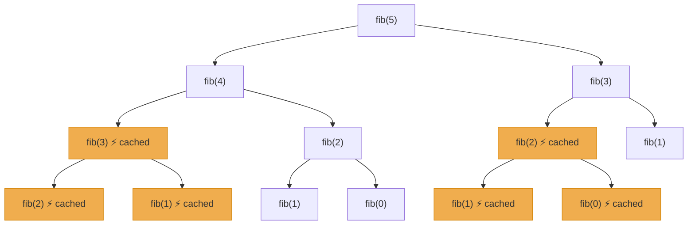

# Dynamic Programming

[toc]

> **TL;DR:** Dynamic Programming is recursion with a memory — you solve a large problem by breaking it into overlapping subproblems, solving each exactly once, and storing the result so you never recompute it. It applies whenever a problem has two structural properties: *overlapping subproblems* (the same sub-question recurs across branches) and *optimal substructure* (an optimal solution to the whole is built from optimal solutions to its parts). The two implementation flavors — top-down memoization and bottom-up tabulation — are equivalent in theory but differ sharply in practice on sparsity, stack depth, and cache friendliness.

## Vocabulary

**Overlapping subproblems** — the same subproblem is encountered multiple times during the recursion tree. Without caching, this causes exponential redundancy. The canonical example: `fib(5)` calls `fib(3)` twice.

**Optimal substructure** — an optimal solution to the problem contains optimal solutions to its subproblems. This is the structural prerequisite for DP (and also greedy). Without it, you cannot compose subproblem answers into the global answer.

**State** — the minimal set of parameters that uniquely identifies a subproblem. In knapsack the state is `(item_index, remaining_capacity)`; in LCS it is `(i, j)` — positions in each string.

**Transition (recurrence)** — the rule that computes `dp[state]` from smaller states. Writing the recurrence is the hardest intellectual step of every DP problem.

**Base case** — the subproblem small enough to answer without recursion. Off-by-one errors almost always live here.

**Memoization (top-down)** — add a cache (dict or array) to a recursive function; check the cache before computing, store the result after. Natural recursion structure is preserved.

**Tabulation (bottom-up)** — fill an array in dependency order (usually smallest subproblem first) with no recursion. Better constants, enables rolling-array space optimization.

**Rolling array (space optimization)** — when the recurrence only reads from the previous row/layer, you can discard all earlier rows and keep only the last one or two, reducing O(n·W) space to O(W).

**DAG of subproblems** — the directed acyclic graph where nodes are subproblems and edges point from a subproblem to those it depends on. Memoization traverses this DAG via DFS; tabulation does a topological sort implicitly.

**Bellman equation** — the generic form `V(s) = max_a [R(s,a) + γ V(s')]` from which all DP recurrences are specializations; the `γ` discount factor is 1 for combinatorial DP.

**0/1 knapsack** — each item is either taken (1) or left (0); no repetition.

**Unbounded knapsack** — each item can be taken any number of times.

**LIS (Longest Increasing Subsequence)** — longest strictly increasing subsequence of an array; O(n²) DP or O(n log n) patience-sorting variant.

**LCS (Longest Common Subsequence)** — longest subsequence common to two strings; backbone of diff and edit-distance algorithms.

**Edit distance (Levenshtein)** — minimum insert/delete/replace operations to transform one string into another.

**MCM (Matrix Chain Multiplication)** — minimize scalar multiplications to compute a chain of matrix products by choosing the optimal parenthesization; interval DP.

**Palindromic subsequence / partitioning** — DP on a string where `dp[i][j]` represents some property of the substring `s[i..j]`.

## Intuition

Think of the recursion tree for `fib(5)`: the naive recursive call sprouts a binary tree of depth 5. Every node labeled `fib(2)` or `fib(3)` appears multiple times — the tree recomputes the same values exponentially. Memoization *collapses* that tree into a DAG: once `fib(3)` is computed, any later reference is a constant-time cache lookup. The DAG has only `n` nodes; the tree had O(2^n).

The intuition for bottom-up is the reverse: think of filling a spreadsheet left-to-right, top-to-bottom. Each cell formula references only cells you have already filled. The recurrence tells you which cells to look at; the traversal order guarantees those cells exist.

The two-condition test from the notes — "choice of including the current element" and "optimization is asked" — is a practical heuristic: if you can frame the problem as a binary include/exclude decision at each item with an optimization goal, the 0/1 knapsack template applies. Recognizing which template a problem maps to is the actual interview skill.

## Math foundations

The six subsections below build the theoretical skeleton that every practical DP technique rests on. Read these once carefully and the recurrences, complexity arguments, and correctness proofs throughout the rest of this note will feel inevitable rather than ad hoc. The goal is to give you a mental model precise enough to derive new DP solutions from first principles, not just pattern-match to templates.

### Bellman's principle of optimality — formally

Richard Bellman stated the principle that makes dynamic programming possible: an optimal solution to a problem must contain optimal solutions to its subproblems. This is not an axiom to accept on faith — it is a structural property you must verify for each problem, and the cut-and-paste argument in the subsection below gives you the standard proof technique. The principle collapses an exponential search over all policies into a polynomial computation because you never need to reconsider a subproblem once it has been solved optimally.

The canonical formal statement, written as a value function over states, is:

```math
f(s) = \min_{a \in A(s)} \bigl[ c(s, a) + f(s') \bigr]
```

where s is the current state, A(s) is the set of available actions, c(s, a) is the immediate cost of taking action a in state s, and s' = T(s, a) is the next state produced by the transition function T. This single equation *is* dynamic programming: it says the optimal cost from state s equals the minimum over all choices of (immediate cost) + (optimal cost from the resulting state). Every DP recurrence you will ever write is a specialization of this equation with a particular state space, action set, cost function, and transition.

> [!IMPORTANT]
> The equation assumes no cycles in the state-transition graph — i.e., the subproblem dependency graph is a DAG. If T can produce a state s' that eventually leads back to s, the recurrence has no well-founded base case and the DP is undefined. Bellman-Ford handles graphs with non-negative cycles via a finite-horizon formulation (k steps), not the infinite-horizon form above.

### Recurrence relations — the heart of DP

Every DP problem is fully specified by three things: a state (the parameters that uniquely identify a subproblem), a transition (the recurrence rule expressing dp[state] in terms of smaller states), and one or more base cases (the smallest subproblems answered directly without recursion). Writing the recurrence is the hardest intellectual step; everything else is mechanical. The three canonical recurrences below cover the majority of DP problem families and are worth having memorized cold.

**Fibonacci** — the simplest possible DP: one-dimensional state, two predecessors, additive combination.

```math
F(n) = \begin{cases}
n & \text{if } n \le 1 \\
F(n-1) + F(n-2) & \text{otherwise}
\end{cases}
```

**Longest Common Subsequence (LCS)** — two-dimensional state (i, j) tracking positions in each string, with a branch on character equality.

```math
L(i, j) = \begin{cases}
0 & \text{if } i = 0 \text{ or } j = 0 \\
L(i-1, j-1) + 1 & \text{if } s[i] = t[j] \\
\max\bigl(L(i-1, j),\; L(i, j-1)\bigr) & \text{otherwise}
\end{cases}
```

**0/1 Knapsack** — two-dimensional state (i, w) tracking item index and remaining capacity, with a branch on whether the current item fits.

```math
K(i, w) = \begin{cases}
0 & \text{if } i = 0 \text{ or } w = 0 \\
K(i-1, w) & \text{if } w_i > w \\
\max\bigl(K(i-1, w),\; K(i-1, w - w_i) + v_i\bigr) & \text{otherwise}
\end{cases}
```

Notice the structural parallel: each recurrence has a base case that returns a constant, a guard condition that decides which branch to take, and a combination rule that assembles smaller answers into the current answer. This three-part pattern is the universal template.

> [!NOTE]
> The guard condition in the knapsack — checking whether item i fits in remaining capacity w — is also where the 0/1 vs. unbounded distinction lives. In unbounded knapsack, the recursive call uses K(i, w - w_i) instead of K(i-1, w - w_i), allowing item i to be reused.

### Counting subproblems = time complexity

DP runtime analysis is almost always a product: (number of distinct states) times (work per state to compute the transition). If you can count the state space and bound the per-state work, you have the complexity — no amortized argument, no recurrence solving required. This is the universal DP complexity calculator.

Three examples that make the pattern concrete:

| Problem | State space | Work per state | Total complexity |
| :--- | :---: | :---: | :---: |
| LCS (strings of length m, n) | O(mn) states | O(1) per cell | O(mn) |
| MCM (n matrices) | O(n²) intervals | O(n) split points | O(n³) |
| Subset Sum (n items, sum S) | O(nS) states | O(1) per cell | O(nS) |
| LIS — O(n²) variant | O(n) endings | O(n) predecessors | O(n²) |
| Bellman-Ford (V vertices, E edges) | O(V) distance vectors | O(E) relaxations | O(VE) |

The formal statement:

```math
T_{\text{total}} = \lvert \mathcal{S} \rvert \times W
```

where S is the set of distinct subproblems and W is the worst-case work to evaluate any single subproblem's transition (assuming all smaller states are already resolved). When W = O(1), complexity equals the state-space size. When the transition itself scans O(k) predecessors (as in MCM or LIS), multiply accordingly.

> [!TIP]
> If your state space is O(n²) and you find yourself writing three nested loops, pause: the innermost loop is probably the O(n) transition, giving O(n³) total — which is fine for MCM but unexpected for LCS. Counting states and transition work before coding saves you from implementing an algorithm that is worse than necessary.

### Memoization vs tabulation — same math, different evaluation order

Both memoization (top-down) and tabulation (bottom-up) solve the exact same mathematical object: the subproblem dependency DAG. Memoization traverses that DAG via depth-first search, caching on the way back up — it is lazy evaluation, visiting only the subproblems that the top-level query actually needs. Tabulation performs a topological sort of the DAG (usually implicit in the loop order) and evaluates every subproblem in an order that guarantees all dependencies are resolved before they are needed — it is eager evaluation. Because each subproblem is visited exactly once by both strategies, the total work is identical up to constants.

The total work for either strategy is the same sum:

```math
T_{\text{total}} = \sum_{p \;\in\; \mathcal{S}} w(p)
```

where p ranges over all subproblems that are actually visited and w(p) is the work to compute subproblem p given its dependencies. For tabulation this sum covers all subproblems (none are skipped). For memoization the sum covers only reachable subproblems — in sparse problems this can be significantly smaller, which is why memoization wins when the DP table has many unreachable cells (e.g., interval DP with tight constraints).

The practical differences flow from the evaluation strategy, not from the math:

| Property | Memoization (top-down) | Tabulation (bottom-up) |
| :--- | :--- | :--- |
| Call-stack overhead | Yes — O(depth) frames | None |
| Sparse table wins | Yes — skips unreachable states | No — fills all states |
| Rolling-array optimization | Not applicable | Straightforward |
| Cache locality | Poor (hash table or scattered recursion) | Excellent (sequential array fills) |
| Code clarity for complex states | Often clearer | Can be harder to express loop order |

> [!NOTE]
> For Python in particular: memoization hits `RecursionError` at depths beyond ~1000 without `sys.setrecursionlimit`. Tabulation avoids this entirely. For competitive programming in C++ where stack depth is larger and function call overhead is smaller, memoization is often equally fast or faster than tabulation.

### Optimal substructure proofs by cut-and-paste

The standard technique for proving that a problem has optimal substructure — and therefore that a DP recurrence is *correct* — is the cut-and-paste argument. The proof structure is always the same: assume for contradiction that the solution chosen by the recurrence contains a non-optimal sub-solution, then show you can swap in the optimal sub-solution to get a strictly better overall solution, contradicting the assumption that the original was optimal. The name "cut-and-paste" comes from literally cutting out the sub-solution and pasting in a better one.

**Worked example: LCS has optimal substructure.**

Let X and Y be two strings of lengths m and n. Let Z = z_1 z_2 ... z_k be a longest common subsequence of X and Y.

*Claim:* if X[m] = Y[n], then Z[k] = X[m] = Y[n] and Z[1..k-1] is an LCS of X[1..m-1] and Y[1..n-1].

*Proof:* Suppose Z[1..k-1] is NOT an LCS of X[1..m-1] and Y[1..n-1]. Then there exists a longer common subsequence W of X[1..m-1] and Y[1..n-1] with length > k-1. Appending X[m] (= Y[n]) to W gives a common subsequence of X and Y with length > k, contradicting the assumption that Z was a longest common subsequence. Therefore Z[1..k-1] must be an LCS of the shorter prefixes. This justifies the recurrence branch `L(i-1, j-1) + 1` when characters match.

*Claim:* if X[m] ≠ Y[n], then Z is an LCS of either X[1..m-1] with Y, or X with Y[1..n-1].

*Proof:* If Z[k] ≠ X[m], then Z is a common subsequence of X[1..m-1] and Y. If Z were not the longest such subsequence, a longer one W would also be a common subsequence of X and Y (since X[m] is not used), contradicting Z's optimality. An identical argument applies if Z[k] ≠ Y[n]. This justifies the recurrence branch `max(L(i-1, j), L(i, j-1))` when characters differ.

Both branches of the LCS recurrence are now proved correct by the cut-and-paste argument. The pattern applies verbatim to knapsack, shortest paths, and matrix chain multiplication — state the optimality of Z, assume a sub-solution is non-optimal, replace it, derive a contradiction.

> [!IMPORTANT]
> The cut-and-paste argument ONLY works when the sub-solutions are independent — replacing one sub-solution does not invalidate the rest of the overall solution. This independence is precisely what fails for the longest simple path problem described in the next subsection.

### Counterexamples — when DP fails

DP is not a universal algorithm — it requires optimal substructure, and not all optimization problems have it. Recognizing when DP *cannot* apply is as important as recognizing when it can. The canonical counterexample is the **longest simple path** problem: given a weighted graph where paths must not repeat any vertex, find the longest (maximum-weight) simple path between two vertices u and v.

Why does DP fail here? Suppose the longest simple path from u to v goes through an intermediate vertex w: u → ... → w → ... → v. For DP to apply, the subpath u → ... → w would need to be the longest simple path from u to w. But the subpath u → ... → w is constrained by what vertex the remaining path w → ... → v uses — specifically, it cannot reuse any vertex that the second subpath visits. The two sub-solutions are **not independent**: the set of vertices used in the first subpath affects which vertices are available for the second. Swapping in a "better" subpath for u → w might reuse a vertex that v → w also needs, making the resulting path non-simple and therefore invalid.

Because the sub-solutions interfere with each other, the cut-and-paste argument breaks down. Without optimal substructure, there is no correct DP recurrence. The longest simple path problem is NP-hard even for unweighted graphs — no polynomial algorithm is known.

```math
\text{Longest simple path: } \nexists \text{ polynomial DP recurrence}
```

The contrast with shortest path (Bellman-Ford, Dijkstra) is instructive. Shortest paths have optimal substructure because subpaths of a shortest path are themselves shortest paths — and the independence holds because a shortest path never needs to revisit a vertex (doing so would only increase cost). Remove the non-repetition constraint (allow cycles) and shortest-path DP works; impose the non-repetition constraint and longest-path DP breaks.

> [!WARNING]
> A common interview mistake is assuming that if shortest path is solvable by DP, then longest path must also be. They are structurally different problems: shortest simple path is polynomial (Dijkstra/Bellman-Ford), longest simple path is NP-hard. The difference is entirely in whether optimal substructure holds — which is why verifying it before writing a recurrence is not optional.


## How it works

The mechanical workflow for every DP problem is identical: identify the state, write the recurrence, handle base cases, pick a traversal order (for tabulation), and optionally compress space. The difficulty lives entirely in steps one and two — the code is mechanical thereafter.

### Identifying DP problems

A problem is a DP candidate when you observe that a brute-force recursion revisits the same arguments. The two structural signals are: (1) you are making a binary choice at each element (include or exclude, stop or continue), and (2) the question asks for a maximum, minimum, count, or boolean feasibility. Greedy works when the locally optimal choice is globally optimal; when that fails, DP is the fallback.

```python
# Mental template for recognizing DP
# 1. Can I define a subproblem that depends only on a prefix/suffix of the input?
# 2. Does the recurrence re-encounter the same (i, ...) pair from different paths?
# 3. Is the answer a count, min, max, or feasibility over all valid completions?
# If yes to all three → DP.
```

### Top-down memoization

Memoization is the simplest mechanical transformation: take the naive recursive solution, add a `@functools.cache` decorator (or a manual dict), and the Python runtime handles the rest. The recursion tree structure is preserved, which makes the code easy to read and debug. The downside is Python call-stack overhead — for n > 1000 you risk `RecursionError` without `sys.setrecursionlimit`.

```python
import functools

@functools.cache
def fib(n: int) -> int:
    """O(n) time, O(n) space with memoization."""
    if n <= 1:
        return n
    return fib(n - 1) + fib(n - 2)
```

> [!TIP]
> `@functools.cache` (Python 3.9+) is an unbounded LRU cache — identical to `@functools.lru_cache(maxsize=None)` but faster. Use it for quick memoization. For unhashable arguments (lists, dicts), you must convert to a tuple before passing, or use a manual dict keyed on a tuple.

### Bottom-up tabulation

Tabulation reverses the direction: instead of recursing down and caching on the way back up, you fill a table from the smallest subproblems upward. The traversal order must respect the dependency graph — fill `dp[i]` only after all `dp[j]` that `dp[i]` depends on are already filled. For 1D problems this is usually left-to-right; for 2D (LCS, knapsack) it is row by row.

```python
def fib_tab(n: int) -> int:
    """O(n) time, O(1) space tabulation with rolling variables."""
    if n <= 1:
        return n
    prev, curr = 0, 1
    for _ in range(2, n + 1):
        prev, curr = curr, prev + curr
    return curr
```

> [!IMPORTANT]
> The index convention in tabulation is almost always shifted by 1 relative to the recursive formulation. If the recursion uses `fib(n)`, the table usually uses `dp[0..n]` where `dp[i]` corresponds to `fib(i)`. Get this mapping wrong and every answer is off by one.

### Space optimization — rolling array

When `dp[i][j]` depends only on `dp[i-1][*]` (the previous row), you can discard all rows before `i-1` and keep only two arrays. For some recurrences (coin change, 1D knapsack) you can compress further to a single array by iterating in the right direction.

The critical rule for the single-array trick: if item `i` should only be counted once (0/1 knapsack), iterate the capacity dimension *right-to-left* so you don't accidentally use the same item twice. If items can repeat (unbounded knapsack), iterate *left-to-right*.

```python
def knapsack_01_space(weights: list[int], values: list[int], cap: int) -> int:
    """0/1 knapsack with O(cap) space via right-to-left sweep."""
    dp: list[int] = [0] * (cap + 1)
    for w, v in zip(weights, values):
        for j in range(cap, w - 1, -1):   # right-to-left is essential
            dp[j] = max(dp[j], dp[j - w] + v)
    return dp[cap]
```

### State-design heuristics

Choose the state to be as small as possible while fully describing the subproblem. A common pattern: the state is the suffix (or prefix) of the input not yet processed, plus any accumulated constraint (remaining capacity, running total, last element chosen). If you need to track two strings simultaneously, the state is naturally a 2D index pair. For interval DP (MCM, palindrome partitioning), the state is `(i, j)` — the endpoints of the interval being solved.

```python
# State-design checklist
# 1. What changes between recursive calls? Those are your state variables.
# 2. Is the state hashable (for memoization)? If not, convert to tuple.
# 3. How many distinct states are there? That's the time complexity lower bound.
# 4. How many states does each transition read? That adds a factor to time complexity.
```

## Math

The generic Bellman recurrence for a maximization DP over a 1D array:

```math
dp[i] = \max_{j < i,\ \text{transition valid}} \bigl( dp[j] + \text{cost}(j, i) \bigr)
```

For the 0/1 knapsack with n items and capacity W:

```math
dp[i][w] = \begin{cases}
0 & \text{if } i = 0 \text{ or } w = 0 \\
dp[i-1][w] & \text{if } \text{wt}[i] > w \\
\max\!\bigl(dp[i-1][w],\; \text{val}[i] + dp[i-1][w - \text{wt}[i]]\bigr) & \text{otherwise}
\end{cases}
```

For LCS of strings X (length m) and Y (length n):

```math
dp[i][j] = \begin{cases}
0 & \text{if } i = 0 \text{ or } j = 0 \\
dp[i-1][j-1] + 1 & \text{if } X[i] = Y[j] \\
\max(dp[i-1][j],\; dp[i][j-1]) & \text{otherwise}
\end{cases}
```

For edit distance (Levenshtein) between strings A and B:

```math
dp[i][j] = \begin{cases}
j & \text{if } i = 0 \\
i & \text{if } j = 0 \\
dp[i-1][j-1] & \text{if } A[i] = B[j] \\
1 + \min(dp[i-1][j],\; dp[i][j-1],\; dp[i-1][j-1]) & \text{otherwise}
\end{cases}
```

For LIS — the O(n log n) patience-sorting recurrence maintains a list `tails` where `tails[k]` is the smallest tail element of all increasing subsequences of length `k+1`:

```math
\text{LIS length} = \text{len}(\texttt{tails}) \quad \text{after processing all elements with binary search insertion}
```

For Matrix Chain Multiplication of matrices A_i through A_j:

```math
dp[i][j] = \min_{i \le k < j} \bigl( dp[i][k] + dp[k+1][j] + \text{arr}[i-1] \cdot \text{arr}[k] \cdot \text{arr}[j] \bigr)
```

Complexity summary:

| Problem | Time | Space | Optimized Space |
| :--- | :---: | :---: | :---: |
| Fibonacci | O(n) | O(n) | O(1) |
| 0/1 Knapsack | O(n·W) | O(n·W) | O(W) |
| Unbounded Knapsack | O(n·W) | O(n·W) | O(W) |
| Coin Change (min) | O(n·amount) | O(amount) | O(amount) |
| LCS | O(m·n) | O(m·n) | O(min(m,n)) |
| Edit Distance | O(m·n) | O(m·n) | O(min(m,n)) |
| LIS O(n²) | O(n²) | O(n) | — |
| LIS O(n log n) | O(n log n) | O(n) | — |
| MCM | O(n³) | O(n²) | — |
| Subset Sum | O(n·S) | O(n·S) | O(S) |

## Real-world example

The `diff` utility that powers `git diff` is LCS: it finds the longest common subsequence of lines between two file versions, then marks additions and deletions around it. Spell-checkers compute edit distance between a misspelled word and every dictionary entry to suggest the closest candidates. Bellman-Ford shortest-path in routing (used in RIP/OSPF) is the same Bellman recurrence applied to a graph.

The example below implements LCS in both top-down and bottom-up forms, then shows the space-optimized single-row version — the same progression you would apply to any 2D DP.

```python
import functools

# ── Top-down (memoization) ───────────────────────────────────────────────────

def lcs_memo(x: str, y: str) -> int:
    """Longest common subsequence length via memoization. O(m*n) time and space."""

    @functools.cache
    def dp(i: int, j: int) -> int:
        if i == 0 or j == 0:
            return 0
        if x[i - 1] == y[j - 1]:
            return 1 + dp(i - 1, j - 1)
        return max(dp(i - 1, j), dp(i, j - 1))

    return dp(len(x), len(y))


# ── Bottom-up (tabulation) ────────────────────────────────────────────────────

def lcs_tab(x: str, y: str) -> int:
    """Longest common subsequence length via tabulation. O(m*n) time and space."""
    m, n = len(x), len(y)
    # dp[i][j] = LCS of x[:i] and y[:j]
    table: list[list[int]] = [[0] * (n + 1) for _ in range(m + 1)]
    for i in range(1, m + 1):
        for j in range(1, n + 1):
            if x[i - 1] == y[j - 1]:
                table[i][j] = 1 + table[i - 1][j - 1]
            else:
                table[i][j] = max(table[i - 1][j], table[i][j - 1])
    return table[m][n]


# ── Space-optimized (two rows) ────────────────────────────────────────────────

def lcs_space_opt(x: str, y: str) -> int:
    """O(min(m,n)) space — only two rows needed at any time."""
    m, n = len(x), len(y)
    # Make y the shorter string to minimize the row width
    if m < n:
        x, y = y, x
        m, n = n, m
    prev: list[int] = [0] * (n + 1)
    curr: list[int] = [0] * (n + 1)
    for i in range(1, m + 1):
        for j in range(1, n + 1):
            if x[i - 1] == y[j - 1]:
                curr[j] = 1 + prev[j - 1]
            else:
                curr[j] = max(prev[j], curr[j - 1])
        prev, curr = curr, [0] * (n + 1)
    return prev[n]


# Quick smoke test
assert lcs_memo("abcde", "ace") == 3
assert lcs_tab("abcde", "ace") == 3
assert lcs_space_opt("abcde", "ace") == 3
```

> [!WARNING]
> The `@functools.cache` decorator stores all intermediate results for the lifetime of the function object. In a long-running process (interview judge, server), a memoized function defined at module level accumulates cache entries indefinitely. Either define it inside the solution function (so it is garbage collected) or call `.cache_clear()` between test cases.

## In practice

The PDF's notes show the tabulation table for knapsack with axes n+1 (items) and W+1 (capacities). The first row and column are initialized to zero (no items or no capacity = zero value). From there, filling is O(n·W) — pseudo-polynomial, not polynomial, because W is the numeric value of the input, not its bit length. For W = 10^9 this is intractable; the knapsack problem is NP-complete in the strong sense.

`functools.cache` is idiomatic Python DP for interviews. For production numeric DP, numpy arrays or flat C arrays are 10-100x faster because Python lists have per-object overhead and poor cache locality. When the DP table is sparse (most states never reached), top-down with a dict wins over a fully allocated table.

For the O(n log n) LIS, the `bisect` module provides the binary search in pure Python. The `tails` array is not the actual LIS — it is only the correct length. Reconstructing the sequence requires a separate `parent` array.

> [!TIP]
> For interval DP (MCM, palindrome partitioning), iterate over *chain length* in the outer loop, not over `i`. This ensures that when you compute `dp[i][j]`, all shorter intervals `dp[i][k]` and `dp[k+1][j]` are already filled.

> [!CAUTION]
> The knapsack space optimization (iterating capacity right-to-left) silently gives wrong answers if you accidentally iterate left-to-right. The 1D array would allow the same item to be picked multiple times, converting a 0/1 knapsack into an unbounded one. The bug produces plausible-looking output and will not be caught by basic test cases unless you specifically include an item with high value that should not be reused.

## Pitfalls

- **Wrong state definition** — defining the state over the full remaining array rather than just the current index wastes exponential space. The state should be the *minimal* parameters needed to determine the answer from this point forward.
- **Off-by-one in tabulation indices** — the tabulation table is usually `dp[0..n]` where `dp[0]` is the empty prefix base case. Forgetting to initialize `dp[0]` correctly (often 0 for max, inf for min, 1 for count) corrupts every downstream cell.
- **Mutating state in memoization** — passing a mutable list as a function argument and then modifying it will give incorrect cache hits. Always convert mutable arguments to tuples before caching.
- **Missing base cases** — for 2D DP, both `dp[0][j]` and `dp[i][0]` must be initialized, not just `dp[0][0]`. Forgetting to initialize an entire row or column causes silent wrong answers.
- **Wrong sweep direction in space optimization** — 0/1 knapsack requires right-to-left; unbounded requires left-to-right. Mixing them corrupts the result without any error.
- **Assuming DP is always polynomial** — knapsack is pseudo-polynomial (O(n·W)); it is NP-complete when W is exponential in the number of bits. DP does not magically make NP-hard problems tractable.
- **Top-down recursion depth** — Python's default limit is 1000 frames. For n = 10^4, memoized recursion will hit `RecursionError`. Use tabulation or `sys.setrecursionlimit` deliberately.
- **Confusing LCS with LIS** — LCS operates on two *different* strings; LIS operates on a single array. Both use 2D (or 1D with O(n log n) trick) DP, but the recurrences and problem statements are completely different.

## Exercises

Each exercise follows the format: problem statement → hint → Python solution (memoization and/or tabulation) → complexity → space-optimized form if applicable.

---

### Exercise 1: Climbing Stairs

You can climb 1 or 2 steps at a time. How many distinct ways to reach step n?

> [!NOTE]
> This is Fibonacci in disguise. `ways(n) = ways(n-1) + ways(n-2)`. The base cases are `ways(1) = 1` and `ways(2) = 2`. Try both memoization and the O(1) space rolling-variable form.

```python
import functools

# Memoization
@functools.cache
def climb_memo(n: int) -> int:
    if n <= 2:
        return n
    return climb_memo(n - 1) + climb_memo(n - 2)

# Tabulation with O(1) space
def climb_tab(n: int) -> int:
    if n <= 2:
        return n
    a, b = 1, 2
    for _ in range(3, n + 1):
        a, b = b, a + b
    return b

assert climb_memo(5) == 8
assert climb_tab(10) == 89
```

**Complexity:** O(n) time, O(1) space (tabulation).

---

### Exercise 2: House Robber I

An array `nums` represents money at each house. Adjacent houses have an alarm — you cannot rob two consecutive houses. Maximize the loot.

> [!NOTE]
> State: `dp[i]` = maximum money robbing among houses `0..i`. Transition: `dp[i] = max(dp[i-1], dp[i-2] + nums[i])`. Rolling variables suffice.

```python
def rob(nums: list[int]) -> int:
    """O(n) time, O(1) space."""
    prev2, prev1 = 0, 0
    for num in nums:
        prev2, prev1 = prev1, max(prev1, prev2 + num)
    return prev1

assert rob([2, 7, 9, 3, 1]) == 12   # rob houses 0, 2, 4
assert rob([1, 2, 3, 1]) == 4
```

**Complexity:** O(n) time, O(1) space.

---

### Exercise 3: House Robber II

Same as House Robber I but houses are arranged in a circle — the first and last are adjacent. Cannot rob both.

> [!NOTE]
> A circle breaks into two linear sub-problems: rob houses `[0..n-2]` and rob houses `[1..n-1]`. Take the max of the two. Reuse the linear robber.

```python
def rob2(nums: list[int]) -> int:
    """Circular house robber — split into two linear problems."""
    if len(nums) == 1:
        return nums[0]

    def linear_rob(arr: list[int]) -> int:
        prev2, prev1 = 0, 0
        for num in arr:
            prev2, prev1 = prev1, max(prev1, prev2 + num)
        return prev1

    return max(linear_rob(nums[:-1]), linear_rob(nums[1:]))

assert rob2([2, 3, 2]) == 3
assert rob2([1, 2, 3, 1]) == 4
```

**Complexity:** O(n) time, O(1) space.

---

### Exercise 4: Coin Change — Minimum Coins

Given coin denominations and a target amount, find the minimum number of coins to make the amount. Return -1 if impossible.

> [!NOTE]
> Unbounded knapsack flavor. `dp[j]` = min coins to make amount `j`. Initialize `dp[0] = 0`, everything else to infinity. For each coin, sweep left-to-right (coins are reusable).

```python
def coin_change_min(coins: list[int], amount: int) -> int:
    """O(n * amount) time, O(amount) space."""
    INF = float("inf")
    dp: list[float] = [INF] * (amount + 1)
    dp[0] = 0
    for coin in coins:
        for j in range(coin, amount + 1):       # left-to-right: unbounded
            if dp[j - coin] + 1 < dp[j]:
                dp[j] = dp[j - coin] + 1
    return int(dp[amount]) if dp[amount] != INF else -1

assert coin_change_min([1, 2, 5], 11) == 3   # 5+5+1
assert coin_change_min([2], 3) == -1
```

**Complexity:** O(n·amount) time, O(amount) space.

---

### Exercise 5: Coin Change — Number of Ways

Count the number of distinct combinations (not permutations) of coins that sum to the amount.

> [!NOTE]
> Unbounded knapsack count variant. Initialize `dp[0] = 1` (one way to make 0: choose nothing). The outer loop is over *coins* and the inner loop is over *amounts* — this order counts combinations, not permutations. Swapping the loops would count ordered sequences.

```python
def coin_change_ways(coins: list[int], amount: int) -> int:
    """O(n * amount) time, O(amount) space. Counts combinations."""
    dp: list[int] = [0] * (amount + 1)
    dp[0] = 1
    for coin in coins:                            # outer = coins
        for j in range(coin, amount + 1):         # inner = amounts
            dp[j] += dp[j - coin]
    return dp[amount]

assert coin_change_ways([1, 2, 3], 4) == 4  # (1+1+1+1),(1+1+2),(2+2),(1+3)
assert coin_change_ways([2], 3) == 0
```

**Complexity:** O(n·amount) time, O(amount) space.

---

### Exercise 6: 0/1 Knapsack

Given n items each with a weight and value, and a knapsack of capacity W, maximize value without exceeding W. Each item used at most once.

> [!NOTE]
> The canonical 0/1 knapsack. For the space-optimized 1D version, iterate capacity right-to-left to prevent reuse of the same item within the same row.

```python
def knapsack_01(weights: list[int], values: list[int], cap: int) -> int:
    """0/1 knapsack. O(n*cap) time, O(cap) space."""
    dp: list[int] = [0] * (cap + 1)
    for w, v in zip(weights, values):
        for j in range(cap, w - 1, -1):          # right-to-left: 0/1 constraint
            dp[j] = max(dp[j], dp[j - w] + v)
    return dp[cap]

# 2D tabulation form (clearer, more debuggable)
def knapsack_01_2d(weights: list[int], values: list[int], cap: int) -> int:
    """0/1 knapsack. O(n*cap) time and space."""
    n = len(weights)
    # dp[i][w] = max value using first i items with capacity w
    dp: list[list[int]] = [[0] * (cap + 1) for _ in range(n + 1)]
    for i in range(1, n + 1):
        for w in range(cap + 1):
            dp[i][w] = dp[i - 1][w]              # don't take item i
            if weights[i - 1] <= w:
                dp[i][w] = max(dp[i][w], values[i - 1] + dp[i - 1][w - weights[i - 1]])
    return dp[n][cap]

wts = [1, 3, 4, 5]
vals = [1, 4, 5, 7]
assert knapsack_01(wts, vals, 7) == 9
assert knapsack_01_2d(wts, vals, 7) == 9
```

**Complexity:** O(n·W) time, O(W) space (1D) or O(n·W) space (2D).

---

### Exercise 7: Longest Increasing Subsequence (LIS)

Find the length of the longest strictly increasing subsequence of an array.

> [!NOTE]
> Two algorithms: O(n²) DP where `dp[i]` = LIS ending at index `i`, and O(n log n) patience sorting where `tails[k]` tracks the smallest tail of any increasing subsequence of length `k+1`. The second only gives the correct *length*, not the sequence itself.

```python
import bisect

# O(n²) DP
def lis_n2(nums: list[int]) -> int:
    if not nums:
        return 0
    n = len(nums)
    dp: list[int] = [1] * n           # every element is a subsequence of length 1
    for i in range(1, n):
        for j in range(i):
            if nums[j] < nums[i]:
                dp[i] = max(dp[i], dp[j] + 1)
    return max(dp)

# O(n log n) patience sorting
def lis_nlogn(nums: list[int]) -> int:
    """tails[k] = smallest tail element of any IS of length k+1."""
    tails: list[int] = []
    for num in nums:
        pos = bisect.bisect_left(tails, num)
        if pos == len(tails):
            tails.append(num)
        else:
            tails[pos] = num           # replace: maintain smallest possible tail
    return len(tails)

seq = [10, 9, 2, 5, 3, 7, 101, 18]
assert lis_n2(seq) == 4    # [2, 3, 7, 101] or [2, 5, 7, 101]
assert lis_nlogn(seq) == 4
```

**Complexity:** O(n²) / O(n) space for the DP version; O(n log n) / O(n) for patience sorting.

---

### Exercise 8: Longest Common Subsequence (LCS)

Find the length of the longest subsequence common to two strings.

> [!NOTE]
> Classic 2D DP. The recurrence is: if the last characters match, `dp[i][j] = 1 + dp[i-1][j-1]`; otherwise take the max of skipping one character from either string. The space-optimized version keeps only two rows.

```python
import functools

# Memoization
def lcs_length(x: str, y: str) -> int:
    @functools.cache
    def dp(i: int, j: int) -> int:
        if i == 0 or j == 0:
            return 0
        if x[i - 1] == y[j - 1]:
            return 1 + dp(i - 1, j - 1)
        return max(dp(i - 1, j), dp(i, j - 1))
    return dp(len(x), len(y))

# Tabulation
def lcs_tab(x: str, y: str) -> int:
    m, n = len(x), len(y)
    prev: list[int] = [0] * (n + 1)
    for i in range(1, m + 1):
        curr: list[int] = [0] * (n + 1)
        for j in range(1, n + 1):
            if x[i - 1] == y[j - 1]:
                curr[j] = 1 + prev[j - 1]
            else:
                curr[j] = max(prev[j], curr[j - 1])
        prev = curr
    return prev[n]

assert lcs_length("abcde", "ace") == 3
assert lcs_tab("AGGTAB", "GXTXAYB") == 4   # GTAB
```

**Complexity:** O(m·n) time, O(min(m,n)) space with rolling rows.

---

### Exercise 9: Edit Distance (Levenshtein)

Find the minimum number of insert, delete, or replace operations to transform string A into string B.

> [!NOTE]
> `dp[i][j]` = edit distance between `A[:i]` and `B[:j]`. If characters match, no operation needed. Otherwise, take 1 + min of insert (skip B[j]), delete (skip A[i]), replace (skip both). The base cases are `dp[i][0] = i` and `dp[0][j] = j` — converting a string of length k into an empty string costs k deletions.

```python
def edit_distance(a: str, b: str) -> int:
    """Levenshtein distance. O(m*n) time, O(min(m,n)) space."""
    m, n = len(a), len(b)
    if m < n:
        a, b = b, a
        m, n = n, m
    # prev[j] = edit_distance(a[:i-1], b[:j])
    prev: list[int] = list(range(n + 1))
    for i in range(1, m + 1):
        curr: list[int] = [i] + [0] * n
        for j in range(1, n + 1):
            if a[i - 1] == b[j - 1]:
                curr[j] = prev[j - 1]
            else:
                curr[j] = 1 + min(prev[j],      # delete from a
                                  curr[j - 1],   # insert into a
                                  prev[j - 1])   # replace
        prev = curr
    return prev[n]

assert edit_distance("horse", "ros") == 3
assert edit_distance("intention", "execution") == 5
```

**Complexity:** O(m·n) time, O(min(m,n)) space.

---

### Exercise 10: Longest Palindromic Subsequence

Find the length of the longest subsequence of a string that is a palindrome.

> [!NOTE]
> Key insight from the notes: `LPS(s) = LCS(s, reverse(s))`. This is because a palindrome reads the same forwards and backwards, so a palindromic subsequence is a common subsequence of s and its reverse. Alternatively, use the direct 2D DP on a single string with `dp[i][j]` = LPS of `s[i..j]`.

```python
def lps(s: str) -> int:
    """Longest Palindromic Subsequence via LCS(s, reverse(s))."""
    return lcs_tab(s, s[::-1])

# Direct interval DP form
def lps_direct(s: str) -> int:
    n = len(s)
    # dp[i][j] = LPS length of s[i..j]
    dp: list[list[int]] = [[0] * n for _ in range(n)]
    for i in range(n):
        dp[i][i] = 1              # single char is palindrome of length 1
    for length in range(2, n + 1):
        for i in range(n - length + 1):
            j = i + length - 1
            if s[i] == s[j]:
                inner = dp[i + 1][j - 1] if length > 2 else 0
                dp[i][j] = 2 + inner
            else:
                dp[i][j] = max(dp[i + 1][j], dp[i][j - 1])
    return dp[0][n - 1]

assert lps("bbbab") == 4   # "bbbb"
assert lps_direct("cbbd") == 2
```

**Complexity:** O(n²) time, O(n²) space. Can be compressed to O(n) space with two rolling arrays.

---

### Exercise 11: Unique Paths (2D Grid DP)

A robot starts at the top-left of an m×n grid and can only move right or down. Count the number of unique paths to the bottom-right corner.

> [!NOTE]
> `dp[i][j]` = number of ways to reach cell (i,j). Every cell in the first row and first column has exactly 1 path. This is a pure additive recurrence: `dp[i][j] = dp[i-1][j] + dp[i][j-1]`.

```python
def unique_paths(m: int, n: int) -> int:
    """O(m*n) time, O(n) space."""
    dp: list[int] = [1] * n
    for _ in range(1, m):
        for j in range(1, n):
            dp[j] += dp[j - 1]   # dp[j] = from above; dp[j-1] = from left
    return dp[n - 1]

assert unique_paths(3, 7) == 28
assert unique_paths(3, 2) == 3
```

**Complexity:** O(m·n) time, O(n) space.

---

### Exercise 12: Minimum Path Sum

Given a grid of non-negative integers, find the path from top-left to bottom-right (moving only right or down) that minimizes the sum.

> [!NOTE]
> In-place modification of the grid is possible and achieves O(1) extra space. First fill the top row and left column (cumulative sums), then fill the rest. This is a min-variant of the unique paths recurrence.

```python
def min_path_sum(grid: list[list[int]]) -> int:
    """O(m*n) time, O(1) space (modifies grid in-place)."""
    m, n = len(grid), len(grid[0])
    for j in range(1, n):
        grid[0][j] += grid[0][j - 1]      # top row: cumulative sum left
    for i in range(1, m):
        grid[i][0] += grid[i - 1][0]      # left col: cumulative sum down
    for i in range(1, m):
        for j in range(1, n):
            grid[i][j] += min(grid[i - 1][j], grid[i][j - 1])
    return grid[m - 1][n - 1]

assert min_path_sum([[1,3,1],[1,5,1],[4,2,1]]) == 7
```

**Complexity:** O(m·n) time, O(1) space.

---

### Exercise 13: Partition Equal Subset Sum

Given an array of positive integers, determine if it can be partitioned into two subsets with equal sum.

> [!NOTE]
> This reduces to subset sum: if the total sum is odd, return False. Otherwise, check if any subset sums to `total // 2`. Use the 0/1 knapsack boolean variant with a 1D bitset. The right-to-left sweep enforces the 0/1 constraint.

```python
def can_partition(nums: list[int]) -> bool:
    """O(n * S) time, O(S) space where S = sum(nums) / 2."""
    total = sum(nums)
    if total % 2 != 0:
        return False
    target = total // 2
    reachable: list[bool] = [False] * (target + 1)
    reachable[0] = True
    for num in nums:
        for j in range(target, num - 1, -1):   # right-to-left: 0/1 constraint
            reachable[j] = reachable[j] or reachable[j - num]
    return reachable[target]

assert can_partition([1, 5, 11, 5]) is True
assert can_partition([1, 2, 3, 5]) is False
```

**Complexity:** O(n·S) time, O(S) space.

---

### Exercise 14: Word Break

Given a string s and a dictionary of words, return True if s can be segmented into one or more dictionary words.

> [!NOTE]
> `dp[i]` = True if `s[:i]` can be segmented. For each position i, check all suffixes `s[j:i]` where `dp[j]` is already True. This is a 1D DP with O(n²) transitions plus O(L) per transition for the substring lookup (amortized with a hash set).

```python
def word_break(s: str, word_dict: list[str]) -> bool:
    """O(n^2 * L) time in worst case, O(n) space."""
    words = set(word_dict)
    n = len(s)
    dp: list[bool] = [False] * (n + 1)
    dp[0] = True                              # empty string is always segmentable
    for i in range(1, n + 1):
        for j in range(i):
            if dp[j] and s[j:i] in words:
                dp[i] = True
                break                          # early exit: no need to check more
    return dp[n]

assert word_break("leetcode", ["leet", "code"]) is True
assert word_break("applepenapple", ["apple", "pen"]) is True
assert word_break("catsandog", ["cats", "dog", "sand", "and", "cat"]) is False
```

**Complexity:** O(n²) time (with early exit), O(n) space.

---

### Exercise 15: Decode Ways

A string of digits can be decoded using A=1, ..., Z=26. Count the number of ways to decode the entire string.

> [!NOTE]
> `dp[i]` = number of ways to decode `s[:i]`. A single non-zero digit at position i-1 contributes `dp[i-1]` ways. A two-digit number `s[i-2:i]` in range 10-26 contributes `dp[i-2]` ways. Zeros require care: '0' alone is invalid; only '10' and '20' are valid two-digit codes ending in zero.

```python
def num_decodings(s: str) -> int:
    """O(n) time, O(1) space."""
    if not s or s[0] == "0":
        return 0
    n = len(s)
    prev2, prev1 = 1, 1          # dp[0] = 1 (empty), dp[1] = 1 (first char valid)
    for i in range(2, n + 1):
        curr = 0
        one_digit = int(s[i - 1])
        two_digit = int(s[i - 2 : i])
        if one_digit >= 1:
            curr += prev1
        if 10 <= two_digit <= 26:
            curr += prev2
        prev2, prev1 = prev1, curr
    return prev1

assert num_decodings("12") == 2    # "AB" or "L"
assert num_decodings("226") == 3   # "BZ" "VF" "BBF"
assert num_decodings("06") == 0
```

**Complexity:** O(n) time, O(1) space.

---

### Exercise 16: Best Time to Buy and Sell Stock Variants

Four variants with increasing constraint complexity. Each is a distinct DP formulation.

**Variant I — single transaction (greedy O(n)):** Track the minimum price seen so far; the answer is the max of (current price - min price so far).

**Variant II — unlimited transactions (greedy O(n)):** Sum every positive day-over-day difference (buy every valley, sell every peak).

**Variant III — at most k=2 transactions:** 4-state DP tracking (hold after 1st buy, cash after 1st sell, hold after 2nd buy, cash after 2nd sell).

**Variant IV — cooldown after sell (state machine DP):** Three states: held, sold (cooldown), rest.

```python
# Variant I: one transaction
def max_profit_1(prices: list[int]) -> int:
    min_price = float("inf")
    best = 0
    for p in prices:
        min_price = min(min_price, p)
        best = max(best, p - min_price)
    return best

# Variant II: unlimited transactions
def max_profit_2(prices: list[int]) -> int:
    return sum(max(0, prices[i] - prices[i - 1]) for i in range(1, len(prices)))

# Variant III: at most 2 transactions (4-state DP)
def max_profit_3(prices: list[int]) -> int:
    buy1 = buy2 = float("-inf")
    sell1 = sell2 = 0
    for p in prices:
        buy1  = max(buy1,  -p)
        sell1 = max(sell1,  buy1 + p)
        buy2  = max(buy2,   sell1 - p)
        sell2 = max(sell2,  buy2 + p)
    return int(sell2)

# Variant IV: cooldown (1 day rest after sell)
def max_profit_cooldown(prices: list[int]) -> int:
    held = float("-inf")   # currently holding a stock
    sold = 0               # just sold (cooldown next day)
    rest = 0               # resting / ready to buy
    for p in prices:
        held, sold, rest = (max(held, rest - p),
                            held + p,
                            max(rest, sold))
    return max(sold, rest)

assert max_profit_1([7, 1, 5, 3, 6, 4]) == 5
assert max_profit_2([7, 1, 5, 3, 6, 4]) == 7
assert max_profit_3([3, 3, 5, 0, 0, 3, 1, 4]) == 6
assert max_profit_cooldown([1, 2, 3, 0, 2]) == 3
```

**Complexity:** all O(n) time, O(1) space (the 4-state and 3-state DPs use a fixed number of scalar variables).

---

### Exercise 17: Matrix Chain Multiplication

Given a chain of matrices with dimension array `arr` where matrix i has dimensions `arr[i-1] x arr[i]`, find the minimum number of scalar multiplications to compute their product.

> [!NOTE]
> Interval DP. State `dp[i][j]` = minimum cost to multiply matrices i through j. The split point k determines which two sub-chains are multiplied together. Iterate over chain lengths 2, 3, ..., n-1 (outer loop), then over starting index i (inner loop). The memoized version is an alternative that avoids manually tracking the interval-length traversal order.

```python
import functools
import math

def mcm(arr: list[int]) -> int:
    """Minimum cost of matrix chain multiplication. O(n^3) time, O(n^2) space."""
    n = len(arr) - 1  # number of matrices
    
    @functools.cache
    def dp(i: int, j: int) -> int:
        """Min cost to multiply matrices i..j (1-indexed)."""
        if i == j:
            return 0
        best = math.inf
        for k in range(i, j):
            cost = dp(i, k) + dp(k + 1, j) + arr[i - 1] * arr[k] * arr[j]
            if cost < best:
                best = cost
        return int(best)

    return dp(1, n)

# Tabulation form
def mcm_tab(arr: list[int]) -> int:
    n = len(arr) - 1
    dp: list[list[int]] = [[0] * (n + 1) for _ in range(n + 1)]
    for length in range(2, n + 1):         # chain length
        for i in range(1, n - length + 2):
            j = i + length - 1
            dp[i][j] = math.inf
            for k in range(i, j):
                cost = dp[i][k] + dp[k + 1][j] + arr[i - 1] * arr[k] * arr[j]
                dp[i][j] = min(dp[i][j], cost)
    return dp[1][n]

dims = [40, 20, 30, 10, 30]  # 4 matrices: 40x20, 20x30, 30x10, 10x30
assert mcm(dims) == 26000
assert mcm_tab(dims) == 26000
```

**Complexity:** O(n³) time, O(n²) space.

---

### Exercise 18: Subset Sum — Count of Subsets with Given Difference

Given an array and a difference D, count the number of ways to partition the array into two subsets S1 and S2 such that S1 - S2 = D. Reduces to counting subsets summing to `(total + D) / 2`.

> [!NOTE]
> From the notes: S1 + S2 = total and S1 - S2 = D, so S1 = (total + D) / 2. If (total + D) is odd, the answer is 0. Otherwise, count subsets summing to target = (total + D) // 2 using the 0/1 knapsack count variant (right-to-left sweep).

```python
def count_subsets_with_diff(arr: list[int], diff: int) -> int:
    """O(n * S) time, O(S) space."""
    total = sum(arr)
    if (total + diff) % 2 != 0:
        return 0
    target = (total + diff) // 2
    if target < 0:
        return 0
    dp: list[int] = [0] * (target + 1)
    dp[0] = 1
    for num in arr:
        for j in range(target, num - 1, -1):    # right-to-left: 0/1
            dp[j] += dp[j - num]
    return dp[target]

assert count_subsets_with_diff([1, 1, 2, 3], 1) == 3
```

**Complexity:** O(n·S) time, O(S) space.

---

## Recursion tree → DAG visualization

**Figure:** fib(5) naive recursion tree (left) collapses to a DAG under memoization (right). Repeated subproblems are grayed out — they become single cached nodes.



**Figure:** LCS tabulation table for X = "abcde", Y = "ace". Reading `dp[i][j]` = LCS of `X[:i]` and `Y[:j]`. The diagonal arrow (match) and horizontal/vertical arrows (skip) encode the recurrence.

```
     ""  a   c   e
""  [ 0   0   0   0 ]
a   [ 0   1   1   1 ]
b   [ 0   1   1   1 ]
c   [ 0   1   2   2 ]
d   [ 0   1   2   2 ]
e   [ 0   1   2   3 ]  ← answer: dp[5][3] = 3
```

**Figure:** 0/1 knapsack table for weights=[1,3,4,5], values=[1,4,5,7], cap=7.

```
       w=0  w=1  w=2  w=3  w=4  w=5  w=6  w=7
i=0  [  0    0    0    0    0    0    0    0  ]
i=1  [  0    1    1    1    1    1    1    1  ]  item wt=1,val=1
i=2  [  0    1    1    4    5    5    5    5  ]  item wt=3,val=4
i=3  [  0    1    1    4    5    5    6    6  ]  item wt=4,val=5
i=4  [  0    1    1    4    5    7    8    9  ]  item wt=5,val=7  ← 9
```

## Sources

- Cormen, T. H. et al. *Introduction to Algorithms* (CLRS), 4th ed. — Chapter 14 (Dynamic Programming), Chapter 15 (Greedy Algorithms).
- Bellman, R. (1957). *Dynamic Programming*. Princeton University Press. (Origin of the term and the optimality principle.)
- Fredericksen, D. *Patience Sorting and the Longest Increasing Subsequence* — https://en.wikipedia.org/wiki/Patience_sorting
- Python `functools` documentation — https://docs.python.org/3/library/functools.html#functools.cache
- `bisect` module for O(log n) binary search in LIS — https://docs.python.org/3/library/bisect.html
- Levenshtein, V. I. (1966). *Binary codes capable of correcting deletions, insertions, and reversals.* Soviet Physics Doklady, 10(8), 707–710.
- Source PDF: handwritten lecture notes, *Dynamic Programming*, DSA course. Pages cover: 0/1 knapsack, unbounded knapsack, subset sum, coin change, LCS, LIS, MCM, palindromic subsequence, matrix DP, shortest/longest common supersequence, DP on trees/grids.

## Related

- [[01-intro-and-recursion]]
- [[04-hashing]]
- [[11-greedy-and-backtracking]]
- [[13-graphs]]
- [Arrays and Searching](./02-arrays-and-searching.md)
