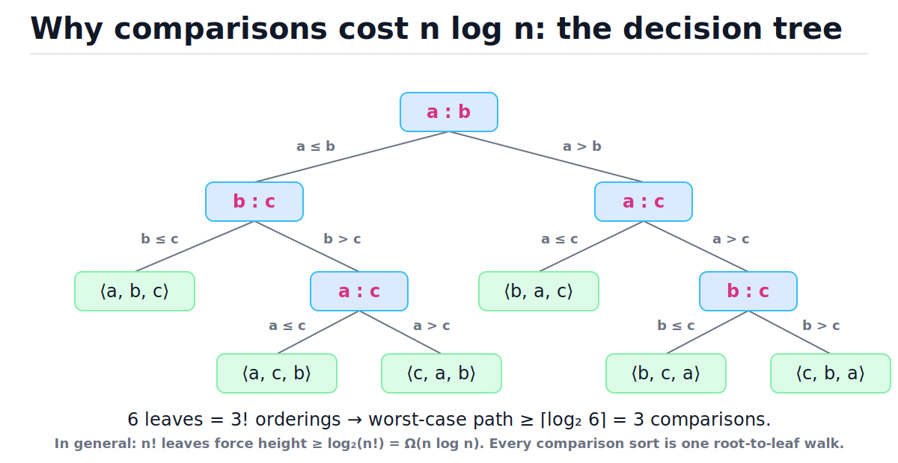
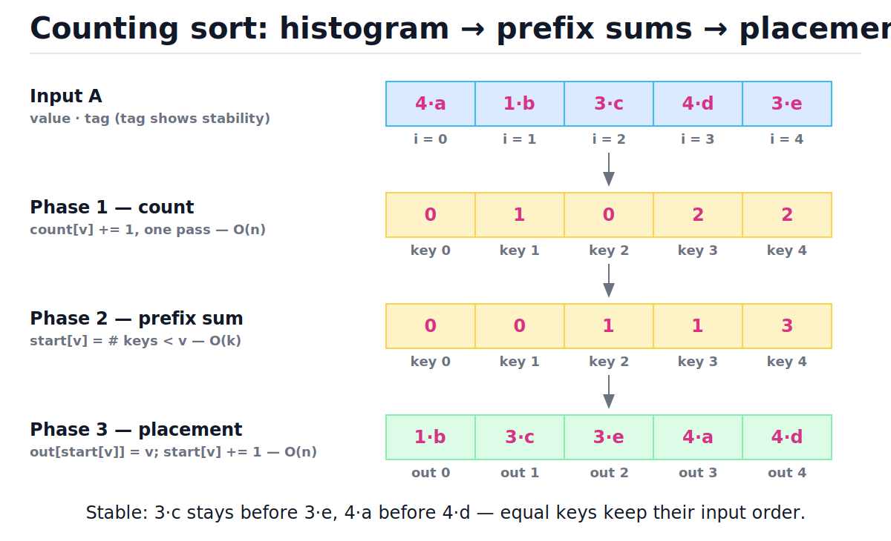
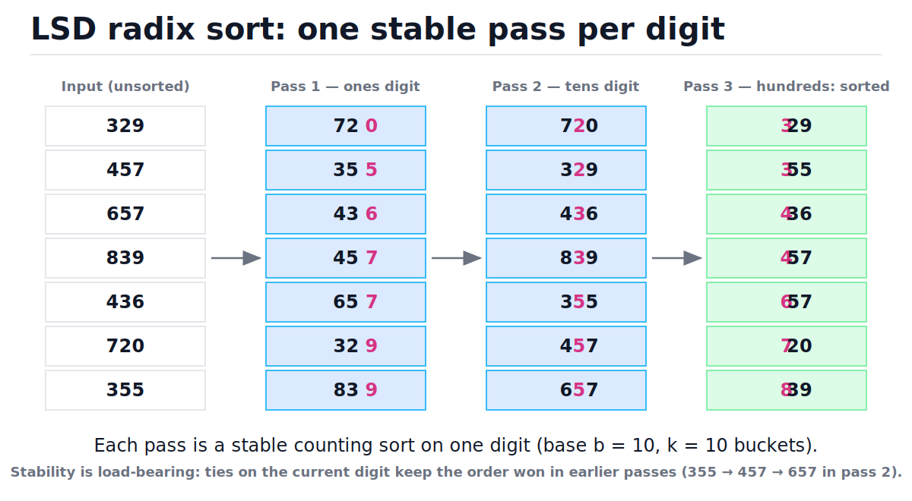

# Linear-Time Sorting

[toc]

> **TL;DR:** Any sort that learns order only through pairwise comparisons needs Ω(n log n) comparisons — that is an information-theoretic floor, not an engineering failure. Counting sort, radix sort, and bucket sort escape the bound by exploiting *structure in the keys* (bounded integers, fixed-width digits, uniform distribution) instead of comparing. When their assumptions hold they sort in O(n + k), O(d·(n + b)), and expected O(n); when the assumptions break, they lose badly.

## Vocabulary

Each term below carries weight in this note. The symbol fence shows the canonical notation; the paragraph gives the plain-prose meaning.

**Comparison sort**

```math
\text{the only allowed query: } a_i \le a_j \ ?
```

A sorting algorithm whose every decision is the outcome of comparing two elements. Merge sort, quicksort, heapsort, and Timsort are all comparison sorts, so all are bound by the decision-tree lower bound.

**Decision tree**

```math
\#\text{leaves} \ge n! \quad\Rightarrow\quad \text{height} \ge \log_2(n!)
```

A binary tree modeling every possible execution of a comparison sort on n elements: internal nodes are comparisons, leaves are output permutations. The worst-case comparison count equals the tree height.

**Key range**

```math
\text{keys} \in \{0, 1, \dots, k-1\}
```

The size k of the universe the keys are drawn from. Counting sort's cost and memory are linear in k, so k is the parameter that makes or breaks it.

**Counting sort**

```math
T(n) = O(n + k), \qquad S(n) = O(n + k)
```

A stable, non-comparing sort for integer keys in a known range: histogram the keys, prefix-sum the histogram into starting offsets, then place each element directly into its final slot.

**Prefix sum (exclusive)**

```math
\text{start}[v] = \sum_{u < v} \text{count}[u]
```

The running total of counts for all keys strictly smaller than v. It answers "where does key v's block begin in the output?" in O(1). The same primitive powers [Sliding Window and Prefix Sums](./18-sliding-window-and-prefix-sums.md).

**Stability**

```math
i < j \ \wedge\ \text{key}(a_i) = \text{key}(a_j) \ \Rightarrow\ a_i \text{ precedes } a_j \text{ in output}
```

Equal keys keep their input order. Stability is what lets radix sort chain digit-by-digit passes without destroying earlier work.

**Radix sort (LSD)**

```math
T(n) = O\bigl(d \cdot (n + b)\bigr), \qquad d = \lceil \log_b(\text{max key} + 1) \rceil
```

Sort fixed-width keys one digit at a time, least-significant digit first, using a stable inner sort (counting sort) for each of the d passes over base-b digits.

**Bucket sort**

```math
\mathbb{E}[T(n)] = O(n) \quad \text{for keys i.i.d. uniform on } [0, 1)
```

Scatter n keys into n buckets by value, sort each (tiny) bucket, concatenate. Linear in expectation only because uniformity keeps expected bucket sizes O(1).

## Intuition

A comparison sort is a guessing game: the answer is one of n! orderings, and every comparison is a yes/no question that at best halves the candidate set. You cannot identify one item among n! with fewer than log₂(n!) binary questions, and log₂(n!) grows like n log n. The figure below shows the full game tree for n = 3 — six possible answers force at least three questions on some path.



Linear-time sorts refuse to play that game. They never ask "is a smaller than b?" — they look at the key's *value* and compute its destination address directly. A key of 37 in a range of 0–99 doesn't need comparing; it needs an address. That works only when keys have exploitable structure: a small integer range (counting sort), fixed-width digits (radix sort), or a known smooth distribution (bucket sort).

> [!NOTE]
> The Ω(n log n) bound counts *comparisons*, not time, and only constrains algorithms whose information about order comes exclusively from comparisons. Counting sort doesn't violate the theorem — it plays a different game with stronger assumptions about the input.

## How it works

Three algorithms, one shared idea: convert key values into array indices. Counting sort is the primitive; radix sort is counting sort applied d times; bucket sort is the continuous-key analogue.

### The decision-tree lower bound

Model any comparison sort on n distinct elements as a binary tree. Each internal node is one comparison; the two children are the two outcomes; each leaf must commit to one output permutation. Correctness demands a distinct reachable leaf for each of the n! input orderings, and a binary tree of height h has at most 2^h leaves. So:

```math
2^h \ge n! \quad\Longrightarrow\quad h \ge \log_2(n!)
```

To see that log₂(n!) is Ω(n log n) without full Stirling machinery, keep only the largest half of the factors:

```math
\log_2(n!) = \sum_{i=1}^{n} \log_2 i \;\ge\; \sum_{i=n/2}^{n} \log_2 \tfrac{n}{2} \;\ge\; \tfrac{n}{2}\,\log_2 \tfrac{n}{2} \;=\; \Omega(n \log n)
```

Stirling's approximation sharpens the constant — the bound is essentially n log₂ n minus a linear term:

```math
\log_2(n!) = n \log_2 n - n \log_2 e + O(\log n) \approx n \log_2 n - 1.44\,n
```

This is why merge sort at O(n log n) worst case is *optimal* among comparison sorts (see [Comparison Sorting Algorithms](./11-comparison-sorting-algorithms.md)) — no cleverness can shave the log factor while staying in the comparison model.

### Counting sort: count, prefix-sum, place

Counting sort handles n elements whose keys are integers in [0, k). Three phases, each a single linear pass. Phase 1 builds a histogram: `count[v]` = how many elements have key v. Phase 2 converts the histogram into exclusive prefix sums: `start[v]` = how many elements have keys *smaller* than v, which is exactly the index where key v's block begins in the output. Phase 3 walks the input left to right and drops each element at `out[start[key]]`, then bumps that key's cursor — left-to-right scanning plus per-key cursors is what makes the placement stable.



```python
def counting_sort(a: list[int], k: int) -> list[int]:
    """Stable sort for integer keys in [0, k). O(n + k) time, O(n + k) space."""
    count = [0] * k
    for v in a:                    # Phase 1: histogram          O(n)
        count[v] += 1
    start = [0] * k                # Phase 2: exclusive prefix    O(k)
    total = 0
    for v in range(k):
        start[v] = total
        total += count[v]
    out = [0] * len(a)             # Phase 3: stable placement    O(n)
    for v in a:
        out[start[v]] = v
        start[v] += 1
    return out


assert counting_sort([4, 1, 3, 4, 3], 5) == [1, 3, 3, 4, 4]
assert counting_sort([], 1) == []
assert counting_sort([2, 2, 2], 3) == [2, 2, 2]
assert counting_sort([0, 9, 0, 9], 10) == [0, 0, 9, 9]
```

Here is Phase 3 traced on the tagged input `[4·a, 1·b, 3·c, 4·d, 3·e]` with `start = [0, 0, 1, 1, 3]`. Watch the equal keys: 3·c is placed before 3·e and 4·a before 4·d, purely because the scan goes left to right and each placement advances that key's cursor.

| Step | Element | start before | Decision | start after |
| :---: | :---: | :--- | :--- | :--- |
| 1 | 4·a | [0, 0, 1, 1, **3**] | out[3] = 4·a | [0, 0, 1, 1, 4] |
| 2 | 1·b | [0, **0**, 1, 1, 4] | out[0] = 1·b | [0, 1, 1, 1, 4] |
| 3 | 3·c | [0, 1, 1, **1**, 4] | out[1] = 3·c | [0, 1, 1, 2, 4] |
| 4 | 4·d | [0, 1, 1, 2, **4**] | out[4] = 4·d | [0, 1, 1, 2, 5] |
| 5 | 3·e | [0, 1, 1, **2**, 5] | out[2] = 3·e | [0, 1, 1, 3, 5] |

Final output: `[1·b, 3·c, 3·e, 4·a, 4·d]` — sorted, equal keys in input order. To sort records *by* an integer key (rather than bare integers), parameterize the key extraction; this generic version is what radix sort will reuse:

```python
from typing import Callable, TypeVar

T = TypeVar("T")


def counting_sort_by(items: list[T], key: Callable[[T], int], k: int) -> list[T]:
    """Stable counting sort of arbitrary records by an integer key in [0, k)."""
    count = [0] * k
    for it in items:
        count[key(it)] += 1
    start = [0] * k
    total = 0
    for d in range(k):
        start[d] = total
        total += count[d]
    out = list(items)              # right length; every slot is overwritten
    for it in items:
        d = key(it)
        out[start[d]] = it
        start[d] += 1
    return out


pairs = [(4, "a"), (1, "b"), (3, "c"), (4, "d"), (3, "e")]
got = counting_sort_by(pairs, key=lambda p: p[0], k=5)
assert got == [(1, "b"), (3, "c"), (3, "e"), (4, "a"), (4, "d")]  # stable
```

> [!WARNING]
> Counting sort's cost is O(n + k) in both time and space, where k is the *key range*, not the input size. Sorting ten integers whose values reach 10⁹ would allocate a billion-slot count array. If k ≫ n, counting sort is the wrong tool — that gap is exactly what radix sort closes.

### Radix sort (LSD): d stable passes

LSD (least-significant-digit) radix sort sorts fixed-width integer keys by running one stable counting sort per digit position, starting from the least significant. After pass i, the array is sorted by its last i digits. The magic is the invariant: when pass i+1 sorts by digit i+1 and two elements *tie* on that digit, the stable inner sort keeps them in their pass-i order — so the tie is broken by the lower digits, exactly as lexicographic order demands. Trace the seven 3-digit numbers below through three passes.



| Pass | Digit sorted | Array after pass |
| :---: | :---: | :--- |
| — | (input) | 329, 457, 657, 839, 436, 720, 355 |
| 1 | ones | 720, 355, 436, 457, 657, 329, 839 |
| 2 | tens | 720, 329, 436, 839, 355, 457, 657 |
| 3 | hundreds | 329, 355, 436, 457, 657, 720, 839 |

In pass 2, the keys 355, 457, 657 all have tens digit 5. They land in the order 355 → 457 → 657 only because pass 1 already put them in that order and the stable pass 2 refused to swap ties. Replace the inner sort with an unstable one and pass 3 would happily output 457 before 436's neighbors in the wrong relative order — the whole construction collapses.

> [!IMPORTANT]
> Stability of the inner sort is load-bearing, not a nicety. The invariant "after pass i, sorted by the last i digits" survives each new pass *only* because ties on the current digit preserve the previous pass's order. An unstable inner sort makes radix sort silently wrong, and on many inputs it will still look almost sorted — the worst kind of bug.

```python
def radix_sort(a: list[int], base: int = 10) -> list[int]:
    """LSD radix sort for non-negative ints. O(d * (n + base)) time."""
    if not a:
        return []
    out = list(a)
    exp = 1
    max_val = max(out)
    while max_val // exp > 0:
        out = counting_sort_by(out, key=lambda v: (v // exp) % base, k=base)
        exp *= base
    return out


nums = [329, 457, 657, 839, 436, 720, 355]
assert radix_sort(nums) == sorted(nums)
assert radix_sort([3, 30, 300, 3000]) == [3, 30, 300, 3000]
assert radix_sort([0]) == [0]
assert radix_sort([7, 7, 7]) == [7, 7, 7]
```

The base b is a tuning knob. Production radix sorts on 32-bit integers use b = 256 (one byte per digit): d = 4 passes, each with a 256-entry count array that lives entirely in L1 cache. Larger bases mean fewer passes but bigger count arrays; the sweet spot is where the count array still fits in cache.

> [!TIP]
> Choosing base b = n makes the per-pass cost O(n + n) = O(n) and the pass count d = ⌈log_n U⌉ for max key U. For keys bounded by a polynomial in n (U = n^c), that is c passes — total O(c·n), genuinely linear. This is the standard answer to "sort n integers in [0, n²) in O(n)."

### Bucket sort: linear in expectation, under uniformity

Bucket sort targets keys that are *real numbers* drawn (approximately) uniformly from a known interval, say [0, 1). Make n buckets, throw key x into bucket ⌊x·n⌋ — an O(1) address computation, again no comparisons — then sort each bucket with anything and concatenate. Under the uniformity assumption each bucket holds O(1) elements in expectation, and a careful analysis shows the *total* expected inner-sort work is O(n) even accounting for variance.

```python
def bucket_sort(a: list[float]) -> list[float]:
    """Expected O(n) for inputs roughly uniform on [0, 1)."""
    n = len(a)
    if n == 0:
        return []
    buckets: list[list[float]] = [[] for _ in range(n)]
    for x in a:
        buckets[int(x * n)].append(x)   # destination is computed, not compared
    out: list[float] = []
    for b in buckets:
        b.sort()                        # expected O(1) elements per bucket
        out.extend(b)
    return out


data = [0.78, 0.17, 0.39, 0.26, 0.72, 0.94, 0.21, 0.12, 0.23, 0.68]
assert bucket_sort(data) == sorted(data)
assert bucket_sort([]) == []
assert bucket_sort([0.5]) == [0.5]
```

The "expected" qualifier is doing heavy lifting. If the input is skewed — say 90% of keys cluster in [0, 0.1) — most elements pile into a few buckets and the inner sort dominates: O(n log n) with Timsort inside the buckets, O(n²) with insertion sort. Bucket sort is a bet on the distribution; counting and radix sort are guarantees given bounded keys.

> [!CAUTION]
> Real production data is almost never uniform — timestamps cluster at business hours, prices cluster at psychological points, IDs cluster by shard. Deploying bucket sort on skewed data quietly degrades from O(n) to the inner sort's complexity. If you cannot defend the uniformity assumption, do not bet on it.

## Complexity

One table for everything in this note, with the best comparison sort as the baseline. For counting and radix sort, best, average, and worst case coincide — the passes are data-independent; the input order never changes how much work is done. For the asymptotics toolkit behind these claims, see [Big-O Notation and Complexity Analysis](./01-big-o-notation-and-complexity-analysis.md).

| Algorithm | Best | Average | Worst | Space | Stable? |
| :--- | :---: | :---: | :---: | :---: | :---: |
| Counting sort (keys in [0, k)) | O(n + k) | O(n + k) | O(n + k) | O(n + k) | Yes |
| Radix sort (LSD, d digits, base b) | O(d·(n + b)) | O(d·(n + b)) | O(d·(n + b)) | O(n + b) | Yes |
| Bucket sort (uniform keys) | O(n) | O(n) expected | O(n log n)[^bucket] | O(n) | Yes[^stable] |
| Comparison baseline (merge sort / Timsort) | O(n)[^tim] | O(n log n) | O(n log n) | O(n) | Yes |

[^bucket]: With Timsort inside the buckets. With the textbook insertion-sort inner loop, the worst case is O(n²) — all keys in one bucket.
[^tim]: Timsort's O(n) best case is for already-sorted (or few-runs) input; merge sort proper is Θ(n log n) in all cases.
[^stable]: Stable if elements are appended to buckets in scan order and the inner sort is stable — both true in the code above.

The key derivation is the radix bound. Each pass is one counting sort over n elements with b possible digit values, so it costs O(n + b); there are d = ⌈log_b(U + 1)⌉ passes for keys bounded by U:

```math
T(n) = d \cdot O(n + b) = O\!\left( \lceil \log_b (U+1) \rceil \cdot (n + b) \right)
```

Setting b = n (each pass still linear) and assuming keys polynomial in n, U = n^c:

```math
T(n) = O\!\left( \frac{\log U}{\log n} \cdot (n + n) \right) = O\!\left( \frac{c \log n}{\log n} \cdot n \right) = O(c\,n)
```

Why does this not contradict the lower bound? Because the decision-tree argument counts only comparisons, and radix sort performs *zero* comparisons between elements — every placement is an address computation from the key's bits. The lower bound is real, but it fences in a model that these algorithms simply step outside of. The flip side: the moment your keys are arbitrary comparables (custom objects, unbounded strings, opaque comparison callbacks), you are back inside the fence and n log n is the floor.

## Memory model in Python

The textbook analysis assumes C-like arrays: `count` is k contiguous machine words, increments are single instructions, and a 256-entry byte-histogram lives in one or two cache lines. CPython is a different machine. A `list[int]` is an array of 8-byte *pointers* to heap-allocated `PyLong` objects (28 bytes each for small values), so `count[v] += 1` is: pointer dereference → integer unbox → add → box result → pointer store, plus reference counting — roughly 50–100 ns of interpreter work per increment versus ~1 ns in C. Details in [Memory Model and PyObject Layout](../Programming-Languages/Python/13-memory-model-and-pyobject-layout.md).

Two practical consequences:

- **The cache story partially survives.** CPython interns ints −5 to 256, so a histogram whose counts stay small mostly stores pointers into one shared block of preallocated objects. But each `+= 1` past 256 allocates a fresh `PyLong`, and the pointer indirection defeats the spatial locality that makes C counting sort scream.
- **The constant factors invert the verdict.** `sorted()` is Timsort implemented in C — its O(n log n) comparisons each cost a few nanoseconds for native ints. A pure-Python O(n + k) counting sort pays interpreter overhead per element. For n up to the hundreds of thousands, `sorted()` usually wins the wall clock despite losing the asymptotics. See [Performance and the Standard Library](../Programming-Languages/Python/10-performance-and-the-standard-library.md).

> [!TIP]
> When the linear-time asymptotics actually matter in Python, push the loops into native code: NumPy's `np.sort(a, kind='stable')` dispatches to a radix sort for small integer dtypes, and `np.bincount` is a C-speed histogram (Phase 1 of counting sort in one call). Pure-Python counting sort is for interviews and understanding; production Python delegates to C.

```python
def counting_sort_via_bincount_shape(a: list[int], k: int) -> list[int]:
    """Counting sort for bare keys: histogram, then re-emit. O(n + k)."""
    count = [0] * k
    for v in a:
        count[v] += 1
    out: list[int] = []
    for v in range(k):
        out.extend([v] * count[v])   # bare keys only: re-emitting loses nothing
    return out


assert counting_sort_via_bincount_shape([4, 1, 3, 4, 3], 5) == [1, 3, 3, 4, 4]
```

This "histogram and re-emit" variant skips the prefix-sum and placement phases entirely. It is legal only when elements *are* their keys (no payload to carry), which is exactly the shape `np.bincount` + `np.repeat` exploits.

## Real-world example

Scenario: a log pipeline ingests millions of access-log records and must group them by HTTP status code for per-status analytics, *preserving chronological order within each status* so downstream consumers can diff adjacent events. Status codes live in [100, 600) — a key range of 500 — so a stable counting sort by status is a single O(n + 500) pass, and stability gives the within-group time ordering for free. A comparison sort would pay O(n log n) and need a composite (status, timestamp) key to guarantee the same result.

```python
from typing import Callable, TypeVar

T = TypeVar("T")


def counting_sort_by(items: list[T], key: Callable[[T], int], k: int) -> list[T]:
    count = [0] * k
    for it in items:
        count[key(it)] += 1
    start = [0] * k
    total = 0
    for d in range(k):
        start[d] = total
        total += count[d]
    out = list(items)
    for it in items:
        d = key(it)
        out[start[d]] = it
        start[d] += 1
    return out


# (timestamp, status) pairs, already in arrival (chronological) order
logs = [
    (1001, 200), (1002, 500), (1003, 200), (1004, 404),
    (1005, 500), (1006, 200), (1007, 404), (1008, 301),
]

grouped = counting_sort_by(logs, key=lambda r: r[1] - 100, k=500)

assert grouped == [
    (1001, 200), (1003, 200), (1006, 200),   # 200s, chronological
    (1008, 301),                              # single 301
    (1004, 404), (1007, 404),                 # 404s, chronological
    (1002, 500), (1005, 500),                 # 500s, chronological
]

# Within every status group, timestamps are still ascending — stability did that.
for status in (200, 301, 404, 500):
    ts = [t for (t, s) in grouped if s == status]
    assert ts == sorted(ts)
```

Note the `r[1] - 100` key: counting sort needs keys in [0, k), so we shift the [100, 600) range down by 100 rather than allocate 600 slots and waste the first 100. The same offset trick handles negative integers: shift by `-min(a)` first, sort, done.

## When to use / When NOT to use

The decision is entirely about what you know about the keys. These algorithms trade generality for speed; use them when the trade is available.

**Use linear-time sorts when:**

- Keys are integers in a small known range — k = O(n) or so: status codes, ages, grades, bytes, enum ordinals → **counting sort**.
- Keys are fixed-width integers or fixed-length strings — 32/64-bit IDs, 9-digit SSNs, IPv4 addresses, ISO dates → **LSD radix sort** (base 256 for ints).
- Keys are floats with a defensible uniformity story — hash values, random samples, normalized scores → **bucket sort**.
- You need stability *and* linear time — counting and LSD radix give both natively.

**Avoid them when:**

- The key range is huge relative to n (k ≫ n) — counting sort's O(k) memory is the killer; sorting 1,000 64-bit values means radix or comparison, never counting.
- Keys are arbitrary comparables — custom `__lt__`, mixed-length strings with locale collation, comparison callbacks. No digits to extract, no range to count; you're in the comparison model and Timsort is the right answer.
- n is small — for n in the hundreds, the setup cost and Python's constant factors mean `sorted()` wins regardless of asymptotics.
- Data is skewed and you were considering bucket sort — see the caution above; measure the distribution first.

## Common mistakes

- **"Radix sort beats the n log n lower bound, so the theorem is wrong"** — the theorem bounds *comparison* sorts. Radix sort makes zero comparisons; it lives outside the model. Both statements are true simultaneously.
- **"Any inner sort works for radix"** — only stable inner sorts work. An unstable pass destroys the order earned by earlier passes, and the result is incorrect on inputs with repeated digits (which is nearly all inputs).
- **"Counting sort is O(n)"** — it is O(n + k). Quote the k. With k = 10⁹ and n = 10³ it is catastrophically worse than O(n log n), in both time and memory.
- **"Counting sort's placement loop can scan in any order"** — left-to-right scanning is what makes it stable (with the CLRS inclusive-prefix variant, it's right-to-left). Flip the direction without adjusting the prefix convention and stability silently breaks.
- **"Bucket sort is O(n)"** — *expected* O(n), under uniformity. Worst case is the inner sort's complexity on one giant bucket. Guarantees and expectations are different currencies.
- **"MSD and LSD radix are interchangeable"** — LSD needs fixed-width keys and is a simple loop; MSD handles variable-length keys (strings) but needs recursion and per-bucket bookkeeping. The LSD code above is wrong for variable-length string sorting without padding.
- **"Linear-time sorts are always faster in practice"** — in CPython, interpreter overhead usually makes pure-Python counting sort slower than C-implemented `sorted()` until n is large and k is small. Asymptotics describe scaling, not wall-clock at your n.

## Interview questions and answers

Linear-time sorting is a classic screen for whether you understand *models of computation*, not just memorized algorithms. The follow-up to almost any sorting question is "can you do better than n log n?" — and the right answer always starts with a question about the keys.

**Q1. Why can't any comparison sort run faster than O(n log n)?**
**Answer:** Model the algorithm as a decision tree — every comparison is a binary branch, and each of the n! input orderings must reach its own leaf. A binary tree with n! leaves has height at least log₂(n!), which is Ω(n log n) by Stirling. Height is worst-case comparison count, so some input forces that many comparisons. The bound is information-theoretic: n! answers, one bit per question.

**Q2. So how does counting sort get O(n + k) without breaking that theorem?**
**Answer:** It never compares two elements. It reads each key's value and computes its output address from a histogram plus prefix sums. The lower bound only constrains algorithms whose only source of order information is comparisons; counting sort uses the keys' numeric structure, which is strictly more information.

**Q3. Walk me through why radix sort needs a stable inner sort.**
**Answer:** The invariant after pass i is "sorted by the last i digits." In pass i+1, elements that tie on the new digit must keep their pass-i relative order — that's exactly what stability guarantees. With an unstable inner sort the tie-breaking by lower digits is lost, and lexicographic order over all digits never materializes. Stability is the glue between passes.

**Q4. Sort one million 32-bit integers as fast as possible. What do you reach for?**
**Answer:** LSD radix sort with base 256: four passes, each a counting sort whose 256-entry histogram fits in L1 cache. That's O(4·(n + 256)) ≈ O(n) with great constants in C or Rust. In Python specifically I'd call `np.sort(kind='stable')` and let NumPy's native radix path do it, because pure-Python loops would drown the asymptotic win in interpreter overhead.

**Q5. How would you sort n integers in the range [0, n²) in O(n)?**
**Answer:** Radix sort with base n: each key has at most two base-n digits, so two stable counting-sort passes, each O(n + n) = O(n). Total O(n). This is the standard trick — pick the base to match the key bound, keeping the pass count constant.

**Q6. When does bucket sort's O(n) claim fail, and what's the failure mode?**
**Answer:** When the uniformity assumption fails. Skewed input piles most elements into few buckets, and the inner sort dominates: O(n log n) with a good inner sort, O(n²) with insertion sort. The claim is about expected time over a uniform input distribution, not a worst-case guarantee.

**Q7. Can you radix-sort negative numbers or floats?**
**Answer:** Yes, with key transforms. For signed ints, offset by the minimum, or sort the two's-complement bytes and fix the sign partition last. For IEEE-754 floats, flip all bits of negatives and just the sign bit of positives — that makes the unsigned bit pattern order match numeric order, radix-sort the patterns, undo the transform. Both are standard in production radix implementations.

**Q8. You have 10 million log records to group by HTTP status, keeping time order within each status. Design the sort.**
**Answer:** Stable counting sort keyed on status minus 100, k = 500. One histogram pass, one prefix-sum over 500 slots, one placement pass — O(n + 500) time, O(n) extra space, and stability preserves the chronological order inside each group without ever touching timestamps. A comparison sort would need a composite key and O(n log n).

**Q9. Why might `sorted()` in Python beat your hand-written O(n + k) counting sort?**
**Answer:** Constant factors and where the loops run. `sorted()` is Timsort in C — each comparison of native ints costs nanoseconds. My Python counting sort executes interpreted bytecode per element with boxed integers and refcounting, roughly two orders of magnitude per-operation overhead. The asymptotic crossover exists but sits at much larger n than people expect, and it shrinks only when k is tiny.

## Practice path

Drills in dependency order. Each one has a crisp check: your output matches `sorted()` on randomized inputs.

1. **Re-derive the lower bound** on paper: decision tree, n! leaves, height ≥ log₂(n!), then the keep-the-top-half argument that log₂(n!) ≥ (n/2)·log₂(n/2). No peeking.
2. **Implement plain counting sort** for keys in [0, k); verify against `sorted()` on 1,000 random arrays (`random.randint`, varying n and k).
3. **Make it generic and prove stability**: sort (key, tag) pairs and assert tags within equal keys stay in input order — the assert from this note's trace.
4. **Build LSD radix on top** of your stable counting sort, base 10; then swap to base 256 with bit shifts (`(v >> shift) & 0xFF`) and confirm identical output.
5. **Break it on purpose**: replace the stable inner sort with an unstable one (e.g., sort buckets of indices in reverse) and find the smallest input where radix gives a wrong answer. Understand exactly which tie broke.
6. **Bucket sort with adversarial input**: implement it, then feed it 10⁵ keys clustered in [0, 0.01) and measure the slowdown versus uniform input.
7. **Handle negatives and bounded ranges** via the offset trick; sort temperatures in [−40, 60] with a 101-slot counting sort.
8. **Benchmark honestly**: time your Python counting sort against `sorted()` for n in {10³, 10⁵, 10⁷} with k = 256, and find your machine's crossover point (if any).

## Copyable takeaways

- Comparison sorts answer "which of n! orderings?" one bit at a time → height of the decision tree ≥ log₂(n!) = Ω(n log n). Optimal already at merge sort.
- Counting, radix, and bucket sort escape the bound by computing addresses from key values — zero comparisons, stronger input assumptions.
- Counting sort: histogram → exclusive prefix sums → left-to-right stable placement. O(n + k) time and space; k is the key range and the failure mode.
- LSD radix = d stable counting sorts, least significant digit first. O(d·(n + b)); stability of the inner sort is *correctness*, not polish.
- Base choice tunes radix: b = 256 for cache-resident histograms on int keys; b = n gives O(c·n) for keys up to n^c.
- Bucket sort is expected O(n) *only* under uniformity; skew degrades it to the inner sort's complexity. Measure the distribution before trusting it.
- In CPython, interpreter constants usually make `sorted()` (C Timsort) faster than pure-Python linear sorts; reach for NumPy when the asymptotics must materialize.
- Negative or offset key ranges: shift keys by −min before counting; flip sign/bits for floats before radix.

## Sources

- Cormen, Leiserson, Rivest, Stein — *Introduction to Algorithms* (CLRS), 3rd ed., Chapter 8: "Sorting in Linear Time" (decision-tree lower bound §8.1, counting sort §8.2, radix sort §8.3, bucket sort §8.4).
- Sedgewick & Wayne — *Algorithms*, 4th ed., §5.1 "String Sorts" (LSD/MSD radix, stability argument).
- CPython `Objects/listsort.txt` — Tim Peters' notes on Timsort, the comparison-sort baseline: <https://github.com/python/cpython/blob/main/Objects/listsort.txt>
- Python docs, Sorting HOW TO (stability guarantees of `sorted()`): <https://docs.python.org/3/howto/sorting.html>
- Python wiki, TimeComplexity (list operation costs underlying the Python analysis): <https://wiki.python.org/moin/TimeComplexity>
- NumPy `numpy.sort` docs (`kind='stable'` dispatches to radix sort for integer dtypes): <https://numpy.org/doc/stable/reference/generated/numpy.sort.html>

## Related

- [Comparison Sorting Algorithms](./11-comparison-sorting-algorithms.md) — the n log n world this note escapes; merge/quick/heap/Timsort.
- [Big-O Notation and Complexity Analysis](./01-big-o-notation-and-complexity-analysis.md) — the asymptotics toolkit behind every bound here.
- [Sliding Window and Prefix Sums](./18-sliding-window-and-prefix-sums.md) — the prefix-sum primitive that powers counting sort's Phase 2.
- [Arrays and Dynamic Arrays](./02-arrays-and-dynamic-arrays.md) — why contiguous index-addressable storage makes O(1) placement possible.
- [Hash Tables](./05-hash-tables.md) — the other great "compute an address from a key" structure.
- [DSA Curriculum Index](./00-dsa-curriculum-index.md) — the full course map.
