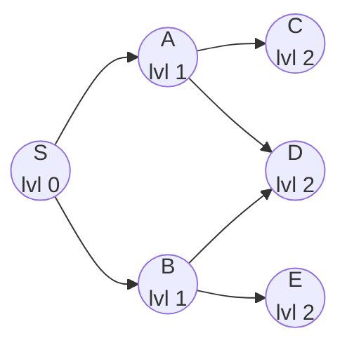
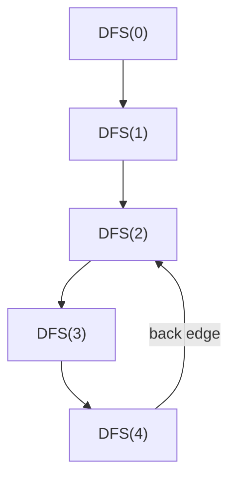
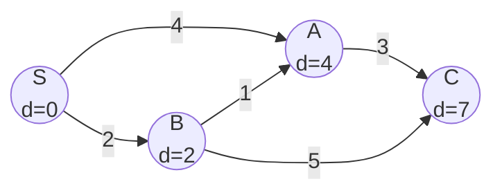

# 13. Graphs

[toc]

> **TL;DR:** A graph G = (V, E) is the universal abstraction for *things and the relationships between them* — vertices are entities, edges are connections. Every problem involving networks, dependencies, reachability, or routing is a graph problem in disguise. Graphs generalise trees (a tree is a connected acyclic graph), and the algorithms built on them — BFS, DFS, Dijkstra, Bellman-Ford, Kruskal, Prim — are the backbone of GPS routing, package managers, web crawlers, and social networks.

## Vocabulary

**Graph** — a pair G = (V, E) where V is a set of vertices (nodes) and E is a set of edges (connections between pairs of vertices).

**Directed graph (digraph)** — edges have direction; (u, v) means u → v but NOT v → u. Max edges = |V| × (|V| − 1).

**Undirected graph** — (u, v) is traversable in both directions. Max edges = |V| × (|V| − 1) / 2.

**Weighted graph** — each edge carries a numeric cost (distance, latency, capacity).

**Walk** — a sequence of vertices obtained by following edges; vertices and edges may repeat.

**Path** — a walk with no repeated vertices.

**Cycle** — a walk that begins and ends at the same vertex (length ≥ 1).

**Cyclic / Acyclic** — a graph containing / not containing any cycle.

**DAG** — Directed Acyclic Graph. No directed cycle. Enables topological ordering.

**Degree** — in undirected graphs: number of edges incident to a vertex. In digraphs: in-degree (edges arriving) and out-degree (edges leaving).

**Connected graph** — every pair of vertices has a path between them (undirected sense).

**Strongly connected** — directed graph where every vertex is reachable from every other vertex.

**Connected component** — a maximal subgraph that is connected.

**Strongly connected component (SCC)** — maximal subgraph that is strongly connected.

**Complete graph** — every pair of distinct vertices is connected by exactly one edge.

**Bipartite graph** — vertices can be split into two disjoint sets such that every edge connects a vertex in one set to a vertex in the other; contains no odd-length cycle.

**Tree (as graph)** — a connected acyclic undirected graph with exactly |V| − 1 edges.

**Spanning tree** — a subgraph that is a tree and includes all |V| vertices.

**MST (Minimum Spanning Tree)** — the spanning tree with minimum total edge weight; defined for weighted undirected connected graphs.

**Topological order** — a linear ordering of vertices in a DAG such that for every directed edge (u, v), u appears before v.

**Relaxation** — the operation dist[v] = min(dist[v], dist[u] + w(u,v)) at the core of shortest-path algorithms.

**BFS (Breadth-First Search)** — level-by-level traversal from a source using a queue. Guarantees shortest path in unweighted graphs.

**DFS (Depth-First Search)** — dive-as-deep-as-possible traversal using a stack or recursion.

**Union-Find / DSU (Disjoint Set Union)** — data structure tracking which elements belong to the same component; supports near-O(α(n)) find and union with path compression + union by rank.

**Articulation point** — a vertex whose removal increases the number of connected components.

**Bridge** — an edge whose removal increases the number of connected components.

**Discovery time / Low value** — DFS timestamps used in Tarjan's bridge/articulation algorithm.

---

## Intuition

Think of a graph as a road map: cities are vertices, roads are edges, and road distances are edge weights. The question "what is the shortest route from A to B?" is exactly Dijkstra's algorithm. "Can I get from any city to any other?" is connectivity. "If I remove this city, does the network fall apart?" is articulation-point detection.

What makes graphs powerful is that *almost everything* maps onto them: web pages (vertices) linked by hyperlinks (edges); tasks (vertices) with prerequisites (directed edges forming a DAG); computers (vertices) joined by network cables (edges with bandwidth weights). Once you recognise the graph, you have thirty years of proven algorithms at your disposal.

The key mental model shift from trees: in a tree, there is exactly one path between any two nodes. In a general graph, there may be zero, one, or many paths — and managing which nodes you've already visited is the entire challenge.

---

## Memory layout

Two canonical representations dominate in practice. The choice hinges on the ratio of edges to vertices and the operations you need.

**Figure:** same graph (5 vertices, 6 undirected edges) as adjacency matrix (left) and adjacency list (right).

```
Graph: 0—1, 0—2, 1—2, 1—3, 2—4, 3—4

ADJACENCY MATRIX (5×5)           ADJACENCY LIST
     0  1  2  3  4               0: [1, 2]
  0 [0, 1, 1, 0, 0]              1: [0, 2, 3]
  1 [1, 0, 1, 1, 0]              2: [0, 1, 4]
  2 [1, 1, 0, 0, 1]              3: [1, 4]
  3 [0, 1, 0, 0, 1]              4: [2, 3]
  4 [0, 0, 1, 1, 0]

Matrix[i][j] = 1  ↔  edge (i,j)
Symmetric for undirected graphs.
```

| Operation | Adjacency Matrix | Adjacency List |
| :--- | :---: | :---: |
| Space | O(V²) | O(V + E) |
| Edge lookup (u, v) | O(1) | O(deg(u)) |
| All neighbours of u | O(V) | O(deg(u)) |
| Add edge | O(1) | O(1) amortised |
| Remove edge | O(1) | O(deg(u)) |
| Best for | Dense graphs, O(1) edge checks | Sparse graphs (most real-world) |

> [!TIP]
> Almost all competitive programming and production graph problems use the adjacency list. The adjacency matrix only wins when V ≤ 1000 and you need O(1) edge existence checks, or for Floyd-Warshall all-pairs shortest paths.

---

## Math foundations

The algorithms in this note are not magic — each rests on a small set of combinatorial and graph-theoretic invariants. This section formalises those invariants so you can reason about correctness from first principles rather than memorising rules.

### Graph theory formalism

A graph G is a pair of sets: a vertex set V and an edge set E, where each edge is a pair of vertices. The two key counts are n = |V| (number of vertices) and m = |E| (number of edges). These bounds determine which algorithm is appropriate — adjacency matrix, adjacency list, BFS, or Floyd-Warshall.

```math
G = (V, E), \quad n = |V|, \quad m = |E|
```

For an **undirected** graph, each edge {u, v} is unordered, so the maximum number of edges (a complete graph K_n) is the number of 2-element subsets of V:

```math
0 \leq m \leq \binom{n}{2} = \frac{n(n-1)}{2}
```

For a **directed** graph, each ordered pair (u, v) with u ≠ v is a distinct edge, doubling the maximum:

```math
0 \leq m \leq n(n-1)
```

The **handshaking lemma** follows from the fact that each edge contributes exactly 2 to the total degree sum — once for each of its endpoints. This is a useful sanity-check when building graphs programmatically.

```math
\sum_{v \in V} \deg(v) = 2m
```

A graph is **dense** when m grows quadratically in n (adjacency matrix is appropriate); it is **sparse** when m grows linearly or near-linearly:

```math
\text{dense}: m = \Theta(n^2) \qquad \text{sparse}: m = O(n) \text{ or } O(n \log n)
```

> [!NOTE]
> Real-world graphs — road networks, social graphs, dependency trees, web link graphs — are almost always sparse. E ≈ O(V) to O(V log V) is the norm, which is why adjacency lists and O((V+E) log V) algorithms dominate in practice over O(V²) or O(V³) approaches.

### BFS correctness — shortest paths in unweighted graphs

BFS discovers vertices in non-decreasing order of hop distance from the source. The key correctness invariant is that when a vertex v is first enqueued, the distance assigned to it is the true shortest path distance — any later path to v would have to go through a vertex at the same or greater distance, so it cannot be shorter.

The formal invariant after processing all vertices at distance k is:

```math
\forall v \in V: \; d_{\text{BFS}}(s, v) = \delta(s, v)
```

where δ(s, v) is the true shortest-path distance (minimum number of edges). The inductive proof proceeds as follows. At iteration k, every vertex at distance ≤ k has been discovered with the correct distance (base: k=0, trivially d[s]=0=δ(s,s)). At the next iteration, any undiscovered neighbour v of a vertex u at distance k is assigned d[v] = k+1. Since BFS uses a FIFO queue, no vertex at distance < k+1 can have been left undiscovered at step k (by the inductive hypothesis). Therefore d[v] = k+1 = δ(s,v).

```math
\text{Invariant: at start of iteration } k, \; \{v : \delta(s,v) \leq k\} \subseteq \text{discovered}
```

> [!IMPORTANT]
> This guarantee holds only for **unweighted** graphs. On a weighted graph, BFS assigns distance = hop count, which can be far from the minimum-weight path. A two-hop path with total weight 1 will be ranked lower than a one-hop path of weight 1000 if you sort by hops. Use Dijkstra for weighted graphs.

### Dijkstra correctness — the cut argument

Dijkstra's algorithm maintains a set S of "settled" vertices whose true shortest-path distances are known, and a min-heap of frontier vertices with tentative distances. At each step, the vertex u with the minimum tentative distance d(u) is extracted from the heap and moved into S. The claim is that d(u) equals the true distance δ(s, u) at the moment of extraction.

The proof uses a cut argument. Suppose, for contradiction, that there exists a shorter path P from s to u not yet accounted for. P must at some point leave S — let x be the last settled vertex on P and y be the first unsettled vertex on P. Since x ∈ S, d(x) = δ(s, x) is correct. The sub-path from x to u via y has length:

```math
\delta(s, x) + w(x, y) + \underbrace{(\text{remaining path weight})}_{\geq 0} \;\geq\; d(y) \;\geq\; d(u)
```

The last inequality holds because u was chosen as the minimum tentative distance in the heap. So no path through y can be shorter than d(u), contradicting the assumption. Therefore d(u) = δ(s, u) when u is extracted.

```math
\text{For all } e \in E: w(e) \geq 0 \implies d(u) = \delta(s, u) \text{ when } u \text{ is extracted from the heap.}
```

> [!IMPORTANT]
> The non-negativity assumption w(e) ≥ 0 is load-bearing. With a negative-weight edge from a settled vertex to an unsettled one, the path through that edge could be shorter than d(u), but Dijkstra never revisits settled vertices to catch this.

### Bellman-Ford and the (V−1) iterations bound

Bellman-Ford's correctness rests on a structural observation about shortest paths in a graph without negative cycles: any shortest path is a *simple* path (no repeated vertices), and a simple path in a graph with V vertices uses at most V−1 edges. This bounds the number of relaxation rounds needed.

Define d^(k)[v] as the minimum cost of any path from s to v using **at most k edges**. The Bellman-Ford iteration computes exactly this:

```math
d^{(k)}[v] = \min\!\left(d^{(k-1)}[v],\; \min_{(u,v) \in E}\!\left(d^{(k-1)}[u] + w(u,v)\right)\right)
```

The inductive claim is: after k full passes over all edges, d^(k)[v] = δ_k(s, v) for all v, where δ_k denotes the minimum cost over all paths using ≤ k edges. The base case (k=0) gives d^(0)[s]=0 and d^(0)[v]=∞ for v≠s. At each step, if d^(k−1)[u] = δ_{k-1}(s, u), then relaxing (u,v) correctly accounts for all paths that reach v in exactly k edges via u.

```math
\text{After } V{-}1 \text{ iterations: } d^{(V-1)}[v] = \delta(s,v) \;\; \forall v \in V
```

If a V-th pass still relaxes any edge, there is a **negative-weight cycle** reachable from s — shortest paths are undefined (unboundedly negative).

### MST cut property and cycle property

Two dual properties characterise exactly which edges belong to an MST. Together they justify both Kruskal's and Prim's greedy strategies without requiring a separate correctness argument for each.

**Cut property:** let (S, V\S) be any partition of the vertices into two non-empty sets. The minimum-weight edge crossing this cut belongs to some MST. Formally:

```math
\forall \text{ cut } (S, V \setminus S),\; e^* = \arg\min_{e \in \text{cut}} w(e) \implies e^* \in \text{some MST}
```

*Proof sketch:* suppose e* = (u,v) is not in some MST T. T must contain a path from u to v (since T spans all vertices); that path crosses the cut at some edge e'. Since w(e*) ≤ w(e') (e* is the cut minimum), swapping e' for e* gives a spanning tree of no greater weight — contradicting minimality of T unless w(e*)=w(e') (in which case both are in some MST).

**Cycle property:** for any cycle C in the graph, the maximum-weight edge in C is NOT in any MST (assuming distinct edge weights):

```math
\forall \text{ cycle } C,\; e_{\max} = \arg\max_{e \in C} w(e) \implies e_{\max} \notin \text{any MST}
```

*Proof sketch:* if e_max were in an MST T, removing it disconnects T into two components — a cut. The remaining edges of C (all lighter than e_max) span this cut, so the lightest one could replace e_max to give a lighter spanning tree, contradicting MST minimality.

These two properties explain the algorithmic strategies: Kruskal's sorts edges ascending and adds each one if it doesn't form a cycle (applying the cut property to the cut induced by the current component containing the edge's lighter endpoint); Prim's always picks the minimum-weight edge crossing the frontier cut between the MST-so-far and the rest of the graph.

### Union-Find complexity — inverse Ackermann

The Ackermann function A(m, n) grows faster than any primitive recursive function; its inverse α(n) = min{k : A(k, k) ≥ n} grows so slowly it is effectively a constant for any input size encountered in practice. The amortised complexity of m Union-Find operations on n elements, with both path compression and union by rank, is:

```math
T(m, n) = O(m \cdot \alpha(n))
```

For all n < 2^{2^{2^{65536}}} — a number so vast it dwarfs the number of atoms in the observable universe — α(n) ≤ 4. The proof (Tarjan 1975) uses a careful potential-function argument tracking the rank of each node. Path compression flattens the tree so future finds are O(1); union by rank ensures the maximum depth stays O(log n), bounding how much work any single find can do before path compression pays off. The result is the tightest amortised bound known for any data structure operation in algorithm theory.

```math
\alpha(n) \leq 4 \quad \forall\; n < 2^{2^{2^{65536}}} \approx \text{"all practical inputs"}
```

> [!TIP]
> In Kruskal's MST, you run m = E union/find operations on n = V elements. The E·α(V) term is dominated by the O(E log E) sort in all realistic inputs, so Kruskal's is E log E in practice — but the Union-Find itself is essentially free per operation.

---

## How it works

Graph algorithms decompose into a small number of primitives — traversal (BFS / DFS), shortest path, spanning tree, and connectivity — each building on the last. The entire section is ordered from foundational to advanced; the Union-Find section is a prerequisite for Kruskal and many connectivity algorithms.

### Representations in Python

Python's idiomatic graph is a `defaultdict(list)` for adjacency lists. Weighted graphs extend each entry to a list of `(neighbour, weight)` tuples. The matrix is a 2-D list, useful when V is small and dense.

```python
from collections import defaultdict
from typing import Union

# Unweighted adjacency list
def build_graph(n: int, edges: list[tuple[int, int]]) -> defaultdict[int, list[int]]:
    adj: defaultdict[int, list[int]] = defaultdict(list)
    for u, v in edges:
        adj[u].append(v)
        adj[v].append(u)  # remove for directed
    return adj

# Weighted adjacency list: adj[u] = [(v, weight), ...]
def build_weighted(n: int, edges: list[tuple[int, int, int]]) -> defaultdict[int, list[tuple[int, int]]]:
    adj: defaultdict[int, list[tuple[int, int]]] = defaultdict(list)
    for u, v, w in edges:
        adj[u].append((v, w))
        adj[v].append((u, w))  # remove for directed
    return adj

# Adjacency matrix (unweighted, 0-indexed)
def build_matrix(n: int, edges: list[tuple[int, int]]) -> list[list[int]]:
    mat: list[list[int]] = [[0] * n for _ in range(n)]
    for u, v in edges:
        mat[u][v] = 1
        mat[v][u] = 1  # remove for directed
    return mat
```

### BFS

Breadth-First Search explores the graph in concentric shells radiating outward from a source vertex. The key invariant is that every vertex is added to the queue exactly once — enforced by the `visited` boolean array marked *before* enqueue, not after dequeue. BFS produces the shortest path (minimum number of edges) from the source to every reachable vertex in an unweighted graph.



```python
from collections import deque

def bfs(adj: defaultdict[int, list[int]], source: int, n: int) -> list[int]:
    """Return shortest distances from source to all vertices (-1 if unreachable)."""
    dist: list[int] = [-1] * n
    dist[source] = 0
    queue: deque[int] = deque([source])
    while queue:
        u = queue.popleft()
        for v in adj[u]:
            if dist[v] == -1:          # not yet visited
                dist[v] = dist[u] + 1
                queue.append(v)
    return dist

def count_connected_components(n: int, adj: defaultdict[int, list[int]]) -> int:
    """Count connected components via repeated BFS from unvisited vertices."""
    visited: list[bool] = [False] * n
    count = 0
    for i in range(n):
        if not visited[i]:
            visited[i] = True
            queue: deque[int] = deque([i])
            while queue:
                u = queue.popleft()
                for v in adj[u]:
                    if not visited[v]:
                        visited[v] = True
                        queue.append(v)
            count += 1
    return count
```

> [!IMPORTANT]
> Mark a vertex visited **when you enqueue it**, not when you dequeue it. Marking on dequeue allows the same vertex to be enqueued multiple times, exploding time complexity from O(V+E) to O(V×E) in the worst case.

### DFS

Depth-First Search plunges as deep as possible along one branch before backtracking. The recursive version is clean but hits Python's default recursion limit (~1000) on large inputs; the iterative version uses an explicit stack. DFS is the engine behind cycle detection, topological sort, SCC, articulation points, and bridges.



```python
import sys
sys.setrecursionlimit(100_000)  # increase for large graphs

def dfs_recursive(adj: defaultdict[int, list[int]], u: int, visited: list[bool]) -> None:
    visited[u] = True
    for v in adj[u]:
        if not visited[v]:
            dfs_recursive(adj, v, visited)

def dfs_iterative(adj: defaultdict[int, list[int]], source: int, n: int) -> list[bool]:
    """Iterative DFS using explicit stack. Returns visited array."""
    visited: list[bool] = [False] * n
    stack: list[int] = [source]
    while stack:
        u = stack.pop()
        if visited[u]:
            continue
        visited[u] = True
        for v in adj[u]:
            if not visited[v]:
                stack.append(v)
    return visited

def dfs_postorder(adj: defaultdict[int, list[int]], u: int, visited: list[bool], order: list[int]) -> None:
    """DFS that appends vertices in postorder — used for topological sort."""
    visited[u] = True
    for v in adj[u]:
        if not visited[v]:
            dfs_postorder(adj, v, visited, order)
    order.append(u)   # append AFTER all descendants are finished
```

### Cycle Detection

Detecting cycles differs for undirected vs directed graphs and requires careful bookkeeping in each case.

**Undirected graphs:** during DFS, if you reach a vertex that is already visited AND is not the direct parent you came from, you have found a back edge — a cycle exists. BFS can also detect cycles by checking if a newly discovered neighbour is already visited (and is not the parent).

**Directed graphs (3-colour DFS):** maintain three states — WHITE (unvisited), GRAY (currently in the DFS call stack), BLACK (fully processed). A back edge to a GRAY node signals a cycle. A back edge to a BLACK node is safe (it is a cross edge, not a cycle).

```python
def has_cycle_undirected(n: int, adj: defaultdict[int, list[int]]) -> bool:
    visited: list[bool] = [False] * n

    def dfs(u: int, parent: int) -> bool:
        visited[u] = True
        for v in adj[u]:
            if not visited[v]:
                if dfs(v, u):
                    return True
            elif v != parent:   # visited neighbour that is not our parent → cycle
                return True
        return False

    for i in range(n):
        if not visited[i]:
            if dfs(i, -1):
                return True
    return False

def has_cycle_directed(n: int, adj: defaultdict[int, list[int]]) -> bool:
    # 0 = white, 1 = gray (in stack), 2 = black (done)
    color: list[int] = [0] * n

    def dfs(u: int) -> bool:
        color[u] = 1   # mark gray: currently on the call stack
        for v in adj[u]:
            if color[v] == 1:   # back edge to gray node = cycle
                return True
            if color[v] == 0:
                if dfs(v):
                    return True
        color[u] = 2   # mark black: fully processed
        return False

    for i in range(n):
        if color[i] == 0:
            if dfs(i):
                return True
    return False
```

> [!WARNING]
> In undirected cycle detection, the `v != parent` check only works for simple graphs. For multigraphs (multiple edges between same pair), track the parent *edge index* rather than parent vertex, or use a visited-count approach.

### Topological Sort

Topological sorting imposes a linear order on the vertices of a DAG such that all dependencies (prerequisite edges) point forward — no vertex appears before a vertex it depends on. The classic use case is build systems and course prerequisites. Topological sort is only valid on DAGs; if the graph has a cycle, no valid ordering exists. Two approaches exist: Kahn's algorithm (BFS on in-degrees) and DFS postorder reversal.

**Kahn's algorithm (BFS-based):**

```python
from collections import deque

def topological_sort_kahn(n: int, adj: defaultdict[int, list[int]]) -> list[int]:
    """
    Returns topological order, or empty list if graph has a cycle.
    Kahn's: repeatedly remove vertices with in-degree 0.
    """
    indegree: list[int] = [0] * n
    for u in range(n):
        for v in adj[u]:
            indegree[v] += 1

    queue: deque[int] = deque(i for i in range(n) if indegree[i] == 0)
    order: list[int] = []

    while queue:
        u = queue.popleft()
        order.append(u)
        for v in adj[u]:
            indegree[v] -= 1
            if indegree[v] == 0:
                queue.append(v)

    return order if len(order) == n else []  # len < n → cycle detected
```

**DFS postorder reversal:**

```python
def topological_sort_dfs(n: int, adj: defaultdict[int, list[int]]) -> list[int]:
    """
    DFS-based topological sort. Reverse of DFS finish order.
    Assumes the graph is a DAG (no cycle check here).
    """
    visited: list[bool] = [False] * n
    order: list[int] = []

    def dfs(u: int) -> None:
        visited[u] = True
        for v in adj[u]:
            if not visited[v]:
                dfs(v)
        order.append(u)   # push AFTER all successors are done

    for i in range(n):
        if not visited[i]:
            dfs(i)

    return order[::-1]   # reverse gives topological order
```

> [!NOTE]
> Kahn's algorithm also detects cycles: if the final order has fewer than V vertices, there is a cycle (some vertices never reached in-degree 0). This makes it the preferred choice when you need both topological sort and cycle detection in one pass.

### Dijkstra's Algorithm

Dijkstra solves the single-source shortest path problem on a weighted graph with **non-negative edge weights**. It greedily processes the unvisited vertex with the current minimum tentative distance, then relaxes all its outgoing edges. A min-heap (priority queue) provides O(log V) extraction of the minimum. The algorithm is provably optimal when all weights are non-negative: once a vertex is popped from the heap, its distance is finalised.



```python
import heapq

def dijkstra(n: int, adj: defaultdict[int, list[tuple[int, int]]], source: int) -> list[float]:
    """
    Single-source shortest paths from `source` using a min-heap.
    adj[u] = [(v, weight), ...]. Returns dist array (inf if unreachable).
    Time: O((V + E) log V)
    """
    INF = float('inf')
    dist: list[float] = [INF] * n
    dist[source] = 0
    # min-heap entries: (distance, vertex)
    heap: list[tuple[float, int]] = [(0, source)]

    while heap:
        d, u = heapq.heappop(heap)
        if d > dist[u]:
            continue    # stale entry — already found a shorter path
        for v, w in adj[u]:
            if dist[u] + w < dist[v]:
                dist[v] = dist[u] + w
                heapq.heappush(heap, (dist[v], v))

    return dist
```

> [!CAUTION]
> Dijkstra gives **wrong answers** on graphs with negative edge weights. Even one negative edge can cause a previously-finalised vertex to need re-relaxation, which Dijkstra never performs. Use Bellman-Ford for negative weights.

### Bellman-Ford

Bellman-Ford finds single-source shortest paths even when edge weights are negative. Its correctness rests on a simple observation: the shortest path in a graph with V vertices uses at most V−1 edges (otherwise it would repeat a vertex and form a cycle). By relaxing all E edges exactly V−1 times, Bellman-Ford guarantees optimal distances. A V-th pass that still relaxes any edge indicates a **negative-weight cycle** — paths can be made arbitrarily short.

```python
def bellman_ford(n: int, edges: list[tuple[int, int, int]], source: int) -> tuple[list[float], bool]:
    """
    Single-source shortest paths with negative-weight support.
    edges: list of (u, v, weight).
    Returns (dist, has_negative_cycle).
    Time: O(V * E)
    """
    INF = float('inf')
    dist: list[float] = [INF] * n
    dist[source] = 0

    for _ in range(n - 1):          # relax all edges V-1 times
        for u, v, w in edges:
            if dist[u] != INF and dist[u] + w < dist[v]:
                dist[v] = dist[u] + w

    # V-th pass: if anything still relaxes, negative cycle exists
    has_neg_cycle = False
    for u, v, w in edges:
        if dist[u] != INF and dist[u] + w < dist[v]:
            has_neg_cycle = True
            break

    return dist, has_neg_cycle
```

### Floyd-Warshall

Floyd-Warshall computes **all-pairs** shortest paths in O(V³) time and O(V²) space using dynamic programming. The recurrence considers whether routing through an intermediate vertex k yields a shorter path between i and j. It handles negative weights gracefully but cannot handle negative cycles (the diagonal dist[i][i] < 0 signals one). The algorithm is natural to implement as a 2-D matrix, identical in structure to the adjacency matrix.

```python
def floyd_warshall(n: int, weight_matrix: list[list[float]]) -> list[list[float]]:
    """
    All-pairs shortest paths.
    weight_matrix[i][j] = edge weight (float('inf') if no edge, 0 on diagonal).
    Returns dist matrix. Time: O(V^3), Space: O(V^2).
    """
    INF = float('inf')
    dist: list[list[float]] = [row[:] for row in weight_matrix]  # deep copy

    for k in range(n):
        for i in range(n):
            for j in range(n):
                if dist[i][k] != INF and dist[k][j] != INF:
                    dist[i][j] = min(dist[i][j], dist[i][k] + dist[k][j])

    return dist
```

### Union-Find (Disjoint Set Union)

Union-Find maintains a partition of elements into disjoint sets and supports two operations: `find(x)` — return the canonical representative (root) of x's set, and `union(x, y)` — merge the sets containing x and y. Two optimisations bring the amortised per-operation cost from O(log n) down to near-constant:

1. **Path compression** — during `find`, flatten every node directly to the root, so future finds are O(1).
2. **Union by rank** — always attach the smaller tree under the root of the larger tree, keeping the maximum depth at O(log n).

Together they achieve O(α(n)) amortised per operation, where α is the inverse Ackermann function — effectively constant (α(n) ≤ 4 for all practical n).

```python
class UnionFind:
    def __init__(self, n: int) -> None:
        self.parent: list[int] = list(range(n))
        self.rank: list[int] = [0] * n
        self.components: int = n

    def find(self, x: int) -> int:
        if self.parent[x] != x:
            self.parent[x] = self.find(self.parent[x])  # path compression
        return self.parent[x]

    def union(self, x: int, y: int) -> bool:
        """Returns True if x and y were in different sets (merge happened)."""
        rx, ry = self.find(x), self.find(y)
        if rx == ry:
            return False
        # union by rank: attach smaller rank under larger rank
        if self.rank[rx] < self.rank[ry]:
            rx, ry = ry, rx
        self.parent[ry] = rx
        if self.rank[rx] == self.rank[ry]:
            self.rank[rx] += 1
        self.components -= 1
        return True

    def connected(self, x: int, y: int) -> bool:
        return self.find(x) == self.find(y)
```

### MST: Prim's and Kruskal's

A **Minimum Spanning Tree** connects all V vertices using exactly V−1 edges with minimum total weight. Two greedy strategies both produce the optimal MST, guaranteed by the **cut property**: the minimum-weight edge crossing any cut of the graph (partition of V into two non-empty sets) is always in some MST.

**Prim's algorithm** grows the MST from a single starting vertex, at each step selecting the cheapest edge that connects a vertex in the MST to a vertex outside it. This is essentially Dijkstra's algorithm with a different priority key (edge weight to MST, not total path distance). Time: O((V + E) log V) with a min-heap.

```python
def prim_mst(n: int, adj: defaultdict[int, list[tuple[int, int]]]) -> tuple[int, list[tuple[int, int, int]]]:
    """
    Prim's MST starting from vertex 0.
    adj[u] = [(v, weight), ...] undirected.
    Returns (total_weight, list of MST edges as (u, v, w)).
    Time: O((V+E) log V)
    """
    in_mst: list[bool] = [False] * n
    # heap: (weight, vertex, parent)
    heap: list[tuple[int, int, int]] = [(0, 0, -1)]
    total = 0
    mst_edges: list[tuple[int, int, int]] = []

    while heap:
        w, u, parent = heapq.heappop(heap)
        if in_mst[u]:
            continue
        in_mst[u] = True
        total += w
        if parent != -1:
            mst_edges.append((parent, u, w))
        for v, weight in adj[u]:
            if not in_mst[v]:
                heapq.heappush(heap, (weight, v, u))

    return total, mst_edges
```

**Kruskal's algorithm** sorts all edges by weight, then greedily adds the cheapest edge that does not form a cycle. Cycle detection is O(α(n)) per edge using Union-Find. Time: O(E log E) dominated by sorting.

```python
def kruskal_mst(n: int, edges: list[tuple[int, int, int]]) -> tuple[int, list[tuple[int, int, int]]]:
    """
    Kruskal's MST via Union-Find.
    edges: list of (weight, u, v) — MUST be pre-sorted or sort here.
    Returns (total_weight, list of MST edges as (u, v, w)).
    Time: O(E log E)
    """
    edges_sorted = sorted(edges, key=lambda e: e[0])  # sort by weight
    uf = UnionFind(n)
    total = 0
    mst_edges: list[tuple[int, int, int]] = []

    for w, u, v in edges_sorted:
        if uf.union(u, v):          # no cycle: add this edge
            total += w
            mst_edges.append((u, v, w))
        if len(mst_edges) == n - 1: # MST complete
            break

    return total, mst_edges
```

### Kosaraju's Algorithm (SCCs)

Kosaraju's algorithm finds all Strongly Connected Components in a directed graph with two DFS passes in O(V + E) time. The first DFS on the original graph records finish times (DFS postorder). The second DFS runs on the **transposed graph** (all edges reversed), starting from the highest-finish-time vertex. Each DFS tree in the second pass is exactly one SCC — because reversing edges ensures you cannot escape the SCC from which you started.

```python
def kosaraju_scc(n: int, adj: defaultdict[int, list[int]]) -> list[list[int]]:
    """
    Kosaraju's SCC algorithm. Returns list of SCCs (each a list of vertices).
    Time: O(V + E), Space: O(V + E)
    """
    # Pass 1: DFS on original graph, record finish order
    visited: list[bool] = [False] * n
    finish_order: list[int] = []

    def dfs1(u: int) -> None:
        visited[u] = True
        for v in adj[u]:
            if not visited[v]:
                dfs1(v)
        finish_order.append(u)

    for i in range(n):
        if not visited[i]:
            dfs1(i)

    # Build transposed graph
    radj: defaultdict[int, list[int]] = defaultdict(list)
    for u in range(n):
        for v in adj[u]:
            radj[v].append(u)

    # Pass 2: DFS on transposed graph in reverse finish order
    visited2: list[bool] = [False] * n
    sccs: list[list[int]] = []

    def dfs2(u: int, component: list[int]) -> None:
        visited2[u] = True
        component.append(u)
        for v in radj[u]:
            if not visited2[v]:
                dfs2(v, component)

    for u in reversed(finish_order):
        if not visited2[u]:
            comp: list[int] = []
            dfs2(u, comp)
            sccs.append(comp)

    return sccs
```

### Shortest Path in DAG (via Topological Sort)

On a DAG, shortest paths can be found in O(V + E) — faster than Dijkstra — by relaxing edges in topological order. This also handles negative weights correctly because a DAG has no cycles, so negative weights cannot create negative cycles.

```python
def dag_shortest_path(n: int, adj: defaultdict[int, list[tuple[int, int]]], source: int) -> list[float]:
    """
    O(V+E) shortest path on a DAG using topological sort + relaxation.
    adj[u] = [(v, weight), ...], directed edges only.
    """
    topo = topological_sort_kahn(n, adj)
    INF = float('inf')
    dist: list[float] = [INF] * n
    dist[source] = 0

    for u in topo:
        if dist[u] == INF:
            continue
        for v, w in adj[u]:
            if dist[u] + w < dist[v]:
                dist[v] = dist[u] + w

    return dist
```

---

## Math

The correctness and complexity of graph algorithms follow from a handful of key invariants.

**BFS shortest path proof:** at any point during BFS from source s, if vertex u is at distance d[u] in the BFS tree, then d[u] is the true shortest path distance. The proof is by induction: s has distance 0 (trivially correct). Any vertex v first discovered from u has d[v] = d[u] + 1. Because BFS processes vertices in non-decreasing distance order (FIFO queue), the first time v is discovered gives the minimum.

```math
\text{dist}_{BFS}(s, v) = \min_{P: s \leadsto v} |P|
```

where |P| is the number of edges on path P.

**Dijkstra correctness:** relies on the greedy choice property. When vertex u is popped from the min-heap with distance d[u], no future path via unvisited vertices can improve on d[u] — because all edge weights are non-negative, any path through unvisited vertices is at least as long.

```math
\text{If } w(e) \geq 0 \;\forall e, \text{ then } d[u] = \delta(s, u) \text{ when } u \text{ is extracted from the heap.}
```

**Bellman-Ford V−1 iterations:** any simple shortest path in a V-vertex graph visits at most V vertices and uses at most V−1 edges. After k iterations of relaxing all edges, we have correct distances for all paths using at most k edges.

```math
d^{(k)}[v] = \min_{P: s \leadsto v,\; |P| \leq k} \text{cost}(P)
```

After V−1 iterations, all shortest simple paths are found.

**MST cut property:** for any cut (S, V∖S) of a connected weighted graph with distinct weights, the minimum-weight edge crossing the cut belongs to every MST.

```math
\text{MST weight} = \min_{\text{spanning trees } T} \sum_{e \in T} w(e)
```

**Kruskal time complexity:**

```math
O(E \log E) = O(E \log V) \quad \text{(since } E \leq V^2 \text{, so } \log E \leq 2 \log V\text{)}
```

**Union-Find inverse Ackermann:** with both path compression and union by rank, m operations on n elements take O(m · α(n)) time total, where α is the inverse Ackermann function. For all n < 2^{2^{65536}}, α(n) ≤ 4.

```math
T(m, n) = O(m \cdot \alpha(n)) \approx O(m) \text{ in practice}
```

---

## Real-world example

Four canonical real-world mappings — each a different graph algorithm in disguise.

**Web crawler (BFS):** crawl the web starting from a seed URL. Each page is a vertex; each hyperlink is a directed edge. BFS guarantees you discover pages in order of link-distance from the seed, which matters for PageRank bootstrapping and for respecting crawl depth limits.

**Package manager (topological sort):** `npm install` or `pip install` must install dependencies before the packages that depend on them. The dependency graph is a DAG (circular dependencies are rejected). Kahn's algorithm directly gives the install order; a cycle means an unsatisfiable dependency set.

**GPS routing (Dijkstra):** road intersections are vertices, roads are weighted edges (travel time or distance). Dijkstra from your current location gives shortest travel times to all reachable destinations. Real systems augment with A* (Dijkstra + a heuristic) and bidirectional search for speed.

**Social network friend levels (BFS):** "people you may know" on LinkedIn is BFS distance-2 from your profile vertex. "Second-degree connections" is BFS level 2.

```python
from collections import deque, defaultdict
import heapq

def web_crawler_bfs(start_url: str, link_graph: defaultdict[str, list[str]], max_depth: int) -> list[str]:
    """
    BFS crawl up to max_depth hops from start_url.
    Returns list of discovered URLs in BFS order.
    """
    visited: set[str] = {start_url}
    queue: deque[tuple[str, int]] = deque([(start_url, 0)])
    crawled: list[str] = []

    while queue:
        url, depth = queue.popleft()
        crawled.append(url)
        if depth < max_depth:
            for next_url in link_graph[url]:
                if next_url not in visited:
                    visited.add(next_url)
                    queue.append((next_url, depth + 1))

    return crawled


def package_install_order(packages: list[str], deps: list[tuple[str, str]]) -> list[str]:
    """
    Topological sort for package install order.
    deps: list of (package, dependency_of_package) meaning 'dependency must come first'.
    Returns install order or [] if circular dependency detected.
    """
    idx = {p: i for i, p in enumerate(packages)}
    n = len(packages)
    adj: defaultdict[int, list[int]] = defaultdict(list)
    indegree: list[int] = [0] * n

    for pkg, dep in deps:
        # dep must be installed before pkg
        adj[idx[dep]].append(idx[pkg])
        indegree[idx[pkg]] += 1

    queue: deque[int] = deque(i for i in range(n) if indegree[i] == 0)
    order: list[int] = []

    while queue:
        u = queue.popleft()
        order.append(u)
        for v in adj[u]:
            indegree[v] -= 1
            if indegree[v] == 0:
                queue.append(v)

    if len(order) < n:
        return []   # circular dependency
    return [packages[i] for i in order]
```

> [!TIP]
> For production GPS routing, pure Dijkstra on a city-scale graph (millions of nodes) is too slow. Real systems use **contraction hierarchies** or **A\*** with landmark heuristics to achieve sub-millisecond query times on continent-scale graphs.

---

## In practice

The gap between textbook graph algorithms and production graph systems is wide.

**Library defaults:** Python's `networkx` is excellent for prototyping and analysis — it handles directed, undirected, weighted, multi-graphs, and has built-in Dijkstra, MST, BFS, DFS, SCC, topological sort. But it is slow for large graphs (pure Python, high memory overhead per node/edge). For competitive programming or performance-sensitive code, roll your own with `defaultdict(list)` and `heapq`.

**Graph databases:** Neo4j (property graph, Cypher query language), Amazon Neptune, and TigerGraph store and query trillion-edge graphs. They use specialized storage (adjacency-native layouts) rather than row-store tables, making multi-hop traversals orders of magnitude faster than equivalent SQL joins.

**ML on graphs:** PyTorch Geometric (PyG) and DGL provide graph neural network primitives. GNNs replace hand-crafted BFS/DFS with learned message-passing — each vertex aggregates representations from its neighbours, iteratively. Applicable to molecule property prediction, recommendation systems, fraud detection, and knowledge graph completion.

**Memory: when the graph doesn't fit in RAM:** for web-scale graphs (billions of vertices), you need external-memory graph processing (Apache Spark GraphX, Google Pregel / Beam) or graph streaming algorithms. BFS in external memory is significantly more expensive — random access patterns defeat disk and cache hierarchy; locality-aware layout (BFS ordering of adjacency lists) helps.

**Sparse vs dense reality:** real-world graphs are almost always sparse. Social networks, road networks, and dependency graphs have E ≈ O(V) to O(V log V). This is why adjacency lists and Dijkstra's O((V+E) log V) dominate over Floyd-Warshall's O(V³).

> [!WARNING]
> Python's default recursion limit is 1000. DFS on a graph with 10,000 nodes will segfault unless you call `sys.setrecursionlimit(200_000)` or convert to iterative DFS. This silently crashes in production; prefer iterative DFS for any input you don't control.

> [!NOTE]
> `networkx` is ~100× slower than a C++ or even hand-rolled Python adjacency list for large graphs. Profile before choosing it for anything beyond analysis or visualisation.

---

## Pitfalls

- **Forgetting the visited set in DFS/BFS** — on any graph with cycles, omitting `visited` causes infinite loops. Even on trees, BFS without visited tracking is wrong for general graphs. Always initialise `visited` before traversal.

- **Dijkstra with negative weights** — Dijkstra's greedy extraction assumes that once a vertex's distance is finalised it cannot improve. A negative edge from an already-finalised vertex to another can violate this. The result is silently wrong distances, not an error. Use Bellman-Ford or SPFA for negative weights.

- **BFS for weighted shortest path** — BFS counts hops, not weight. On a weighted graph, BFS returns the path with fewest edges, which may have much higher total weight than the true shortest weighted path. Use Dijkstra.

- **Topological sort on a cyclic graph** — Kahn's returns an incomplete ordering (silently, unless you check `len(order) == n`). The DFS version may return a meaningless ordering without cycle detection. Always check the length of Kahn's output.

- **Marking visited on dequeue instead of enqueue** — allows the same vertex to be enqueued O(deg) times, turning O(V+E) BFS into O(V×E) in pathological cases.

- **Undirected cycle detection: using `parent vertex` in multigraphs** — if two nodes share multiple edges, `v != parent` misidentifies a valid multi-edge as a cycle. Track parent edge index instead.

- **Kosaraju recursion depth** — both DFS passes are recursive. On large graphs, Python's call stack overflows. Convert both to iterative DFS for safety.

- **MST on disconnected graphs** — Prim's and Kruskal's produce a minimum spanning *forest*, not a tree, if the graph is disconnected. This is correct but the result should be interpreted as a forest. Kruskal's Union-Find naturally handles this.

- **Floyd-Warshall with negative cycles** — if `dist[i][i] < 0` after the algorithm, there is a negative cycle reachable from i. The other distances in that row/column are meaningless.

> [!CAUTION]
> On LeetCode and competitive programming problems, the node count can reach 10^5 and edge count 10^6. Recursive DFS on such inputs **will** hit Python's recursion limit and raise `RecursionError`. Always use `sys.setrecursionlimit` or — better — iterative DFS in production-grade solutions.

---

## Exercises

Work each problem in the order listed: problem statement, then try for 15–20 minutes before reading the hint and solution.

### 1. Number of Islands (LeetCode 200)

**Problem:** Given a 2-D binary grid where `'1'` is land and `'0'` is water, count the number of islands. An island is surrounded by water and formed by connecting adjacent lands horizontally or vertically.

> [!TIP]
> Treat the grid as an implicit graph: each `'1'` cell is a vertex, adjacent `'1'` cells share an edge. Run BFS or DFS from each unvisited `'1'`, marking all reachable cells visited. Each BFS/DFS invocation is one island.

```python
def numIslands(grid: list[list[str]]) -> int:
    if not grid:
        return 0
    rows, cols = len(grid), len(grid[0])
    count = 0

    def dfs(r: int, c: int) -> None:
        if r < 0 or r >= rows or c < 0 or c >= cols or grid[r][c] != '1':
            return
        grid[r][c] = '0'   # mark visited by sinking the island
        dfs(r + 1, c); dfs(r - 1, c); dfs(r, c + 1); dfs(r, c - 1)

    for r in range(rows):
        for c in range(cols):
            if grid[r][c] == '1':
                dfs(r, c)
                count += 1
    return count
# Time: O(R*C), Space: O(R*C) recursion stack
```

### 2. Clone Graph (LeetCode 133)

**Problem:** Given a reference to a node in a connected undirected graph, return a deep copy of the graph.

> [!TIP]
> BFS / DFS with a `cloned: dict[Node, Node]` hashmap. When you visit a node, create its clone immediately and store it. For each neighbour, recursively clone and append the clone to the current node's clone neighbours list.

```python
from __future__ import annotations

class Node:
    def __init__(self, val: int = 0, neighbors: list[Node] | None = None) -> None:
        self.val = val
        self.neighbors: list[Node] = neighbors if neighbors is not None else []

def cloneGraph(node: Node | None) -> Node | None:
    if not node:
        return None
    cloned: dict[Node, Node] = {}

    def dfs(n: Node) -> Node:
        if n in cloned:
            return cloned[n]
        copy = Node(n.val)
        cloned[n] = copy
        for nb in n.neighbors:
            copy.neighbors.append(dfs(nb))
        return copy

    return dfs(node)
# Time: O(V+E), Space: O(V)
```

### 3. Course Schedule (LeetCode 207 / 210)

**Problem 207:** Given n courses and a list of prerequisite pairs [a, b] meaning b must be taken before a, determine if it is possible to finish all courses. **Problem 210:** Return the order, or [] if impossible.

> [!TIP]
> Build a directed graph where edge b → a means "b before a". Cycle detection (207) or topological sort (210) using Kahn's algorithm handles both. If Kahn's output length < n, there is a cycle.

```python
def canFinish(numCourses: int, prerequisites: list[list[int]]) -> bool:
    adj: defaultdict[int, list[int]] = defaultdict(list)
    indegree: list[int] = [0] * numCourses
    for a, b in prerequisites:
        adj[b].append(a)
        indegree[a] += 1
    queue: deque[int] = deque(i for i in range(numCourses) if indegree[i] == 0)
    count = 0
    while queue:
        u = queue.popleft()
        count += 1
        for v in adj[u]:
            indegree[v] -= 1
            if indegree[v] == 0:
                queue.append(v)
    return count == numCourses

def findOrder(numCourses: int, prerequisites: list[list[int]]) -> list[int]:
    adj: defaultdict[int, list[int]] = defaultdict(list)
    indegree: list[int] = [0] * numCourses
    for a, b in prerequisites:
        adj[b].append(a)
        indegree[a] += 1
    queue: deque[int] = deque(i for i in range(numCourses) if indegree[i] == 0)
    order: list[int] = []
    while queue:
        u = queue.popleft()
        order.append(u)
        for v in adj[u]:
            indegree[v] -= 1
            if indegree[v] == 0:
                queue.append(v)
    return order if len(order) == numCourses else []
# Time: O(V+E), Space: O(V+E)
```

### 4. Word Ladder (LeetCode 127)

**Problem:** Given two words (beginWord, endWord) and a word list, find the length of the shortest transformation sequence where each step changes exactly one letter and each intermediate word must be in the word list.

> [!TIP]
> BFS on an implicit graph. Two words are adjacent if they differ by exactly one character. Use a wildcard pattern (replace each character position with `*`) to bucket words and build the adjacency in O(M² × N) where M is word length and N is list size.

```python
def ladderLength(beginWord: str, endWord: str, wordList: list[str]) -> int:
    word_set: set[str] = set(wordList)
    if endWord not in word_set:
        return 0
    queue: deque[tuple[str, int]] = deque([(beginWord, 1)])
    visited: set[str] = {beginWord}
    while queue:
        word, length = queue.popleft()
        for i in range(len(word)):
            for c in 'abcdefghijklmnopqrstuvwxyz':
                next_word = word[:i] + c + word[i+1:]
                if next_word == endWord:
                    return length + 1
                if next_word in word_set and next_word not in visited:
                    visited.add(next_word)
                    queue.append((next_word, length + 1))
    return 0
# Time: O(M^2 * N), Space: O(M^2 * N)
```

### 5. Pacific Atlantic Water Flow (LeetCode 417)

**Problem:** Given an m×n matrix of heights, return all cells from which water can flow to both the Pacific (top/left border) and Atlantic (bottom/right border) oceans. Water flows to equal or lower adjacent cells.

> [!TIP]
> Reverse the flow: run BFS *backwards* from each ocean's border, marking cells that can reach that ocean (flowing *uphill* — equal or higher height). The answer is the intersection of cells reachable from both oceans.

```python
def pacificAtlantic(heights: list[list[int]]) -> list[list[int]]:
    rows, cols = len(heights), len(heights[0])
    DIRS = [(0,1),(0,-1),(1,0),(-1,0)]

    def bfs(starts: list[tuple[int,int]]) -> set[tuple[int,int]]:
        reachable: set[tuple[int,int]] = set(starts)
        q: deque[tuple[int,int]] = deque(starts)
        while q:
            r, c = q.popleft()
            for dr, dc in DIRS:
                nr, nc = r+dr, c+dc
                if 0 <= nr < rows and 0 <= nc < cols and (nr,nc) not in reachable and heights[nr][nc] >= heights[r][c]:
                    reachable.add((nr,nc))
                    q.append((nr,nc))
        return reachable

    pacific_starts = [(r, 0) for r in range(rows)] + [(0, c) for c in range(cols)]
    atlantic_starts = [(r, cols-1) for r in range(rows)] + [(rows-1, c) for c in range(cols)]
    pac = bfs(pacific_starts)
    atl = bfs(atlantic_starts)
    return [[r, c] for r, c in pac & atl]
# Time: O(R*C), Space: O(R*C)
```

### 6. Network Delay Time (LeetCode 743) — Dijkstra

**Problem:** Given a network of n nodes and a list of directed weighted edges, find the minimum time for all nodes to receive a signal sent from node k. Return -1 if not all nodes can be reached.

> [!TIP]
> Classic single-source shortest path from node k on a directed weighted graph. Run Dijkstra; the answer is the maximum finite distance in the dist array. If any dist[v] is infinity, return -1.

```python
def networkDelayTime(times: list[list[int]], n: int, k: int) -> int:
    adj: defaultdict[int, list[tuple[int, int]]] = defaultdict(list)
    for u, v, w in times:
        adj[u].append((v, w))

    INF = float('inf')
    dist: list[float] = [INF] * (n + 1)
    dist[k] = 0
    heap: list[tuple[float, int]] = [(0, k)]

    while heap:
        d, u = heapq.heappop(heap)
        if d > dist[u]:
            continue
        for v, w in adj[u]:
            if dist[u] + w < dist[v]:
                dist[v] = dist[u] + w
                heapq.heappush(heap, (dist[v], v))

    max_dist = max(dist[1:])
    return int(max_dist) if max_dist < INF else -1
# Time: O((V+E) log V), Space: O(V+E)
```

### 7. Cheapest Flights Within K Stops (LeetCode 787) — Modified Bellman-Ford

**Problem:** Find the cheapest flight from src to dst with at most k stops. Return -1 if impossible.

> [!TIP]
> Standard Dijkstra fails here because you need to constrain the number of hops, not just minimise cost. Use Bellman-Ford for exactly k+1 iterations (k stops = k+1 edges). Key trick: make a copy of the dist array at the start of each iteration so you don't use prices updated in the same round.

```python
def findCheapestPrice(n: int, flights: list[list[int]], src: int, dst: int, k: int) -> int:
    INF = float('inf')
    dist: list[float] = [INF] * n
    dist[src] = 0

    for _ in range(k + 1):           # at most k+1 edges = k stops
        temp = dist[:]               # snapshot — do not use this round's updates
        for u, v, w in flights:
            if dist[u] != INF and dist[u] + w < temp[v]:
                temp[v] = dist[u] + w
        dist = temp

    return int(dist[dst]) if dist[dst] < INF else -1
# Time: O(k * E), Space: O(V)
```

### 8. Redundant Connection (LeetCode 684) — DSU

**Problem:** Given a tree with one extra edge added, find and return that edge (the one that, if removed, gives back the original tree). The graph is undirected.

> [!TIP]
> Process edges one by one. For each edge (u, v), if `find(u) == find(v)`, both vertices are already in the same component — this edge is the redundant one. Otherwise union them. The first such edge is the answer.

```python
def findRedundantConnection(edges: list[list[int]]) -> list[int]:
    n = len(edges)
    uf = UnionFind(n + 1)
    for u, v in edges:
        if not uf.union(u, v):   # already connected → redundant
            return [u, v]
    return []
# Time: O(N * alpha(N)) ≈ O(N), Space: O(N)
```

### 9. Accounts Merge (LeetCode 721) — DSU

**Problem:** Given a list of accounts where each account is [name, email1, email2, ...], merge accounts that share at least one email. Return merged accounts sorted.

> [!TIP]
> Map each email to an integer ID. Use DSU to union all emails in the same account. Then group emails by root representative and attach the account name.

```python
def accountsMerge(accounts: list[list[str]]) -> list[list[str]]:
    email_to_id: dict[str, int] = {}
    email_to_name: dict[str, str] = {}
    cur_id = 0

    for account in accounts:
        name = account[0]
        for email in account[1:]:
            if email not in email_to_id:
                email_to_id[email] = cur_id
                cur_id += 1
            email_to_name[email] = name

    uf = UnionFind(cur_id)
    for account in accounts:
        first_id = email_to_id[account[1]]
        for email in account[2:]:
            uf.union(first_id, email_to_id[email])

    from collections import defaultdict
    root_to_emails: defaultdict[int, list[str]] = defaultdict(list)
    for email, eid in email_to_id.items():
        root_to_emails[uf.find(eid)].append(email)

    result: list[list[str]] = []
    for root, emails in root_to_emails.items():
        name = email_to_name[emails[0]]
        result.append([name] + sorted(emails))
    return result
# Time: O(N * alpha(N) + N log N) for sorting, Space: O(N)
```

### 10. Shortest Path in Binary Matrix (LeetCode 1091)

**Problem:** Given an n×n binary matrix, find the shortest clear path from top-left to bottom-right (8-directional movement). Return -1 if no such path exists.

> [!TIP]
> BFS on the grid treating each `0` cell as a vertex. 8-directional movement = 8 potential neighbours. BFS gives shortest path in terms of number of cells. Handle the edge case where start or end is `1`.

```python
def shortestPathBinaryMatrix(grid: list[list[int]]) -> int:
    n = len(grid)
    if grid[0][0] == 1 or grid[n-1][n-1] == 1:
        return -1
    DIRS = [(-1,-1),(-1,0),(-1,1),(0,-1),(0,1),(1,-1),(1,0),(1,1)]
    queue: deque[tuple[int, int, int]] = deque([(0, 0, 1)])  # (row, col, path_length)
    grid[0][0] = 1   # mark visited by setting to 1
    while queue:
        r, c, length = queue.popleft()
        if r == n-1 and c == n-1:
            return length
        for dr, dc in DIRS:
            nr, nc = r+dr, c+dc
            if 0 <= nr < n and 0 <= nc < n and grid[nr][nc] == 0:
                grid[nr][nc] = 1
                queue.append((nr, nc, length + 1))
    return -1
# Time: O(N^2), Space: O(N^2)
```

### 11. Alien Dictionary (LeetCode 269) — Topological Sort

**Problem:** Given a sorted list of words in an alien language, derive the order of characters in the alien alphabet. Return any valid ordering, or "" if a contradiction exists.

> [!TIP]
> Compare adjacent words in the sorted list to extract ordering constraints: the first position where they differ gives a directed edge (char_from → char_after). Run Kahn's topological sort on the resulting character DAG. If a cycle is detected (or a prefix relationship is violated), return "".

```python
def alienOrder(words: list[str]) -> str:
    adj: defaultdict[str, set[str]] = defaultdict(set)
    indegree: dict[str, int] = {c: 0 for word in words for c in word}

    for i in range(len(words) - 1):
        w1, w2 = words[i], words[i+1]
        min_len = min(len(w1), len(w2))
        if len(w1) > len(w2) and w1[:min_len] == w2[:min_len]:
            return ""   # invalid: longer word is prefix of shorter word
        for j in range(min_len):
            if w1[j] != w2[j]:
                if w2[j] not in adj[w1[j]]:
                    adj[w1[j]].add(w2[j])
                    indegree[w2[j]] += 1
                break

    queue: deque[str] = deque(c for c in indegree if indegree[c] == 0)
    result: list[str] = []
    while queue:
        c = queue.popleft()
        result.append(c)
        for nb in adj[c]:
            indegree[nb] -= 1
            if indegree[nb] == 0:
                queue.append(nb)

    return "".join(result) if len(result) == len(indegree) else ""
# Time: O(C) where C = total characters across all words, Space: O(1) since alphabet ≤ 26
```

### 12. Min Cost to Connect All Points (LeetCode 1584) — Prim's MST

**Problem:** Given a list of points on a 2-D plane, find the minimum cost to connect all points where the cost of connecting two points is their Manhattan distance.

> [!TIP]
> This is an MST problem on a complete graph (every pair of points can be connected). Prim's algorithm with a min-heap is more efficient here than Kruskal's because building all E = O(N²) edges explicitly is expensive. Prim's can work with lazy edge generation.

```python
def minCostConnectPoints(points: list[list[int]]) -> int:
    n = len(points)
    in_mst: list[bool] = [False] * n
    # heap: (cost_to_add_to_MST, point_index)
    heap: list[tuple[int, int]] = [(0, 0)]
    total = 0
    edges_used = 0

    while edges_used < n:
        cost, u = heapq.heappop(heap)
        if in_mst[u]:
            continue
        in_mst[u] = True
        total += cost
        edges_used += 1
        for v in range(n):
            if not in_mst[v]:
                manhattan = abs(points[u][0] - points[v][0]) + abs(points[u][1] - points[v][1])
                heapq.heappush(heap, (manhattan, v))

    return total
# Time: O(N^2 log N), Space: O(N^2) heap
```

---

## Sources

- CLRS: Cormen, Leiserson, Rivest, Stein. *Introduction to Algorithms*, 4th ed. Chapters 22–25 (BFS, DFS, shortest paths, MST).
- Sedgewick & Wayne. *Algorithms*, 4th ed. Part 4: Graphs.
- Lecture notes: *Graph Data Structure*, course PDF (13. Graphs.pdf), 2024.
- LeetCode problem set: problems 200, 133, 207, 210, 127, 417, 743, 787, 684, 721, 1091, 1584.
- Tarjan, R. E. (1972). "Depth-first search and linear graph algorithms." *SIAM Journal on Computing*.
- Kruskal, J. B. (1956). "On the shortest spanning subtree of a graph." *Proc. AMS*.
- Dijkstra, E. W. (1959). "A note on two problems in connexion with graphs." *Numerische Mathematik*.

---

## Related

- [[07-stacks]]
- [[08-queues]]
- [[09-trees]]
- [[11-greedy-and-backtracking]]
- [[12-dynamic-programming]]
