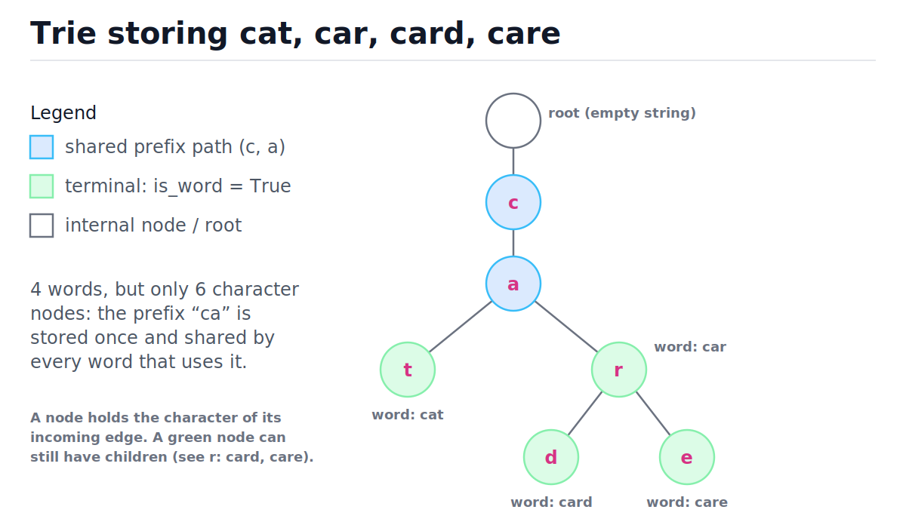
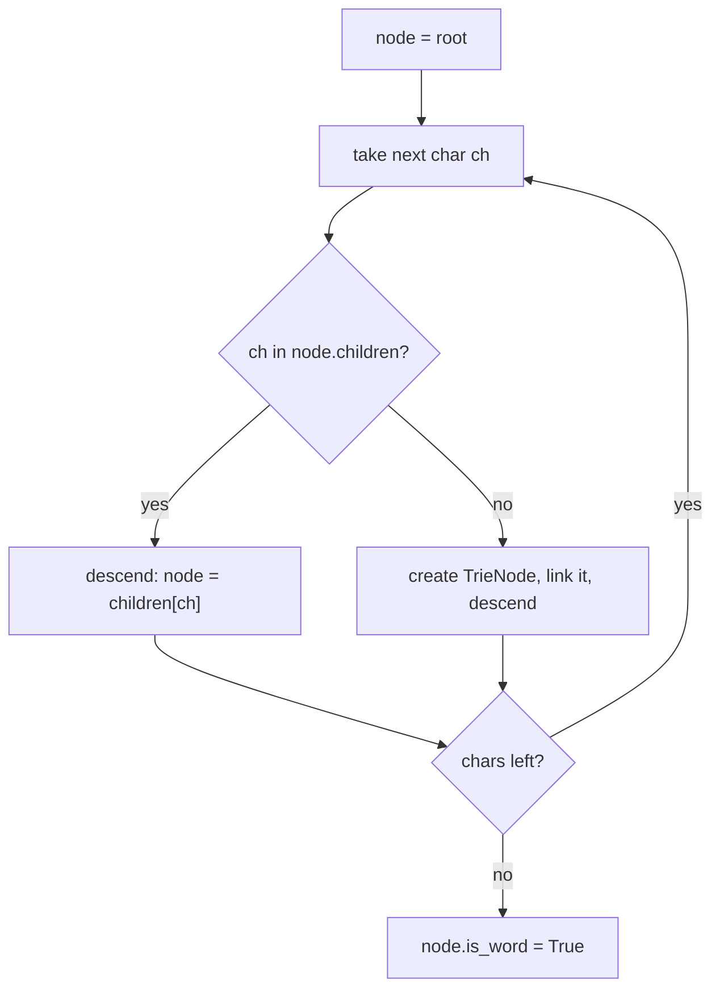
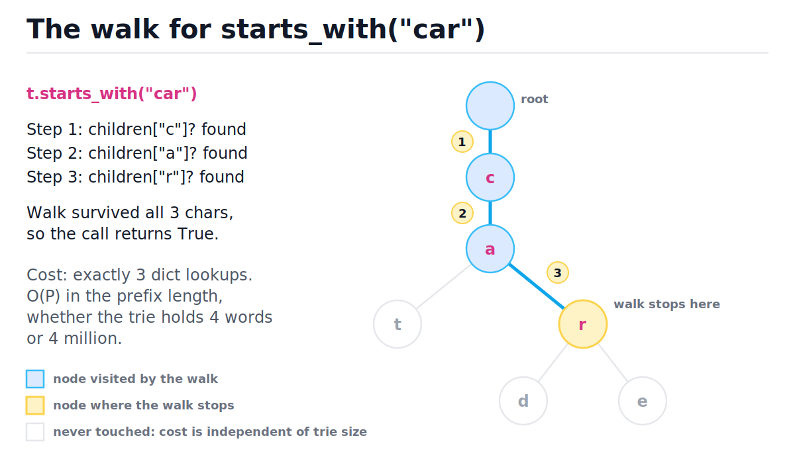
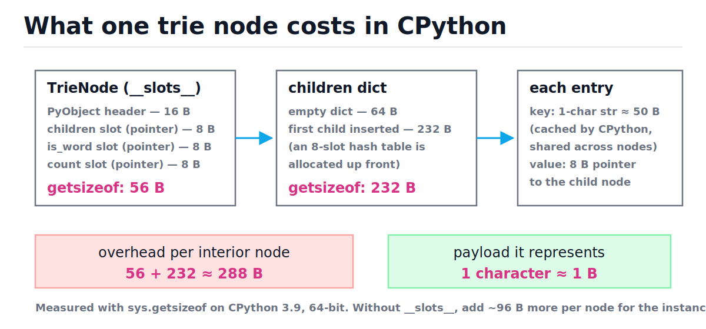

# Tries (Prefix Trees)

[toc]

> **TL;DR:** A trie stores strings character-by-character down a tree, so every operation costs O(L) in the key's length — independent of how many words are stored. It crushes hash tables at prefix work (autocomplete, spell-check, longest-prefix matching) because shared prefixes are stored once and queried by walking. The price is memory: in CPython, one node costs roughly 288 bytes to represent a single character.

## Vocabulary

Every load-bearing term in this note, one at a time. The symbols below are reused in the complexity derivations.

**Trie (prefix tree)**

```math
T_{\text{search}}(L) = O(L), \quad L = |\text{key}|
```

A tree where each edge is labeled with one character and each root-to-node path spells a prefix. Lookup cost depends only on the key's length, never on the number of stored words. The name comes from re**trie**val (Fredkin, 1960).

**Trie node**

```math
\text{node} = (\texttt{children}, \texttt{is\_word}, \texttt{count})
```

One vertex of the trie. `children` maps a character to the child node, `is_word` marks word ends, `count` (optional) tracks how many stored words pass through this node.

**Terminal flag**

```math
\texttt{is\_word} \in \{\text{True}, \text{False}\}
```

Marks that the path from the root to this node spells a complete stored word, not just a prefix of one. Without it, a trie containing "card" would wrongly claim it contains "car".

**Key length and prefix length**

```math
L = |w|, \qquad P = |\text{prefix}|
```

The number of characters in the word being inserted/searched (L) or in the queried prefix (P). These — not the word count n — drive every trie bound.

**Alphabet and branching factor**

```math
\sigma = |\Sigma|
```

The set of characters keys can contain. Each node has at most σ children: 26 for lowercase English, 256 for bytes, effectively unbounded for Unicode (which is why dict children beat fixed arrays in Python).

**Subtree word count**

```math
\texttt{count}(v) = \#\{\, w \in S : v \text{ lies on the path of } w \,\}
```

An integer stored on each node: how many stored words pass through it. Maintained incrementally on insert/delete, it answers "how many words start with this prefix?" in O(P).

**Longest-prefix match**

```math
\operatorname{LPM}(x) = \arg\max_{\,p \in P,\; p \text{ a prefix of } x} |p|
```

Given a query string x and a set of stored prefixes P, find the longest stored prefix of x. This is the core lookup of IP routing tables — see [Network Layer: IP](../Computer-Networking/4-network-layer-ip.md).

**Radix tree (Patricia trie)**

```math
\#\text{nodes} \le 2n - 1 \quad (n \text{ keys})
```

A compressed trie: every chain of single-child nodes collapses into one edge labeled with a whole substring. Node count drops from "total characters stored" to at most 2n − 1.

## Intuition

Think of a paper phone book. To find every "Tan…" you flip to the T section, then Ta, then Tan — each letter narrows the page range, and you never look at names starting with other letters. A trie is that index made literal: the root fans out by first character, each child fans out by second character, and so on. Words that share a prefix share the front of their path, so "cat", "car", "card", and "care" store the letters "ca" exactly once.

Look at the figure below: blue nodes are the shared prefix, green nodes carry the terminal flag. Four words need only six character nodes because the structure itself deduplicates prefixes.



> [!NOTE]
> "Trie" was coined by Edward Fredkin from "retrieval" and he pronounced it "tree"; almost everyone now says "try" to keep it distinct from a generic tree in conversation.

A [hash set](./05-hash-tables.md) answers "is this exact word stored?" in O(L) average too — hashing must read all L characters. What it cannot do is answer prefix questions without scanning everything it holds:

```python
words = {"cat", "car", "card", "care", "dog"}

# Hash sets have no notion of prefix: this scan touches all n words, O(n*L).
matches = sorted(w for w in words if w.startswith("car"))
assert matches == ["car", "card", "care"]
```

A trie answers the same question by walking three edges, then reading only the matching subtree. That asymmetry — O(n·L) scan versus O(P + answer size) walk — is the entire reason tries exist.

## How it works

Every trie operation is the same loop wearing different hats: start at the root, consume the key one character at a time, follow `children[ch]`. Insert creates missing children; search and starts_with bail out when a child is missing; delete walks the same path and then prunes. Master the walk and you have mastered the structure.

### The node

A node needs a mapping from character to child, a terminal flag, and (for prefix counting) a pass-through counter. In Python a dict is the right child container: it handles any alphabet, including full Unicode, and stays sparse — no 26-pointer array wasted on absent letters. `__slots__` cuts per-node memory by roughly 100 bytes (measured in the memory section below).

```python
class TrieNode:
    __slots__ = ("children", "is_word", "count")

    def __init__(self) -> None:
        self.children: dict[str, "TrieNode"] = {}
        self.is_word: bool = False
        self.count: int = 0   # how many stored words pass through this node
```

### insert, search, starts_with

Insert walks the word, creating any missing child as it goes, then sets the terminal flag on the final node — O(L) with at most L new nodes. Search performs the identical walk read-only and demands `is_word` at the end. `starts_with` is search minus the flag check: surviving the walk is enough. All three share the private `_walk` helper.



```python
from typing import Optional


class Trie:
    def __init__(self) -> None:
        self.root = TrieNode()

    def insert(self, word: str) -> None:
        """O(L). Idempotent: re-inserting an existing word changes nothing."""
        if self.search(word):
            return
        node = self.root
        node.count += 1                      # root counts every stored word
        for ch in word:
            if ch not in node.children:
                node.children[ch] = TrieNode()
            node = node.children[ch]
            node.count += 1
        node.is_word = True

    def _walk(self, prefix: str) -> Optional["TrieNode"]:
        """Follow prefix character by character; None if the path breaks. O(P)."""
        node = self.root
        for ch in prefix:
            nxt = node.children.get(ch)
            if nxt is None:
                return None
            node = nxt
        return node

    def search(self, word: str) -> bool:
        """Exact membership. O(L)."""
        node = self._walk(word)
        return node is not None and node.is_word

    def starts_with(self, prefix: str) -> bool:
        """Does any stored word begin with prefix? O(P)."""
        return self._walk(prefix) is not None

    def count_prefix(self, prefix: str) -> int:
        """How many stored words begin with prefix? O(P)."""
        node = self._walk(prefix)
        return 0 if node is None else node.count


t = Trie()
for w in ("cat", "car", "card", "care"):
    t.insert(w)

assert t.search("car") is True
assert t.search("ca") is False          # path exists but no terminal flag
assert t.search("cab") is False         # walk dies at 'b'
assert t.starts_with("ca") is True
assert t.starts_with("care") is True    # a whole word is also a prefix
assert t.starts_with("cb") is False
t.insert("car")                          # duplicate insert is a no-op
assert t.count_prefix("car") == 3        # car, card, care
assert t.count_prefix("") == 4           # every word starts with ""
```

> [!IMPORTANT]
> The terminal flag is load-bearing. The walk for "ca" succeeds in the trie above, but "ca" was never inserted — only `is_word` distinguishes "stored word" from "prefix of a stored word". Forgetting it is the single most common trie bug.

Here is `insert("card")` against a trie that already holds "cat" and "car". Note that steps 1–3 reuse existing nodes and only step 4 allocates:

| Step | char | at node | char in children? | Decision | count after |
| :---: | :---: | :---: | :---: | :--- | :--- |
| 1 | c | root | yes | descend to c | c: 2 → 3 |
| 2 | a | c | yes | descend to a | a: 2 → 3 |
| 3 | r | a | yes | descend to r | r: 1 → 2 |
| 4 | d | r | no | create node d, descend | d: 0 → 1 |
| 5 | — | d | — | set `is_word = True` | — |

The read-only walk is even simpler. The figure traces `starts_with("car")`: three dict lookups, three nodes touched, everything else ignored — which is why the cost cannot depend on trie size.



### Counting words under a prefix

Without counts, answering "how many words start with car?" means walking to the `r` node and then traversing its whole subtree — O(P + subtree). By incrementing `count` on every node along the insert path (and decrementing on delete), the subtree size is precomputed at every node, so the answer is just the walk: O(P). This is the classic space-for-time trade, paid one integer per node.

```python
assert t.count_prefix("ca") == 4    # cat, car, card, care
assert t.count_prefix("card") == 1
assert t.count_prefix("dog") == 0   # walk fails -> 0, no exception
```

> [!TIP]
> Per-node counters generalize: store "times this exact word was inserted" at terminals for multiset semantics, or aggregate values for problems like LeetCode 677 (Map Sum Pairs). Anything summable over a subtree can be cached on the path in O(L) per update.

### delete, with pruning

Lazy deletion — just flipping `is_word = False` — is correct but leaks: the nodes for a long dead word linger forever. Proper deletion walks the path decrementing counts, clears the flag, then prunes from the leaf upward any node whose `count` hit zero, stopping at the first node still in use. Shown standalone for readability; in production code make it a method.

```python
def trie_delete(trie: Trie, word: str) -> bool:
    """Remove word and prune now-useless nodes. O(L). True if removed."""
    if not trie.search(word):
        return False
    node = trie.root
    node.count -= 1
    path: list = []                       # (parent, ch), root-to-leaf order
    for ch in word:
        path.append((node, ch))
        node = node.children[ch]
        node.count -= 1
    node.is_word = False
    for parent, ch in reversed(path):     # prune leaf-upward
        child = parent.children[ch]
        if child.count == 0:              # no stored word uses this node now
            del parent.children[ch]
        else:
            break                         # ancestors are still in use
    return True


assert trie_delete(t, "card") is True
assert t.search("card") is False
assert t.search("car") is True           # shared prefix unharmed
assert t.count_prefix("car") == 2        # car, care remain
node_r = t._walk("car")
assert node_r is not None and "d" not in node_r.children   # d-node pruned
assert trie_delete(t, "dog") is False    # absent word: report, don't crash
```

> [!WARNING]
> Prune using `count == 0` (or equivalently "no children and not a word"), never unconditionally. Deleting "car" from the trie above must not touch the `r` node — "card" and "care" still run through it. Over-pruning silently destroys sibling words.

### Autocomplete: enumerating words under a prefix

Autocomplete is the walk plus a bounded depth-first traversal: descend to the prefix node in O(P), then [DFS](./09-graphs-bfs-and-dfs.md) its subtree, emitting a word at every terminal flag. Iterating children in sorted order makes results come out lexicographically for free — something no hash table can offer. The `limit` cap keeps worst-case latency bounded when a short prefix matches a huge subtree.

```python
def words_with_prefix(trie: Trie, prefix: str, limit: int = 10) -> list:
    """First `limit` words starting with prefix, lexicographic. O(P + S)."""
    start = trie._walk(prefix)
    if start is None:
        return []
    out: list = []

    def dfs(node: TrieNode, suffix: list) -> None:
        if len(out) >= limit:
            return
        if node.is_word:
            out.append(prefix + "".join(suffix))
        for ch in sorted(node.children):   # sorted -> lexicographic output
            suffix.append(ch)
            dfs(node.children[ch], suffix)
            suffix.pop()

    dfs(start, [])
    return out


t2 = Trie()
for w in ("cat", "car", "card", "care", "dog"):
    t2.insert(w)

assert words_with_prefix(t2, "car") == ["car", "card", "care"]
assert words_with_prefix(t2, "ca") == ["car", "card", "care", "cat"]
assert words_with_prefix(t2, "ca", limit=2) == ["car", "card"]
assert words_with_prefix(t2, "x") == []
```

## Complexity

The headline: every per-key operation is linear in the key, constant in the corpus. S below is the size of the matched subtree (number of nodes under the prefix), and σ the alphabet size. Notation refresher: [Big-O Notation and Complexity Analysis](./01-big-o-notation-and-complexity-analysis.md).

| Operation | Best | Average | Worst | Extra space |
| :--- | :---: | :---: | :---: | :--- |
| `insert(word)` | O(L) | O(L) | O(L·σ)¹ | O(L) new nodes |
| `search(word)` | O(1)² | O(L) | O(L·σ)¹ | O(1) |
| `starts_with(prefix)` | O(1)² | O(P) | O(P·σ)¹ | O(1) |
| `count_prefix(prefix)` | O(1)² | O(P) | O(P·σ)¹ | O(1) |
| `trie_delete(word)` | O(L) | O(L) | O(L·σ)¹ | O(1) |
| `words_with_prefix(prefix)` | O(P) | O(P + S) | O(P + S) | O(S) output + O(L) stack |
| build from n words | — | O(Σᵢ Lᵢ) | — | O(Σᵢ Lᵢ) nodes worst case |
| hash set: exact lookup | O(1) | O(L) | O(n·L) | — |
| hash set: prefix query | — | O(n·L) | O(n·L) | — |

¹ A CPython dict probe is O(1) average; pathological collisions are bounded by the node's child count, at most σ. ² Early exit when the first character is already missing.

The search bound is just L average-constant dict probes in sequence, and nothing in the loop ever reads n:

```math
T_{\text{search}}(L) \;=\; \underbrace{O(1) + O(1) + \cdots + O(1)}_{L \text{ dict lookups}} \;=\; O(L)
```

Space is bounded by total characters inserted — each character of each word creates at most one node, plus the root:

```math
\#\text{nodes} \;\le\; 1 + \sum_{i=1}^{n} L_i \;=\; O(n \cdot L_{\max}), \qquad \text{bytes} \;=\; \#\text{nodes} \times \text{bytes per node}
```

Why independence from n matters: a balanced BST ([BSTs and balanced trees](./07-binary-search-trees-and-balanced-trees.md)) does string lookup in O(L · log n) — log n comparisons, each up to L characters. A hash table does O(L) average but gives up ordering and prefixes. The trie does O(L) flat *and* keeps prefix structure *and* enumerates in sorted order. The catch is the constant factor hiding in "bytes per node" — next section.

## Memory model in Python

Here is the low-level truth that the Big-O table hides. A CPython trie node is not "a character"; it is a full heap object holding a dict. Measured on CPython 3.9, 64-bit (see [Memory Model and PyObject Layout](../Programming-Languages/Python/13-memory-model-and-pyobject-layout.md) for why these numbers look the way they do):

```python
import sys


class PlainNode:
    def __init__(self) -> None:
        self.children: dict = {}
        self.is_word: bool = False
        self.count: int = 0


class SlotNode:
    __slots__ = ("children", "is_word", "count")

    def __init__(self) -> None:
        self.children: dict = {}
        self.is_word: bool = False
        self.count: int = 0


plain, slot = PlainNode(), SlotNode()
plain_cost = sys.getsizeof(plain) + sys.getsizeof(plain.__dict__)
slot_cost = sys.getsizeof(slot)
# CPython 3.9, 64-bit: plain_cost == 152, slot_cost == 56
assert slot_cost < plain_cost

empty, one_child = {}, {"a": None}
# 64 B empty; jumps to 232 B once the first child is inserted
assert sys.getsizeof(empty) < sys.getsizeof(one_child)
print(plain_cost, slot_cost, sys.getsizeof(empty), sys.getsizeof(one_child))
```

Adding it up per interior node: 56 B for the `__slots__` instance plus 232 B for a children dict with at least one entry ≈ 288 B — to represent one character whose information content is about one byte. Leaves are cheaper (56 + 64 = 120 B with an empty dict). Single-character ASCII strings are cached by CPython, so the dict *keys* are shared across all nodes rather than duplicated.



> [!WARNING]
> Scale check: 100k words averaging 8 characters create up to ~800k nodes ≈ 230 MB as a dict-of-dicts trie, versus low single-digit MB for the same words in a Python set. A trie in pure Python is a one-to-two-orders-of-magnitude memory premium — budget for it or compress.

Cache behavior compounds the problem. Each step of the walk is a dependent pointer chase into a node allocated who-knows-where on the heap, so a 10-character lookup can be 10 cache misses. A hash table reads the key once (contiguous, prefetch-friendly) and then probes one bucket. Tries lose the constant-factor fight even when the Big-O ties.

### Compressed tries: radix trees in one paragraph

The fix for both memory and pointer-chasing is path compression. A radix tree (Patricia trie; Morrison, 1968) collapses every chain of single-child nodes into one edge labeled with the whole substring, so storing "ridiculously" alone costs one edge, not 12 nodes; with n keys the tree has at most 2n − 1 nodes. Comparisons become substring matches instead of single-character hops, but the asymptotics stay O(L) and the constant factors improve dramatically. This is the production form of the trie: IP routers do longest-prefix match on binary Patricia tries over address bits, HTTP router libraries (e.g., Go's httprouter) dispatch URLs through radix trees, and in-memory stores use them for ordered key iteration.

> [!TIP]
> If you need a trie-shaped structure over a big corpus in Python, don't hand-roll dict-of-dicts: use a C-backed library (`marisa-trie`, `datrie`) or restructure the problem around a sorted list plus binary search over prefixes (`bisect`), which is often within striking distance for static data.

## Real-world example

Search-as-you-type over a product catalog. Every keystroke triggers a prefix query; the backend must return ranked suggestions in a few milliseconds, so an O(n·L) scan per keystroke is off the table. Build the trie once at startup, then each keystroke costs one O(P) walk plus a bounded DFS — and a `count_prefix` call tells the UI how many total matches exist ("showing 4 of 7").

```python
catalog = [
    "macbook air", "macbook pro", "mac mini", "mac studio",
    "magic mouse", "magic keyboard", "mango slicer",
]
index = Trie()
for name in catalog:
    index.insert(name)

# keystroke: "mac" -> one O(P) walk + DFS capped at 4 suggestions
assert words_with_prefix(index, "mac", limit=4) == [
    "mac mini", "mac studio", "macbook air", "macbook pro",
]
# keystroke: "magic" -> badge says "2 results" without enumerating them
assert index.count_prefix("magic") == 2
# "mango" is a prefix of a product but not itself a product
assert index.starts_with("mango") and not index.search("mango")
# product discontinued -> remove it; shared prefixes survive
assert trie_delete(index, "mango slicer") is True
assert index.count_prefix("ma") == 6
```

Note the lexicographic order falling out for free ("mac mini" sorts before "macbook" because space < "b") — a real autocomplete would layer popularity scores on top, typically by storing a hit count at each terminal and keeping a small top-k cache at hot prefix nodes.

## When to use / When NOT to use

Reach for a trie when the *prefix* is the unit of work, not the whole key. Skip it when you only ever do exact lookups — the hash table is simpler, faster in practice, and lighter.

**Use a trie when:**

- Autocomplete / typeahead — enumerate or count completions of what the user typed so far.
- Spell-check and word games (Boggle, Word Search II) — prune a [backtracking](./21-backtracking.md) search the instant a path stops being a valid prefix.
- Longest-prefix matching — IP route lookup, URL routing, dictionary-based tokenization.
- Sorted enumeration of string keys with cheap insertion — in-order DFS yields lexicographic order.
- Counting keys by prefix in O(P) via per-node counters.

**Avoid a trie when:**

- You only need exact membership or key→value lookup — use a [hash table](./05-hash-tables.md): same O(L) average, far less memory, better cache behavior.
- Memory is tight and the corpus is large — pure-Python tries cost ~288 B per character node.
- Keys aren't strings or string-like sequences — a trie needs a meaningful character decomposition.
- The data is static and read-mostly — a sorted array + binary search over prefixes is compact and competitive.

## Common mistakes

- **"Trie search is O(log n)"** — it's O(L), the key length. The number of stored words never appears in the walk; that independence is the whole selling point.
- **Forgetting the terminal flag** — `search("ca")` must return False when only "cat"/"card" are stored. Surviving the walk proves prefix-hood, not membership; check `is_word`.
- **Returning `search()` from `starts_with()`** — starts_with must NOT check `is_word`; it only asks whether the walk survives. Mixing the two breaks autocomplete on partial words.
- **Deleting by only clearing `is_word`** — correct answers, leaked memory: dead branches accumulate forever in a long-lived process. Prune nodes whose pass-through count hits zero, leaf-upward, stopping at the first live ancestor.
- **Assuming tries always beat hash tables** — they win only when prefixes matter. For exact lookup the hash table matches the O(L) average with ~10–100× less memory and fewer cache misses.
- **Using a fixed 26-slot array for children in Python** — breaks on uppercase, digits, hyphens, Unicode; and in CPython a 26-pointer list costs more than a one-entry dict for sparse nodes. Arrays-as-children is a C/Java optimization, not a Python one.
- **Letting `count` drift on duplicate inserts** — if insert blindly increments counts, inserting "car" twice makes `count_prefix("car")` over-report. Either guard with a search (as here) or define multiset semantics explicitly.

## Interview questions and answers

A trie question is rarely about the trie itself — it's about whether you see the O(L)-versus-n distinction and can wire the terminal flag and the DFS correctly. Practice saying these out loud.

**1. Why is trie search O(L) and not O(log n) like a balanced BST?**
**Answer:** The walk does one child lookup per character of the query — L steps — and never inspects, compares against, or even counts the other stored words. A BST does log n comparisons where each comparison may scan up to L characters, so it's O(L log n). The trie's cost is structurally tied to the key, not the collection.

**2. When does a trie beat a hash table, and when does it lose?**
**Answer:** It wins whenever the question involves prefixes: autocomplete, "how many words start with p", longest-prefix match, lexicographic enumeration — a hash destroys prefix structure, forcing an O(n·L) scan. It loses on plain exact lookup: both are O(L) average, but the hash table uses a fraction of the memory and has better cache locality, so it's the default unless prefixes are in the requirements.

**3. How do you implement delete correctly?**
**Answer:** Verify the word exists, walk the path decrementing per-node counts, clear `is_word` at the end, then prune leaf-upward every node whose count reached zero, stopping at the first node still used by another word. The stop condition is the crux — deleting "car" must leave the r-node alive because "card" and "care" still pass through it.

**4. How does autocomplete work and what does it cost?**
**Answer:** Walk to the prefix node in O(P); if the walk dies, return empty. Otherwise DFS the subtree, appending the accumulated suffix at every terminal flag, iterating children in sorted order for lexicographic output, and cutting off at a result limit k. Total O(P + S) where S is the subtree visited — with the limit, effectively O(P + k·L_max).

**5. Count the words starting with a given prefix — without traversing the subtree.**
**Answer:** Store an integer on every node counting how many words pass through it: increment along the path on insert, decrement on delete. Then the query is just the walk plus a field read — O(P). It's a precomputation trade: one int per node buys subtree-sized savings per query.

**6. What's a radix (Patricia) trie and why do production systems prefer it?**
**Answer:** A trie with every single-child chain collapsed into one edge labeled by a substring, capping nodes at 2n − 1 for n keys. Same O(L) asymptotics, but far fewer allocations and pointer dereferences, so less memory and fewer cache misses. It's what IP routing tables and URL routers actually deploy.

**7. dict children versus a fixed-size array of children — tradeoffs?**
**Answer:** An array indexed by character gives deterministic O(1) child access and is compact in C when the alphabet is small and dense — classic for lowercase a–z. A dict handles arbitrary alphabets and sparse fan-out without wasting σ pointers per node. In Python, dict is almost always right; the array trick pays off in C/C++/Java with small alphabets.

**8. How do IP routers relate to tries?**
**Answer:** Forwarding is longest-prefix match: among stored routes like 10.0.0.0/8 and 10.1.0.0/16, pick the longest one matching the destination address. Store routes in a binary trie over address bits, walk the destination's bits remembering the last node that held a route — that's the answer in at most 32 (or 128) steps. Real routers compress with Patricia/multibit tries to cut memory and lookups.

## Practice path

1. Implement `TrieNode` + `insert` / `search` / `starts_with` from memory; verify with the asserts in this note. (LeetCode 208 — Implement Trie.)
2. Add `count_prefix` with per-node counters; make duplicate inserts a no-op and assert counts stay exact.
3. Implement `delete` with leaf-upward pruning; assert the pruned child is gone via `_walk` and that siblings survive.
4. Implement `words_with_prefix` with a limit; check lexicographic order. (LeetCode 1268 — Search Suggestions System.)
5. LeetCode 211 — Design Add and Search Words: a `.` wildcard forces branching DFS across all children.
6. LeetCode 648 — Replace Words, and 677 — Map Sum Pairs: shortest-prefix walk and value aggregation at nodes.
7. LeetCode 212 — Word Search II: trie-pruned [backtracking](./21-backtracking.md) over a grid; prune by `starts_with` failure.
8. Read Sedgewick §5.2; implement an R-way array trie and a ternary search trie, then compare node counts and memory with `sys.getsizeof` against the dict version.

## Copyable takeaways

- A trie is one node per character edge; root-to-node paths spell prefixes; an `is_word` flag marks word ends.
- insert / search / starts_with are all the same walk: O(L) in key length, independent of word count n.
- The terminal flag distinguishes "stored word" from "prefix of one" — forgetting it is the classic bug.
- Per-node pass-through counters answer count-by-prefix in O(P) and tell delete exactly what to prune (count == 0).
- Autocomplete = O(P) walk + sorted-children DFS with a result limit: O(P + S), lexicographic for free.
- Tries beat hash tables only when prefixes matter; hash wins exact lookup on memory and cache locality.
- CPython reality: ~288 B per interior node (56 B `__slots__` instance + 232 B one-entry dict) to store 1 byte of payload.
- Production uses radix/Patricia trees: collapse single-child chains, ≤ 2n − 1 nodes, same O(L), far better constants.

## Sources

- Fredkin, E. — "Trie Memory", *Communications of the ACM* 3(9), 1960. The original paper and the source of the name.
- Morrison, D. — "PATRICIA: Practical Algorithm To Retrieve Information Coded in Alphanumeric", *JACM* 15(4), 1968. The radix/Patricia trie.
- Sedgewick, R. & Wayne, K. — *Algorithms*, 4th ed., §5.2 "Tries": https://algs4.cs.princeton.edu/52trie/
- Knuth, D. — *TAOCP* Vol. 3, §6.3 "Digital Searching".
- CPython `sys.getsizeof` documentation: https://docs.python.org/3/library/sys.html#sys.getsizeof
- CPython operation costs: https://wiki.python.org/moin/TimeComplexity

## Related

- [Hash Tables](./05-hash-tables.md) — the exact-lookup rival; same O(L) average, no prefix structure.
- [Trees and Binary Trees](./06-trees-and-binary-trees.md) — tree traversal fundamentals the trie DFS builds on.
- [Graphs, BFS and DFS](./09-graphs-bfs-and-dfs.md) — the DFS pattern behind autocomplete enumeration.
- [Backtracking](./21-backtracking.md) — trie-pruned search (Word Search II) is the marquee combo.
- [Network Layer: IP](../Computer-Networking/4-network-layer-ip.md) — longest-prefix match, the trie's production home.
- [Memory Model and PyObject Layout](../Programming-Languages/Python/13-memory-model-and-pyobject-layout.md) — why a node costs 288 bytes.
