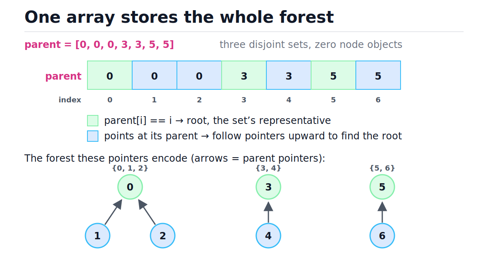
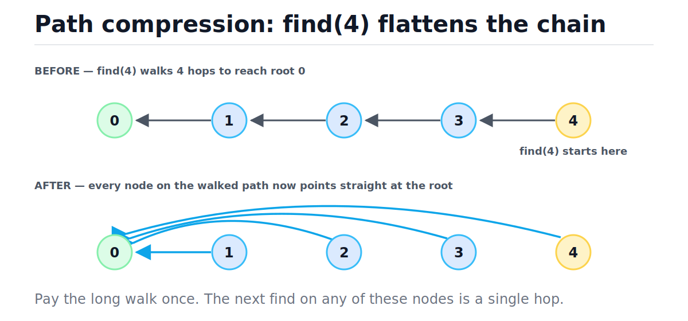
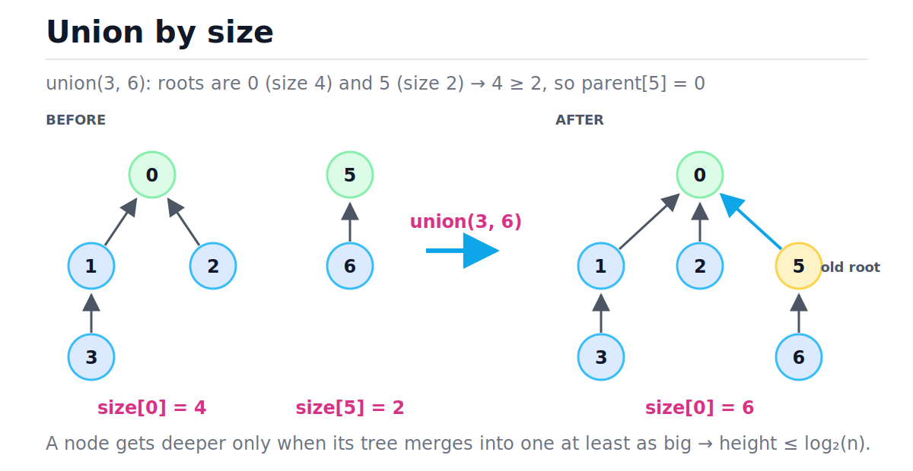
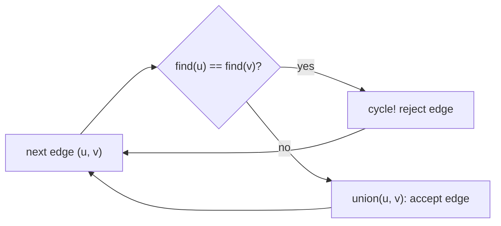

# Union-Find (Disjoint Sets)

[toc]

> **TL;DR:** Union-Find tracks which elements belong to the same group while groups merge over time — "dynamic connectivity". It is just an integer array of parent pointers forming a forest, and with two one-line optimizations (path compression + union by size) every operation runs in amortized inverse-Ackermann time α(n), which is ≤ 4 for any input that fits in the universe. It is the engine behind cycle detection, Kruskal's MST, and every "merge these groups" problem.

## Vocabulary

Each term below is load-bearing for the rest of the note. The symbol block gives the canonical notation; the paragraph gives the working definition.

**Disjoint sets**

```math
S_i \cap S_j = \varnothing \quad (i \ne j), \qquad \bigcup_i S_i = \{0, 1, \dots, n-1\}
```

A partition of n elements into non-overlapping groups. Every element belongs to exactly one set. Union-Find maintains this partition as sets merge.

**Representative (root)**

```math
\text{find}(x) = \text{find}(y) \iff x, y \text{ are in the same set}
```

One distinguished element per set that names the whole set. Two elements are connected exactly when their representatives are the same element.

**Parent array**

```math
\text{parent}[i] = i \iff i \text{ is a root}
```

The entire data structure: one integer per element, pointing at that element's parent in a tree. A self-loop marks a root. No node objects, no child lists.

**find(x)**

```math
\text{find}(x) = \text{root of the tree containing } x
```

Follow parent pointers from x until reaching a self-loop. Cost equals the depth of x, which is why tree shape is everything.

**union(a, b)**

```math
\text{union}(a, b): \; \text{parent}[\text{find}(b)] \leftarrow \text{find}(a)
```

Merge the two sets containing a and b by pointing one root at the other. After the roots are found, the merge itself is O(1).

**Path compression**

```math
\text{parent}[v] \leftarrow \text{find}(x) \quad \text{for every } v \text{ on the path } x \to \text{root}
```

During find, rewire every visited node to point directly at the root. Future finds on those nodes cost one hop.

**Union by size**

```math
\text{size}[r_{\text{big}}] \ge \text{size}[r_{\text{small}}] \;\Rightarrow\; \text{parent}[r_{\text{small}}] \leftarrow r_{\text{big}}
```

Always attach the smaller tree's root under the bigger tree's root. This caps tree height at log₂(n). "Union by rank" (attach by approximate height) gives the same bound.

**Inverse Ackermann function**

```math
\alpha(n) = \min\{\, k : A_k(1) \ge n \,\}
```

The slowest-growing function that appears in mainstream algorithm analysis. α(n) ≤ 4 for every physically representable n, so "amortized α(n)" reads as "effectively constant".

**Amortized cost**

```math
\text{amortized} = \frac{T(m \text{ operations})}{m}
```

Average cost per operation over a whole sequence. A single find may still be slow; the total over m operations is what's bounded.

## Intuition

Think of n people, each wearing a badge that names one other person — "ask them, not me". Chains of badges end at someone pointing at themselves: the group's spokesperson. Asking "are Alice and Bob in the same group?" means following both badge chains and comparing spokespeople. Merging two groups means one spokesperson updates their badge to point at the other. The whole structure is one integer array; the trees are implicit in the pointers. Look at the figure: three green self-loop cells in the array correspond exactly to the three tree roots below.



> [!IMPORTANT]
> Two invariants carry the entire structure: `parent[i] == i` if and only if i is a root, and `size[r]` is meaningful **only when r is a root**. Reading `size[]` at a non-root returns a stale number from before that node was demoted.

## How it works

Union-Find has exactly two operations, and both are short. The whole topic is really about tree shape: naive code produces tall skinny trees and O(n) finds; the two optimizations produce nearly flat trees and effectively O(1) finds.

### The parent array

Initialization creates n singleton sets: every element is its own root. This is `list(range(n))`, plus a parallel `size` array of ones and an optional live component counter. Build cost is O(n) time and O(n) space, and that is the only allocation the structure ever needs.

```python
parent = list(range(7))      # [0, 1, 2, 3, 4, 5, 6] — seven singleton sets
size = [1] * 7               # size is tracked at roots only
assert all(parent[i] == i for i in range(7))   # everyone is a root
```

### Naive find and the degenerate chain

The naive find walks parent pointers to the root, doing no other work. Its cost is the depth of the starting node. If unions happen to always attach the bigger tree under the smaller one — or attach in arrival order — the forest degenerates into a linked-list-shaped chain, and a single find costs O(n). That makes m operations O(m·n): unusable at scale.

```python
def find_naive(parent: list[int], x: int) -> int:
    while parent[x] != x:
        x = parent[x]            # one hop per loop: O(depth of x)
    return x

# Degenerate chain: 0 <- 1 <- 2 <- ... <- 9999
chain = [max(i - 1, 0) for i in range(10_000)]
assert find_naive(chain, 9_999) == 0    # 9,999 hops for ONE find: O(n)
```

### Path compression

Fix the chain problem at read time: once find has located the root, walk the path a second time and point every visited node directly at the root. The first find on a deep node is expensive; it flattens the path so every later find on those nodes is one hop. In the figure, find(4) pays four hops once, then nodes 1–4 all point straight at root 0.



```python
def find_compress(parent: list[int], x: int) -> int:
    root = x
    while parent[root] != root:      # pass 1: locate the root
        root = parent[root]
    while parent[x] != root:         # pass 2: rewire the path to the root
        parent[x], x = root, parent[x]
    return root

chain = [max(i - 1, 0) for i in range(8)]    # 0 <- 1 <- ... <- 7
assert find_compress(chain, 7) == 0
assert chain == [0] * 8    # every node on the walked path now points at 0
```

> [!WARNING]
> The recursive one-liner `parent[x] = find(parent[x])` is elegant but blows CPython's default recursion limit (~1000 frames) on a long pre-compression chain — a 10⁶-element chain raises `RecursionError` in production. Always write find iteratively, as the two-pass loop above.

### Union by size

Fix tree shape at write time too: when merging two roots, attach the smaller tree under the bigger one. A node's depth only increases when its tree loses — merges into a tree at least as large — so its set's size at least doubles each time it gets deeper. Doubling from 1 can happen at most log₂(n) times, so no tree is ever taller than log₂(n) even without compression.



```math
\text{depth}(v) \le \log_2 n \quad \text{because each depth increase doubles } |S_v|
```

> [!NOTE]
> "Union by rank" stores an approximate height instead of size and gives the identical asymptotic bound. Size is the common choice in practice because the size numbers are independently useful ("how big is this group?") and stay exact, while ranks stop being true heights once path compression starts shortening paths.

### The full implementation

This is the version to memorize: iterative two-pass find with compression, union by size, a live component counter, and union returning whether a merge actually happened. That boolean return is the hook every application below builds on.

```python
class DSU:
    """Disjoint Set Union with path compression + union by size."""

    def __init__(self, n: int) -> None:
        self.parent: list[int] = list(range(n))  # parent[i] == i  =>  root
        self.size: list[int] = [1] * n           # valid at roots only
        self.components: int = n

    def find(self, x: int) -> int:
        root = x
        while self.parent[root] != root:         # pass 1: walk to the root
            root = self.parent[root]
        while self.parent[x] != root:            # pass 2: compress the path
            self.parent[x], x = root, self.parent[x]
        return root

    def union(self, a: int, b: int) -> bool:
        ra, rb = self.find(a), self.find(b)
        if ra == rb:
            return False                         # same set: edge closes a cycle
        if self.size[ra] < self.size[rb]:
            ra, rb = rb, ra                      # ra is now the bigger root
        self.parent[rb] = ra
        self.size[ra] += self.size[rb]
        self.components -= 1
        return True

    def connected(self, a: int, b: int) -> bool:
        return self.find(a) == self.find(b)


dsu = DSU(7)
assert dsu.union(0, 1) and dsu.union(1, 2)
assert dsu.union(3, 4) and dsu.union(5, 6) and dsu.union(4, 6)
assert dsu.connected(0, 2) and dsu.connected(3, 6)
assert not dsu.connected(2, 3)
assert dsu.union(2, 6)        # merges {0,1,2} with {3,4,5,6}
assert not dsu.union(0, 5)    # already connected -> False (a cycle edge)
assert dsu.components == 1
assert dsu.size[dsu.find(0)] == 7
```

> [!CAUTION]
> Never test connectivity with `parent[a] == parent[b]`. Two connected nodes can have different parents at intermediate depths; only the roots agree. Connectivity is `find(a) == find(b)`, full stop.

### Trace: seven unions build a forest

This trace runs the exact assert sequence above on DSU(7), showing the parent array after each call. Watch step 6: find(6) compresses 6's path (parent[6] jumps from 5 to 3) *and* union by size attaches the size-3 root 0 under the size-4 root 3. Step 7 returns False — the cycle signal.

| Step | Call | Roots found (sizes) | parent after | Decision |
| :---: | :--- | :--- | :--- | :--- |
| 0 | `DSU(7)` | — | `[0,1,2,3,4,5,6]` | 7 singleton roots |
| 1 | `union(0,1)` | 0 (1), 1 (1) | `[0,0,2,3,4,5,6]` | equal sizes → attach 1 under 0 |
| 2 | `union(1,2)` | 0 (2), 2 (1) | `[0,0,0,3,4,5,6]` | 2 ≥ 1 → attach 2 under 0 |
| 3 | `union(3,4)` | 3 (1), 4 (1) | `[0,0,0,3,3,5,6]` | attach 4 under 3 |
| 4 | `union(5,6)` | 5 (1), 6 (1) | `[0,0,0,3,3,5,5]` | attach 6 under 5 |
| 5 | `union(4,6)` | 3 (2), 5 (2) | `[0,0,0,3,3,3,5]` | equal sizes → attach 5 under 3 |
| 6 | `union(2,6)` | 0 (3), 3 (4) | `[3,0,0,3,3,3,3]` | compress 6→3; 4 > 3 → attach 0 under 3 |
| 7 | `union(0,5)` | 3 (7), 3 (7) | `[3,0,0,3,3,3,3]` | same root → `False`, cycle edge |

## Complexity

Every cost in this note, side by side. The naive column assumes arbitrary-order unions producing chains; "by size only" caps depth at log₂(n); both optimizations together reach the famous inverse-Ackermann bound. Either optimization alone already achieves near-logarithmic amortized cost — it is the combination that reaches α(n).

| Operation | Naive | Union by size only | Both optimizations | Space |
| :--- | :---: | :---: | :---: | :---: |
| `DSU(n)` build | O(n) | O(n) | O(n) | O(n) |
| `find(x)` | O(n) worst | O(log n) worst | O(α(n)) amortized | O(1) extra |
| `union(a, b)` | O(n) worst | O(log n) worst | O(α(n)) amortized | O(1) extra |
| `connected(a, b)` | O(n) worst | O(log n) worst | O(α(n)) amortized | O(1) extra |
| m operations total | O(m·n) | O(m log n) | O(m·α(n)) ≈ O(m) | O(n) |

The key theorem is Tarjan's 1975 amortized bound. The Ackermann hierarchy it references is defined by repeated self-application — each level applies the previous level j+1 times:

```math
A_0(j) = j + 1, \qquad A_k(j) = A_{k-1}^{(j+1)}(j) \quad (k \ge 1)
```

```math
A_1(1) = 3, \quad A_2(1) = 7, \quad A_3(1) = 2047, \quad A_4(1) \ge 2^{2048}
```

```math
T(m \text{ ops on } n \text{ elements}) = O\big(m \, \alpha(n)\big) \qquad \text{[Tarjan 1975]}
```

What is the inverse Ackermann function, in plain words? The Ackermann hierarchy grows by feeding each level into itself: level 1 is doubling-ish, level 2 is exponential, level 3 is towers of exponents, level 4 produces a number with more digits than there are atoms in the observable universe. The inverse asks the opposite question: "to reach n, how many levels do I need?" Because level 4 already overshoots anything storable in physical hardware, α(n) ≤ 4 for every input you will ever see. It is mathematically not constant — it does grow, eventually — but treating it as a constant factor of ~4 is correct engineering. Tarjan also proved the bound is tight for this structure, and Fredman–Saks (1989) showed no pointer-based structure can beat Ω(α(n)) amortized for this problem.

Why does the combination work? Union by size guarantees no path is ever longer than log₂(n), so compression never pays more than log₂(n) for one find. Compression then ensures expensive paths are destroyed the moment they are paid for — the charge for long walks is spread across the operations that created the structure. The potential-function proof (CLRS ch. 21) makes that charging precise.

## Memory model in Python

The textbook says "an array of ints". CPython says: a `list` is a contiguous block of 8-byte pointers, and each element is a reference to a heap-allocated int object (28 bytes for small ints). Ints in −5..256 are interned singletons, so a fresh `DSU(n)` with n ≤ 257 allocates almost nothing beyond the pointer array — but `list(range(10**7))` materializes ~10⁷ int objects on top of an 80 MB pointer array. See [Memory model and PyObject layout](../Programming-Languages/Python/13-memory-model-and-pyobject-layout.md) for the object header details.

Performance reality, in order of impact:

- **find is pointer chasing.** Each hop is a random access into the parent list — a likely cache miss when n exceeds the L2 cache. Flat trees are not just asymptotically better; a compressed find touches 1–2 cache lines instead of a miss per hop.
- **Path compression is a write path.** find mutates the structure. That makes reads non-idempotent at the memory level — relevant if you ever consider sharing a DSU across threads (don't, without a lock).
- **Compact storage:** `array.array('i', range(n))` stores raw 4-byte C ints, an 8–16× footprint reduction versus a list of boxed ints, with identical index semantics. NumPy works too but pays boxing costs on scalar reads.
- **Attribute lookups dominate in hot loops.** Hoisting `parent = self.parent` into a local before a tight loop of finds is a real constant-factor win in CPython — see [Performance and the standard library](../Programming-Languages/Python/10-performance-and-the-standard-library.md).

```python
from array import array

n = 1_000_000
compact_parent = array("i", range(n))     # ~4 MB of raw C ints
boxed_parent = list(range(n))             # ~8 MB pointers + ~28 B per boxed int
assert compact_parent[999_999] == boxed_parent[999_999] == 999_999
assert compact_parent.itemsize == 4
```

## Real-world example

Two production-shaped applications, both runnable. The first is the building block inside Kruskal's MST algorithm; the second is the dedup/merge pattern that shows up in identity resolution, fraud rings, and the classic Accounts Merge interview problem.

### Cycle detection in an undirected graph

Process edges one at a time. If an edge's endpoints already share a root, adding it would close a cycle — that single boolean from `union` is the entire algorithm. Kruskal's MST is exactly this loop run over edges in ascending weight order, keeping the edges where union returns True (see [Minimum Spanning Trees](./17-minimum-spanning-trees.md)). Total cost for E edges: O(E·α(n)).



```python
def has_cycle(n: int, edges: list[tuple[int, int]]) -> bool:
    """True iff the undirected graph contains a cycle. O(E * alpha(n))."""
    dsu = DSU(n)
    return any(not dsu.union(u, v) for u, v in edges)

assert not has_cycle(5, [(0, 1), (1, 2), (3, 4)])    # a forest: no cycle
assert has_cycle(3, [(0, 1), (1, 2), (2, 0)])        # triangle
assert has_cycle(4, [(0, 1), (0, 1)])                # parallel edge is a cycle
```

> [!TIP]
> `union` returning False **is** the cycle detector — no DFS needed when edges only ever get added. This also answers "number of connected components after each edge insert" for free: read `dsu.components`. BFS/DFS (see [Graphs: BFS and DFS](./09-graphs-bfs-and-dfs.md)) recomputes from scratch per query; union-find answers online in α(n).

### Accounts merge (identity resolution)

Each account is a name plus a list of emails. Two accounts belong to the same person if they share any email — and sameness is transitive, which is the tell for union-find. Union account *indices* whenever an email reappears, then group every email under its root account. This is LeetCode 721 and, at larger scale, how identity-resolution pipelines cluster user records.

```python
from collections import defaultdict


def merge_accounts(accounts: list[list[str]]) -> list[list[str]]:
    """accounts[i] = [name, email1, email2, ...] -> merged, emails sorted."""
    dsu = DSU(len(accounts))
    owner_of: dict[str, int] = {}            # email -> first account index seen
    for i, account in enumerate(accounts):
        for email in account[1:]:
            if email in owner_of:
                dsu.union(i, owner_of[email])   # shared email links accounts
            else:
                owner_of[email] = i

    emails_of = defaultdict(list)
    for email, i in owner_of.items():
        emails_of[dsu.find(i)].append(email)

    return [[accounts[root][0]] + sorted(emails)
            for root, emails in emails_of.items()]


accounts = [
    ["John", "jsmith@mail.com", "john00@mail.com"],
    ["John", "johnnybravo@mail.com"],
    ["John", "jsmith@mail.com", "john_newyork@mail.com"],
    ["Mary", "mary@mail.com"],
]
merged = sorted(merge_accounts(accounts))
assert merged == [
    ["John", "john00@mail.com", "john_newyork@mail.com", "jsmith@mail.com"],
    ["John", "johnnybravo@mail.com"],
    ["Mary", "mary@mail.com"],
]
```

Cost: with A accounts and E total emails, building the DSU is O(E·α(A)) plus the hash-map lookups (see [Hash Tables](./05-hash-tables.md)), and the final sort of emails dominates at O(E log E).

## When to use / When NOT to use

Reach for union-find when the problem says "merge groups" or "are these connected, with edges only ever added". Skip it when you need the path itself or when edges disappear.

| Use it | Avoid it |
| :--- | :--- |
| Incremental connectivity: edges added, queries interleaved | Edge **deletions** (needs link-cut / HDT structures, or offline tricks) |
| Cycle detection in **undirected** graphs; Kruskal's MST | **Directed** cycle detection — DSU ignores direction; use DFS colors or [topological sort](./15-topological-sort-and-dags.md) |
| Equivalence classes: accounts merge, equality equations, label merging in image segmentation | You need the actual **path** between nodes → BFS/DFS |
| Online component counts / component sizes | Enumerating a set's members fast (needs extra bookkeeping per root) |
| Percolation / grid connectivity | One-shot static connectivity — a single O(V+E) BFS is simpler |

## Common mistakes

- **"Path compression needs recursion"** — the two-pass iterative loop compresses identically and cannot hit `RecursionError` on a 10⁶-deep chain.
- **Reading `size[x]` at a non-root** — only roots have valid sizes; the size of x's set is `size[find(x)]`.
- **Checking `parent[a] == parent[b]` for connectivity** — intermediate nodes keep stale parents; compare `find(a) == find(b)`.
- **Attaching by element value instead of by size** — `parent[rb] = ra` with arbitrary ra/rb order silently rebuilds the O(n) chain; the size comparison is the whole optimization.
- **Forgetting that find mutates** — benchmarking "read-only" finds while the structure flattens under you, or sharing a DSU across threads without a lock.
- **Using DSU on a directed graph** — union-find models symmetric relations only; A→B and B→A are the same edge to it.
- **Mapping string keys lazily** — for non-integer elements, assign dense indices via a dict first (as `owner_of` does above); a dict-based parent map works but adds hashing to every hop.

## Interview questions and answers

A short setup per question, then the answer you would say out loud.

**1. Why is naive find O(n)?**
The interviewer wants the degenerate case. **Answer:** find costs the depth of the node, and nothing in the naive code limits depth. Unions done in an unlucky order chain the trees into a linked list, so one find walks n−1 pointers. The optimizations exist purely to keep trees shallow.

**2. Explain path compression and what it buys you.**
**Answer:** after find locates the root, I re-walk the path and point every visited node directly at the root. The expensive walk is paid once; afterwards those nodes are one hop from the root. Combined with union by size it gives amortized α(n) per operation — effectively constant.

**3. Why does union by size bound height at log₂(n)?**
The doubling argument. **Answer:** a node only gets deeper when its tree is attached under a tree at least as large, so the merged set is at least double the node's old set. A set's size can double at most log₂(n) times, so no node's depth exceeds log₂(n).

**4. What is α(n), in one minute?**
**Answer:** the inverse of the Ackermann hierarchy — "how many levels of repeated self-application do I need to reach n". Ackermann level 4 already exceeds any number representable in physical hardware, so α(n) is at most 4 for any real input. It grows, so it is not O(1) mathematically, but it is constant in practice. Tarjan proved m operations cost O(m·α(n)), and that bound is tight.

**5. Do you need both optimizations?**
**Answer:** no — either alone gets near-logarithmic amortized cost, and union by size alone guarantees O(log n) worst-case per find. You need both to reach α(n). In practice I always write both; they are three lines combined.

**6. How does Kruskal's algorithm use union-find?**
**Answer:** sort edges by weight, then scan: union the endpoints; if union returns False the edge would close a cycle, so skip it. Accepted edges form the MST. The DSU makes the cycle test O(α(n)) per edge instead of a DFS per edge, so sorting dominates at O(E log E).

**7. Can you undo a union or delete an element?**
**Answer:** not efficiently in the standard structure — compression destroys history. If rollback is required, drop path compression, keep union by size, and push each union onto a stack to undo in LIFO order (rollback DSU, O(log n) per op). Arbitrary edge deletion needs heavyweight dynamic-connectivity structures and usually signals an offline reformulation instead.

**8. How would you count connected components after each edge arrives?**
**Answer:** start a counter at n and decrement exactly when union returns True. After processing each edge the counter is the live component count — O(α(n)) per edge, no recomputation. Same trick answers "how many merges until fully connected": n−1 successful unions.

## Practice path

1. Implement `DSU` from memory — iterative find, union by size, component counter. Re-run the trace table by hand and check each parent array against your code.
2. Number of Provinces (LeetCode 547) — adjacency matrix to component count.
3. Redundant Connection (LeetCode 684) — return the first edge where union fails.
4. Satisfiability of Equality Equations (LeetCode 990) — union on `a==b`, then verify every `a!=b` crosses roots.
5. Number of Operations to Make Network Connected (LeetCode 1319) — components plus spare-edge counting.
6. Accounts Merge (LeetCode 721) — reproduce the example above without looking.
7. After the [MST note](./17-minimum-spanning-trees.md): implement Kruskal end-to-end with your DSU.
8. Stretch: Number of Islands II (LeetCode 305) — online land additions, the purest dynamic-connectivity workout.

## Copyable takeaways

- Union-Find = one parent array; `parent[i] == i` marks a root; the root is the set's name.
- Naive find is O(n) on chains. Path compression (flatten at read) + union by size (attach small under big) → amortized O(α(n)) per op, α(n) ≤ 4 always.
- Union by size alone caps height at log₂(n) via the doubling argument.
- Write find iteratively (two passes); recursive compression risks `RecursionError`.
- `size[]` is valid only at roots; connectivity is `find(a) == find(b)`, never parent equality.
- `union` returning False = cycle edge = Kruskal's reject test = "already same group".
- Track components by decrementing a counter on successful unions — free online component counts.
- Undirected, additive-only relations. Deletions or direction → different tool.

## Sources

- Cormen, Leiserson, Rivest, Stein, *Introduction to Algorithms* (3rd ed.), Ch. 21 "Data Structures for Disjoint Sets" — the potential-function proof of the α(n) bound.
- Tarjan, R. E. (1975). "Efficiency of a Good But Not Linear Set Union Algorithm." *JACM* 22(2): 215–225 — the amortized O(m·α(n)) upper bound and matching lower bound.
- Galler, B. A., Fischer, M. J. (1964). "An Improved Equivalence Algorithm." *CACM* 7(5): 301–303 — the original parent-pointer forest.
- Fredman, M., Saks, M. (1989). "The Cell Probe Complexity of Dynamic Data Structures." *STOC '89* — Ω(α(n)) lower bound for any such structure.
- Sedgewick, R., Wayne, K. *Algorithms* (4th ed.), §1.5 "Case Study: Union-Find" — the experiments-first treatment of quick-find vs. quick-union vs. weighted.
- Python docs: [array — Efficient arrays of numeric values](https://docs.python.org/3/library/array.html).

## Related

- [Graphs: BFS and DFS](./09-graphs-bfs-and-dfs.md) — the recompute-from-scratch alternative for static connectivity.
- [Minimum Spanning Trees](./17-minimum-spanning-trees.md) — Kruskal's algorithm is sort + this note.
- [Topological Sort and DAGs](./15-topological-sort-and-dags.md) — the right tool when edges have direction.
- [Big-O Notation and Complexity Analysis](./01-big-o-notation-and-complexity-analysis.md) — amortized analysis background.
- [Hash Tables](./05-hash-tables.md) — the index-assignment companion for non-integer elements.
- [DSA Curriculum Index](./00-dsa-curriculum-index.md)
