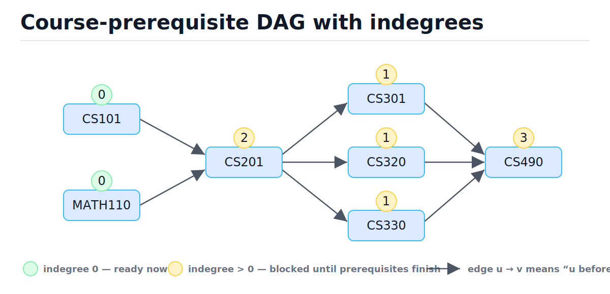
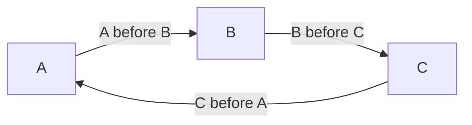
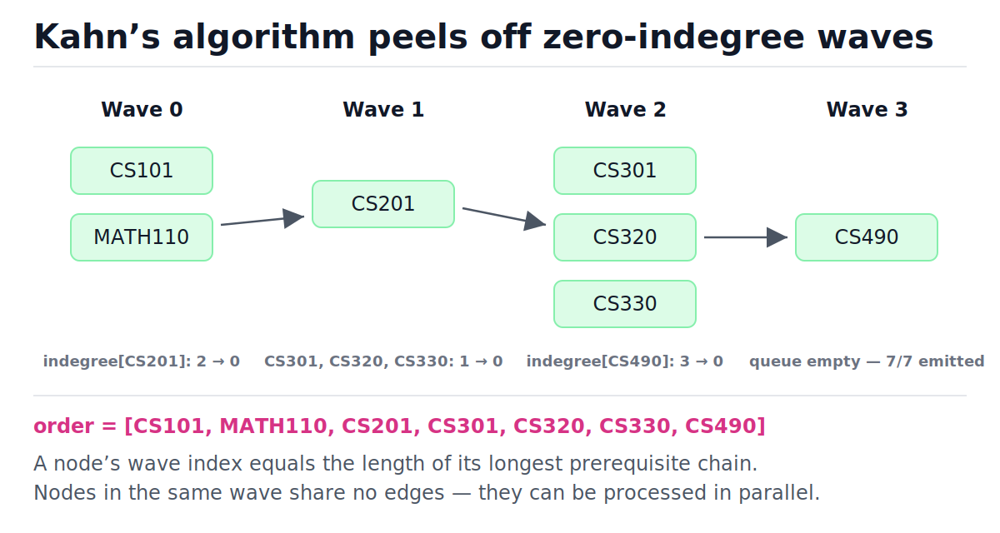
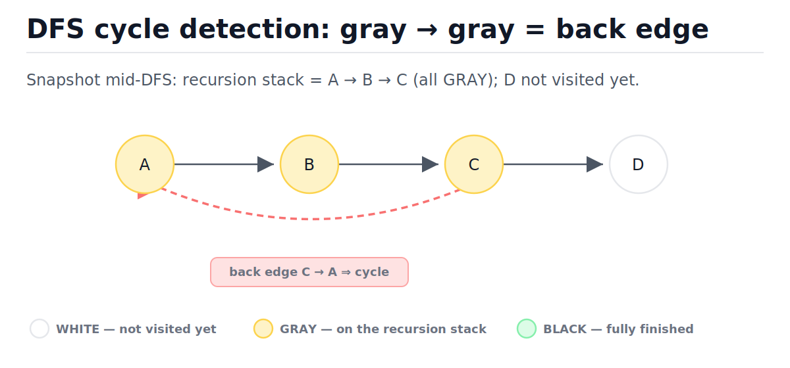

# Topological Sort and DAGs

[toc]

> **TL;DR:** A topological order lines up the nodes of a directed acyclic graph (DAG) so every edge points forward — prerequisites before dependents. Two O(V + E) algorithms produce one: Kahn's algorithm (repeatedly remove indegree-0 nodes) and DFS reverse postorder. A topological order exists if and only if the graph has no directed cycle, so both algorithms double as cycle detectors.

## Vocabulary

These are the load-bearing terms for the whole note. Everything below — both algorithms, the cycle proofs, and the complexity bounds — is stated in this language.

**Directed acyclic graph (DAG)**

```math
G = (V, E) \ \text{directed, with no cycle } v_0 \to v_1 \to \dots \to v_0
```

A directed graph with no path that starts and ends at the same node. "Acyclic" is the property that makes a topological order possible at all.

**Topological order**

```math
(u, v) \in E \implies \mathrm{pos}(u) < \mathrm{pos}(v)
```

A linear arrangement of all V nodes such that every edge points left-to-right. Prerequisites always appear before the things that depend on them.

**Indegree**

```math
\deg^{-}(v) = |\{\, u : (u, v) \in E \,\}|
```

The number of edges pointing *into* a node — the count of unmet prerequisites. Kahn's algorithm is entirely driven by this number reaching zero.

**Source node**

```math
\deg^{-}(v) = 0
```

A node with no incoming edges. Every DAG has at least one source; Kahn's queue contains exactly the current sources.

**Back edge**

```math
(u, v) \in E \ \text{with } v \text{ an ancestor of } u \text{ on the DFS stack}
```

An edge from a node to one of its own DFS ancestors — a node still colored gray. A directed graph contains a cycle if and only if DFS finds a back edge.

**Reverse postorder**

```math
\mathrm{topo}(G) = \mathrm{reverse}\big(\mathrm{postorder}_{\mathrm{DFS}}(G)\big)
```

The order produced by listing nodes by *decreasing* DFS finish time. On a DAG this is always a valid topological order.

**Kahn's algorithm**

```math
T(V, E) = O(V + E)
```

The BFS-flavored topological sort: compute all indegrees, seed a queue with the indegree-0 nodes, and repeatedly pop a node, emit it, and decrement its neighbors' indegrees.

## Intuition

Think of courses in a degree plan. CS201 requires both CS101 and MATH110; the capstone requires three 300-level courses. The question "in what order can I take everything?" *is* topological sort. The answer is driven by one number per course: how many unmet prerequisites it still has — its indegree. Anything at indegree 0 can be taken right now.

The figure below is the running example for this whole note. Look at the badges: CS101 and MATH110 start at indegree 0, CS201 is blocked by two edges, and CS490 is blocked by three.



### Why cycles make ordering impossible

A topological order needs every edge to point forward. Suppose three tasks form a cycle: A before B, B before C, C before A. Then pos(A) < pos(B) < pos(C) < pos(A) — a number less than itself. No ordering can satisfy that, so a graph with a cycle has *no* topological order, and a graph without cycles always has at least one (peel any source, repeat).



> [!IMPORTANT]
> Topological order exists **if and only if** the graph is a DAG. This biconditional is why every topological sort implementation is also a cycle detector — failure to produce a full order *is* the cycle proof.

## How it works

Both classic algorithms run in O(V + E) and visit every node and edge exactly once. Kahn's is iterative and queue-driven; the DFS variant is recursive and stack-driven. They can emit different (equally valid) orders.

### Kahn's algorithm (peel the sources)

Kahn's algorithm maintains the invariant "the queue holds exactly the nodes whose prerequisites are all emitted." Compute every node's indegree in one pass over the edges, seed a queue with the indegree-0 nodes, then loop: pop a node, append it to the output, and decrement the indegree of each neighbor — pushing any neighbor that hits zero. If the loop ends with fewer than V nodes emitted, the leftovers form (or are downstream of) a cycle.

```python
from collections import deque
from typing import Dict, List

def topo_sort_kahn(graph: Dict[str, List[str]]) -> List[str]:
    """graph maps node -> outgoing neighbors (u -> v means u before v).

    Returns a topological order or raises ValueError on a cycle. O(V + E).
    """
    indegree = {u: 0 for u in graph}
    for u in graph:
        for v in graph[u]:
            indegree[v] += 1                     # one pass over all E edges

    queue = deque(u for u in graph if indegree[u] == 0)
    order: List[str] = []
    while queue:
        u = queue.popleft()                      # O(1) on a deque
        order.append(u)
        for v in graph[u]:
            indegree[v] -= 1
            if indegree[v] == 0:
                queue.append(v)

    if len(order) != len(graph):                 # the cycle check
        raise ValueError("graph has a cycle; no topological order exists")
    return order

COURSES = {
    "CS101":   ["CS201"],
    "MATH110": ["CS201"],
    "CS201":   ["CS301", "CS320", "CS330"],
    "CS301":   ["CS490"],
    "CS320":   ["CS490"],
    "CS330":   ["CS490"],
    "CS490":   [],
}

order = topo_sort_kahn(COURSES)
assert order == ["CS101", "MATH110", "CS201", "CS301", "CS320", "CS330", "CS490"]

# The property that actually matters: every edge points forward.
pos = {course: i for i, course in enumerate(order)}
assert all(pos[u] < pos[v] for u in COURSES for v in COURSES[u])
```

Here is the full trace on the course DAG. The queue starts as `[CS101, MATH110]` because those are the only indegree-0 nodes.

| Step | Popped | Indegree changes | Queue after | Order so far |
| :---: | :--- | :--- | :--- | :--- |
| 1 | CS101 | CS201: 2 → 1 | `[MATH110]` | CS101 |
| 2 | MATH110 | CS201: 1 → 0 ⇒ enqueue | `[CS201]` | CS101, MATH110 |
| 3 | CS201 | CS301, CS320, CS330: 1 → 0 ⇒ enqueue all | `[CS301, CS320, CS330]` | …, CS201 |
| 4 | CS301 | CS490: 3 → 2 | `[CS320, CS330]` | …, CS301 |
| 5 | CS320 | CS490: 2 → 1 | `[CS330]` | …, CS320 |
| 6 | CS330 | CS490: 1 → 0 ⇒ enqueue | `[CS490]` | …, CS330 |
| 7 | CS490 | — | `[]` | full order, 7/7 ✓ |

Another way to see the same run: the algorithm peels the DAG in *waves*. Wave 0 is everything that starts at indegree 0; removing a wave drops some indegrees to zero, forming the next wave. Notice in the figure that a node's wave number equals the length of its longest prerequisite chain.



> [!TIP]
> The wave view is how real schedulers parallelize a DAG: nodes inside one wave have no edges between them, so a build system or task runner executes each wave concurrently. Total wall-clock time is bounded by the longest path (the critical path), not by V.

### The DFS alternative (reverse postorder)

DFS finishes a node only after every node reachable from it is already finished. So if you append each node to a list *at finish time* (postorder) and then reverse the list, every edge points forward — a topological order. The three-color scheme makes it safe: white = unvisited, gray = currently on the recursion stack, black = finished. Meeting a gray node again means you found a back edge, i.e. a cycle.

```python
from typing import Dict, List

WHITE, GRAY, BLACK = 0, 1, 2

def topo_sort_dfs(graph: Dict[str, List[str]]) -> List[str]:
    """Reverse-postorder DFS. Raises ValueError on a cycle. O(V + E)."""
    color = {u: WHITE for u in graph}
    postorder: List[str] = []

    def visit(u: str) -> None:
        color[u] = GRAY                      # on the recursion stack
        for v in graph[u]:
            if color[v] == GRAY:             # back edge -> cycle
                raise ValueError(f"cycle detected via back edge {u} -> {v}")
            if color[v] == WHITE:
                visit(v)
        color[u] = BLACK                     # finished: all descendants done
        postorder.append(u)

    for u in graph:
        if color[u] == WHITE:
            visit(u)
    return postorder[::-1]                   # reverse postorder

order = topo_sort_dfs(COURSES)
pos = {c: i for i, c in enumerate(order)}
assert all(pos[u] < pos[v] for u in COURSES for v in COURSES[u])

cyclic = {"a": ["b"], "b": ["c"], "c": ["a"]}
try:
    topo_sort_dfs(cyclic)
    assert False, "should have raised"
except ValueError as exc:
    assert "cycle" in str(exc)
```

The figure below shows the moment cycle detection fires. A, B, C are gray because they are all on the recursion stack; the edge C → A points at a gray node, which can only happen if A is C's own ancestor — a directed cycle. A cross edge to a *black* node is harmless, which is exactly why a single `visited` set is not enough.



> [!WARNING]
> Appending nodes in *preorder* (when first visited) does not give a topological order. With edges A→B, A→C, B→C and neighbor list `[C, B]` on A, preorder emits C before B even though B must precede C. Only postorder-then-reverse is correct.

### Detecting cycles

Each algorithm detects cycles its own way, and both proofs are constructive. Kahn's: nodes on a cycle can never reach indegree 0 (each one waits on its predecessor in the cycle), so they are never enqueued, and the algorithm finishes with `len(order) < V` — the leftover nodes are exactly those on or downstream of a cycle. DFS: a gray-to-gray edge closes a loop on the current recursion stack, and you can report the actual cycle by walking the stack from the gray target back to the current node.

> [!CAUTION]
> The classic production footgun is running Kahn's loop and **forgetting the final count check**. The code happily returns a partial order, the cyclic tail is silently dropped, and a build/migration runs with missing steps. Always compare `len(order)` to V — or use a library that raises, like `graphlib.CycleError`.

### Multiple valid orders and the lexicographically smallest

A DAG usually has many valid orders — at step 3 above we could have popped CS301, CS320, CS330 in any arrangement. The number of valid orders can be factorial: n isolated nodes admit n! orders. When a problem demands a deterministic answer (alien dictionary, "smallest sequence of tasks"), replace Kahn's FIFO queue with a min-heap so you always emit the smallest available node. Cost rises to O(V log V + E) because each push/pop is O(log V).

```python
import heapq
from typing import Dict, List

def topo_sort_lex_smallest(graph: Dict[str, List[str]]) -> List[str]:
    """Kahn's with a min-heap: the unique lexicographically smallest order.

    O(V log V + E) time, O(V) extra space.
    """
    indegree = {u: 0 for u in graph}
    for u in graph:
        for v in graph[u]:
            indegree[v] += 1

    heap = [u for u in graph if indegree[u] == 0]
    heapq.heapify(heap)
    order: List[str] = []
    while heap:
        u = heapq.heappop(heap)              # smallest available node
        order.append(u)
        for v in graph[u]:
            indegree[v] -= 1
            if indegree[v] == 0:
                heapq.heappush(heap, v)

    if len(order) != len(graph):
        raise ValueError("graph has a cycle")
    return order

g = {"b": ["d"], "a": ["d"], "c": ["d"], "d": []}
assert topo_sort_lex_smallest(g) == ["a", "b", "c", "d"]
assert topo_sort_kahn(g) == ["b", "a", "c", "d"]   # plain FIFO follows insertion order
```

## Complexity

Both core algorithms are linear in the size of the graph — you cannot do better, because any correct algorithm must at least look at every node and every edge. The heap variant pays a log factor only on node operations, not edges.

| Algorithm / operation | Best | Average | Worst | Space |
| :--- | :---: | :---: | :---: | :---: |
| Build indegree map | O(V + E) | O(V + E) | O(V + E) | O(V) |
| Kahn's (deque) | O(V + E) | O(V + E) | O(V + E) | O(V) |
| DFS reverse postorder | O(V + E) | O(V + E) | O(V + E) | O(V) stack + colors |
| Cycle detection (either) | O(V + E) | O(V + E) | O(V + E) | O(V) |
| Lexicographically smallest (heap) | O(V log V + E) | O(V log V + E) | O(V log V + E) | O(V) |
| `graphlib` `static_order` | O(V + E) | O(V + E) | O(V + E) | O(V + E) |

The bound for Kahn's falls out of counting how often each entity is touched. Every node enters and leaves the queue exactly once; every edge is examined exactly once, at the moment its source is popped:

```math
T(V, E) = \underbrace{O(V)}_{\text{each node enqueued/dequeued once}} + \underbrace{O(E)}_{\text{each edge decremented once}} = O(V + E)
```

The same argument covers DFS: `visit` runs once per node (the color check guarantees it), and the inner loop walks each adjacency list once, so edge work totals E. Space is O(V) for the indegree map and queue, or for the color map and recursion stack — the stack can reach depth V on a path-shaped DAG, which matters in Python (next section).

## Memory model in Python

The asymptotics hide three CPython realities: how the queue is laid out, how deep recursion can go, and how pointer-chasing wrecks cache locality on big graphs. Knowing these is the difference between a snippet that passes an interview and code that survives a million-node dependency graph.

`collections.deque` is a doubly linked list of fixed-size blocks (64 pointers per block in CPython), so `popleft` and `append` are true O(1) with no element shifting. Using a plain `list` and `pop(0)` instead silently turns Kahn's into O(V²): every `pop(0)` memmoves the entire remaining array. The adjacency `dict[str, list[str]]` itself is a hash table whose values are pointer arrays — every neighbor visit is a pointer dereference to a scattered heap object, so large graphs are cache-hostile; competitive-programming and production graph code uses integer node ids and `list[list[int]]` for locality. See [Hash Tables](./05-hash-tables.md) and the CPython object layout note linked below for why.

Recursion is the sharper edge. CPython's default recursion limit is 1000 frames, and the recursive DFS uses one frame per node along a path — a 5,000-node dependency chain raises `RecursionError`. The fix is an explicit stack holding `(node, neighbor_iterator)` pairs, which simulates the call stack on the heap:

```python
from typing import Dict, List

def topo_sort_dfs_iterative(graph: Dict[int, List[int]]) -> List[int]:
    """Reverse-postorder DFS with an explicit stack. No recursion limit. O(V + E)."""
    WHITE, GRAY, BLACK = 0, 1, 2
    color = {u: WHITE for u in graph}
    postorder: List[int] = []

    for root in graph:
        if color[root] != WHITE:
            continue
        color[root] = GRAY
        stack = [(root, iter(graph[root]))]      # (node, where we left off)
        while stack:
            node, neighbors = stack[-1]
            advanced = False
            for child in neighbors:              # resumes where it stopped
                if color[child] == GRAY:
                    raise ValueError("cycle detected")
                if color[child] == WHITE:
                    color[child] = GRAY
                    stack.append((child, iter(graph[child])))
                    advanced = True
                    break
            if not advanced:                     # all children done -> finish node
                color[node] = BLACK
                postorder.append(node)
                stack.pop()
    return postorder[::-1]

# A 5001-node chain: recursive DFS would blow the 1000-frame limit; this does not.
deep = {i: [i + 1] for i in range(5000)}
deep[5000] = []
assert topo_sort_dfs_iterative(deep) == list(range(5001))
```

> [!NOTE]
> Since Python 3.9 the standard library ships `graphlib.TopologicalSorter` — a pure-Python Kahn's implementation with a `prepare()` / `get_ready()` / `done()` protocol designed for parallel schedulers, plus `static_order()` for the simple case. It raises `graphlib.CycleError` (with the cycle in `exc.args[1]`) instead of returning a partial order.

## Real-world example

This is the algorithm inside `pip`, `apt`, `cargo`, `make`, Airflow, and spreadsheet recalculation engines: given "X depends on Y", produce a safe execution order — or refuse loudly when someone ships a circular dependency. Here is a package installer using the stdlib. Note `graphlib`'s convention is the *reverse* of an adjacency list: each key maps to its **predecessors** (its dependencies), not its dependents.

```python
from graphlib import CycleError, TopologicalSorter

# package -> set of packages it depends on (must be installed first)
deps = {
    "requests": {"urllib3", "idna", "certifi", "charset-normalizer"},
    "urllib3": set(),
    "idna": set(),
    "certifi": set(),
    "charset-normalizer": set(),
    "my-app": {"requests"},
}

install_order = list(TopologicalSorter(deps).static_order())
pos = {p: i for i, p in enumerate(install_order)}
assert all(pos[d] < pos[p] for p, ds in deps.items() for d in ds)

# Parallel install plan: each wave is independent and can download concurrently.
ts = TopologicalSorter(deps)
ts.prepare()
waves = []
while ts.is_active():
    ready = sorted(ts.get_ready())
    waves.append(ready)
    ts.done(*ready)
assert waves == [
    ["certifi", "charset-normalizer", "idna", "urllib3"],
    ["requests"],
    ["my-app"],
]

# A circular dependency is rejected, never silently dropped.
try:
    list(TopologicalSorter({"a": {"b"}, "b": {"a"}}).static_order())
    assert False, "should have raised"
except CycleError:
    pass
```

The same wave structure drives spreadsheet recalculation: when cell B1 changes, the engine topologically sorts the cells whose formulas (transitively) reference B1 and recomputes them in that order, so no formula ever reads a stale input. Database migration tools (Alembic, Django migrations) and Kubernetes operators resolving resource dependencies do the identical dance.

## When to use / When NOT to use

Reach for topological sort whenever the input is "things plus before/after constraints" and you need an execution order, a stale-value-free evaluation order, or a verdict that the constraints are contradictory. It is also the backbone of dynamic programming on DAGs — longest path, path counting, and shortest path in a weighted DAG all process nodes in topological order so every subproblem is final when read.

- **Use it for:** dependency resolution (packages, build targets, migrations), task scheduling with prerequisites, spreadsheet/incremental recomputation, course ordering, compiler pass and symbol ordering, DP over DAGs, deadlock-free lock-ordering checks.
- **Do NOT use it when the graph is undirected** — "before/after" is meaningless without direction; connectivity questions belong to [Union-Find](./14-union-find-disjoint-sets.md) or plain [BFS/DFS](./09-graphs-bfs-and-dfs.md).
- **Do NOT use it when cycles are legitimate** — condense strongly connected components first (Tarjan/Kosaraju), then topologically sort the condensation DAG.
- **Do NOT use it for weighted shortest paths in general graphs** — that is [Dijkstra or Bellman-Ford](./16-shortest-paths-dijkstra-and-bellman-ford.md) territory; topological relaxation only works when the graph is a DAG.

## Common mistakes

- **"Any BFS order is a topological order"** — BFS orders by distance from a source, not by dependency. A node can be reached in two hops while a five-hop prerequisite chain into it is still unprocessed. Kahn's queue admits a node only when its indegree hits 0, which is a stronger condition than "reachable."
- **Forgetting Kahn's final count check** — on cyclic input the loop just stops early and returns a valid-looking partial order. Compare emitted count to V, always.
- **Using a single `visited` set for directed-cycle detection** — a cross edge to an already-finished node is not a cycle. You need three states; only an edge to a *gray* (on-stack) node proves a cycle.
- **Emitting DFS preorder instead of reverse postorder** — preorder can output a dependent before its prerequisite (see the warning above). Append at finish time, then reverse.
- **Mixing up edge direction conventions** — adjacency lists usually map prerequisite → dependent, but `graphlib` maps node → its *dependencies*. Feeding one convention into the other silently reverses the entire order.
- **Asserting one exact output order in tests** — most DAGs admit many valid orders, and dict insertion order changes the tie-breaking. Test the pairwise property `pos[u] < pos[v]` for every edge instead.
- **Recursive DFS on huge or path-shaped graphs** — CPython's ~1000-frame recursion limit turns a long dependency chain into `RecursionError`. Use the explicit-stack version or `graphlib`.

## Interview questions and answers

Topological sort is a top-five interview graph topic because it layers cleanly: definition, two algorithms, cycle detection, then a twist (lexicographic order, parallelism, or DP on the result). Practice saying these answers out loud.

**Q1. What is a topological order and when does one exist?**
**Answer:** It's an ordering of a directed graph's nodes where every edge goes from earlier to later — prerequisites before dependents. One exists if and only if the graph is a DAG: a cycle would force some node to come before itself, and conversely any DAG has an indegree-0 node you can peel off and recurse on.

**Q2. Walk me through Kahn's algorithm and its complexity.**
**Answer:** Compute indegrees in one pass over the edges, push all indegree-0 nodes into a queue, then repeatedly pop, emit, and decrement each neighbor's indegree, pushing neighbors that hit zero. Each node is queued once and each edge decremented once, so it's O(V + E) time and O(V) extra space.

**Q3. How does DFS produce a topological order, and why reverse postorder specifically?**
**Answer:** DFS marks a node finished only after everything reachable from it is finished. So in postorder, every node appears after all its descendants — reversing that puts every node before everything that depends on it. Preorder doesn't work because a node is emitted before its subtree is explored.

**Q4. How do you detect a cycle with each algorithm?**
**Answer:** In Kahn's, count emitted nodes: fewer than V means the leftovers contain a cycle, since cycle members can never reach indegree 0. In DFS, use three colors and flag any edge into a gray node — gray means it's an ancestor on the current stack, so that edge closes a loop. To report the cycle itself, walk the DFS stack back from the gray node.

**Q5. Course Schedule (LeetCode 207/210) — how do you solve it?**
**Answer:** Model courses as nodes and each prerequisite pair as an edge prerequisite → course. 207 only asks if all courses are completable, which is just "is it a DAG" — run either algorithm and check for a cycle. 210 asks for an actual order, so return Kahn's output, or empty if the count check fails. Both are O(V + E).

**Q6. The answer must be the lexicographically smallest valid order. What changes?**
**Answer:** Swap Kahn's FIFO queue for a min-heap so among all currently available nodes you always emit the smallest. That's greedy-correct because any valid order must pick some available node, and picking the smallest never blocks anything. Complexity becomes O(V log V + E).

**Q7. You have a task DAG and unlimited workers. What's the minimum completion time?**
**Answer:** Process in topological order and compute each task's earliest start as the max finish time over its prerequisites — that's DP on the DAG. The makespan equals the longest path, the critical path. With unit tasks, Kahn's wave number gives each task's earliest round directly.

**Q8. Why can't you topologically sort an undirected graph?**
**Answer:** Every undirected edge is a two-node cycle once you try to orient it both ways — "u before v" and "v before u" simultaneously. The concept needs direction. If the real question is about connectivity or components, that's BFS/DFS or union-find, not topological sort.

**Q9. Your build tool prints "dependency cycle detected." How would you make that error actionable?**
**Answer:** Don't just fail — print the cycle. In DFS, when you hit a gray node, the current recursion stack from that node to the top is the cycle; slice and print it. In Kahn's, the nodes never emitted are on or downstream of cycles; run DFS on that remainder to extract one concrete loop. Users fix "A → B → C → A" fast; they can't fix a bare error.

## Practice path

Drill in this order — each step adds exactly one new wrinkle on top of the last.

1. Implement `topo_sort_kahn` from memory; validate with the pairwise `pos[u] < pos[v]` check, never an exact expected list.
2. Implement recursive three-color DFS; make it raise on a cycle and test it on a 3-node loop.
3. Convert the DFS to an explicit stack and prove it on a 100,000-node chain (the recursive one must fail, the iterative one must pass).
4. LeetCode 207 *Course Schedule* — cycle detection only.
5. LeetCode 210 *Course Schedule II* — return the order.
6. LeetCode 269 *Alien Dictionary* — build the graph from pairwise word comparisons, then heap-Kahn for the smallest order.
7. LeetCode 1203 *Sort Items by Groups Respecting Dependencies* — two nested topological sorts.
8. Longest path in a DAG via DP in topological order — the bridge to [Dynamic Programming](./19-dynamic-programming.md).

## Copyable takeaways

- Topological order = every edge points forward; exists **iff** the graph is a DAG.
- Kahn's: indegree map → queue of zeros → pop, emit, decrement, enqueue new zeros. O(V + E).
- DFS: three colors, append at finish time, reverse the postorder. Gray → gray edge = cycle. O(V + E).
- Cycle detection: Kahn emits fewer than V nodes; DFS finds a back edge. Never skip the count check.
- Lexicographically smallest order: replace the FIFO queue with a min-heap, O(V log V + E).
- Waves of simultaneous zero-indegree nodes = maximal safe parallelism; makespan = critical path.
- In Python: `deque` for the queue (`list.pop(0)` is O(n)), explicit stack for deep DFS, `graphlib.TopologicalSorter` since 3.9 (note: it takes *predecessor* maps and raises `CycleError`).

## Sources

- Kahn, A. B. (1962). "Topological sorting of large networks." *Communications of the ACM*, 5(11), 558–562.
- Cormen, Leiserson, Rivest, Stein. *Introduction to Algorithms*, 4th ed., §20.4 "Topological sort" (3rd ed. §22.4).
- Sedgewick & Wayne. *Algorithms*, 4th ed., §4.2 "Directed Graphs" (Topological sort, DirectedCycle).
- Python docs — `graphlib`: https://docs.python.org/3/library/graphlib.html
- Python docs — `collections.deque`: https://docs.python.org/3/library/collections.html#collections.deque

## Related

- [Graphs, BFS and DFS](./09-graphs-bfs-and-dfs.md) — the traversal machinery both algorithms are built on.
- [Stacks and Queues](./04-stacks-and-queues.md) — why `deque` gives O(1) at both ends.
- [Heaps and Priority Queues](./08-heaps-and-priority-queues.md) — the structure behind the lexicographic variant.
- [Union-Find (Disjoint Sets)](./14-union-find-disjoint-sets.md) — the right tool when the graph is undirected.
- [Shortest Paths: Dijkstra and Bellman-Ford](./16-shortest-paths-dijkstra-and-bellman-ford.md) — weighted DAG shortest path is one topological pass.
- [Memory Model and PyObject Layout](../Programming-Languages/Python/13-memory-model-and-pyobject-layout.md) — why dict-of-lists adjacency is pointer-chasing-heavy.
