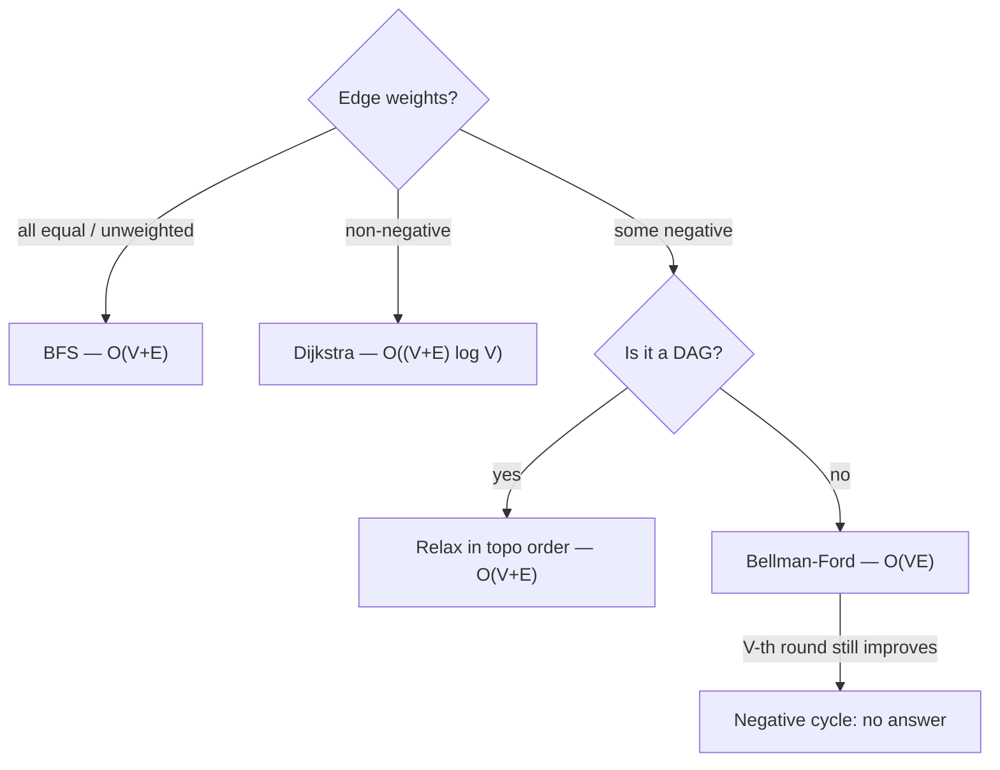
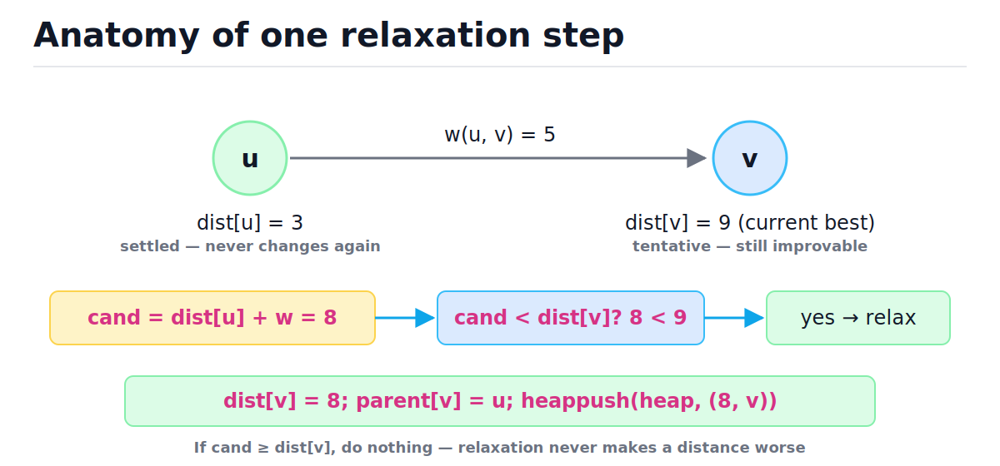
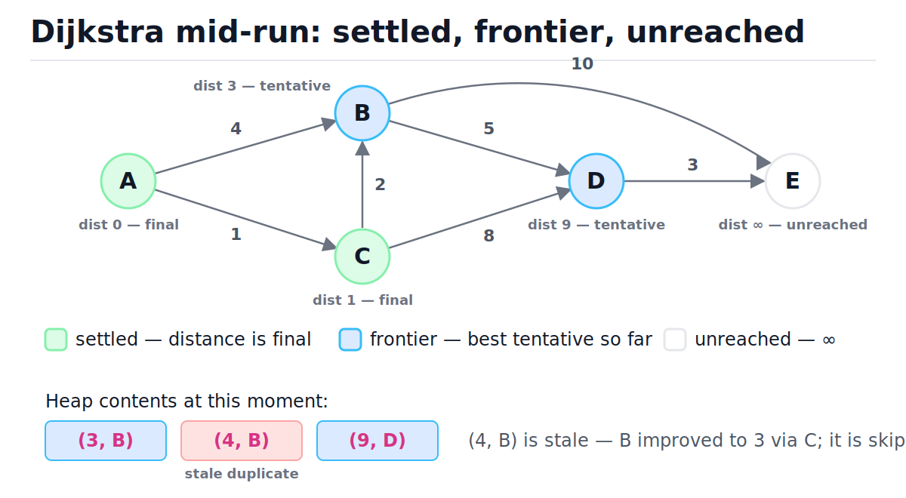
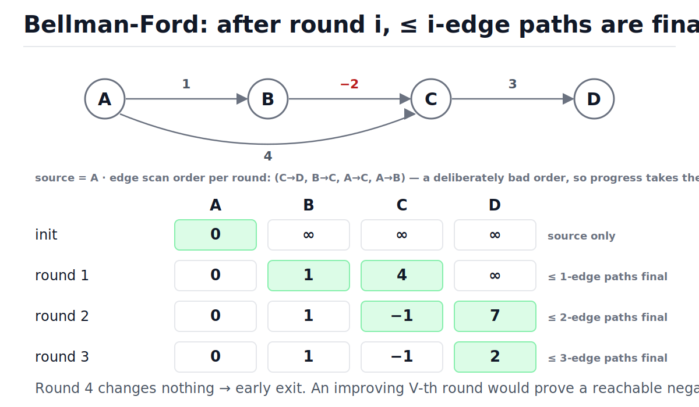

# Shortest Paths: Dijkstra and Bellman-Ford

[toc]

> **TL;DR:** Pick the shortest-path algorithm by edge-weight regime: unweighted → BFS in O(V+E); non-negative weights → Dijkstra's greedy frontier with a min-heap in O((V+E) log V); negative weights → Bellman-Ford's V−1 rounds of brute relaxation in O(VE), which also detects negative cycles. All three are the same idea — repeatedly *relax* edges — they differ only in what order they dare to do it.

## Vocabulary

Every algorithm in this note is built from the same handful of moving parts. Learn these terms once and every proof and code block below reads in one pass.

**Shortest-path distance**

```math
\delta(s, v) = \min\{\, w(P) : P \text{ is a path from } s \text{ to } v \,\}
```

The true minimum total edge weight over all paths from source s to vertex v. It is infinity if v is unreachable, and minus infinity if some path to v can detour through a negative cycle.

**Relaxation**

```math
\text{if } \mathrm{dist}[u] + w(u, v) < \mathrm{dist}[v]: \quad \mathrm{dist}[v] \leftarrow \mathrm{dist}[u] + w(u, v)
```

The single primitive shared by every shortest-path algorithm: try to improve the best-known distance to v by going through u. Relaxation never makes a distance worse, so it is always safe — the algorithms differ only in *when* they perform it.

**Tentative distance**

```math
\mathrm{dist}[v] \ge \delta(s, v)
```

The best path weight found *so far* for v. It only ever decreases, and it is always an upper bound on the truth. An algorithm is done when every tentative distance equals the true distance.

**Settled set**

```math
S \subseteq V, \quad v \in S \implies \mathrm{dist}[v] = \delta(s, v)
```

In Dijkstra, the set of vertices whose distance is proven final. Each heap pop moves one vertex from the frontier into S; once settled, a vertex is never touched again.

**Predecessor pointer**

```math
\mathrm{parent}[v] = u \quad \text{where the winning relaxation came through edge } (u, v)
```

The breadcrumb that lets you reconstruct the actual path, not just its length. Walking parent pointers from the target back to the source and reversing gives the shortest path in O(path length).

**Negative cycle**

```math
\sum_{e \in C} w(e) < 0
```

A directed cycle whose edge weights sum below zero. Looping it forever drives path weight to minus infinity, so "shortest path" stops being well-defined for every vertex that can reach the cycle and then the target.

**Admissible heuristic**

```math
h(v) \le \delta(v, t) \quad \forall v
```

An estimate of remaining distance to target t that never overestimates. A* stays exactly as correct as Dijkstra as long as its heuristic is admissible.

## Intuition

Think of edge-weight regimes as a ladder of increasing distrust. With unit weights, the first time BFS touches a vertex *is* the shortest path — distance equals layer number, no bookkeeping needed. With non-negative weights, you can still be greedy, but you need a min-heap to always expand the cheapest frontier vertex: that's Dijkstra. With negative weights, greed dies — a cheap-looking path can be undercut later by a detour through a negative edge — so Bellman-Ford gives up on cleverness and relaxes *every* edge V−1 times.



> [!NOTE]
> The DAG branch is a free lunch people forget: on a directed acyclic graph you can relax each edge exactly once in topological order and get shortest paths in O(V+E) *even with negative weights*. See [Topological Sort and DAGs](./15-topological-sort-and-dags.md).

## How it works

All three algorithms maintain a dist map of tentative distances, repeatedly apply the relaxation primitive, and stop when no relaxation can succeed. The figure below dissects one relaxation: it is a comparison, a write, and (in Dijkstra) a heap push — nothing more.



### Unweighted graphs: plain BFS

When every edge costs the same, layers of BFS are exactly distance contours: everything one hop away is processed before anything two hops away. So the *first* time a vertex is discovered, that discovery is already the shortest path, and a plain FIFO queue replaces the heap. This is the degenerate, fastest case — O(V+E) time, O(V) space.

```python
from collections import deque


def bfs_dist(graph: dict[str, list[str]], source: str) -> dict[str, int]:
    """Unweighted shortest paths. O(V + E) time, O(V) space."""
    dist = {source: 0}
    q = deque([source])
    while q:
        u = q.popleft()
        for v in graph.get(u, []):
            if v not in dist:  # first time seen == shortest, because all edges cost 1
                dist[v] = dist[u] + 1
                q.append(v)
    return dist


g = {"A": ["B", "C"], "B": ["D"], "C": ["D"], "D": ["E"]}
assert bfs_dist(g, "A") == {"A": 0, "B": 1, "C": 1, "D": 2, "E": 3}
assert "Z" not in bfs_dist(g, "A")  # unreachable nodes are simply absent
```

> [!TIP]
> The 0/1-weight middle ground has its own trick: **0-1 BFS** with a deque — append 0-weight edges to the front and 1-weight edges to the back. Shortest paths in O(V+E) without a heap.

### Non-negative weights: Dijkstra

Dijkstra generalizes BFS by replacing the FIFO queue with a min-heap keyed on tentative distance. Each iteration pops the frontier vertex with the smallest tentative distance, declares it *settled* (final), and relaxes its out-edges. The greedy claim — the heart of the algorithm — is:

```math
\text{when } u \text{ is popped with key } d:\quad d = \delta(s, u) \qquad \text{(requires } w(e) \ge 0 \text{ for every edge)}
```

Why it holds: any other route to u would have to leave the settled set through some frontier vertex x. But x's key is ≥ d (u was the minimum), and with non-negative weights the rest of that route can only add more. So nothing can beat d, and u is safe to lock in. The snapshot below shows the three vertex states mid-run — and a *stale* heap entry, which brings us to the Python idiom.



Textbook Dijkstra calls *decrease-key* when a frontier vertex improves. Python's `heapq` has no decrease-key, so production Python uses **lazy deletion**: on improvement, push a *duplicate* entry with the better key and leave the old one in place; at pop time, skip any entry for an already-settled vertex. Stale entries cost a little heap space but keep every operation O(log heap-size) with zero extra bookkeeping.

```python
import heapq
from typing import Optional

WGraph = dict[str, list[tuple[str, int]]]


def dijkstra(graph: WGraph, source: str) -> tuple[dict[str, int], dict[str, Optional[str]]]:
    """Single-source shortest paths, non-negative weights.

    O((V + E) log V) time with a binary heap, O(V + E) space.
    """
    dist: dict[str, int] = {source: 0}
    parent: dict[str, Optional[str]] = {source: None}
    settled: set[str] = set()
    heap: list[tuple[int, str]] = [(0, source)]
    while heap:
        d, u = heapq.heappop(heap)
        if u in settled:  # stale duplicate: a smaller key for u was popped earlier
            continue
        settled.add(u)  # d == true shortest distance to u, locked in
        for v, w in graph.get(u, []):
            cand = d + w
            if cand < dist.get(v, float("inf")):
                dist[v] = cand
                parent[v] = u
                heapq.heappush(heap, (cand, v))  # push a duplicate; never decrease-key
    return dist, parent


def path_to(parent: dict[str, Optional[str]], v: str) -> list[str]:
    """Walk parent pointers back to the source. O(path length)."""
    out: list[str] = []
    cur: Optional[str] = v
    while cur is not None:
        out.append(cur)
        cur = parent[cur]
    return out[::-1]


G: WGraph = {
    "A": [("B", 4), ("C", 1)],
    "B": [("D", 5), ("E", 10)],
    "C": [("B", 2), ("D", 8)],
    "D": [("E", 3)],
    "E": [],
}
dist_g, parent_g = dijkstra(G, "A")
assert dist_g == {"A": 0, "B": 3, "C": 1, "D": 8, "E": 11}
assert path_to(parent_g, "E") == ["A", "C", "B", "D", "E"]
```

Here is the full run on graph G above, source A. Watch the dist map only ever improve, and watch steps 4, 6, and 8 hit stale duplicates and skip them — that is lazy deletion paying its rent.

| Step | Popped | Decision | Relaxations | dist after | Heap after (sorted view) |
| :---: | :--- | :--- | :--- | :--- | :--- |
| 0 | — | init | — | A:0 | (0,A) |
| 1 | (0, A) | settle A | B: ∞→4, C: ∞→1 | A:0 B:4 C:1 | (1,C) (4,B) |
| 2 | (1, C) | settle C | B: 4→**3**, D: ∞→9 | A:0 B:3 C:1 D:9 | (3,B) (4,B) (9,D) |
| 3 | (3, B) | settle B | D: 9→**8**, E: ∞→13 | A:0 B:3 C:1 D:8 E:13 | (4,B) (8,D) (9,D) (13,E) |
| 4 | (4, B) | **stale — skip** | — | unchanged | (8,D) (9,D) (13,E) |
| 5 | (8, D) | settle D | E: 13→**11** | A:0 B:3 C:1 D:8 E:11 | (9,D) (11,E) (13,E) |
| 6 | (9, D) | **stale — skip** | — | unchanged | (11,E) (13,E) |
| 7 | (11, E) | settle E | none | final | (13,E) |
| 8 | (13, E) | **stale — skip** | — | final | empty → done |

> [!WARNING]
> The classic Dijkstra bug is marking a vertex visited **when it is pushed** (BFS habit) instead of **when it is popped**. Pushed-time marking freezes the first tentative distance ever seen and silently returns wrong answers on weighted graphs. Settle at pop time, always.

### Why negative edges break Dijkstra

The greedy proof leans on one inequality: extending a path can never make it shorter. A negative edge breaks exactly that step — a frontier vertex with a *larger* key can still reach a settled vertex more cheaply by traversing the negative edge, after Dijkstra has already locked the settled vertex in and used its wrong value to relax neighbors. Once a wrong value propagates downstream, no later update can recall it, because the downstream vertices are settled too.

```python
# A->B costs 2, but the real shortest path to B is A->C->B = 5 + (-4) = 1.
# Dijkstra settles B at 2, relaxes B->D to 3, and never revisits D.
H: WGraph = {"A": [("B", 2), ("C", 5)], "B": [("D", 1)], "C": [("B", -4)], "D": []}
dist_h, _ = dijkstra(H, "A")
assert dist_h["D"] == 3  # WRONG: the true shortest path A->C->B->D costs 2
```

> [!IMPORTANT]
> Non-negative weights are a **precondition**, not a tuning knob. Dijkstra does not "usually work" with a few negative edges — it returns confidently wrong numbers with no error. If any weight can be negative, you must switch algorithms.

### Negative weights: Bellman-Ford

Bellman-Ford abandons ordering entirely: relax *every* edge, and repeat that sweep V−1 times. It is dynamic programming over path length — round i extends optimal paths by one more edge — which is why negative edges are harmless: nothing is ever locked in early. The invariant that makes the whole algorithm obvious is:

```math
\text{After round } i:\quad \mathrm{dist}[v] \;\le\; \min\{\, w(P) : P \text{ is an } s \to v \text{ path with at most } i \text{ edges} \,\}
```

Proof by induction: a best ≤ i-edge path is a best ≤ (i−1)-edge path plus one final edge (u, v); the prefix was already correct after round i−1, and round i relaxes (u, v). A shortest *simple* path has at most V−1 edges, so V−1 rounds suffice. And that gives negative-cycle detection for free: if a V-th sweep still improves something, a path with ≥ V edges beats every simple path — it must repeat a vertex, and the repeated loop must have negative weight.



```python
from typing import Optional


def bellman_ford(
    nodes: list[str],
    edges: list[tuple[str, str, float]],
    source: str,
) -> Optional[tuple[dict[str, float], dict[str, Optional[str]]]]:
    """O(V * E) time, O(V) space. Returns None if a negative cycle is reachable."""
    inf = float("inf")
    dist: dict[str, float] = {v: inf for v in nodes}
    parent: dict[str, Optional[str]] = {v: None for v in nodes}
    dist[source] = 0
    for _ in range(len(nodes) - 1):  # V-1 rounds of relaxing EVERY edge
        changed = False
        for u, v, w in edges:
            if dist[u] + w < dist[v]:
                dist[v] = dist[u] + w
                parent[v] = u
                changed = True
        if not changed:  # converged early: the next round would be a no-op too
            break
    for u, v, w in edges:  # a V-th improving round proves a negative cycle
        if dist[u] + w < dist[v]:
            return None
    return dist, parent


nodes = ["A", "B", "C", "D"]
edges: list[tuple[str, str, float]] = [
    ("C", "D", 3), ("B", "C", -2), ("A", "C", 4), ("A", "B", 1),
]
result = bellman_ford(nodes, edges, "A")
assert result is not None
dist_bf, _ = result
assert dist_bf == {"A": 0, "B": 1, "C": -1, "D": 2}

cyc: list[tuple[str, str, float]] = [
    ("A", "B", 1), ("B", "C", -1), ("C", "B", -1),  # B->C->B sums to -2
]
assert bellman_ford(["A", "B", "C"], cyc, "A") is None
```

> [!CAUTION]
> When Bellman-Ford reports a negative cycle, the dist values for everything downstream of the cycle are meaningless — the true distance is minus infinity. Never ship partial distances from a run that failed cycle detection; treat it as "no answer," not "approximate answer."

### A* in one paragraph

A* is Dijkstra with a steering wheel for the single-target case: instead of popping by g(v) = distance-from-source, pop by f(v) = g(v) + h(v), where h(v) estimates remaining distance to the target t. If h never overestimates (admissible — e.g., straight-line distance on a road map), the first pop of t is provably optimal, exactly like Dijkstra's settle argument; if h is also consistent (triangle inequality), no vertex is ever re-expanded. With h ≡ 0 it *is* Dijkstra; a better-informed h prunes the frontier toward the target, often expanding orders of magnitude fewer vertices on spatial graphs. Worst case remains O((V+E) log V).

```math
f(v) = g(v) + h(v), \qquad h \text{ admissible} \iff h(v) \le \delta(v, t) \ \ \forall v
```

## Complexity

One table, every algorithm in this note. V = vertices, E = edges; "lazy" means the heapq duplicate-push idiom, which bloats the heap to at most E entries.

| Algorithm | Best | Average | Worst | Space | Negative edges? |
| :--- | :---: | :---: | :---: | :---: | :---: |
| BFS (unweighted) | O(V+E) | O(V+E) | O(V+E) | O(V) | n/a (no weights) |
| Dijkstra, binary heap (lazy) | O(V log V) | O((V+E) log V) | O((V+E) log V) | O(V+E) | no |
| Dijkstra, Fibonacci heap | O(E + V log V) | O(E + V log V) | O(E + V log V) | O(V) | no |
| Bellman-Ford (early exit) | O(E) | O(VE) | O(VE) | O(V) | yes + cycle detect |
| DAG relax in topo order | O(V+E) | O(V+E) | O(V+E) | O(V) | yes (DAG only) |
| A* (admissible h) | ≪ Dijkstra | depends on h | O((V+E) log V) | O(V+E) | no |
| Path reconstruction | O(L) | O(L) | O(L) | O(L) | — (L = path length) |

The lazy-Dijkstra bound is worth deriving once. Each successful relaxation pushes one heap entry, and each edge can cause at most one successful relaxation per settle of its tail, so pushes ≤ E + 1; pops ≤ pushes; the heap never exceeds E + 1 entries:

```math
T = O\big((E) \log E\big) = O\big(E \log V^2\big) = O\big(2E \log V\big) = O\big((V + E)\log V\big)
```

The log V² → 2 log V step is why duplicates cost nothing asymptotically: a simple graph has E ≤ V², so log E ≤ 2 log V, and constants vanish inside Big-O. The +V term covers the vertices themselves (initial push, sparse graphs). Bellman-Ford's O(VE) needs no derivation — it is literally V−1 sweeps times E relaxation attempts — but note the early-exit check makes the *best* case a single O(E) sweep when the edge order happens to be favorable, which is common in practice.

## Memory model in Python

Knowing what `heapq` and the dist map actually are in CPython explains both the performance and the one crash this idiom can produce. `heapq` is not a class — it is a set of functions that maintain the heap invariant over a plain Python list, treating index i's children as indices 2i+1 and 2i+2. There are no node objects and no pointers between elements: sift-up and sift-down are just index arithmetic over one contiguous array of PyObject pointers, which is as cache-friendly as CPython gets. The entries themselves are 2-tuples — a 56-byte object holding two pointers — so a heap of a million entries costs roughly the list (8 MB of pointer slots) plus 56 MB of tuples, plus the int and str objects they reference (see [Memory Model and PyObject Layout](../Programming-Languages/Python/13-memory-model-and-pyobject-layout.md)).

```python
import heapq
import sys

heap2: list[tuple[int, str]] = []
for item in [(9, "D"), (3, "B"), (4, "B")]:
    heapq.heappush(heap2, item)

assert heap2[0] == (3, "B")  # heap[0] is always the minimum
for i in range(len(heap2)):  # the implicit-tree invariant: parent <= both children
    for child in (2 * i + 1, 2 * i + 2):
        if child < len(heap2):
            assert heap2[i] <= heap2[child]

entries: list[tuple[int, str]] = [(4, "A"), (3, "C"), (3, "B")]
# lexicographic ordering: ties on dist fall through to comparing the nodes
assert sorted(entries) == [(3, "B"), (3, "C"), (4, "A")]
assert sys.getsizeof(entries[0]) == 56  # 2-tuple, 64-bit CPython: header + 2 pointers
```

Tuple comparison is lexicographic, and that is a loaded gun: when two entries tie on distance, Python compares the *nodes*. Fine for strings and ints; a `TypeError` at 3 a.m. for custom objects. The standard fix — documented in the `heapq` module docs — is a monotonic counter as the middle element, which guarantees no comparison ever reaches the payload.

```python
import heapq
from itertools import count


class Job:
    pass


h: list[tuple[int, Job]] = [(1, Job())]
try:
    heapq.heappush(h, (1, Job()))  # tie on 1 -> compares Job() < Job() -> TypeError
    crashed = False
except TypeError:
    crashed = True
assert crashed

tie_breaker = count()
h2: list[tuple[int, int, Job]] = []
heapq.heappush(h2, (1, next(tie_breaker), Job()))
heapq.heappush(h2, (1, next(tie_breaker), Job()))  # fine: the counter breaks the tie
assert len(h2) == 2
```

> [!TIP]
> Lazy deletion is not a Python hack — it is the documented priority-queue pattern in the `heapq` docs, and it usually beats decrease-key implementations in practice because the constant factors of sift operations on a flat list are tiny. For heaps and their internals in depth, see [Heaps and Priority Queues](./08-heaps-and-priority-queues.md).

## Real-world example

Currency arbitrage detection is Bellman-Ford wearing a suit. Model each currency as a vertex and each quoted exchange rate r as an edge weighted −log r. A cycle of trades is profitable exactly when its rates multiply to more than 1, and the log transform turns that product into a sum — a profitable loop becomes a negative cycle:

```math
\prod_{e \in C} r_e > 1 \iff \sum_{e \in C} -\log r_e < 0
```

To catch a cycle *anywhere* in the graph (not just ones reachable from one currency), use the virtual-source trick: start every vertex at distance 0, which is equivalent to adding a free source connected to all vertices. Then run the usual V−1 rounds and probe for a V-th improvement.

```python
import math


def has_arbitrage(rates: dict[str, dict[str, float]]) -> bool:
    """True iff some currency cycle multiplies to > 1. O(V * E)."""
    nodes = list(rates)
    edges = [
        (a, b, -math.log(r))
        for a, quotes in rates.items()
        for b, r in quotes.items()
    ]
    dist = {v: 0.0 for v in nodes}  # virtual source: every node starts at 0
    for _ in range(len(nodes) - 1):
        for u, v, w in edges:
            if dist[u] + w < dist[v]:
                dist[v] = dist[u] + w
    # an improving extra round == negative cycle == profitable loop
    return any(dist[u] + w < dist[v] - 1e-12 for u, v, w in edges)


quotes = {
    "USD": {"EUR": 0.90, "GBP": 0.80},
    "EUR": {"USD": 1.10, "GBP": 0.90},
    "GBP": {"USD": 1.25, "EUR": 1.10},
}
# USD -> EUR -> GBP -> USD multiplies to 0.90 * 0.90 * 1.25 = 1.0125 > 1
assert has_arbitrage(quotes) is True

values = {"USD": 1.0, "EUR": 1.1, "GBP": 1.3}  # consistent prices: no free lunch
fair = {a: {b: values[a] / values[b] for b in values if b != a} for a in values}
assert has_arbitrage(fair) is False
```

The 1e-12 tolerance matters: with consistent prices, the −log weights of any cycle sum to zero *in real arithmetic* but to a few ulps of noise in floats. Without the epsilon, fair markets occasionally flag as arbitrage. The same shape powers distance-vector routing protocols (RIP is distributed Bellman-Ford over UDP) and Dijkstra powers link-state ones (OSPF) — see [TCP and UDP](../Computer-Networking/5-tcp-and-udp.md) for the transport those protocols ride on.

## When to use / When NOT to use

The decision is almost always mechanical once you know three facts: the weight regime, whether the graph is a DAG, and whether you have one target or all of them. This table is the whole decision procedure.

| Situation | Use | Time | Why |
| :--- | :--- | :---: | :--- |
| Unweighted / all weights equal | BFS | O(V+E) | layer number = distance |
| Weights only 0 and 1 | 0-1 BFS (deque) | O(V+E) | front = free, back = costly |
| Non-negative weights | Dijkstra | O((V+E) log V) | greedy settle is provably safe |
| Single target + good heuristic | A* | ≤ Dijkstra | goal-directed pruning |
| Any weights, graph is a DAG | topo-order relax | O(V+E) | each edge relaxed once, in order |
| Negative edges, general graph | Bellman-Ford | O(VE) | DP over path length, never locks in |
| Must *detect* negative cycles | Bellman-Ford | O(VE) | V-th improving round is the proof |
| All-pairs, dense or small V | Floyd-Warshall | O(V³) | simpler than V Dijkstra runs when V ≤ ~500 |

Do NOT use Dijkstra when any edge can be negative (silent wrong answers), and do not use Bellman-Ford on a large non-negative-weight graph out of caution — O(VE) versus O((V+E) log V) is the difference between hours and milliseconds at a few million edges. Do not use any shortest-path algorithm when you actually need the *cheapest set of edges connecting everything* — that is a minimum spanning tree, a different objective entirely ([Minimum Spanning Trees](./17-minimum-spanning-trees.md)).

## Common mistakes

- **"Dijkstra mostly works with negative edges"** — it returns wrong answers without any error, because settled vertices are never revisited. One negative edge anywhere reachable invalidates the guarantee.
- **"Mark visited when pushing"** — that is BFS logic. Dijkstra must settle at *pop* time; a vertex can be pushed several times with improving keys, and only the smallest pop is final.
- **"BFS finds shortest paths in weighted graphs"** — BFS minimizes *hop count*, not weight. A 2-hop path of weight 100 beats a 5-hop path of weight 5 under BFS.
- **"Bellman-Ford always needs exactly V−1 rounds"** — V−1 is the worst case under adversarial edge order. With the `changed` early-exit flag, well-ordered graphs converge in a round or two.
- **"A negative cycle anywhere ruins all distances"** — only vertices that can be reached *through* the cycle have undefined distance. Everything else is still well-defined (and findable with a careful implementation).
- **"heapq has decrease-key, I just haven't found it"** — it does not, by design. Push duplicates and skip stale pops; do not reach into the heap list and mutate entries, which silently breaks the invariant.
- **"Zero-weight edges break Dijkstra"** — they are fine; the proof only needs w ≥ 0. It is strictly *negative* weights that break the greedy argument.
- **"A* is always faster than Dijkstra"** — with a weak heuristic it expands the same vertices and pays extra to compute h. A* wins only when h is informative, e.g., geometric distance on spatial graphs.

## Interview questions and answers

A short setup for each, then the answer the interviewer wants to hear, in spoken style.

1. **Why does Dijkstra fail with negative edge weights?**
   **Answer:** The greedy proof assumes that extending a path never makes it shorter. When I pop the minimum-key vertex and settle it, I'm claiming no other route can beat it — every alternative leaves through a frontier vertex with a bigger key and only gets longer from there. A negative edge breaks "only gets longer," so a settled vertex can later be undercut, but Dijkstra never revisits settled vertices, so the wrong value sticks and propagates.

2. **Walk me through the complexity of heap-based Dijkstra.**
   **Answer:** Every successful relaxation does one push, and each edge relaxes at most once per settle of its tail, so there are O(E) pushes and O(E) pops, each costing log of the heap size. The heap holds at most O(E) entries, and log E is at most 2 log V for a simple graph, so the total is O((V+E) log V). With a Fibonacci heap decrease-key is amortized O(1) and you get O(E + V log V), but nobody uses that in practice — the constants are awful.

3. **Python's heapq has no decrease-key. How do you implement Dijkstra anyway?**
   **Answer:** Lazy deletion. When a vertex's tentative distance improves, I just push a new (dist, node) tuple and leave the stale one in the heap. At pop time I check whether the node is already settled and skip it if so. It's at most one heap entry per edge, so the asymptotics don't change, and it's the pattern the heapq docs themselves recommend.

4. **How does Bellman-Ford detect a negative cycle, and why do V−1 rounds suffice otherwise?**
   **Answer:** A shortest simple path has at most V−1 edges, and after round i every shortest path using at most i edges is final — that's the induction. So after V−1 rounds nothing should improve. If a V-th sweep still relaxes an edge, some path with V or more edges beats every simple path, which means it repeats a vertex, and the loop it repeats must have negative total weight.

5. **You need shortest paths on a graph with negative weights, but it's a DAG. Best option?**
   **Answer:** Topologically sort, then relax each vertex's out-edges in topo order — one pass, O(V+E). It works with negative weights because by the time I process a vertex, every possible predecessor is already final. No heap, no rounds; the topological order does what Dijkstra's heap does, for free.

6. **How do you return the actual path, not just the distance?**
   **Answer:** Keep a parent map: every time a relaxation wins, record parent[v] = u. At the end, walk from the target back through parents to the source and reverse the list — O(path length). Same trick works in BFS, Dijkstra, and Bellman-Ford unchanged.

7. **When would you pick BFS over Dijkstra on a weighted graph?**
   **Answer:** When the weights are all equal — then weight is just a constant times hop count and BFS's layer order is already optimal, at O(V+E) instead of O((V+E) log V). And if weights are only 0 and 1, 0-1 BFS with a deque keeps the linear bound: 0-edges go on the front, 1-edges on the back.

8. **What makes A* correct, and when does it actually help?**
   **Answer:** A* pops by f = g + h, where h estimates the remaining distance. As long as h never overestimates — admissible — the first pop of the target is optimal, by the same argument as Dijkstra. It helps when h is informative, like Euclidean distance on a road network, where it focuses the search into a corridor toward the goal instead of a circle around the source. With h = 0 it degenerates to exactly Dijkstra.

9. **LeetCode 787: cheapest flight with at most K stops. Why is plain Dijkstra wrong, and what works?**
   **Answer:** The constraint couples cost with edge count — a cheaper-but-longer path can be useless if it exceeds K stops, so the plain greedy settle is invalid: I might settle a city via a path that's too long to extend. The clean fix is Bellman-Ford capped at K+1 rounds, relaxing from a snapshot of the previous round's distances — round i holds best costs using at most i edges, which is exactly the constraint.

## Practice path

Drill in this order; each step adds exactly one new wrinkle.

1. Re-implement `bfs_dist`, `dijkstra`, and `bellman_ford` from memory; reproduce the trace table for graph G by hand and check it against the code.
2. LeetCode 1091 — Shortest Path in Binary Matrix: pure BFS on a grid.
3. LeetCode 743 — Network Delay Time: textbook lazy-deletion Dijkstra; the answer is max over the dist map plus an unreachable check.
4. LeetCode 1631 — Path With Minimum Effort: Dijkstra with a modified objective (minimax edge instead of sum) — proves you understand *why* the greedy works.
5. LeetCode 1514 — Path with Maximum Probability: maximize a product; either flip comparisons in a max-heap or take −log and reuse vanilla Dijkstra (the arbitrage trick).
6. LeetCode 787 — Cheapest Flights Within K Stops: round-capped Bellman-Ford with a snapshot copy per round.
7. Implement `has_arbitrage` from scratch, including the virtual-source trick and the float tolerance; test with a fair market and a rigged one.
8. Bonus: 0-1 BFS on a grid with free/costly moves, and A* on the same grid with Manhattan distance — measure the expansion-count difference.

## Copyable takeaways

- Relaxation is the only primitive: `if dist[u] + w < dist[v]`, improve and record `parent[v] = u`. Every algorithm here is a relaxation schedule.
- Weight regime picks the algorithm: unweighted → BFS O(V+E); non-negative → Dijkstra O((V+E) log V); negative → Bellman-Ford O(VE); negative on a DAG → topo-order relax O(V+E).
- Dijkstra settles at **pop** time, never at push time; with `heapq`, push duplicates and skip pops of already-settled vertices (lazy deletion).
- One reachable negative edge silently invalidates every Dijkstra output — switch algorithms, don't hope.
- Bellman-Ford invariant: after round i, all shortest paths using ≤ i edges are final; V−1 rounds suffice; a V-th improving round proves a negative cycle.
- Add an `itertools.count` tie-breaker to heap tuples when payloads aren't comparable; add a float epsilon when weights come from logs.
- A* = Dijkstra + admissible heuristic; correct by the same proof, faster only when the heuristic is informative.

## Sources

- Dijkstra, E. W. (1959). "A Note on Two Problems in Connexion with Graphs." *Numerische Mathematik* 1, 269–271.
- Bellman, R. (1958). "On a Routing Problem." *Quarterly of Applied Mathematics* 16(1), 87–90.
- Cormen, Leiserson, Rivest, Stein. *Introduction to Algorithms*, 4th ed., ch. 22 "Single-Source Shortest Paths" (3rd ed. ch. 24) — relaxation framework, both proofs, negative-cycle detection.
- Hart, P., Nilsson, N., Raphael, B. (1968). "A Formal Basis for the Heuristic Determination of Minimum Cost Paths." *IEEE Transactions on Systems Science and Cybernetics* SSC-4(2) — the A* paper.
- Python `heapq` documentation, "Priority Queue Implementation Notes" (lazy deletion and tie-breaking): https://docs.python.org/3/library/heapq.html
- Sedgewick, R., Wayne, K. *Algorithms*, 4th ed., §4.4 "Shortest Paths."

## Related

- [Graphs: BFS and DFS](./09-graphs-bfs-and-dfs.md) — the traversal substrate; BFS shortest paths start here.
- [Heaps and Priority Queues](./08-heaps-and-priority-queues.md) — the data structure Dijkstra's frontier lives in.
- [Topological Sort and DAGs](./15-topological-sort-and-dags.md) — the O(V+E) shortest-path shortcut for DAGs.
- [Minimum Spanning Trees](./17-minimum-spanning-trees.md) — the *other* greedy graph algorithm; contrast the cut property with Dijkstra's settle proof.
- [Dynamic Programming](./19-dynamic-programming.md) — Bellman-Ford is DP over path length; Bellman literally coined both names.
- [DSA Curriculum Index](./00-dsa-curriculum-index.md)
