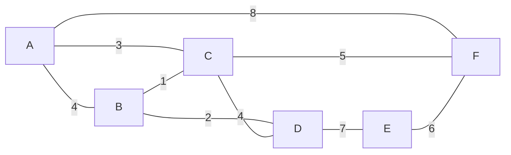
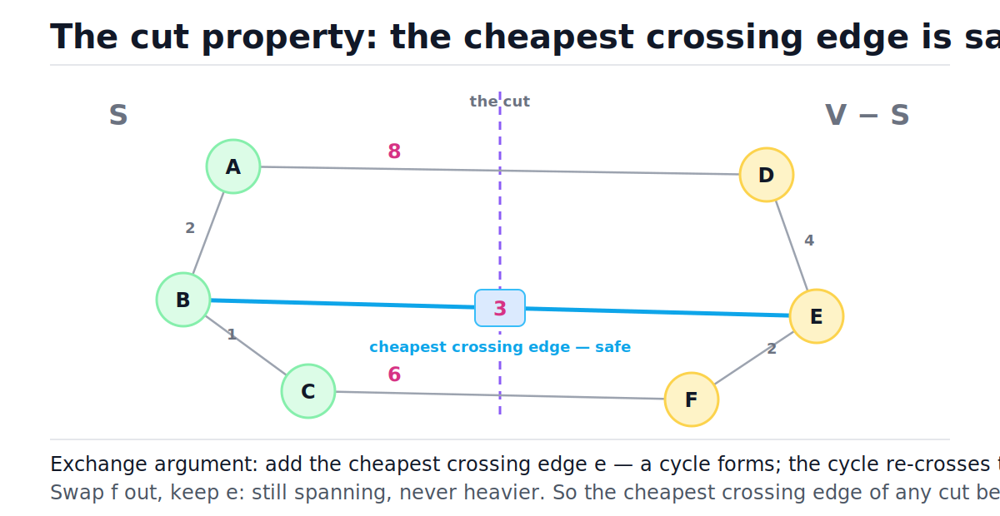
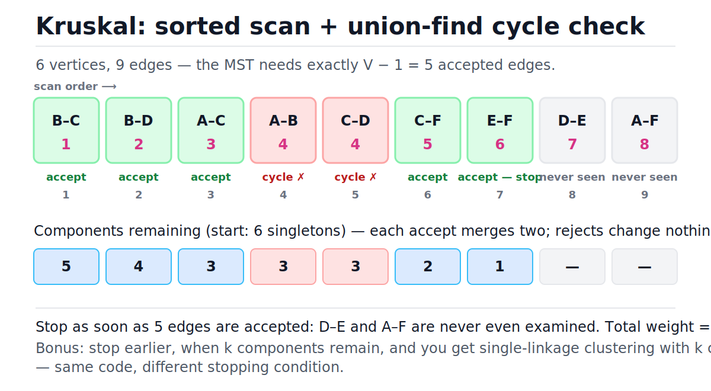
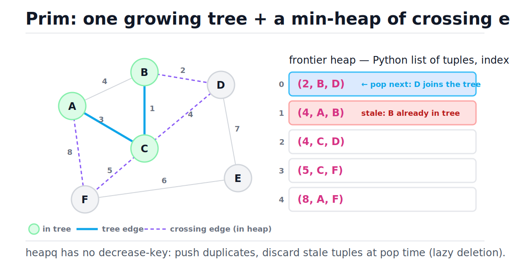
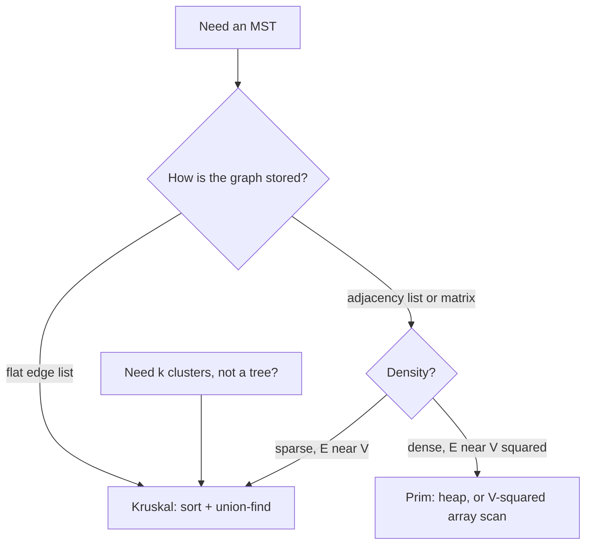

# Minimum Spanning Trees

[toc]

> **TL;DR:** A minimum spanning tree (MST) connects all V vertices of a weighted undirected graph using exactly V − 1 edges of minimum total weight. One theorem — the cut property — proves that greedy works: the cheapest edge crossing any cut is always safe to take. Kruskal exploits it by scanning edges in sorted order with union-find (O(E log E)); Prim exploits it by growing one tree with a min-heap of crossing edges (O(E log V)).

## Vocabulary

Every term below is load-bearing for the rest of the note. The symbols follow CLRS conventions: G = (V, E) is an undirected graph with edge weights w(e).

**Spanning tree**

```math
T \subseteq E, \quad |T| = |V| - 1, \quad T \text{ connected and acyclic}
```

A subset of edges that touches every vertex, has no cycles, and is connected. Any two of those three properties imply the third.

**Minimum spanning tree (MST)**

```math
T^{*} = \arg\min_{T \in \mathcal{T}(G)} \sum_{e \in T} w(e)
```

The spanning tree whose total edge weight is smallest among all spanning trees of G. The minimum *weight* is always unique; the tree itself is unique whenever all edge weights are distinct.

**Cut**

```math
(S, \; V \setminus S), \quad \emptyset \neq S \subsetneq V
```

A partition of the vertices into two non-empty sides. Every algorithm in this note is secretly choosing a cut and taking its cheapest crossing edge.

**Crossing edge**

```math
e = (u, v) \in E, \quad u \in S, \; v \in V \setminus S
```

An edge with one endpoint on each side of a cut. The minimum-weight crossing edge of a cut is called the **light edge** for that cut.

**Union-find component**

```math
\mathrm{find}(u) = \mathrm{find}(v) \iff u, v \text{ already connected by accepted edges}
```

The disjoint-set structure Kruskal uses to answer "would this edge close a cycle?" in near-constant time. Full treatment in [Union-Find / Disjoint Sets](./14-union-find-disjoint-sets.md).

**Frontier**

```math
\{(u, v) \in E : u \in T_{\text{so far}}, \; v \notin T_{\text{so far}}\}
```

The crossing edges of the cut between Prim's partially built tree and everything else. Prim keeps the frontier in a min-heap.

**Inverse Ackermann function**

```math
\alpha(n) \le 4 \quad \text{for every } n \text{ that fits in the physical universe}
```

The amortized cost of a union-find operation with union by rank and path compression. Treat it as a constant.

## Intuition

You own six buildings and must lay cable so every building can reach every other, possibly through intermediaries. Cable costs money per trench, so you want the cheapest set of trenches that still connects everything. Redundant trenches (cycles) are pure waste — the answer is always a tree, and the cheapest such tree is the MST.

The running example for this whole note is the graph below: 6 vertices, 9 weighted edges. Its MST has total weight 17.



> [!IMPORTANT]
> One theorem powers everything in this note. **Cut property:** for any cut, the cheapest crossing edge belongs to some MST. Kruskal and Prim are just two different schedules for applying it — neither needs any other correctness argument.

## How it works

Both algorithms maintain a growing set of accepted edges that is always a subset of some MST, and both use the cut property to justify each greedy accept. They differ only in *which cut* they consult at each step: Kruskal uses the cut separating the two components an edge would merge; Prim always uses the cut around its single growing tree.

### The cut property

Pick any cut of the graph. Among the edges crossing it, let e be the cheapest. The claim is that e is *safe*: there exists an MST containing e, so a greedy algorithm can accept it without ever regretting the choice. The proof is a two-line exchange argument.

```math
\begin{aligned}
&\text{Let } T \text{ be an MST with } e \notin T. \text{ Adding } e \text{ to } T \text{ creates a cycle.} \\
&\text{The cycle crosses the cut at least twice, so it contains another crossing edge } f. \\
&T' = T \cup \{e\} \setminus \{f\} \text{ is a spanning tree, and } \\
&w(T') = w(T) + w(e) - w(f) \le w(T) \quad \text{since } w(e) \le w(f). \\
&\text{So } T' \text{ is an MST containing } e. \;\blacksquare
\end{aligned}
```

The figure shows the argument visually: three edges cross the cut, and the weight-3 edge is the light edge. If a supposed MST omitted it, you could swap it in for the weight-6 or weight-8 edge on the resulting cycle and only get cheaper.



> [!NOTE]
> The argument never assumes weights are non-negative. Negative edge weights are perfectly fine for MSTs — unlike [Dijkstra](./16-shortest-paths-dijkstra-and-bellman-ford.md), which breaks on them.

### Kruskal's algorithm

Kruskal sorts all edges by ascending weight, then scans once: accept an edge if and only if its endpoints are currently in *different* union-find components. An accept merges two components; a reject means the edge would close a cycle. Correctness follows from the cut property applied to the cut that isolates one endpoint's component — the scanned edge is the cheapest crossing edge of that cut, because every cheaper edge was already processed.

The cycle test is the whole trick, and union-find makes it nearly free. Here is the compact implementation (see [Union-Find / Disjoint Sets](./14-union-find-disjoint-sets.md) for the full theory).

```python
class UnionFind:
    """Disjoint sets with union by rank and path halving."""

    def __init__(self, n: int) -> None:
        self.parent: list[int] = list(range(n))
        self.rank: list[int] = [0] * n

    def find(self, x: int) -> int:
        while self.parent[x] != x:
            self.parent[x] = self.parent[self.parent[x]]  # path halving
            x = self.parent[x]
        return x

    def union(self, a: int, b: int) -> bool:
        ra, rb = self.find(a), self.find(b)
        if ra == rb:
            return False  # same component: this edge would close a cycle
        if self.rank[ra] < self.rank[rb]:
            ra, rb = rb, ra
        self.parent[rb] = ra
        if self.rank[ra] == self.rank[rb]:
            self.rank[ra] += 1
        return True


uf = UnionFind(4)
assert uf.union(0, 1) is True
assert uf.union(1, 0) is False  # already connected -> cycle edge
assert uf.find(0) == uf.find(1)
```

Kruskal itself is a five-line loop on top of that. Sorting dominates at O(E log E); the union-find work is O(E α(V)), effectively linear.

```python
def kruskal(
    n: int, edges: list[tuple[int, int, int]]
) -> tuple[int, list[tuple[int, int, int]]]:
    """Min spanning tree of an undirected graph. edges: (weight, u, v).

    Returns (total_weight, mst_edges). Time O(E log E), space O(V + E).
    """
    uf = UnionFind(n)
    mst: list[tuple[int, int, int]] = []
    total = 0
    for w, u, v in sorted(edges):  # O(E log E) -- dominates everything
        if uf.union(u, v):  # amortized O(alpha(V)) ~ O(1)
            mst.append((w, u, v))
            total += w
            if len(mst) == n - 1:  # a spanning tree has V-1 edges: stop
                break
    return total, mst


# A=0 B=1 C=2 D=3 E=4 F=5 -- the example graph
EDGES = [
    (4, 0, 1), (3, 0, 2), (8, 0, 5),
    (1, 1, 2), (2, 1, 3),
    (4, 2, 3), (5, 2, 5),
    (7, 3, 4),
    (6, 4, 5),
]

total, mst = kruskal(6, EDGES)
assert total == 17
assert len(mst) == 5
assert set(mst) == {(1, 1, 2), (2, 1, 3), (3, 0, 2), (5, 2, 5), (6, 4, 5)}
```

Trace on the example graph. Watch the component sets shrink from 6 singletons toward 1; rejected edges change nothing.

| Step | Edge (w) | find(u) vs find(v) | Decision | Components after |
| :---: | :--- | :--- | :--- | :--- |
| 1 | B–C (1) | different | accept | {A} {B C} {D} {E} {F} |
| 2 | B–D (2) | different | accept | {A} {B C D} {E} {F} |
| 3 | A–C (3) | different | accept | {A B C D} {E} {F} |
| 4 | A–B (4) | same | reject — cycle | {A B C D} {E} {F} |
| 5 | C–D (4) | same | reject — cycle | {A B C D} {E} {F} |
| 6 | C–F (5) | different | accept | {A B C D F} {E} |
| 7 | E–F (6) | different | accept — 5 edges, stop | {A B C D E F} |

The figure shows the same scan as a strip: green accepts, red cycle-rejects, and two gray edges that are never even examined because the tree completed early.



> [!TIP]
> Kruskal is the interview default: it is shorter to write, it doubles as the answer to "detect a cycle while adding edges", and stopping early at k components turns it into a clustering algorithm for free (see the real-world example below).

### Prim's algorithm

Prim grows a *single* tree from an arbitrary start vertex. At every step the relevant cut is (tree-so-far, everything-else); the cut property says the cheapest crossing edge is safe, so Prim pops it from a min-heap of frontier edges and absorbs the new vertex. Python's `heapq` has no decrease-key, so we use the *lazy* variant: push duplicate entries freely and discard stale ones — entries whose far endpoint already joined the tree — at pop time.

```python
import heapq
from collections import defaultdict


def prim(
    n: int, edges: list[tuple[int, int, int]], start: int = 0
) -> tuple[int, list[tuple[int, int, int]]]:
    """Lazy Prim: binary heap of crossing edges, stale entries skipped on pop.

    Returns (total_weight, mst_edges as (w, parent, child)). Time O(E log E).
    """
    adj: defaultdict[int, list[tuple[int, int]]] = defaultdict(list)
    for w, u, v in edges:
        adj[u].append((w, v))
        adj[v].append((w, u))

    in_tree = [False] * n
    in_tree[start] = True
    heap = [(w, start, v) for w, v in adj[start]]
    heapq.heapify(heap)  # O(deg(start))

    total = 0
    mst: list[tuple[int, int, int]] = []
    while heap and len(mst) < n - 1:
        w, u, v = heapq.heappop(heap)  # O(log E)
        if in_tree[v]:
            continue  # stale: v joined the tree via a cheaper edge
        in_tree[v] = True
        mst.append((w, u, v))
        total += w
        for w2, nxt in adj[v]:
            if not in_tree[nxt]:
                heapq.heappush(heap, (w2, v, nxt))  # O(log E)
    return total, mst


p_total, p_mst = prim(6, EDGES)
assert p_total == 17  # same weight as Kruskal -- MST weight is unique
assert sorted(w for w, _, _ in p_mst) == [1, 2, 3, 5, 6]
```

Trace from start vertex A. The heap column shows logical (sorted) content; steps 4–5 are pure stale-discards that do no tree work.

| Step | Popped (w, u→v) | v in tree? | Decision | Heap after |
| :---: | :--- | :---: | :--- | :--- |
| 0 | — (init from A) | — | push A's edges | (3,A,C) (4,A,B) (8,A,F) |
| 1 | (3, A→C) | no | accept C; push C's edges | (1,C,B) (4,A,B) (4,C,D) (5,C,F) (8,A,F) |
| 2 | (1, C→B) | no | accept B; push (2,B,D) | (2,B,D) (4,A,B) (4,C,D) (5,C,F) (8,A,F) |
| 3 | (2, B→D) | no | accept D; push (7,D,E) | (4,A,B) (4,C,D) (5,C,F) (7,D,E) (8,A,F) |
| 4 | (4, A→B) | yes | stale — discard | (4,C,D) (5,C,F) (7,D,E) (8,A,F) |
| 5 | (4, C→D) | yes | stale — discard | (5,C,F) (7,D,E) (8,A,F) |
| 6 | (5, C→F) | no | accept F; push (6,F,E) | (6,F,E) (7,D,E) (8,A,F) |
| 7 | (6, F→E) | no | accept E — 5 edges, stop | (7,D,E) (8,A,F) |

The figure freezes the algorithm between steps 2 and 3: tree = {A, B, C}, four dashed crossing edges, and the heap holding one stale entry that will be discarded when it surfaces.



> [!WARNING]
> Forgetting the `if in_tree[v]: continue` stale check is the classic lazy-Prim bug. The code still runs, but it re-accepts vertices through duplicate heap entries, appends more than V − 1 edges, and silently overcounts the total weight.

### Kruskal vs Prim

Both are correct on any connected weighted undirected graph, so the choice is about input shape and constant factors. Kruskal wants a flat edge list and thrives on sparse graphs; Prim wants an adjacency structure and wins on dense graphs, especially the O(V²) array-scan variant that skips the heap entirely when E ≈ V².

| Criterion | Kruskal | Prim |
| :--- | :--- | :--- |
| Input shape it wants | flat edge list | adjacency list / matrix |
| Sweet spot | sparse (E close to V) | dense (E close to V²) |
| Core structure | sort + union-find | min-heap of frontier edges |
| Time | O(E log E) | O(E log V) lazy; O(V²) array variant for dense |
| Handles disconnected graph | yes — yields a minimum spanning *forest* | no — spans only the start component per run |
| Early-stop bonus | stop at k components → k clusters | stop at k accepted edges → tree of k+1 nearest vertices |
| Code length | shorter (if union-find is on hand) | longer, but no extra data structure beyond `heapq` |



> [!NOTE]
> On a disconnected graph there is no spanning tree at all. Kruskal degrades gracefully into a **minimum spanning forest** — one MST per component — while Prim must be restarted once per component, exactly like BFS/DFS connected-components sweeps in [Graphs: BFS and DFS](./09-graphs-bfs-and-dfs.md).

## Complexity

Sorting dominates Kruskal; heap traffic dominates Prim. Union-find contributes only the inverse-Ackermann term, which is constant in practice. All bounds below assume the graph is connected, so E ≥ V − 1.

| Operation / algorithm | Best | Average | Worst | Space |
| :--- | :---: | :---: | :---: | :---: |
| Sort edge list ([Timsort](./11-comparison-sorting-algorithms.md)) | O(E) pre-sorted | O(E log E) | O(E log E) | O(E) |
| `find` / `union` (rank + path compression) | O(1) | O(α(V)) amortized | O(α(V)) amortized | O(V) |
| Kruskal (sort + union-find) | O(E) pre-sorted input | O(E log E) | O(E log E) | O(V + E) |
| Kruskal, edges given pre-sorted | O(E α(V)) | O(E α(V)) | O(E α(V)) | O(V) |
| `heappush` / `heappop` | O(1) / O(log E) | O(log E) | O(log E) | — |
| Prim, lazy (binary heap, this note) | O(E) star graph | O(E log E) | O(E log E) | O(E) heap |
| Prim, eager (indexed heap, decrease-key) | O(E log V) | O(E log V) | O(E log V) | O(V) heap |
| Prim, dense array scan (no heap) | O(V²) | O(V²) | O(V²) | O(V) |
| Borůvka (component-merge rounds) | O(E) one round | O(E log V) | O(E log V) | O(V + E) |

The key identity is that O(E log E) and O(E log V) are the same bound, because a simple graph cannot have more than V² edges.

```math
E \le \binom{V}{2} < V^{2}
\;\;\Rightarrow\;\;
\log E < \log V^{2} = 2 \log V
\;\;\Rightarrow\;\;
O(E \log E) = O(E \log V)
```

Why each piece: Kruskal's sort costs E log E comparisons and nothing afterward exceeds E near-constant union-find calls, so the sort is the whole bill. Lazy Prim pushes each edge at most twice (once per endpoint), so the heap holds O(E) entries and each of the O(E) pops costs log E — hence E log E, equal to E log V by the identity above. The eager variant caps the heap at one entry per *vertex* by doing decrease-key, trading code complexity for O(V) heap space; see [Heaps and Priority Queues](./08-heaps-and-priority-queues.md) for why decrease-key needs an index map.

## Memory model in Python

The asymptotics above hide CPython constant factors that matter at scale. Knowing where the pointers live explains why "O(E log E)" Kruskal in pure Python is roughly 50–100× slower than the same algorithm in C, and why the sort is still usually the *fastest* part.

- **Edge list = list of tuples.** A `list[tuple[int, int, int]]` is a contiguous array of pointers to heap-allocated `PyTupleObject`s, each holding three more pointers to boxed `PyLongObject` ints. Iterating it pointer-chases through three levels; nothing is cache-contiguous. Details in [Memory Model and PyObject Layout](../Programming-Languages/Python/13-memory-model-and-pyobject-layout.md).
- **`sorted(edges)` is Timsort in C.** The loop and swaps run at C speed, but every comparison is a `PyObject_RichCompare` on tuples, which compares element-by-element until a tie breaks. Distinct first elements (weights) keep comparisons cheap — one int compare each.
- **`heapq` is C-accelerated.** The heap is a plain Python list used as an implicit binary tree (children of index i at 2i+1 and 2i+2). Sift-up/sift-down run in the `_heapq` C module, so lazy Prim's heap traffic is cheaper per operation than hand-written Python comparisons would be.
- **Union-find is two flat lists of ints.** `parent` and `rank` are arrays of pointers to small ints, most of which hit CPython's small-int cache (−5 to 256) for small graphs. Path compression keeps `find` chains 1–2 hops, so the lists are effectively random-access — this is the most cache-friendly structure in the whole algorithm.
- **At production scale, leave pure Python.** For millions of edges use `scipy.sparse.csgraph.minimum_spanning_tree`, which runs on CSR arrays of unboxed numbers — contiguous memory, no per-edge object allocation.

> [!TIP]
> Sorting tuples is faster than sorting with a `key=lambda` because the lambda adds a Python-level function call per element. Putting the weight *first* in the tuple makes the natural sort order the one you want — that is why every signature in this note is `(weight, u, v)` and not `(u, v, weight)`.

## Real-world example

Scenario: a campus has 6 buildings and a quote (in thousands of dollars) for trenching fiber between each feasible pair. Wire every building into one network for minimum total cost. This is the MST verbatim — and the same `kruskal` function, stopped early, also solves a second real problem: grouping sensors into k spatial clusters (single-linkage clustering, the basis of image-segmentation methods like Felzenszwalb–Huttenlocher).

```python
import math

# --- problem 1: cheapest fiber plan (uses kruskal + UnionFind from above) ---
COSTS = [
    (12, 0, 1), (7, 0, 2), (25, 0, 5),
    (3, 1, 2), (9, 1, 3),
    (13, 2, 3), (16, 2, 5),
    (21, 3, 4),
    (18, 4, 5),
]
cable_total, cable_plan = kruskal(6, COSTS)
assert cable_total == 53  # = 3 + 7 + 9 + 16 + 18 (thousand)
assert len(cable_plan) == 5  # exactly V - 1 trenches


# --- problem 2: k clusters = Kruskal stopped at k components ---
def k_clusters(points: list[tuple[float, float]], k: int) -> list[set[int]]:
    """Single-linkage clustering: run Kruskal, stop at k components."""
    n = len(points)
    edges: list[tuple[float, int, int]] = []
    for i in range(n):
        for j in range(i + 1, n):
            edges.append((math.dist(points[i], points[j]), i, j))

    uf = UnionFind(n)
    remaining = n
    for _, i, j in sorted(edges):  # O(n^2 log n) on n points
        if remaining == k:
            break
        if uf.union(i, j):
            remaining -= 1

    groups: dict[int, set[int]] = {}
    for i in range(n):
        groups.setdefault(uf.find(i), set()).add(i)
    return list(groups.values())


# two tight clumps far apart -> k=2 recovers them exactly
sensors = [(0.0, 0.0), (1.0, 0.0), (0.0, 1.0),
           (10.0, 10.0), (11.0, 10.0), (10.0, 11.0)]
clusters = k_clusters(sensors, 2)
assert {frozenset(c) for c in clusters} == {frozenset({0, 1, 2}),
                                            frozenset({3, 4, 5})}

# k=1 just finishes the MST: everything in one component
assert len(k_clusters(sensors, 1)) == 1
```

The clustering connection is worth internalizing: the MST edges, sorted descending, are the "weakest links" of the dataset. Deleting the k − 1 most expensive MST edges leaves exactly k components, and those components maximize the minimum inter-cluster distance — a provably optimal greedy, again by the cut property. MSTs also serve as approximation building blocks: the classic 2-approximation for metric TSP is "build the MST, walk it depth-first, shortcut repeated vertices".

## When to use / When NOT to use

Reach for an MST when the problem says "connect everything, minimize total cost" — and recognize its disguises: clustering, bottleneck minimization, approximation scaffolding. Avoid it when the problem is actually about paths, directions, or redundancy.

**Use it when:**

- Minimum-cost connectivity: cabling, pipelines, road networks, circuit routing (LeetCode 1584, 1135).
- Clustering: stop Kruskal at k components for single-linkage k-clustering.
- Minimax / bottleneck questions: the MST path between any two vertices minimizes the *maximum* edge weight en route.
- Approximation algorithms: 2-approx metric TSP, Steiner-tree heuristics.

**Do NOT use it when:**

- You need shortest *paths* — that is [Dijkstra / Bellman-Ford](./16-shortest-paths-dijkstra-and-bellman-ford.md); an MST path between two vertices can be arbitrarily longer than the shortest path.
- The graph is directed — the analog is a minimum arborescence (Chu–Liu/Edmonds), a different algorithm entirely.
- You need fault tolerance — a tree has zero redundancy; any single edge failure partitions it. Network design with survivability needs k-connectivity, not an MST.
- All weights are equal — any spanning tree is minimal; plain BFS/DFS finds one in O(V + E).

## Common mistakes

- **"The MST contains the shortest path between every pair"** — false. The MST minimizes *total* weight; an individual MST path can be much longer than the direct shortest path. What the MST path does minimize is the maximum single edge on the route (the bottleneck).
- **"Negative weights break MST algorithms"** — false. The cut property's exchange argument never uses non-negativity. Kruskal and Prim are correct with negative weights; it is Dijkstra that breaks.
- **"Prim is just Dijkstra"** — same skeleton (grow a set, pop a min-heap), different key. Prim keys on the *edge weight* crossing the frontier; Dijkstra keys on the *total distance from the source*. Swapping the key changes what you compute.
- **"Kruskal requires fully sorting the edges"** — you can `heapify` the edge list in O(E) and pop lazily, or stop the sorted scan after V − 1 accepts. On the example graph, 2 of 9 edges are never examined.
- **"Lazy Prim works without the stale check"** — it appends duplicate vertices and overcounts weight. Every pop must verify the far endpoint is still outside the tree.
- **"Ties in weights make the answer ambiguous"** — multiple MSTs may exist, but they all have the same total weight. If all weights are distinct, the MST is unique.

## Interview questions and answers

A short setup, then how I would actually say the answer out loud.

**1. Greedy algorithms usually fail. Why does greedy provably work for MSTs?**
**Answer:** Because of the cut property. At every step, both Kruskal and Prim accept the cheapest edge crossing some cut, and the exchange argument shows such an edge always extends to a full MST: add it to any MST that lacks it, a cycle forms, the cycle re-crosses the cut at a no-cheaper edge, swap that edge out, and the tree never got heavier. So no greedy accept can ever need undoing. Deeper reason: spanning forests form a matroid, and greedy is optimal on matroids.

**2. When would you pick Kruskal over Prim, and vice versa?**
**Answer:** Kruskal if I am handed a flat edge list or the graph is sparse — sort once, union-find the rest, less code. Prim if I already have an adjacency structure or the graph is dense; for E near V² I would use the array-scan Prim at O(V²), which beats E log V there. And if the problem smells like clustering, Kruskal automatically, because stopping early at k components is the answer.

**3. The graph has negative edge weights. What changes?**
**Answer:** Nothing. The cut property never assumes non-negative weights, so Kruskal and Prim are both still correct. The trap in this question is conflating MST with shortest paths — Dijkstra breaks on negative weights, MST algorithms do not.

**4. Is the MST unique?**
**Answer:** The minimum total weight is always unique, but the tree achieving it may not be. If all edge weights are distinct, the MST is unique — for each cut there is a single light edge and every MST must contain it. With ties you can have several MSTs, all with equal total weight.

**5. Can the MST differ from the shortest-path tree from a source?**
**Answer:** Yes, and I would give a triangle: AB = 1, BC = 1, AC = 1.9. The MST is {AB, BC} with weight 2. But the shortest-path tree from A includes AC, because the direct 1.9 beats the 2.0 route through B. Different objectives: total tree weight versus per-vertex distance from the source.

**6. The graph might be disconnected. What does each algorithm do?**
**Answer:** No spanning tree exists, so the right output is a minimum spanning forest. Kruskal produces it with zero changes — just drop the V − 1 early-exit and let the scan finish. Prim only spans the start vertex's component, so I would wrap it in a loop over unvisited vertices, like a connected-components sweep.

**7. You already have the MST and a new edge gets added to the graph. Recompute from scratch?**
**Answer:** No — O(V) update. Tentatively add the new edge to the tree; that creates exactly one cycle. Walk the cycle (a tree path between the new edge's endpoints, found by DFS) and delete the maximum-weight edge on it. If the deleted edge is the new one, the MST is unchanged.

**8. Edges arrive already sorted by weight. What is Kruskal's complexity now?**
**Answer:** O(E α(V)) — effectively linear. Sorting was the entire E log E cost; what remains is one union-find operation per edge, and with union by rank plus path compression each is amortized inverse-Ackermann, which is at most 4 for any realistic input.

**9. How would you compute an MST on a graph too big for one machine?**
**Answer:** Borůvka is the parallel-friendly answer: every component picks its cheapest outgoing edge simultaneously, all picks are safe by the cut property, components at least halve each round, so log V rounds. That maps cleanly onto MapReduce-style or GPU execution. Single machine but huge edge list: external-sort the edges, then stream them through Kruskal, since union-find state is only O(V).

## Practice path

Ordered drills; each one builds on the previous.

1. Implement `UnionFind` from memory; verify `union` returns `False` on an edge that would close a cycle.
2. Run Kruskal on this note's 6-vertex graph *by hand*, reproducing the trace table, before re-reading the code.
3. Implement lazy Prim with `heapq`; assert it returns total 17 on the same graph and that the edge set matches Kruskal's.
4. LeetCode 1584 (Min Cost to Connect All Points): solve it twice, once per algorithm, and time both on the largest test.
5. LeetCode 1135 (Connecting Cities With Minimum Cost): Kruskal plus the disconnected-graph check (return −1 if accepts < V − 1).
6. Modify your Kruskal into `k_clusters` and verify the two-clump sensor example splits correctly at k = 2.
7. LeetCode 1489 (Find Critical and Pseudo-Critical Edges): forces you to reason about edge inclusion/exclusion with the cut property.
8. Benchmark: random sparse (E = 4V) vs dense (E = V²/4) graphs at V = 2000; observe Kruskal win the first and array-Prim the second.

## Copyable takeaways

- MST = connect all V vertices, V − 1 edges, minimum total weight; answer is always a tree because cycles are pure waste.
- One theorem runs everything: **cut property** — the cheapest edge crossing any cut is in some MST (exchange argument).
- **Kruskal:** sort edges ascending, accept iff endpoints are in different union-find components. O(E log E), and the sort is the entire cost.
- **Prim:** grow one tree, min-heap of frontier edges, lazy-discard stale entries on pop. O(E log V); array variant O(V²) for dense graphs.
- O(E log E) = O(E log V) because E < V² implies log E < 2 log V.
- Sparse graph or flat edge list → Kruskal. Dense graph or adjacency at hand → Prim.
- Stop Kruskal at k components → single-linkage k-clustering, free.
- Negative weights fine; MST ≠ shortest paths; directed graphs need a different algorithm (Edmonds).

## Sources

- Cormen, Leiserson, Rivest, Stein — *Introduction to Algorithms*, 3rd ed., Chapter 23 "Minimum Spanning Trees" (cut property, Kruskal, Prim).
- Sedgewick & Wayne — *Algorithms*, 4th ed., §4.3 MSTs: <https://algs4.cs.princeton.edu/43mst/> (lazy vs eager Prim distinction used in this note).
- Kruskal, J. B. (1956). "On the Shortest Spanning Subtree of a Graph and the Traveling Salesman Problem." *Proceedings of the American Mathematical Society* 7(1).
- Prim, R. C. (1957). "Shortest Connection Networks and Some Generalizations." *Bell System Technical Journal* 36(6).
- Python `heapq` documentation (binary heap on a list, no decrease-key): <https://docs.python.org/3/library/heapq.html>
- SciPy `minimum_spanning_tree` (production-scale CSR implementation): <https://docs.scipy.org/doc/scipy/reference/generated/scipy.sparse.csgraph.minimum_spanning_tree.html>

## Related

- [Union-Find / Disjoint Sets](./14-union-find-disjoint-sets.md) — the cycle detector inside Kruskal.
- [Heaps and Priority Queues](./08-heaps-and-priority-queues.md) — the frontier structure inside Prim.
- [Graphs: BFS and DFS](./09-graphs-bfs-and-dfs.md) — graph representations and traversal foundations.
- [Shortest Paths: Dijkstra and Bellman-Ford](./16-shortest-paths-dijkstra-and-bellman-ford.md) — Prim's near-twin with a different heap key.
- [Greedy Algorithms](./20-greedy-algorithms.md) — why exchange arguments certify greedy choices.
- [DSA Curriculum Index](./00-dsa-curriculum-index.md)
