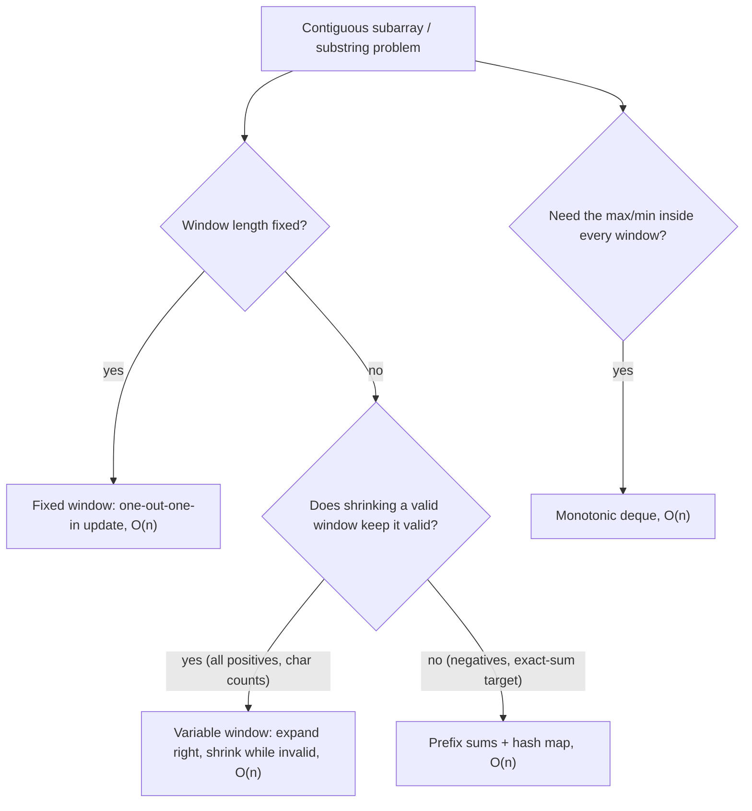
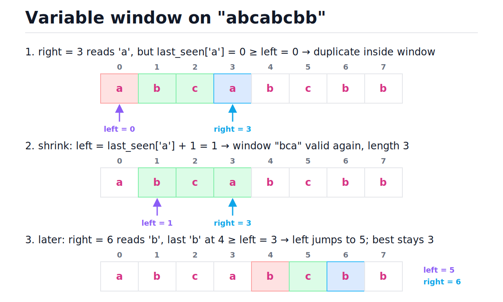
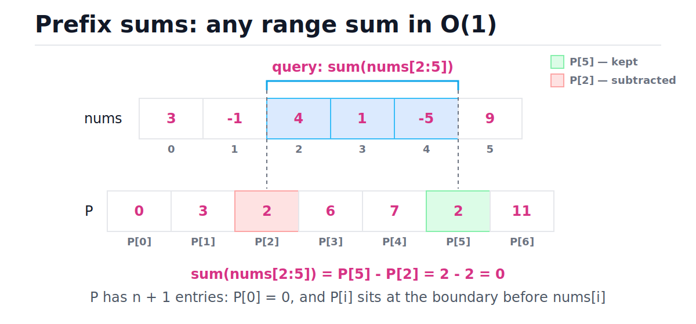
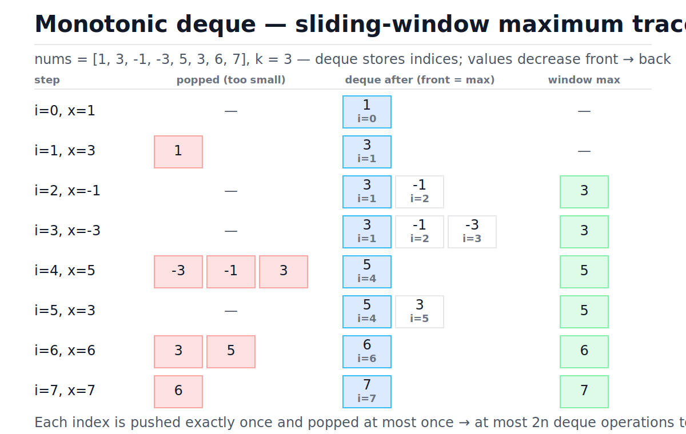

# Sliding Window and Prefix Sums

[toc]

> **TL;DR:** Sliding windows and prefix sums are the two great O(n²)-to-O(n) reducers for contiguous subarray and substring problems. A window slides two boundaries across the data and updates a running aggregate instead of recomputing it; a prefix-sum array precomputes cumulative totals so any range sum is one subtraction. Know the failure mode: variable-window shrink logic requires monotonicity, which negative numbers break — that is exactly when prefix sums plus a hash map take over.

## Vocabulary

Every term below appears repeatedly in this note and in interview problem statements. Read the symbols once now; the rest of the note assumes them. The half-open convention (include left edge, exclude right edge) matches Python slicing and removes a whole class of off-by-one bugs.

**Window**

```math
a_{\ell}, a_{\ell+1}, \ldots, a_{r}
```

A contiguous slice of the array between two moving boundaries, left and right. The window carries a running aggregate — sum, character counts, max — updated incrementally instead of recomputed from scratch.

**Fixed-size window**

```math
r - \ell + 1 = k
```

A window whose length is pinned to k. Each slide admits exactly one new element and evicts exactly one old one — the "one-out-one-in" update.

**Variable-size window**

```math
\text{valid}(\ell, r) \implies \text{valid}(\ell + 1, r)
```

A window whose length adapts. The right edge always advances; the left edge advances only while the window violates the problem's constraint. The implication above is the monotonicity requirement: shrinking a valid window must keep it valid.

**Prefix sum array**

```math
P_0 = 0, \qquad P_i = \sum_{t=0}^{i-1} a_t
```

An array of n + 1 entries where P[i] holds the sum of the first i elements. Built once in O(n), queried forever in O(1).

**Range sum**

```math
\sum_{t=i}^{j-1} a_t = P_j - P_i
```

The sum of the half-open slice a[i:j], answered by a single subtraction. Everything between two prefixes cancels out.

**Monotonic deque**

```math
\text{nums}[d_0] > \text{nums}[d_1] > \cdots > \text{nums}[d_m]
```

A double-ended queue of indices whose values are kept strictly decreasing. The front is always the current window maximum; both ends support O(1) push and pop.

**Amortized analysis**

```math
\frac{\text{total operations over the whole run}}{n} = O(1) \text{ per element}
```

Charging cost to elements instead of loop iterations. The inner while loops in this note look nested, but each element pays a constant total across the entire scan, so the whole pass is O(n).

## Intuition

The brute-force answer to "best contiguous subarray" enumerates every (start, end) pair: O(n²) pairs, often O(n³) if each is re-summed. Almost all of that work is redundant — consecutive subarrays share nearly all their elements. The two patterns here exploit that overlap in different ways. A window keeps the shared part and only touches the elements that enter or leave. Prefix sums pay O(n) once so that any range, anywhere, ever, costs O(1).



> [!IMPORTANT]
> Both patterns require **contiguity**. If the problem says "subsequence" (elements may be skipped), neither applies — reach for [dynamic programming](./19-dynamic-programming.md) or [greedy](./20-greedy-algorithms.md) instead.

## How it works

### Fixed-size window: maximum sum of size k

When the window length is given, sliding it one step right changes exactly two elements: one enters, one leaves. So instead of re-summing k elements per position — O(nk) total — update the running sum with one add and one subtract. The update rule is the whole trick.

```math
S_{\text{new}} = S_{\text{old}} + a_{r} - a_{r-k}
```

The code seeds the sum with the first k elements, then slides. Time O(n), space O(1).

```python
def max_sum_fixed_window(nums: list[int], k: int) -> int:
    window = sum(nums[:k])          # O(k) seed
    best = window
    for right in range(k, len(nums)):
        window += nums[right] - nums[right - k]   # one in, one out
        best = max(best, window)
    return best

assert max_sum_fixed_window([2, 1, 5, 1, 3, 2], 3) == 9   # [5, 1, 3]
assert max_sum_fixed_window([-2, -1, -3], 2) == -3        # negatives are fine here
```

Trace on nums = [2, 1, 5, 1, 3, 2] with k = 3. Note each row does constant work regardless of k.

| Step | right | out | in | window sum | best | Decision |
| :---: | :---: | :---: | :---: | :---: | :---: | :--- |
| seed | — | — | 2, 1, 5 | 8 | 8 | sum first k elements |
| 1 | 3 | 2 | 1 | 8 − 2 + 1 = 7 | 8 | 7 < 8, keep best |
| 2 | 4 | 1 | 3 | 7 − 1 + 3 = 9 | 9 | new best |
| 3 | 5 | 5 | 2 | 9 − 5 + 2 = 6 | 9 | keep best |

> [!NOTE]
> Fixed windows tolerate negative numbers because nothing is conditional — the window always moves exactly one step. It is the *variable* window's shrink decision that negatives poison, as shown two sections down.

### Variable-size window: longest substring without repeats

When the window length is the thing being optimized, both edges move. The invariant loop is always the same shape: advance right by one each iteration; while the window is invalid, advance left. Here the invariant is "no repeated characters," and a hash map from character to its last-seen index lets left jump directly past the duplicate instead of crawling.

The figure shows the two interesting moments on "abcabcbb": right reads a character already inside the window (red cell = stale duplicate, blue cell = incoming), and left jumps just past it. Watch how left never moves backward.



```python
def longest_unique_substring(s: str) -> int:
    last_seen: dict[str, int] = {}   # char -> most recent index
    left = 0
    best = 0
    for right, ch in enumerate(s):
        if ch in last_seen and last_seen[ch] >= left:
            left = last_seen[ch] + 1        # jump past the duplicate
        last_seen[ch] = right
        best = max(best, right - left + 1)
    return best

assert longest_unique_substring("abcabcbb") == 3   # "abc"
assert longest_unique_substring("bbbbb") == 1
assert longest_unique_substring("pwwkew") == 3     # "wke"
```

Full trace on "abcabcbb". The `last_seen[ch] >= left` guard matters: a stale entry *behind* left is not a duplicate, because it is no longer inside the window.

| Step | right | char | duplicate in window? | left | window | best |
| :---: | :---: | :---: | :--- | :---: | :---: | :---: |
| 1 | 0 | a | no | 0 | a | 1 |
| 2 | 1 | b | no | 0 | ab | 2 |
| 3 | 2 | c | no | 0 | abc | 3 |
| 4 | 3 | a | yes, last_seen[a]=0 ≥ 0 | 1 | bca | 3 |
| 5 | 4 | b | yes, last_seen[b]=1 ≥ 1 | 2 | cab | 3 |
| 6 | 5 | c | yes, last_seen[c]=2 ≥ 2 | 3 | abc | 3 |
| 7 | 6 | b | yes, last_seen[b]=4 ≥ 3 | 5 | cb | 3 |
| 8 | 7 | b | yes, last_seen[b]=6 ≥ 5 | 7 | b | 3 |

The same skeleton with a `while` shrink solves "shortest subarray with sum ≥ target" for **positive** numbers — shrink while the window is still over target, recording the length each time it qualifies.

```python
def min_subarray_len(target: int, nums: list[int]) -> int:
    """Shortest subarray with sum >= target; 0 if none. POSITIVE nums only."""
    left = 0
    window = 0
    best = len(nums) + 1
    for right, x in enumerate(nums):
        window += x
        while window >= target:              # shrink while still valid
            best = min(best, right - left + 1)
            window -= nums[left]
            left += 1
    return 0 if best > len(nums) else best

assert min_subarray_len(7, [2, 3, 1, 2, 4, 3]) == 2   # [4, 3]
assert min_subarray_len(100, [1, 2, 3]) == 0
```

### When the window breaks: negative numbers

The shrink decision is a bet: "this window is over target, and removing elements only ever lowers the sum, so shrinking is safe." With all-positive numbers that bet is monotone and always pays. A negative number breaks it — removing a negative *raises* the sum, and a window that looks hopeless now can become valid after absorbing more elements. The two-pointer logic discards starting positions it can never revisit, because left never moves backward.

```python
def brute_force_min_len(target: int, nums: list[int]) -> int:
    n = len(nums)
    best = n + 1
    for i in range(n):
        running = 0
        for j in range(i, n):
            running += nums[j]
            if running >= target:
                best = min(best, j - i + 1)
                break
    return 0 if best > n else best

tricky = [84, -37, 32, 40, 95]
assert brute_force_min_len(167, tricky) == 3   # [32, 40, 95] = 167
assert min_subarray_len(167, tricky) == 5      # the window answer is WRONG
```

The window scans 84, 47, 79, 119, 214, finally hits 214 ≥ 167 with the full array, shrinks once to 130, and stops — it never reconsiders starting at index 2, so it reports 5 instead of 3.

> [!WARNING]
> Before writing `while window >= target: shrink`, ask: can the data contain negatives (or zeros, for product problems)? If yes, the variable window is silently wrong — it compiles, runs, and passes the all-positive test cases. Use prefix sums with a hash map (next two sections), or a monotonic deque over prefix sums for the ≥-target variant (LeetCode 862).

### Prefix sums: range sums in O(1)

A prefix-sum array trades O(n) space for O(1) range queries. P[i] is the sum of the first i elements, with P[0] = 0 as a sentinel; the array has n + 1 entries. The off-by-one convention to internalize: P[i] covers indices 0 through i − 1, so it conceptually sits at the *boundary before* nums[i].

In the figure, the P row is drawn offset by half a cell so each P entry lands on an element boundary. The query bracket over nums[2:5] runs exactly from P[2]'s boundary to P[5]'s boundary — subtracting the red prefix from the green prefix cancels everything outside the bracket.



```math
\sum_{t=i}^{j-1} a_t = (a_0 + \cdots + a_{j-1}) - (a_0 + \cdots + a_{i-1}) = P_j - P_i
```

Build is O(n), every query after that is O(1). Negatives are no problem — subtraction does not care about sign.

```python
from itertools import accumulate

def build_prefix(nums: list[int]) -> list[int]:
    prefix = [0] * (len(nums) + 1)
    for i, x in enumerate(nums):
        prefix[i + 1] = prefix[i] + x
    return prefix

def range_sum(prefix: list[int], i: int, j: int) -> int:
    """Sum of nums[i:j] — half-open, exactly like Python slicing."""
    return prefix[j] - prefix[i]

nums = [3, -1, 4, 1, -5, 9]
P = build_prefix(nums)
assert P == [0, 3, 2, 6, 7, 2, 11]
assert range_sum(P, 2, 5) == sum(nums[2:5]) == 0
assert range_sum(P, 0, 6) == sum(nums) == 11
assert list(accumulate(nums, initial=0)) == P    # stdlib one-liner
```

> [!TIP]
> In production Python, `itertools.accumulate(nums, initial=0)` builds the prefix array in C-speed iteration, and NumPy's `cumsum` does it vectorized. Hand-roll the loop in interviews; reach for the library at work.

Stick to half-open everywhere: P[j] − P[i] is the sum of nums[i:j], exactly like slicing. If you mix half-open prefixes with inclusive queries you end up writing P[j] − P[i−1], and that −1 is where off-by-one bugs breed.

### Subarray sum equals k: count the prefixes you have seen

"Exactly equals k" cannot be windowed even with positives-only data in the counting case, and negatives kill it outright. Prefix sums reframe it as a lookup problem: a subarray nums[l:r] sums to k exactly when P[r] − P[l] = k. So while scanning left to right with a running prefix P[r], the number of valid subarrays ending at r is the number of *earlier* prefixes equal to P[r] − k. A hash map counting seen prefixes answers that in O(1) — this is [Two Sum](../Leetcode/1-two-sum.md) played on the prefix array.

```math
P_r - P_l = k \iff P_l = P_r - k
```

```python
def count_subarrays_with_sum(nums: list[int], k: int) -> int:
    seen = {0: 1}        # empty prefix: subarrays starting at index 0
    prefix = 0
    count = 0
    for x in nums:
        prefix += x
        count += seen.get(prefix - k, 0)          # query BEFORE inserting
        seen[prefix] = seen.get(prefix, 0) + 1
    return count

assert count_subarrays_with_sum([1, 1, 1], 2) == 2
assert count_subarrays_with_sum([1, 2, 3], 3) == 2          # [1,2] and [3]
assert count_subarrays_with_sum([3, 4, 7, 2, -3, 1, 4, 2], 7) == 4
```

Trace on nums = [3, 4, 7, 2, −3, 1, 4, 2], k = 7. Negatives are handled for free — note the prefix value 14 occurring twice, which is what makes [7, 2, −3, 1] count.

| Step | x | prefix | look up prefix − k | hit count | total | seen after |
| :---: | :---: | :---: | :---: | :---: | :---: | :--- |
| 1 | 3 | 3 | −4 | 0 | 0 | {0:1, 3:1} |
| 2 | 4 | 7 | 0 | 1 | 1 | {…, 7:1} |
| 3 | 7 | 14 | 7 | 1 | 2 | {…, 14:1} |
| 4 | 2 | 16 | 9 | 0 | 2 | {…, 16:1} |
| 5 | −3 | 13 | 6 | 0 | 2 | {…, 13:1} |
| 6 | 1 | 14 | 7 | 1 | 3 | {…, 14:2} |
| 7 | 4 | 18 | 11 | 0 | 3 | {…, 18:1} |
| 8 | 2 | 20 | 13 | 1 | 4 | {…, 20:1} |

> [!CAUTION]
> Two ordering bugs ruin this algorithm. Query the map *before* inserting the current prefix, or k = 0 will match every subarray against itself. And seed `seen = {0: 1}`, or every subarray that starts at index 0 is silently dropped.

### Monotonic deque: sliding-window maximum

"Max of each window of size k" defeats the running-sum trick — when the max leaves the window you cannot "subtract" it; you must know the runner-up. The monotonic deque keeps exactly the candidates that could still matter: indices whose values are strictly decreasing. A new element evicts everything smaller than it from the back (those can never be a future max while the new element is around and is younger), and the front is evicted when its index slides out of the window. Front = current max, always.

The figure traces every step on [1, 3, −1, −3, 5, 3, 6, 7] with k = 3. Watch step i=4: one incoming 5 evicts three entries at once, yet across the whole scan each index is pushed once and popped at most once.



```python
from collections import deque

def sliding_window_max(nums: list[int], k: int) -> list[int]:
    dq: deque[int] = deque()             # indices; values strictly decreasing
    out: list[int] = []
    for i, x in enumerate(nums):
        while dq and nums[dq[-1]] <= x:  # back is dominated: smaller AND older
            dq.pop()
        dq.append(i)
        if dq[0] <= i - k:               # front fell out of the window
            dq.popleft()
        if i >= k - 1:
            out.append(nums[dq[0]])      # front is the max
    return out

assert sliding_window_max([1, 3, -1, -3, 5, 3, 6, 7], 3) == [3, 3, 5, 5, 6, 7]
assert sliding_window_max([9, 8, 7], 1) == [9, 8, 7]
```

Storing **indices** rather than values is load-bearing: only an index can tell you whether the front has aged out of the window. Flip the comparison to `>=` and you get sliding-window *minimum*.

## Complexity

Every pattern in this note is a single left-to-right pass with O(1) amortized work per element. The table contrasts them with the brute force they replace; the derivation below it is the amortized argument that justifies the nested-looking loops.

| Pattern | Time (best) | Time (average) | Time (worst) | Space |
| :--- | :---: | :---: | :---: | :---: |
| Brute force, all subarrays re-summed | O(n³) | O(n³) | O(n³) | O(1) |
| Brute force, running sum per start | O(n²) | O(n²) | O(n²) | O(1) |
| Fixed window | O(n) | O(n) | O(n) | O(1) |
| Variable window (with char map) | O(n) | O(n) | O(n) | O(min(n, alphabet size)) |
| Prefix-sum build | O(n) | O(n) | O(n) | O(n) |
| Range-sum query (after build) | O(1) | O(1) | O(1) | O(1) |
| Subarray sum = k (prefix + hash map) | O(n) | O(n) | O(n²) adversarial hashes | O(n) |
| Monotonic deque window max | O(n) | O(n) | O(n) | O(k) |

The variable window and the deque share one amortized argument. Right advances exactly n times. Left only ever moves forward, so it advances at most n times total across all iterations of the inner while loop — not per iteration. Same for the deque: each index is pushed exactly once and popped at most once.

```math
T(n) \;\le\; \underbrace{n}_{\text{right advances}} \;+\; \underbrace{n}_{\text{left advances, total}} \;+\; \underbrace{2n}_{\text{deque pushes + pops}} \;=\; O(n)
```

The hash-map worst case is the standard caveat: CPython dict operations are O(1) expected but degrade to O(n) per operation under adversarial collisions, making subarray-sum-equals-k O(n²) in theory. With Python's SipHash-randomized string hashing and integer keys in practice, treat it as O(n) — see [Hash Tables](./05-hash-tables.md).

## Memory model in Python

The asymptotics above hide constant factors that CPython makes unusually visible. Every value in these algorithms is a heap-allocated PyObject, and the containers hold pointers, not values — see [Memory Model and PyObject Layout](../Programming-Languages/Python/13-memory-model-and-pyobject-layout.md) for the full story. Three details matter for these patterns specifically.

- **The prefix list is an array of pointers.** A `list[int]` of n + 1 prefixes is a contiguous block of 8-byte pointers to boxed int objects (28 bytes each for small values). `P[j] - P[i]` is two pointer dereferences plus an object allocation for the result. Small ints from −5 to 256 are interned singletons, so tiny prefixes alias shared objects; large running totals allocate fresh ints every step. For numeric-heavy production paths, `array('q')` or NumPy stores raw 8-byte machine ints contiguously — cache-friendly and 3–10x smaller.
- **`collections.deque` is a doubly linked list of 64-pointer blocks** (CPython `Modules/_collectionsmodule.c`). Both `append`/`pop` and `appendleft`/`popleft` are true O(1) with no reallocation — unlike `list.pop(0)`, which shifts every remaining element in O(n). The price: indexing the middle of a deque is O(n) block-hopping, which is why the algorithm only ever touches `dq[0]` and `dq[-1]`.
- **The `last_seen` / `seen` dicts are open-addressing hash tables** kept under ~2/3 load, insertion-ordered since CPython 3.7. Each probe is a hash, a masked index into a sparse index table, and a pointer chase into the entries array — O(1) expected but several cache misses per lookup. For the substring problem the map never exceeds the alphabet size, so it stays in L1.

> [!TIP]
> If a window computation is a hot path — rolling metrics over millions of samples — drop to `itertools.accumulate`, `numpy.cumsum`, or a C-backed ring buffer. The algorithm stays identical; only the per-element constant changes by an order of magnitude. See [Performance and the Standard Library](../Programming-Languages/Python/10-performance-and-the-standard-library.md).

## Real-world example

A traffic dashboard ingests one request count per second. Two queries dominate: "find the busiest 60-second span this hour" (alerting) and ad-hoc "how many requests between t1 and t2?" (drill-down). One prefix array serves both: the busiest fixed window is a scan of O(1) range queries, and every dashboard drill-down is a single subtraction instead of an O(n) re-sum.

```python
import random

random.seed(42)
counts = [random.randint(0, 50) for _ in range(3600)]   # one hour, per second

prefix = [0] * (len(counts) + 1)                        # build once: O(n)
for i, c in enumerate(counts):
    prefix[i + 1] = prefix[i] + c

def requests_between(t1: int, t2: int) -> int:
    """Total requests in [t1, t2) — O(1) per dashboard query."""
    return prefix[t2] - prefix[t1]

k = 60                                                  # busiest 60s span: O(n)
best, best_start = prefix[k] - prefix[0], 0
for start in range(1, len(counts) - k + 1):
    window = prefix[start + k] - prefix[start]
    if window > best:
        best, best_start = window, start

assert requests_between(0, 3600) == sum(counts)
assert requests_between(best_start, best_start + k) == best
assert best == max(sum(counts[s:s + k]) for s in range(len(counts) - k + 1))
```

This same shape appears in rate limiters (sliding-window counters — see [Rate Limiting and Load Shedding](../System-Design/10-rate-limiting-and-load-shedding.md)), moving averages in monitoring pipelines, and database query planners estimating row counts from cumulative histograms.

## When to use / When NOT to use

Pattern recognition is most of the battle here. The trigger phrase is "contiguous subarray/substring" plus an aggregate; the disqualifiers are just as important to memorize.

**Use it when:**

- "Max/min/count over every subarray of size k" — fixed window, O(n).
- "Longest/shortest subarray satisfying a constraint" where shrinking a valid window keeps it valid (all-positive sums, character counts, at-most-k distinct) — variable window, O(n).
- "Sum of arbitrary ranges, many queries, array never changes" — prefix sums: O(n) build, O(1) per query.
- "How many subarrays sum to exactly k," negatives allowed — prefix counts in a hash map, O(n).
- "Max or min of each window" — monotonic deque, O(n).

**Do NOT use it when:**

- The problem says **subsequence**, not subarray — contiguity is the whole foundation.
- Sums with **negative numbers** and a shrink condition — the monotone bet fails; switch to prefix sums (exact k) or a deque over prefixes (≥ k).
- The array **mutates between range queries** — a stale prefix array is O(n) to rebuild per update; use a Fenwick or segment tree for O(log n) updates and queries (see [Binary Search Trees and Balanced Trees](./07-binary-search-trees-and-balanced-trees.md) for the balanced-tree mindset).
- The two pointers walk **toward each other from both ends** — that is the sorted-array meet-in-the-middle pattern, covered in [Two Pointers](./24-two-pointers.md), not a window.

## Common mistakes

- **"The nested while loop makes it O(n²)"** — left only moves forward, at most n steps across the *entire* scan. Total work is ≤ 2n. Amortized analysis, not per-iteration counting.
- **"The variable window works on any numbers"** — negative numbers break the shrink invariant; the code returns wrong answers while passing all-positive tests. Prove monotonicity or switch to prefix sums.
- **"The prefix array has n entries"** — it has n + 1. Dropping the P[0] = 0 sentinel forces a special case for ranges starting at index 0, and that special case is where the bugs live.
- **"Insert the prefix into the map, then query"** — query first. With k = 0, inserting first makes every position match its own prefix and overcounts.
- **"Store values in the monotonic deque"** — store indices. Without indices you cannot detect that the front has slid out of the window.
- **"Forgot the `>= left` guard in the substring problem"** — a stale `last_seen` entry behind left is not a duplicate; jumping to it moves left *backward* and corrupts the window.
- **"`list.pop(0)` is a fine deque"** — it is O(n) per pop, turning the deque algorithm into O(n²). Use `collections.deque`.

## Interview questions and answers

The patterns in this note headline some of the most-asked interview problems in existence. The questions below probe whether you understand *why* the patterns work, which is what separates a memorized solution from a hire signal.

**1. Why is the variable sliding window O(n) when it contains a nested while loop?**
**Answer:** Because the inner loop's total work is bounded globally, not per iteration. Left starts at 0, only ever increments, and can never pass right, so across the whole scan it moves at most n times. Add right's n moves and you get at most 2n pointer advances — amortized O(1) per element, O(n) overall.

**2. When does a sliding window fail on a sum constraint, and what do you use instead?**
**Answer:** When the array can contain negative numbers. The shrink step assumes removing an element always decreases the sum, so once a window is shrunk that start index is gone forever — but a negative element means the sum is not monotone in the window boundaries, and the discarded start might have been the answer. For exact-sum-k use prefix sums with a hash map; for shortest-subarray-with-sum-at-least-k with negatives, use a monotonic deque over the prefix array.

**3. Why does the prefix array have n + 1 entries instead of n?**
**Answer:** The leading P[0] = 0 sentinel makes every range uniform: sum of nums[i:j] is always P[j] − P[i], including ranges that start at index 0. Without it you special-case i = 0, and in the counting algorithm the equivalent move is seeding the map with {0: 1} so subarrays starting at the first element are counted.

**4. In subarray-sum-equals-k, why do you query the hash map before inserting the current prefix?**
**Answer:** The map must only contain prefixes strictly to the left of the current position, because a subarray needs positive length. If you insert first, then with k = 0 the current prefix matches itself and you count an empty subarray at every index.

**5. Why does the monotonic deque store indices instead of values?**
**Answer:** Two reasons. The eviction-from-the-front rule needs ages: you pop the front when its index is at most i − k, which values alone cannot tell you. And given an index you can always recover the value with nums[i], so indices strictly dominate.

**6. Can you solve sliding-window maximum with a heap instead of a deque?**
**Answer:** Yes, with a max-heap of (value, index) pairs and lazy deletion — pop the top while its index is outside the window. That is O(n log n) because stale entries pile up, versus O(n) for the deque. It is a fine fallback if the monotonic invariant doesn't come to mind, and the lazy-deletion idea generalizes; see [Heaps and Priority Queues](./08-heaps-and-priority-queues.md).

**7. How do you extend prefix sums to 2-D for rectangle-sum queries?**
**Answer:** Build P with one extra row and column where P[i][j] is the sum of the rectangle from the origin to cell (i−1, j−1). Any rectangle is then four lookups by inclusion–exclusion: bottom-right minus the strip above, minus the strip to the left, plus the doubly subtracted top-left corner. Build O(mn), query O(1) — that's LeetCode 304.

**8. The array is updated between range-sum queries. Still prefix sums?**
**Answer:** No — every point update invalidates O(n) prefix entries, so interleaved updates and queries cost O(n) each. A Fenwick (binary indexed) tree or segment tree gives O(log n) for both. Prefix sums are the immutable-array special case; the moment writes appear, change structures.

## Practice path

Drill these in order — each adds exactly one idea to the last.

1. **Fixed window warm-up:** LeetCode 643 *Maximum Average Subarray I* — pure one-out-one-in.
2. **Variable window with a map:** LeetCode 3 *Longest Substring Without Repeating Characters* — re-derive the `>= left` guard yourself.
3. **Shrink-while-valid:** LeetCode 209 *Minimum Size Subarray Sum* — then explain aloud why negatives would break your solution.
4. **Prefix + hash map:** LeetCode 560 *Subarray Sum Equals K* — get the {0: 1} seed and query-before-insert order right from memory.
5. **Immutable range queries:** LeetCode 303 *Range Sum Query — Immutable*, then 304 for the 2-D extension.
6. **Monotonic deque:** LeetCode 239 *Sliding Window Maximum* — trace the deque on paper before coding.
7. **Boss fight:** LeetCode 76 *Minimum Window Substring* (variable window with need/have counters), then LeetCode 862 *Shortest Subarray with Sum at Least K* — the problem that needs windows AND prefix sums AND a monotonic deque at once.

## Copyable takeaways

- Sliding window and prefix sums turn O(n²)/O(n³) contiguous-subarray scans into O(n): windows reuse the overlap between consecutive subarrays; prefixes precompute it.
- Fixed window: seed with the first k, then `window += a[r] - a[r-k]`. O(n) time, O(1) space. Negatives are fine.
- Variable window: right always advances; left advances while invalid. Valid only if shrinking a valid window keeps it valid — all-positive sums and count constraints qualify, negatives do not.
- The nested while loop is amortized O(n): left moves forward at most n times total.
- Prefix sums: P has n + 1 entries, P[0] = 0, sum of nums[i:j] = P[j] − P[i]. Half-open, like slicing. O(n) build, O(1) query, immutable arrays only.
- Subarray sum equals k: count earlier prefixes equal to P[r] − k in a hash map; seed {0: 1}; query before insert. Handles negatives. O(n).
- Sliding-window max: deque of indices with strictly decreasing values; evict dominated entries from the back, expired entries from the front; front is the max. O(n) total, O(k) space.
- In CPython: `collections.deque` is O(1) at both ends (block-linked list), `list.pop(0)` is O(n), and prefix lists hold pointers to boxed ints — use `accumulate`/NumPy on hot paths.

## Sources

- Jon Bentley, *Programming Pearls*, 2nd ed., Column 8 "Algorithm Design Techniques" — the classic prefix-sums treatment of the maximum-subarray progression from O(n³) to O(n).
- CPython docs, `collections.deque`: [docs.python.org/3/library/collections.html#collections.deque](https://docs.python.org/3/library/collections.html#collections.deque) — O(1) appends/pops at both ends.
- CPython docs, `itertools.accumulate`: [docs.python.org/3/library/itertools.html#itertools.accumulate](https://docs.python.org/3/library/itertools.html#itertools.accumulate)
- Python wiki, *Time Complexity*: [wiki.python.org/moin/TimeComplexity](https://wiki.python.org/moin/TimeComplexity) — list vs deque operation costs.
- CPython source, `Modules/_collectionsmodule.c` — deque's 64-slot block-linked-list layout.

## Related

- [Two Pointers](./24-two-pointers.md) — the sibling pattern where pointers converge from both ends instead of sliding together.
- [Hash Tables](./05-hash-tables.md) — subarray-sum-equals-k is exactly this trick applied to prefixes.
- [Hash Tables](./05-hash-tables.md) — why the prefix-count map is O(1) expected and what the worst case costs.
- [Stacks and Queues](./04-stacks-and-queues.md) — the deque underlying the monotonic-window technique.
- [Arrays and Dynamic Arrays](./02-arrays-and-dynamic-arrays.md) — the memory layout that makes single-pass scans cache-friendly.
- [Big-O Notation and Complexity Analysis](./01-big-o-notation-and-complexity-analysis.md) — the amortized-analysis reasoning used throughout this note.
