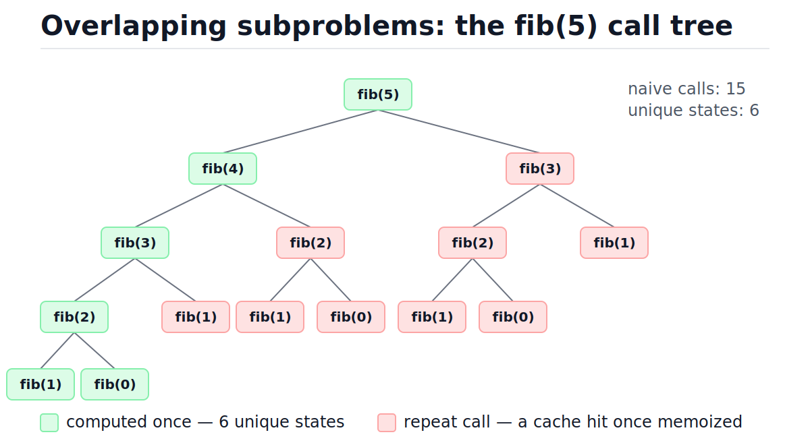
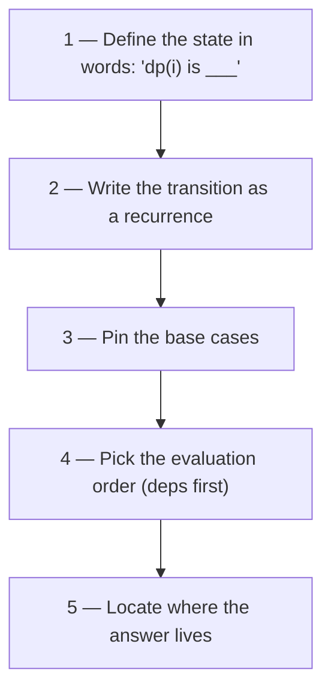
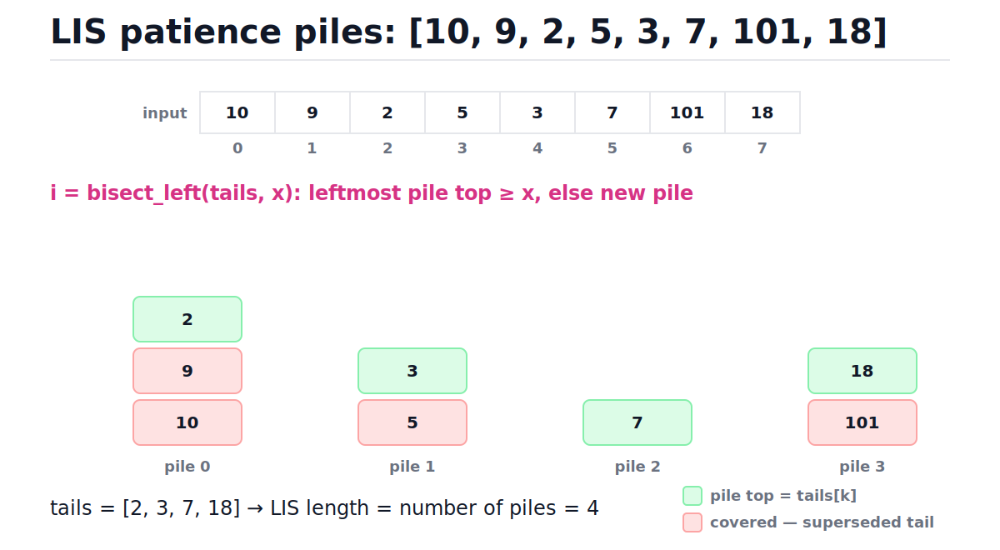
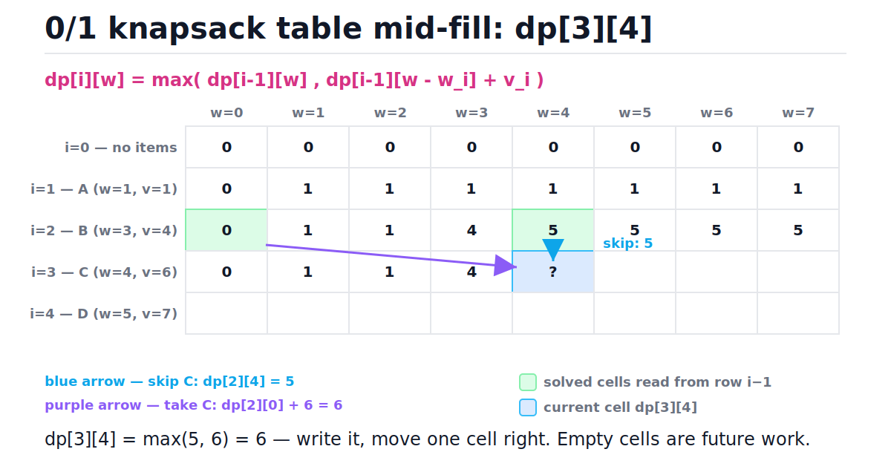

# Dynamic Programming

[toc]

> **TL;DR:** Dynamic programming is recursion plus memory: when a brute-force recursion re-solves the same subproblems over and over, cache each answer and pay for it once. The whole craft is a five-step framework — define the state in words, write the recurrence, pin the base cases, pick an evaluation order, locate the answer. Runtime is almost always number-of-states × cost-of-one-transition.

## Vocabulary

These terms carry the whole note. Every worked classic below is just these ten ideas instantiated with different states and recurrences.

**Dynamic programming (DP)**

```math
\text{time} \approx (\#\text{states}) \times (\text{cost of one transition})
```

A technique that solves a problem by combining cached answers to overlapping subproblems. It applies when the problem has overlapping subproblems and optimal substructure.

**State**

```math
dp(i), \quad dp(a), \quad dp(i, c)
```

The minimal summary of "where you are" that determines the answer to the rest of the problem. If two execution paths reach the same state, everything after is identical — that is what makes caching legal.

**Transition (recurrence)**

```math
dp(i) = f\bigl(dp(j_1), \dots, dp(j_k)\bigr), \quad \text{each } j \text{ strictly smaller than } i
```

The rule that builds a state's answer from already-solved smaller states. One transition per choice you could make at that state.

**Base case**

```math
dp(0) = \text{known constant}
```

The states small enough to answer without recursion. Wrong base cases corrupt every cell built on them, so check them first when a DP gives wrong answers.

**Overlapping subproblems**

```math
F(n) = F(n-1) + F(n-2) \;\Rightarrow\; F(n-2) \text{ is needed twice}
```

The same subproblem appears on multiple branches of the brute-force recursion tree. This is what caching exploits; without it, DP buys nothing over plain recursion.

**Optimal substructure**

```math
\text{OPT}(S) = \min_{\text{first choice}} \bigl( \text{cost of choice} + \text{OPT}(S') \bigr)
```

An optimal solution is built from optimal solutions to subproblems. If a globally optimal answer could require a *suboptimal* sub-answer, the recurrence is unsound.

**Memoization (top-down)**

```math
\text{cache}[\text{args}] \leftarrow \text{result on first computation}
```

Write the natural recursion, then cache results keyed by arguments. Only reachable states get computed; evaluation order is handled by the call stack.

**Tabulation (bottom-up)**

```math
dp[0],\, dp[1],\, \dots,\, dp[n] \quad \text{filled in dependency order}
```

Replace recursion with loops that fill an array from base cases upward. Every state is computed, but there is no recursion-depth limit and constant factors are smaller.

**Rolling array**

```math
dp_i \text{ depends only on } dp_{i-1} \;\Rightarrow\; \text{keep } O(1) \text{ rows}
```

A space optimization: when each row of the table only reads the previous row, store one or two rows instead of all of them.

**Pseudo-polynomial time**

```math
O(nW) = O\bigl(n \cdot 2^{b}\bigr), \quad b = \text{bits needed to store } W
```

A bound polynomial in a numeric *value* (like knapsack capacity W) rather than in the input *length*. It is exponential in the number of bits, which is why 0/1 knapsack stays NP-hard despite its tidy table.

## Intuition

Run naive recursive Fibonacci and watch the call tree. The figure below shows fib(5): fifteen calls, but only six distinct inputs — fib(0) through fib(5). The tree re-derives fib(3) twice and fib(2) three times, and the duplication doubles with each level, which is exactly why naive fib is exponential. Look at the green nodes: those are the only computations that carry new information.



DP is the observation that a function with no side effects can be cached: same arguments, same answer, forever. Bolt a dict onto the recursion and the red nodes become O(1) lookups. The tree collapses into a DAG with one node per unique state.

```python
from functools import lru_cache

@lru_cache(maxsize=None)
def fib(n: int) -> int:
    if n < 2:
        return n
    return fib(n - 1) + fib(n - 2)

assert fib(10) == 55
assert fib(50) == 12586269025      # naive recursion would take ~hours; this is instant
```

That one decorator takes fib from Θ(φⁿ) to O(n) — about 1.618ⁿ calls down to n + 1. Everything else in this note is learning to *see* the cacheable state in problems that don't hand it to you.

> [!NOTE]
> The name is marketing, not math. Richard Bellman coined "dynamic programming" in the 1950s partly because it sounded impressive and inoffensive to a funding-hostile Secretary of Defense — "programming" here means *planning* (as in linear programming), not coding.

## How it works

A problem qualifies for DP when two properties hold. Check them explicitly — each has a concrete test — then apply the five-step framework to extract the state and recurrence.

### Property 1: overlapping subproblems

Sketch the brute-force recursion tree for a small input and look for repeated nodes. If the tree has exponentially many calls but only polynomially many *distinct* argument tuples, caching collapses it.

**How to check:** count distinct argument tuples the recursion can ever see. For fib(n) the argument is one integer in 0..n, so at most n + 1 states despite ~φⁿ calls. Contrast with mergesort: its subproblems (disjoint array halves) never repeat, so memoizing it buys nothing — that is why mergesort is [divide and conquer](./10-recursion-and-divide-and-conquer.md), not DP.

### Property 2: optimal substructure

The optimal answer must decompose into optimal answers of subproblems. The test is a cut-and-paste argument: assume the optimal solution uses a *suboptimal* sub-answer, swap in the better sub-answer, and show the total strictly improves — a contradiction.

**How to check:** shortest path has it — if the shortest path A→C goes through B, the A→B prefix must itself be shortest, or you could splice in a shorter prefix. *Longest simple path does not*: gluing two longest simple sub-paths can revisit a vertex, making the combined path invalid. When the check fails, the state is usually missing information (you may need to enlarge it) or the problem needs a different technique entirely.

### The five-step state framework

Every DP solution answers the same five questions, in order. Skipping straight to code is how off-by-one bugs and wrong loop orders happen; the framework makes each decision explicit and checkable.



Running the framework on climbing stairs ("how many ways to climb n steps taking 1 or 2 at a time"):

1. **State in words:** ways(n) is the number of distinct ways to stand on step n.
2. **Transition:** the last move was a 1-step from n−1 or a 2-step from n−2, and those sets are disjoint:

```math
\text{ways}(n) = \text{ways}(n-1) + \text{ways}(n-2)
```

3. **Base cases:** ways(0) = 1 (the empty climb), ways(1) = 1.
4. **Order:** increasing n — each value needs only smaller ones.
5. **Answer:** ways(n), the last cell.

> [!IMPORTANT]
> Step 1 is the load-bearing one. If you cannot finish the sentence "dp(i) is ___" in plain words, the recurrence you write will be wrong in ways that pass small tests. State first, code last.

### Top-down: memoization with functools.lru_cache

Write the recursion exactly as the recurrence reads, and let `functools.lru_cache` be the cache. CPython implements `lru_cache` in C: it builds a hashable key from the argument tuple and stores results in a dict, so a hit costs one hash plus one lookup. With `maxsize=None` there is no LRU bookkeeping at all — it is a plain dict, the fastest option when you want to keep everything.

```python
from functools import lru_cache

def min_coins_topdown(coins: tuple, amount: int) -> int:
    @lru_cache(maxsize=None)
    def dp(a: int) -> int:
        if a == 0:
            return 0
        best = amount + 1                      # sentinel: worse than any real answer
        for c in coins:
            if c <= a:
                best = min(best, dp(a - c) + 1)
        return best

    result = dp(amount)
    return -1 if result > amount else result

assert min_coins_topdown((1, 2, 5), 11) == 3   # 5 + 5 + 1
assert min_coins_topdown((2,), 3) == -1
```

Arguments must be hashable — note the `tuple` for coins. Lists, dicts, and sets raise `TypeError` as cache keys.

### Bottom-up: tabulation

Tabulation inverts control: you fill an array from the base cases up, in an order where every dependency is ready before it is read. No recursion means no stack-depth limit and no per-call overhead — just array indexing in a loop. The cost is that you must derive the evaluation order yourself, and you compute *every* state, reachable or not.

```python
def fib_tab(n: int) -> int:
    """Bottom-up Fibonacci. O(n) time, O(1) space via two rolling variables."""
    if n < 2:
        return n
    prev, cur = 0, 1
    for _ in range(n - 1):
        prev, cur = cur, prev + cur
    return cur

assert fib_tab(10) == 55
assert fib_tab(50) == 12586269025
assert fib_tab(0) == 0 and fib_tab(1) == 1
```

### Tradeoffs: memoization vs tabulation

Both compute the same states and the same asymptotic bounds; the differences are operational. Default to top-down while exploring a problem (it mirrors the recurrence exactly), then convert to bottom-up when depth, speed, or memory matters.

| Dimension | Top-down (memoization) | Bottom-up (tabulation) |
| :--- | :--- | :--- |
| Code shape | Recursion mirroring the recurrence | Explicit loops |
| States computed | Only states actually reachable | Every state in the table |
| Stack | Recursion depth = state-chain length; CPython default limit ~1000 | None |
| Constant factors | Function call + hash per state | Array indexing — noticeably faster in CPython |
| Space optimization | Hard — the cache keeps everything | Easy — rolling arrays drop old rows |
| Evaluation order | Automatic (call stack resolves it) | You must derive it |

> [!WARNING]
> Top-down DP on a chain-shaped state space (like dp(n) → dp(n−1)) recurses n deep. In CPython that means `RecursionError` near n = 1000 by default. For inputs beyond a few hundred, tabulate or raise the limit deliberately with `sys.setrecursionlimit` — and know that each CPython frame is a real heap allocation.

## Worked classics

Six problems cover the standard state shapes: a 1D index, a 1D value, an index-with-comparison, a 2D items-by-capacity grid, and two 2D string grids. For each: state in words, recurrence, runnable code, complexity.

### Climbing stairs — O(n) time, O(1) space

The "hello world" of DP and secretly Fibonacci. State: ways(n) = number of ways to reach step n; the last hop came from n−1 or n−2 and the two sets cannot overlap, so add them.

```math
\text{ways}(n) = \text{ways}(n-1) + \text{ways}(n-2), \qquad \text{ways}(0) = \text{ways}(1) = 1
```

Since each value depends on only the previous two, keep two variables instead of a table — the simplest rolling-array optimization.

```python
def climb_stairs(n: int) -> int:
    """Ways to reach step n by 1- or 2-steps. O(n) time, O(1) space."""
    a, b = 1, 1                  # ways(0), ways(1)
    for _ in range(2, n + 1):
        a, b = b, a + b
    return b

assert climb_stairs(2) == 2      # 1+1, 2
assert climb_stairs(3) == 3      # 1+1+1, 1+2, 2+1
assert climb_stairs(10) == 89
```

### Coin change (minimum coins) — O(amount × coins)

Given coin denominations and a target amount, find the fewest coins that sum to it. State: dp(a) = minimum coins to make amount a. The last coin used was some c, so try every denomination and take the best.

```math
dp(a) = 1 + \min_{c \,\in\, \text{coins},\; c \le a} dp(a - c), \qquad dp(0) = 0
```

Unreachable amounts need a sentinel. Use the integer `amount + 1` rather than `float("inf")` — it stays an int and can never be mistaken for a real answer, since no answer uses more than `amount` coins.

```python
def coin_change(coins: list, amount: int) -> int:
    """Minimum coins summing to amount, or -1. O(amount * len(coins)) time, O(amount) space."""
    INF = amount + 1                       # cleaner sentinel than float('inf')
    dp = [0] + [INF] * amount              # dp[a] = min coins to make amount a
    for a in range(1, amount + 1):
        for c in coins:
            if c <= a and dp[a - c] + 1 < dp[a]:
                dp[a] = dp[a - c] + 1
    return -1 if dp[amount] == INF else dp[amount]

assert coin_change([1, 2, 5], 11) == 3     # 5 + 5 + 1
assert coin_change([2], 3) == -1
assert coin_change([1], 0) == 0
```

The filled table for coins [1, 2, 5], amount 11. Greedy "largest coin first" happens to match DP here, but change the system to coins [1, 3, 4] with amount 6 and greedy answers 3 (4+1+1) while DP finds 2 (3+3) — DP tries everything; greedy gambles:

| a     | 0 | 1 | 2 | 3 | 4 | 5 | 6 | 7 | 8 | 9 | 10 | 11 |
| :---- | :-: | :-: | :-: | :-: | :-: | :-: | :-: | :-: | :-: | :-: | :-: | :-: |
| dp[a] | 0 | 1 | 1 | 2 | 2 | 1 | 2 | 2 | 3 | 3 | 2  | 3  |

### Longest increasing subsequence — O(n²), then O(n log n)

Find the length of the longest strictly increasing subsequence (not necessarily contiguous). The natural state must record where the subsequence *ends*, because whether you can extend depends on the last element: dp(i) = length of the longest increasing subsequence ending exactly at index i.

```math
dp(i) = 1 + \max\bigl(\{0\} \cup \{\, dp(j) : j < i,\; \text{nums}[j] < \text{nums}[i] \,\}\bigr)
```

The answer is the max over all i, since the LIS ends somewhere. Scanning all j < i for each i gives O(n²):

```python
def lis_quadratic(nums: list) -> int:
    """Longest strictly increasing subsequence. O(n^2) time, O(n) space."""
    if not nums:
        return 0
    dp = [1] * len(nums)                   # dp[i] = LIS ending exactly at i
    for i in range(1, len(nums)):
        for j in range(i):
            if nums[j] < nums[i]:
                dp[i] = max(dp[i], dp[j] + 1)
    return max(dp)

assert lis_quadratic([10, 9, 2, 5, 3, 7, 101, 18]) == 4   # 2, 3, 7, 18
assert lis_quadratic([7, 7, 7]) == 1                       # strict: equals don't extend
assert lis_quadratic([]) == 0
```

The O(n log n) upgrade comes from the card game *patience*: deal cards left to right, placing each on the leftmost pile whose top card is ≥ it, else start a new pile. The pile tops stay sorted, so "leftmost pile with top ≥ x" is a [binary search](./23-binary-search.md) — and the number of piles equals the LIS length. The figure shows the final piles for our example; green tops are the live `tails` array.



Trace every placement — this is the whole algorithm:

| Step | Card | tails before  | bisect_left | Decision  | tails after   |
| :--: | :--: | :------------ | :---------: | :-------- | :------------ |
| 1    | 10   | []            | 0           | new pile  | [10]          |
| 2    | 9    | [10]          | 0           | cover 10  | [9]           |
| 3    | 2    | [9]           | 0           | cover 9   | [2]           |
| 4    | 5    | [2]           | 1           | new pile  | [2, 5]        |
| 5    | 3    | [2, 5]        | 1           | cover 5   | [2, 3]        |
| 6    | 7    | [2, 3]        | 2           | new pile  | [2, 3, 7]     |
| 7    | 101  | [2, 3, 7]     | 3           | new pile  | [2, 3, 7, 101]|
| 8    | 18   | [2, 3, 7, 101]| 3           | cover 101 | [2, 3, 7, 18] |

```python
from bisect import bisect_left

def lis_patience(nums: list) -> int:
    """O(n log n). tails[k] = smallest possible tail of an increasing subseq of length k+1."""
    tails = []
    for x in nums:
        i = bisect_left(tails, x)          # leftmost pile whose top >= x
        if i == len(tails):
            tails.append(x)                # x extends the longest subsequence so far
        else:
            tails[i] = x                   # x is a smaller tail for length i+1
    return len(tails)

assert lis_patience([10, 9, 2, 5, 3, 7, 101, 18]) == 4
assert lis_patience([0, 1, 0, 3, 2, 3]) == 4
assert lis_patience([7, 7, 7]) == 1
```

> [!TIP]
> `tails` is **not** the LIS itself — at the end it reads [2, 3, 7, 18], which happens to be an LIS here, but in general it is only a list of best-possible tails per length. To reconstruct an actual LIS, also record each element's pile index and walk predecessors backward.

### 0/1 knapsack — 2D table, then 1D rolling array

Given n items with weights and values and a capacity, maximize total value without exceeding capacity, each item used at most once. State: dp(i, c) = best value using only the first i items with capacity c. Each item is a binary choice — skip it (value unchanged, same capacity) or take it (gain vᵢ, lose wᵢ capacity) — and both options refer to row i−1 only.

```math
dp(i, c) = \max\bigl(\, dp(i-1,\, c),\;\; dp(i-1,\, c - w_i) + v_i \,\bigr), \qquad dp(0, c) = 0
```

The figure shows the table mid-fill: computing dp[3][4] reads exactly two cells of the previous row — straight up (skip) and up-left by the item's weight (take). Every cell is the max of those two arrows.



```python
def knapsack_2d(weights: list, values: list, cap: int) -> int:
    """0/1 knapsack, full table. O(n * cap) time AND space."""
    n = len(weights)
    dp = [[0] * (cap + 1) for _ in range(n + 1)]
    for i in range(1, n + 1):
        w, v = weights[i - 1], values[i - 1]
        for c in range(cap + 1):
            dp[i][c] = dp[i - 1][c]                            # skip item i
            if w <= c:
                dp[i][c] = max(dp[i][c], dp[i - 1][c - w] + v) # take item i
    return dp[n][cap]

assert knapsack_2d([1, 3, 4, 5], [1, 4, 6, 7], 7) == 10        # take B(3,4) + C(4,6)
```

Row i reads only row i−1, so a rolling 1D array suffices — but the inner loop must run **backward**. Going right-to-left, `dp[c - w]` has not been overwritten for the current item yet, so it still holds row i−1's value. Going forward, `dp[c - w]` may already include the current item, silently letting you take it twice — which is a different (also useful) problem: *unbounded* knapsack.

```python
def knapsack_1d(weights: list, values: list, cap: int) -> int:
    """0/1 knapsack, rolling array. O(n * cap) time, O(cap) space."""
    dp = [0] * (cap + 1)
    for w, v in zip(weights, values):
        for c in range(cap, w - 1, -1):    # BACKWARD: dp[c - w] is still "row i-1"
            dp[c] = max(dp[c], dp[c - w] + v)
    return dp[cap]

assert knapsack_1d([1, 3, 4, 5], [1, 4, 6, 7], 7) == 10
assert knapsack_1d([1], [1], 2) == 1       # forward inner loop would return 2 (item reused!)
```

> [!WARNING]
> Loop direction is the classic 1D-knapsack bug: backward inner loop = 0/1 (each item once); forward inner loop = unbounded (items reusable). The code runs either way and passes weak tests. Decide which problem you are solving, then pick the direction on purpose.

### Edit distance — O(nm)

The minimum number of single-character inserts, deletes, and substitutions to turn string a into string b (Levenshtein distance, via the Wagner–Fischer table). State: dp(i, j) = edit distance between the first i chars of a and the first j chars of b. If the last characters match, they cost nothing; otherwise pay 1 for the cheapest of the three edits.

```math
dp(i, j) =
\begin{cases}
\max(i, j) & \text{if } i = 0 \text{ or } j = 0 \\
dp(i-1,\, j-1) & \text{if } a_i = b_j \\
1 + \min\bigl(dp(i-1, j),\; dp(i, j-1),\; dp(i-1, j-1)\bigr) & \text{otherwise}
\end{cases}
```

The three min-arguments are delete aᵢ, insert bⱼ, substitute aᵢ→bⱼ. Each row depends only on the previous row, so two rows suffice — O(min(n, m)) space if you pass the shorter string as b.

```python
def edit_distance(a: str, b: str) -> int:
    """Levenshtein distance. O(n*m) time, O(m) space via rolling rows."""
    prev = list(range(len(b) + 1))             # row for a[:0] == "": j inserts
    for i in range(1, len(a) + 1):
        cur = [i] + [0] * len(b)               # dp(i, 0) = i deletes
        for j in range(1, len(b) + 1):
            if a[i - 1] == b[j - 1]:
                cur[j] = prev[j - 1]
            else:
                cur[j] = 1 + min(prev[j],      # delete a[i-1]
                                 cur[j - 1],   # insert b[j-1]
                                 prev[j - 1])  # substitute
        prev = cur
    return prev[len(b)]

assert edit_distance("horse", "ros") == 3
assert edit_distance("intention", "execution") == 5
assert edit_distance("", "abc") == 3
assert edit_distance("same", "same") == 0
```

### Longest common subsequence — O(nm)

The longest sequence appearing (not necessarily contiguously) in both strings — the engine inside `diff` and `git diff`, where unchanged lines are the LCS and everything else prints as +/−. State: dp(i, j) = LCS length of the first i chars of a and first j chars of b. Matching last characters extend the LCS; otherwise drop one character from either string and keep the better result.

```math
dp(i, j) =
\begin{cases}
0 & \text{if } i = 0 \text{ or } j = 0 \\
dp(i-1,\, j-1) + 1 & \text{if } a_i = b_j \\
\max\bigl(dp(i-1, j),\; dp(i, j-1)\bigr) & \text{otherwise}
\end{cases}
```

Same table shape as edit distance, same rolling-row trick, same O(nm) bound.

```python
def lcs(a: str, b: str) -> int:
    """Longest common subsequence length. O(n*m) time, O(m) space."""
    prev = [0] * (len(b) + 1)
    for i in range(1, len(a) + 1):
        cur = [0] * (len(b) + 1)
        for j in range(1, len(b) + 1):
            if a[i - 1] == b[j - 1]:
                cur[j] = prev[j - 1] + 1
            else:
                cur[j] = max(prev[j], cur[j - 1])
        prev = cur
    return prev[len(b)]

assert lcs("abcde", "ace") == 3
assert lcs("abc", "def") == 0
assert lcs("AGGTAB", "GXTXAYB") == 4       # GTAB
```

## How to recognize a DP problem

Most DP problems announce themselves through the question they ask and the structure of the choices. Run this checklist before reaching for a technique; three or more hits means try the five-step framework.

- The ask is **min / max / count-the-ways / is-it-possible** over a sequence of choices — not "list all solutions" (that is [backtracking](./21-backtracking.md)).
- Decisions made now affect later options **only through a small summary** — remaining capacity, current index, last element chosen. That summary is your state.
- The brute-force recursion tree has **repeated nodes** (check property 1 on a small input).
- After committing to a first choice, the rest is **the same problem, smaller** (optimal substructure, property 2).
- Constraints whisper the table size: n ≤ 1,000 invites O(n²); two strings of length ≤ 5,000 invite O(nm); capacity ≤ 10,000 invites O(n·W).
- A greedy idea exists but you **cannot prove the exchange argument** — coin change with coins [1, 3, 4] and amount 6 is the canonical greedy-killer (greedy: 4+1+1, optimal: 3+3).

## Space-optimization patterns

Tabulation's space bill is usually the first thing to cut in production code and the most common interview follow-up. All of these preserve the time bound and shrink only memory; they work because transitions look back a bounded distance.

| Pattern | When it applies | Result |
| :--- | :--- | :--- |
| Two variables | dp(n) reads dp(n−1), dp(n−2) — fib, climbing stairs | O(n) → O(1) |
| Rolling row (two rows) | Grid DP where row i reads only row i−1 — LCS, edit distance, unique paths | O(nm) → O(m) |
| Single row, backward sweep | Row i reads row i−1 at indices ≤ c — 0/1 knapsack, subset sum | O(nW) → O(W) |
| Single row, forward sweep | Row may legally read *itself* — unbounded knapsack, coin change | O(nW) → O(W) |
| Keep last k rows | Transition looks back k rows | O(n·m) → O(k·m) |

The one real cost: a rolled table can no longer be walked backward to **reconstruct the solution** (which items, which alignment). If you need the answer itself and not just its value, either keep the full table or use Hirschberg's divide-and-conquer trick, which recovers the alignment in linear space.

## Complexity

One formula prices every algorithm in this note: count the states, multiply by the work per transition. DP running times are data-independent — the loops run the same regardless of values — so best, average, and worst case coincide for every row below.

| Algorithm | Time (best = avg = worst) | Space | Notes |
| :--- | :--- | :--- | :--- |
| Naive recursive Fibonacci | Θ(φⁿ) | O(n) stack | the anti-baseline |
| Memoized Fibonacci | O(n) | O(n) cache + stack | |
| Climbing stairs (2 vars) | O(n) | O(1) | rolling pair |
| Coin change, min coins | O(A·k) | O(A) | A = amount, k = #coins |
| LIS, quadratic | O(n²) | O(n) | |
| LIS, patience + bisect | O(n log n) | O(n) | bisect is the log |
| 0/1 knapsack, 2D | O(n·W) | O(n·W) | pseudo-polynomial |
| 0/1 knapsack, 1D | O(n·W) | O(W) | backward inner loop |
| Edit distance | O(n·m) | O(min(n, m)) | rolling rows |
| LCS | O(n·m) | O(min(n, m)) | rolling rows |

Why naive fib is exponential — the recurrence for its call count is the Fibonacci recurrence itself, whose solution grows as the golden ratio to the n:

```math
T(n) = T(n-1) + T(n-2) + \Theta(1) \;\Longrightarrow\; T(n) = \Theta(\varphi^n), \qquad \varphi = \tfrac{1 + \sqrt{5}}{2} \approx 1.618
```

Memoization replaces that tree with one O(1) computation per unique state — the universal DP accounting:

```math
\text{time} = (\#\text{states}) \times (\text{work per transition}), \qquad \text{space} = \#\text{states kept alive}
```

For fib: (n+1) states × O(1) = O(n). For knapsack: (n+1)(W+1) states × O(1) = O(nW). For coin change: (A+1) states × O(k) transitions = O(A·k). One caveat on knapsack: O(nW) is pseudo-polynomial — W is a numeric value occupying b bits, so the bound is O(n·2ᵇ) in input *length*, which is why knapsack stays NP-hard yet feels easy at small capacities. See [Big-O Notation and Complexity Analysis](./01-big-o-notation-and-complexity-analysis.md) for the asymptotics toolkit.

## Memory model in Python

Asymptotics hide constant factors, and CPython's constants are large. Knowing where the bytes go tells you when a "fine on paper" DP will blow the heap, and why bottom-up loops beat memoized recursion by 2–5× wall-clock even at identical Big-O.

**The lru_cache is a dict of boxed objects.** `lru_cache` (C-accelerated) keys a dict by the argument tuple. With `maxsize=None` a hit is one hash + one probe; with a bound, it also maintains a doubly linked list for LRU eviction. Each cached state costs a key tuple (~56+ bytes), a boxed value (a small int alone is 28 bytes), and a dict slot — budget roughly 100–200 bytes per state. A million-state memoized DP is therefore ~100–200 MB of cache, before the values themselves grow.

```python
import sys
from functools import lru_cache

@lru_cache(maxsize=None)
def f(n: int) -> int:
    return n if n < 2 else f(n - 1) + f(n - 2)

f(400)                                     # depth 400 < default limit 1000: safe
info = f.cache_info()
assert info.currsize == 401                # one dict entry per unique state
assert info.misses == 401                  # each state computed exactly once
assert info.hits == 398                    # every repeat request served from dict

n, cap = 100, 1000
row = [0] * (cap + 1)
table = [[0] * (cap + 1) for _ in range(n + 1)]
assert sys.getsizeof(row) >= (cap + 1) * 8 # a list stores 8-byte pointers...
assert sys.getsizeof(table) < 2_000        # ...and the outer list holds only 101 of them
```

**Recursion frames are heap objects.** CPython has no tail-call elimination; every top-down call allocates a frame. The default recursion limit (~1000) bounds your state-chain depth, and `sys.setrecursionlimit(10**5)` trades that error for real memory growth and possible C-stack overflow. Chain-shaped DPs (dp(n) → dp(n−1)) should be tabulated past a few hundred states. See [The GIL, Threads, Multiprocessing](../Programming-Languages/Python/8-the-gil-threads-multiprocessing.md) and [Memory Model and PyObject Layout](../Programming-Languages/Python/13-memory-model-and-pyobject-layout.md) for the frame and object internals.

**Tables are pointer arrays, not number arrays.** A Python list stores 8-byte pointers to boxed int objects, so `dp[i][c]` is two pointer dereferences and likely two cache misses — the row objects are scattered across the heap. A list-of-lists O(nW) knapsack table holds (n+1)(W+1) pointers *plus* the int objects. For big tables, flatten to one list indexed by `i * (W + 1) + c`, or use `array('q')` / NumPy for unboxed contiguous storage — often a 10× memory cut and a large constant-factor speedup. More in [Performance and the Standard Library](../Programming-Languages/Python/10-performance-and-the-standard-library.md).

> [!CAUTION]
> `@lru_cache(maxsize=None)` on a long-lived service is a memory leak with a decorator's face: the cache lives as long as the function, and on methods it also pins every `self` it ever saw. In production code prefer a bounded `maxsize`, an explicit dict you clear per request, or per-call tabulation.

## Real-world example

A CLI tool that suggests corrections for misspelled subcommands — the "did you mean...?" behavior in git and pip — is edit distance in a loop. Compute the Levenshtein distance from the unknown input to each known command and offer everything within a small threshold, nearest first. The DP table is tiny (command names are short), so brute-forcing the whole vocabulary is fine; real spell checkers add BK-trees or tries to prune candidates.

```python
def suggest(word: str, vocabulary: list, max_dist: int = 2) -> list:
    """Vocabulary entries within max_dist edits, nearest first. Reuses edit_distance above."""
    scored = []
    for cand in vocabulary:
        d = edit_distance(word, cand)
        if d <= max_dist:
            scored.append((d, cand))
    scored.sort()
    return [c for _, c in scored]

vocab = ["dynamic", "programming", "memoization", "tabulation", "knapsack"]
assert suggest("memoizatoin", vocab) == ["memoization"]   # transposition = 2 substitutions
assert suggest("knapsek", vocab) == ["knapsack"]
assert suggest("zzzzzz", vocab) == []
```

Each comparison costs O(|word| × |candidate|) and the scan is O(V) over the vocabulary — perfectly acceptable for a few hundred subcommands, which is why git ships exactly this design.

## When to use / when NOT to use

DP earns its complexity when the choice structure genuinely overlaps; it wastes your time when a simpler tool already wins. The deciding questions are always the two properties plus the size of the state space.

**Use DP when:**

- The ask is optimize/count over sequenced decisions, and brute force is exponential with repeated subproblems.
- The state summary is small — polynomial in the input — even if the choice tree is huge.
- A greedy candidate exists but fails on an exchange-argument counterexample.
- You need values over *all* prefixes/capacities anyway (the table itself is the product).

**Do NOT use DP when:**

- Subproblems never repeat — that is [divide and conquer](./10-recursion-and-divide-and-conquer.md) (mergesort, quickselect).
- A greedy choice is provable — interval scheduling, MSTs ([Minimum Spanning Trees](./17-minimum-spanning-trees.md)), Dijkstra on non-negative weights; see [Greedy Algorithms](./20-greedy-algorithms.md).
- You must enumerate every solution, not score the best — that is [backtracking](./21-backtracking.md).
- The honest state space explodes — TSP's bitmask DP is O(n²·2ⁿ), fine at n = 20, hopeless at n = 50.
- A windowed or prefix-aggregate scan answers it in O(n) — check [Sliding Window and Prefix Sums](./18-sliding-window-and-prefix-sums.md) first.

## Common mistakes

- **"DP means filling a table"** — the table is just a cache. DP is the *decomposition*: state + recurrence + base cases. Get those right and the table writes itself.
- **Coding before stating the state in words** — if you cannot say "dp[i] is ___" in one sentence, the transition will quietly mix incompatible meanings (e.g., "LIS of the first i elements" vs "LIS *ending at* i" — only the second supports the comparison transition).
- **Forward inner loop in 1D 0/1 knapsack** — reuses the current item, silently computing unbounded knapsack. Backward = 0/1; forward = unbounded.
- **Wrong base cases** — ways(0) = 0 instead of 1 (the empty way counts!) shifts every Fibonacci-style count off by one position.
- **Sentinel arithmetic** — adding 1 to an "infinity" sentinel inside a min() can overflow the logic; guard the transition so unreachable states never look reachable, or use a sentinel like `amount + 1` that absorbs the +1 harmlessly.
- **`@lru_cache` on list/dict arguments** — `TypeError: unhashable type`. Pass tuples, or close over the data and key the recursion on indices only (cheaper anyway).
- **Trusting greedy because examples passed** — coins [1, 3, 4], amount 6: greedy says 3 coins, DP says 2. One counterexample outranks a hundred passing tests.
- **Top-down on deep chains** — dp(10⁵) → dp(10⁵ − 1) → ... is a guaranteed `RecursionError` at CPython's default limit. Tabulate.

## Interview questions and answers

These are the recurring DP screens. Answers are written the way you would say them out loud.

**Q1. What distinguishes DP from divide and conquer?**
**Answer:** Both split a problem into subproblems and recurse. Divide and conquer's subproblems are disjoint — mergesort's halves share nothing, so caching is pointless. DP's subproblems overlap — the same state recurs across branches — so caching converts exponential trees into polynomial tables. Same skeleton, different subproblem graph: a tree versus a DAG.

**Q2. Memoization or tabulation — how do you choose?**
**Answer:** I prototype top-down because it transcribes the recurrence directly and only touches reachable states. I convert to bottom-up when recursion depth threatens the stack, when I need rolling-array space cuts — which need explicit evaluation order — or when constant factors matter, since loops beat function-call-plus-hash per state. Same asymptotics either way.

**Q3. How do you actually find the state?**
**Answer:** I ask: after some choices, what is the minimal summary that determines the rest of the problem? Whatever the transition needs to know — index reached, capacity left, last element taken — goes in; everything else stays out. Then I sanity-check that the state count is polynomial and that I can finish the sentence "dp of this state equals ___" in words before writing any code.

**Q4. Why must the 1D knapsack inner loop run backward?**
**Answer:** The 1D array overlays row i on row i−1. Iterating capacity downward, dp[c−w] hasn't been touched this round, so it still holds the previous row — each item counted once. Iterating upward, dp[c−w] may already include the current item, so the item gets reused — that's unbounded knapsack. Direction is the entire difference between the two problems.

**Q5. When is greedy enough for coin change?**
**Answer:** For canonical systems like US coins, greedy happens to be optimal, but it isn't in general: coins [1, 3, 4] with amount 6 — greedy takes 4+1+1 for three coins, DP finds 3+3 for two. Unless I can prove the exchange argument for the given denominations, I use the O(amount × coins) DP. Correctness first, then cleverness.

**Q6. In O(n log n) LIS, what does `tails` hold — the subsequence?**
**Answer:** No. tails[k] is the smallest possible tail value of any increasing subsequence of length k+1. It stays sorted, which legalizes the bisect, and its *length* is the answer. The contents may not be a valid subsequence of the input in order. Reconstructing an actual LIS needs extra bookkeeping — pile indices and predecessor links.

**Q7. How do you state a DP's complexity without re-deriving it?**
**Answer:** Number of distinct states times work per transition. Memoized fib: n states, O(1) transition, O(n). Knapsack: n·W states, O(1) transition, O(nW). Coin change: amount states, O(coins) transition, O(A·k). Space is states kept alive, which rolling arrays shrink to the lookback window.

**Q8. Knapsack runs in O(nW) — is that polynomial time?**
**Answer:** Pseudo-polynomial. W is a numeric value, and its input size is log W bits, so O(nW) is exponential in the encoding length — that's compatible with knapsack being NP-hard. Practically: capacity 10,000 is fine, capacity 10¹² is not, and the distinction is exactly W versus the bits of W.

**Q9. Your DP returns the optimal value — how do you get the actual solution?**
**Answer:** Two options. Keep the full table and walk it backward from the answer cell, re-asking at each cell which transition produced it — for knapsack, if dp[i][c] differs from dp[i−1][c], item i was taken. Or store explicit parent pointers during the fill. Both cost O(path length) to walk; the catch is that rolling-array space optimizations destroy the history, so reconstruction forces full tables or Hirschberg-style tricks.

## Practice path

Drill in this order — each step adds exactly one new wrinkle to the previous one.

1. **Climbing stairs** (LC 70) — write it three ways: naive recursion, `lru_cache`, two-variable bottom-up. Feel the φⁿ → n collapse.
2. **House robber** (LC 198) — first skip/take decision; state must encode "did I rob the previous house" or use dp(i) = best over first i.
3. **Coin change** (LC 322) — 1D value-indexed state, sentinel handling.
4. **Coin change II** (LC 518) — counting version; discover why loop order (coins outer vs amount outer) separates combinations from permutations.
5. **Longest increasing subsequence** (LC 300) — O(n²) first, then patience + bisect.
6. **Partition equal subset sum** (LC 416) — recognize knapsack in disguise; 1D boolean table, backward loop.
7. **Unique paths** (LC 62) — first 2D grid DP, then roll it to one row.
8. **Edit distance** (LC 72) — full 2D string DP with three-way transition.
9. **Longest palindromic subsequence** (LC 516) — reduce to LCS of the string and its reverse; reductions are the endgame skill.

## Copyable takeaways

- DP = recursion + cache. It pays only when subproblems **overlap** and combine through **optimal substructure** — check both before committing.
- Five steps, always: **state in words → recurrence → base cases → evaluation order → answer location**. The state sentence is the hard part.
- Complexity is **states × transition cost**, every time. Space is states kept alive; rolling arrays shrink it to the lookback window.
- Top-down to explore, bottom-up to ship: tabulation kills recursion limits, halves constants, and unlocks rolling-array space cuts.
- 1D 0/1 knapsack: inner loop **backward**. Forward gives unbounded knapsack. This one line is the most-asked DP follow-up.
- O(nW) is **pseudo-polynomial** — polynomial in the value, exponential in the bits.
- In CPython: ~100–200 bytes per memoized state, ~1000-frame recursion ceiling, pointer-chasing tables — tabulate big DPs into flat or unboxed arrays.
- Greedy needs a proof; DP needs only the two properties. When in doubt, DP and measure.

## Sources

- Cormen, Leiserson, Rivest, Stein — *Introduction to Algorithms*, 4th ed., Ch. 14 "Dynamic Programming" (3rd ed.: Ch. 15).
- Bellman, R. — *Dynamic Programming*, Princeton University Press, 1957 (naming story: Bellman, *Eye of the Hurricane: An Autobiography*, 1984).
- Wagner, R. A., Fischer, M. J. — "The String-to-String Correction Problem", *JACM* 21(1), 1974 (edit-distance table).
- Aldous, D., Diaconis, P. — "Longest increasing subsequences: from patience sorting to the Baik–Deift–Johansson theorem", *Bulletin of the AMS* 36, 1999.
- `functools.lru_cache` — https://docs.python.org/3/library/functools.html#functools.lru_cache
- `bisect` — https://docs.python.org/3/library/bisect.html

## Related

- [Recursion and Divide and Conquer](./10-recursion-and-divide-and-conquer.md) — the substrate DP is built on; D&C is the no-overlap sibling.
- [Big-O Notation and Complexity Analysis](./01-big-o-notation-and-complexity-analysis.md) — the asymptotics behind states × transitions.
- [Greedy Algorithms](./20-greedy-algorithms.md) — what to use when the exchange argument *does* hold.
- [Backtracking](./21-backtracking.md) — when you must enumerate solutions instead of scoring them.
- [Shortest Paths: Dijkstra and Bellman–Ford](./16-shortest-paths-dijkstra-and-bellman-ford.md) — Bellman–Ford is DP over path-edge counts.
- [Binary Search](./23-binary-search.md) — the log factor inside patience-sorting LIS.
