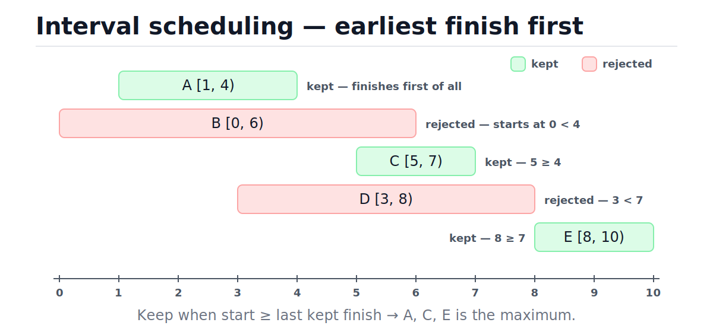
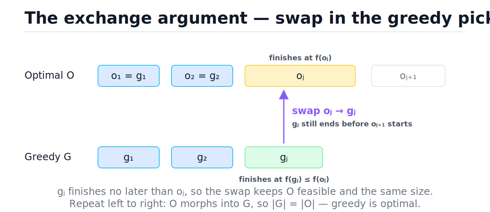
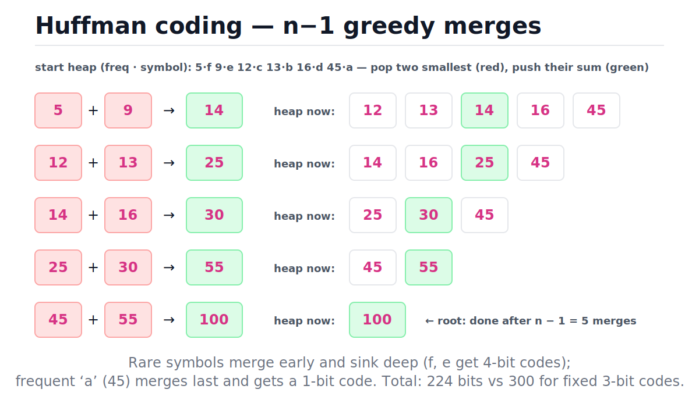
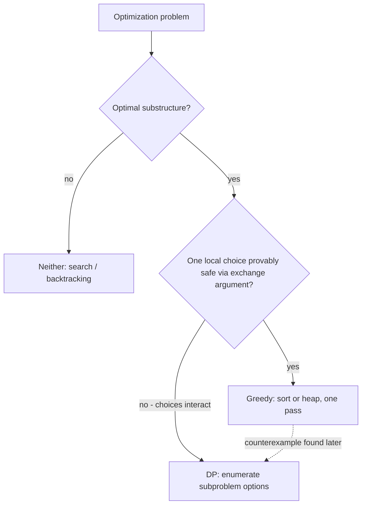

# Greedy Algorithms

[toc]

> **TL;DR:** A greedy algorithm commits to the locally best choice at every step and never revisits it, which makes it fast — usually one sort plus one scan, O(n log n). It is only correct when the problem has the greedy-choice property and optimal substructure, and the standard way to prove that is the exchange argument. When local choices interact (0/1 knapsack, general coin change), greedy silently returns wrong answers and you need [dynamic programming](./19-dynamic-programming.md) instead.

## Vocabulary

These are the load-bearing terms for everything below. The first three are the theory; the rest name the canonical problems this note works through.

**Greedy algorithm**

```math
x_t = \arg\max_{x \in F_t} \operatorname{score}(x)
```

At each step t, pick the feasible option that maximizes a fixed local score, commit, and never backtrack. The whole algorithm is one priority key applied n times — no memo table, no recursion tree.

**Greedy-choice property**

```math
\exists\, O^{*} \text{ optimal such that } g_1 \in O^{*}
```

Some optimal solution contains the greedy's first pick g₁. If this holds at every step, committing early never locks you out of an optimum. This is the property you must prove; it is not free.

**Optimal substructure**

```math
\mathrm{OPT}(S) = \{g_1\} \cup \mathrm{OPT}\bigl(\{\,x \in S : x \text{ compatible with } g_1\,\}\bigr)
```

After committing to g₁, what remains is a smaller instance of the same problem, and an optimal solution to the whole contains an optimal solution to the remainder. Greedy and DP both need this; greedy additionally needs the greedy-choice property.

**Exchange argument**

```math
O' = (O \setminus \{o_j\}) \cup \{g_j\}, \qquad |O'| = |O|
```

The proof technique: take any optimal solution O, find the first place it disagrees with greedy, swap the greedy pick in, and show the result is still feasible and no worse. Repeat until O has become the greedy solution G.

**Interval scheduling**

```math
\max |S| \quad \text{s.t.} \quad S \subseteq I,\; \forall a, b \in S:\ [s_a, f_a) \cap [s_b, f_b) = \varnothing
```

Given n intervals with start s and finish f, select the largest pairwise-disjoint subset. The canonical greedy success story: sort by finish time, sweep once.

**Value density**

```math
\rho_i = v_i / w_i
```

Value per unit weight of item i. The fractional knapsack sorts by ρ and it is provably optimal; the 0/1 knapsack sorts by ρ and it is provably wrong.

**Huffman cost (weighted code length)**

```math
B(T) = \sum_{c \in C} f(c) \cdot d_T(c)
```

For a prefix-free code tree T, the total bits to encode the corpus: each symbol's frequency times its depth. Huffman's greedy merge of the two least-frequent nodes minimizes B(T).

## Intuition

Greedy is the "commit and never look back" strategy. DP says "I don't know which choice is best, so I'll compute the value of every subproblem and pick afterward." Greedy says "I can prove which choice is safe right now, so I'll take it and shrink the problem." That confidence is what buys the speed: no table, no re-examination, typically one sort and one linear pass.

The running example is interval scheduling: five talks, one room, maximize the number of talks. Sorting by **finish time** and keeping every talk that starts after the last kept finish gives the optimum. The figure below shows exactly which intervals survive and why each rejection happens — note that B is rejected even though it starts earliest, and D even though it is long and central.



The intuition for *why* finish time is the right key: the talk that ends earliest leaves the most room for everything after it. Any other choice ends no earlier, so it can only crowd out future talks. That sentence is the seed of the exchange argument — we will make it rigorous below.

> [!IMPORTANT]
> A greedy algorithm without a proof is a conjecture. You need both the greedy-choice property and optimal substructure; if either fails, greedy returns confident wrong answers with no error signal. The exchange argument is the standard proof; a small counterexample is the standard refutation. Always attempt one of the two.

## How it works

Every greedy algorithm has the same skeleton: pick a priority key, sort or heapify by it, sweep once while maintaining a tiny amount of state. The intellectual work is choosing the key and proving it safe. Each subsection below is one canonical problem: the key, the code, and the why.

### Interval scheduling — earliest finish first

Sort intervals by finish time, then keep an interval whenever its start is at or after the finish of the last kept interval. The only state is one number, `last_finish`. Sorting costs O(n log n); the sweep is O(n).

```python
def max_meetings(intervals: list[tuple[int, int]]) -> list[tuple[int, int]]:
    """Earliest-finish-first. O(n log n) time, O(n) space."""
    chosen: list[tuple[int, int]] = []
    last_finish = float("-inf")
    for start, finish in sorted(intervals, key=lambda iv: iv[1]):
        if start >= last_finish:          # compatible with everything kept
            chosen.append((start, finish))
            last_finish = finish
    return chosen

talks = [(1, 4), (0, 6), (5, 7), (3, 8), (8, 10)]
assert max_meetings(talks) == [(1, 4), (5, 7), (8, 10)]
assert max_meetings([]) == []
assert max_meetings([(2, 3)]) == [(2, 3)]
```

Here is the full trace on the figure's data. Sorted by finish, the scan order is A(1,4), B(0,6), C(5,7), D(3,8), E(8,10):

| Step | Interval (start, finish) | start ≥ last_finish? | last_finish after | Decision |
| :---: | :--- | :---: | :---: | :--- |
| 1 | A (1, 4) | 1 ≥ −∞ ✓ | 4 | keep |
| 2 | B (0, 6) | 0 ≥ 4 ✗ | 4 | reject |
| 3 | C (5, 7) | 5 ≥ 4 ✓ | 7 | keep |
| 4 | D (3, 8) | 3 ≥ 7 ✗ | 7 | reject |
| 5 | E (8, 10) | 8 ≥ 7 ✓ | 10 | keep |

### The exchange-argument proof, in full

Let G = g₁, …, g_k be greedy's picks and O = o₁, …, o_m be any optimal solution, both sorted by finish time. We prove |G| = m in three moves. First, *greedy stays ahead*: by induction, f(gⱼ) ≤ f(oⱼ) for every j. Base case: g₁ is the globally earliest finisher, so f(g₁) ≤ f(o₁). Inductive step: oⱼ starts at or after f(oⱼ₋₁) ≥ f(gⱼ₋₁), so oⱼ was still a candidate when greedy made its j-th pick — and greedy chose the earliest-finishing candidate, so f(gⱼ) ≤ f(oⱼ).

Second, the *exchange*: replace oⱼ with gⱼ inside O. The result is still feasible — gⱼ is compatible with the shared prefix, and it finishes at f(gⱼ) ≤ f(oⱼ) ≤ s(oⱼ₊₁), so the next interval still fits. The size is unchanged, so the modified O is still optimal and now agrees with G in one more slot.

```math
f(g_j) \le f(o_j) \;\Longrightarrow\; O' = \{o_1, \dots, o_{j-1},\, g_j,\, o_{j+1}, \dots, o_m\} \text{ is feasible and } |O'| = m
```

Third, *no leftovers*: suppose m > k. After k swaps, the modified optimal solution contains oₖ₊₁ with s(oₖ₊₁) ≥ f(oₖ) ≥ f(gₖ) — meaning oₖ₊₁ was still compatible when greedy stopped. But greedy only stops when no compatible interval remains. Contradiction, so m = k and greedy is optimal. The figure shows the single swap step that drives the whole induction.



### Merge intervals

A different sort key for a different question: given possibly-overlapping intervals, produce the minimal set of disjoint covering intervals. Here the right key is **start time** — after sorting, an interval either overlaps the currently open merged interval (extend it) or starts a new one. One sort, one sweep: O(n log n).

```python
def merge_intervals(intervals: list[list[int]]) -> list[list[int]]:
    """Sort by start, then extend or open. O(n log n) time."""
    merged: list[list[int]] = []
    for start, end in sorted(intervals):
        if merged and start <= merged[-1][1]:   # overlaps the open interval
            merged[-1][1] = max(merged[-1][1], end)
        else:
            merged.append([start, end])
    return merged

assert merge_intervals([[1, 3], [2, 6], [8, 10], [15, 18]]) == [[1, 6], [8, 10], [15, 18]]
assert merge_intervals([[1, 4], [4, 5]]) == [[1, 5]]
assert merge_intervals([]) == []
```

The correctness here is almost free: after sorting by start, any interval that overlaps the open one must touch its right edge, and the `max` handles intervals nested inside the open one. The greedy "choice" is just never closing an interval too early.

### Jump game — furthest reach

Given `nums` where `nums[i]` is the maximum jump length from index i, decide if the last index is reachable. The greedy state is a single integer: the furthest index reachable so far. If the scan ever stands on an index beyond `furthest`, there is a gap no jump can cross. No sorting needed — O(n) time, O(1) space.

```python
def can_reach_end(nums: list[int]) -> bool:
    """Track the furthest reachable index. O(n) time, O(1) space."""
    furthest = 0
    for i, jump in enumerate(nums):
        if i > furthest:        # gap: index i is unreachable
            return False
        furthest = max(furthest, i + jump)
        if furthest >= len(nums) - 1:
            return True
    return True

assert can_reach_end([2, 3, 1, 1, 4]) is True
assert can_reach_end([3, 2, 1, 0, 4]) is False
assert can_reach_end([0]) is True
```

Why is one number enough? Reachability is *downward closed*: if index j is reachable, every index below j is too (you can always jump shorter). So the set of reachable indices is exactly the prefix [0, furthest], and a single max summarizes it losslessly. That collapse — a complicated set compressed to one monotone scalar — is the signature of O(n) greedy problems.

### Gas station — why restarting at i + 1 is safe

On a circular route, station i provides `gas[i]` fuel and the leg to the next station costs `cost[i]`. Find a starting station from which you can complete the loop, or return −1. The greedy insight: scan once, and whenever the running tank goes negative, abandon the current candidate start and jump the candidate to i + 1 — never to candidate + 1.

```python
def gas_station_start(gas: list[int], cost: list[int]) -> int:
    """Single pass with restart. O(n) time, O(1) space. -1 if impossible."""
    total = 0       # net fuel over the whole loop
    tank = 0        # fuel since the current candidate start
    start = 0
    for i in range(len(gas)):
        gain = gas[i] - cost[i]
        total += gain
        tank += gain
        if tank < 0:            # candidate fails on the leg ending at i + 1
            start = i + 1       # no station in (start..i] can work either
            tank = 0
    return start if total >= 0 else -1

assert gas_station_start([1, 2, 3, 4, 5], [3, 4, 5, 1, 2]) == 3
assert gas_station_start([2, 3, 4], [3, 4, 3]) == -1
```

The skip is justified by prefix sums. Write tankₛ(i) for the fuel on hand after leg i when starting from s. If starting at s fails first at leg i, then for every intermediate station j you actually reached, tankₛ(j) ≥ 0. Starting at j instead just deletes that nonnegative head start:

```math
\operatorname{tank}_j(i) = \operatorname{tank}_s(i) - \operatorname{tank}_s(j) \le \operatorname{tank}_s(i) < 0
```

So every station between s and i fails at the same leg or earlier — skipping them all is safe, and the scan stays O(n). The second half of the argument: if the total surplus over the loop is ≥ 0, the final candidate works. The scan splits the array into segments each ending in a failure, so each earlier segment has a negative sum; the final segment's surplus must cover exactly those deficits because everything sums to total ≥ 0. Trace for `gas = [1,2,3,4,5]`, `cost = [3,4,5,1,2]`:

| Step i | gas−cost | tank | total | Decision |
| :---: | :---: | :---: | :---: | :--- |
| 0 | −2 | −2 → 0 | −2 | fail → start = 1 |
| 1 | −2 | −2 → 0 | −4 | fail → start = 2 |
| 2 | −2 | −2 → 0 | −6 | fail → start = 3 |
| 3 | +3 | 3 | −3 | candidate 3 survives |
| 4 | +3 | 6 | 0 | total ≥ 0 → answer 3 |

### Fractional knapsack — and the 0/1 counterexample

Capacity W, items with value v and weight w. If items are **divisible** (oil, bandwidth, CPU share), greedy by density ρ = v/w is optimal: the exchange argument works because any optimal solution that under-uses a denser item can swap weight from a sparser item into it, gram for gram, and only gain. Sort by density, pour until full: O(n log n).

```python
def fractional_knapsack(items: list[tuple[int, int]], capacity: int) -> float:
    """items = (value, weight). Sort by density, take greedily. O(n log n)."""
    remaining = capacity
    value = 0.0
    for v, w in sorted(items, key=lambda it: it[0] / it[1], reverse=True):
        if remaining == 0:
            break
        take = min(w, remaining)
        value += v * (take / w)
        remaining -= take
    return value

def greedy_01_by_density(items: list[tuple[int, int]], capacity: int) -> int:
    """The WRONG algorithm for 0/1 knapsack, kept to expose the failure."""
    remaining = capacity
    value = 0
    for v, w in sorted(items, key=lambda it: it[0] / it[1], reverse=True):
        if w <= remaining:
            value += v
            remaining -= w
    return value

def knapsack_01_dp(items: list[tuple[int, int]], capacity: int) -> int:
    """Correct 0/1 answer via DP. O(n * capacity) time, O(capacity) space."""
    best = [0] * (capacity + 1)
    for v, w in items:
        for c in range(capacity, w - 1, -1):
            best[c] = max(best[c], best[c - w] + v)
    return best[capacity]

loot = [(60, 10), (100, 20), (120, 30)]      # (value, weight)
assert abs(fractional_knapsack(loot, 50) - 240.0) < 1e-9   # 60+100+(20/30)*120
assert greedy_01_by_density(loot, 50) == 160               # greedy gets stuck
assert knapsack_01_dp(loot, 50) == 220                     # optimal: 100+120
```

The counterexample is the classic from CLRS: densities are 6, 5, 4, so density-greedy takes the 10 kg and 20 kg items (value 160) and cannot fit the 30 kg item in the 20 kg that remain. The optimum skips the densest item entirely: 100 + 120 = 220. Indivisibility breaks the exchange — you cannot swap "part of" an item, so a locally dense pick can strand capacity.

> [!WARNING]
> Greedy-by-density on **0/1 knapsack** compiles, runs, and returns a plausible-looking wrong answer — 160 instead of 220 above, with no exception and no warning. The moment items become indivisible, the greedy-choice property dies and you must switch to [dynamic programming](./19-dynamic-programming.md). This is the single most common greedy error in interviews and in production allocation code.

### Huffman coding with heapq

Build a minimum-redundancy prefix-free code: repeatedly merge the two least-frequent nodes into one, n − 1 times, using a min-heap. The two rarest symbols end up deepest in the tree (longest codes); frequent symbols surface near the root. The greedy-choice property here is another exchange argument: in some optimal tree, the two least-frequent symbols are siblings at maximum depth — if not, swapping them down with whatever sits there can only reduce the weighted cost B(T). See [Heaps and Priority Queues](./08-heaps-and-priority-queues.md) for the heap mechanics.

The figure traces every merge for the CLRS frequencies {f:5, e:9, c:12, b:13, d:16, a:45}. Watch how 5 and 9 merge first and keep getting buried, while 45 stays untouched until the final merge.



```python
import heapq
from itertools import count
from typing import Union

HuffNode = Union[str, tuple["HuffNode", "HuffNode"]]

def huffman_codes(freq: dict[str, int]) -> dict[str, str]:
    """Build prefix-free codes with a min-heap. O(n log n) for n symbols."""
    if not freq:
        return {}
    tick = count()                       # tiebreaker: heap never compares nodes
    heap: list[tuple[int, int, HuffNode]] = [
        (f, next(tick), sym) for sym, f in freq.items()
    ]
    heapq.heapify(heap)                  # O(n)
    while len(heap) > 1:                 # n - 1 merges
        f1, _, a = heapq.heappop(heap)   # O(log n)
        f2, _, b = heapq.heappop(heap)
        heapq.heappush(heap, (f1 + f2, next(tick), (a, b)))
    codes: dict[str, str] = {}

    def walk(node: HuffNode, prefix: str) -> None:
        if isinstance(node, str):
            codes[node] = prefix or "0"  # single-symbol corpus still gets a bit
            return
        walk(node[0], prefix + "0")
        walk(node[1], prefix + "1")

    walk(heap[0][2], "")
    return codes

freq = {"a": 45, "b": 13, "c": 12, "d": 16, "e": 9, "f": 5}   # CLRS example
codes = huffman_codes(freq)
lengths = {sym: len(code) for sym, code in codes.items()}
assert lengths == {"a": 1, "b": 3, "c": 3, "d": 3, "e": 4, "f": 4}
total_bits = sum(freq[s] * len(codes[s]) for s in freq)
assert total_bits == 224                 # vs 300 bits with fixed 3-bit codes
vals = sorted(codes.values())            # prefix-free check
assert all(not vals[i + 1].startswith(vals[i]) for i in range(len(vals) - 1))
assert huffman_codes({"z": 1}) == {"z": "0"}
```

> [!TIP]
> The `next(tick)` counter in the heap tuples is the production idiom: tuple comparison is lexicographic and short-circuits, so when two frequencies tie, Python falls through to the counter — never to the third element. Without it, `heappush` raises `TypeError` the first time two equal frequencies force a comparison of two tree-node payloads.

### Greedy vs DP — the decision guide

Both techniques require optimal substructure; the fork is whether one local choice can be proven safe before exploring alternatives. Greedy commits and does O(1) work per element after sorting; DP defers and pays for evaluating every subproblem option. Use this decision path in an interview or a design review:



| Signal | Points to |
| :--- | :--- |
| A single sort key or priority survives every counterexample you try | Greedy |
| You can sketch a swap that never hurts an optimal solution | Greedy |
| Taking an item changes the *value* of future items, not just feasibility | DP |
| A 3-element counterexample breaks your key | DP |
| You need the optimal count or all solutions, not just one optimum | DP / backtracking |

> [!NOTE]
> Several famous graph algorithms are greedy with exchange-style proofs: Dijkstra commits to the closest unsettled vertex ([Shortest Paths](./16-shortest-paths-dijkstra-and-bellman-ford.md)), and Kruskal/Prim commit to the lightest safe edge via the cut property ([Minimum Spanning Trees](./17-minimum-spanning-trees.md)). Dijkstra's greedy commitment is exactly what breaks under negative edge weights — the "settled" assumption stops being safe.

## Complexity

Every algorithm in this note is sort-dominated or a single scan; none needs more than linear extra space. The table lists the best case separately because Timsort detects presorted input and finishes in O(n) comparisons, which matters when you re-run scheduling on nearly sorted data. See [Big-O Notation](./01-big-o-notation-and-complexity-analysis.md) for the notation and [Comparison Sorting](./11-comparison-sorting-algorithms.md) for why the sort bound is what it is.

| Algorithm | Time (best) | Time (average) | Time (worst) | Extra space |
| :--- | :---: | :---: | :---: | :---: |
| Interval scheduling (earliest finish) | O(n) presorted | O(n log n) | O(n log n) | O(n) sorted copy |
| Merge intervals | O(n) presorted | O(n log n) | O(n log n) | O(n) |
| Jump game reachability | O(1) early exit | O(n) | O(n) | O(1) |
| Gas station | O(n) | O(n) | O(n) | O(1) |
| Fractional knapsack | O(n log n) | O(n log n) | O(n log n) | O(n) |
| Greedy-by-density on 0/1 (wrong) | O(n log n) | O(n log n) | O(n log n) | O(n) |
| 0/1 knapsack DP (correct) | O(nW) | O(nW) | O(nW) | O(W) |
| Huffman build (heapq) | O(n log n) | O(n log n) | O(n log n) | O(n) |

The canonical derivation is the sort-plus-scan shape shared by interval scheduling, merge intervals, and fractional knapsack — the comparison sort dominates:

```math
T(n) = \underbrace{\Theta(n \log n)}_{\text{sort by key}} + \underbrace{\Theta(n)}_{\text{one sweep, } O(1) \text{ state}} = \Theta(n \log n)
```

Huffman replaces the sort with a heap: one O(n) heapify, then exactly n − 1 merges, each doing two pops and one push at O(log n):

```math
T_{\text{huffman}}(n) = \underbrace{O(n)}_{\text{heapify}} + \underbrace{(n-1) \cdot O(\log n)}_{\text{pops and pushes}} = O(n \log n)
```

Why greedy is cheap in general: committing means each element is touched a constant number of times after ordering. DP's O(nW) for 0/1 knapsack is *pseudo-polynomial* — polynomial in the numeric value W, exponential in its bit length — which is the price of evaluating every capacity subproblem instead of trusting a single key.

## Memory model in Python

The greedy code above leans on two CPython workhorses: `sorted()` and `heapq`. Knowing their physical layout explains the constants. `sorted()` copies the list — an array of PyObject pointers — and runs Timsort; when you pass `key=`, CPython precomputes the key for each element once into a parallel keys array and sorts both arrays in tandem (the decorate-sort-undecorate idea, done internally; see CPython's `listsort.txt`). That is O(n) extra pointers, and it means your lambda runs exactly n times, not O(n log n) times.

`heapq` stores the heap in a plain Python list: a contiguous C array of PyObject pointers with children of slot i at 2i+1 and 2i+2. The index arithmetic is cache-friendly because the slot array is contiguous, but every comparison dereferences boxed objects — pointer chasing into `PyLongObject`s scattered across the heap — so the constant factor is far from C arrays of ints. The `_heapq` C accelerator removes interpreter overhead from sift operations but not the boxing. Details on object layout live in [Memory Model and PyObject Layout](../Programming-Languages/Python/13-memory-model-and-pyobject-layout.md) and stdlib performance notes in [Performance and the Standard Library](../Programming-Languages/Python/10-performance-and-the-standard-library.md).

```python
import heapq

h = [5, 1, 4, 2, 3]
heapq.heapify(h)                 # O(n), in place, no copy
assert h[0] == 1                 # min is always slot 0
assert h[1] in (2, 3) and h[2] in (2, 3, 4)   # heap order, NOT sorted order
assert heapq.heappop(h) == 1     # O(log n): swap last into slot 0, sift down
assert sorted(h) == [2, 3, 4, 5]
```

> [!TIP]
> Timsort is adaptive: already-sorted or nearly sorted input is detected as one long run and sorts in O(n) comparisons. Re-running earliest-finish-first on an interval list that is already finish-ordered costs a linear pass, so keeping data sorted between greedy runs is a real optimization, not a micro one.

## Real-world example

One conference room, a morning of booking requests, and the goal of fitting the **most** meetings (not the most minutes). This is interval scheduling verbatim: sort requests by end time, accept whatever starts after the last accepted meeting ends. The same code schedules CI jobs on a single runner or ad slots on a single screen — any "one resource, maximize accepted requests" problem.

```python
def schedule_one_room(requests: list[tuple[str, int, int]]) -> list[str]:
    """Pick the max number of bookings for one room. O(n log n)."""
    booked: list[str] = []
    last_finish = -1
    for name, start, finish in sorted(requests, key=lambda r: r[2]):
        if start >= last_finish:
            booked.append(name)
            last_finish = finish
    return booked

bookings = [
    ("standup",   540, 555),    # 09:00-09:15
    ("design",    540, 630),    # 09:00-10:30  loses to standup
    ("1:1",       560, 590),    # 09:20-09:50
    ("retro",     585, 645),    # 09:45-10:45  overlaps the 1:1
    ("interview", 600, 660),    # 10:00-11:00
]
assert schedule_one_room(bookings) == ["standup", "1:1", "interview"]
```

Note what greedy optimizes: the *count* of meetings, three instead of the two you would get by accepting the 90-minute design review. If the objective were total booked minutes or weighted importance, the greedy-choice property for this key evaporates and you are in weighted-interval-scheduling territory — a DP problem.

## When to use / when NOT to use

Reach for greedy when the problem has a natural ordering and a swap-never-hurts story. Avoid it when choices interact through the objective. Concretely:

**Use greedy when:**

- A single sort key (finish time, density, weight, deadline) plus one pass solves it — interval scheduling, merge intervals, fractional knapsack.
- The state collapses to one monotone scalar — jump game's `furthest`, gas station's `tank`.
- The structure is matroid-like or has a proven cut/exchange property — MST, Dijkstra, Huffman.
- You need O(n log n) at scale and can afford a proof or a thorough counterexample hunt.

**Do NOT use greedy when:**

- Items are indivisible and capacity is shared — 0/1 knapsack, bin packing.
- The objective is weighted so a short cheap item can beat a long valuable one — weighted interval scheduling needs DP.
- Coin systems are non-canonical — greedy change-making fails on {1, 3, 4} for amount 6 (greedy: 4+1+1 = 3 coins; optimal: 3+3 = 2).
- Negative weights poison commitment — Dijkstra with negative edges; use Bellman–Ford.
- You only verified greedy on a few happy-path examples and cannot sketch an exchange argument.

## Common mistakes

- **"It passed my test cases, so the greedy is correct"** — passing examples is not a proof. Either write the exchange argument or hunt 3-element counterexamples; most broken greedy keys die on inputs of size 3.
- **"Sort meetings by start time"** — one early, long meeting (B in the figure) blocks everything. Finish time is the key that carries the proof; start time carries nothing.
- **"Pick the shortest interval first"** — a short interval straddling the gap between two compatible long ones costs you both. Counterexample: (0,10), (9,12), (11,20) — shortest-first keeps only (9,12).
- **"Density greedy solves 0/1 knapsack"** — it returns 160 on the CLRS instance where the optimum is 220. Indivisibility breaks the exchange; use the DP table.
- **"After the tank goes negative at i, retry from start+1"** — that is the O(n²) trap. The prefix-sum argument shows every station in (start, i] also fails, so jump straight to i+1 and keep the scan O(n).
- **"Greedy coin change always works"** — it works for *canonical* systems like US coins, and silently fails otherwise ({1, 3, 4}, amount 6). Correctness depends on the coin system, not the algorithm.
- **"Push `(freq, node)` pairs into heapq"** — the first tied frequency forces Python to compare two node payloads and raises `TypeError`. Insert a monotonic counter as the second tuple element.

## Interview questions and answers

These cover the proof technique, the canonical problems, and the greedy/DP boundary — the three things interviewers actually probe.

**1. How do you argue a greedy algorithm is correct?**
**Answer:** I check two properties. Greedy-choice: some optimal solution contains the greedy's first pick — I prove it with an exchange argument, swapping the greedy pick into an arbitrary optimal solution and showing nothing breaks. Optimal substructure: after committing, the remainder is the same problem smaller. If I can't sketch the exchange in a couple of minutes, I start hunting for a counterexample instead, because greedy fails silently.

**2. In interval scheduling, why sort by finish time and not start time or duration?**
**Answer:** Earliest finish leaves maximal room for the future, and that's exactly what the exchange argument needs: the greedy pick finishes no later than the optimal's pick at the same position, so swapping it in stays feasible. Start time fails — one early 8-hour meeting blocks the day — and shortest-first fails when a short interval straddles two compatible long ones. Both have tiny counterexamples; finish time has a proof.

**3. In gas station, why is it valid to jump the candidate start all the way to i + 1?**
**Answer:** Prefix sums. If I start at s and first go negative on the leg ending at i+1, then every intermediate station j I passed had a nonnegative running tank. Starting at j instead just subtracts that nonnegative cushion, so tank from j is ≤ tank from s — it fails at the same place or earlier. All of (s, i] is dead, one pass suffices, O(n).

**4. Why does greedy work for fractional knapsack but not 0/1?**
**Answer:** Divisibility powers the exchange: if an optimal fractional solution underuses the densest item, I can move weight into it gram by gram from a sparser item and only gain. With indivisible items there's no "gram by gram" — a dense item can occupy capacity in a way that strands the rest, like taking the 10 kg density-6 item and then having no room for the 30 kg item worth 120. That instance gives greedy 160 versus the true 220, so I'd switch to the O(nW) DP.

**5. Why is merging the two least-frequent nodes optimal in Huffman coding?**
**Answer:** Exchange argument on trees: in any optimal prefix tree, some two leaves sit as siblings at the maximum depth. If they aren't the two rarest symbols, swap the rarest down there — the cost change is (f_other − f_rare) times the depth difference, which is ≤ 0, so the swap never increases cost. So an optimal tree *with the two rarest as deepest siblings* exists, the merge is safe, and induction on n−1 merges finishes the proof. Build cost is O(n log n) with a heap.

**6. Is Dijkstra a greedy algorithm, and why does it fail with negative edges?**
**Answer:** Yes — it greedily commits to the closest unsettled vertex, assuming its distance can never improve. A negative edge breaks exactly that assumption: a "settled" vertex could later be reached more cheaply through a path that goes far then comes back negative. The commitment is unsound, so you fall back to Bellman–Ford, which re-relaxes instead of committing — the same greedy-versus-defer tradeoff, O((V+E) log V) versus O(VE).

**7. When does greedy coin change work?**
**Answer:** Only for canonical coin systems, where each coin is "compatible" with the ones below it — US denominations qualify. The standard failure is {1, 3, 4} making 6: greedy takes 4+1+1 for three coins, optimal is 3+3 for two. In an interview I say: greedy is a hypothesis here, test it; if the system isn't proven canonical, do the O(n·amount) DP.

**8. How do you decide greedy versus DP under time pressure?**
**Answer:** I try the obvious sort keys against small adversarial inputs — size 3 kills most wrong keys. If a key survives, I attempt a one-line exchange story: "swapping my pick into any optimal solution can't hurt because…". If I can finish that sentence, I code greedy and state the proof sketch; if choices visibly interact through the objective — weights, capacities, indivisibility — I go straight to DP and mention greedy would need a proof I can't give.

## Practice path

Work these in order; each adds one new wrinkle to the same sort-commit-sweep skeleton.

1. Reimplement `max_meetings` from memory; re-derive *why* finish time, out loud, before typing.
2. Merge intervals, then insert-interval (LC 56, 57) — same key, mutation instead of selection.
3. Jump Game I, then Jump Game II (minimum jumps) — the second forces a subtler greedy window.
4. Gas station (LC 134) — write the prefix-sum justification as a comment before the loop.
5. Write the full exchange-argument proof for interval scheduling on paper, no peeking.
6. Fractional knapsack, then run your density key on the 0/1 instance above and watch it lose to your own DP from [Dynamic Programming](./19-dynamic-programming.md).
7. Huffman codes with `heapq`; assert prefix-freeness and total bits like this note does.
8. Coin change on {1, 3, 4} both ways — greedy and DP — and find the smallest amount where they diverge.
9. Meeting Rooms II (minimum rooms) — greedy plus a min-heap, bridging to [Heaps and Priority Queues](./08-heaps-and-priority-queues.md).

## Copyable takeaways

- Greedy = commit to the best local choice by one fixed key, never revisit; usually one sort + one sweep, O(n log n).
- Correctness needs **both** the greedy-choice property and optimal substructure; prove via exchange argument or refute via tiny counterexample.
- Exchange argument shape: swap the greedy pick into any optimal solution; show feasibility and size are preserved; induct left to right.
- Interval scheduling: sort by **finish** time — O(n log n); start time and duration are both refutable in three intervals.
- Jump game and gas station are O(n) because the entire decision state collapses to one monotone scalar.
- Gas station restart: a failed start kills every station up to the failure point — prefix sums prove the skip, keeping it O(n).
- Fractional knapsack: greedy by density, optimal. 0/1 knapsack: greedy returns 160 where DP returns 220 — indivisibility breaks the exchange.
- Huffman: n−1 merges of the two rarest nodes via heapq, O(n log n); add a counter to heap tuples to survive frequency ties.
- Greedy fails *silently* — wrong answers, no exceptions. The proof is part of the deliverable.

## Sources

- Cormen, Leiserson, Rivest, Stein — *Introduction to Algorithms*, "Greedy Algorithms" chapter (ch. 16 in 3rd ed., ch. 15 in 4th ed.): activity selection, knapsack contrast, Huffman codes.
- Kleinberg, Tardos — *Algorithm Design*, ch. 4: interval scheduling, exchange arguments, "greedy stays ahead".
- Huffman, D. A. (1952). "A Method for the Construction of Minimum-Redundancy Codes," *Proceedings of the IRE* 40(9).
- `heapq` — Heap queue algorithm: https://docs.python.org/3/library/heapq.html
- CPython Timsort notes (`listsort.txt`): https://github.com/python/cpython/blob/main/Objects/listsort.txt
- Python wiki — TimeComplexity: https://wiki.python.org/moin/TimeComplexity

## Related

- [Dynamic Programming](./19-dynamic-programming.md) — where to go when the exchange argument fails.
- [Heaps and Priority Queues](./08-heaps-and-priority-queues.md) — the data structure behind Huffman and Meeting Rooms II.
- [Comparison Sorting Algorithms](./11-comparison-sorting-algorithms.md) — why the sort step costs Θ(n log n) and when Timsort beats it.
- [Shortest Paths: Dijkstra and Bellman–Ford](./16-shortest-paths-dijkstra-and-bellman-ford.md) — Dijkstra as a greedy algorithm and its negative-edge failure mode.
- [Minimum Spanning Trees](./17-minimum-spanning-trees.md) — Kruskal and Prim, greedy via the cut property.
- [Big-O Notation and Complexity Analysis](./01-big-o-notation-and-complexity-analysis.md) — the notation used throughout this note.
