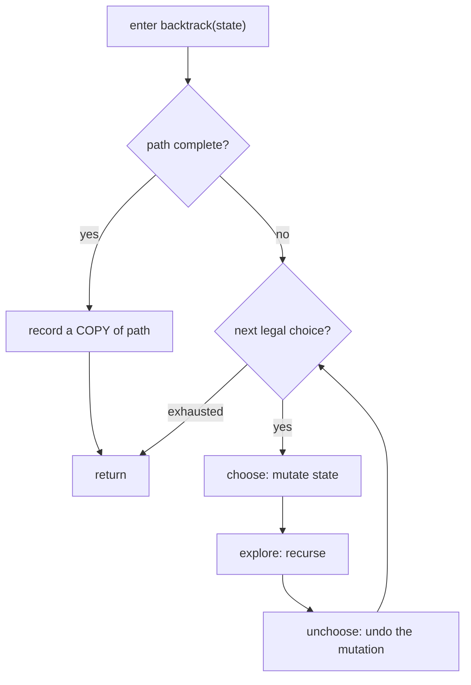
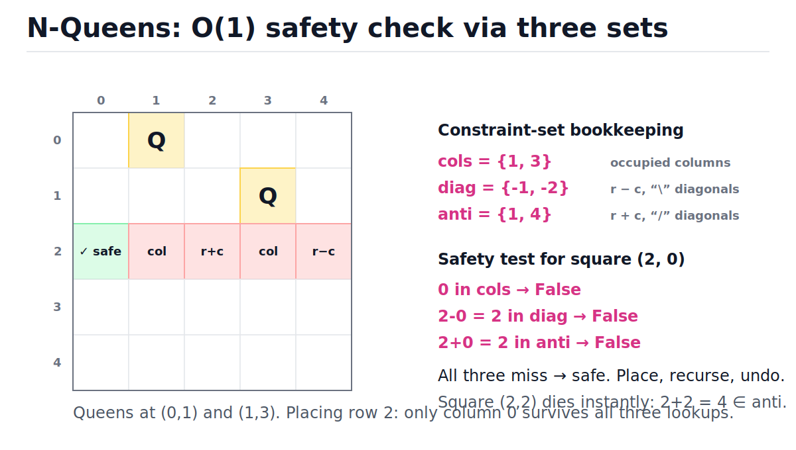

# Backtracking

[toc]

> **TL;DR:** Backtracking is depth-first search over a decision tree of partial solutions: at each node you **choose** an option, **explore** the subtree, then **unchoose** to restore state before trying the next option. The tree is exponential — 2^n subsets, n! permutations — so the entire game is pruning: kill a partial solution the instant it cannot lead anywhere. Use it to *enumerate* solutions; use [dynamic programming](./19-dynamic-programming.md) when you only need to *count* or *optimize*.

## Vocabulary

**Backtracking**

```math
\text{choose}(c) \;\rightarrow\; \text{explore} \;\rightarrow\; \text{unchoose}(c)
```

A recursive search that builds a solution one decision at a time, abandoning ("backtracking from") any partial solution that can no longer be completed. The undo step makes one shared mutable state serve the whole tree.

**State-space tree**

```math
\text{nodes} = O(b^{d}) \quad \text{for branching factor } b \text{ and depth } d
```

The implicit tree whose root is the empty partial solution and whose edges are individual decisions. Backtracking never materializes this tree; the recursion *is* the traversal.

**Partial solution (path)**

```math
p = (c_1, c_2, \ldots, c_k), \quad k \le d
```

The sequence of choices made so far, stored in one shared list that grows on choose and shrinks on unchoose. A leaf where the path is complete and valid gets recorded.

**Pruning**

```math
\neg\,\text{promising}(p) \;\Rightarrow\; \text{skip the entire subtree below } p
```

A feasibility test on the partial solution. One O(1) check at depth k can delete b^(d−k) descendants, which is the only reason exponential search is ever practical.

**Used set**

```math
\text{used} \subseteq \{0, 1, \ldots, n-1\}
```

A boolean array or hash set marking which elements are already in the path. It turns the "is this element taken?" test from an O(n) list scan into O(1).

**Diagonal keys (N-Queens)**

```math
\text{falling diagonal (} \searrow \text{): } r - c, \qquad \text{rising diagonal (} \nearrow \text{): } r + c
```

Every square on the same top-left-to-bottom-right diagonal shares the value r − c; every square on the same anti-diagonal shares r + c. Two ints index all 4n − 2 diagonals.

**State-space sizes**

```math
|\text{subsets}| = 2^{n}, \qquad |\text{permutations}| = n!, \qquad \binom{n}{k} = \frac{n!}{k!\,(n-k)!}
```

The leaf counts of the three classic decision trees. These are lower bounds on work when the problem demands *all* solutions — no algorithm can beat the size of its own output.

## Intuition

Picture exploring a maze with a pencil: at each fork you draw your line down one corridor, and when you hit a dead end you *erase back to the fork* and try the next corridor. The pencil line is the shared `path` list; erasing is the unchoose step. Crucially you never photocopy the maze per fork — one maze, one pencil, perfect undo.

The figure below is the entire state space for subsets of [1, 2, 3]. Each level decides one element: the left edge appends it, the right edge skips it. Follow any root-to-leaf walk and you spell out exactly one subset; count the leaves and you get 2³ = 8.

![Subset decision tree for [1,2,3]: three levels of include/exclude branching producing 8 green leaf subsets](./assets/21-backtracking/subset-decision-tree.svg)

> [!NOTE]
> Backtracking is just [DFS](./09-graphs-bfs-and-dfs.md) on an implicit tree. The word "backtracking" emphasizes the *undo*: because the tree is never stored, the only way to move from one branch to a sibling is to mutate state forward and then mutate it back.

## How it works

Every backtracking solution is the same seven-line template wearing a different costume. What changes per problem is: what a "choice" is, when the path counts as complete, and which pruning test rejects a partial path early. Master the template once and the classics below become parameter swaps.

### The universal template: choose, explore, unchoose

The skeleton is a recursive function over one shared mutable `path`. The base case records a *snapshot*; the loop tries each legal choice, recurses, and undoes. Here it is in its purest form — enumerating all bitstrings of length n, the smallest possible decision tree.



```python
def all_bitstrings(n: int) -> list[str]:
    results: list[str] = []
    path: list[str] = []

    def backtrack() -> None:
        if len(path) == n:                 # base case: complete solution
            results.append("".join(path))  # snapshot, then unwind
            return
        for choice in "01":                # candidates at this depth
            path.append(choice)            # 1. choose
            backtrack()                    # 2. explore
            path.pop()                     # 3. unchoose — exact mirror

    backtrack()
    return results

assert all_bitstrings(2) == ["00", "01", "10", "11"]
assert len(all_bitstrings(4)) == 2 ** 4
```

> [!IMPORTANT]
> Unchoose must be the **exact mirror** of choose, in reverse order, on every exit path. If choose does `append` + `used[i] = True`, unchoose must do `used[i] = False` + `pop`. One missed undo and a sibling branch inherits corrupted state — the classic symptom is "first answer correct, every later answer garbage."

### Subsets: include/exclude branching

The subsets tree branches twice per element: take it or leave it. Depth is n, branching is 2, so there are exactly 2^n leaves and each leaf is one subset — the code is a direct transcription of the figure above. Total time is O(n · 2^n) because each leaf snapshot costs an O(n) copy.

```python
def subsets(nums: list[int]) -> list[list[int]]:
    results: list[list[int]] = []
    path: list[int] = []

    def backtrack(i: int) -> None:
        if i == len(nums):           # every element decided
            results.append(path[:])  # COPY — path keeps mutating after this
            return
        path.append(nums[i])         # branch 1: include nums[i]
        backtrack(i + 1)
        path.pop()                   # undo before the sibling branch
        backtrack(i + 1)             # branch 2: exclude nums[i]

    backtrack(0)
    return results

out = subsets([1, 2, 3])
assert len(out) == 2 ** 3 == 8
assert out[0] == [1, 2, 3] and out[-1] == []   # matches the figure, left to right
assert [1, 3] in out and [2] in out
```

Trace the first few steps against the figure — the recursion walks the tree left-to-right, and `path` always equals the node you are standing on:

| Step | Active call | `path` | Decision |
| :---: | :--- | :--- | :--- |
| 1 | `backtrack(0)` | `[]` | choose 1 → append |
| 2 | `backtrack(1)` | `[1]` | choose 2 → append |
| 3 | `backtrack(2)` | `[1, 2]` | choose 3 → append |
| 4 | `backtrack(3)` | `[1, 2, 3]` | leaf → record copy |
| 5 | back in `backtrack(2)` | `[1, 2]` | pop 3, take exclude branch |
| 6 | `backtrack(3)` | `[1, 2]` | leaf → record `[1, 2]` |
| 7 | back in `backtrack(1)` | `[1]` | pop 2, take exclude branch |
| 8 | `backtrack(2)` | `[1]` | choose 3 → append |
| 9 | `backtrack(3)` | `[1, 3]` | leaf → record `[1, 3]` |
| … | … | … | continues until `[]` is recorded last |

### Permutations: a used set

Permutations differ from subsets in one way: every element must appear exactly once, and *order matters*. So at each depth the candidates are "every element not yet used," tracked in O(1) by a boolean array. The tree has n choices at depth 0, n−1 at depth 1, … giving n! leaves.

```python
def permutations(nums: list[int]) -> list[list[int]]:
    results: list[list[int]] = []
    path: list[int] = []
    used: list[bool] = [False] * len(nums)

    def backtrack() -> None:
        if len(path) == len(nums):
            results.append(path[:])
            return
        for i, x in enumerate(nums):
            if used[i]:              # O(1) "already placed" check
                continue
            used[i] = True           # choose (two mutations...)
            path.append(x)
            backtrack()              # explore
            path.pop()               # unchoose (...two undos, reverse order)
            used[i] = False

    backtrack()
    return results

perms = permutations([1, 2, 3])
assert len(perms) == 6                       # 3! = 6
assert [3, 1, 2] in perms
assert len(set(map(tuple, perms))) == 6      # all distinct
```

### Combination sum: start-index dedup plus a sort-based prune

Given candidates [2, 3, 6, 7] and target 7, find every multiset summing to 7. Two ideas carry this problem. First, **start-index dedup**: each call may only pick candidates at index ≥ `start`, so [2, 3, 2] can never appear after [2, 2, 3] — combinations are generated in one canonical order instead of every permutation of themselves. Second, **sorted pruning**: once a candidate exceeds the remaining target, every later candidate does too, so `break` kills the rest of the loop.

```python
def combination_sum(candidates: list[int], target: int) -> list[list[int]]:
    ordered: list[int] = sorted(candidates)  # sorting enables the break-prune
    results: list[list[int]] = []
    path: list[int] = []

    def backtrack(start: int, remaining: int) -> None:
        if remaining == 0:
            results.append(path[:])
            return
        for i in range(start, len(ordered)):
            if ordered[i] > remaining:       # prune: all later ones bigger too
                break
            path.append(ordered[i])
            backtrack(i, remaining - ordered[i])  # i, not i + 1: reuse allowed
            path.pop()

    backtrack(0, target)
    return results

combos = combination_sum([2, 3, 6, 7], 7)
assert sorted(combos) == [[2, 2, 3], [7]]
```

> [!TIP]
> Passing `i` recursively allows unlimited reuse of a candidate; passing `i + 1` forbids reuse (LeetCode 39 vs 40). This one character is the entire difference between the two problems — everything else in the template is identical.

### N-Queens: constraint sets and the diagonal trick

Place n queens on an n×n board so none attack each other. Go row by row — that makes the row constraint free — and choose a column for each row. The naive safety check scans all previously placed queens, O(n) per square. The constraint-set version is O(1): keep three hash sets — occupied columns, occupied "\" diagonals keyed by r − c, occupied "/" anti-diagonals keyed by r + c. A square is safe iff all three lookups miss. (Set membership is O(1) average — see [hash tables](./05-hash-tables.md).)

The figure shows the bookkeeping mid-search: two queens placed, and the three set lookups deciding the fate of every square in the current row.



```python
def solve_n_queens(n: int) -> list[list[int]]:
    """Every solution as a list of column indices, one per row."""
    solutions: list[list[int]] = []
    cols: set[int] = set()   # occupied columns
    diag: set[int] = set()   # occupied "\" diagonals, key r - c
    anti: set[int] = set()   # occupied "/" diagonals, key r + c
    placement: list[int] = []

    def backtrack(row: int) -> None:
        if row == n:
            solutions.append(placement[:])
            return
        for col in range(n):
            if col in cols or (row - col) in diag or (row + col) in anti:
                continue                     # attacked: prune this subtree
            cols.add(col)                    # choose: three set inserts
            diag.add(row - col)
            anti.add(row + col)
            placement.append(col)
            backtrack(row + 1)               # explore
            placement.pop()                  # unchoose: mirror everything
            anti.discard(row + col)
            diag.discard(row - col)
            cols.discard(col)

    backtrack(0)
    return solutions

assert len(solve_n_queens(4)) == 2
assert len(solve_n_queens(6)) == 4
assert len(solve_n_queens(8)) == 92          # the classic count
```

Pruning is doing enormous work here. Without it the search would try all n^n column assignments; with the three sets, every queen placed instantly poisons one column and two diagonals for every deeper row, so most of the tree is never entered.

### Word search: mark and unmark a grid

Does `word` exist as a path of adjacent cells in a letter grid, without revisiting a cell? The choices at each step are the four neighbors; the "used set" is the grid itself — overwrite the current cell with a sentinel before recursing, restore it after. This costs zero extra memory and the restore-on-unwind is the unchoose step.

```python
def exist(board: list[list[str]], word: str) -> bool:
    rows, width = len(board), len(board[0])

    def backtrack(r: int, c: int, i: int) -> bool:
        if i == len(word):
            return True                      # matched every character
        if not (0 <= r < rows and 0 <= c < width) or board[r][c] != word[i]:
            return False                     # prune: out of grid or mismatch
        saved = board[r][c]
        board[r][c] = "#"                    # choose: mark visited in place
        found = (
            backtrack(r + 1, c, i + 1) or backtrack(r - 1, c, i + 1)
            or backtrack(r, c + 1, i + 1) or backtrack(r, c - 1, i + 1)
        )
        board[r][c] = saved                  # unchoose: restore BEFORE returning
        return found

    return any(backtrack(r, c, 0) for r in range(rows) for c in range(width))

grid = [["A", "B", "C", "E"], ["S", "F", "C", "S"], ["A", "D", "E", "E"]]
assert exist(grid, "ABCCED") is True
assert exist(grid, "SEE") is True
assert exist(grid, "ABCB") is False          # cannot reuse the same B
assert grid[0][0] == "A"                     # board fully restored afterwards
```

> [!WARNING]
> An early `return True` placed *before* the restore line leaves a `#` permanently burned into the board, corrupting every later starting position. Always restore on every exit path — compute `found`, restore, then return.

## Complexity

All of these are exponential, and for pure enumeration that is *optimal*: the output itself has exponential size, so best case equals worst case. Pruned searches (combination sum, N-Queens, word search) keep an exponential worst case but their practical running time is governed by how early the pruning tests fire.

| Algorithm | Time (best) | Time (average ≈ worst) | Aux space (excl. output) | Why |
| :--- | :--- | :--- | :--- | :--- |
| Subsets | Θ(n · 2^n) | Θ(n · 2^n) | O(n) | must visit all 2^n leaves; O(n) copy each |
| Permutations | Θ(n · n!) | Θ(n · n!) | O(n) | n! leaves; O(n) copy each |
| Combination sum | O(n log n) (sort, instant prune) | O(n^(T/m)) for min candidate m, target T | O(T/m) recursion depth | tree depth ≤ T/m, branching ≤ n |
| N-Queens (all solutions) | — | O(n!) placements bounded | O(n) sets + stack | one column per row, heavy diagonal pruning |
| Word search | O(m · n) (no first letter matches) | O(m · n · 3^L) for word length L | O(L) recursion depth | 4 first moves, then ≤ 3 (no going back) |
| Generic template | — | O(b^d) nodes × per-node work | O(d) | b choices, depth d |

The key bound is the subsets recurrence — each call does constant work then spawns two subproblems one level deeper:

```math
T(n) = 2\,T(n-1) + O(1) \;\Rightarrow\; T(n) = O(2^{n}) \text{ calls}, \qquad
\text{total} = O\!\left(n \cdot 2^{n}\right) \text{ with an } O(n) \text{ copy at each of the } 2^{n} \text{ leaves}
```

Why space stays O(n) while time explodes: the recursion stack only ever holds *one root-to-leaf path* at a time — depth d frames, not b^d. That asymmetry (exponential time, linear space) is the signature of backtracking, and it's why a search that runs for hours never runs out of memory.

## Memory model in Python

The asymptotics above assume cheap choose/unchoose. In CPython the constant factors hinge on a few concrete facts about frames, lists, and sets — getting them wrong multiplies an already-exponential runtime. (Background: [Python memory model and PyObject layout](../Programming-Languages/Python/13-memory-model-and-pyobject-layout.md).)

- **Recursion frames are heap objects.** Every `backtrack()` call allocates a frame object; depth-n recursion holds n live frames, each hundreds of bytes. The default limit is 1000 (`sys.getrecursionlimit()`), so a 2000-cell word-search path raises `RecursionError`. Raise the limit with `sys.setrecursionlimit()` or convert to an explicit stack.
- **`path.append` / `path.pop` are amortized O(1).** CPython lists over-allocate (~12.5% growth), and popping from the tail never reallocates until the list shrinks well below capacity. The choose/unchoose pair is essentially two pointer writes.
- **One shared list beats `path + [x]`.** Passing `path + [x]` into the recursive call allocates a fresh k-element list at *every node* — O(n · 2^n) allocations plus GC churn for subsets, versus O(2^n) one-int appends with mutation+undo. Same Big-O class, ~an order of magnitude in wall clock.
- **Set membership is O(1) average.** The N-Queens trick is fast because small ints hash to themselves and CPython sets are open-addressed tables; `(row - col) in diag` is a handful of machine ops.
- **Snapshot cost is real.** `path[:]` is O(k) and allocates; that's the n in O(n · 2^n). When only counting solutions, skip the copy entirely and increment an int.
- **Don't build strings incrementally.** `prefix + ch` in a recursive string builder copies the whole prefix per level — O(k²) per path. Keep a list of chars and `"".join(path)` once at the leaf, as the template does.

> [!CAUTION]
> Backtracking is also a production failure mode: backtracking regex engines (Python `re`, PCRE, Java) explode exponentially on patterns like `(a+)+$` fed `"aaaa…b"` — catastrophic backtracking, the root of ReDoS outages. Russ Cox's regexp article (in Sources) is the canonical writeup.

## Real-world example: on-call rota solver

Constraint-satisfaction scheduling is backtracking's day job. Scenario: build a 7-day on-call rota for three engineers where nobody works back-to-back days and nobody exceeds 3 shifts. The decision tree assigns one engineer per day; both constraints are O(1) pruning tests; the first complete assignment wins (`return True` short-circuits the search instead of enumerating every rota).

```python
from typing import Optional


def schedule_oncall(
    engineers: list[str],
    days: int,
    max_shifts: int,
) -> Optional[list[str]]:
    """One engineer per day: no back-to-back days, respect max_shifts."""
    load: dict[str, int] = {e: 0 for e in engineers}
    rota: list[str] = []

    def backtrack(day: int) -> bool:
        if day == days:
            return True                  # complete, valid rota — stop searching
        for eng in engineers:
            if load[eng] >= max_shifts:
                continue                 # prune: over quota
            if rota and rota[-1] == eng:
                continue                 # prune: back-to-back shift
            rota.append(eng)             # choose
            load[eng] += 1
            if backtrack(day + 1):       # explore; bubble success upward
                return True
            load[eng] -= 1               # unchoose
            rota.pop()
        return False                     # no engineer fits this day: backtrack

    return rota if backtrack(0) else None


rota = schedule_oncall(["ana", "ben", "chi"], days=7, max_shifts=3)
assert rota is not None and len(rota) == 7
assert all(rota[i] != rota[i + 1] for i in range(6))       # no consecutive days
assert all(rota.count(e) <= 3 for e in ["ana", "ben", "chi"])

# Infeasible instance: 7 days, 2 engineers, max 3 shifts each -> only 6 slots
assert schedule_oncall(["ana", "ben"], days=7, max_shifts=3) is None
```

The infeasibility proof in the last assert is the underrated feature: when backtracking exhausts the tree and returns `False`, that is a *certificate* that no valid schedule exists — something a greedy heuristic can never tell you.

## When to use / when NOT to use

Backtracking is the right hammer when the problem says "find **all**…", "find **any** valid…", or "does there **exist**…" over a combinatorial space with constraints you can check incrementally. It is the wrong hammer when the answer is a single number or optimum over a space with overlapping subproblems.

| Signal | Reach for |
| :--- | :--- |
| Enumerate all subsets / permutations / boards / paths | Backtracking |
| Constraints checkable on a *partial* solution (prunable) | Backtracking |
| n ≤ ~20–25 (subsets) or n ≤ ~10–12 (permutations) | Backtracking is feasible |
| "How **many** ways…" without listing them | [DP](./19-dynamic-programming.md) — count, don't enumerate |
| "**Maximum/minimum** value…" with overlapping subproblems | [DP](./19-dynamic-programming.md) |
| Locally optimal choice provably safe | [Greedy](./20-greedy-algorithms.md) |
| No incremental constraint check possible | Plain brute force — backtracking adds nothing |

> [!IMPORTANT]
> The dividing line with DP: backtracking visits every *solution* (output-sized work, exponential); DP visits every *subproblem* (state-space-sized work, usually polynomial). If two different paths reach the same state and you only care about the state's value, you're memoizing — that's DP, not backtracking.

## Common mistakes

- **"`results.append(path)` saves the current contents"** — it appends a *reference* to the one shared list; after the search every entry aliases the same now-empty list. Append `path[:]` (or `list(path)`).
- **"Unchoose order doesn't matter"** — undo must mirror choose in reverse, on every exit path including early returns. A missed or misordered undo silently corrupts sibling branches.
- **"`if x not in path` is a fine duplicate check"** — that's an O(n) list scan at every node of an n!-node tree. Use a `used` boolean array or set for O(1).
- **"Dedupe duplicate permutations by collecting into a set afterwards"** — you still *generate* all n! leaves. Sort first and skip a value when its equal left-neighbor is unused at the same level: `if i > 0 and nums[i] == nums[i-1] and not used[i-1]: continue`.
- **"Copy the board/state into each recursive call to be safe"** — correct but O(state) per node; it routinely turns a feasible pruned search into a hopeless one. Mutate and undo.
- **"Pruning changes the Big-O"** — usually not; worst case stays exponential. Pruning changes the *constant and the effective branching factor*, which is the difference between milliseconds and heat death. Order candidates so prunes fire early (sort + `break`).
- **"Backtracking and DFS are different algorithms"** — backtracking *is* DFS on the implicit decision tree, plus undo and pruning. The graph version just adds an explicit adjacency structure.

## Interview questions and answers

**1. What's the difference between backtracking and brute force?**
Setup: both explore exponential spaces.
**Answer:** Brute force generates complete candidates and then tests them; backtracking tests *partial* candidates and abandons a prefix the moment it's infeasible, which deletes the entire subtree below it. Same worst case, drastically different effective work — plus backtracking builds candidates incrementally with O(depth) memory.

**2. Why must you append a copy of `path` and not `path` itself?**
Setup: the single most common bug in submitted solutions.
**Answer:** There's only one `path` object, mutated for the whole search. Appending it stores a reference; by the end it's been popped back to empty, so `results` is a list of n identical empty lists. `path[:]` snapshots the contents at the moment of the leaf.

**3. Explain the N-Queens diagonal trick.**
Setup: interviewers want the O(1) safety check, not the O(n) scan.
**Answer:** All squares on a "\" diagonal share r − c, and all squares on a "/" diagonal share r + c. Keep three sets — columns, r − c values, r + c values. A square is safe iff all three lookups miss, so the per-square check is three O(1) hash probes; place adds three keys, backtrack removes them.

**4. Derive the time complexity of generating all subsets.**
Setup: they want the recurrence, not a memorized answer.
**Answer:** Each call makes two calls one element deeper: T(n) = 2T(n−1) + O(1), which unrolls to O(2^n) calls. Each of the 2^n leaves snapshots an up-to-n-element path, so total time is O(n · 2^n) and aux space is the O(n) recursion depth.

**5. When do you choose DP over backtracking?**
Setup: the classic "enumerate vs optimize" fork.
**Answer:** If the question asks for all solutions or any explicit solution, backtrack — the output itself is exponential, so nothing polynomial can exist. If it asks for a count or an optimum and different decision orders collapse into the same state, that's overlapping subproblems — memoize over states and it becomes DP with polynomial states.

**6. How do you generate unique permutations when the input has duplicates?**
Setup: [1, 1, 2] should yield 3 permutations, not 6.
**Answer:** Sort the input, then at each tree level skip an element equal to its left neighbor when that neighbor is unused — meaning the neighbor was already tried *at this same level*, so this branch would duplicate it. That prunes duplicate subtrees at the source instead of filtering n! outputs.

**7. Your word-search solution passes single queries but corrupts later ones. What happened?**
Setup: a state-restoration bug hunt.
**Answer:** Almost certainly an early `return True` that skips the line restoring `board[r][c]`, leaving the visited sentinel burned into the grid. The fix is to capture the recursive result in a variable, restore unconditionally, then return — undo must run on every exit path.

**8. Backtracking in Python is blowing the recursion limit. Options?**
Setup: depth > 1000, e.g. a long word-search path or large board.
**Answer:** Either raise it with `sys.setrecursionlimit()` — knowing each frame is a heap allocation so memory grows with depth — or convert to an explicit stack of (state, next-choice-index) pairs, which also dodges per-call frame overhead. For interview-sized n the limit rarely binds; for production solvers the explicit stack wins.

**9. Does pruning improve the worst-case complexity?**
Setup: a trap — many candidates say yes.
**Answer:** Generally no — an adversarial input can defeat the pruning tests and force the full exponential tree. What pruning changes is the *effective* branching factor on real inputs, often by orders of magnitude. That's why you also order choices so prunes trigger early, like sorting combination-sum candidates so one `break` kills the rest of a level.

## Practice path

1. Re-implement `all_bitstrings` from memory; the template must be reflexive before anything else.
2. Subsets (LeetCode 78), then Subsets II (90) — adds the sorted-skip dedup on top of include/exclude.
3. Permutations (46), then Permutations II (47) — used array, then the duplicate-skip rule from Q6.
4. Combination Sum (39) and Combination Sum II (40) — feel the `i` vs `i + 1` reuse switch and the sort + `break` prune.
5. Word Search (79) — in-place mark/unmark and restore-on-every-exit discipline.
6. Palindrome Partitioning (131) — choices are *cut positions*, a good test that you can re-cast "choice."
7. N-Queens (51) and N-Queens II (52) — constraint sets; II shows how counting drops the snapshot cost.
8. Sudoku Solver (37) — capstone: 27 constraint sets, first-solution short-circuit, heavy pruning.

## Copyable takeaways

- Backtracking = DFS over an implicit decision tree + **choose / explore / unchoose** on one shared mutable state.
- Unchoose mirrors choose exactly, in reverse order, on **every** exit path — including early returns.
- Record `path[:]` (a copy) at leaves, never `path` (a reference).
- State-space sizes to recite cold: subsets 2^n, permutations n!, combinations C(n, k).
- Time is exponential, space is O(depth): the stack holds one root-to-leaf path, never the tree.
- Pruning doesn't change the worst case; it changes whether the search finishes today. Sort candidates so prunes fire early.
- O(1) constraint checks via sets: `used` for permutations; `cols`, r − c, r + c for N-Queens; in-place sentinel for grids.
- Start-index (`i` vs `i + 1`) controls reuse and kills permutation-duplicates of the same combination.
- Enumerate-all → backtracking; count/optimize with overlapping subproblems → DP; provably-safe local choice → greedy.

## Sources

- Donald Knuth, *The Art of Computer Programming, Vol. 4B: Combinatorial Algorithms, Part 2* — the definitive treatment of backtracking and dancing links.
- Donald Knuth, "Dancing Links" — arXiv:cs/0011047 (exact cover via backtracking, the Sudoku/N-Queens machinery).
- Steven Skiena, *The Algorithm Design Manual*, 3rd ed., Ch. 9 "Combinatorial Search" — the choose/explore/unchoose template and pruning heuristics.
- Python docs: `sys.setrecursionlimit` — https://docs.python.org/3/library/sys.html#sys.setrecursionlimit
- CPython operation costs: https://wiki.python.org/moin/TimeComplexity
- Russ Cox, "Regular Expression Matching Can Be Simple And Fast" — https://swtch.com/~rsc/regexp/regexp1.html (catastrophic backtracking / ReDoS).

## Related

- [Recursion and Divide and Conquer](./10-recursion-and-divide-and-conquer.md) — the call-stack mechanics backtracking is built on.
- [Graphs: BFS and DFS](./09-graphs-bfs-and-dfs.md) — backtracking is DFS on an implicit tree.
- [Dynamic Programming](./19-dynamic-programming.md) — the other side of the enumerate-vs-optimize fork.
- [Greedy Algorithms](./20-greedy-algorithms.md) — when one provably-safe choice replaces the whole search.
- [Hash Tables](./05-hash-tables.md) — why the constraint-set lookups are O(1).
- [DSA Curriculum Index](./00-dsa-curriculum-index.md) — the full sequence.
