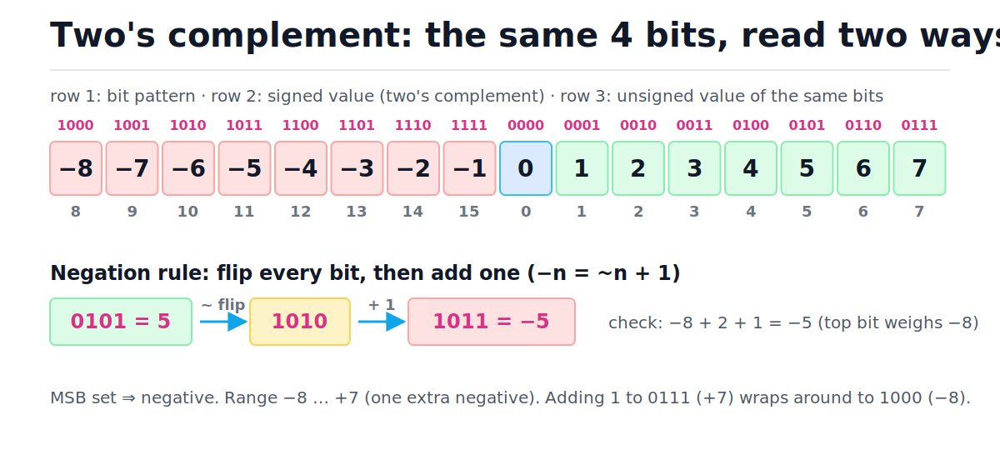
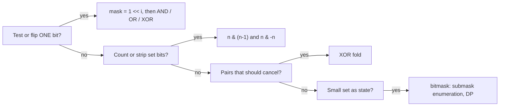
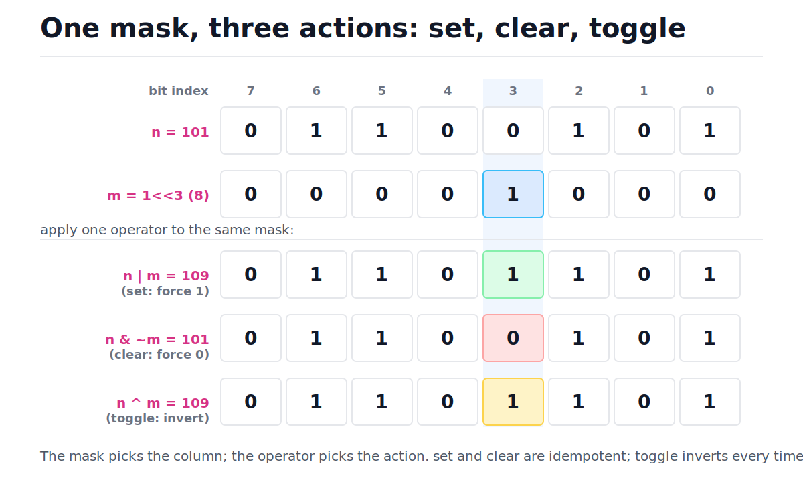
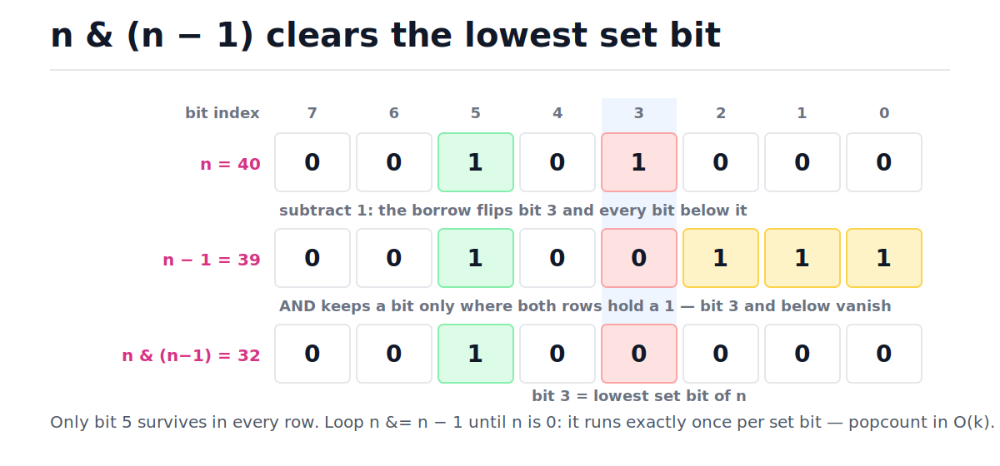

# Bit Manipulation

[toc]

> **TL;DR:** An integer is a row of switches, and the bitwise operators (AND, OR, XOR, NOT, shifts) act on every switch in one O(1) word operation. Five idioms cover almost every interview problem: single-bit masks (`1 << i`), `n & (n - 1)` to drop the lowest set bit, `n & -n` to isolate it, XOR folds to cancel pairs, and integers-as-sets for submask enumeration and bitmask DP. Python ints are arbitrary precision, so emulating fixed-width behavior means masking with `0xFFFFFFFF` and re-interpreting the sign yourself.

## Vocabulary

Each term below carries the rest of the note. Skim now, return when a section uses one.

**Bit**

```math
b \in \{0, 1\}
```

The smallest unit of information: one switch, off or on. Everything in this note is column-wise arithmetic on rows of these switches.

**Machine word**

```math
x = \sum_{i=0}^{w-1} b_i \, 2^i
```

A fixed-width group of w bits — 32 or 64 on real CPUs. Read unsigned, bit i contributes 2^i, so bit 0 is the ones place and bit w−1 is the largest.

**Two's complement**

```math
x = -b_{w-1} \, 2^{w-1} + \sum_{i=0}^{w-2} b_i \, 2^i
```

The universal signed encoding: identical to unsigned except the top bit carries *negative* weight. One representation of zero, and addition hardware works unchanged for signed and unsigned operands.

**Mask**

```math
m = 1 \ll i
```

An integer whose set bits select positions. A single-bit mask addresses one column; wider masks (like `0xFFFFFFFF`) select a whole range.

**Popcount**

```math
\mathrm{popcount}(x) = \sum_{i} b_i
```

The number of set bits in x. Also called Hamming weight. Hardware exposes it as one instruction (`POPCNT`); Python 3.10+ exposes it as `int.bit_count()`.

**Shift**

```math
x \ll k = x \cdot 2^k, \qquad x \gg k = \left\lfloor x / 2^k \right\rfloor
```

Sliding all bits left or right by k columns. Left shift multiplies by 2^k; right shift floor-divides by 2^k.

**XOR (exclusive or)**

```math
a \oplus a = 0, \qquad a \oplus 0 = a, \qquad a \oplus b = b \oplus a
```

Outputs 1 where the inputs differ. Self-inverse and commutative — so anything XORed in can be XORed back out, in any order. This is the cancellation engine behind several classic problems.

**Bitmask (set encoding)**

```math
S \subseteq \{0, \dots, n-1\} \;\longleftrightarrow\; m = \sum_{i \in S} 2^i
```

An integer used as a set: bit i set means element i is in the set. Union is OR, intersection is AND, membership is one shift and an AND. Practical up to n ≈ 25.

**Submask**

```math
s \subseteq m \iff s \,\&\, m = s
```

A mask whose set bits all lie inside another mask's set bits — a subset of the set m encodes. A mask with k set bits has exactly 2^k submasks.

## Intuition

Stop thinking of an integer as a number. Think of it as a fixed-length array of booleans that the CPU can read, write, and combine *all at once*, in a single cycle, with no loop. Every bitwise operator is a column-wise gate applied to all w columns in parallel — that parallelism is the entire appeal.

The only genuinely non-obvious part is negative numbers. Two's complement makes the top bit weigh −2^(w−1) instead of +2^(w−1), which lines up all sixteen 4-bit patterns into one clean number line. Study the figure: the same bits read as signed −8…+7 or unsigned 0…15, and negation is mechanical — flip every bit, add one.



## How it works

Bit problems decompose into a handful of idioms, and recognizing *which* idiom applies is most of the work. The flowchart below is the routing logic; each branch gets its own subsection with a bit-level diagram and runnable code.



### Binary and two's complement

A w-bit pattern has two readings. Unsigned: every bit i adds 2^i. Signed two's complement: identical, except bit w−1 *subtracts* 2^(w−1). The payoff is that the same adder circuit handles both, and negation reduces to a two-step mechanical rule:

```math
-n \;=\; \overline{n} + 1 \pmod{2^w} \qquad \text{(flip every bit, then add one)}
```

Worked example at width 4, matching the figure above:

```text
 5  =  0101
~5  =  1010        flip every bit
+1  =  1011        add one
read signed: -8 + 0 + 2 + 1  =  -5   ✓
```

> [!IMPORTANT]
> In two's complement there is exactly one zero, and the range is asymmetric: −2^(w−1) … 2^(w−1)−1. The most negative value has no positive counterpart — negating it overflows back to itself in fixed-width languages.

### Python ints are arbitrary precision

Python integers have no width: they grow digit by digit, and a negative int behaves as if it had *infinitely many* leading 1-bits. That is why `~5 == -6` and `-1 & anything` keeps every bit of the other operand. When a problem says "assume a 32-bit signed integer" (overflow wrapping, bit reversal), you must emulate the width yourself: AND with `0xFFFFFFFF` keeps the low 32 bits, then re-interpret the top bit as a sign manually.

```python
MASK32 = 0xFFFFFFFF


def to_signed_32(x: int) -> int:
    """Reinterpret the low 32 bits of x as a signed 32-bit integer."""
    x &= MASK32
    return x - (1 << 32) if x >= (1 << 31) else x


assert (-1) & MASK32 == 4294967295            # Python's -1 has infinite 1s
assert to_signed_32((-1) & MASK32) == -1      # reinterpretation restores sign
assert to_signed_32(0x7FFFFFFF + 1) == -2147483648   # INT_MAX + 1 wraps
assert to_signed_32(5) == 5
```

> [!CAUTION]
> Masking alone is not enough. `(-1) & 0xFFFFFFFF` is 4294967295, a huge *positive* Python int — if you forget the sign re-interpretation step, every negative intermediate silently becomes a wrong positive answer. This is the classic bug in "reverse bits" and "add without plus" solutions ported from C.

### The operator table

Six operators do all the work. AND, OR, XOR combine two words column by column; NOT flips one word; shifts slide columns. Their one-bit truth tables are tiny — memorize them as *both / either / differ*:

| a | b | a & b (AND) | a \| b (OR) | a ^ b (XOR) |
| :---: | :---: | :---: | :---: | :---: |
| 0 | 0 | 0 | 0 | 0 |
| 0 | 1 | 0 | 1 | 1 |
| 1 | 0 | 0 | 1 | 1 |
| 1 | 1 | 1 | 1 | 0 |

| Operator | Meaning | Identity to remember |
| :--- | :--- | :--- |
| `a & b` | 1 where **both** | `x & 0 == 0`, `x & ~0 == x` |
| `a \| b` | 1 where **either** | `x \| 0 == x` |
| `a ^ b` | 1 where they **differ** | `x ^ x == 0`, `x ^ 0 == x` |
| `~a` | flip every bit | `~x == -x - 1` in Python |
| `a << k` | slide left, fill 0 | multiply by 2^k |
| `a >> k` | slide right | floor-divide by 2^k |

```python
assert 0b1100 & 0b1010 == 0b1000   # AND: both
assert 0b1100 | 0b1010 == 0b1110   # OR: either
assert 0b1100 ^ 0b1010 == 0b0110   # XOR: exactly one
assert ~5 == -6                    # NOT: ~n == -n - 1 (no fixed width)
assert 5 << 2 == 20                # left shift  = multiply by 2**k
assert 20 >> 2 == 5                # right shift = floor divide by 2**k
assert -7 >> 1 == -4               # arithmetic shift: floors toward -inf
assert (6 & 1) == 0                # parenthesize: == binds tighter than &
```

> [!WARNING]
> `x & 1 == 0` parses as `x & (1 == 0)` because comparison binds tighter than `&` in Python and C. Always parenthesize: `(x & 1) == 0`. This compiles, runs, and is silently wrong — the worst kind of bug.

> [!NOTE]
> Python's `>>` is an *arithmetic* shift: it floors toward negative infinity, so `-7 >> 1 == -4` while `int(-7 / 2) == -3`. C/C++ unsigned types use *logical* shifts (fill with 0); Python has no logical shift because there is no width to fill from — mask first if you need one.

### Check, set, clear, toggle bit i

A single-bit mask `1 << i` addresses one column; the operator you pair it with decides the action. OR forces the bit to 1, AND with the inverted mask forces it to 0, XOR inverts it, and a shift-then-AND reads it. Each is one O(1) expression.

```text
n        = 0 1 1 0 0 1 0 1     (101)
mask     = 0 0 0 0 1 0 0 0     (1 << 3)

n | m    = 0 1 1 0 1 1 0 1     set    -> 109
n & ~m   = 0 1 1 0 0 1 0 1     clear  -> 101  (bit was already 0)
n ^ m    = 0 1 1 0 1 1 0 1     toggle -> 109
(n>>3)&1 = 0                   check
```

The figure aligns all four against the same column — notice that only the masked column ever changes, and that set/clear are idempotent while toggle is not.



```python
def get_bit(n: int, i: int) -> int:
    return (n >> i) & 1


def set_bit(n: int, i: int) -> int:
    return n | (1 << i)


def clear_bit(n: int, i: int) -> int:
    return n & ~(1 << i)


def toggle_bit(n: int, i: int) -> int:
    return n ^ (1 << i)


n = 0b01100101                                 # 101
assert get_bit(n, 3) == 0
assert set_bit(n, 3) == 0b01101101             # 109
assert clear_bit(n, 3) == n                    # already 0: idempotent
assert toggle_bit(n, 3) == 0b01101101
assert toggle_bit(toggle_bit(n, 3), 3) == n    # toggle twice = no-op
```

### Drop the lowest set bit: n & (n − 1)

Subtracting 1 from any integer flips its lowest set bit to 0 and every bit *below* it to 1 — that is just how borrowing works in base 2. AND-ing with the original then erases exactly that region, because the higher bits agree and the flipped region disagrees everywhere. One expression removes exactly one set bit.

```text
n     = 0 0 1 0 1 0 0 0   (40)
n - 1 = 0 0 1 0 0 1 1 1   (39)   borrow flips bit 3 and below
AND   = 0 0 1 0 0 0 0 0   (32)   lowest set bit gone
```



Loop it until zero and you have Kernighan's popcount — one iteration per set bit, O(k) instead of O(w). The same identity gives a one-line power-of-two test: a power of two has exactly one set bit, so removing it must yield zero.

```python
def popcount(n: int) -> int:
    count = 0
    while n:
        n &= n - 1          # drop the lowest set bit
        count += 1
    return count


def is_power_of_two(n: int) -> bool:
    return n > 0 and n & (n - 1) == 0


assert popcount(0b10110100) == 4
assert popcount(0) == 0
assert is_power_of_two(64)
assert not is_power_of_two(0)        # the classic edge case
assert not is_power_of_two(96)
assert popcount(40) == 2 and 40 & 39 == 32
```

Trace of `popcount(0b10110100)` — each step removes exactly one set bit:

| Step | n (binary) | n − 1 (binary) | n & (n − 1) | count | Decision |
| :---: | :--- | :--- | :--- | :---: | :--- |
| 1 | 10110100 | 10110011 | 10110000 | 1 | n ≠ 0 → keep looping |
| 2 | 10110000 | 10101111 | 10100000 | 2 | keep looping |
| 3 | 10100000 | 10011111 | 10000000 | 3 | keep looping |
| 4 | 10000000 | 01111111 | 00000000 | 4 | n = 0 → stop; popcount = 4 |

### Isolate the lowest set bit: n & −n

Negation is flip-plus-one, and the "+1" carry ripples through the trailing zeros of n until it hits the lowest set bit, where it stops. So n and −n agree on exactly one bit: the lowest set bit of n. AND keeps just that bit — the complement of the previous trick (that one removes it, this one extracts it).

```text
n    = 0 0 1 0 1 0 0 0   (40)
-n   = 1 1 0 1 1 0 0 0   (two's complement, low 8 bits = 216)
AND  = 0 0 0 0 1 0 0 0   (8 = lowest set bit isolated)
```

```python
def lowbit(n: int) -> int:
    return n & -n


assert lowbit(40) == 8               # 0b00101000 -> 0b00001000
assert lowbit(12) == 4
assert lowbit(1) == 1
assert lowbit(0) == 0
assert 40 - lowbit(40) == (40 & 39)  # dropping == subtracting the low bit
```

> [!TIP]
> `n & -n` is the indexing engine of the Fenwick tree (binary indexed tree): each node covers `lowbit(i)` elements, and you walk parents by adding or subtracting it. If you see `i += i & (-i)` in the wild, it is a Fenwick traversal. On Python 3.10+ prefer `n.bit_count()` over a hand-rolled popcount; on 3.9 use `bin(n).count("1")`.

### XOR cancellation: single number and swap

XOR is associative, commutative, and self-inverse, so the XOR of a whole list is order-independent and every value appearing an even number of times cancels to zero. If every element appears twice except one, XOR-ing everything leaves exactly the odd one out — O(n) time, O(1) space, no hash table. Column-wise, the fold computes each bit position's parity:

```text
4  =  1 0 0
1  =  0 0 1
2  =  0 1 0
1  =  0 0 1
2  =  0 1 0
      -----   column parity (count of 1s mod 2)
XOR = 1 0 0   = 4    pairs cancel column-wise
```

```python
def single_number(nums: list) -> int:
    acc = 0
    for x in nums:
        acc ^= x            # pairs cancel: a ^ a == 0
    return acc


assert single_number([4, 1, 2, 1, 2]) == 4

a, b = 5, 9                  # swap without a temp (party trick, not prod)
a ^= b
b ^= a                       # b = (b ^ a) ^ b = a
a ^= b                       # a = (a ^ b) ^ a = b
assert (a, b) == (9, 5)
```

The XOR swap is interview trivia, not production code — in Python `a, b = b, a` is faster and clearer, and the XOR version breaks if both names alias the same memory in C.

### Enumerate all submasks of a mask

Treating a mask as a set, you often need every subset of it — assigning workers in a bitmask DP, splitting a group two ways. The idiom `sub = (sub - 1) & mask` walks all submasks in decreasing numeric order: subtracting 1 flips the lowest set bit and everything below, and AND-ing with `mask` discards the flipped bits that fall outside the set, which is precisely "the next smaller integer that is still a submask."

```python
def submasks(mask: int) -> list:
    out = []
    sub = mask
    while sub:
        out.append(sub)
        sub = (sub - 1) & mask
    out.append(0)            # the empty submask
    return out


assert submasks(0b1011) == [0b1011, 0b1010, 0b1001, 0b1000,
                            0b0011, 0b0010, 0b0001, 0b0000]
assert len(submasks(0b1011)) == 2 ** 3   # 2**popcount(mask) submasks
```

Trace for `mask = 1011` — watch the AND snap each candidate back inside the mask:

| Step | sub (binary) | sub − 1 | (sub−1) & mask | Decision |
| :---: | :---: | :---: | :---: | :--- |
| 1 | 1011 | 1010 | 1010 | emit 1011, continue |
| 2 | 1010 | 1001 | 1001 | emit 1010, continue |
| 3 | 1001 | 1000 | 1000 | emit 1001, continue |
| 4 | 1000 | 0111 | 0011 | emit 1000 — AND discards bit 2 |
| 5 | 0011 | 0010 | 0010 | emit 0011, continue |
| 6 | 0010 | 0001 | 0001 | emit 0010, continue |
| 7 | 0001 | 0000 | 0000 | emit 0001; sub hits 0 → emit 0000, stop |

### Bitmask DP in one paragraph

Bitmask DP is state compression: when the state of a search is "which subset of n ≤ ~20 items has been used," encode that subset as an integer 0 … 2^n − 1 and index a DP table with it. The canonical example is the traveling-salesman recurrence `dp[mask][i]` = cheapest way to visit exactly the cities in `mask` ending at city i, filled in O(2^n · n²) time and O(2^n · n) space; "partition into k equal subsets" and "shortest path visiting all nodes" follow the same shape, often combining the submask idiom above with memoization on the mask. The mask is doing the job a frozenset-keyed dict would do, at a fraction of the memory and with O(1) transitions — see [Dynamic Programming](./19-dynamic-programming.md) for the framework this plugs into.

## Complexity

Word-size bitwise operations are single instructions, so the interesting costs come from how many times an idiom runs, and from Python's big-int representation (an operation costs one pass over the 30-bit digits, so it is O(bits/30), which is O(1) for machine-word-size values). Everything in this note:

| Operation | Best | Average / Worst | Space | Notes |
| :--- | :---: | :---: | :---: | :--- |
| `&`, `\|`, `^`, `~`, shifts (word-size) | O(1) | O(1) | O(1) | one CPU instruction |
| Same ops on a Python big int of b bits | O(b/30) | O(b/30) | O(b/30) | per-digit pass; new object each time |
| check / set / clear / toggle bit i | O(1) | O(1) | O(1) | mask + one operator |
| Power-of-two test `n & (n-1) == 0` | O(1) | O(1) | O(1) | guard n > 0 |
| Kernighan popcount | O(1) (n = 0) | O(k), k = set bits ≤ w | O(1) | one iteration per set bit |
| `n & -n` isolate lowest bit | O(1) | O(1) | O(1) | Fenwick step |
| XOR fold (single number) | O(n) | O(n) | O(1) | one pass, no hash table |
| XOR swap | O(1) | O(1) | O(1) | trivia |
| Submasks of one mask with k set bits | O(2^k) | O(2^k) | O(1) iter | output size dominates |
| Submasks of **all** masks of n bits | O(3^n) | O(3^n) | — | derivation below |
| Bitmask DP (TSP shape) | O(2^n · n²) | O(2^n · n²) | O(2^n · n) | practical to n ≈ 20 |

The 3^n bound is the one worth deriving, because it looks like it should be 4^n (2^n masks times up to 2^n submasks each) and is not:

```math
\sum_{m \subseteq \{0,\dots,n-1\}} 2^{\mathrm{popcount}(m)}
\;=\; \sum_{k=0}^{n} \binom{n}{k}\, 2^{k}
\;=\; (1 + 2)^n \;=\; 3^n
```

Why: group masks by popcount k — there are C(n, k) of them, each with 2^k submasks — and the binomial theorem collapses the sum. Equivalently, each of the n bit positions independently lands in one of exactly three states: outside the mask, in the mask but not the submask, or in both. Three choices per position, n positions, 3^n total pairs. Kernighan's bound is simpler: each iteration of `n &= n - 1` removes exactly one set bit and never creates one, so the loop runs exactly popcount(n) ≤ w times.

## Memory model in Python

CPython has no fixed-width int. Every integer is a `PyLongObject`: a reference-counted header plus a variable-length array of 30-bit "digits," with the sign stored in the size field. That layout (detailed in [Memory Model and PyObject Layout](../Programming-Languages/Python/13-memory-model-and-pyobject-layout.md)) has three consequences for bit work. First, a bitwise op walks all digits, so cost grows with magnitude — O(1) only while values fit in a couple of digits. Second, ints are immutable: `x |= mask` builds a *new* object every time, so a hot loop that flips bits allocates on every iteration. Third, small ints from −5 to 256 are preallocated singletons, so tiny masks cost no allocation at all.

```python
import sys

assert sys.getsizeof(1 << 1000) > sys.getsizeof(1)   # more 30-bit digits
assert (255).bit_length() == 8
assert bin(180).count("1") == 4          # portable popcount on Python 3.9

x = 5
y = x | 2                                # immutability: a brand-new object
assert x == 5 and y == 7

a, b = 256, 256
assert a is b                            # small-int cache spans -5..256
```

A 64-bit CPU does any of these in one cycle on registers; CPython adds interpreter dispatch and object allocation on top, easily 50–100× the raw cost. The idioms still pay off in Python because they replace whole data structures — an int-as-set is one heap object versus a hash table of boxed elements, it fits in cache, hashes in O(1) as a dict key for memoization, and comparisons are single big-int ops. For bulk bitset work beyond ~10⁵ flags, reach for `bytearray` or NumPy arrays instead of one giant int.

## Real-world example

Routers, firewalls, and every cloud security group decide "is this IP inside this network?" with two bitwise operations. An IPv4 address is just a 32-bit integer; a CIDR block like `10.0.0.0/16` means "the top 16 bits identify the network." Build the address with shifts, build the netmask with a shift of an all-ones run, and membership is one AND plus one compare — this is the exact computation in the IP forwarding path described in [Network Layer: IP](../Computer-Networking/4-network-layer-ip.md).

```python
def ip_to_int(ip: str) -> int:
    a, b, c, d = (int(part) for part in ip.split("."))
    return (a << 24) | (b << 16) | (c << 8) | d


def in_cidr(ip: str, cidr: str) -> bool:
    net, prefix_str = cidr.split("/")
    prefix = int(prefix_str)
    mask = ((1 << prefix) - 1) << (32 - prefix)    # prefix ones, then zeros
    return (ip_to_int(ip) & mask) == (ip_to_int(net) & mask)


assert ip_to_int("10.0.0.1") == 0x0A000001
assert in_cidr("10.0.5.7", "10.0.0.0/16")
assert not in_cidr("10.1.0.1", "10.0.0.0/16")
assert in_cidr("192.168.1.130", "192.168.1.128/25")
assert not in_cidr("192.168.1.100", "192.168.1.128/25")
```

Every packet through a Linux box runs this masked comparison against a routing table — at line rate, which is only possible because it is two single-cycle instructions. The same flags-in-an-int pattern shows up as Unix file permissions (`0o644`), `O_RDWR | O_CREAT` open flags, feature-flag columns in databases, and chess engine bitboards.

## When to use / when NOT to use

Reach for bits when the structure of the problem is *fixed positions with on/off state*, and the savings compound: less memory, cache-friendly, O(1) set algebra, hashable state. Avoid them when they obscure intent without buying measurable performance.

**Use bits when:**

- The state is a set over a small universe (n ≤ ~25): visited cities, chosen workers, used digits — especially as DP/memo keys via [Dynamic Programming](./19-dynamic-programming.md) or pruning state in [Backtracking](./21-backtracking.md).
- You are packing flags or protocol fields — permissions, TCP header bits, instruction encodings.
- A pair-cancellation or parity argument fits (single number, missing number).
- You need digit-level access to integers, as in radix sort's byte extraction — see [Linear-Time Sorting](./12-linear-time-sorting.md).
- Constant factors genuinely matter: inner loops, network data paths, bitboards.

**Avoid bits when:**

- The universe exceeds ~25 elements and your algorithm touches all 2^n masks — 2^25 states is already 33M table entries.
- A `set` or `dataclass` of booleans expresses the business logic; `user.flags & 0x40` is a maintenance trap compared to `user.is_admin`.
- The data is floating-point — bit tricks on float representations are a specialist topic, not this toolkit.
- You are in a Python hot loop hoping bit twiddling beats the interpreter overhead; restructure with built-ins or NumPy instead.

## Common mistakes

- **"`~n` flips the bits and gives a positive number"** — in Python `~n == -n - 1`, always negative for non-negative n, because ints have infinite sign extension. Mask afterward (`~n & 0xFF`) if you want a fixed-width flip.
- **"`x & 1 == 0` tests evenness"** — precedence bug: it parses as `x & (1 == 0)`. Write `(x & 1) == 0` or just `x % 2 == 0`.
- **"`n & (n - 1) == 0` means power of two"** — zero passes the test too. The correct predicate is `n > 0 and n & (n - 1) == 0`.
- **"Right shift halves toward zero"** — Python's `>>` floors toward negative infinity: `-7 >> 1 == -4`, while C truncates `-7 / 2` to −3. Off-by-one bugs in binary search midpoints and dichotomies follow.
- **"Left shift will overflow"** — Python never overflows; that is the trap. Solutions ported from C that *rely* on 32-bit wraparound run forever or return giant ints unless you mask with `0xFFFFFFFF` after every operation.
- **"XOR swap is an optimization"** — in CPython it is slower than tuple swap and fails in C when both operands alias the same address. It is an interview curiosity only.

## Interview questions and answers

A short setup, then the answer the way you would say it out loud.

**1. Test whether an integer is a power of two, in O(1).**
**Answer:** A power of two has exactly one set bit, and `n & (n - 1)` removes the lowest set bit, so for a power of two the result is zero. I have to guard `n > 0`, because zero also AND-folds to zero but is not a power of two. So: `n > 0 and n & (n - 1) == 0`.

**2. Every number in an array appears twice except one. Find it without extra memory.**
**Answer:** XOR everything together. XOR is commutative and self-inverse, so each pair cancels to zero and the lone element survives. One pass, O(n) time, O(1) space — strictly better than the hash-set approach on space, and no hashing cost.

**3. Count set bits for every number from 0 to n in O(n) total.**
**Answer:** Dynamic programming on the shifted value: `dp[i] = dp[i >> 1] + (i & 1)`. Shifting right drops the last bit, which I have already computed, and `i & 1` adds that last bit back. Each entry is O(1), so the whole table is O(n) — much better than running an O(k) popcount n times.

**4. What does `~5` return in Python, and why is it different from C?**
**Answer:** −6, because Python ints are arbitrary precision and behave as if negative numbers carry infinite leading ones, so NOT is exactly `-n - 1`. In C on a `uint32_t`, `~5` is the fixed-width flip 4294967290. To get C's behavior in Python I mask: `~5 & 0xFFFFFFFF`.

**5. How do you emulate 32-bit signed overflow in Python — say for "reverse integer" with overflow detection?**
**Answer:** After every arithmetic step I AND with `0xFFFFFFFF` to truncate to 32 bits, and when I need the signed reading I check the top bit: if the value is at least 2³¹, subtract 2³². That two-step mask-and-reinterpret is the standard recipe, because masking alone leaves a big positive int where C would have a negative.

**6. Two elements appear once, everything else twice. Find both in O(n)/O(1).**
**Answer:** XOR everything — pairs cancel, leaving `x ^ y`. That value is nonzero, so it has some set bit, and I isolate one with `diff & -diff`; x and y must differ at that bit. Then I partition the array by that bit and XOR each partition separately: each partition contains exactly one of the singles plus complete pairs, so the two folds yield x and y.

**7. Why does `sub = (sub - 1) & mask` enumerate every submask?**
**Answer:** Subtracting one gives the next smaller integer, and AND-ing with the mask zeroes any bits that fell outside it — which is exactly "the largest integer smaller than `sub` whose bits all lie inside `mask`." Starting from the mask itself, it visits every submask in strictly decreasing order, so nothing repeats and nothing is skipped; I just remember to handle the empty submask when the loop hits zero.

**8. An array holds n distinct numbers from 0 to n — one is missing. Find it without sorting.**
**Answer:** XOR all the indices 0..n and all the values. Every present number appears once as a value and once as an index, so it cancels; the missing number appears only as an index and survives. Same idea as single-number, and it avoids the overflow concern the summation formula has in fixed-width languages — though in Python `n*(n+1)//2 - sum(nums)` is equally fine.

## Practice path

Drill in this order — each step adds exactly one idea on top of the previous one.

1. **LC 191 — Number of 1 Bits.** Implement Kernighan's loop; explain why it is O(k) not O(w).
2. **LC 231 — Power of Two.** One-liner with the n > 0 guard; then LC 342 (power of four) by adding a position mask `0x55555555`.
3. **LC 136 — Single Number.** XOR fold; narrate the cancellation argument out loud.
4. **LC 268 — Missing Number.** Same fold, indices versus values.
5. **LC 190 — Reverse Bits.** Forces 32-bit discipline in Python: build the result with shifts and mask every step.
6. **LC 338 — Counting Bits.** The `dp[i >> 1]` recurrence — first contact between bits and DP.
7. **LC 260 — Single Number III.** Combines XOR fold with `diff & -diff` partitioning.
8. **LC 78 — Subsets.** Generate the power set by counting masks 0 … 2^n − 1; compare with the recursive version from [Backtracking](./21-backtracking.md).
9. **LC 698 — Partition to K Equal Sum Subsets.** Memoize on the mask; submask enumeration appears naturally.
10. **LC 847 — Shortest Path Visiting All Nodes.** BFS over (node, visited-mask) states — bitmask state inside [Graphs: BFS and DFS](./09-graphs-bfs-and-dfs.md) territory.

## Copyable takeaways

- Two's complement: top bit weighs −2^(w−1); negate with flip-then-add-one; range is asymmetric.
- Python ints are width-less; emulate 32-bit with `x & 0xFFFFFFFF`, then subtract 2³² when the top bit is set.
- `~n == -n - 1` in Python. Always.
- Single-bit toolkit: check `(n >> i) & 1`, set `n | (1 << i)`, clear `n & ~(1 << i)`, toggle `n ^ (1 << i)` — all O(1).
- `n & (n - 1)` drops the lowest set bit → Kernighan popcount O(k), power-of-two test (guard n > 0).
- `n & -n` isolates the lowest set bit → Fenwick trees, partition tricks.
- XOR fold cancels pairs: single number, missing number — O(n) time, O(1) space.
- Submasks: `sub = (sub - 1) & mask`; a k-bit mask has 2^k submasks; all submasks of all masks total 3^n.
- Bitmask DP = sets as integers; practical ceiling around n ≈ 20–25.
- Parenthesize around `&` and `|` — comparisons bind tighter.

## Sources

- Henry S. Warren, Jr., *Hacker's Delight*, 2nd ed. — Ch. 2 "Basics" (the x & (x−1) family), Ch. 5 "Counting Bits".
- Donald E. Knuth, *The Art of Computer Programming*, Vol. 4A, §7.1.3 "Bitwise Tricks and Techniques".
- Sean Eron Anderson, *Bit Twiddling Hacks* — <https://graphics.stanford.edu/~seander/bithacks.html>
- Python language reference, binary bitwise operations — <https://docs.python.org/3/reference/expressions.html#binary-bitwise-operations>
- Python stdlib, `int.bit_length` / `int.bit_count` — <https://docs.python.org/3/library/stdtypes.html#additional-methods-on-integer-types>
- CPython `PyLongObject` (30-bit digit representation) — <https://github.com/python/cpython/blob/main/Objects/longobject.c>
- CP-Algorithms, "Submask Enumeration" (the 3^n derivation) — <https://cp-algorithms.com/algebra/all-submasks.html>

## Related

- [DSA Curriculum Index](./00-dsa-curriculum-index.md)
- [Big-O Notation and Complexity Analysis](./01-big-o-notation-and-complexity-analysis.md)
- [Dynamic Programming](./19-dynamic-programming.md)
- [Backtracking](./21-backtracking.md)
- [Network Layer: IP](../Computer-Networking/4-network-layer-ip.md)
- [Memory Model and PyObject Layout](../Programming-Languages/Python/13-memory-model-and-pyobject-layout.md)
