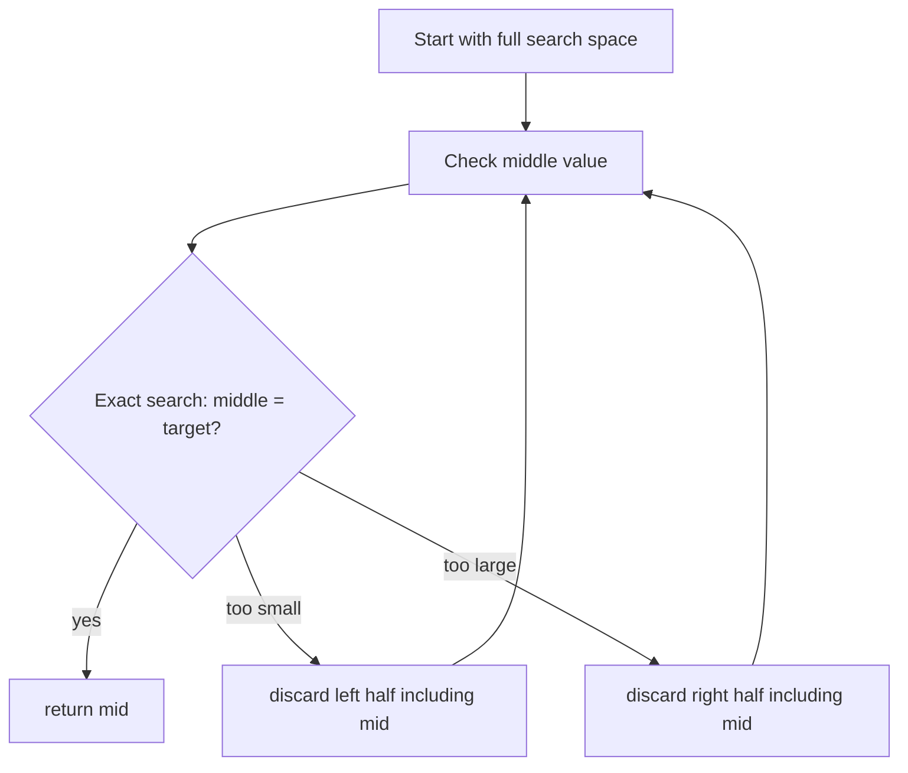
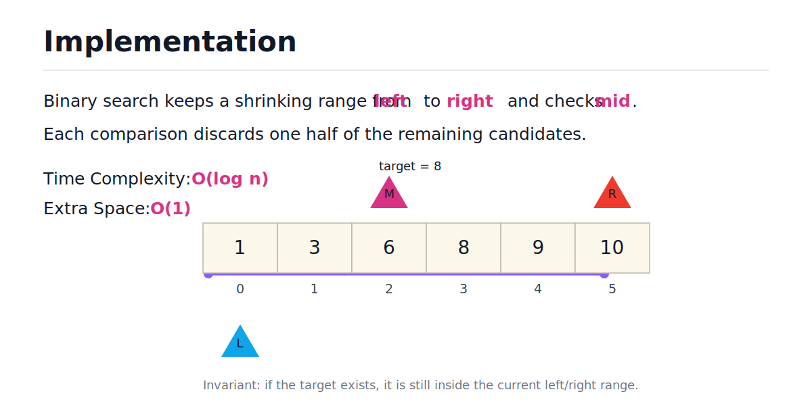
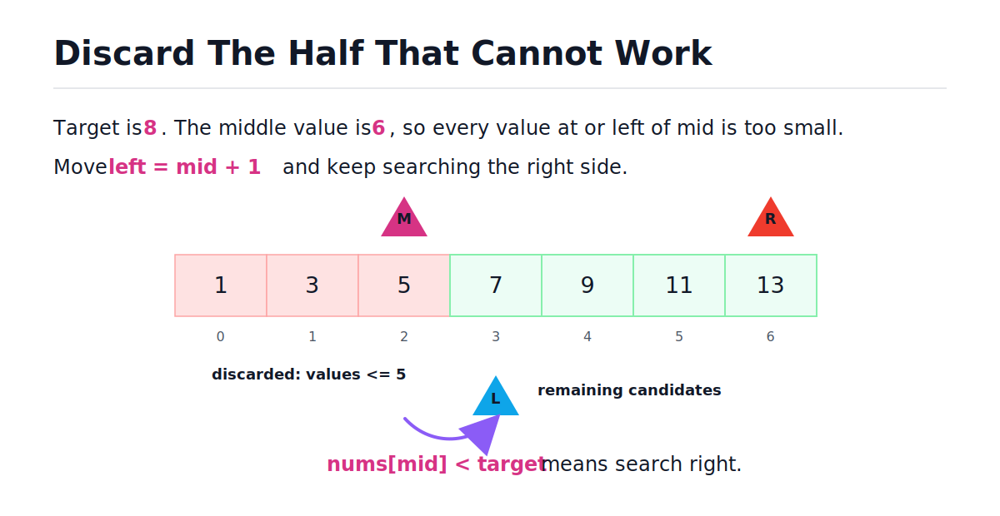
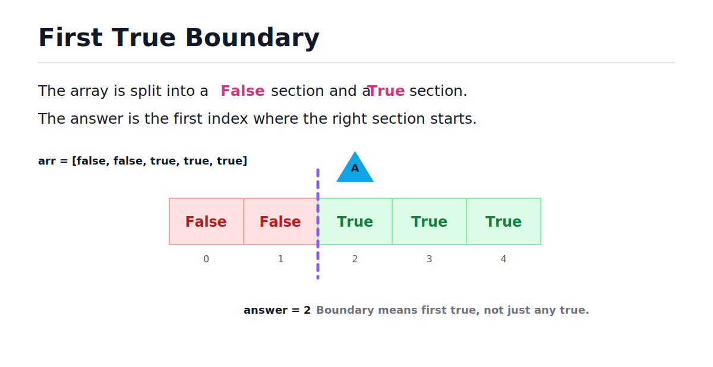
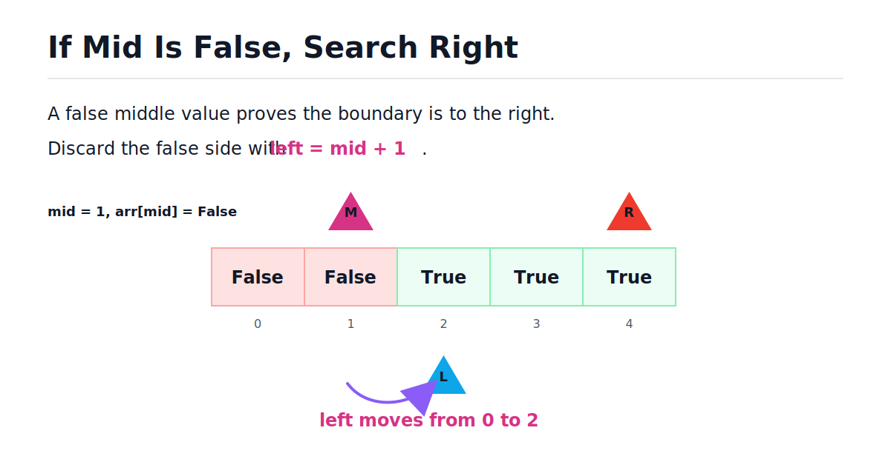
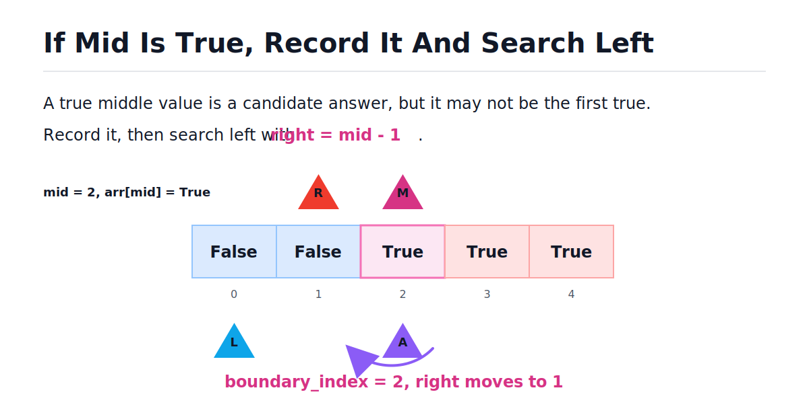
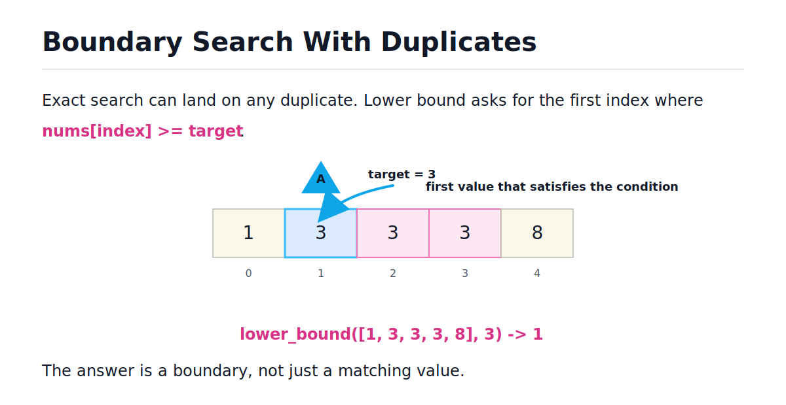

# Binary Search

[toc]

> **TL;DR:** Binary search is the algorithmic pattern for repeatedly cutting a sorted or monotonic search space in half. Use it when one comparison tells you which half cannot contain the answer. The exact-match form returns an index or -1; the boundary form records the first index where a condition becomes true and continues searching left. Both run in O(log n) time with O(1) extra memory.

## Vocabulary

**Sorted search space**

```math
a_0 \le a_1 \le a_2 \le \cdots \le a_{n-1}
```

A sequence where values are ordered. Binary search needs this ordering, or an equivalent monotonic rule, so it can safely discard half of the remaining candidates.

**Index**

```math
0 \le i < n
```

A position in a Python list. Binary search uses integer indices such as `lo`, `mid`, and `hi` to avoid copying slices.

**Search space**

```math
[lo, hi]
```

The range of candidate positions that might still contain the answer. Each loop iteration shrinks this range.

**Midpoint**

```math
mid = lo + \left\lfloor \frac{hi - lo}{2} \right\rfloor
```

The middle index of the current search space. Python integers do not overflow, but this midpoint formula is still a good habit across languages.

**Monotonic predicate**

```math
False,\ False,\ False,\ True,\ True,\ True
```

A yes/no condition that changes direction only once. Boundary binary search finds the first true value or the last false value. The predicate may literally be a boolean array, or it may be a function applied to each candidate.

**Boundary**

```math
first\ index\ i\ where\ predicate(i) = True
```

The first position where the search space transitions from false to true. Boundary binary search returns this index, or -1 when no true value exists.

**Candidate answer**

```math
boundary\_index
```

The best true index found so far during boundary search. It starts at -1 because no true value has been recorded yet.

**Time complexity**

```math
O(\log n)
```

The amount of work grows with the number of times n can be divided by 2 before reaching 1.

**Extra space complexity**

```math
O(1)
```

The algorithm uses a fixed number of extra variables regardless of input size. The input list itself is not counted as extra space.

## Intuition

Binary search is not about "checking the middle" by itself. The real idea is discarding a half with proof. After each comparison, you should be able to say why the answer cannot be in one side.

If the array is sorted and `nums[mid]` is too small, everything left of `mid` is also too small. If `nums[mid]` is too large, everything right of `mid` is also too large. The same logic applies when the "value" is a boolean: once a position is false, nothing to its left can be true.



> [!IMPORTANT]
> Binary search only works when the discard decision is valid. Sorted arrays, monotonic predicates, and "minimum value that works" problems usually provide that validity. If the predicate can be true, then false, then true again, binary search is unsafe.

The visual below shows the exact mental model: `left` and `right` wrap the current candidate range, while `mid` is the single value you compare before discarding one side.



## Exact-Match Binary Search

The exact-match version answers this question: "Does this sorted list contain the target, and if so, at what index?" Use a closed interval, where both `lo` and `hi` are valid candidate indices. The loop condition `lo <= hi` means "there is still at least one candidate index to check." Once `lo` moves past `hi`, the search space is empty.

This version returns the index if found, otherwise -1.

```python
def binary_search(nums: list, target: int) -> int:
    lo = 0
    hi = len(nums) - 1

    while lo <= hi:
        mid = lo + (hi - lo) // 2

        if nums[mid] == target:
            return mid

        if nums[mid] < target:
            lo = mid + 1
        else:
            hi = mid - 1

    return -1


assert binary_search([], 10) == -1
assert binary_search([5], 5) == 0
assert binary_search([1, 3, 5, 7, 9], 1) == 0
assert binary_search([1, 3, 5, 7, 9], 9) == 4
assert binary_search([1, 3, 5, 7, 9], 8) == -1
```

## Calculating Mid

When the current search range has an odd number of elements, there is one obvious middle index. When it has an even number of elements, there are two middle candidates. The usual convention is to pick the first one, also called the lower middle.

With integer division, Python naturally picks that lower middle. Both formulas below produce the same result in Python, where integer overflow is not a practical concern.

| left | right | formula | mid | Meaning |
| ---: | ---: | :--- | ---: | :--- |
| 0 | 5 | `(0 + 5) // 2` | 2 | lower middle of six elements |
| 0 | 6 | `(0 + 6) // 2` | 3 | exact middle of seven elements |
| 4 | 5 | `(4 + 5) // 2` | 4 | lower middle of two elements |

The safer formula avoids integer overflow in fixed-width integer languages and is worth recognizing in interviews.

```math
mid = left + \left\lfloor \frac{right - left}{2} \right\rfloor
```

```python
left, right = 0, 5
mid_simple = (left + right) // 2
mid_safe = left + (right - left) // 2
assert mid_simple == mid_safe == 2
```

## Step-By-Step Trace

Tracing makes binary search much easier to debug. Keep a table of `lo`, `hi`, `mid`, the middle value, and the decision. The important part is not the arithmetic but showing that every move removes values that cannot possibly be the answer.

For `nums = [1, 3, 5, 7, 9, 11, 13]` and `target = 9`:

| Step | lo | hi | mid | nums[mid] | Decision |
| ---: | ---: | ---: | ---: | ---: | :--- |
| 1 | 0 | 6 | 3 | 7 | too small, move `lo` to 4 |
| 2 | 4 | 6 | 5 | 11 | too large, move `hi` to 4 |
| 3 | 4 | 4 | 4 | 9 | found target |

This visual shows the first kind of discard: if the middle value is too small, the answer cannot be at `mid` or anywhere left of it.



## Deducing Binary Search

Do not memorize binary search as a magic loop. Derive it from three questions: when does the search space become empty, which side can be discarded, and whether the current middle element can be discarded.

| Question | Answer | Why |
| :--- | :--- | :--- |
| When do I stop? | Stop when `left > right`. | At that point, no candidate indices remain. |
| Why use `left <= right`? | A one-element range is still searchable. | If `left == right`, that one element might be the target. |
| If `arr[mid] < target`, what moves? | `left = mid + 1`. | `mid` and everything to its left is too small. |
| If `arr[mid] > target`, what moves? | `right = mid - 1`. | `mid` and everything to its right is too large. |
| Do I discard `mid`? | Yes, after checking equality. | If it is not equal, it cannot be the final answer. |

> [!TIP]
> In an interview, say the discard proof out loud: "Since the array is sorted and `arr[mid]` is smaller than the target, all values at or before `mid` are too small, so I move `left` to `mid + 1`."

## Why The Time Is O(log n)

Each comparison removes about half of the remaining candidates. After one step, about n divided by 2 remain. After two steps, about n divided by 4. After k steps, about n divided by 2 to the k.

```math
\frac{n}{2^k} \le 1 \implies k \ge \log_2(n)
```

A list with about 1,000,000 items needs only about 20 middle checks because 2 to the 20 is about 1,000,000.

## Memory Model In Python

The iterative algorithm keeps only a few integer variables: `lo`, `hi`, and `mid`. It does not copy the list and does not create a smaller list at each step.

In Python, a list stores references to objects and supports O(1) indexing. That matters because binary search constantly jumps to `nums[mid]`. The variable `value` in the snippet below is just another reference to the existing object — it does not copy the whole list.

```python
def binary_search_memory_shape(nums: list, target: int) -> int:
    lo = 0
    hi = len(nums) - 1

    while lo <= hi:
        mid = lo + (hi - lo) // 2
        value = nums[mid]

        if value == target:
            return mid
        if value < target:
            lo = mid + 1
        else:
            hi = mid - 1

    return -1
```

> [!WARNING]
> Do not implement binary search by slicing, like `nums = nums[:mid]` or `nums = nums[mid + 1:]`. Slicing copies list elements into a new list, which adds extra memory and extra time.

## Recursive Version And Stack Memory

Recursive binary search is conceptually clean, but in Python it is usually less practical than the iterative version. Every recursive call creates a new stack frame, so the extra memory becomes O(log n). This version is useful for understanding the idea, not as the default interview implementation.

```python
from typing import Optional


def binary_search_recursive(
    nums: list,
    target: int,
    lo: int = 0,
    hi: Optional[int] = None,
) -> int:
    if hi is None:
        hi = len(nums) - 1

    if lo > hi:
        return -1

    mid = lo + (hi - lo) // 2

    if nums[mid] == target:
        return mid
    if nums[mid] < target:
        return binary_search_recursive(nums, target, mid + 1, hi)
    return binary_search_recursive(nums, target, lo, mid - 1)


assert binary_search_recursive([1, 3, 5, 7, 9], 7) == 3
assert binary_search_recursive([1, 3, 5, 7, 9], 2) == -1
```

Both versions do O(log n) comparisons. The iterative version uses O(1) extra space; the recursive version uses O(log n) stack space.

## Boundary Binary Search

Many interview problems do not ask "is this exact value present?" They ask for the first position where something becomes true: first bad version, first value greater than or equal to a target, minimum capacity that works, or smallest speed that finishes on time. This is boundary binary search.

The key insight is that finding a true value during the search does not mean you are done. There could be an earlier true value to its left, so you record the candidate and keep searching.



> [!IMPORTANT]
> The reason binary search works on a boolean boundary is monotonicity. Once the array becomes true, it stays true. If the predicate can oscillate, binary search is not valid here.

### The Decision Rule

At each middle index there are only two cases. The value is either false or true, and each case gives a safe way to shrink the search range.

| Middle value | What it means | What to do |
| :--- | :--- | :--- |
| `False` | This index and everything left of it cannot be the first true. | Move `left` to `mid + 1`. |
| `True` | This index is a valid candidate, but there may be an earlier true. | Record `mid`, then move `right` to `mid - 1`. |

True does not mean "done." It means "possible answer; keep looking left."

### False Case: Discard Left

If `arr[mid]` is false, the first true cannot be at `mid` or anywhere to the left. Since the boolean array is sorted, all earlier values must also be false. Move the left boundary forward.



```python
arr = [False, False, True, True, True]
left, mid = 0, 1

if not arr[mid]:
    left = mid + 1

assert left == 2
```

### True Case: Record And Search Left

If `arr[mid]` is true, then `mid` could be the first true. But because there may be another true value before it, we cannot stop immediately. Record `mid` as the best answer so far, then move the right boundary left.



```python
arr = [False, False, True, True, True]
mid = 2
right = len(arr) - 1
boundary_index = -1

if arr[mid]:
    boundary_index = mid
    right = mid - 1

assert boundary_index == 2
assert right == 1
```

### Implementation: find_boundary

Use the same closed interval shape as exact-match binary search. Both `left` and `right` are valid candidate indices while the loop runs. The extra variable `boundary_index` remembers the best true index found so far and starts at -1 to handle the no-true case naturally.

```python
def find_boundary(arr: list) -> int:
    left, right = 0, len(arr) - 1
    boundary_index = -1

    while left <= right:
        mid = (left + right) // 2

        if arr[mid]:
            boundary_index = mid
            right = mid - 1
        else:
            left = mid + 1

    return boundary_index


assert find_boundary([False, False, True, True, True]) == 2
assert find_boundary([False, False, False]) == -1
assert find_boundary([True, True, True]) == 0
assert find_boundary([False, True]) == 1
assert find_boundary([True]) == 0
assert find_boundary([]) == -1
```

### Trace: find_boundary

Tracing boundary search is mostly about watching `boundary_index`. Every time the middle value is true, update the recorded answer and continue searching left.

For `arr = [False, False, True, True, True]`:

| Step | left | right | mid | arr[mid] | boundary_index | Decision |
| ---: | ---: | ---: | ---: | :---: | ---: | :--- |
| 1 | 0 | 4 | 2 | `True` | 2 | record 2, move `right` to 1 |
| 2 | 0 | 1 | 0 | `False` | 2 | move `left` to 1 |
| 3 | 1 | 1 | 1 | `False` | 2 | move `left` to 2 |

Now `left > right`, so the loop stops. The recorded boundary index is 2.

### Alternative: Keep-Current Style

There is another valid style: when `arr[mid]` is true, keep `mid` in the range by setting `right = mid`. This works, but only if the loop condition is `while left < right`. Using `right = mid` with `while left <= right` creates an infinite loop when `left == right` because `mid` equals `right` and the range never shrinks.

> [!WARNING]
> Binary search must make progress every iteration. If neither boundary moves, you have created an infinite loop. Pair `right = mid` with `while left < right`; pair `right = mid - 1` with `while left <= right`.

The keep-current version needs a final check after the loop because there is no `boundary_index` variable to return.

```python
def find_boundary_keep_current(arr: list) -> int:
    if not arr:
        return -1

    left, right = 0, len(arr) - 1

    while left < right:
        mid = (left + right) // 2

        if arr[mid]:
            right = mid
        else:
            left = mid + 1

    return left if arr[left] else -1


assert find_boundary_keep_current([False, False, True, True, True]) == 2
assert find_boundary_keep_current([False, False, False]) == -1
assert find_boundary_keep_current([True, True]) == 0
assert find_boundary_keep_current([]) == -1
```

For learning, the `boundary_index` version is often easier because it keeps the same `while left <= right` shape as exact-match binary search.

## Lower Bound And Duplicates

The most reusable boundary helper is `lower_bound`: find the first index where `nums[index] >= target`. This is useful for search insert position, finding the first occurrence in a duplicates array, and many other problems. It uses a half-open interval where `lo` is included and `hi` is excluded, so returning `len(nums)` is valid when every value is smaller than the target.

```python
def lower_bound(nums: list, target: int) -> int:
    lo = 0
    hi = len(nums)

    while lo < hi:
        mid = lo + (hi - lo) // 2

        if nums[mid] < target:
            lo = mid + 1
        else:
            hi = mid

    return lo


assert lower_bound([1, 3, 3, 3, 8], 3) == 1
assert lower_bound([1, 3, 3, 3, 8], 4) == 4
assert lower_bound([1, 3, 3, 3, 8], 10) == 5
```

Exact-match binary search can return any matching index when duplicates exist. If the problem asks for the first occurrence, use `lower_bound` instead. Find the first index where the value is greater than or equal to target, then verify that index actually contains the target.

```python
def first_occurrence(nums: list, target: int) -> int:
    index = lower_bound(nums, target)

    if index == len(nums) or nums[index] != target:
        return -1

    return index


assert first_occurrence([1, 3, 3, 3, 8], 3) == 1
assert first_occurrence([1, 3, 3, 3, 8], 2) == -1
```

The visual below shows why boundary search matters for duplicates. All three 3 values match the target, but lower bound returns the first matching index.



> [!TIP]
> Once duplicates appear, stop thinking "find target" and start thinking "find the left boundary of target." The `lower_bound` function is the primitive that powers first-occurrence, last-occurrence, range-count, and search insert position.

## Binary Search On The Answer

Sometimes the search space is not an array. It can be a range of possible integer answers. The rule is the same: you need a monotonic predicate that says whether a candidate answer works. This is the most powerful generalization of binary search and appears in capacity/speed/scheduling problems.

This generic helper finds the first integer in `[lo, hi]` where `predicate(value)` is true. It is the same boundary pattern as `find_boundary`, applied to a numeric range instead of an array.

```python
from typing import Callable


def first_true(lo: int, hi: int, predicate: Callable[[int], bool]) -> int:
    while lo < hi:
        mid = lo + (hi - lo) // 2

        if predicate(mid):
            hi = mid
        else:
            lo = mid + 1

    return lo
```

For example, "first bad version" is a monotonic problem. Once a version is bad, every later version is also bad. The list of versions is gone, but the binary-search idea is still present — the sorted structure is now logical.

```python
def first_bad_version(n: int, is_bad: Callable[[int], bool]) -> int:
    return first_true(1, n, is_bad)


def make_is_bad(first_bad: int) -> Callable[[int], bool]:
    return lambda version: version >= first_bad


assert first_bad_version(10, make_is_bad(6)) == 6
assert first_bad_version(1, make_is_bad(1)) == 1
```

## Complexity Summary

Both the exact-match and boundary forms share the same asymptotic costs. The only memory difference is when you use recursion.

| Algorithm | Time | Extra Space | Notes |
| :--- | :---: | :---: | :--- |
| Exact match (iterative) | O(log n) | O(1) | default for interviews |
| Boundary / find_boundary | O(log n) | O(1) | closed interval, `boundary_index` |
| Lower bound | O(log n) | O(1) | half-open interval, returns insert pos |
| first_true on range | O(log n) | O(1) | search space is integer range |
| Exact match (recursive) | O(log n) | O(log n) | stack frames cost extra memory |

## Choosing The Right Template

Choose the template based on what the problem asks you to return. Most binary search bugs come from mixing the interval rules from one template with another.

| Goal | Template | Loop condition | Return |
| :--- | :--- | :--- | :--- |
| Find exact target | Closed interval | `while lo <= hi` | index or -1 |
| Find insert position | Lower bound (half-open) | `while lo < hi` | index from 0 to n |
| Find first true in boolean array | `boundary_index` | `while lo <= hi` | first true index or -1 |
| Find first true (keep-current) | keep-current | `while lo < hi` | post-loop check |
| Find first true answer on range | `first_true` helper | `while lo < hi` | smallest working value |
| Find first duplicate occurrence | Lower bound plus check | `while lo < hi` | first index or -1 |

> [!TIP]
> In interviews, state the invariant before coding. Example: "I will keep `lo` and `hi` as the range where the answer can still exist, and every update will preserve that."

## Real-World Example

Binary search on the answer appears in shipping and scheduling problems. The task is: given n packages with given weights, and d days to ship them all, find the minimum ship capacity so every package arrives on time. Capacity is monotonic: if capacity C works, any larger capacity also works. So binary search finds the minimum C.

```python
from typing import List


def ship_within_days(weights: List[int], days: int) -> int:
    def can_ship(capacity: int) -> bool:
        trips = 1
        current = 0
        for w in weights:
            if current + w > capacity:
                trips += 1
                current = 0
            current += w
        return trips <= days

    lo = max(weights)      # must be able to carry the heaviest single package
    hi = sum(weights)      # can always ship everything in one day

    return first_true(lo, hi, can_ship)


def first_true(lo: int, hi: int, predicate: Callable[[int], bool]) -> int:
    while lo < hi:
        mid = lo + (hi - lo) // 2
        if predicate(mid):
            hi = mid
        else:
            lo = mid + 1
    return lo


assert ship_within_days([1, 2, 3, 4, 5, 6, 7, 8, 9, 10], 5) == 15
assert ship_within_days([3, 2, 2, 4, 1, 4], 3) == 6
assert ship_within_days([1, 2, 3, 1, 1], 4) == 3
```

The `can_ship` function is the monotonic predicate. The search space is the range `[max(weights), sum(weights)]`, both of which are natural bounds derived from the problem.

## Python Standard Library

Python ships the `bisect` module, which is a production-ready implementation of the lower-bound and upper-bound operations. It does not directly answer every interview problem, but it is useful in real code and helps confirm what boundary search means. For LeetCode practice, implement the logic yourself until the pattern is automatic. For production Python, prefer the standard library when it directly matches the task.

```python
from bisect import bisect_left

nums = [1, 3, 3, 3, 8]

assert bisect_left(nums, 3) == 1
assert bisect_left(nums, 4) == 4
assert bisect_left(nums, 10) == 5
```

## When To Use Binary Search

Use binary search when the problem gives you a way to eliminate half the remaining possibilities. The input does not always have to be a sorted list, but there must be an ordered or monotonic structure. Binary search on the answer is available whenever you can define a monotonic yes/no check over a range of candidate values.

Good signals:

- The array is already sorted.
- The problem asks for insertion position, first occurrence, or last occurrence.
- The phrase "minimum value that works" or "maximum value that works" appears.
- A yes/no check changes from false to true only once.
- Brute force scans many possible answers one by one.
- Random access is cheap, as with Python lists.

## When Not To Use Binary Search

Binary search is the wrong tool when you cannot prove which half to discard. If the input is unsorted and there is no monotonic condition, checking the middle tells you almost nothing.

Avoid binary search when:

- The data is unsorted and sorting would break the required output.
- You need every matching value, not one boundary or one position.
- The structure is a linked list, where jumping to the middle is not O(1).
- The predicate can flip from false to true and back to false.
- A hash map gives a cleaner O(n) solution for one-pass lookup.

Sorting first can still be valid, but then the full runtime includes sorting.

```math
O(n \log n)\ \text{for sorting} + O(\log n)\ \text{for search} = O(n \log n)
```

## Common Mistakes

Most binary search mistakes are off-by-one mistakes. They happen when the code does not match the interval meaning, or when the programmer forgets that finding a true value does not end the search in boundary mode.

- **Forgetting the sorted or monotonic requirement** — binary search needs a safe discard rule.
- **Using `while lo < hi` with closed-interval updates** — this can skip the last candidate.
- **Updating `lo = mid` instead of `lo = mid + 1`** — this can cause an infinite loop.
- **Returning `mid` after the loop without checking** — the target may not exist.
- **Returning immediately when `arr[mid]` is true in boundary search** — this may return a later true, not the first true.
- **Not recording the candidate in boundary search** — if you discard `mid` without saving it, you may lose the answer.
- **Using `right = mid` with `while left <= right`** — this can create an infinite loop; pair it with `while left < right` instead.
- **Forgetting the no-true case** — return -1 when no true value exists.
- **Using recursion by default in Python** — the iterative version is simpler and uses O(1) instead of O(log n) extra memory.
- **Counting the input as extra memory** — Big-O extra space usually counts memory beyond the input and output.

## Runnable CLI Practice Version

Coding platforms often wrap the algorithm in stdin/stdout handling. The function stays the important part; `main` only reads input, calls the algorithm, and prints the result.

```python
def binary_search(arr: list, target: int) -> int:
    left, right = 0, len(arr) - 1

    while left <= right:
        mid = (left + right) // 2

        if arr[mid] == target:
            return mid

        if arr[mid] < target:
            left = mid + 1
        else:
            right = mid - 1

    return -1


def main() -> None:
    arr = [int(x) for x in input().split()]
    target = int(input())
    result = binary_search(arr, target)
    print(result)


if __name__ == "__main__":
    main()
```

For local testing without stdin, call the function directly.

```python
assert binary_search([1, 3, 6, 8, 9, 10], 8) == 3
assert binary_search([1, 3, 6, 8, 9, 10], 2) == -1
```

## Interview Questions and Answers

Use these as spoken practice. A strong answer names the invariant, the discard rule, and the complexity.

### 1. How do you recognize a binary search problem?

Look for a sorted array, a boundary, or a monotonic yes/no condition. If one comparison can eliminate half of the remaining candidates, binary search is probably available.

**Answer:** I use binary search when the search space is ordered or monotonic, and each middle check tells me which half cannot contain the answer.

### 2. Why is binary search O(log n)?

Each iteration halves the number of remaining candidates. The number of halvings needed to reduce n candidates to one is log base 2 of n.

**Answer:** It is O(log n) because the search space becomes n divided by 2, then n divided by 4, then n divided by 8, until one candidate remains.

### 3. What is the memory complexity?

The iterative version stores only a few index variables. It does not copy the array or allocate another data structure.

**Answer:** Iterative binary search is O(1) extra space. Recursive binary search is O(log n) extra space because of the call stack.

### 4. What invariant do you keep in exact-match binary search?

The invariant is that if the target exists, it is still inside the current `[lo, hi]` search space. Every update must preserve that statement.

**Answer:** I keep `lo` and `hi` around the only part of the list that can still contain the target.

### 5. How do you handle duplicates?

Exact search may find any duplicate. If the problem asks for the first or last occurrence, use boundary search.

**Answer:** For the first occurrence, I find the first index where the value is greater than or equal to target, then verify that the target is actually there.

### 6. What does "binary search on the answer" mean?

It means the values you search are possible answers, not indices in an array. A predicate tells you whether a candidate answer works.

**Answer:** I define a monotonic check, then binary search the smallest or largest value that satisfies that check.

### 7. When should you avoid binary search?

Avoid it when the middle check does not prove which side to discard. That usually means the input is unsorted, not monotonic, or not cheap to index.

**Answer:** I avoid binary search when there is no sorted or monotonic structure, because then checking the middle does not safely eliminate half the search space.

### 8. Why does the loop use `left <= right` for exact search?

Exact search uses a closed interval, so both endpoints are possible answer positions. When `left == right`, one candidate remains and still needs to be checked.

**Answer:** I use `left <= right` because a one-element search range can still contain the target. The search is empty only after `left` moves past `right`.

### 9. Why do the updates use `mid + 1` and `mid - 1`?

The code checks equality before deciding which side to discard. Once `arr[mid]` is known not to equal target, the middle element cannot be the answer.

**Answer:** I use `mid + 1` or `mid - 1` because `mid` has already been checked and ruled out. Keeping it in the range could cause repeated work or an infinite loop.

### 10. In boundary search, why not return immediately when `arr[mid]` is true?

Because the problem asks for the first true, not any true. A true middle value may have earlier true values to its left.

**Answer:** I record `mid` as a candidate, then continue searching left to see if there is an earlier true value.

### 11. What does `boundary_index` store?

It stores the best true index found so far. The best candidate is the leftmost true discovered during the search, initialized to -1 so the no-true case is handled naturally.

**Answer:** `boundary_index` stores the current leftmost true candidate. It starts at -1 because no true value has been seen yet.

### 12. What causes the infinite-loop bug in the keep-current approach?

The bug happens when the code keeps `mid` in the range but uses a loop condition that still runs when one element remains.

**Answer:** If `left == right` and the code sets `right = mid`, then `right` does not move. The loop must use `left < right` to guarantee progress.

## Practice Path

Start with the simplest form, then move to boundaries. Most real interview problems use the boundary version more than the exact-match version.

1. Implement exact binary search from memory.
2. Trace it on empty, one-element, first-element, last-element, and missing-target cases.
3. Implement `find_boundary` from memory with the `boundary_index` variable.
4. Trace `[False, False, True, True, True]`, `[True, True, True]`, and `[False, False, False]`.
5. Explain why `boundary_index` starts at -1.
6. Implement `lower_bound`.
7. Use `lower_bound` to solve search insert position.
8. Use `lower_bound` to find the first occurrence among duplicates.
9. Implement `first_bad_version` with a monotonic predicate via `first_true`.
10. Try one "minimum value that works" problem such as minimum eating speed or minimum ship capacity.

## Copyable Takeaways

- Binary search is useful when one check safely discards half the remaining search space.
- Exact search uses `while lo <= hi` (closed interval); boundary search usually uses `while lo < hi` or `boundary_index` with `while lo <= hi`.
- `mid = (left + right) // 2` picks the lower middle when there are two middle candidates.
- Iterative binary search is O(log n) time and O(1) extra memory.
- Recursive binary search is O(log n) time and O(log n) stack memory.
- In boundary search, true means "record and search left," not "return immediately."
- `boundary_index = -1` handles the no-true case without a special post-loop check.
- Pair `right = mid` with `while left < right`; pair `right = mid - 1` with `while left <= right`.
- Duplicates usually mean you should search for a boundary, not just any match.
- Binary search on the answer applies when the search space is a range of integers and a monotonic predicate checks each candidate.
- Sorting before binary search changes the total runtime to O(n log n).

## Sources

- Conversation with user on 2026-06-10.
- User-provided Binary Search / AlgoMonster-style excerpt in conversation on 2026-06-10.
- User-provided First True / AlgoMonster-style excerpt in conversation on 2026-06-10.
- Python documentation, `bisect`: https://docs.python.org/3/library/bisect.html
- Python Wiki, time complexity: https://wiki.python.org/moin/TimeComplexity
- CPython documentation, data model: https://docs.python.org/3/reference/datamodel.html

## Related

- [Big-O Notation and Complexity Analysis](./01-big-o-notation-and-complexity-analysis.md)
- [Two Pointers](./24-two-pointers.md)
- [Hash Tables](./05-hash-tables.md)
- [Binary Search and Monotonic Function (Leetcode)](../Leetcode/binary-search-and-monotonic-function-binary-search.md)
- [Square Root Estimation Binary Search (Leetcode)](../Leetcode/square-root-estimation-binary-search.md)
- [First True in a Sorted Boolean Array (Leetcode)](../Leetcode/first-true-in-a-sorted-boolean-array-binary-search.md)
- [Math for Technical Interviews](../Mathematics/Technical-Interview-Math/math-for-technical-interviews.md)
