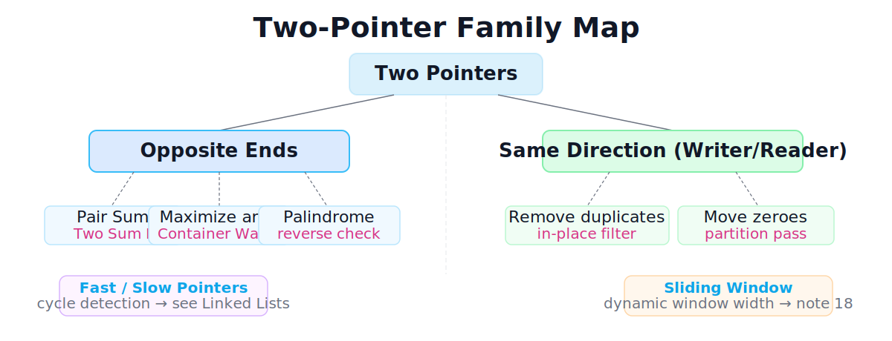

# Two Pointers

[toc]

> **TL;DR:** Two pointers keeps two indices into a sequence and moves each one with intent — never at random — so that each step provably shrinks the remaining search space. The two main flavors are **opposite-ends** (both pointers start at the extremes and converge) and **same-direction writer/reader** (both start at the left and advance at different rates). Together they solve a wide class of array and string problems in O(n) time and O(1) extra space.

## Vocabulary

**Pointer**

```math
L,\ R \in \{0, 1, \ldots, n-1\}
```

An integer index marking a current position. In Python, a pointer is just an `int`; no heap allocation is involved.

**Invariant**

```math
L < R \quad \text{(opposite-ends)}
\qquad\text{or}\qquad
W \le R \quad \text{(writer/reader)}
```

The condition that must hold throughout the loop. An invariant is what makes each pointer-move safe: you discard possibilities only because the invariant proves those possibilities cannot contain the answer.

**Search space**

```math
[L,\ R]
```

The slice of the array that can still contain a valid answer. Every pointer move shrinks it by at least one element.

**Writer (W) / Reader (R)**

```math
W \le R,\quad W,R \in \{0,\ldots,n-1\}
```

In the same-direction variant: R scans every element; W marks the next slot to overwrite. Values at or before W are already in their final state.

## Pattern Map

The two-pointer family is wider than opposite-ends pair-sum. The diagram below shows the full taxonomy and where the adjacent relatives (fast/slow, sliding window) sit.



## Opposite-Ends Pattern

The opposite-ends pattern places L at index 0 and R at index n−1, then moves them inward. It works when the array is sorted (or can be sorted) and the comparison result tells you with certainty which extreme cannot contribute: if the current pair is too small, the left element is exhausted against every possible right partner; if it is too large, the right element is exhausted. Each move discards an entire row of the implicit n×n pair matrix.

The convergence on a sorted array is easiest to see visually — L and R start at opposite ends and move toward each other, eliminating one element per step.

![Three-step trace of opposite-ends pointers converging on sorted array [2,4,6,9,11,15] with target sum 15](./assets/24-two-pointers/opposite-ends-converging.svg)

### Pair Sum (Two Sum on a sorted array)

Pair Sum is the canonical opposite-ends problem. Given a sorted array and a target, return the indices of the unique pair that sums to it. If the sum of the outer pair is too small, the left value is too small for every remaining right partner — move L right. If too large, move R left. The loop terminates in at most n−1 steps.

```python
from typing import List, Optional


def pair_sum_sorted(nums: List[int], target: int) -> Optional[List[int]]:
    """Return [L, R] indices (0-based) such that nums[L]+nums[R]==target.

    Precondition: nums is sorted ascending.
    Time O(n), extra space O(1).
    """
    L, R = 0, len(nums) - 1
    while L < R:
        total = nums[L] + nums[R]
        if total == target:
            return [L, R]
        if total < target:
            L += 1
        else:
            R -= 1
    return None


assert pair_sum_sorted([2, 4, 6, 9, 11, 15], 15) == [1, 4]  # 4+11
assert pair_sum_sorted([2, 7, 11, 15], 9) == [0, 1]          # 2+7
assert pair_sum_sorted([1, 3, 5], 10) is None                 # no pair
```

**Trace** for `nums=[2,7,11,15], target=9`:

| Step | L | R | nums[L]+nums[R] | Decision |
| :---: | ---: | ---: | ---: | :--- |
| 1 | 0 | 3 | 2+15=17 | too large → R−=1 |
| 2 | 0 | 2 | 2+11=13 | too large → R−=1 |
| 3 | 0 | 1 | 2+7=9   | found — return [0,1] |

### Two Sum with Original Indices

When the input is not pre-sorted (LeetCode 1), you can recover original indices by sorting `(value, original_index)` pairs. Sorting costs O(n log n) and O(n) extra space — the hash-map approach (see [./05-hash-tables.md](./05-hash-tables.md)) is O(n) / O(n) and usually preferred, but the sorted two-pointer version is a clean illustration of the pattern.

```python
from typing import List


def two_sum_two_pointers(nums: List[int], target: int) -> List[int]:
    """Two Sum on an unsorted input, returning original indices.

    Time O(n log n), extra space O(n).
    """
    pairs = sorted((v, i) for i, v in enumerate(nums))
    L, R = 0, len(pairs) - 1
    while L < R:
        total = pairs[L][0] + pairs[R][0]
        if total == target:
            return [pairs[L][1], pairs[R][1]]
        if total < target:
            L += 1
        else:
            R -= 1
    raise ValueError("no solution")


assert sorted(two_sum_two_pointers([2, 7, 11, 15], 9)) == [0, 1]
assert sorted(two_sum_two_pointers([3, 2, 4], 6)) == [1, 2]
assert sorted(two_sum_two_pointers([1, 5, 3], 8)) == [1, 2]
```

**Trace** for `nums=[3,2,4], target=6` — pairs after sort: `[(2,1),(3,0),(4,2)]`:

| Step | L pair | R pair | Sum | Decision |
| :---: | :--- | :--- | ---: | :--- |
| 1 | (2,1) | (4,2) | 6 | found — return [1,2] |

### Container With Most Water

Container With Most Water (LeetCode 11) maximises the rectangle formed by two height bars. The width is R−L; the height is the shorter bar. The critical insight: if we move the taller-bar pointer, width shrinks and height cannot increase (it was already bounded by the shorter bar), so volume can only decrease. Therefore we always move the shorter-bar pointer, giving O(n).

```python
from typing import List


def max_water(height: List[int]) -> int:
    """Return the maximum water volume between any two bars.

    Time O(n), extra space O(1).
    """
    L, R = 0, len(height) - 1
    best = 0
    while L < R:
        vol = (R - L) * min(height[L], height[R])
        best = max(best, vol)
        if height[L] <= height[R]:
            L += 1
        else:
            R -= 1
    return best


assert max_water([1, 8, 6, 2, 5, 4, 8, 3, 7]) == 49
assert max_water([1, 1]) == 1
assert max_water([4, 3, 2, 1, 4]) == 16
```

**Trace** (first two steps) for `[1,8,6,2,5,4,8,3,7]`:

| Step | L | R | height[L] | height[R] | vol | Decision |
| :---: | ---: | ---: | ---: | ---: | ---: | :--- |
| 1 | 0 | 8 | 1 | 7 | 8×1=8 | move L (shorter) |
| 2 | 1 | 8 | 8 | 7 | 7×7=49 | move R (shorter) |
| … | … | … | … | … | … | … |

### Palindrome / Reverse Check

Palindrome check compares characters at L and R simultaneously from the outside in. As soon as L and R disagree the string cannot be a palindrome; if the pointers meet without disagreement, it is. This runs in O(n) time with O(1) space — no copy of the reversed string required.

```python
def is_palindrome(s: str) -> bool:
    """Return True iff s reads the same forwards and backwards.

    Time O(n), extra space O(1).
    """
    L, R = 0, len(s) - 1
    while L < R:
        if s[L] != s[R]:
            return False
        L += 1
        R -= 1
    return True


assert is_palindrome("racecar") is True
assert is_palindrome("abcba") is True
assert is_palindrome("hello") is False
assert is_palindrome("") is True
assert is_palindrome("a") is True
```

## Same-Direction Writer/Reader Pattern

The same-direction (writer/reader) pattern keeps both pointers moving left-to-right, but at different rates. The reader R always advances; the writer W advances only when it writes a value to the output prefix. This pattern compacts an array in a single pass without allocating a second buffer — every element the writer emits is final, and the reader never revisits an element.

The figure below shows a mid-pass snapshot: the green region is the settled unique prefix, the blue cell is what R is currently inspecting, and the faded cells to the right are positions the writer has not yet reached.

![Writer/reader pointer mid-pass on [1,1,2,3,3,4] — green settled prefix, blue active reader position](./assets/24-two-pointers/writer-reader-pass.svg)

### Remove Duplicates In Place

Remove Duplicates (LeetCode 26) asks you to compact a sorted array so each value appears at most once and return the length of the unique prefix. Because the array is sorted, duplicates are adjacent: whenever `nums[R] == nums[W-1]`, R is a duplicate of the last written value and is silently skipped; otherwise R's value is new and must be written.

```python
from typing import List


def remove_duplicates(nums: List[int]) -> int:
    """Compact sorted nums so each value appears once; return unique count.

    Modifies nums in place. Time O(n), extra space O(1).
    """
    if not nums:
        return 0
    W = 1                          # index of next write slot; index 0 stays
    for R in range(1, len(nums)):
        if nums[R] != nums[W - 1]:
            nums[W] = nums[R]
            W += 1
    return W


a = [1, 1, 2, 3, 3, 4]
k = remove_duplicates(a)
assert k == 4
assert a[:k] == [1, 2, 3, 4]

b = [0, 0, 1, 1, 1, 2, 2, 3, 3, 4]
k2 = remove_duplicates(b)
assert k2 == 5
assert b[:k2] == [0, 1, 2, 3, 4]

assert remove_duplicates([]) == 0
assert remove_duplicates([7]) == 1
```

**Trace** for `[1,1,2,3,3,4]`:

| R | nums[R] | nums[W-1] | Action | W after |
| ---: | ---: | ---: | :--- | ---: |
| 1 | 1 | 1 | skip (duplicate) | 1 |
| 2 | 2 | 1 | write → nums[1]=2 | 2 |
| 3 | 3 | 2 | write → nums[2]=3 | 3 |
| 4 | 3 | 3 | skip (duplicate) | 3 |
| 5 | 4 | 3 | write → nums[3]=4 | 4 |

### Move Zeroes

Move Zeroes (LeetCode 283) partitions an array so all non-zero values appear first in their original relative order, with zeroes trailing. The writer W tracks the next free non-zero slot; R scans everything. Whenever R finds a non-zero value, it swaps it into W's position. Unlike the filter pattern above, swapping preserves what was at W so the trailing portion is automatically filled with zeroes.

```python
from typing import List


def move_zeroes(nums: List[int]) -> None:
    """Move all zeroes to the end, preserving relative order of non-zeroes.

    Modifies nums in place. Time O(n), extra space O(1).
    """
    W = 0
    for R in range(len(nums)):
        if nums[R] != 0:
            nums[W], nums[R] = nums[R], nums[W]
            W += 1


c = [0, 1, 0, 3, 12]
move_zeroes(c)
assert c == [1, 3, 12, 0, 0]

d = [0, 0, 1]
move_zeroes(d)
assert d == [1, 0, 0]

e = [1, 2, 3]
move_zeroes(e)
assert e == [1, 2, 3]
```

**Trace** for `[0,1,0,3,12]`:

| R | nums[R] | Action | array state |
| ---: | ---: | :--- | :--- |
| 0 | 0 | skip | [0,1,0,3,12] W=0 |
| 1 | 1 | swap W↔R | [1,0,0,3,12] W=1 |
| 2 | 0 | skip | [1,0,0,3,12] W=1 |
| 3 | 3 | swap W↔R | [1,3,0,0,12] W=2 |
| 4 | 12 | swap W↔R | [1,3,12,0,0] W=3 |

## Complexity

Both flavors make a single linear pass with O(1) extra state.

| Pattern | Precondition | Time | Extra Space | Notes |
| :--- | :--- | :--- | :--- | :--- |
| Opposite-ends (pre-sorted) | sorted input | O(n) | O(1) | each pointer moves ≤ n times |
| Two Sum unsorted (sort pairs) | none | O(n log n) | O(n) | sort dominates; hash map is O(n) |
| Container With Most Water | none | O(n) | O(1) | width shrinks by 1 each step |
| Palindrome / reverse | none | O(n) | O(1) | at most n/2 comparisons |
| Remove Duplicates in place | sorted input | O(n) | O(1) | R advances n−1 times total |
| Move Zeroes | none | O(n) | O(1) | R advances n times total |

> [!IMPORTANT]
> "O(n) extra space" for the unsorted Two Sum variant comes from storing `(value, index)` pairs. The hash-map approach (see [./05-hash-tables.md](./05-hash-tables.md)) is also O(n) space but O(n) time and is usually preferred unless in-place or sorted behaviour is specifically required.

## Memory Model in Python

Two pointers are integers — four words of stack storage regardless of n. The array they index is a Python `list`, which in CPython is a contiguous C array of `PyObject*` pointers. Index access `nums[i]` is a single pointer-arithmetic step: O(1), not a scan. This is why the technique's O(1) space claim is real rather than aspirational — neither pattern allocates from the heap during its pass.

The only hidden allocation hazard is sorting. `list.sort()` (Timsort) runs in O(n) extra space on worst-case inputs (it needs a merge buffer up to n/2). If you sort `(value, index)` pairs you also pay for the pair-list itself. Both costs are explicit in the complexity table above.

> [!TIP]
> When you need to prove O(1) space in an interview, explicitly list every variable: two index pointers (`L`, `R` or `W`, `R`), a single comparison result or running value (`total`, `best`). The input list itself does not count as auxiliary space. This enumeration takes ten seconds and forestalls follow-up questions.

## When to Use / Not Use

**Use two pointers when:**

- The array is sorted, or sorting is permitted and does not destroy required information.
- You need a pair, triplet, or boundary satisfying a condition (sum, product, distance, containment).
- Brute force would check O(n²) pairs.
- A single comparison tells you with certainty which pointer to advance.
- O(1) extra space matters (in-place filter, partition, compaction).
- You need to check a sequence for symmetry (palindrome, reversal).

**Do not use two pointers when:**

- The array is unsorted and sorting is forbidden (original index information is load-bearing and you cannot pair it). Use a hash map instead.
- You cannot determine which pointer to advance from the comparison result — the pattern requires a monotone decision rule.
- You need all valid pairs, not just one optimum. Two pointers short-circuits on the first valid answer; enumerating all pairs still costs O(n²).
- The problem involves a dynamic window whose width must grow and shrink — that is sliding window (see [./18-sliding-window-and-prefix-sums.md](./18-sliding-window-and-prefix-sums.md)).
- Cycle detection in a linked list — use fast/slow pointers (see [./03-linked-lists.md](./03-linked-lists.md)).

## Relatives: Fast/Slow and Sliding Window

Two adjacent techniques share the "two indices, one array" shape but solve different problems.

**Fast/slow pointers** (Floyd's cycle detection) both start at index 0 (or a linked-list head), but the fast pointer advances two steps for every one step of the slow pointer. When they meet, a cycle exists. This technique lives in the linked-list chapter: [./03-linked-lists.md](./03-linked-lists.md).

**Sliding window** keeps a left and right pointer like opposite-ends, but the window expands (R advances) and contracts (L advances) dynamically based on a condition on the substring or subarray between them. The decision rule is different — both pointers can advance in the same direction — and the window can grow. Full treatment in [./18-sliding-window-and-prefix-sums.md](./18-sliding-window-and-prefix-sums.md).

## Common Mistakes

- **Sorting without preserving original indices.** If Two Sum asks for original indices and you sort `nums` directly, you lose them. Sort `(value, index)` pairs instead, or use a hash map.
- **Using `while L <= R` instead of `while L < R`.** When the pointers meet they point to the same element, which is never a valid pair. The invariant is `L < R`.
- **Advancing the wrong pointer.** In pair-sum, sum-too-small means the left value is exhausted — only `L += 1` is safe. Moving R when the sum is too small does not reduce the search space correctly.
- **Applying opposite-ends to an unsorted array.** The movement rule relies on monotonicity. If you cannot guarantee sorted order, the decision "sum too small → move L right" is not sound.
- **Confusing writer/reader with sliding window.** In writer/reader, W only moves when it writes — it never moves backward and the window does not shrink. If your problem needs to shrink the window, you want sliding window.
- **Off-by-one in `W` initialization.** For remove-duplicates, `W = 1` (not 0) because index 0 is always kept. Starting at 0 overwrites the first element unnecessarily.

## Interview Q&A

**Q: Why does pair-sum work on an unsorted array only after sorting?**
A: The invariant that drives pointer movement is "larger values are to the right." Without sorted order, moving L right does not guarantee a larger value, so the decision rule breaks. Either sort first — O(n log n), O(1) extra space — or use a hash map for O(n) / O(n).

**Q: Container With Most Water — why move the shorter bar's pointer, not the taller one?**
A: Whichever bar is shorter sets the height of the current rectangle. Moving the taller bar makes width smaller without any possibility of height increase (height is still capped by the shorter bar), so volume can only decrease. Moving the shorter bar is the only move that could increase height and thus possibly increase volume.

**Q: What is the time complexity of remove-duplicates, and why is it O(n) despite two variables?**
A: R advances exactly n−1 times total across the entire loop — it is a single for-range, not a nested loop. W also advances at most n−1 times total. The total operations are linear in n regardless of how many duplicates there are.

**Q: How do you decide between the writer/reader pattern and a filter into a new list?**
A: Writer/reader is O(1) extra space and mutates in place. A filter allocates O(k) extra space for the result list (where k is the number of kept elements). If the problem requires O(1) space or says "in place," use writer/reader. If immutability or clarity matters more, a list comprehension is simpler.

**Q: What is the difference between two pointers and sliding window?**
A: In the opposite-ends two-pointer pattern both pointers always move inward — the window strictly shrinks. In sliding window the window can expand (R advances) and contract (L advances) in response to a running value, and both pointers move in the same direction. When you have a condition like "find shortest subarray with sum ≥ k," that is sliding window, not two pointers.

**Q: When is the hash map strictly better than the sorted two-pointer approach for Two Sum?**
A: Always on time complexity — O(n) vs O(n log n). Two pointers on sorted pairs is worth knowing as a pattern illustration and as a fallback when extra space is forbidden, but in an interview state both options and name the trade-off: "Hash map is O(n) time and O(n) space; sorted two-pointer is O(n log n) time and O(n) space for the pair list, or O(1) if the input is already sorted."

## Practice Path

1. Trace the pair-sum algorithm by hand on `[1,3,4,7,9], target=10` before running any code. Confirm which pointer moves at each step.
2. Run every code block in this note — all asserts must pass before moving on.
3. Implement Three Sum (LeetCode 15): sort, fix one element, run pair-sum on the remainder. This is the canonical extension of opposite-ends.
4. Implement Valid Palindrome II (LeetCode 680): allow skipping one character — you need two pointer sub-calls inside the outer pass.
5. Implement the sliding-window version of "minimum window substring" (LeetCode 76) to feel the difference from the patterns here.
6. Review [../Leetcode/1-two-sum.md](../Leetcode/1-two-sum.md) to compare the hash-map and two-pointer solutions side by side.
7. Move to [Binary Search](./23-binary-search.md) — binary search on a sorted array is the logical next technique that exploits the same monotonicity property.

## Copyable Takeaways

- Two pointers = two indices moved with intent, each move eliminating at least one possibility.
- Opposite-ends: start at extremes, converge inward. Requires sorted order (or sortable). O(n) time, O(1) extra space.
- Pair-sum: sum too small → L += 1; sum too large → R -= 1. Loop while L < R.
- Container water: always move the shorter bar's pointer.
- Palindrome: compare from outside in, O(1) space vs O(n) for a reversed copy.
- Writer/reader: R always advances; W advances only on write. O(n), O(1), no allocation.
- Remove duplicates: W=1 initially; write when `nums[R] != nums[W-1]`.
- Move zeroes: swap when `nums[R] != 0`, then W += 1.
- Fast/slow → cycle detection in linked lists (see [./03-linked-lists.md](./03-linked-lists.md)).
- Sliding window → dynamic window, same direction (see [./18-sliding-window-and-prefix-sums.md](./18-sliding-window-and-prefix-sums.md)).

## Sources

- LeetCode 1, Two Sum: https://leetcode.com/problems/two-sum/
- LeetCode 11, Container With Most Water: https://leetcode.com/problems/container-with-most-water/
- LeetCode 26, Remove Duplicates from Sorted Array: https://leetcode.com/problems/remove-duplicates-from-sorted-array/
- LeetCode 283, Move Zeroes: https://leetcode.com/problems/move-zeroes/
- Python documentation, Sorting HOWTO: https://docs.python.org/3/howto/sorting.html
- Conversation with user on 2026-06-10.

## Related

- [1 - Two Sum](../Leetcode/1-two-sum.md)
- [Binary Search](./23-binary-search.md)
- [Hash Tables](./05-hash-tables.md)
- [Linked Lists](./03-linked-lists.md)
- [Sliding Window and Prefix Sums](./18-sliding-window-and-prefix-sums.md)
- [DSA curriculum index](./00-dsa-curriculum-index.md)
