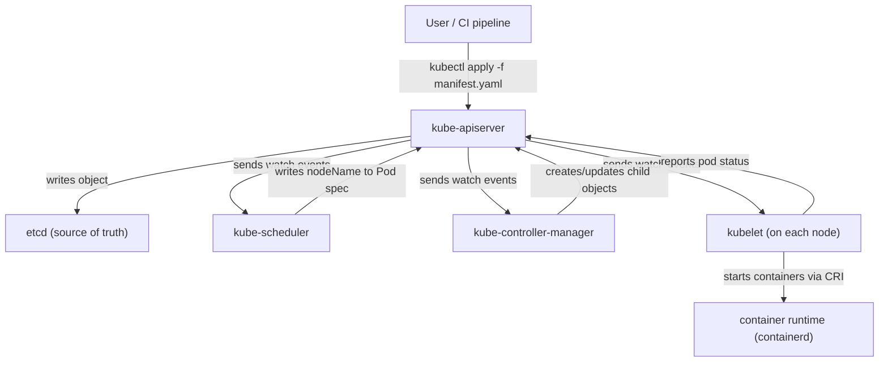
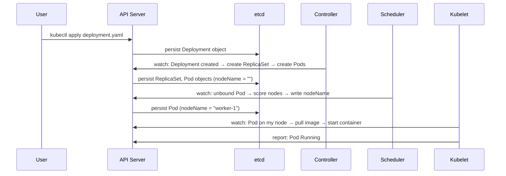

# 1 - What is Kubernetes

[toc]

> **TL;DR:** Kubernetes is a container orchestration platform that automates the deployment, scaling, and operation of containerized workloads. It was born from Google's internal Borg system and replaces the brittle, imperative "SSH and restart" model with a *declarative*, *self-healing* control loop: you describe *desired state*, and Kubernetes drives *actual state* toward it continuously. Every other concept in this series is a specialisation of that one idea.

## Vocabulary

**Container**: An isolated, lightweight process wrapped with its own filesystem (from an OCI image), network namespace, and PID namespace. Shares the host kernel — not a VM.

---

**Pod**: The smallest deployable unit in Kubernetes. One or more tightly coupled containers sharing a network namespace and storage volumes. Covered fully in [4 - Pods and Workload Resources](./4-pods-and-workload-resources.md).

---

**Node**: A worker machine (VM or bare metal) in the cluster. Runs the kubelet, kube-proxy, and a container runtime.

---

**Cluster**: The full set of machines managed together: one or more control-plane nodes plus N worker nodes.

---

**Control plane**: The set of components that make global decisions about the cluster (scheduling, reconciliation, API serving). Covered in [2 - The Control Plane](./2-the-control-plane.md).

---

**Desired state**: What you declare in a YAML manifest — "I want 3 replicas of this container running."

---

**Actual state**: What is currently running in the cluster, as observed by the API server.

---

**Reconciliation loop (control loop)**: The core operating model. A controller repeatedly compares desired state to actual state and takes actions to close the gap. Also called *level-triggered*, not *edge-triggered* — it drives toward the goal on every iteration regardless of what caused the divergence.

---

**etcd**: The distributed key-value store that holds all cluster state. The source of truth for everything.

---

**API server (kube-apiserver)**: The single gateway to cluster state. All components — kubectl, controllers, kubelets — talk only to the API server, never to each other directly.

---

**kubectl**: The CLI tool for humans. Sends REST requests to the API server. Nothing special about it — it is a client, just like any other.

---

**Manifest**: A YAML (or JSON) file declaring a Kubernetes resource. The *language* in which you express desired state.

---

**Namespace**: A virtual cluster inside a cluster. Scopes resource names, RBAC, and resource quotas. Covered in [9 - RBAC, Service Accounts, and Security](./9-rbac-service-accounts-and-security.md).

---

**Controller**: A control-plane loop that watches a resource type and reconciles actual state toward desired state. A Deployment controller, for example, watches Deployment objects and ensures the right number of ReplicaSets exist.

---

**Borg**: Google's internal container management system, the direct ancestor of Kubernetes. The 2015 *"Large-scale cluster management at Google with Borg"* paper is the conceptual foundation.

---

**OCI (Open Container Initiative)**: The industry standard for container image format and runtime. Kubernetes uses OCI images; Docker images are OCI-compatible.

---

## Intuition

Think of Kubernetes as a thermostat for your infrastructure, not a shell script. A thermostat does not say "turn on the heat for 20 minutes." It says "I want the room to be 22°C" and then continuously checks the temperature and fires the heater as needed. Kubernetes is the same: you declare "I want 3 replicas," and it makes it so — and *keeps* making it so if a node dies, if a pod crashes, or if a deployment is rolled out.

The contrast with the imperative model is sharp. Imperative means "do this sequence of steps": `ssh node1`, `docker run ...`, `ssh node2`, `docker run ...`. The problem is that the sequence is one-shot. If node1 reboots, nothing runs the sequence again. Kubernetes replaces sequences of commands with a *persistent declaration* and a *persistent observer*.

The second key insight is that Kubernetes is an API platform, not a tool. Every resource — a Pod, a Deployment, a Service, a ConfigMap — is an object stored in etcd, exposed through the API server's REST API, and acted upon by controllers. This means you can build your own resources (Custom Resource Definitions) and your own controllers (operators) using the same machinery as the built-in types. The platform is extensible all the way down.

## How it Works

Kubernetes has two distinct layers: the **control plane** (makes decisions) and the **data plane** (runs workloads). Every interaction passes through the API server. No component talks to another component directly — they all read from and write to etcd via the API server, and they react to changes via watches. This is what makes the system so decoupled and extensible.



### Step 1 — You Apply a Manifest

When you run `kubectl apply`, the tool reads your YAML, converts it to a JSON patch, and sends a `PUT` or `PATCH` request to the API server. The API server validates the object against its schema, runs admission webhooks (mutating, then validating), and persists the object to etcd. At this point your desired state exists in the cluster's brain — but nothing is running yet.

### Step 2 — Controllers Watch and React

The kube-controller-manager hosts dozens of controllers, each watching specific resource types via a long-lived HTTP watch on the API server. When a new Deployment object appears, the Deployment controller creates a ReplicaSet. The ReplicaSet controller sees the new ReplicaSet and creates Pod objects. Note: controllers create *objects*, not containers. They write objects back to the API server; they do not directly touch nodes.

### Step 3 — The Scheduler Assigns Pods to Nodes

Newly created Pods have no `nodeName` field set — they are "unbound." The kube-scheduler watches for unbound Pods, runs its filtering and scoring algorithm, picks the best node, and writes the `nodeName` back to the Pod object via the API server. This is the only thing the scheduler does: it fills in one field.

### Step 4 — The Kubelet Runs the Containers

The kubelet on each node watches the API server for Pods assigned to its node (Pods where `spec.nodeName` matches its own name). When it sees a new one, it calls the container runtime (via the Container Runtime Interface) to pull the image and start the container(s). It then continuously reports back to the API server: container status, resource usage, probe results.

### Step 5 — The Control Loop Never Stops

If a container crashes, the kubelet restarts it. If a node dies, the node controller marks Pods on that node as `Unknown`, the eviction controller deletes them, and the ReplicaSet controller creates replacement Pods on healthy nodes — which the scheduler then assigns. No human intervention needed. This is reconciliation.



## The Declarative Model vs Imperative Model

The philosophical difference matters enormously in practice. Imperative operations are *one-shot commands*: they succeed or fail and are then forgotten. Declarative operations are *persistent intents*: the system drives toward them continuously. The table below contrasts the two models across several dimensions.

| Dimension | Imperative | Declarative (Kubernetes) |
| :--- | :--- | :--- |
| Unit of work | Command (`docker run`, `ssh`, `curl`) | Object (Deployment, Service, ConfigMap) |
| Recovery from failure | Manual re-run of the command | Automatic reconciliation by controllers |
| Source of truth | Whatever is running right now | etcd (the manifest you applied) |
| Auditability | Shell history (fragile) | Git history of manifests |
| Drift detection | None (you don't know what's changed) | Continuous (controllers detect drift) |
| Idempotency | Depends on the command | Always: `kubectl apply` is idempotent |

> [!IMPORTANT]
> Kubernetes `apply` is idempotent — you can run it a hundred times on the same manifest and the result is the same. This is what makes GitOps possible: push a manifest to git, a tool applies it, done. By contrast, imperative `docker run` is NOT idempotent — running it twice starts two containers.

## The API Object Model

Every Kubernetes resource follows the same four-field skeleton:

```yaml
---
apiVersion: apps/v1        # which API group and version
kind: Deployment           # what type of object
metadata:
  name: my-app             # unique name within the namespace
  namespace: default       # which virtual cluster
  labels:
    app: my-app
spec:                      # desired state — what you want
  replicas: 3
  # ...
status:                    # actual state — what exists now (written by controllers)
  readyReplicas: 3
  # ...
```

The `spec` is what you write. The `status` is what Kubernetes writes back. The difference between `spec` and `status` is the difference between desire and reality. Controllers exist to close that gap.

> [!NOTE]
> The `status` subresource is updated by controllers via a dedicated API endpoint (`/status`). This is a separate permission from updating the main object — you can grant a controller the ability to update status without letting it mutate the spec. This separation underpins safe operator design.

## Kubernetes vs Its Predecessors

Understanding *why* Kubernetes exists requires knowing what problem it solved. Before container orchestration, the dominant deployment model was configuration management (Chef, Puppet, Ansible) on VMs. That model describes the *state of a machine*, not the *state of a workload* — it was inherently machine-centric, not workload-centric. When you wanted to move a workload, you had to reconfigure machines. When a machine died, the workload died with it.

Docker democratized containers in 2013 but provided no orchestration. Docker Swarm was simple but lacked the scheduling sophistication needed at scale. Mesos/Marathon pre-dated Kubernetes and handled more general workloads but required significant operational expertise. Kubernetes won because it brought the proven Borg model to open source, made the API model extensible from day one, and had the backing of a large community plus Google's operational credibility.

## Real-world Example

The canonical first-cluster experience: deploy a stateless web application, expose it via a Service, and watch the reconciliation loop in action by deliberately killing a pod.

```bash
#!/usr/bin/env bash
set -euo pipefail

# 1. Create a Deployment — 3 replicas of nginx
kubectl apply -f - <<'EOF'
---
apiVersion: apps/v1
kind: Deployment
metadata:
  name: nginx-demo
  namespace: default
spec:
  replicas: 3
  selector:
    matchLabels:
      app: nginx-demo
  template:
    metadata:
      labels:
        app: nginx-demo
    spec:
      containers:
        - name: nginx
          image: nginx:1.27-alpine
          ports:
            - containerPort: 80
          resources:
            requests:
              cpu: 50m
              memory: 64Mi
            limits:
              cpu: 100m
              memory: 128Mi
EOF

# 2. Wait until all 3 replicas are ready
kubectl rollout status deployment/nginx-demo
# Output: deployment "nginx-demo" successfully rolled out

# 3. List pods — note the generated names
kubectl get pods -l app=nginx-demo -o wide
# NAME                          READY   STATUS    RESTARTS   AGE   IP           NODE
# nginx-demo-7d8b9f7c6-4xkp2   1/1     Running   0          30s   10.244.1.5   worker-1
# nginx-demo-7d8b9f7c6-9mwnt   1/1     Running   0          30s   10.244.2.3   worker-2
# nginx-demo-7d8b9f7c6-rzt7b   1/1     Running   0          30s   10.244.1.7   worker-1

# 4. Delete one pod manually — watch reconciliation
POD=$(kubectl get pods -l app=nginx-demo -o jsonpath='{.items[0].metadata.name}')
kubectl delete pod "${POD}"
# pod "nginx-demo-7d8b9f7c6-4xkp2" deleted

# 5. Immediately check — ReplicaSet has already created a replacement
kubectl get pods -l app=nginx-demo
# NAME                          READY   STATUS              RESTARTS   AGE
# nginx-demo-7d8b9f7c6-9mwnt   1/1     Running             0          2m
# nginx-demo-7d8b9f7c6-rzt7b   1/1     Running             0          2m
# nginx-demo-7d8b9f7c6-vq8kn   0/1     ContainerCreating   0          2s  <-- NEW
```

> [!TIP]
> The `kubectl rollout status` command blocks until the deployment converges or times out. In CI/CD pipelines, use it after `kubectl apply` to detect failed deployments before the pipeline reports success.

## In Practice

At small scale (tens of nodes, hundreds of pods), Kubernetes feels heavyweight — the control-plane overhead, the YAML verbosity, the CNI/CSI complexity all seem disproportionate. The economics flip at medium-to-large scale: a single on-call engineer can manage thousands of pods because the reconciliation loop handles the grunt work. The tipping point is typically around 20–30 services where manual orchestration becomes error-prone.

Production clusters run the control plane in a highly available configuration: 3 or 5 etcd members (requires quorum), multiple API server replicas behind a load balancer, and leader-elected controller-manager and scheduler instances. The data plane (worker nodes) scales independently — major cloud providers manage the control plane for you (GKE, EKS, AKS) and abstract away etcd entirely.

The version skew policy is strict: kubelets may be at most 2 minor versions behind the API server, and kubectl within 1 minor version of the server. Violating this in a cluster upgrade is a common production incident root cause.

> [!WARNING]
> Kubernetes does NOT manage your application's internal state. It restarts crashed containers, but if your application loses in-memory state on restart, that data is gone. Stateful applications need proper PersistentVolumes (see [7 - Storage](./7-storage-volumes-pv-pvc-csi.md)) or external state stores. The control loop guarantees containers are *running*, not that your application is *correct*.

## Pitfalls

- **"Kubernetes solves application reliability."** — Kubernetes solves *infrastructure* reliability: it keeps your containers running, on the right nodes, with the right resources. Whether the application inside the container is reliable depends entirely on the application. Liveness/readiness probes help surface failures, but Kubernetes cannot fix a bug in your code by restarting it.
- **"kubectl apply creates resources."** — It creates or *updates* resources. If the resource already exists, `apply` performs a strategic merge patch against the current object. Use `kubectl diff` to preview changes before applying.
- **"Deleting a Pod removes the workload."** — If the Pod is owned by a ReplicaSet (via a Deployment), the ReplicaSet immediately creates a replacement. To remove the workload, delete the Deployment, not the Pod.
- **"Namespaces provide security isolation."** — Namespaces scope names and apply RBAC and resource quotas, but they do not provide network isolation by default. Two pods in different namespaces can talk to each other unless you add NetworkPolicies (see [9 - RBAC](./9-rbac-service-accounts-and-security.md)).
- **"The YAML structure is arbitrary."** — Every field is defined by a schema validated by the API server. Unknown fields are rejected (or silently dropped depending on the admission configuration). Use `kubectl explain deployment.spec` to get the schema inline.

## Exercises

### Exercise 1 — Conceptual: Declarative vs Imperative

Why is the declarative model superior for production systems? Give three concrete failure scenarios where the declarative model self-heals but the imperative model requires human intervention.

#### Solution

The declarative model continuously reconciles actual state toward desired state, meaning any deviation — whether from hardware failure, operator error, or software crash — triggers automatic recovery without human involvement.

**Failure scenario 1 — Node failure:** In the imperative model, if the VM running your application reboots, the application is gone until someone re-runs the deployment commands. In Kubernetes, the node-controller marks the node `NotReady`, the eviction controller deletes the Pods, the ReplicaSet controller creates replacement Pods, and the scheduler places them on healthy nodes — all within 5 minutes and zero human intervention.

**Failure scenario 2 — OOM kill:** If a container exceeds its memory limit and is OOM-killed, the imperative model offers nothing. In Kubernetes, the kubelet detects the exit code, applies the `restartPolicy` (default: `Always`), and restarts the container with exponential backoff. The operator sees `RESTARTS: 1` in `kubectl get pods` and can investigate at their leisure.

**Failure scenario 3 — Configuration drift:** An operator SSHs into a node and manually tweaks a running container's environment variable "temporarily." In the imperative model, this drift is invisible and permanent until discovered. In Kubernetes, all configuration is in the manifest in etcd. The running container reflects the *last applied* spec. Drifting by patching the node directly does not change the spec, and the next reconciliation (or a rollout) will revert to the declared state.

### Exercise 2 — YAML: Write Your First Deployment

Write a complete Deployment manifest for a `redis:7-alpine` instance with 1 replica, resource requests of 100m CPU and 128Mi memory, and a `readinessProbe` that runs `redis-cli ping` every 5 seconds.

#### Solution

```yaml
---
apiVersion: apps/v1
kind: Deployment
metadata:
  name: redis
  namespace: default
  labels:
    app: redis
spec:
  replicas: 1
  selector:
    matchLabels:
      app: redis
  template:
    metadata:
      labels:
        app: redis
    spec:
      containers:
        - name: redis
          image: redis:7-alpine
          ports:
            - name: redis
              containerPort: 6379
              protocol: TCP
          resources:
            requests:
              cpu: 100m
              memory: 128Mi
            limits:
              cpu: 200m
              memory: 256Mi
          readinessProbe:
            exec:
              command:
                - redis-cli
                - ping
            initialDelaySeconds: 5
            periodSeconds: 5
            failureThreshold: 3
```

Key annotations on this manifest:

- `selector.matchLabels` must match `template.metadata.labels` exactly — the Deployment uses this selector to find which Pods it owns.
- `requests` are what the scheduler uses to place the Pod on a node with sufficient available capacity. `limits` are what the kernel enforces at runtime via cgroups.
- `readinessProbe` gates whether the Pod receives traffic from Services. Until `redis-cli ping` returns 0, the Pod's `Ready` condition is `False` and it is removed from Service endpoint lists.
- No `limits` on memory lower than `requests` — that would mean the container can never be scheduled (requests > limits is rejected by the API server).

### Exercise 3 — Debugging: Pod Stuck in Pending

You apply a Deployment and the pods stay in `Pending` state indefinitely. List 5 things to check, in order.

#### Solution

**Step 1 — Describe the pod:**
```bash
kubectl describe pod <pod-name>
```
The `Events` section at the bottom is almost always diagnostic. Look for `FailedScheduling` events. The scheduler emits a reason string such as `0/3 nodes are available: 3 Insufficient cpu` or `0/3 nodes are available: 3 node(s) had untolerated taint`.

**Step 2 — Check resource requests vs node capacity:**
```bash
kubectl get nodes -o custom-columns="NAME:.metadata.name,CPU:.status.allocatable.cpu,MEM:.status.allocatable.memory"
kubectl describe node <node-name> | grep -A 10 "Allocated resources"
```
If your Pod requests 4 CPUs and no node has 4 CPUs allocatable (capacity minus already-scheduled requests), the scheduler cannot place it. Reduce requests or add a node.

**Step 3 — Check taints and tolerations:**
```bash
kubectl describe node <node-name> | grep -A 5 Taints
```
A node with `node-role.kubernetes.io/control-plane:NoSchedule` will not accept regular workloads unless the Pod has a matching toleration. Cloud-managed node pools often add taints for GPU nodes or spot nodes.

**Step 4 — Check namespace resource quotas:**
```bash
kubectl describe resourcequota -n <namespace>
```
If the namespace has a `ResourceQuota` object and your Deployment would exceed it (e.g., sum of all pod CPU requests exceeds quota), the ReplicaSet controller will fail to create Pods and emit an event on the ReplicaSet object.

**Step 5 — Check the image pull policy and registry access:**
Sometimes a Pod is not even in `Pending` due to scheduling — it is in `Pending` while trying to pull the image. `kubectl describe pod` will show `ErrImagePull` or `ImagePullBackOff` in the events. Verify that the node can reach the image registry and that `imagePullSecrets` are configured if the registry is private.

### Exercise 4 — Design: Why Not Just Use Docker Compose?

A colleague argues that Docker Compose is simpler and sufficient for their 5-service application. When would you agree, and when would you push them toward Kubernetes?

#### Solution

**Agree (keep Compose)** when:
- The application runs on a single machine and will never need to span multiple hosts.
- The deployment frequency is low (weekly or slower) and rollback is "restart from scratch."
- The team is small (1–2 engineers) and the operational overhead of a Kubernetes cluster outweighs the benefits.
- High availability and zero-downtime deployments are not requirements.

**Push toward Kubernetes** when:
- The application needs to run across multiple nodes for availability or capacity reasons.
- Rolling updates without downtime are required — Compose has no native rolling update strategy.
- Services need automatic horizontal scaling based on CPU/memory/custom metrics.
- The team wants GitOps — declarative manifests in git, automatic reconciliation on push.
- Any service handles sensitive data requiring RBAC and namespace-level access control.
- The environment is a cloud provider that offers managed Kubernetes (GKE, EKS, AKS) — the control-plane cost is zero, and you get node autoscaling and managed upgrades for free.

The honest answer: for a solo developer's hobby project with 5 services, Docker Compose is the right choice. For a team running a production system that needs 99.9% uptime, Kubernetes is the right choice. The complexity of Kubernetes is the price of its operational guarantees.

## Sources

- Burns, B., Grant, B., Oppenheimer, D., Brewer, E., & Wilkes, J. (2016). *Borg, Omega, and Kubernetes*. ACM Queue. https://dl.acm.org/doi/10.1145/2898442.2898444
- Verma, A. et al. (2015). *Large-scale cluster management at Google with Borg*. EuroSys 2015. https://dl.acm.org/doi/10.1145/2741948.2741964
- Hightower, K., Burns, B., & Beda, J. *Kubernetes: Up and Running*, 3rd ed. O'Reilly.
- Lukša, M. *Kubernetes in Action*, 2nd ed. Manning.
- Kubernetes official documentation — Concepts overview. https://kubernetes.io/docs/concepts/overview/

## Related

- [2 - The Control Plane](./2-the-control-plane.md)
- [3 - The Data Plane (Nodes)](./3-the-data-plane-nodes.md)
- [4 - Pods and Workload Resources](./4-pods-and-workload-resources.md)
- [5 - Services, Endpoints, and kube-proxy](./5-services-endpoints-and-kube-proxy.md) 
