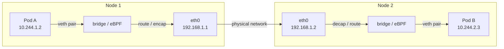

# 10 - Networking Deep Dive

[toc]

> **TL;DR:** Kubernetes mandates a flat, routable pod network: every pod gets a unique IP and can reach every other pod directly, without NAT, across the entire cluster. This is implemented by CNI plugins (Calico, Cilium, Flannel) that program routes, tunnels, or eBPF maps. CoreDNS handles service discovery via DNS. NetworkPolicies enforce L3/L4 firewall rules. Understanding the network model means understanding the exact path a packet takes from one pod to another — through veth pairs, bridge or eBPF, route tables, and optionally encapsulation.

## Vocabulary

**Pod network model**: The Kubernetes networking contract. Every pod has a unique cluster-wide IP address; pods on any node can reach pods on any other node using their pod IP without NAT; agents on a node can reach all pods on that node.

---

**veth pair**: A Linux virtual ethernet pair — two connected virtual network interfaces. One end lives in the pod's network namespace; the other in the root network namespace (or a bridge). Packets in one end come out the other.

---

**bridge (cbr0/docker0)**: A virtual L2 switch in the node's root namespace. veth pairs from pods connect to it; the bridge handles intra-node pod-to-pod forwarding at L2.

---

**Overlay network**: A tunneling technique (VXLAN, IP-in-IP, WireGuard) that encapsulates pod-to-pod packets inside a UDP or IP packet routable between nodes. Adds encapsulation overhead but works on any underlying network without requiring BGP route propagation.

---

**BGP (Border Gateway Protocol)**: A routing protocol that Calico (and Cilium in BGP mode) uses to advertise pod CIDRs to routers. Each node announces its pod CIDR; routers install static routes. No encapsulation overhead — pods are "natively" routable.

---

**CIDR (Classless Inter-Domain Routing)**: An IP address range notation (e.g., `10.244.0.0/16`). Each node is assigned a pod CIDR subnet (e.g., `10.244.1.0/24`) from the cluster's pod CIDR. All pods on a node get IPs from that node's pod CIDR.

---

**CoreDNS**: The cluster DNS server. Runs as a Deployment in `kube-system`. Resolves `<service>.<namespace>.svc.cluster.local` to the Service's ClusterIP. Pods configure `/etc/resolv.conf` to point at the CoreDNS Service IP.

---

**ndots**: A `/etc/resolv.conf` option that controls how many dots a hostname must have before DNS resolves it as an absolute name without trying search domains first. Kubernetes sets `ndots: 5` by default — a common source of unnecessary DNS lookups.

---

**eBPF (Extended Berkeley Packet Filter)**: A Linux kernel mechanism for running sandboxed programs in the kernel context. Cilium uses eBPF for pod networking, replacing iptables and even the kernel bridge with in-kernel packet processing. Provides lower latency, higher throughput, and better observability than iptables.

---

**Calico**: A CNI plugin that uses either BGP (no encapsulation) or VXLAN (encapsulation). Provides NetworkPolicy enforcement via iptables or eBPF. Widely used in on-premises and cloud environments.

---

**Cilium**: A CNI plugin based entirely on eBPF. No iptables rules, no bridge. Provides L3/L4/L7 policy enforcement, transparent encryption (WireGuard), and Hubble (deep observability). The most feature-rich CNI for large clusters.

---

**east-west traffic**: Traffic between pods within the cluster (service-to-service).

---

**north-south traffic**: Traffic entering or leaving the cluster (from external clients, or pods calling external services).

---

**dual-stack**: Running both IPv4 and IPv6 pod networks simultaneously. Kubernetes 1.21+ supports dual-stack natively; pods get both an IPv4 and IPv6 address.

---

## Intuition

The Kubernetes network model is deliberately simple at the contract level: every pod has a routable IP. The complexity is pushed down to the CNI plugin, which has complete freedom in how it implements that contract — tunnels, BGP routes, eBPF. This layering is intentional.

Think of the pod network as a giant virtual LAN spanning all nodes. When pod A on node 1 sends a packet to pod B on node 2, the packet leaves pod A's veth pair, hits the bridge or eBPF layer on node 1, gets routed (or encapsulated) across the physical network to node 2, arrives at the CNI layer on node 2, and gets delivered to pod B's veth pair. The exact mechanism depends on the CNI plugin.

DNS is the glue for service discovery. Pods don't hard-code pod IPs — they resolve service names via CoreDNS. The DNS response gives the Service ClusterIP, and iptables/IPVS (kube-proxy) handles the rest.

## How it Works

### Intra-Node Pod Communication

When two pods are on the same node, their traffic does not leave the node. Each pod's veth pair connects to the same bridge (or eBPF interface). The bridge forwards packets at L2 between veth endpoints based on MAC address:

```
Pod A (10.244.1.2)          Pod B (10.244.1.3)
     |                           |
  veth0 (in pod A netns)      veth0 (in pod B netns)
     |                           |
  veth1 (in root netns)       veth1 (in root netns)
     |                           |
     └─────── bridge (cbr0) ─────┘
              10.244.1.1
```

The bridge delivers the packet based on ARP/L2 MAC lookup without involving IP routing.

### Inter-Node Pod Communication

For pods on different nodes, the mechanism depends on the CNI plugin:

**Overlay (VXLAN — Flannel default, Calico VXLAN mode):**
The originating node encapsulates the original L3 packet (pod IP → pod IP) inside a UDP/VXLAN packet (node IP → node IP). The destination node's VXLAN endpoint decapsulates it and delivers to the pod. No route propagation needed — any node can reach any other node IP.

**Underlay/BGP (Calico BGP mode):**
The originating node has a route for `10.244.2.0/24 via <node-2-IP>` (installed by Calico from BGP announcements). The pod packet is routed natively over the physical network — no encapsulation. Requires the physical network to support BGP or to have routes installed (works naturally in cloud VPCs with route tables).

**eBPF (Cilium):**
Cilium replaces both the bridge and kube-proxy with eBPF programs loaded into the kernel. An eBPF program attached to the veth pair processes packets in-kernel, performs load balancing (replacing iptables DNAT), enforces NetworkPolicy, and routes packets — all without context-switching to userspace.



### CoreDNS and Service Discovery

CoreDNS runs as a Deployment with 2+ replicas. It watches the Kubernetes API for Services and Endpoints and serves DNS responses from an in-memory cache. Each pod's `/etc/resolv.conf` is configured by the kubelet:

```
nameserver 10.96.0.10        (the CoreDNS Service ClusterIP)
search default.svc.cluster.local svc.cluster.local cluster.local
options ndots:5
```

The `search` domains mean that a pod in the `default` namespace resolving `my-service` will try:
1. `my-service.default.svc.cluster.local`
2. `my-service.svc.cluster.local`
3. `my-service.cluster.local`

`ndots:5` means any name with fewer than 5 dots gets the search domains appended first before being tried as an absolute name. This generates up to 4 extra DNS queries for every external lookup (like `api.stripe.com` — 3 dots < 5, so search domains are tried first).

> [!TIP]
> Use fully-qualified domain names with a trailing dot for external services (`api.stripe.com.`) to bypass the search domain expansion and eliminate redundant DNS queries. Or reduce `ndots` to 2 for pods that primarily call external services: `spec.dnsConfig.options: [{name: ndots, value: "2"}]`.

### NetworkPolicy Enforcement

NetworkPolicy is implemented by the CNI plugin — the Kubernetes API stores the rules; the CNI plugin enforces them. When a NetworkPolicy is created, the CNI plugin (Calico, Cilium, Weave) translates it into the appropriate kernel rules (iptables rules, eBPF maps, or OVS flow tables).

The key semantics: NetworkPolicy is additive and allow-only. There are no explicit deny rules — you define what is allowed, and everything else is implicitly denied. An empty `ingress: []` block (present but empty) means deny all ingress. An absent `ingress` block means allow all ingress (no restriction applied by this policy).

```yaml
# Deny all ingress to pods labeled app=secure in this namespace
---
apiVersion: networking.k8s.io/v1
kind: NetworkPolicy
metadata:
  name: deny-all-ingress
  namespace: production
spec:
  podSelector:
    matchLabels:
      app: secure
  policyTypes:
    - Ingress
  ingress: []    # empty = deny all
```

## Math: CIDR Allocation

For a cluster-level pod CIDR of `10.244.0.0/16` (65536 addresses), each node receives a `/24` subnet (256 addresses, minus broadcast and gateway = 254 usable pod IPs per node). The cluster can support:

```math
2^{(24-16)} = 2^8 = 256 \text{ nodes}
```

For a `/22` per-node CIDR (1022 pods per node) from a `/16` cluster CIDR:

```math
2^{(22-16)} = 2^6 = 64 \text{ nodes, with 1022 pods each}
```

The tradeoff between per-node subnet size and maximum node count is configured in the cluster's pod CIDR allocation. Large clusters (1000+ nodes) use `/12` or larger cluster CIDRs.

## Real-world Example

Debugging pod-to-pod connectivity and tracing a packet through the CNI layer.

```bash
#!/usr/bin/env bash
set -euo pipefail

# Get pod IPs and node placement
kubectl get pods -o wide -n production
# NAME        READY   STATUS    IP             NODE
# app-abc12   1/1     Running   10.244.1.5     worker-1
# db-def34    1/1     Running   10.244.2.7     worker-2

# Test connectivity from app pod to db pod (should work if no NetworkPolicy blocks it)
kubectl exec app-abc12 -n production -- \
  curl -s --connect-timeout 3 "http://10.244.2.7:5432" || echo "connection refused or timeout"

# From inside the pod, check DNS resolution
kubectl exec app-abc12 -n production -- \
  nslookup postgres.production.svc.cluster.local
# Server:    10.96.0.10
# Address 1: 10.96.0.10 kube-dns.kube-system.svc.cluster.local
# Name:      postgres.production.svc.cluster.local
# Address 1: 10.96.45.12

# Check if the ndots setting is causing extra DNS lookups
kubectl exec app-abc12 -n production -- cat /etc/resolv.conf
# nameserver 10.96.0.10
# search production.svc.cluster.local svc.cluster.local cluster.local
# options ndots:5

# Trace routing on the worker node (SSH access required)
# ip route show | grep 10.244.2
# 10.244.2.0/24 via 192.168.1.2 dev eth0 proto bird  (Calico BGP route)
# -- or, in VXLAN mode:
# 10.244.2.0/24 via 10.244.2.0 dev flannel.1 onlink  (Flannel VXLAN)

# Inspect eBPF maps if using Cilium
# cilium-dbg bpf lb list     (shows Service DNAT rules)
# cilium-dbg endpoint list   (shows per-pod eBPF state)

# NetworkPolicy debugging — check if a policy is blocking traffic
kubectl describe networkpolicy -n production
```

> [!TIP]
> Cilium's Hubble observability tool provides real-time packet-level visibility: `hubble observe --namespace production --follow` shows live L4/L7 flows with policy verdicts (`FORWARDED` vs `DROPPED`). This is invaluable for debugging NetworkPolicy issues without guessing which rule is blocking traffic.

## In Practice

**CNI selection for large clusters:** Flannel is simple but has no NetworkPolicy support and uses VXLAN encapsulation with ~50 bytes of overhead per packet. Calico is the production workhorse — BGP mode provides near-native performance, and Calico's network policy engine is battle-tested at scale. Cilium is the performance and observability leader for very large clusters but has higher operational complexity (eBPF maps, Hubble, Tetragon). GKE uses Calico or Cilium (Dataplane V2 = Cilium); EKS uses VPC CNI (no overlay, pods get VPC IPs directly) or optionally Cilium.

**DNS at scale:** CoreDNS is a potential bottleneck in large clusters. Each pod makes DNS queries for every service call; at 1000 pods × 100 RPS each, you get 100,000 DNS QPS. Mitigations: NodeLocal DNSCache (a DaemonSet that runs a DNS cache on each node, reducing cross-node CoreDNS traffic), proper CoreDNS HPA, and reducing `ndots` to eliminate redundant search-domain queries.

**Dual-stack:** IPv6 readiness is increasingly required for cloud compliance. Kubernetes dual-stack (1.21 GA) assigns each pod both a `10.x.y.z` IPv4 and a `fd00::/8` IPv6 address. Services can be IPv4-only, IPv6-only, or both. The primary complexity is ensuring your CNI plugin, load balancers, and application code all handle dual-stack correctly.

> [!WARNING]
> **Flannel does NOT enforce NetworkPolicies.** This is the most common production security misconfiguration: operators install Flannel for simplicity, add NetworkPolicy resources to "secure" namespaces, and assume the policies are enforced. They are not — Flannel ignores NetworkPolicy entirely. If NetworkPolicy enforcement is required, use Calico, Cilium, Weave Net, or Antrea.

## Pitfalls

- **"Pod IPs are stable."** — Pod IPs change on restart and rescheduling. Always use Service DNS names, not pod IPs, for inter-service communication. The only exception: StatefulSet pods, which have stable DNS names (`pod-0.service.namespace.svc.cluster.local`) even if their IPs change.
- **"DNS resolution inside pods is the same as on the host."** — Pods have a different `/etc/resolv.conf` than the node. In particular, the `search` domains cause in-cluster names to resolve but also add latency for external lookups due to the `ndots:5` search expansion. Be aware when debugging DNS issues that the pod and node DNS contexts are different.
- **"All CNI plugins are equivalent."** — CNI plugins vary in performance (eBPF vs iptables), features (NetworkPolicy support, encryption, observability), and operational complexity. Choosing a CNI plugin is a significant architectural decision — migrating between CNI plugins on a running cluster is disruptive and requires node drains.
- **"NetworkPolicy blocks traffic between namespaces by default."** — It does not. Without any NetworkPolicy, pods in namespace A can talk to pods in namespace B freely. NetworkPolicy only restricts when explicitly applied. For namespace isolation, you must create a deny-all NetworkPolicy in each namespace and explicit allow rules for cross-namespace communication.

## Exercises

### Exercise 1 — Conceptual: Overlay vs Underlay Networking

Explain the difference between VXLAN overlay networking (Flannel) and BGP underlay networking (Calico). When would you choose each?

#### Solution

**VXLAN overlay (Flannel):** Pod-to-pod packets crossing nodes are wrapped inside a VXLAN UDP packet. The outer packet has source/destination set to node IPs (which are routable on the physical network). The VXLAN tunnel endpoint (VTEP) on each node encapsulates outgoing packets and decapsulates incoming ones. No changes to the physical network are required — it works anywhere nodes can reach each other via UDP.

**BGP underlay (Calico in BGP mode):** Each node runs a BGP daemon that announces "I own pod CIDR `10.244.X.0/24`" to its BGP peers (directly connected routers or route reflectors). Routers install a static route: "to reach `10.244.X.0/24`, send to node X". Pod-to-pod packets are routed natively without encapsulation — the original L3 packet travels directly over the network.

**Choose VXLAN (overlay)** when: You don't control the network infrastructure (cloud VM environments where you can't configure BGP peering), or when the simplicity of Flannel is appropriate for a small cluster where performance isn't critical.

**Choose BGP underlay** when: You need maximum throughput and minimum latency (no encapsulation overhead — typically 5-15% throughput improvement and lower tail latency), you control the network infrastructure and can configure BGP peering, or you're running on bare metal where BGP is natural.

### Exercise 2 — Design: CoreDNS Scaling

Your cluster has 500 nodes and 3000 pods. CoreDNS has 2 replicas. Latency spikes to 100ms for DNS lookups during peak traffic. What do you do?

#### Solution

**Step 1 — Deploy NodeLocal DNSCache.** This DaemonSet runs a `dnsmasq`-like cache on every node listening on a link-local IP (`169.254.20.10`). Pods resolve DNS locally; cache hits never hit CoreDNS at all. Typically reduces CoreDNS load by 80%+ in clusters with many pods making the same service lookups.

**Step 2 — Increase CoreDNS replicas.** Scale the CoreDNS Deployment based on measured QPS. A single CoreDNS pod handles ~10,000 QPS; with 3000 pods at 100 RPS each = 300,000 QPS peak. With NodeLocal cache hitting ~80%, residual load is 60,000 QPS → 6–8 CoreDNS replicas minimum.

**Step 3 — Reduce ndots.** Change `ndots` from 5 to 2 in pods that primarily call external services. This eliminates up to 4 unnecessary in-cluster search-domain lookups per external DNS resolution.

**Step 4 — Enable CoreDNS caching plugin.** Ensure CoreDNS's `cache` plugin is configured with a TTL (e.g., 30s). The default is conservative; increasing to 30s dramatically reduces upstream DNS query rates.

**Step 5 — Separate CoreDNS node affinity.** Schedule CoreDNS pods on nodes dedicated to system workloads (using `nodeAffinity` and taints), preventing application workload CPU spikes from interfering with DNS.

### Exercise 3 — YAML: NetworkPolicy for a Three-Tier Application

Write NetworkPolicies for a three-tier application: frontend (port 80), API (port 8080), database (port 5432). Rules: frontend can only receive from ingress controller; API can receive from frontend; database can only receive from API.

#### Solution

```yaml
---
# Frontend: only accept from ingress-nginx namespace
apiVersion: networking.k8s.io/v1
kind: NetworkPolicy
metadata:
  name: frontend-ingress
  namespace: production
spec:
  podSelector:
    matchLabels:
      tier: frontend
  policyTypes:
    - Ingress
  ingress:
    - from:
        - namespaceSelector:
            matchLabels:
              kubernetes.io/metadata.name: ingress-nginx
      ports:
        - protocol: TCP
          port: 80
---
# API: accept from frontend pods in same namespace
apiVersion: networking.k8s.io/v1
kind: NetworkPolicy
metadata:
  name: api-ingress
  namespace: production
spec:
  podSelector:
    matchLabels:
      tier: api
  policyTypes:
    - Ingress
  ingress:
    - from:
        - podSelector:
            matchLabels:
              tier: frontend
      ports:
        - protocol: TCP
          port: 8080
---
# Database: accept only from API pods in same namespace
apiVersion: networking.k8s.io/v1
kind: NetworkPolicy
metadata:
  name: db-ingress
  namespace: production
spec:
  podSelector:
    matchLabels:
      tier: database
  policyTypes:
    - Ingress
  ingress:
    - from:
        - podSelector:
            matchLabels:
              tier: api
      ports:
        - protocol: TCP
          port: 5432
```

Note: These policies only restrict ingress. Add matching `egress` policies to fully lock down the tier-to-tier communication (e.g., the database's egress is restricted to only allow response traffic and DNS).

## Sources

- Kubernetes docs — Cluster Networking. https://kubernetes.io/docs/concepts/cluster-administration/networking/
- Tim Hockin. *Illustrated Guide to Kubernetes Networking*. https://speakerdeck.com/thockin/illustrated-guide-to-kubernetes-networking
- CNI Specification. https://github.com/containernetworking/cni/blob/main/SPEC.md
- Calico docs — Architecture. https://docs.tigera.io/calico/latest/reference/architecture/
- Cilium docs — eBPF Datapath. https://docs.cilium.io/en/stable/network/ebpf/
- CoreDNS docs. https://coredns.io/manual/toc/

## Related

- [3 - The Data Plane (Nodes)](./3-the-data-plane-nodes.md)
- [5 - Services, Endpoints, and kube-proxy](./5-services-endpoints-and-kube-proxy.md)
- [6 - Ingress, Gateway API, and Service Mesh](./6-ingress-gateway-api-and-service-mesh.md)
- [9 - RBAC, Service Accounts, and Security](./9-rbac-service-accounts-and-security.md)
