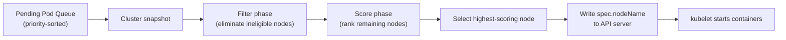
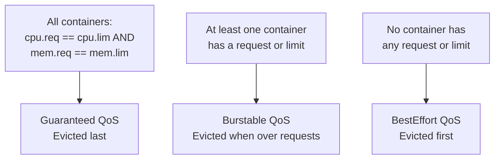

# 11 - Scheduling, Autoscaling, and Resource Management

[toc]

> **TL;DR:** The Kubernetes scheduler places Pods on nodes using a two-phase filter+score algorithm; requests and limits define how much resource a Pod claims and is allowed to use; QoS classes determine eviction priority under pressure. HPA scales Deployment replicas based on metrics; VPA adjusts resource requests; the Cluster Autoscaler and Karpenter add/remove nodes. Together these mechanisms let a cluster efficiently pack workloads while maintaining headroom for bursts — the operational equivalent of bin-packing with dynamic bin provisioning.

## Vocabulary

**Scheduling predicates (filters)**: The first phase of scheduling. Eliminates nodes that cannot run the Pod. Conditions checked: sufficient CPU/memory, node affinity, Pod anti-affinity, taints, volume topology, Pod topology spread constraints.

---

**Scoring (priorities)**: The second phase. Assigns each remaining node a score based on a weighted sum of functions: LeastAllocated (prefer nodes with more free resources), BalancedAllocation (prefer balanced CPU+memory), InterPodAffinity (prefer nodes with preferred Pods), ImageLocality (prefer nodes that have the image cached).

---

**requests**: The resource amount the scheduler uses for bin-packing. The kubelet guarantees at least this much resource to the container. Determines QoS class.

---

**limits**: The maximum resource the container may use at runtime. CPU limits cause throttling; memory limits trigger OOM kill when exceeded.

---

**QoS classes**: Three tiers derived from requests/limits. **Guaranteed** (`requests == limits`, both CPU and memory): highest priority, evicted last. **Burstable** (`requests < limits` for at least one resource): middle priority. **BestEffort** (no requests or limits): lowest priority, evicted first.

---

**HPA (Horizontal Pod Autoscaler)**: Scales the replica count of a Deployment/StatefulSet/ReplicaSet based on observed metrics (CPU utilization, custom metrics via the metrics API, external metrics).

---

**VPA (Vertical Pod Autoscaler)**: Recommends or automatically adjusts CPU/memory requests for Pods based on observed historical usage. Does NOT resize running Pods — recreates them with new resource specs.

---

**Cluster Autoscaler (CA)**: Watches for Pods stuck in `Pending` (not schedulable) and requests new nodes from the cloud provider's node group API. Also scales down by evicting Pods from underutilized nodes.

---

**Karpenter**: A node provisioner (primarily AWS) that directly calls the EC2 API to provision the right instance type for pending Pods, choosing size and type based on actual Pod requirements. Faster and more cost-efficient than the Cluster Autoscaler.

---

**Taint**: A key-value property on a Node that repels Pods unless the Pod has a matching Toleration. Used to dedicate nodes (GPU nodes, spot nodes, control-plane nodes).

---

**Toleration**: A Pod property that allows it to be scheduled on a node with a matching Taint. Tolerations enable, not require — a Pod with a toleration for a taint CAN run on that node but doesn't HAVE to.

---

**Node affinity**: A constraint that restricts which nodes a Pod can be scheduled on, based on node labels. `requiredDuringSchedulingIgnoredDuringExecution` (hard constraint) vs `preferredDuringSchedulingIgnoredDuringExecution` (soft preference).

---

**Pod anti-affinity**: A constraint that prevents a Pod from being scheduled on a node (or zone) that already has a Pod matching a given selector. Used for spreading replicas across nodes.

---

**topologySpreadConstraints**: A modern, more expressive replacement for pod anti-affinity. Enforces an even distribution across topology domains (nodes, zones, regions) with a configurable `maxSkew`.

---

**PodDisruptionBudget (PDB)**: Limits how many Pods of a workload can be simultaneously unavailable. The Cluster Autoscaler and `kubectl drain` respect PDBs — they will not evict a Pod if doing so would violate the PDB.

---

## Intuition

The scheduler is a bin-packing problem solver running continuously. Nodes are bins with capacity (CPU, memory, extended resources like GPUs). Pods are items with sizes (their requests). The goal is to assign each item to a bin such that no bin overflows (requests don't exceed allocatable capacity) and a secondary objective (like spreading items across physical locations) is optimized.

Autoscaling adds a dimension: the number of bins (nodes) is itself elastic. HPA controls item count (more replicas = more items). VPA controls item size (bigger requests = takes more bin space). The Cluster Autoscaler / Karpenter adds bins when items don't fit and removes bins when they're mostly empty. A well-tuned cluster continuously finds the right number of right-sized bins for the current workload.

The QoS model handles resource oversubscription. Requests are promises; limits are caps. In a busy node where multiple Pods are all trying to use their full limits simultaneously, the Linux kernel enforces limits via cgroups. If a Pod uses memory above its limit, it gets OOM-killed. If all Pods together are requesting more CPU than available (which is possible if requests < limits), the kernel schedules CPU time proportionally to requests using CFS shares.

## How it Works

### The Scheduler Algorithm

The scheduler runs one goroutine per Pod in a pipeline:

1. **Sort the pending Pod queue** by priority class and wait time.
2. **Snapshot** the current cluster state (node capacities, existing Pod assignments).
3. **Filter phase**: run all filter plugins in parallel. Each plugin eliminates nodes where the Pod cannot run. Plugins: `NodeUnschedulable`, `NodeResourcesFit` (compares requests vs allocatable), `NodeAffinity`, `TaintToleration`, `VolumeBinding`, `PodTopologySpread`, `InterPodAffinity`.
4. **Score phase**: run all scoring plugins in parallel on the remaining nodes. Each plugin returns a score 0–100. Scores are multiplied by weights and summed.
5. **Select** the highest-scoring node. On tie, random selection.
6. **Bind**: write `spec.nodeName` to the Pod via the API server.

The scheduler extends via the Scheduling Framework — custom plugins can hook into any stage (PreFilter, Filter, PostFilter, PreScore, Score, NormalizeScore, Reserve, Permit, PreBind, Bind, PostBind).



### Resource Requests, Limits, and QoS

The relationship between requests and limits determines both scheduling behavior and runtime behavior. The scheduler only uses requests for placement — if you set `requests: 100m, limits: 1000m`, the scheduler sees a 100m CPU Pod, but at runtime the container can use up to 1000m if available.

The QoS class is derived at Pod level and depends on ALL containers:
- **Guaranteed**: every container in the Pod has both `cpu.requests == cpu.limits` AND `memory.requests == memory.limits`.
- **Burstable**: at least one container has a request or limit set, but the Guaranteed conditions are not met.
- **BestEffort**: no containers have any requests or limits.

The kubelet evicts Pods in the order: BestEffort first, then Burstable (those exceeding their requests first), then Guaranteed last.



### HPA Deep Dive

The HPA controller runs every 15 seconds (configurable with `--horizontal-pod-autoscaler-sync-period`). It queries the metrics API for current resource utilization, computes the desired replica count, and updates the target resource's `spec.replicas`.

The scaling formula for CPU utilization:

```math
\text{desiredReplicas} = \lceil \text{currentReplicas} \times \frac{\text{currentMetricValue}}{\text{desiredMetricValue}} \rceil
```

With 3 replicas at 80% CPU and a target of 50%:

```math
\text{desired} = \lceil 3 \times \frac{0.80}{0.50} \rceil = \lceil 4.8 \rceil = 5 \text{ replicas}
```

Scale-down has a stabilization window (default 5 minutes) to prevent flapping. Scale-up is faster (default stabilization 0 seconds).

> [!IMPORTANT]
> HPA requires resource requests to be set on the target Pods. CPU utilization is computed as `current CPU usage / request`. If requests are not set, the HPA cannot compute utilization and will fail with `FailedGetResourceMetric`. Setting accurate requests is the prerequisite for HPA to work correctly.

### Karpenter vs Cluster Autoscaler

The Cluster Autoscaler watches for pending Pods, finds which configured node group (instance type) would satisfy them, and calls the cloud API to add an instance to that group. Limitations: node groups must be pre-configured; CA cannot provision a new instance type not in a group; scale-up latency is 1–5 minutes.

Karpenter watches for pending Pods, computes the optimal instance type (including spot vs on-demand, multiple instance families), and directly calls `ec2:RunInstances` to provision a node. It then creates a Node object and the kubelet bootstraps. Benefits: no pre-configured node groups, instance type selection is dynamic (lowest cost that fits the pending workloads), scale-up latency of ~60 seconds.

## Real-world Example

Full autoscaling setup with HPA, resource requests/limits, and topology spread.

```yaml
---
# Deployment with resource requests and topology spread
apiVersion: apps/v1
kind: Deployment
metadata:
  name: api-server
  namespace: production
spec:
  replicas: 3
  selector:
    matchLabels:
      app: api-server
  template:
    metadata:
      labels:
        app: api-server
    spec:
      topologySpreadConstraints:
        - maxSkew: 1
          topologyKey: topology.kubernetes.io/zone
          whenUnsatisfiable: DoNotSchedule     # hard constraint: zone spread
          labelSelector:
            matchLabels:
              app: api-server
        - maxSkew: 1
          topologyKey: kubernetes.io/hostname
          whenUnsatisfiable: ScheduleAnyway    # soft constraint: node spread
          labelSelector:
            matchLabels:
              app: api-server
      containers:
        - name: api
          image: myregistry/api-server:1.5.0
          resources:
            requests:
              cpu: 200m       # REQUIRED for HPA to compute utilization
              memory: 256Mi
            limits:
              memory: 512Mi   # CPU limit intentionally omitted
---
# HPA: scale between 3 and 20 replicas based on CPU and custom metric
apiVersion: autoscaling/v2
kind: HorizontalPodAutoscaler
metadata:
  name: api-server-hpa
  namespace: production
spec:
  scaleTargetRef:
    apiVersion: apps/v1
    kind: Deployment
    name: api-server
  minReplicas: 3
  maxReplicas: 20
  metrics:
    - type: Resource
      resource:
        name: cpu
        target:
          type: Utilization
          averageUtilization: 60   # scale up when avg CPU > 60% of requests
    - type: Resource
      resource:
        name: memory
        target:
          type: Utilization
          averageUtilization: 80
  behavior:
    scaleUp:
      stabilizationWindowSeconds: 0    # react immediately to load spikes
      policies:
        - type: Pods
          value: 4
          periodSeconds: 60            # add at most 4 pods per minute
    scaleDown:
      stabilizationWindowSeconds: 300  # wait 5 minutes before scaling down
      policies:
        - type: Percent
          value: 25
          periodSeconds: 60            # remove at most 25% of pods per minute
```

```bash
#!/usr/bin/env bash
set -euo pipefail

# Watch HPA status
kubectl get hpa api-server-hpa -n production -w
# NAME             REFERENCE           TARGETS       MINPODS   MAXPODS   REPLICAS
# api-server-hpa   Deployment/api-server   42%/60%   3         20        3
# (load spike)
# api-server-hpa   Deployment/api-server   87%/60%   3         20        5
# api-server-hpa   Deployment/api-server   63%/60%   3         20        7

# Check node allocations (to plan Cluster Autoscaler or Karpenter sizing)
kubectl describe nodes | grep -A 5 "Allocated resources"
# Namespace                Name             CPU Requests   Memory Requests
# ---------                ----             ------------   ---------------
# kube-system              coredns          100m (5%)      70Mi (2%)
# production               api-server-*     800m (40%)     1024Mi (32%)
# Allocated resources:
#   CPU:  900m/2000m (45%)
#   Memory: 1094Mi/3200Mi (34%)

# Check pending pods (should be 0; if non-zero, node provisioner needs to act)
kubectl get pods --all-namespaces --field-selector='status.phase=Pending'
```

> [!TIP]
> Set `kubectl top pods -n production --sort-by cpu` to see live CPU consumption. Compare with `kubectl describe pod <name>` to see the requests. If consumption << requests for many pods, you're over-requesting and wasting cluster capacity. VPA in recommendation mode provides data-driven right-sizing.

## In Practice

**CPU requests vs limits in practice:** Set CPU requests accurately to actual P50 consumption. Omitting CPU limits allows burst to use idle CPU. Setting CPU limits = requests creates Guaranteed QoS (good for eviction protection) but causes CPU throttling even on idle nodes. The common production practice for latency-sensitive services: set requests at P50, no CPU limits.

**Memory always needs limits:** Unlike CPU (which throttles), memory overcommit causes OOM kills. Set memory limits conservatively above P99 consumption. With limits set, the QoS is Burstable (if requests < limits) — acceptable if Guaranteed is not strictly needed.

**PDB with Cluster Autoscaler:** The Cluster Autoscaler respects PDBs during scale-down. If your Deployment has `minAvailable: 3` and you have 3 replicas, the CA cannot evict any Pod — scale-down is blocked. Increase replicas or adjust the PDB to allow scale-down.

**Karpenter consolidation:** Karpenter supports `consolidation` mode — it continuously checks whether running Pods can be packed onto fewer or smaller nodes, and if so, drains and terminates underutilized nodes. This keeps cloud costs near-optimal automatically. Enable with `disruption.consolidationPolicy: WhenUnderutilized` in the Karpenter `NodePool`.

> [!WARNING]
> **HPA and VPA should not both target the same Pods simultaneously.** VPA changes requests, which affects HPA's utilization calculation (HPA = current usage / requests). If VPA increases requests, HPA sees utilization drop and scales down replicas; if VPA decreases requests, HPA scales up. The interaction creates instability. Use HPA for scaling replicas, VPA for right-sizing requests — but separately, not both active on the same Deployment at the same time.

## Pitfalls

- **"Higher requests = better placement."** — Higher requests consume more scheduling budget, potentially leaving pods unschedulable if nodes don't have enough allocatable capacity. Set requests to reflect actual usage, not aspirational maximums.
- **"Limits protect the cluster."** — Limits protect the Pod's neighbors from one rogue Pod consuming all resources. They do not protect against a Pod that leaks memory slowly up to its limit — the Pod will eventually hit the limit and OOM-kill on a slow leak, regardless of limits.
- **"HPA scales infinitely."** — HPA scales up to `maxReplicas`. If load exceeds what `maxReplicas` pods can handle, requests will be rejected or latency will spike. Set `maxReplicas` high enough for your peak load scenario, and ensure the Cluster Autoscaler has enough node budget to accommodate it.
- **"Taints prevent ALL pods from running on a node."** — Only Pods without a matching toleration are rejected. A taint `gpu=true:NoSchedule` prevents general workload Pods from landing on GPU nodes, but the GPU operator's DaemonSet pods (which have the toleration) still run on them. The `NoSchedule` effect blocks new scheduling; `NoExecute` evicts existing Pods without a toleration.
- **"topology.kubernetes.io/zone label is always set."** — On self-managed clusters, this label is not set automatically. Only cloud-provider nodes (EKS, GKE, AKS) set it via the cloud-controller-manager. On bare metal, you must manually label nodes with zone labels, or `topologySpreadConstraints` with `topologyKey: topology.kubernetes.io/zone` will silently not spread Pods across zones.

## Exercises

### Exercise 1 — Conceptual: QoS Classes and Eviction Order

Explain why the eviction order BestEffort → Burstable → Guaranteed is the right choice for a multi-tenant cluster.

#### Solution

The eviction order reflects both the implied commitment Kubernetes made to each Pod at scheduling time and the economic model of shared resources.

**BestEffort Pods** made no resource commitment — they have no requests or limits. The scheduler placed them in available space without reserving any capacity. They get resources opportunistically when the node has free CPU/memory. When the node is under pressure, these Pods have no claim to any resources and are the correct first choice for eviction.

**Burstable Pods** have requests but their limits exceed requests. The scheduler reserved capacity equal to their requests — that much resource is theirs by right. If they are consuming above their request level (within their limit), they are using borrowed capacity that was not formally reserved. Eviction of Burstable Pods over their requests is evicting Pods using resources they were allowed but not promised — still fair.

**Guaranteed Pods** have `requests == limits`. The scheduler reserved exactly as much as they will ever use. They never borrow capacity. Evicting them means taking resources that were formally promised — only appropriate as a last resort to prevent the entire node from becoming unstable.

For a multi-tenant cluster, this order means team A's Guaranteed (high-priority, production) workloads survive node pressure caused by team B's BestEffort (dev/test) Pods. Teams can tune their workloads' protection level simply by setting requests and limits correctly.

### Exercise 2 — YAML: HPA with Custom Metrics

Write an HPA that scales a `payment-processor` Deployment based on a custom metric `pending_payment_queue_depth` with a target value of 100 (scale up when the average queue depth per pod exceeds 100). Use `autoscaling/v2` API.

#### Solution

```yaml
---
apiVersion: autoscaling/v2
kind: HorizontalPodAutoscaler
metadata:
  name: payment-processor-hpa
  namespace: production
spec:
  scaleTargetRef:
    apiVersion: apps/v1
    kind: Deployment
    name: payment-processor
  minReplicas: 2
  maxReplicas: 50
  metrics:
    - type: Pods          # AverageValue per pod
      pods:
        metric:
          name: pending_payment_queue_depth
        target:
          type: AverageValue
          averageValue: "100"    # scale so that each pod handles ~100 pending items
  behavior:
    scaleUp:
      stabilizationWindowSeconds: 0
      policies:
        - type: Pods
          value: 5
          periodSeconds: 30      # burst up quickly when queue builds
    scaleDown:
      stabilizationWindowSeconds: 120
      policies:
        - type: Percent
          value: 20
          periodSeconds: 60
```

This requires the custom metrics API to be available (typically provided by Prometheus Adapter or KEDA). The `type: Pods` metric type means the HPA averages the metric across all pods — if total queue depth is 500 and there are 3 pods (avg 167 > 100), HPA scales up to `ceil(3 * 167/100) = ceil(5.01) = 6` pods. KEDA (Kubernetes Event-Driven Autoscaler) provides a more ergonomic interface for queue-depth-based scaling with built-in support for SQS, Kafka, RabbitMQ, and Redis.

### Exercise 3 — Design: Cost-Optimal Autoscaling Strategy

Design an autoscaling strategy for a batch ML inference workload that processes jobs from an SQS queue. Jobs are CPU-intensive (8 CPU each), take 5–10 minutes, and the queue depth varies from 0 to 10,000 jobs throughout the day. Cost efficiency is the primary concern.

#### Solution

**Workload characteristics:** CPU-intensive (no GPU needed), queue-depth-driven (not request-rate-driven), long-duration jobs (not latency-sensitive), bursty pattern.

**Strategy:**

**1. Use KEDA for scaling replicas.** KEDA's SQS scaler watches the queue depth directly and scales the Deployment replicas proportionally. Set `targetQueueLength: 5` (one pod handles 5 queued jobs) with `minReplicaCount: 0` (scale to zero when queue is empty — important for cost).

**2. Use Karpenter with spot instances.** Configure a `NodePool` with spot instances and multiple instance families (`c7i.2xlarge`, `c6i.2xlarge`, `c5.2xlarge` — all have 8 CPUs). Set `consolidationPolicy: WhenEmpty` to terminate nodes immediately when the last Pod leaves. Spot instances are 70-90% cheaper than on-demand for batch workloads that can tolerate interruption.

**3. Handle spot interruption.** Spot instances get 2-minute interruption notices. The inference job should checkpoint progress every minute (save partial results to S3). On termination, the Pod terminates gracefully; the job is requeued in SQS. Karpenter will provision a new node and the job restarts.

**4. Set appropriate requests and limits.** Set `requests: cpu: 7500m` (leaving 500m for system), `memory: 14Gi` (leaving 2Gi for system), with `limits` matching requests for **Guaranteed** QoS — spot interruptions will evict BestEffort/Burstable Pods first (though on a dedicated node, there are no others). Guaranteed QoS also prevents kubelet eviction on node memory pressure.

**5. PDB with `minAvailable: 0`.** Batch jobs should not block node consolidation. Set the PDB to `minAvailable: 0` so Karpenter can freely evict Pods for consolidation (jobs requeue on SQS).

This strategy achieves: zero cost when queue is empty (scale to zero), spot pricing (70-90% discount), fast scale-up (Karpenter provisions in ~60 seconds), and correct job handling under interruption.

## Sources

- Kubernetes docs — Resource Management for Pods and Containers. https://kubernetes.io/docs/concepts/configuration/manage-resources-containers/
- Kubernetes docs — Horizontal Pod Autoscaling. https://kubernetes.io/docs/tasks/run-application/horizontal-pod-autoscale/
- Kubernetes Scheduling Framework KEP. https://github.com/kubernetes/enhancements/tree/master/keps/sig-scheduling/624-scheduling-framework
- Karpenter documentation. https://karpenter.sh/docs/
- Cluster Autoscaler documentation. https://github.com/kubernetes/autoscaler/blob/master/cluster-autoscaler/README.md
- Lukša, M. *Kubernetes in Action*, 2nd ed. Chapter 14 (Autoscaling).
- Rosso, J. et al. *Production Kubernetes*. O'Reilly. Chapter 7 (Resource Management).

## Related

- [2 - The Control Plane](./2-the-control-plane.md)
- [3 - The Data Plane (Nodes)](./3-the-data-plane-nodes.md)
- [4 - Pods and Workload Resources](./4-pods-and-workload-resources.md)
- [12 - Observability and Production Operations](./12-observability-and-production-operations.md)
