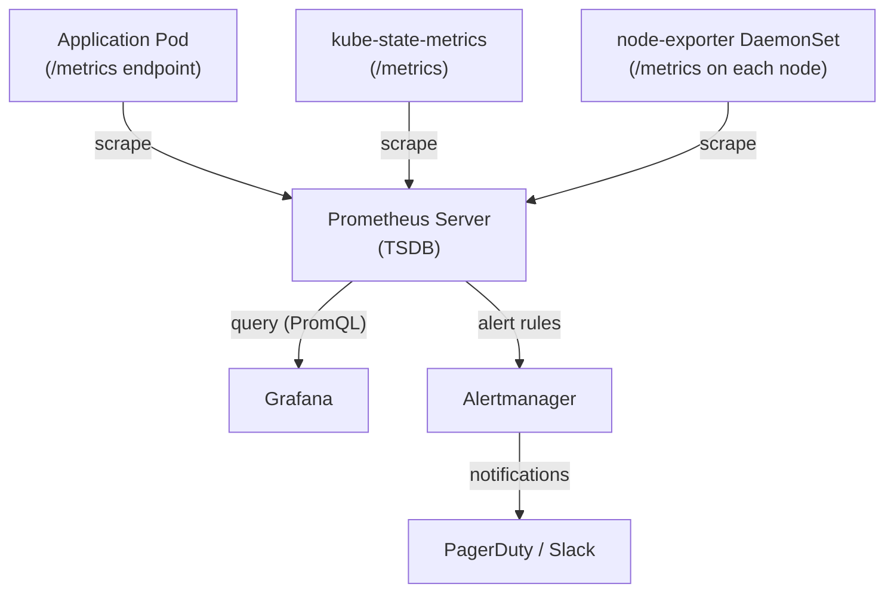
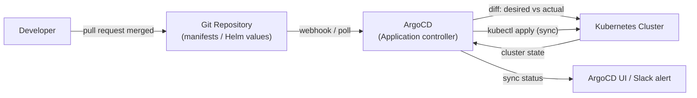

# 12 - Observability and Production Operations

[toc]

> **TL;DR:** Production Kubernetes requires three pillars of observability: metrics (Prometheus + Grafana), logs (Loki + Fluent Bit, or an ELK stack), and traces (OpenTelemetry + Jaeger/Tempo). On top of observability sits operational tooling: Helm for templated releases, Kustomize for overlay-based configuration, operators for complex stateful apps, and GitOps (ArgoCD/Flux) for continuous reconciliation of cluster state with a git repository. Getting any of these wrong means flying blind at 3 AM during an incident.

## Vocabulary

**metrics-server**: The lightweight Kubernetes metrics aggregator. Provides CPU/memory metrics for `kubectl top` and HPA. Does NOT persist metrics — only real-time data. Replaced by Prometheus for production monitoring.

---

**Prometheus**: An open-source metrics system with a pull-based model and a powerful query language (PromQL). Scrapes `/metrics` endpoints from Pods, Kubernetes components, and node exporters. The de-facto standard for Kubernetes monitoring.

---

**PromQL**: Prometheus Query Language. A functional language for time-series data. `rate(http_requests_total[5m])` gives per-second request rate over the last 5 minutes. Used in Grafana dashboards and Alertmanager alert rules.

---

**Grafana**: A metrics visualization platform. Connects to Prometheus (and many other data sources) and renders dashboards. The standard UI for Kubernetes metrics.

---

**Alertmanager**: A Prometheus component that routes and deduplicates alerts to notification channels (PagerDuty, Slack, email). Configured with alert rules and routing trees.

---

**Loki**: A horizontally scalable log aggregation system from Grafana Labs. Stores only indexes (labels), not log content, making it much cheaper than Elasticsearch for Kubernetes logs.

---

**Fluent Bit**: A lightweight log forwarder (DaemonSet). Reads container log files from nodes, enriches them with pod metadata, and ships to Loki, Elasticsearch, or cloud log services.

---

**OpenTelemetry (OTel)**: A CNCF project for vendor-neutral distributed tracing, metrics, and logs. The OTel Collector aggregates and routes telemetry from instrumented applications to backends (Jaeger, Tempo, Datadog, etc.).

---

**Helm**: A package manager for Kubernetes. A "chart" is a collection of templated Kubernetes manifests with configurable values. `helm install` renders the templates and applies them to the cluster.

---

**Kustomize**: A configuration management tool that generates Kubernetes manifests by applying overlays (patches, ConfigMap generators, image transforms) on top of a base. No templates — pure YAML patching. Built into `kubectl` as `kubectl apply -k`.

---

**Operator**: A Kubernetes controller that encodes operational knowledge about a specific application (database, message broker, ML training job). Manages the full lifecycle: provisioning, scaling, backup, upgrade, failover.

---

**GitOps**: A deployment model where the cluster's desired state is defined entirely in git. A CD agent (ArgoCD, Flux) watches the git repository and reconciles the cluster state to match. Changes are made via pull requests, not manual `kubectl apply`.

---

**ArgoCD**: A declarative GitOps CD tool. Watches git repositories, compares the cluster's current state with the desired state in git, and either auto-syncs or notifies when drift is detected.

---

**Flux**: An alternative GitOps toolkit with a more modular, controller-based architecture. Supports Helm releases, Kustomize overlays, and OCI artifacts as git-tree sources.

---

**ephemeral container**: A container that can be added to a running Pod without restarting it, for debugging purposes. Does not survive Pod restarts. Available since Kubernetes 1.25 without a feature gate.

---

## Intuition

Observability for Kubernetes is a three-layer problem. At the infrastructure layer, you need to know: are the nodes healthy, are the control-plane components healthy, is the cluster autoscaler scaling correctly? At the workload layer: are my Pods running, are they serving requests, is the error rate acceptable? At the application layer: where is latency coming from, which service is slow, which database query is taking 2 seconds?

Metrics answer "what is happening now and over the last N hours." Logs answer "what happened, in sequence, for a specific request or Pod." Traces answer "how long did each step take across multiple services for a single request." You need all three. The cost of not having them is a production incident where you're guessing — and guessing at 3 AM with an SLA breach is expensive.

GitOps completes the picture: if the cluster's state is a function of git history, then every change is audited, every rollback is `git revert`, and no one can make silent manual changes that drift from the declared state.

## How it Works

### The Prometheus Scrape Model

Prometheus uses a pull model: it periodically sends HTTP GET requests to `/metrics` endpoints on each target. Targets are discovered via Kubernetes Service Discovery — Prometheus watches the Kubernetes API for Pods, Services, and Endpoints matching configured `relabel_configs`.

The kube-prometheus-stack Helm chart (the standard Prometheus deployment) deploys:
- `prometheus-operator`: watches `ServiceMonitor` and `PodMonitor` CRDs that tell Prometheus which targets to scrape.
- `prometheus`: the Prometheus server with its TSDB (time-series database, local storage).
- `alertmanager`: routes firing alerts.
- `grafana`: dashboards pre-configured for Kubernetes (kube-state-metrics, node metrics, workload metrics).
- `kube-state-metrics`: exports Kubernetes object state (Deployment replicas desired vs available, PVC bound status) as Prometheus metrics.
- `node-exporter`: exports node-level hardware metrics (CPU, memory, disk, network) from each node.



The `ServiceMonitor` CRD is the glue between a Kubernetes Service and Prometheus scraping. When the Prometheus operator sees a `ServiceMonitor` object, it adds the matching Service's pods to Prometheus's scrape target list automatically, without editing Prometheus configuration files.

```yaml
---
apiVersion: monitoring.coreos.com/v1
kind: ServiceMonitor
metadata:
  name: api-server-metrics
  namespace: production
spec:
  selector:
    matchLabels:
      app: api-server
  endpoints:
    - port: metrics
      interval: 30s
      path: /metrics
```

### Log Collection Architecture

The standard production log pipeline: application writes to stdout/stderr → kubelet captures via containerd to `/var/log/pods/` → Fluent Bit DaemonSet reads log files → enriches with Kubernetes metadata (namespace, pod name, labels) → ships to Loki.

Loki stores logs as compressed chunks indexed only by labels (stream identifiers). Unlike Elasticsearch which full-text indexes every word, Loki only indexes the label set and uses streaming grep for full-text search. This makes Loki 5–10x cheaper in storage per log line at the cost of slower full-text search on large volumes.

LogQL (Loki's query language) uses a similar structure to PromQL:

```
{namespace="production", app="api-server"} |= "error" | json | line_format "{{.message}}"
```

### Distributed Tracing with OpenTelemetry

OpenTelemetry provides the SDK for instrumentation and the Collector for aggregation. Applications use the OTel SDK to create spans — a span is one unit of work with a start time, end time, attributes, and links to parent spans. The SDK exports span data to the OTel Collector via OTLP (the OTel Protocol). The Collector processes, filters, and batches spans, then exports to a backend (Jaeger, Tempo, Zipkin, Datadog).

In Kubernetes, the standard deployment: OTel Collector as a DaemonSet (one per node, for low latency) or as a central Deployment (simpler). Applications configure the OTel SDK's endpoint as the Collector's Service address.

### Helm and Kustomize

**Helm** is appropriate when you are consuming third-party software (Prometheus, cert-manager, NGINX Ingress) where the chart maintainer has encoded best practices, and you need configurable values without modifying templates. The `values.yaml` file provides a clean interface for customization.

**Kustomize** is appropriate for your own application manifests where you have a base configuration and environment-specific overlays (dev, staging, prod differ by replica count, resource limits, ingress hostnames). No templates — pure YAML patching means the output is always valid, readable YAML.

A common pattern: use Helm to install third-party software, use Kustomize for your own application manifests, and manage both via ArgoCD.

### GitOps with ArgoCD

ArgoCD watches a git repository (or OCI image, Helm chart repository) and compares the desired state (what's in git) to the current state (what's in the cluster). When it detects drift, it either auto-syncs or notifies (depending on `syncPolicy`). The key guarantee: if something changed in the cluster that is not reflected in git, ArgoCD reverts it. This makes unauthorized or accidental `kubectl edit` changes short-lived.



An ArgoCD `Application` CRD points to a git path and a cluster/namespace target:

```yaml
---
apiVersion: argoproj.io/v1alpha1
kind: Application
metadata:
  name: api-server
  namespace: argocd
spec:
  project: production
  source:
    repoURL: https://github.com/myorg/k8s-manifests
    targetRevision: main
    path: apps/production/api-server
  destination:
    server: https://kubernetes.default.svc
    namespace: production
  syncPolicy:
    automated:
      prune: true         # delete resources removed from git
      selfHeal: true      # revert manual kubectl changes
    syncOptions:
      - CreateNamespace=true
```

## Real-world Example

Setting up the complete Prometheus + Grafana stack via Helm, plus basic alert rules and a structured log pipeline.

```bash
#!/usr/bin/env bash
set -euo pipefail

# Install kube-prometheus-stack
helm repo add prometheus-community https://prometheus-community.github.io/helm-charts
helm repo update

helm upgrade --install kube-prometheus-stack \
  prometheus-community/kube-prometheus-stack \
  --namespace monitoring \
  --create-namespace \
  --set grafana.adminPassword="changeme-in-prod" \
  --set prometheus.prometheusSpec.retention="30d" \
  --set prometheus.prometheusSpec.storageSpec.volumeClaimTemplate.spec.storageClassName="ebs-gp3" \
  --set prometheus.prometheusSpec.storageSpec.volumeClaimTemplate.spec.resources.requests.storage="100Gi"

# Access Grafana locally
kubectl port-forward -n monitoring svc/kube-prometheus-stack-grafana 3000:80
# Open http://localhost:3000 — user: admin, pass: changeme-in-prod

# Install Loki + Fluent Bit
helm repo add grafana https://grafana.github.io/helm-charts
helm upgrade --install loki grafana/loki-stack \
  --namespace monitoring \
  --set fluent-bit.enabled=true \
  --set loki.persistence.enabled=true \
  --set loki.persistence.size="50Gi"
```

```yaml
---
# PrometheusRule for high error rate alerting
apiVersion: monitoring.coreos.com/v1
kind: PrometheusRule
metadata:
  name: api-server-alerts
  namespace: production
  labels:
    release: kube-prometheus-stack
spec:
  groups:
    - name: api-server
      interval: 30s
      rules:
        - alert: HighErrorRate
          expr: |
            rate(http_requests_total{namespace="production",status=~"5.."}[5m])
            /
            rate(http_requests_total{namespace="production"}[5m])
            > 0.05
          for: 2m
          labels:
            severity: warning
            team: backend
          annotations:
            summary: "High 5xx error rate on {{ $labels.pod }}"
            description: "Error rate {{ $value | humanizePercentage }} over last 5m"
        - alert: PodCrashLooping
          expr: |
            rate(kube_pod_container_status_restarts_total{namespace="production"}[15m]) * 60 * 15 > 3
          for: 0m
          labels:
            severity: critical
          annotations:
            summary: "Pod {{ $labels.namespace }}/{{ $labels.pod }} crash looping"
```

```bash
# Debugging with kubectl debug (ephemeral container — works on distroless images)
kubectl debug -it api-server-7d8b9f-abc12 -n production \
  --image=nicolaka/netshoot:latest \
  --target=api
# Shares api container's process and network namespace
# Run: curl localhost:8080/health, tcpdump, strace -p <pid>

# Simpler debugging when shell is available
kubectl exec -it api-server-7d8b9f-abc12 -n production -- \
  /bin/sh -c "wget -qO- http://postgres:5432"
```

> [!TIP]
> The `nicolaka/netshoot` image is a Swiss Army knife for Kubernetes network debugging: curl, wget, nslookup, dig, tcpdump, netstat, ss, iperf3, traceroute. Use it as your standard `kubectl debug --image` for any network connectivity issue.

## In Practice

**Prometheus storage at scale:** Prometheus's local TSDB is optimized for recent data. Beyond 2–4 weeks of retention, consider remote write to Thanos (long-term storage with deduplication for HA Prometheus) or Grafana Mimir (horizontally scalable Prometheus-compatible backend). kube-prometheus-stack's default `retention: 10d` is fine for small clusters; production clusters typically use 30d local + remote write to Thanos.

**Alert fatigue:** The most common Kubernetes monitoring failure is sending too many alerts, training on-call engineers to ignore them. Start with the golden signals (latency, traffic, errors, saturation) for each service. Use `for: 5m` (alerts must be firing for 5 minutes before paging) to eliminate transient spikes. Use `severity: warning` for Slack notifications and `severity: critical` for PagerDuty pages.

**Helm upgrade safety:** Use `helm upgrade --atomic --timeout 5m` to automatically roll back a failed Helm release. `--atomic` sets `--wait` (waits for resources to be ready) and rolls back automatically if the wait times out or any hook fails. Without `--atomic`, a partially upgraded release leaves the cluster in an indeterminate state.

**ArgoCD drift detection:** `selfHeal: true` in ArgoCD's sync policy reverts manual `kubectl apply` or `kubectl edit` changes automatically. This is the correct setting for production — any change should go through git. For emergency situations, temporarily disable `selfHeal` in ArgoCD's UI, apply the change, then create a PR to git, and re-enable `selfHeal` after the PR merges.

> [!CAUTION]
> **ArgoCD `prune: true` + `selfHeal: true` will delete resources not in git.** If a developer applies a temporary debug Deployment with `kubectl apply` and ArgoCD auto-sync runs, the debug Deployment is deleted. More dangerously: if a resource is accidentally removed from the git repository, ArgoCD will delete it from the cluster. Use `resource.exclusions` in ArgoCD's ConfigMap to exclude specific resources from pruning (e.g., PersistentVolumeClaims that should not be auto-deleted).

## Pitfalls

- **"metrics-server is sufficient for monitoring."** — metrics-server provides instantaneous CPU/memory for HPA and `kubectl top`. It has no retention, no dashboards, no alerting, and no custom metrics. Prometheus is required for production monitoring.
- **"Logs are enough; traces are overkill."** — Logs work for single-service debugging. For a request that traverses 5 microservices, logs give you 5 independent streams with no automatic correlation. A trace gives you one waterfall diagram of the entire request path across all services. Traces become essential once you have more than 3 services.
- **"Helm is idempotent like kubectl apply."** — `helm install` fails if the release already exists. `helm upgrade --install` is idempotent. Always use `upgrade --install` in CI pipelines.
- **"ArgoCD sync = kubectl apply."** — ArgoCD uses a three-way merge strategy similar to `kubectl apply`, not a destructive replace. Always use `kubectl apply` (not `kubectl create` or `kubectl replace`) for resources managed by ArgoCD to avoid annotation divergence.
- **"kubectl debug requires the container to have a shell."** — `kubectl exec` requires a shell in the target container. `kubectl debug --target` attaches an ephemeral container that shares the target's process namespace — it uses the debug image's tools, not the target container's. This is the solution for distroless containers.

## Exercises

### Exercise 1 — Conceptual: The Three Pillars of Observability

Explain the distinct role of metrics, logs, and traces in debugging a production incident where P99 latency spiked from 50ms to 800ms for 10 minutes.

#### Solution

**Metrics (Prometheus/Grafana)** tell you *what* and *when*. They answer: which service experienced the spike? At what time exactly? What was the error rate? What was the pod CPU/memory during the spike? Did the database connection pool exhaust? A Grafana dashboard showing `http_request_duration_p99{service="api"}` shows the spike immediately. Correlated panels for `db_query_duration_p99`, `pod_cpu_usage`, and `connections_pool_used` help narrow down the cause.

**Logs (Loki)** tell you *what happened in sequence*. Once metrics narrow the incident to "the api service, between 14:32 and 14:42 UTC", logs give you the specific requests that were slow, specific error messages, and the exact sequence of events. LogQL `{service="api"} |= "duration_ms" | json | duration_ms > 500` might reveal `"upstream connect error: connection timeout: db-0:5432"` — confirming database connectivity as the root cause.

**Traces (Jaeger/Tempo)** tell you *where the time went* across services. A trace for one of the slow requests shows: 2ms in the API handler, 790ms waiting for database query, 5ms in serialization. The database span shows the query `SELECT * FROM orders WHERE user_id = ? LIMIT 10000` — a missing index caused a full table scan. Without the trace, you would have identified "database is slow" from metrics and logs, but not *which query* and *why* without manual investigation.

### Exercise 2 — PromQL: Write Alert Rules

Write PromQL expressions for: (1) average CPU usage above 80% for api-server pods for 5 minutes, (2) PVC usage above 90%, (3) Deployment available replicas below desired for more than 2 minutes.

#### Solution

```yaml
---
apiVersion: monitoring.coreos.com/v1
kind: PrometheusRule
metadata:
  name: production-alerts
  namespace: production
  labels:
    release: kube-prometheus-stack
spec:
  groups:
    - name: production
      rules:
        - alert: HighCPUUsage
          expr: |
            (
              sum(rate(container_cpu_usage_seconds_total{
                namespace="production", container="api", container!="POD"
              }[5m])) by (pod)
              /
              sum(kube_pod_container_resource_requests{
                namespace="production", container="api", resource="cpu"
              }) by (pod)
            ) > 0.80
          for: 5m
          labels:
            severity: warning
          annotations:
            summary: "High CPU on {{ $labels.pod }}: {{ $value | humanizePercentage }}"
        - alert: PVCNearFull
          expr: |
            (kubelet_volume_stats_used_bytes / kubelet_volume_stats_capacity_bytes) > 0.90
          for: 5m
          labels:
            severity: warning
          annotations:
            summary: "PVC {{ $labels.persistentvolumeclaim }} is {{ $value | humanizePercentage }} full"
        - alert: DeploymentReplicasMismatch
          expr: |
            kube_deployment_spec_replicas{namespace="production"}
            !=
            kube_deployment_status_replicas_available{namespace="production"}
          for: 2m
          labels:
            severity: critical
          annotations:
            summary: "Deployment {{ $labels.deployment }} has unavailable replicas"
```

### Exercise 3 — Design: GitOps Rollback Strategy

Your team uses ArgoCD with auto-sync and selfHeal. A bad deploy was pushed to the `main` branch and auto-synced to production. The service error rate spiked. Describe the rollback procedure step by step.

#### Solution

**Step 1 — Immediate mitigation: disable auto-sync in ArgoCD UI.** This takes 30 seconds. Click the Application → "Disable Auto-Sync" to prevent ArgoCD from re-applying the bad version. Then use "Sync to Revision" → enter the previous commit SHA. ArgoCD applies the previous manifests immediately.

**Step 2 — Create a revert commit in git.** Use `git revert <bad-commit-sha>` (not `git reset` — never force-push a shared branch). This creates a new commit that undoes the bad changes while preserving history. Push the revert commit to `main`.

**Step 3 — Re-enable ArgoCD auto-sync.** The revert commit is now in `main`. ArgoCD syncs to the reverted state and the cluster converges to the pre-incident state.

**Step 4 — Investigate in staging** before attempting a fixed re-deploy to production.

**Prevention:** Use separate environment branches (`main` → staging auto-deploy, `release` → production with PR approval requirement). Use ArgoCD `syncWindows` to restrict production syncs to business hours. Require staging deployment verification before promoting to production.

### Exercise 4 — Design: Multi-Service Observability Bootstrap

You join a team with 15 microservices and zero observability. You have 2 weeks. List priorities and justify the order.

#### Solution

**Week 1, Days 1–2: Infrastructure metrics.** Install `kube-prometheus-stack` via Helm. Immediately provides Kubernetes control-plane metrics, node metrics (CPU/memory/disk), and Pod resource usage. Pre-built Grafana dashboards for the cluster layer are available from the kube-prometheus community repo. Zero application changes required.

**Week 1, Days 3–5: Application golden signal metrics.** Add the Prometheus client library to each service (`prometheus_client` for Python, `prom/client_golang` for Go). Expose at minimum: request counter by status code and endpoint, request latency histogram, error counter. Deploy `ServiceMonitor` objects to scrape them. This covers the four golden signals for all 15 services.

**Week 1, Days 6–7: Alerting for critical failures.** Configure `PrometheusRule` for: Deployment replica mismatch (rollout stuck), Pod `CrashLoopBackOff` (from kube-state-metrics), high per-service error rate, PVC near full. Route `critical` to PagerDuty, `warning` to Slack. You now have after-hours coverage.

**Week 2, Days 1–3: Log aggregation.** Deploy Loki + Fluent Bit. Ensure all services log structured JSON to stdout. Add Loki as a Grafana datasource with log panels alongside metric panels. The "what happened in sequence" layer is now complete.

**Week 2, Days 4–7: Distributed tracing.** Deploy the OTel Collector as a DaemonSet. Instrument the 2–3 most critical user-facing request paths. Add `traceparent` header propagation. Connect to Grafana Tempo. This is the highest-effort piece (application code changes) and yields the highest debugging leverage for inter-service latency issues.

**Deferred to week 3+:** Business metrics dashboards, SLO/error budget tracking, Continuous Profiling (Pyroscope), log retention tuning.

## Sources

- Prometheus documentation. https://prometheus.io/docs/
- Grafana Loki documentation. https://grafana.com/docs/loki/latest/
- OpenTelemetry documentation. https://opentelemetry.io/docs/
- ArgoCD documentation. https://argo-cd.readthedocs.io/
- Helm documentation. https://helm.sh/docs/
- kube-prometheus-stack Helm chart. https://github.com/prometheus-community/helm-charts/tree/main/charts/kube-prometheus-stack
- Lukša, M. *Kubernetes in Action*, 2nd ed. Chapter 17 (Best practices).
- Rosso, J. et al. *Production Kubernetes*. O'Reilly. Chapters 14 (Observability) and 15 (GitOps).

## Related

- [2 - The Control Plane](./2-the-control-plane.md)
- [4 - Pods and Workload Resources](./4-pods-and-workload-resources.md)
- [8 - ConfigMaps, Secrets, and Configuration](./8-configmaps-secrets-and-configuration.md)
- [9 - RBAC, Service Accounts, and Security](./9-rbac-service-accounts-and-security.md)
- [11 - Scheduling, Autoscaling, and Resource Management](./11-scheduling-autoscaling-and-resource-management.md)
