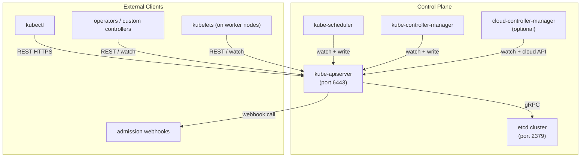
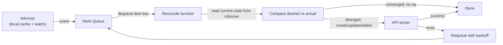

# 2 - The Control Plane

[toc]

> **TL;DR:** The Kubernetes control plane is the cluster's brain — a set of loosely coupled processes that store state (etcd), expose it (kube-apiserver), decide where workloads run (kube-scheduler), and drive actual state toward desired state (kube-controller-manager). Every component is stateless except etcd; every component communicates exclusively through the API server. Understanding the control plane means understanding what happens when things go wrong — and why Kubernetes can tolerate individual component failures without losing cluster data.

## Vocabulary

**kube-apiserver**: The front door to all cluster state. Validates and persists objects to etcd, enforces RBAC and admission, and serves watch streams to all other components. The only component that talks to etcd.

---

**etcd**: A distributed, strongly-consistent key-value store using the Raft consensus algorithm. Stores the full serialized state of every Kubernetes object. Losing etcd without a backup means losing the cluster.

---

**kube-scheduler**: Watches for unbound Pods (no `nodeName`) and writes a node assignment. Runs filtering (predicates) then scoring (priorities) per Pod. Does not start containers — only writes one field.

---

**kube-controller-manager**: A single binary hosting dozens of independent controller loops — Deployment controller, ReplicaSet controller, Node controller, Endpoints controller, etc. Each runs as a goroutine watching specific resource types.

---

**cloud-controller-manager (CCM)**: The control-plane component that talks to cloud provider APIs. Manages LoadBalancer Services (creates cloud LBs), Node lifecycle (detects terminated VMs), and persistent volumes from cloud storage. Separates cloud-specific code from core Kubernetes.

---

**Raft**: The distributed consensus algorithm etcd uses. Requires a quorum of `(n/2)+1` members to commit a write. With 3 members, 2 must agree; with 5 members, 3 must agree.

---

**Leader election**: How kube-scheduler and kube-controller-manager ensure only one instance acts at a time in an HA setup. Uses a Lease object in the `kube-system` namespace as the coordination primitive.

---

**Admission webhook**: An HTTP webhook called by the API server during object creation/update, before persistence. Mutating webhooks can modify objects; validating webhooks can reject them. Both run after authentication and RBAC.

---

**Watch**: A long-lived HTTP/2 streaming request to the API server. Clients (controllers, kubelets) receive server-sent events whenever objects they care about change. The foundation of the reactive architecture.

---

**ResourceVersion**: An integer etcd revision number stored on every Kubernetes object. Controllers use it to detect stale watches and request a relist when they have missed events.

---

**Informer**: The standard Go client-side cache+watch pattern. Maintains a local in-memory store of objects (the `indexer`), driven by a watch stream. All production controllers use informers, not raw watches, to avoid hammering the API server.

---

## Intuition

Think of the control plane as a publish-subscribe system built on top of a single strongly-consistent log (etcd). Every write to the system is an append to that log. Every reader subscribes to a filtered stream of log events. The API server is the log broker — it mediates all reads and writes and fan-out watch events to subscribers.

This architecture has a specific and deliberate consequence: if the control plane goes down (API server unreachable), *running workloads keep running*. The kubelet on each node already received its Pod assignments; the containers are already started. Kubernetes provides *management-plane availability*, not *data-plane availability*. Your Pods do not die because the API server rebooted.

The second consequence is that every component is independently replaceable. The scheduler can be swapped (there are third-party schedulers), the controller-manager can be extended (custom controllers), and the API server can be scaled horizontally — because none of them hold state. All state is in etcd.

## How it Works

The control plane components form a layered architecture. Understanding the layers clarifies why each component exists and what breaks if it fails.



### The API Server in Detail

The API server is the only stateful gateway in the control plane. Every request goes through a pipeline: authentication → RBAC authorization → mutation admission webhooks → schema validation → validation admission webhooks → persist to etcd → return response. The server then fans out watch events to all registered watchers.

The API server exposes resources at versioned REST paths: `/api/v1/namespaces/default/pods`, `/apis/apps/v1/namespaces/default/deployments`. Multiple API versions can exist simultaneously (e.g. `v1beta1` and `v1`) — the API server converts between them transparently using stored version and preferred version configuration.

> [!IMPORTANT]
> The API server is the **only** component that reads from and writes to etcd. All other components — controllers, scheduler, kubelet — are clients of the API server. This is not an implementation detail; it is a design invariant. It means you can add any number of new controllers without giving them direct database access, and all access control is enforced in one place.

### etcd in Detail

etcd uses Raft: one leader node accepts writes, replicates them to followers, and returns success only after a quorum of nodes has acknowledged the entry. For a 3-member cluster, this means writes survive one node failure. For a 5-member cluster, two failures are tolerated.

Kubernetes stores all objects under the `/registry/` prefix in etcd. A Deployment named `nginx` in the `default` namespace lives at `/registry/deployments/default/nginx`. The value is a protobuf-serialized Kubernetes object. Watch events are simply etcd range watches on the `/registry/` prefix.

> [!CAUTION]
> **etcd is the only stateful component in the control plane. Back it up.** Use `etcdctl snapshot save` on a cron schedule, and test restores periodically. A lost etcd cluster with no backup means the cluster is unrecoverable — all object definitions, RBAC rules, secrets, and config are gone. Running workloads may continue but cannot be managed.

### The Scheduler in Detail

The scheduler operates in two phases per Pod: **filtering** and **scoring**. Filtering eliminates nodes that cannot run the Pod (insufficient CPU/memory requests, node affinity mismatch, taints without matching tolerations, volume topology constraints, pod anti-affinity). Scoring ranks the remaining nodes by a weighted sum of priority functions (least-requested resources, balanced resource allocation, inter-pod affinity, image locality). The highest-scoring node wins; the scheduler writes `spec.nodeName` to the Pod.

The scheduler is pluggable via the Scheduling Framework. Custom plugins can hook into `PreFilter`, `Filter`, `Score`, `Reserve`, and `Bind` extension points. Karpenter (covered in [11 - Scheduling, Autoscaling](./11-scheduling-autoscaling-and-resource-management.md)) replaces the default node selection with cloud API calls to provision new nodes on demand.

### The Controller Manager in Detail

The controller-manager binary hosts controllers as goroutines. Each controller runs an independent reconcile loop using the informer pattern:

1. Register informers for the resource types the controller cares about.
2. Enqueue objects into a work queue when informer events fire (add, update, delete).
3. Pop items from the queue, compare current state to desired state, take action (create/update/delete child objects or call external APIs).
4. On error, requeue with exponential backoff.

The key insight is that controllers are **level-triggered**: they reconcile the *current* state against the *desired* state on each loop, not the *delta* since last run. If the controller crashes and restarts, it re-observes the full current state and converges correctly without replaying a log of missed events.



### The Cloud Controller Manager

The CCM is the extension point that lets Kubernetes integrate with cloud infrastructure. Before CCM existed, all cloud code lived inside kube-controller-manager, making every cloud-specific change require a Kubernetes release. The CCM separation lets cloud providers ship their own CCM with cloud-specific logic (AWS, GCP, Azure, DigitalOcean each maintain their own).

The CCM owns three controllers: **Node** (detects that a VM was terminated and taints/deletes the Node object), **Route** (programs cloud VPC routes for pod CIDR ranges in some CNI setups), and **Service** (provisions and updates cloud load balancers when a Service of type `LoadBalancer` is created).

## Failure Analysis

The control plane is designed so that different component failures have different blast radii. Knowing this is critical for incident response and capacity planning.

| Component fails | Immediate impact | Running workloads |
| :--- | :--- | :--- |
| Single etcd member (3-member cluster) | Quorum maintained; writes continue | Unaffected |
| All etcd members | API server returns 503; no writes | Unaffected — kubelets keep Pods running |
| API server | kubectl returns errors; no new config | Unaffected — existing Pods continue |
| Scheduler | New/unbound Pods stay Pending indefinitely | Existing scheduled Pods unaffected |
| Controller-manager | No reconciliation; crashed Pods not replaced | Existing healthy Pods unaffected |
| CCM | No new cloud LBs; existing LBs stay up | Unaffected |

> [!NOTE]
> The separation of "management plane" from "data plane" is intentional and critical. A 30-minute control-plane outage (e.g., etcd leader election during a version upgrade) does not drop traffic to your Pods. This is why Kubernetes upgrades can be done without application downtime — upgrade the control plane first, then drain and upgrade nodes one at a time.

## Real-world Example

Inspecting control plane health and understanding leader election in a production HA cluster.

```bash
#!/usr/bin/env bash
set -euo pipefail

# Check etcd health (requires etcdctl and the peer certs)
# On a kubeadm cluster, certs are in /etc/kubernetes/pki/etcd/
ETCDCTL_API=3 etcdctl \
  --endpoints=https://127.0.0.1:2379 \
  --cacert=/etc/kubernetes/pki/etcd/ca.crt \
  --cert=/etc/kubernetes/pki/etcd/healthcheck-client.crt \
  --key=/etc/kubernetes/pki/etcd/healthcheck-client.key \
  endpoint health
# https://127.0.0.1:2379 is healthy: successfully committed proposal: took = 4.2ms

# Check which scheduler instance holds the leader lease
kubectl get lease kube-scheduler -n kube-system -o yaml
# spec:
#   holderIdentity: control-plane-1_a3f7bc12-...
#   leaseDurationSeconds: 15
#   renewTime: "2026-05-19T10:23:45.000000Z"

# Check which controller-manager holds the leader lease
kubectl get lease kube-controller-manager -n kube-system -o yaml

# Inspect recent scheduler decisions (scheduling events for a given pod)
kubectl describe pod nginx-demo-7d8b9f7c6-4xkp2 | grep -A 20 "Events:"
# Events:
#   Type    Reason     Age   From               Message
#   ----    ------     ----  ----               -------
#   Normal  Scheduled  5m    default-scheduler  Successfully assigned default/nginx-demo-7d8b9f7c6-4xkp2 to worker-1

# View raw object in etcd (requires direct etcd access — use sparingly in prod)
ETCDCTL_API=3 etcdctl \
  --endpoints=https://127.0.0.1:2379 \
  --cacert=/etc/kubernetes/pki/etcd/ca.crt \
  --cert=/etc/kubernetes/pki/etcd/healthcheck-client.crt \
  --key=/etc/kubernetes/pki/etcd/healthcheck-client.key \
  get /registry/deployments/default/nginx-demo --print-value-only | strings | head -30
# Shows the protobuf-encoded deployment object

# Check controller-manager and scheduler logs for errors
kubectl logs -n kube-system deployment/kube-controller-manager --tail=50
kubectl logs -n kube-system deployment/kube-scheduler --tail=50
```

> [!TIP]
> On managed clusters (GKE, EKS, AKS), you cannot SSH into the control-plane nodes. Use `kubectl logs -n kube-system` to read component logs and cloud-provider audit log exports (e.g., GCP Cloud Audit Logs, AWS CloudTrail) to trace API server activity.

## In Practice

**etcd tuning:** In production, etcd's disk I/O latency directly determines API server latency. The recommended etcd disk is a dedicated SSD with at least 50 IOPS/GB and `--heartbeat-interval=100ms`, `--election-timeout=1000ms`. etcd should be on a separate disk from the OS — competing I/O causes leader elections.

**API server scalability:** The API server can be scaled horizontally behind a TCP load balancer (layer 4, not layer 7, because it uses HTTP/2). The watch connection count is the main scaling constraint — each controller and each kubelet holds at minimum one watch connection. 1000-node clusters routinely have 5000+ concurrent watch connections. Use `--watch-cache-sizes` to tune per-resource caches.

**Controller manager scalability:** The `--concurrent-<resource>-syncs` flags control how many goroutines each controller runs. The Deployment controller default is 5 concurrent syncs. In clusters with thousands of Deployments experiencing mass rollouts simultaneously, increase this and watch API server request rate.

**Scheduler latency:** The scheduler is single-threaded per Pod (one Pod at a time through filter/score). With many pending Pods, scheduling throughput matters. The `--parallelism` flag on the scheduler sets how many Pods are processed concurrently. The default is 16; large clusters often need 64+.

> [!WARNING]
> **Never run an even number of etcd members.** 4 members requires 3 for quorum — the same tolerance as 3 members, but you are spending an extra machine. Valid configurations are 1 (dev only, no HA), 3 (tolerates 1 failure), 5 (tolerates 2 failures), 7 (tolerates 3 failures). More than 7 is rarely justified — write latency grows with cluster size because every write must be replicated.

## Pitfalls

- **"The API server stores data."** — The API server is stateless. It reads from and writes to etcd, but if it restarts, it loses nothing. etcd is the database; the API server is the database proxy plus business logic.
- **"Control-plane downtime = cluster downtime."** — Running Pods and Services continue to function during control-plane outages. kube-proxy has already programmed iptables rules; containers are already running. The only thing that stops working is management: new deployments, scaling, and config changes.
- **"Three etcd members can tolerate two failures."** — A 3-member cluster requires quorum of 2. Losing 2 members means losing quorum and the cluster stops accepting writes. Tolerate 2 failures you need 5 members.
- **"The scheduler assigns Pods to nodes."** — More precisely: the scheduler *writes a node name into the Pod object*. It does not SSH, does not Docker run, does not touch the node at all. The kubelet on the named node sees the assignment and starts the container.
- **"kube-controller-manager and kube-scheduler are separate processes in HA mode."** — They run as separate binaries, but in HA each runs multiple replicas with only one active at a time (leader election via Lease objects). The standby instances are idle, not doing work.

## Exercises

### Exercise 1 — Conceptual: What Does the Scheduler Actually Do?

Explain the scheduler's role in one paragraph, starting from "a Pod has been created with no nodeName." Be precise about what the scheduler reads, what it writes, and what it does NOT do.

#### Solution

When a Pod is created (by a ReplicaSet controller or directly by a user), its `spec.nodeName` field is empty. The kube-scheduler maintains an informer that watches all Pods. When it sees a Pod without `nodeName` (an "unbound" Pod), it enqueues the Pod. The scheduler dequeues the Pod, reads the cluster's current node states from its informer cache (available CPU/memory, taints, labels, running pods for affinity rules), runs the filtering algorithm to eliminate ineligible nodes, runs the scoring algorithm on the eligible nodes, and selects the highest-scoring one. It then writes one field — `spec.nodeName` — to the Pod object via a `POST` to the API server's `/binding` subresource. That is the entirety of the scheduler's work. It does NOT start any containers, does NOT SSH anywhere, does NOT call the container runtime, and does NOT communicate with the kubelet. The kubelet, which is watching the API server for Pods assigned to its node, sees the updated Pod and proceeds to start the container.

### Exercise 2 — YAML: Force a Pod onto a Specific Node

Write a Pod manifest that runs `busybox sleep 3600` and forces it to land on a node named `worker-2` using a `nodeName` field (bypassing the scheduler).

#### Solution

```yaml
---
apiVersion: v1
kind: Pod
metadata:
  name: pinned-busybox
  namespace: default
spec:
  nodeName: worker-2          # bypass scheduler entirely
  containers:
    - name: busybox
      image: busybox:1.36
      command:
        - sleep
        - "3600"
      resources:
        requests:
          cpu: 10m
          memory: 16Mi
        limits:
          cpu: 50m
          memory: 32Mi
  restartPolicy: Never
```

Setting `nodeName` directly bypasses the scheduler — the kubelet on `worker-2` will pick up this Pod immediately without scheduler involvement. This is useful for debugging (run a diagnostic pod on a specific node) but not for normal workloads — the scheduler's filtering step is skipped, meaning you bypass node-taints, resource checks, and affinity rules. If `worker-2` does not have enough resources, the Pod will fail to start rather than being rescheduled elsewhere.

### Exercise 3 — Debugging: etcd Quorum Lost

Your 3-member etcd cluster has lost 2 members. The API server returns `etcdserver: request timed out`. What is the recovery procedure?

#### Solution

With quorum lost (2 of 3 members down), etcd is completely read-only from the cluster's perspective — actually it stops serving reads AND writes. Recovery steps:

**Step 1 — Assess survivability of the remaining member:**
```bash
ETCDCTL_API=3 etcdctl member list \
  --endpoints=https://<surviving-member>:2379 \
  --cacert=/etc/kubernetes/pki/etcd/ca.crt \
  --cert=/etc/kubernetes/pki/etcd/peer.crt \
  --key=/etc/kubernetes/pki/etcd/peer.key
```

**Step 2 — If both failed members are permanently lost, restore from backup:**
```bash
# On a new etcd host, restore the snapshot
ETCDCTL_API=3 etcdctl snapshot restore /backup/etcd-snapshot.db \
  --name=new-member-1 \
  --initial-cluster="new-member-1=https://<ip>:2380" \
  --initial-cluster-token=etcd-cluster-new \
  --initial-advertise-peer-urls=https://<ip>:2380 \
  --data-dir=/var/lib/etcd-restored
```

**Step 3 — Point the API server at the restored etcd and restart it.** Running workloads are unaffected during this process because kubelets are autonomous.

**Step 4 — Verify etcd health and re-add replacement members to restore HA.**

The lesson: always run 3-member (or 5-member) etcd clusters, take periodic `etcdctl snapshot save` backups to off-cluster storage, and test restores. The Velero project can also back up Kubernetes objects above the etcd layer (objects, PVs), which is a useful complement to raw etcd snapshots.

### Exercise 4 — Design: Why Is the API Server the Only Component Talking to etcd?

Explain the architectural decision. What problems would arise if, say, the scheduler wrote Pod assignments directly to etcd?

#### Solution

Centralizing all etcd access in the API server provides three guarantees:

**1. Unified access control:** The API server enforces RBAC, admission webhooks, and schema validation on every write. If the scheduler wrote directly to etcd, it could bypass RBAC (write to any key), bypass admission (no mutation/validation hooks), and write arbitrary data without schema enforcement. Any component with etcd credentials could silently corrupt cluster state.

**2. API versioning and conversion:** Kubernetes supports multiple API versions simultaneously (e.g., `v1beta1` and `v1` for the same resource). The API server converts between the stored version and the requested version transparently. If components wrote directly to etcd, they would each need to implement version conversion, and a single component writing an old format could corrupt the stored representation.

**3. Watch fan-out:** etcd's watch mechanism scales poorly with many concurrent watchers. The API server aggregates watches — many controllers each watching the same resource type share a single etcd watch stream via the API server's watch cache. This reduces etcd load by orders of magnitude in large clusters.

The practical upshot: etcd credentials are among the most sensitive secrets in a Kubernetes cluster (equivalent to root on the database). Limiting them to one process (the API server) minimizes the blast radius of a credential leak.

## Sources

- Kubernetes official docs — Control plane components. https://kubernetes.io/docs/concepts/overview/components/
- etcd documentation — FAQ and operations guide. https://etcd.io/docs/
- Hightower, K., Burns, B., & Beda, J. *Kubernetes: Up and Running*, 3rd ed. O'Reilly. Chapter 2.
- Lukša, M. *Kubernetes in Action*, 2nd ed. Manning. Chapter 11.
- Kubernetes Scheduler Framework KEP. https://github.com/kubernetes/enhancements/tree/master/keps/sig-scheduling/624-scheduling-framework
- Brendan Burns' talk: *Kubernetes Design Principles*. https://www.youtube.com/watch?v=ZuIQurh_kDk

## Related

- [1 - What is Kubernetes](./1-what-is-kubernetes.md)
- [3 - The Data Plane (Nodes)](./3-the-data-plane-nodes.md)
- [9 - RBAC, Service Accounts, and Security](./9-rbac-service-accounts-and-security.md)
- [11 - Scheduling, Autoscaling, and Resource Management](./11-scheduling-autoscaling-and-resource-management.md)
