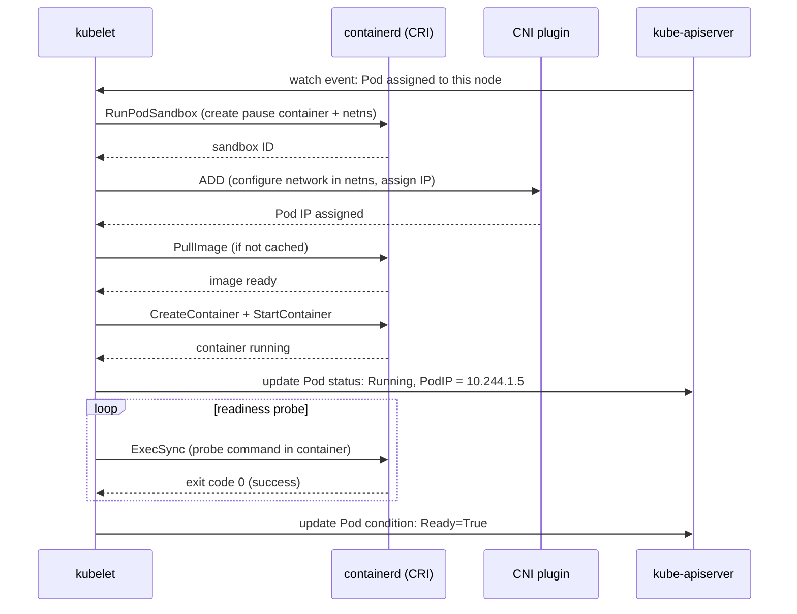

# 3 - The Data Plane (Nodes)

[toc]

> **TL;DR:** The data plane is where workloads actually run. Each node runs three mandatory components — kubelet (the node agent that starts and monitors containers), kube-proxy (programs network rules for Service VIPs), and a container runtime (containerd or CRI-O, which manages container lifecycle via OCI). Understanding the node layer means understanding what happens between "the scheduler writes a nodeName" and "the container is receiving traffic" — a journey through CRI, CNI, image layers, cgroups, and pod sandboxes.

## Vocabulary

**kubelet**: The primary node agent. Watches the API server for Pods assigned to its node, starts/stops containers via the CRI, runs liveness/readiness/startup probes, and reports back Pod status and node resource usage.

---

**kube-proxy**: Maintains network rules (iptables or IPVS) on each node that implement Service virtual IPs. When a packet hits a Service ClusterIP, kube-proxy's rules DNAT it to one of the backing Pod IPs. Covered more deeply in [5 - Services, Endpoints, and kube-proxy](./5-services-endpoints-and-kube-proxy.md).

---

**Container Runtime Interface (CRI)**: A gRPC API that the kubelet uses to manage container lifecycle without caring which runtime implements it. Defined in a protobuf spec; containerd and CRI-O are the two dominant implementations.

---

**containerd**: The industry-standard container runtime. Manages image pulls, snapshot storage, container creation, and OCI bundle execution. Docker itself now uses containerd as its runtime backend.

---

**CRI-O**: A lightweight CRI implementation purpose-built for Kubernetes. No daemon features beyond what CRI requires; uses runc (or any OCI runtime) to run containers.

---

**OCI runtime (runc)**: The low-level process that sets up namespaces (network, PID, mount, UTS, IPC), cgroups, and the rootfs, then exec's into the container process. The reference implementation of the OCI Runtime Specification.

---

**Pod sandbox**: The infrastructure container (often called "pause") that holds the network namespace for a Pod. All containers in the Pod share this namespace. The sandbox is created first; the application containers join it.

---

**CNI (Container Network Interface)**: A spec and library for network plugins. The kubelet calls the CNI plugin after sandbox creation to assign an IP and configure routing. Calico, Cilium, Flannel, and Weave are CNI plugins.

---

**Node capacity vs allocatable**: Capacity is the total hardware (e.g., 4 CPUs, 8Gi memory). Allocatable is capacity minus what's reserved for the OS and Kubernetes system processes. The scheduler uses `allocatable` for placement decisions.

---

**Eviction**: The kubelet's process of terminating Pods when a node is under resource pressure. Soft eviction (warning threshold, configurable grace period) vs hard eviction (immediate). Evicted Pods are recreated by their owning controllers on other nodes.

---

**cgroups (control groups)**: Linux kernel feature that limits and accounts for resource usage per process group. The runtime uses cgroups to enforce CPU limits (throttling) and memory limits (OOM kill) set in `resources.limits`.

---

**Liveness probe**: A periodic check by the kubelet that determines whether a container is alive. Failure triggers a container restart.

---

**Readiness probe**: A periodic check that determines whether a container is ready to receive traffic. Failure removes the Pod's IP from Service endpoint lists. Does NOT restart the container.

---

**Startup probe**: A one-time probe that disables liveness/readiness probes until it succeeds. Used for applications with long initialization times.

---

## Intuition

A Kubernetes node is best thought of as a three-layer stack. The bottom layer is the Linux kernel with its namespace and cgroup primitives — this is what actually isolates and limits processes. The middle layer is the container runtime (containerd + runc), which translates high-level "start this container" requests into kernel calls: create namespaces, set up the rootfs, fork+exec the process, attach cgroups. The top layer is the kubelet, which translates Kubernetes Pod specifications into CRI calls to the middle layer.

The kubelet is the node's connection to the cluster brain. It is autonomous: once it has a Pod assignment, it runs the Pod regardless of whether the API server is reachable. It periodically reports status back, but it does not need continuous connectivity to keep running existing workloads. This autonomy is the reason the data plane survives control-plane outages.

CNI is the fourth party that appears between sandbox creation and the container being reachable over the network. The kubelet creates the pod sandbox (a network namespace), then invokes the CNI plugin binary to set up the network inside that namespace — assign an IP from the cluster CIDR, create veth pairs, configure routing. Without CNI, the Pod has a network namespace but no IP address.

## How it Works

### Kubelet Boot and Node Registration

When the kubelet starts on a new node, it registers itself by creating a Node object in the API server with its capacity, OS, kernel version, and the container runtime endpoint. It then starts a watch on Pods whose `spec.nodeName` matches its own hostname. From this point, any Pod the scheduler assigns to this node arrives via the watch stream.

The kubelet also starts periodic reporting loops: the cAdvisor integration reports CPU/memory/disk metrics; the garbage collection loop cleans up unused images and containers; the eviction manager monitors node pressure thresholds.

### Pod Admission and Sandbox Creation

When the kubelet receives a new Pod via its watch, it runs local admission: verifies that the Pod's resource requests fit within the node's allocatable capacity (a secondary check after the scheduler), applies any node-local admission plugins, and stages the Pod into its internal state. It then begins the startup sequence:

1. **Create the pod sandbox.** The kubelet calls the CRI `RunPodSandbox` API. The runtime creates the "pause" infrastructure container, which creates a network namespace (netns), a UTS namespace (hostname), and an IPC namespace. The pause process holds these namespaces open — its only job is to sleep forever.

2. **Call CNI to configure the network.** The kubelet passes the network namespace path to the CNI plugin. The CNI plugin assigns an IP from the node's pod CIDR, creates a veth pair (one end in the pod netns, one end in the node's root netns), and configures routing so the pod IP is reachable from the rest of the cluster.

3. **Pull images.** For each container in the Pod spec, the kubelet calls `ImageService.PullImage` on the runtime. The runtime checks the local image cache; on a miss, it pulls layers from the registry, verifies digests, and unpacks layers into a content-addressable storage (CAS) snapshot store.

4. **Create and start containers.** For each container, the kubelet calls `RunContainer`. The runtime creates an OCI bundle (config.json + rootfs) from the image snapshot, calls the OCI runtime (runc) to set up namespaces and cgroups, and starts the container process.

5. **Run startup probe** (if configured) until success, blocking liveness/readiness probes.

6. **Run readiness probe** periodically. When it passes, the kubelet sets the Pod's `Ready` condition to `True`, which causes the Endpoints controller to add the Pod's IP to Service endpoint lists, making it eligible to receive traffic.



### Liveness, Readiness, and Startup Probes

The kubelet runs all three probe types using the `ExecAction`, `HTTPGetAction`, or `TCPSocketAction` mechanisms. Exec probes run a command inside the container (via `ExecSync` CRI call). HTTP probes make a GET request from the kubelet (not from inside the container — important for firewall reasoning). TCP probes attempt a TCP connection to the port.

Liveness probe failure triggers `ContainerKill` followed by restart per the `restartPolicy`. Readiness probe failure flips the Pod's `Ready` condition to `False` — no restart, but the Pod stops receiving traffic from Services. This distinction is critical: use readiness probes for transient states (cache warming, connection pool saturation), and liveness probes only when the process is genuinely deadlocked and must be restarted.

> [!WARNING]
> **Never set liveness probe thresholds shorter than readiness probe thresholds.** If the liveness probe fires before the readiness probe has had a chance to succeed, the container will be killed before it ever becomes ready — producing a `CrashLoopBackOff` for a healthy application. A safe default: `startupProbe` for slow-starting apps, `readinessProbe` for traffic gating, `livenessProbe` with a generous `failureThreshold` (3–5) only for detecting true deadlock.

### Image Pulls and Caching

containerd stores images as content-addressed snapshots using overlayfs. Each image layer is a directory that gets stacked using Linux overlayfs: lower layers (from the image) are read-only; the upper layer (container-specific write layer) is ephemeral and discarded on container exit. Multiple containers running the same image share the same read-only layers — this is why a node with 10 nginx containers does not consume 10x the disk space of one.

Image pull policy: `Always` forces a registry check on every Pod start; `IfNotPresent` (the default for versioned tags) skips the pull if the image is cached; `Never` fails if the image is not cached. Using `latest` tag with `IfNotPresent` is a classic footgun — the cached `latest` may be stale.

### Node Eviction

The kubelet runs an eviction manager that monitors system-level signals: `nodefs.available` (disk for Pod writable layers and logs), `imagefs.available` (disk for image storage), and `memory.available`. When a threshold is crossed, the kubelet selects Pods for eviction: first BestEffort Pods (no requests/limits), then Burstable Pods over their requests, then Guaranteed Pods as a last resort. Evicted Pods are terminated with `reason: Evicted` and recreated by their controllers elsewhere.

> [!TIP]
> Set `--eviction-soft=memory.available<500Mi` and `--eviction-soft-grace-period=memory.available=1m30s` to give pods a 90-second warning before eviction. Hard eviction (`--eviction-hard`) is immediate — useful for preventing OOM kills on the OS, which are unclean. Monitor node pressure conditions with `kubectl describe node | grep -A 5 Conditions`.

## Math: Resource Accounting

The resource accounting model is simple but has an important invariant. For a node with allocatable capacity `A`, the scheduler will not place a pod if:

```math
\sum_{p \in \text{scheduled pods}} \text{requests}(p) + \text{requests}(\text{new pod}) > A
```

Limits are not used for scheduling — only requests. A Pod can burst above its requests (up to its limits) at runtime. The gap between requests and limits is where resource contention happens: if all Pods on a node simultaneously try to use their full limit, the kernel's cgroup enforcement (CPU throttling, OOM kills) kicks in.

**QoS classes** are derived from the relationship between requests and limits:
- **Guaranteed**: `requests == limits` for all containers, for both CPU and memory. These Pods are the last to be evicted.
- **Burstable**: `requests < limits` for at least one container. Middle priority for eviction.
- **BestEffort**: No requests or limits set at all. Evicted first under node pressure.

## Real-world Example

Diagnosing a `CrashLoopBackOff` pod by following the kubelet's trail.

```bash
#!/usr/bin/env bash
set -euo pipefail

POD_NAME="my-app-7d8b9f-xkp2"
NAMESPACE="production"

# Step 1: describe shows Events and last State
kubectl describe pod "${POD_NAME}" -n "${NAMESPACE}"
# Look for:
#   Last State:   Terminated
#     Reason:     OOMKilled     <-- memory limit hit
#     Exit Code:  137

# Step 2: look at current logs
kubectl logs "${POD_NAME}" -n "${NAMESPACE}" --tail=100

# Step 3: look at logs from the PREVIOUS (crashed) container instance
kubectl logs "${POD_NAME}" -n "${NAMESPACE}" --previous --tail=100

# Step 4: check the node for system-level issues
NODE=$(kubectl get pod "${POD_NAME}" -n "${NAMESPACE}" -o jsonpath='{.spec.nodeName}')
kubectl describe node "${NODE}" | grep -A 10 "Conditions:"
# Look for MemoryPressure, DiskPressure, PIDPressure

# Step 5: check kubelet logs directly on the node (if accessible)
# journalctl -u kubelet -n 200 --no-pager

# Step 6: exec into a running container to debug live state
kubectl exec -it "${POD_NAME}" -n "${NAMESPACE}" -- /bin/sh
# If the container doesn't have a shell, use kubectl debug:
kubectl debug -it "${POD_NAME}" -n "${NAMESPACE}" \
  --image=busybox:1.36 \
  --target="${POD_NAME}"
```

> [!TIP]
> `kubectl debug` with `--target` attaches an ephemeral container that shares the target container's process namespace — you can inspect `/proc/<pid>/fd`, strace the process, and run diagnostic tools without modifying the application image. Requires `EphemeralContainers` feature gate (enabled by default since Kubernetes 1.25).

## In Practice

**containerd vs Docker:** Kubernetes removed direct Docker support (the "Dockershim") in v1.24. All production clusters now use containerd or CRI-O directly. The images are identical (OCI format), and `docker build` still works for building images. The runtime change is invisible to most users.

**CNI troubleshooting:** CNI plugin failures are a common source of pods stuck in `ContainerCreating`. The kubelet logs will show `CNI ADD failed` errors. Check that the CNI plugin binary is present on the node at `/opt/cni/bin/`, that the CNI config in `/etc/cni/net.d/` is valid JSON, and that the pod CIDR was correctly assigned to the node (`kubectl describe node | grep PodCIDR`).

**Image pull performance:** On large clusters, simultaneous pod rollouts can saturate the registry or the node's network bandwidth on image pulls. Mitigations include: a pull-through registry cache (Harbor, ECR mirror), pre-pulling images via DaemonSet, and the `--serialize-image-pulls=false` kubelet flag to allow parallel pulls.

**kubelet resource reservation:** By default, all node resources are allocatable to Pods. In practice, OS processes and system Pods (kube-proxy, CNI daemon, log collector) need headroom. Set `--kube-reserved` and `--system-reserved` on the kubelet (or in the kubelet config file) to carve out CPU/memory before any Pods are scheduled.

> [!CAUTION]
> **Never set memory `limits` lower than the application's working set.** A container that is OOM-killed by cgroups exits with code 137 and the kubelet enters `CrashLoopBackOff` with exponential backoff (10s, 20s, 40s, ... up to 5 minutes). The backoff is visible but the cause is not always obvious — always check `kubectl describe pod` for `OOMKilled` in `Last State.Reason`.

## Pitfalls

- **"Docker is the container runtime."** — Docker was removed as a direct runtime in Kubernetes 1.24. Production clusters use containerd or CRI-O. The Docker CLI and Dockerfile format are still relevant for *building* images; they are not relevant to *running* containers in Kubernetes.
- **"CPU limits throttle the container."** — CPU limits use the Linux CFS bandwidth controller. If a container uses 100% CPU for a period longer than its quota window, the kernel throttles it — even if the node has idle CPU capacity. This is why CPU limits can hurt latency-sensitive workloads and why many teams set CPU requests but not CPU limits.
- **"Readiness probe failure restarts the container."** — Readiness failure does NOT restart. It removes the Pod from Service endpoints. Only liveness probe failure causes a restart.
- **"The kubelet reads from etcd."** — The kubelet talks exclusively to the kube-apiserver, never directly to etcd. It uses a watch stream filtered to its own node name.
- **"Image tag `latest` is always fresh."** — With `imagePullPolicy: IfNotPresent`, the cached `latest` image is used if it exists locally. The kubelet only checks the registry if the policy is `Always` or if no local image with that tag exists. Use immutable digest-based references (`image: nginx@sha256:abc...`) for reproducible deployments.

## Exercises

### Exercise 1 — Conceptual: kubelet vs kube-proxy

Explain what kubelet does and what kube-proxy does. Could kube-proxy be removed from a node — under what conditions?

#### Solution

**kubelet** is the node's Kubernetes agent. It is responsible for container lifecycle: starting containers for Pods assigned to its node, running health probes, reporting status, and managing Pod termination. The kubelet talks to the container runtime via CRI. Without the kubelet, a node cannot run new Pods — it becomes a zombie node that the node controller will eventually mark `NotReady`.

**kube-proxy** is responsible for implementing Service network rules. It watches the Endpoints/EndpointSlices API and programs iptables (or IPVS) rules on the node so that packets destined for a Service ClusterIP are forwarded to a backing Pod IP. Without kube-proxy, Services stop working — their ClusterIPs are unreachable.

**kube-proxy can be removed when a CNI plugin like Cilium handles Service routing in eBPF.** Cilium's kube-proxy replacement mode (`kubeProxyReplacement: strict`) programs Service load balancing directly in the kernel's eBPF map infrastructure, bypassing iptables entirely. This eliminates kube-proxy's scalability bottleneck (iptables rules are O(n) to traverse for n Services) and provides better performance at large Service counts.

### Exercise 2 — YAML: Pod with Probes

Write a Pod manifest for a web application running `python:3.12-slim` that serves HTTP on port 8080. Include a startup probe (30s initial delay, 5s period), a readiness probe (HTTP GET `/ready`, 3s period), and a liveness probe (HTTP GET `/health`, 10s period with `failureThreshold: 3`).

#### Solution

```yaml
---
apiVersion: v1
kind: Pod
metadata:
  name: web-app
  namespace: default
  labels:
    app: web-app
spec:
  containers:
    - name: web
      image: python:3.12-slim
      command:
        - python3
        - -m
        - http.server
        - "8080"
      ports:
        - name: http
          containerPort: 8080
          protocol: TCP
      resources:
        requests:
          cpu: 100m
          memory: 128Mi
        limits:
          cpu: 500m
          memory: 256Mi
      startupProbe:
        httpGet:
          path: /health
          port: 8080
        initialDelaySeconds: 30
        periodSeconds: 5
        failureThreshold: 12         # 30s + 12*5s = 90s max startup window
      readinessProbe:
        httpGet:
          path: /ready
          port: 8080
        periodSeconds: 3
        failureThreshold: 3          # 9s before removed from endpoints
        successThreshold: 1
      livenessProbe:
        httpGet:
          path: /health
          port: 8080
        periodSeconds: 10
        failureThreshold: 3          # 30s before restart
        successThreshold: 1
```

Note: `startupProbe` disables `livenessProbe` and `readinessProbe` until it passes. The `failureThreshold * periodSeconds` for `startupProbe` defines the maximum startup window — set it wide enough that a slow-starting application is not killed before it is ready. Here the window is 30 + 12×5 = 90 seconds.

### Exercise 3 — Debugging: Pod Stuck in ContainerCreating

A Pod has been in `ContainerCreating` for 10 minutes. The events show `NetworkPlugin cni failed to set up pod`. Walk through the diagnosis.

#### Solution

`ContainerCreating` with a CNI error means the pod sandbox was created but network configuration failed. Diagnosis order:

**Step 1 — Get the full event message:**
```bash
kubectl describe pod <pod-name> -n <namespace>
# Events section will show something like:
# Failed to create pod sandbox: rpc error: code = Unknown desc = failed to
# set up sandbox container "abc123" network for pod "my-pod": networkPlugin
# cni failed to set up pod "my-pod_default" network: open /run/flannel/subnet.env:
# no such file or directory
```

**Step 2 — Check the CNI plugin is installed on the node:**
```bash
NODE=$(kubectl get pod <pod-name> -o jsonpath='{.spec.nodeName}')
# SSH to node or use kubectl debug node:
kubectl debug node/"${NODE}" -it --image=busybox -- ls /opt/cni/bin/
kubectl debug node/"${NODE}" -it --image=busybox -- ls /etc/cni/net.d/
```

**Step 3 — Check that the CNI DaemonSet is running on that node:**
```bash
kubectl get pods -n kube-system -o wide | grep -E "flannel|calico|cilium|weave"
# If the CNI pod is in CrashLoopBackOff on that node, fix the CNI pod first
```

**Step 4 — Check the node's PodCIDR assignment:**
```bash
kubectl describe node "${NODE}" | grep PodCIDR
# If empty, the CNI controller-manager may not have assigned a CIDR to this node
```

**Step 5 — Check kubelet and containerd logs on the node:**
```bash
journalctl -u kubelet -n 200 --no-pager | grep -i cni
journalctl -u containerd -n 200 --no-pager | grep -i error
```

The most common causes: the CNI DaemonSet is not running on the node (CNI pod evicted, node was just added), the CNI configuration file in `/etc/cni/net.d/` was not written by the CNI DaemonSet, or the node's pod CIDR overlaps with another node.

### Exercise 4 — Design: CPU Requests vs Limits

Explain the difference between CPU `requests` and CPU `limits`. A latency-sensitive service runs with `requests: 500m, limits: 500m`. Another colleague suggests removing the limit and only setting `requests: 500m`. Who is right, and why?

#### Solution

**CPU requests** tell the Kubernetes scheduler how much CPU to reserve for placement decisions and tell the Linux CFS scheduler the *minimum* CPU share this container gets relative to other containers on the same node. A request of 500m (0.5 CPUs) means: schedule me on a node that has at least 0.5 CPUs available, and when the node is overloaded, guarantee me at least 0.5 CPU of time.

**CPU limits** use the Linux CFS bandwidth controller to impose a *maximum* CPU consumption. A limit of 500m means the container's CPU usage is throttled to 0.5 CPUs even if the node has 3 free CPUs sitting idle.

**The colleague is right for a latency-sensitive service.** Setting `requests = limits = 500m` creates a Guaranteed QoS class pod (good for eviction resistance) but imposes CPU throttling at exactly 500m — even if the rest of the node is idle. For a latency-sensitive HTTP service, CPU throttling adds tail latency: a request that arrives when the container has exhausted its CFS quota waits until the next quota refill period (usually 100ms), adding up to 100ms of artificial latency.

Setting `requests: 500m` with no limit allows the container to burst above 500m when the node has spare capacity, reducing P99 latency. The risk is contention: if all containers burst simultaneously, the scheduler's CPU share accounting distributes excess proportionally by requests weight — the 500m container gets the same proportion as it always did, it just won't get throttled beyond that. For most latency-sensitive services, the correct stance is: set CPU requests accurately, omit CPU limits, and use memory limits (always set both requests and limits for memory, because memory cannot be "throttled" — it either fits or triggers an OOM kill).

## Sources

- Kubernetes docs — kubelet. https://kubernetes.io/docs/reference/command-line-tools-reference/kubelet/
- Kubernetes docs — Container Runtime Interface. https://kubernetes.io/docs/concepts/architecture/cri/
- OCI Runtime Specification. https://github.com/opencontainers/runtime-spec
- CNI Specification. https://github.com/containernetworking/cni/blob/main/SPEC.md
- Lukša, M. *Kubernetes in Action*, 2nd ed. Chapter 16 (node internals).
- Brendan Gregg. *Linux CPU Throttling in Kubernetes*. https://www.brendangregg.com/blog/2019-12-20/linux-cpu-throttling-kubernetes.html

## Related

- [1 - What is Kubernetes](./1-what-is-kubernetes.md)
- [2 - The Control Plane](./2-the-control-plane.md)
- [4 - Pods and Workload Resources](./4-pods-and-workload-resources.md)
- [5 - Services, Endpoints, and kube-proxy](./5-services-endpoints-and-kube-proxy.md)
- [10 - Networking Deep Dive](./10-networking-deep-dive.md)
- [11 - Scheduling, Autoscaling, and Resource Management](./11-scheduling-autoscaling-and-resource-management.md)
