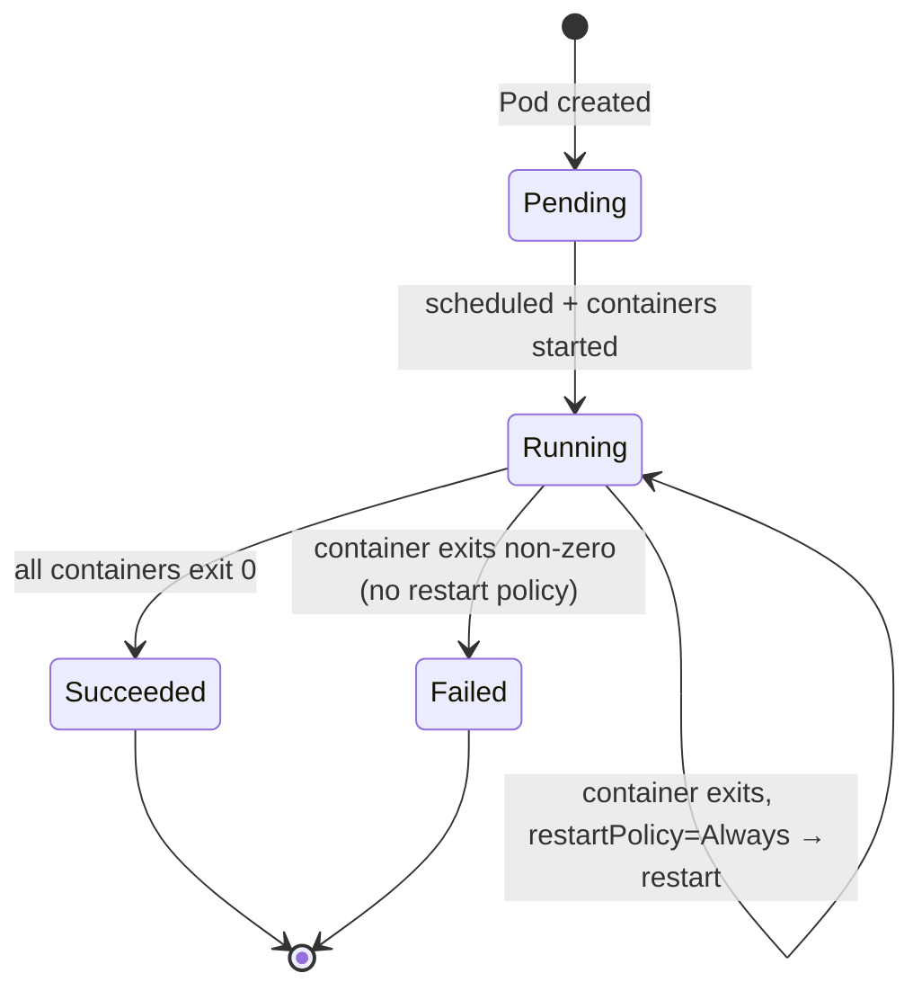
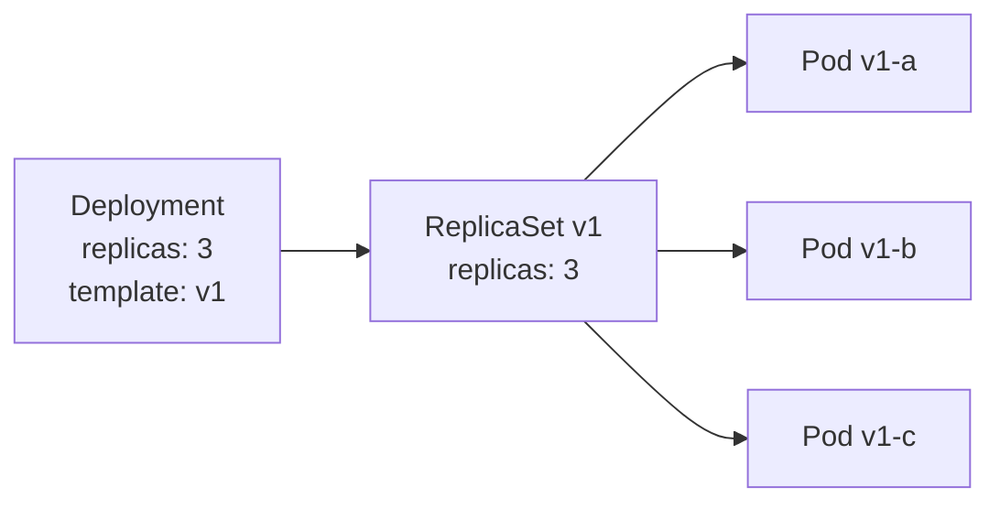
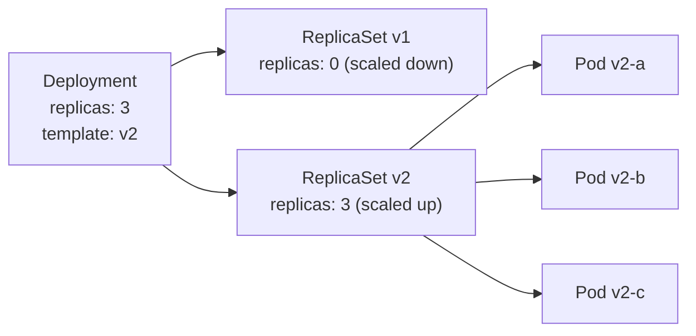

# 4 - Pods and Workload Resources

[toc]

> **TL;DR:** The Pod is the atomic unit of Kubernetes — the smallest thing you can schedule, the thing containers actually live inside. But you almost never create Pods directly. Instead you use workload abstractions: Deployments for stateless replicated services, StatefulSets for stateful services needing stable identity, DaemonSets for per-node agents, and Jobs/CronJobs for batch work. Each abstraction owns a different reconciliation strategy — understanding which to reach for, and why, is the single most important skill in writing production Kubernetes manifests.

## Vocabulary

**Pod**: A group of one or more containers that share a network namespace, IPC namespace, and optionally storage volumes. The unit of scheduling and co-location. Has a single IP address shared across all its containers.

---

**ReplicaSet**: A controller that ensures a specified number of Pod replicas are running at all times. Rarely created directly — Deployments manage ReplicaSets.

---

**Deployment**: A higher-level controller for stateless workloads. Manages ReplicaSets to provide rolling updates, rollback, and desired-replica enforcement. The standard way to run a web service.

---

**StatefulSet**: A controller for stateful workloads requiring stable network identity and persistent storage per replica. Pods are created/deleted in order, named `<name>-0`, `<name>-1`, etc., and each gets its own PVC.

---

**DaemonSet**: Ensures that a copy of a Pod runs on every (or a selected subset of) nodes. Used for node-level agents: log collectors, CNI plugins, monitoring daemons.

---

**Job**: Runs one or more Pods to completion. Unlike a Deployment, a completed Pod is *not* restarted. Used for batch processing, database migrations, and one-time initialization.

---

**CronJob**: Creates Jobs on a cron schedule. The Kubernetes equivalent of `crontab`.

---

**Init container**: A container that runs to completion *before* any application containers start. Used for initialization tasks: database migration, config generation, dependency waiting.

---

**Sidecar container**: A container in the same Pod as the main application that provides auxiliary functionality — logging, proxying, secrets injection. In Kubernetes 1.29+, sidecar containers have first-class support as a special `initContainer` with `restartPolicy: Always`.

---

**Pod template**: The `spec.template` field of a Deployment/StatefulSet/DaemonSet/Job. Defines what the Pods look like. When the template changes, a rolling update is triggered.

---

**selector**: A label query that tells a controller which Pods it owns. Must match `template.metadata.labels` exactly.

---

**PodDisruptionBudget (PDB)**: A resource that limits how many Pods from a workload can be simultaneously unavailable during voluntary disruptions (node drains, cluster upgrades). Prevents a cluster upgrade from taking your whole service down.

---

**terminationGracePeriodSeconds**: How long the kubelet waits (after sending SIGTERM) before sending SIGKILL. Default is 30 seconds. Applications should trap SIGTERM and drain in-flight requests within this window.

---

## Intuition

Think of the Pod as a tiny VM with one IP address and a shared filesystem. The containers inside a Pod are like processes on that VM — they can talk to each other over `localhost`, share files via shared volumes, and are co-located on the same physical machine. This co-location is the reason to put multiple containers in one Pod: only when they need to share a socket, a file, or a localhost interface. Otherwise, separate Pods give you independent scaling, scheduling, and failure domains.

Workload controllers exist to answer the question "what happens when a Pod dies?" For a Deployment, the answer is "create a replacement immediately, on any available node." For a StatefulSet, the answer is "create a replacement with the same name, same PVC, and only when the previous instance is fully gone." For a Job, the answer is "retry until success, then stop." The controller you choose determines the semantics of Pod death.

## How it Works

### Pods in Detail

Every Pod has exactly one IP address (assigned by CNI) shared across all its containers. Containers communicate with each other via `localhost:<port>`. The Pod's network namespace is held by the pause container (see [3 - The Data Plane](./3-the-data-plane-nodes.md)).

A Pod's lifecycle: `Pending` (waiting to be scheduled and for images to pull) → `Running` (at least one container is running) → `Succeeded` (all containers exited 0) or `Failed` (at least one container exited non-zero and will not be restarted). Pods also have `Ready` conditions (controlled by readiness probes) separate from their phase.



### Deployments

A Deployment's job is to maintain a desired number of identical Pod replicas and to update them safely when the template changes. It accomplishes this by managing a ReplicaSet hierarchy: each Deployment version corresponds to a ReplicaSet. During a rolling update, the Deployment controller scales up the new ReplicaSet while scaling down the old one, governed by `maxSurge` (extra Pods allowed above desired) and `maxUnavailable` (minimum Pods that must remain available).

The Deployment maintains a history of ReplicaSets (controlled by `revisionHistoryLimit`). Rolling back with `kubectl rollout undo` simply scales the previous ReplicaSet back up. The rollout strategy is configurable: `RollingUpdate` (default, zero-downtime) or `Recreate` (kill all Pods first, then create new ones — causes downtime but avoids two versions running simultaneously).



After a template change:



### StatefulSets

StatefulSets are fundamentally about identity. Each Pod gets a stable, ordered name (`<name>-0`, `<name>-1`, ...), a stable DNS hostname (`<name>-0.<headless-service>.<namespace>.svc.cluster.local`), and a dedicated PersistentVolumeClaim that survives Pod restarts and rescheduling. This is the key distinction: a Deployment Pod gets a new PVC when it is recreated; a StatefulSet Pod always gets the *same* PVC.

Pods in a StatefulSet are created in order (0, 1, 2, ...) and by default deleted in reverse order. Each Pod must be `Running` and `Ready` before the next is created. This ordered startup is essential for databases and distributed consensus systems where nodes must join one at a time.

> [!IMPORTANT]
> StatefulSets require a **headless service** (`clusterIP: None`) to provide stable DNS for each Pod. The headless service creates DNS A records for each Pod individually (`<pod-name>.<service>.<namespace>.svc.cluster.local`), while a normal ClusterIP service only creates a single virtual IP. Without the headless service, individual Pod addressing breaks.

### DaemonSets

A DaemonSet ensures exactly one Pod per matching node. When a new node joins the cluster, the DaemonSet controller creates a Pod on it. When a node is removed, the Pod is garbage collected. DaemonSets are used for infrastructure-level concerns: Fluentd/Fluent Bit for log collection, Prometheus node-exporter for metrics, Calico/Cilium CNI agents, and the nvidia-device-plugin for GPU nodes.

DaemonSets support node selectors and tolerations to restrict which nodes they run on. A common pattern: a GPU monitoring DaemonSet with `nodeSelector: nvidia.com/gpu: "true"` runs only on GPU nodes.

### Jobs and CronJobs

A Job runs Pods until a specified number of successful completions. The key configuration is `completions` (how many successful Pods needed), `parallelism` (how many run simultaneously), and `backoffLimit` (retries before marking the Job failed). A simple batch job uses `completions: 1, parallelism: 1`. A parallel work queue uses `completions: N, parallelism: M`.

CronJobs create Jobs on a schedule. The `concurrencyPolicy` governs what happens if a Job from the previous run is still running when the next scheduled time arrives: `Allow` (create a new Job anyway), `Forbid` (skip), or `Replace` (cancel the old Job and create a new one).

### Init Containers and Sidecars

Init containers run sequentially before any application container starts. A common pattern is a `wait-for-dependency` init container that polls a database or service until it is ready, preventing the main container from starting before its dependencies are available.

Sidecar containers (the native `initContainer` with `restartPolicy: Always` pattern added in Kubernetes 1.29, previously just a convention of putting helpers in `spec.containers`) run alongside the main container. Classic sidecars: Envoy/Linkerd proxy for service mesh, log shippers, secret rotators (like Vault agent), and Istio's `istio-proxy`. The native sidecar support ensures sidecars start before regular containers and are the last to stop during Pod termination.

## Real-world Example

A complete production-grade Deployment with rolling update configuration, PodDisruptionBudget, and a CronJob for scheduled cleanup.

```yaml
---
# Deployment for a stateless web API
apiVersion: apps/v1
kind: Deployment
metadata:
  name: api-server
  namespace: production
  labels:
    app: api-server
    version: "2.1.0"
spec:
  replicas: 4
  revisionHistoryLimit: 5
  selector:
    matchLabels:
      app: api-server
  strategy:
    type: RollingUpdate
    rollingUpdate:
      maxSurge: 1           # allow 1 extra pod during rollout
      maxUnavailable: 0     # never reduce below 4 pods (zero-downtime)
  template:
    metadata:
      labels:
        app: api-server
        version: "2.1.0"
    spec:
      terminationGracePeriodSeconds: 30
      containers:
        - name: api
          image: myregistry/api-server:2.1.0
          ports:
            - name: http
              containerPort: 8080
          env:
            - name: LOG_LEVEL
              value: info
          resources:
            requests:
              cpu: 200m
              memory: 256Mi
            limits:
              memory: 512Mi     # CPU limit intentionally omitted — see note 3
          readinessProbe:
            httpGet:
              path: /ready
              port: 8080
            initialDelaySeconds: 5
            periodSeconds: 5
            failureThreshold: 3
          livenessProbe:
            httpGet:
              path: /health
              port: 8080
            initialDelaySeconds: 15
            periodSeconds: 10
            failureThreshold: 3
          lifecycle:
            preStop:
              exec:
                command:
                  - sleep
                  - "5"    # drain in-flight requests before SIGTERM
---
# PodDisruptionBudget — during node drains, keep at least 3 pods up
apiVersion: policy/v1
kind: PodDisruptionBudget
metadata:
  name: api-server-pdb
  namespace: production
spec:
  minAvailable: 3
  selector:
    matchLabels:
      app: api-server
---
# CronJob for nightly cleanup
apiVersion: batch/v1
kind: CronJob
metadata:
  name: db-cleanup
  namespace: production
spec:
  schedule: "0 2 * * *"           # 2:00 AM UTC daily
  concurrencyPolicy: Forbid
  successfulJobsHistoryLimit: 3
  failedJobsHistoryLimit: 3
  jobTemplate:
    spec:
      backoffLimit: 2
      template:
        spec:
          restartPolicy: OnFailure
          containers:
            - name: cleanup
              image: myregistry/db-tools:latest
              command:
                - /bin/cleanup.sh
              resources:
                requests:
                  cpu: 100m
                  memory: 128Mi
                limits:
                  cpu: 500m
                  memory: 256Mi
```

```bash
#!/usr/bin/env bash
set -euo pipefail

# Rolling update: change the image
kubectl set image deployment/api-server api=myregistry/api-server:2.2.0 -n production

# Monitor the rollout
kubectl rollout status deployment/api-server -n production
# Waiting for deployment "api-server" rollout to finish: 1 out of 4 new replicas updated...
# Waiting for deployment "api-server" rollout to finish: 2 out of 4 new replicas updated...
# ...
# deployment "api-server" successfully rolled out

# If something goes wrong — roll back instantly
kubectl rollout undo deployment/api-server -n production

# Inspect rollout history
kubectl rollout history deployment/api-server -n production
# REVISION  CHANGE-CAUSE
# 1         <none>
# 2         image update to 2.1.0
# 3         image update to 2.2.0
```

> [!TIP]
> Set the `kubernetes.io/change-cause` annotation on the Deployment before each rollout to populate the `CHANGE-CAUSE` column in `kubectl rollout history`. This turns the rollout history into an auditable changelog.

## In Practice

**Pod anti-affinity for HA:** By default, a Deployment with 3 replicas may schedule all 3 Pods on the same node. If that node dies, all 3 Pods go down simultaneously — defeating the purpose of 3 replicas. Use `podAntiAffinity` with `topologyKey: kubernetes.io/hostname` to spread Pods across nodes. For zone-level HA, use `topologyKey: topology.kubernetes.io/zone`. The newer `topologySpreadConstraints` API is more flexible and generally preferred.

**StatefulSet ordering vs parallelism:** The default `podManagementPolicy: OrderedReady` creates Pods one at a time and waits for each to be Ready — safe but slow for large clusters. `podManagementPolicy: Parallel` creates all Pods simultaneously but requires the application to handle concurrent startup (e.g., a distributed consensus protocol where all nodes can bootstrap in parallel).

**Graceful shutdown:** The `preStop: exec: sleep 5` pattern is a common workaround for a race condition: when a Pod is being terminated, the kubelet sends SIGTERM at the same time the Endpoints controller removes the Pod from Service endpoints — but iptables updates propagate asynchronously across nodes. A 5-second sleep in `preStop` ensures existing connections are drained before SIGTERM is sent.

> [!WARNING]
> **`restartPolicy: Always` is the default and is wrong for Jobs.** A Job with `restartPolicy: Always` will restart completed (exit 0) containers indefinitely instead of marking the Job succeeded. Jobs must use `restartPolicy: OnFailure` or `restartPolicy: Never`. The API server rejects Jobs with `restartPolicy: Always` since Kubernetes 1.21.

## Pitfalls

- **"Pods are directly managed by users."** — In production, you almost never create Pods directly. Always use a workload controller (Deployment, StatefulSet, Job). A bare Pod that is killed is gone forever — no controller recreates it. If you see bare Pods in production, it is usually a sign someone ran `kubectl run` without `--restart=Never` (Job) or without a controller.
- **"StatefulSet can be used for any database."** — StatefulSets provide stable identity and persistent storage, but they do not provide database semantics. You still need the application to handle leader election, replication, and failover. For simple cases, a single-replica StatefulSet is fine; for multi-replica databases, use an operator (e.g., Zalando's postgres-operator, Percona Operator).
- **"maxUnavailable: 0 guarantees zero downtime."** — It prevents Kubernetes from reducing the replica count below desired. But if your readiness probes pass before the application is truly ready (e.g., before the cache is warmed), traffic will be routed to an unprepared Pod. Zero-downtime deployment requires correct readiness probes, not just `maxUnavailable: 0`.
- **"Init containers run in parallel."** — Init containers run sequentially. Each must complete successfully before the next starts. Application containers do not start until all init containers have succeeded. If you need parallelism in initialization, use a single init container that orchestrates parallel work internally.
- **"CronJob guarantees exactly-once execution."** — CronJob guarantees *at-least-once* execution. Network partitions and clock skew can cause duplicate job runs. Set `concurrencyPolicy: Forbid` and design your jobs to be idempotent.

## Exercises

### Exercise 1 — Conceptual: Deployment vs StatefulSet

A colleague wants to deploy a Redis Cluster (6 nodes, 3 primary + 3 replica, with persistent data). Should they use a Deployment or a StatefulSet? Justify every requirement.

#### Solution

Use a **StatefulSet**. The decision rests on three requirements Redis Cluster has that Deployments cannot satisfy:

**Stable network identity:** Redis Cluster nodes know each other by hostname. When a node restarts, it must rejoin the cluster using the same hostname the other nodes recorded. A Deployment assigns random names to Pods on recreation; `redis-0` through `redis-5` with a StatefulSet gives stable identities.

**Stable persistent storage:** Each Redis node has its own data directory. If a pod is rescheduled to a different node, it must take its data with it. A StatefulSet's `volumeClaimTemplates` binds a unique PVC to each Pod ordinal. A Deployment would create a new PVC on recreation, losing all data.

**Ordered startup/shutdown:** Redis Cluster initialization must happen in order — seed the first node, join the rest. StatefulSet's `OrderedReady` management policy enforces this.

The resulting StatefulSet manifest would define 6 replicas, a headless service for DNS (`redis-0.redis.default.svc.cluster.local`), and a `volumeClaimTemplate` requesting a persistent disk per Pod. In practice, the Redis Cluster operator (e.g., from Spotahome or OpsTree) manages this StatefulSet plus the cluster join logic.

### Exercise 2 — YAML: StatefulSet for a Single-node PostgreSQL

Write a StatefulSet + headless Service for a single-replica PostgreSQL 16 instance with 10Gi persistent storage.

#### Solution

```yaml
---
# Headless service required for stable DNS
apiVersion: v1
kind: Service
metadata:
  name: postgres
  namespace: default
  labels:
    app: postgres
spec:
  clusterIP: None           # headless — no VIP, DNS resolves directly to pod IP
  selector:
    app: postgres
  ports:
    - name: postgres
      port: 5432
      targetPort: 5432
---
apiVersion: apps/v1
kind: StatefulSet
metadata:
  name: postgres
  namespace: default
spec:
  serviceName: postgres     # must match the headless service name above
  replicas: 1
  selector:
    matchLabels:
      app: postgres
  template:
    metadata:
      labels:
        app: postgres
    spec:
      terminationGracePeriodSeconds: 60
      containers:
        - name: postgres
          image: postgres:16-alpine
          ports:
            - name: postgres
              containerPort: 5432
          env:
            - name: PGDATA
              value: /var/lib/postgresql/data/pgdata
            - name: POSTGRES_PASSWORD
              valueFrom:
                secretKeyRef:
                  name: postgres-secret
                  key: password
          resources:
            requests:
              cpu: 500m
              memory: 512Mi
            limits:
              memory: 2Gi
          volumeMounts:
            - name: data
              mountPath: /var/lib/postgresql/data
          readinessProbe:
            exec:
              command:
                - pg_isready
                - -U
                - postgres
            periodSeconds: 5
            failureThreshold: 3
  volumeClaimTemplates:
    - metadata:
        name: data
      spec:
        accessModes:
          - ReadWriteOnce
        resources:
          requests:
            storage: 10Gi
        storageClassName: standard   # adjust to your cloud's StorageClass
```

The pod is reachable at `postgres-0.postgres.default.svc.cluster.local:5432`. Other services in the same namespace can use `postgres-0.postgres:5432` (short form). The PVC `data-postgres-0` is created automatically and survives pod restarts and rescheduling.

### Exercise 3 — Debugging: Deployment Stuck in RollingUpdate

You run `kubectl set image deployment/api-server api=v2.0.0` and the rollout hangs. The old ReplicaSet is at 3/4 Pods and the new ReplicaSet is at 1/4 Pods (stuck `0/1 Ready`). Diagnose.

#### Solution

The rollout is blocked because `maxUnavailable: 0` — the old RS will not scale down until the new RS's Pod is Ready, and the new Pod is not Ready. The readiness probe is failing on the new version.

**Step 1 — Find the new Pod:**
```bash
kubectl get pods -l app=api-server -n production
# nginx-deploy-<new-hash>-abc12   0/1   Running   0   5m  <-- new pod, not Ready
```

**Step 2 — Describe to see why it's not Ready:**
```bash
kubectl describe pod api-server-<new-hash>-abc12 -n production
# Readiness probe failed: HTTP probe failed with statuscode: 500
```

**Step 3 — Look at logs:**
```bash
kubectl logs api-server-<new-hash>-abc12 -n production
# ERROR: database migration failed: relation "new_table" already exists
```

The new version requires a database migration that failed. Options:
- **Rollback:** `kubectl rollout undo deployment/api-server -n production` — immediately returns to the old ReplicaSet.
- **Fix forward:** fix the migration bug, push a new image tag, `kubectl set image` again.

The rollout is designed to never complete if readiness fails — this is correct behavior. The rollout blockade preserved 3/4 of your production traffic capacity on the working version while the new version failed safe.

### Exercise 4 — Design: DaemonSet for Log Collection

Design a DaemonSet that runs Fluent Bit on every node to collect container logs and ship them to a central log aggregator. What volumes does it need and why?

#### Solution

Fluent Bit needs to read container logs from two places: the container log files written by the kubelet (`/var/log/pods/`) and the systemd journal for node-level logs. It needs read-only access to both, plus a small read-write volume for its position database (tracks the last byte read per log file, enabling resume after restart without re-sending logs).

```yaml
---
apiVersion: apps/v1
kind: DaemonSet
metadata:
  name: fluent-bit
  namespace: kube-system
  labels:
    app: fluent-bit
spec:
  selector:
    matchLabels:
      app: fluent-bit
  template:
    metadata:
      labels:
        app: fluent-bit
    spec:
      serviceAccountName: fluent-bit     # needs read access to Pod metadata API
      tolerations:
        - operator: Exists               # run on all nodes including control-plane
      containers:
        - name: fluent-bit
          image: fluent/fluent-bit:3.0
          resources:
            requests:
              cpu: 50m
              memory: 64Mi
            limits:
              cpu: 200m
              memory: 128Mi
          volumeMounts:
            - name: varlogpods
              mountPath: /var/log/pods
              readOnly: true
            - name: varlogcontainers
              mountPath: /var/log/containers
              readOnly: true
            - name: varlibdockercontainers
              mountPath: /var/lib/docker/containers
              readOnly: true
            - name: fluent-bit-db
              mountPath: /var/lib/fluent-bit/
      volumes:
        - name: varlogpods
          hostPath:
            path: /var/log/pods
        - name: varlogcontainers
          hostPath:
            path: /var/log/containers
        - name: varlibdockercontainers
          hostPath:
            path: /var/lib/docker/containers
        - name: fluent-bit-db
          hostPath:
            path: /var/lib/fluent-bit/
            type: DirectoryOrCreate
```

The `hostPath` volumes mount directories from the node's filesystem directly into the container. The `toleration: operator: Exists` allows the DaemonSet to run on control-plane nodes (which have `NoSchedule` taints) — necessary if you want control-plane logs too. The position database at `/var/lib/fluent-bit/` is `DirectoryOrCreate` so the kubelet creates it on first boot if absent.

## Sources

- Kubernetes docs — Workloads. https://kubernetes.io/docs/concepts/workloads/
- Kubernetes docs — Deployments. https://kubernetes.io/docs/concepts/workloads/controllers/deployment/
- Kubernetes docs — StatefulSets. https://kubernetes.io/docs/concepts/workloads/controllers/statefulset/
- Kubernetes docs — DaemonSet. https://kubernetes.io/docs/concepts/workloads/controllers/daemonset/
- Lukša, M. *Kubernetes in Action*, 2nd ed. Chapters 4, 9, 10.
- Hightower, K. et al. *Kubernetes: Up and Running*, 3rd ed. Chapter 9 (ReplicaSets), Chapter 10 (Deployments).

## Related

- [1 - What is Kubernetes](./1-what-is-kubernetes.md)
- [3 - The Data Plane (Nodes)](./3-the-data-plane-nodes.md)
- [5 - Services, Endpoints, and kube-proxy](./5-services-endpoints-and-kube-proxy.md)
- [7 - Storage — Volumes, PV, PVC, CSI](./7-storage-volumes-pv-pvc-csi.md)
- [8 - ConfigMaps, Secrets, and Configuration](./8-configmaps-secrets-and-configuration.md)
- [11 - Scheduling, Autoscaling, and Resource Management](./11-scheduling-autoscaling-and-resource-management.md)
