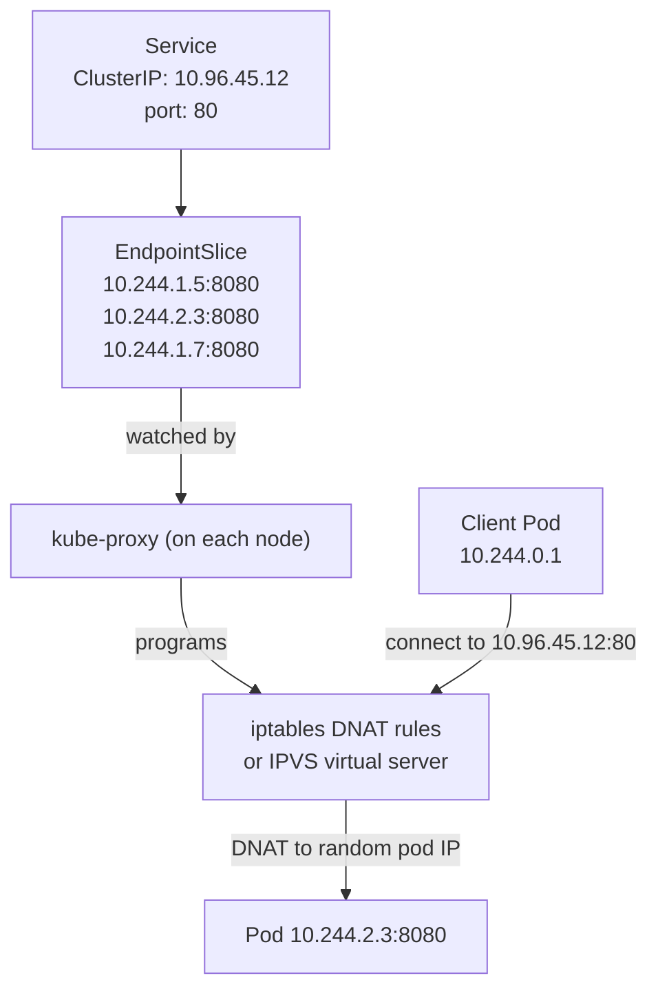
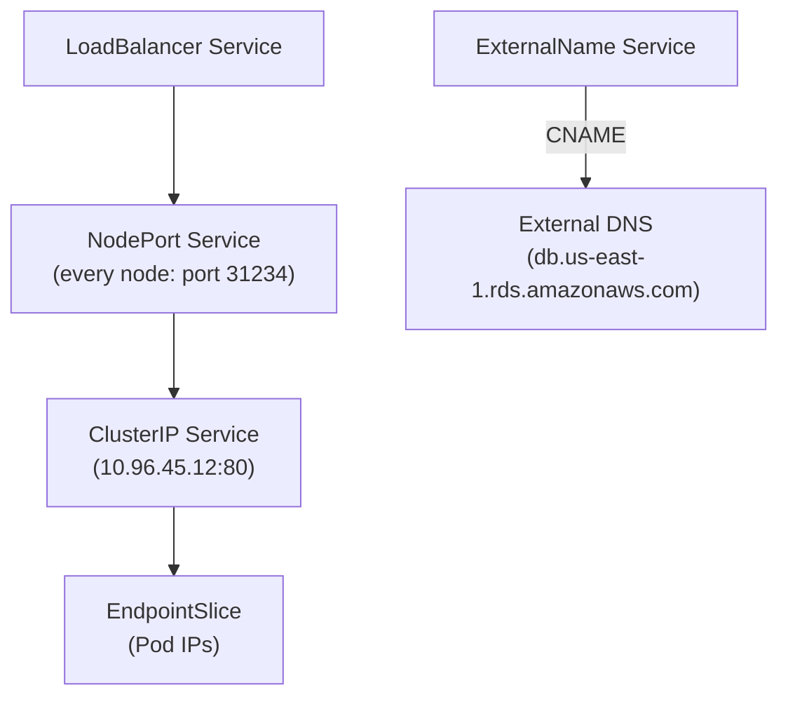

# 5 - Services, Endpoints, and kube-proxy

[toc]

> **TL;DR:** A Kubernetes Service is a stable virtual endpoint that load-balances traffic across a dynamic set of Pods. Pods come and go, but the Service's ClusterIP (and DNS name) never changes. Under the hood, kube-proxy programs iptables (or IPVS) rules on every node to DNAT packets from the virtual IP to a real Pod IP. Understanding Services means understanding the gap between "I want to reach this application" and "I have a physical socket to a container" — and the machinery that bridges it.

## Vocabulary

**Service**: A Kubernetes resource that defines a stable network endpoint (ClusterIP + port) for a set of Pods, selected by label. Has four types: ClusterIP, NodePort, LoadBalancer, and ExternalName.

---

**ClusterIP**: The virtual IP address assigned to a Service. Reachable only from within the cluster. Not assigned to any network interface — it exists only in iptables/IPVS rules.

---

**NodePort**: A Service type that additionally exposes a port on every cluster node (in the range 30000–32767). External traffic can reach the Service via `<NodeIP>:<NodePort>`. Builds on ClusterIP.

---

**LoadBalancer**: A Service type that provisions a cloud load balancer (via the cloud-controller-manager) pointing at the Service's NodePorts. The canonical way to expose a Service externally on a cloud provider.

---

**ExternalName**: A Service type that creates a CNAME DNS record pointing to an external hostname. No proxying, no ClusterIP — just DNS.

---

**Headless Service** (`clusterIP: None`): A Service with no virtual IP. DNS returns the IPs of all backing Pods directly. Used by StatefulSets and clients that do their own load balancing (e.g., databases, gRPC).

---

**Endpoints**: A Kubernetes resource automatically created and managed alongside a Service. Lists the Pod IP+port pairs that are currently `Ready` and matched by the Service selector.

---

**EndpointSlice**: The scalable replacement for Endpoints (since Kubernetes 1.21). Splits endpoint data into shards of up to 100 entries, reducing API server and etcd write load at large scale. kube-proxy reads EndpointSlices by default.

---

**kube-proxy**: The per-node daemon that watches Services and EndpointSlices and programs the kernel's packet-processing rules to implement Service virtual IPs.

---

**iptables mode**: kube-proxy's default mode. Programs `netfilter` chains — `KUBE-SERVICES`, `KUBE-SVC-*`, `KUBE-SEP-*` — to DNAT Service IPs to Pod IPs using probability-based random selection.

---

**IPVS mode**: kube-proxy's alternative mode. Uses the kernel's IP Virtual Server (L4 load balancer built into the Linux kernel). O(1) lookup (hash table) vs iptables' O(n) linear traversal. Superior at scale (>1000 Services).

---

**DNAT (Destination Network Address Translation)**: Changing the destination IP of a packet as it passes through the kernel's netfilter. How iptables/IPVS redirect traffic from ClusterIP to Pod IP.

---

**Session affinity**: A Service option (`service.spec.sessionAffinity: ClientIP`) that routes all requests from the same source IP to the same Pod, implemented via iptables recent-match module or IPVS persistence.

---

## Intuition

The core problem: Pods are ephemeral. Their IPs change on restart, on reschedule, on rolling update. You cannot hardcode a Pod IP in your application. You need a stable address that points to "whichever Pods are currently healthy and ready to serve."

A Kubernetes Service is a layer of indirection that provides that stable address. Think of it like DNS + a load balancer built into the kernel of every node. The Service has a fixed ClusterIP (set at creation, never changes). Every node in the cluster runs kube-proxy, which has programmed the kernel so that packets destined for that ClusterIP are DNAT'd to one of the live Pod IPs. The selection happens in the kernel at line rate — no extra hop, no sidecar proxy, no userspace round-trip.

The DNS piece: `kube-dns` (CoreDNS) creates an A record for every ClusterIP Service at `<service>.<namespace>.svc.cluster.local`. Pods resolve this hostname via `/etc/resolv.conf`, which is configured by the kubelet to point at the CoreDNS Service IP. So the actual request path is: your app calls `db.production.svc.cluster.local:5432` → DNS lookup → ClusterIP 10.96.45.12 → iptables DNAT → Pod IP 10.244.3.7:5432.

## How it Works

### Service Creation and Endpoint Reconciliation

When you create a Service with a `selector`, the Endpoints controller (inside kube-controller-manager) watches Pods matching that selector. For each Pod that is `Ready` (readiness probe passing), it adds the Pod's IP and port to the Service's EndpointSlice. When Pods become unready or are deleted, they are removed from the EndpointSlice. This is the lifecycle that ensures traffic is only ever sent to healthy Pods.

kube-proxy on each node watches EndpointSlices. When the slice changes (a Pod is added or removed), kube-proxy updates the kernel rules. The latency of this propagation — from Pod death to removal from all iptables rules across all nodes — is typically 1–5 seconds in healthy clusters and is the main source of briefly dropped connections during Pod termination.



### iptables Mode Deep Dive

In iptables mode, kube-proxy creates a hierarchy of chains for each Service. When a packet arrives at `OUTPUT` or `PREROUTING`, it traverses:

1. `KUBE-SERVICES` — matches the destination IP against all known ClusterIPs. On match, jumps to the Service-specific chain.
2. `KUBE-SVC-<hash>` — probabilistic load balancing. With 3 backends, the first rule matches with probability 1/3, the second with probability 1/2 (of remaining), the third always. This gives equal distribution.
3. `KUBE-SEP-<hash>` — the individual endpoint rule. Sets the DNAT target to a specific Pod IP:port.

The result: the packet's destination is rewritten in the kernel's `conntrack` table, and the connection proceeds to the Pod. The kernel's conntrack ensures that subsequent packets in the same connection hit the same DNAT target (connection persistence).

> [!NOTE]
> iptables rules are programmed as a flat list and traversed linearly. For a cluster with 1000 Services and 10 Pods each, a packet may traverse 10,000 iptables rules before reaching its destination. This O(n) lookup is the primary scalability argument for IPVS mode, which uses a kernel hash table for O(1) lookups.

### IPVS Mode

IPVS mode replaces the iptables chains with virtual servers in the kernel's `ipvs` subsystem. Each Service ClusterIP:port becomes an IPVS virtual server entry; each Pod IP:port is an IPVS real server. The lookup is O(1) via a hash table. IPVS also provides richer load balancing algorithms: round-robin (default), least-connection, source hashing, weighted round-robin.

Enable IPVS mode with `--proxy-mode=ipvs` on kube-proxy and ensure the `ip_vs` kernel modules are loaded. The output of `ipvsadm -Ln` shows the virtual servers and real servers.

### Service Types

**ClusterIP** (default): Only accessible from within the cluster. The base type all others build on.

**NodePort**: Adds a port on every node's external IP. The cloud load balancer type (below) builds on this by pointing the cloud LB at `<NodeIP>:<NodePort>` on all nodes. Direct NodePort usage (without a cloud LB) is common in bare-metal clusters.

**LoadBalancer**: Triggers the cloud-controller-manager to provision a cloud load balancer. The CCM sets `status.loadBalancer.ingress.ip` on the Service once the LB is provisioned. On AWS, this creates an ELB/NLB; on GCP, a regional forwarding rule; on Azure, an Azure Load Balancer.

**ExternalName**: Creates a CNAME DNS alias. Useful for pointing a Service name at an external resource like an RDS database hostname, so you can change the external resource without updating all application configs.



### Headless Services

A headless Service (`clusterIP: None`) has no virtual IP and no kube-proxy rules. DNS for a headless Service returns A records for all ready Pod IPs directly. Clients receive the full list and perform their own selection. This is essential for:

- **StatefulSets** — each Pod needs an individually addressable DNS name (`redis-0.redis.default.svc.cluster.local`).
- **gRPC** — gRPC uses HTTP/2 multiplexing over a single connection; a ClusterIP hides individual Pod addresses and breaks gRPC's own load balancing. A headless Service + client-side load balancing works correctly.
- **Database drivers** — some JDBC drivers and MongoDB drivers accept a list of host IPs and manage their own connection pool.

## Real-world Example

Exposing a web application with a ClusterIP Service internally and a LoadBalancer Service externally, then using `kubectl` to inspect the plumbing.

```yaml
---
# Internal ClusterIP service for pod-to-pod communication
apiVersion: v1
kind: Service
metadata:
  name: api-server-internal
  namespace: production
spec:
  type: ClusterIP
  selector:
    app: api-server
  ports:
    - name: http
      port: 80
      targetPort: 8080      # the containerPort in the Pod
      protocol: TCP
---
# External LoadBalancer service
apiVersion: v1
kind: Service
metadata:
  name: api-server-external
  namespace: production
  annotations:
    # AWS NLB instead of classic ELB (better performance)
    service.beta.kubernetes.io/aws-load-balancer-type: "nlb"
spec:
  type: LoadBalancer
  selector:
    app: api-server
  ports:
    - name: https
      port: 443
      targetPort: 8080
      protocol: TCP
  externalTrafficPolicy: Local  # preserve client source IP; only route to local Pods
```

```bash
#!/usr/bin/env bash
set -euo pipefail

# Inspect the Service and its endpoints
kubectl get service api-server-internal -n production
# NAME                   TYPE        CLUSTER-IP      EXTERNAL-IP   PORT(S)   AGE
# api-server-internal    ClusterIP   10.96.45.12     <none>        80/TCP    5d

kubectl get endpointslices -l kubernetes.io/service-name=api-server-internal -n production
# NAME                             ADDRESSTYPE   PORTS   ENDPOINTS
# api-server-internal-abc12        IPv4          8080    10.244.1.5,10.244.2.3,10.244.1.7

# Inspect iptables rules for this Service (run on a node)
# CLUSTER_IP=10.96.45.12
# iptables -t nat -S | grep "${CLUSTER_IP}"
# -A KUBE-SERVICES -d 10.96.45.12/32 -p tcp --dport 80 -j KUBE-SVC-ABCDEF12

# Or in IPVS mode:
# ipvsadm -Ln | grep -A 5 "10.96.45.12:80"
# TCP  10.96.45.12:80 rr
#   -> 10.244.1.5:8080     Masq    1      0          0
#   -> 10.244.2.3:8080     Masq    1      0          0
#   -> 10.244.1.7:8080     Masq    1      0          0

# DNS resolution from inside a Pod
kubectl run -it --rm debug --image=busybox:1.36 --restart=Never -- \
  nslookup api-server-internal.production.svc.cluster.local
# Server:    10.96.0.10
# Address 1: 10.96.0.10 kube-dns.kube-system.svc.cluster.local
# Name:      api-server-internal.production.svc.cluster.local
# Address 1: 10.96.45.12 api-server-internal.production.svc.cluster.local
```

> [!TIP]
> Use `kubectl port-forward service/<name> <local-port>:<service-port>` to access a ClusterIP Service from your laptop without creating a NodePort or LoadBalancer. This establishes a tunneled connection via the API server and is invaluable for debugging internal services.

## In Practice

**EndpointSlice scalability:** The original Endpoints resource was a single object containing all Pod IPs for a Service. At 1000 Pods, this is a 1000-IP Endpoints object that gets rewritten every time any Pod changes. EndpointSlices shard this into chunks of 100, so a Pod change updates only one slice — reducing API server write load by 10x.

**`externalTrafficPolicy: Local`:** When a LoadBalancer service routes to Pods, it can DNAT to any Pod on any node (the default `Cluster` policy). This hides the original client IP (SNAT is applied on the receiving node). `Local` policy routes only to Pods on the same node as the incoming traffic, preserving the client IP but creating unequal load distribution if Pods are not evenly spread. Use `Local` when you need the source IP for rate limiting or logging, and pair it with topology-aware hints or `topologySpreadConstraints` to keep Pods distributed.

**Connection draining on Pod termination:** When a Pod is being terminated, the Endpoints controller removes it from the EndpointSlice, kube-proxy updates iptables, but in-flight TCP connections are not reset — they continue until they close naturally or time out. New connections will not be sent to the terminating Pod, but existing connections remain open. Set `terminationGracePeriodSeconds` high enough to drain these connections.

> [!WARNING]
> **Kubernetes Services do not understand HTTP.** ClusterIP Services are TCP/UDP load balancers. They do not read HTTP headers, do not do path-based routing, and do not terminate TLS. For HTTP-aware routing (host-based, path-based, TLS termination), you need an Ingress controller or the Gateway API — covered in [6 - Ingress, Gateway API, and Service Mesh](./6-ingress-gateway-api-and-service-mesh.md).

## Pitfalls

- **"ClusterIPs are real IP addresses on a network interface."** — ClusterIPs are virtual. No network interface has the ClusterIP assigned. They exist only as iptables/IPVS rules. You cannot ping a ClusterIP from outside the cluster; you cannot `tcpdump` traffic on a ClusterIP address. What you can tcpdump is the DNAT'd traffic on the actual Pod IP.
- **"Services provide health checking."** — Services route to all Pods that are `Ready` (per the readiness probe). They do not perform their own health checking. If a Pod's readiness probe starts failing, the Endpoints controller removes it from the slice — but there is a 1–5 second propagation delay. During this window, some traffic will hit the unready Pod.
- **"Headless Services work like ClusterIP Services."** — Headless Services have no kube-proxy rules and no DNAT. The DNS record returns Pod IPs directly. If your client caches DNS or only resolves once on startup, it will not get the full current Pod list. Clients for headless Services must re-resolve DNS frequently or use a service discovery mechanism that watches the Endpoints API.
- **"NodePort is secure to expose directly to the internet."** — NodePort opens a port on every cluster node. There is no authentication, TLS, or rate limiting. Any host that can reach any node on that port can hit your Service. Use a cloud load balancer (LoadBalancer Service or Ingress) in front of it.
- **"Changing a Service's selector immediately redirects all traffic."** — Almost: the Endpoints controller will update the EndpointSlice within seconds, and kube-proxy will update iptables within a few more seconds. But in-flight connections are not interrupted. Plan for the overlap window during traffic migration.

## Exercises

### Exercise 1 — Conceptual: Why is the ClusterIP virtual?

Explain why Kubernetes Service ClusterIPs are not real IP addresses, and what the implication is for debugging.

#### Solution

A ClusterIP is a virtual IP that exists only in the iptables (or IPVS) rules programmed by kube-proxy on each node. No network interface is assigned this address. When a packet is sent to a ClusterIP, the kernel's netfilter intercepts it in the `OUTPUT` (locally generated) or `PREROUTING` (forwarded) hook, matches it against the KUBE-SERVICES chain, and rewrites the destination IP to a real Pod IP before the packet ever leaves the node. From the network's perspective, the ClusterIP address never appears on the wire — only Pod IPs do.

Implications for debugging:
- `ping <ClusterIP>` will time out from outside the cluster — no interface responds.
- `tcpdump -i eth0 dst 10.96.45.12` inside the cluster will show no packets — the DNAT happens before the packet hits the network interface.
- To trace traffic to a Service, capture on the Pod's interface using the Pod IP: `kubectl exec -it debug -- tcpdump -i eth0 dst 10.244.2.3`.
- To verify iptables rules: `iptables -t nat -L KUBE-SERVICES -n --line-numbers | grep 10.96.45.12`.

### Exercise 2 — YAML: Headless Service for gRPC

Write a headless Service for a gRPC backend named `payment-service` running on port 50051. Explain why a regular ClusterIP Service breaks gRPC load balancing.

#### Solution

```yaml
---
apiVersion: v1
kind: Service
metadata:
  name: payment-service
  namespace: production
  labels:
    app: payment-service
spec:
  clusterIP: None             # headless — no VIP
  selector:
    app: payment-service
  ports:
    - name: grpc
      port: 50051
      targetPort: 50051
      protocol: TCP
```

**Why ClusterIP breaks gRPC load balancing:**

gRPC uses HTTP/2, which multiplexes many RPCs over a single long-lived TCP connection. When a gRPC client connects to a ClusterIP, it establishes one TCP connection to whatever Pod the DNAT rule selected at the time of the `connect()` syscall. All subsequent RPCs on that connection go to the same Pod — iptables/IPVS only load-balances on new TCP connections, not on individual HTTP/2 streams.

Result: with 3 Pods behind a ClusterIP, one Pod receives all traffic from a given client, while the other two are idle from that client's perspective.

With a headless Service, DNS returns all 3 Pod IPs. The gRPC client library (e.g., `google.golang.org/grpc` with `grpc.WithDefaultServiceConfig`) receives all 3 addresses and can implement per-RPC round-robin load balancing by opening connections to each Pod and distributing individual RPC calls across all connections. This is the correct behavior.

### Exercise 3 — Debugging: Service Not Routing to Pods

You create a Service and Deployment. `kubectl get endpoints` shows the Service has no endpoints. Diagnose.

#### Solution

Empty endpoints means the Endpoints controller found no Pods matching the Service selector, or all matching Pods are not `Ready`.

**Step 1 — Check the selector match:**
```bash
kubectl describe service my-service -n production
# Selector: app=my-app,version=v1  <-- the service's label selector

kubectl get pods -l "app=my-app,version=v1" -n production
# If this returns nothing, the labels don't match
```

**Step 2 — Check Pod labels:**
```bash
kubectl get pods -n production --show-labels | grep my-app
# NAME              READY   STATUS    LABELS
# my-app-abc12      1/1     Running   app=my-app,tier=frontend
# The "version=v1" label is missing from the Pod template!
```

**Step 3 — Fix: update the Deployment's Pod template labels to match:**
```yaml
spec:
  template:
    metadata:
      labels:
        app: my-app
        version: v1    # add the missing label
```

**Step 4 — If labels match but endpoints are still empty, check Pod readiness:**
```bash
kubectl get pods -l app=my-app -n production
# NAME          READY   STATUS    RESTARTS
# my-app-abc12  0/1     Running   0   <-- 0/1 Ready means readiness probe failing
kubectl describe pod my-app-abc12 -n production | grep -A 5 "Readiness"
```

The Endpoints controller only includes Pods where all containers are `Ready`. A Pod that is `Running` but has a failing readiness probe is excluded from endpoints — by design.

### Exercise 4 — Design: Choosing the Right Service Type

For each scenario, choose the correct Service type and justify it:
1. An internal microservice API called only by other services in the cluster.
2. A public-facing HTTPS API on a managed cloud (GKE/EKS/AKS).
3. A PostgreSQL instance in the cluster that other apps should reach by DNS name.
4. An application that needs to resolve to `legacy-db.corp.example.com` (external hostname) using the Kubernetes DNS name `legacy-db`.

#### Solution

**1. Internal microservice → `ClusterIP` (default):** No external access needed. Other services resolve via DNS (`my-service.namespace.svc.cluster.local`). ClusterIP is the simplest, most secure option — no unnecessary exposure.

**2. Public HTTPS API on managed cloud → `LoadBalancer`:** The cloud-controller-manager provisions a cloud load balancer (NLB/ALB on AWS, Cloud Load Balancing on GCP). For HTTPS/TLS termination at layer 7 with path routing, pair it with an Ingress controller on top of the LoadBalancer (see note 6). The LoadBalancer Service handles the "getting traffic into the cluster" problem; Ingress handles the "routing by hostname/path" problem.

**3. PostgreSQL → `ClusterIP` (regular, not headless) for single-instance; `Headless` for multi-instance or read replicas:** For a single-replica StatefulSet, a regular ClusterIP Service pointing at `postgres-0` works fine — one backend, no load balancing needed. For a multi-replica setup with primary/replica distinction, use two Services: one `ClusterIP` pointing at the primary Pod label, one headless pointing at all replicas (for read scaling), so the application can distinguish writes from reads.

**4. External legacy database → `ExternalName`:**
```yaml
---
apiVersion: v1
kind: Service
metadata:
  name: legacy-db
  namespace: production
spec:
  type: ExternalName
  externalName: legacy-db.corp.example.com
```
Applications in the cluster resolve `legacy-db.production.svc.cluster.local` → CNAME → `legacy-db.corp.example.com`. When the external resource changes hostnames, update one Service object; all applications pick up the change automatically without a redeploy.

## Sources

- Kubernetes docs — Services. https://kubernetes.io/docs/concepts/services-networking/service/
- Kubernetes docs — EndpointSlices. https://kubernetes.io/docs/concepts/services-networking/endpoint-slices/
- Tim Hockin. *The Life of a Packet in Kubernetes* (KubeCon talk). https://www.youtube.com/watch?v=0Omvgd7Hg1I
- Lukša, M. *Kubernetes in Action*, 2nd ed. Chapter 11.
- Linux IPVS. https://www.kernel.org/doc/html/latest/networking/ipvs-sysctl.html

## Related

- [1 - What is Kubernetes](./1-what-is-kubernetes.md)
- [3 - The Data Plane (Nodes)](./3-the-data-plane-nodes.md)
- [4 - Pods and Workload Resources](./4-pods-and-workload-resources.md)
- [6 - Ingress, Gateway API, and Service Mesh](./6-ingress-gateway-api-and-service-mesh.md)
- [10 - Networking Deep Dive](./10-networking-deep-dive.md)
