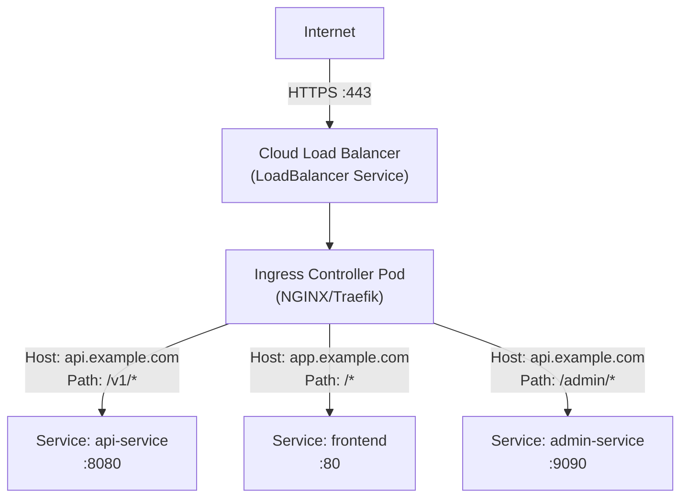
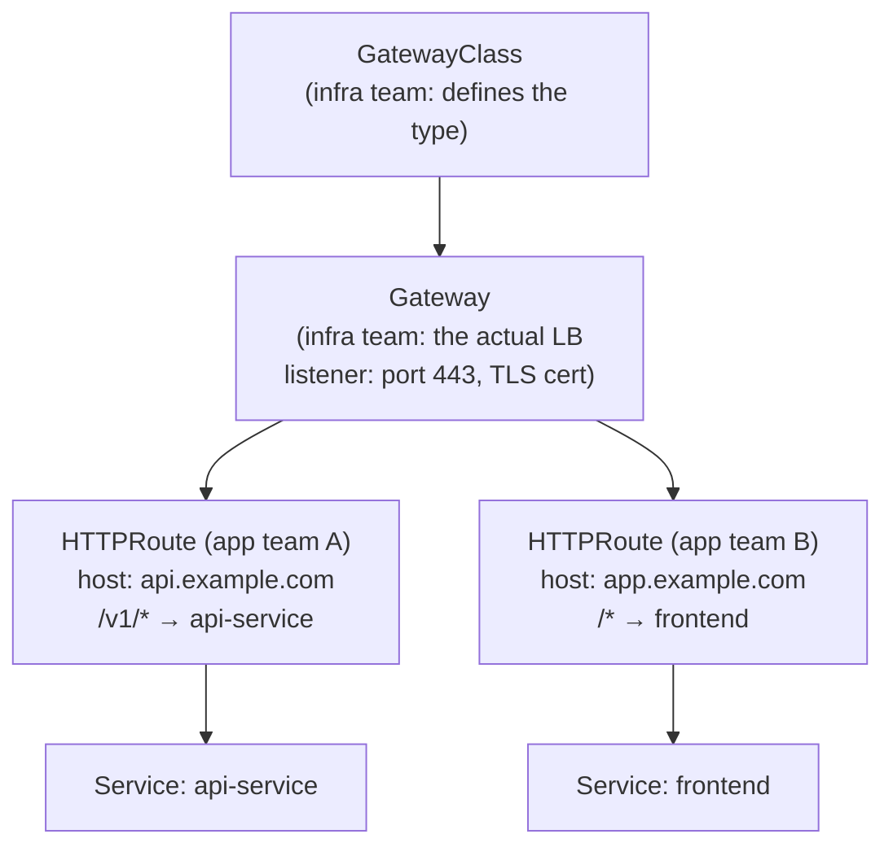
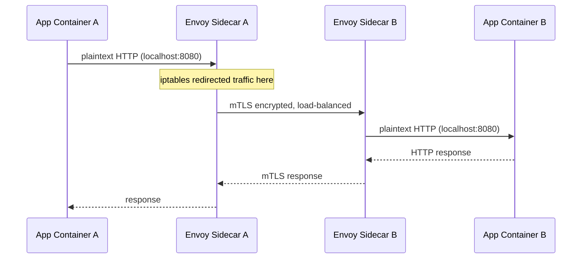

# 6 - Ingress, Gateway API, and Service Mesh

[toc]

> **TL;DR:** Kubernetes Services handle L4 (TCP/UDP) routing. To do HTTP-aware routing — host-based virtual hosting, path-based routing, TLS termination, header manipulation — you need Ingress or the newer Gateway API. Ingress is the legacy resource (one controller, one entrypoint); Gateway API is the modern replacement (explicit role separation between infrastructure and application teams, multi-gateway, multi-protocol). Service meshes (Istio, Linkerd) go a layer deeper: they provide mTLS, traffic shaping, observability, and circuit breaking for east-west (pod-to-pod) traffic, using sidecar or per-node proxies.

## Vocabulary

**Ingress**: A Kubernetes resource that defines HTTP(S) routing rules — host and path matching — from an external entry point to backend Services. Requires an Ingress controller to implement the rules.

---

**Ingress controller**: The actual reverse proxy (NGINX, Traefik, HAProxy, Envoy-based) that watches Ingress resources and implements the routing rules. Not part of Kubernetes core — you install one separately.

---

**TLS termination**: The process of decrypting HTTPS traffic at the proxy (Ingress controller or gateway) and forwarding plaintext HTTP to backend Pods. The TLS certificate lives in a Kubernetes Secret.

---

**Gateway API**: The successor to Ingress. A set of Kubernetes CRDs (`Gateway`, `HTTPRoute`, `GRPCRoute`, `TCPRoute`, etc.) with explicit role separation: infrastructure teams manage `Gateway` objects; app teams manage route objects. GA since Kubernetes 1.28.

---

**Gateway**: A Gateway API object that describes a load balancer — which listeners it exposes (ports, protocols, TLS config). Managed by infrastructure/platform teams.

---

**HTTPRoute**: A Gateway API object that defines HTTP routing rules (host matching, path matching, header matching, traffic splitting) attached to a Gateway. Managed by application teams.

---

**Service mesh**: An infrastructure layer that handles service-to-service (east-west) communication by injecting a sidecar proxy (or per-node proxy) into every Pod. Provides mTLS, retries, circuit breaking, observability (traces, metrics) transparently to the application.

---

**Istio**: The dominant service mesh. Uses Envoy as its per-pod sidecar data plane; `istiod` is the control plane. Supports traffic management (VirtualService, DestinationRule), security (PeerAuthentication, AuthorizationPolicy), and observability.

---

**Linkerd**: A lightweight service mesh written in Rust. Lower resource overhead than Istio; simpler model. Uses its own micro-proxy. Does not support as many advanced traffic management features.

---

**mTLS (mutual TLS)**: Both parties in a connection present certificates and verify each other. The mesh control plane issues short-lived certificates to each sidecar proxy, enabling zero-trust encryption for all pod-to-pod traffic without application code changes.

---

**Envoy**: The high-performance proxy used by Istio (and Contour, and the Kubernetes Gateway API's reference implementation). An xDS (extensible Discovery Service) client — its routing config is pushed dynamically from the control plane rather than read from a file.

---

**cert-manager**: A popular Kubernetes addon that automates TLS certificate issuance and renewal from ACME providers (Let's Encrypt), Vault, and others. Integrates with Ingress and Gateway API via annotations or CertificateRequest resources.

---

## Intuition

Imagine your cluster as a building. Services are the internal phone directory — they let people inside the building reach each other. Ingress is the reception desk — it decides which external visitors get to enter, and which room they are directed to, based on what they asked for. The Gateway API is a redesigned, multi-reception-desk version of that: one desk per wing, each managed by a different team, all routing to the right rooms.

Service meshes are different in character. They are less about "who can enter from outside" and more about "what happens when rooms talk to each other inside." The mesh wraps every room with a trusted intermediary that encrypts the conversation, tracks who called whom, retries failed calls, and cuts off rooms that are misbehaving. The application in the room does not know the mesh is there — it thinks it is talking directly to the next room.

The two concerns are complementary: you typically want both Ingress/Gateway (north-south, external traffic) and a service mesh (east-west, internal traffic) in a mature production cluster.

## How it Works

### Ingress

An Ingress controller is a Deployment (or DaemonSet) running a reverse proxy (NGINX, Traefik, etc.) that watches Ingress objects and dynamically reconfigures itself. The controller is installed once per cluster (or per namespace); Ingress objects are created by application teams.

An Ingress resource defines host-based and path-based routing. The controller listens on ports 80/443, inspects the incoming HTTP request's `Host` header and URL path, and proxies the request to the appropriate backend Service.



The Ingress controller itself is exposed via a `LoadBalancer` Service (or `NodePort` on bare metal). The Ingress resource just defines routing rules; traffic still arrives via the Service abstraction.

### The Gateway API

The Ingress API has well-documented limitations: no traffic splitting by weight, no header-based routing, no cross-namespace routing, and all advanced features are expressed as non-standard annotations that differ per controller (e.g., `nginx.ingress.kubernetes.io/rewrite-target`). The Gateway API was designed from scratch to address all of these.

Gateway API separates concerns with three personas:

- **Infrastructure provider / cluster operator**: installs a `GatewayClass` (declares a type of gateway and which controller implements it) and creates `Gateway` objects (a specific load balancer instance with listeners).
- **Application developer**: creates `HTTPRoute`, `GRPCRoute`, `TCPRoute` objects attached to the Gateway, defining routing rules for their service.

This separation means an application team can update their routing rules without touching the Gateway (which requires cluster-admin access). Cross-namespace routing is natively supported.



### TLS Termination

For Ingress, TLS is configured by referencing a Secret of type `kubernetes.io/tls` in the Ingress spec. The Ingress controller loads the cert and key from the Secret and terminates TLS. cert-manager watches `Certificate` CRDs and renews certs automatically before expiry, updating the Secret.

For Gateway API, TLS is configured on the `Gateway` listener directly, referencing a `ReferenceGrant`-controlled Secret (preventing cross-namespace secret theft).

### Service Mesh Architecture

A service mesh intercepts all TCP traffic between Pods by inserting a sidecar proxy into each Pod's network namespace. The sidecar (Envoy in Istio's case) is co-injected via a mutating admission webhook: when a Pod is created in a mesh-enabled namespace, the webhook adds the `istio-proxy` container and an `init` container that sets `iptables` rules to redirect all inbound and outbound traffic to the proxy's port (15001 outbound, 15006 inbound).

The application thinks it is connecting directly to the destination service. The traffic is actually intercepted by the local sidecar, encrypted with mTLS using a certificate issued by `istiod`, forwarded to the destination node, and decrypted by the destination sidecar before being delivered to the destination container.



The control plane (`istiod`) pushes routing config, certificate updates, and policy to all Envoy sidecars via the xDS API (Envoy's standard dynamic config protocol). Application operators use `VirtualService` (traffic routing rules) and `DestinationRule` (load balancing, circuit breaking, mTLS mode) CRDs to configure behavior.

## Real-world Example

A complete Ingress setup with cert-manager TLS, and a Gateway API equivalent.

```yaml
---
# Ingress (legacy) with NGINX controller and cert-manager
apiVersion: networking.k8s.io/v1
kind: Ingress
metadata:
  name: api-ingress
  namespace: production
  annotations:
    nginx.ingress.kubernetes.io/rewrite-target: /
    nginx.ingress.kubernetes.io/ssl-redirect: "true"
    cert-manager.io/cluster-issuer: letsencrypt-prod
spec:
  ingressClassName: nginx
  tls:
    - hosts:
        - api.example.com
      secretName: api-tls-cert     # cert-manager populates this Secret
  rules:
    - host: api.example.com
      http:
        paths:
          - path: /v1
            pathType: Prefix
            backend:
              service:
                name: api-service
                port:
                  number: 80
          - path: /v2
            pathType: Prefix
            backend:
              service:
                name: api-service-v2
                port:
                  number: 80
```

```yaml
---
# Gateway API equivalent — same routing, better expressed
apiVersion: gateway.networking.k8s.io/v1
kind: Gateway
metadata:
  name: prod-gateway
  namespace: infra
spec:
  gatewayClassName: nginx          # references the GatewayClass
  listeners:
    - name: https
      port: 443
      protocol: HTTPS
      tls:
        mode: Terminate
        certificateRefs:
          - kind: Secret
            name: api-tls-cert
            namespace: production
---
apiVersion: gateway.networking.k8s.io/v1
kind: HTTPRoute
metadata:
  name: api-routes
  namespace: production            # app team manages this, not infra
spec:
  parentRefs:
    - name: prod-gateway
      namespace: infra
  hostnames:
    - api.example.com
  rules:
    - matches:
        - path:
            type: PathPrefix
            value: /v1
      backendRefs:
        - name: api-service
          port: 80
          weight: 100
    - matches:
        - path:
            type: PathPrefix
            value: /v2
      backendRefs:
        - name: api-service-v2
          port: 80
          weight: 100
```

```bash
#!/usr/bin/env bash
set -euo pipefail

# Check Ingress status (External IP assigned by the Ingress controller's LoadBalancer Service)
kubectl get ingress api-ingress -n production
# NAME          CLASS   HOSTS              ADDRESS          PORTS     AGE
# api-ingress   nginx   api.example.com    34.90.12.34      80, 443   2d

# Check that cert-manager issued the certificate
kubectl get certificate api-tls-cert -n production
# NAME           READY   SECRET         AGE
# api-tls-cert   True    api-tls-cert   2d

# Check Gateway API route status
kubectl get httproute api-routes -n production -o yaml | grep -A 10 "status:"
# status:
#   parents:
#   - conditions:
#     - type: Accepted
#       status: "True"
```

> [!TIP]
> Use `kubectl describe ingress <name>` to see events from the Ingress controller. `404 No backend found` means either no matching Ingress rule or the backend Service doesn't exist. `503 Service Unavailable` from the controller usually means the backend Service has no ready Endpoints.

## In Practice

**When to use a service mesh:** A mesh makes sense when you have multiple services communicating over the network and need: (1) automatic mTLS between all services (zero-trust), (2) standardized distributed tracing without code changes, (3) fine-grained traffic policies (canary releases at the proxy level, circuit breakers, fault injection for chaos testing). The cost is real: Istio's Envoy sidecar consumes ~50–100 MB per Pod and adds 1–3ms latency per hop. For a cluster with 10 services and 50 Pods, the overhead is acceptable. For 10,000 Pods, it's 500–1000 GB of extra sidecar memory — significant.

**Ingress controller selection:** NGINX Ingress Controller is the most widely deployed and best-documented. Traefik is popular for its auto-discovery and built-in Let's Encrypt support. Contour (Envoy-based) and Kong (API gateway features) serve specialized needs. All major cloud providers offer managed Ingress controllers (GKE's GCE Ingress, AWS ALB Ingress Controller) that provision cloud-native load balancers.

**Gateway API maturity:** As of Kubernetes 1.28, the core Gateway, HTTPRoute, and TLSRoute resources are GA. GRPCRoute is Beta. Most major controllers (NGINX Gateway Fabric, Envoy Gateway, Istio) now support Gateway API. For new clusters, prefer Gateway API over Ingress.

> [!CAUTION]
> **Exposing Kubernetes Services without authentication is a security incident.** A LoadBalancer Service with `externalTrafficPolicy: Cluster` exposes your backend to the public internet with no authentication layer. Always put an Ingress controller (with auth annotations) or an API gateway in front of any externally-accessible Service. Ingress controllers support rate limiting (`nginx.ingress.kubernetes.io/limit-rps`), OAuth2/OIDC (via oauth2-proxy), and basic auth out of the box.

## Pitfalls

- **"Ingress handles all protocols."** — Ingress only supports HTTP/HTTPS. For TCP or UDP services (databases, MQTT, custom binary protocols), use `LoadBalancer` Services or the Gateway API's `TCPRoute`/`UDPRoute` resources.
- **"Installing two Ingress controllers is harmless."** — If two controllers both have `--watch-all-namespaces` and no `ingressClassName`, they will both try to implement every Ingress object and fight each other. Always set `ingressClassName` on your Ingress resources to specify which controller should handle them.
- **"Service mesh handles everything Ingress does."** — Service meshes focus on east-west (pod-to-pod) traffic. They do handle north-south via an Istio Ingress Gateway or Gateway API integration, but this is a different component from the mesh itself. You typically still need a separate north-south gateway even with a service mesh.
- **"mTLS is automatic once the mesh is installed."** — Istio's default is `PERMISSIVE` mode — it accepts both plaintext and mTLS. To enforce mTLS, set `PeerAuthentication` to `STRICT` mode explicitly. Many teams install Istio and assume mTLS is enforced when it is not.
- **"Ingress path types don't matter."** — `pathType: Exact`, `Prefix`, and `ImplementationSpecific` have meaningfully different semantics. `Prefix` with `/api` matches `/api/users` and `/api/orders`. `Exact` with `/api` only matches the exact path `/api`. Using `ImplementationSpecific` means behavior varies by controller — avoid in portable manifests.

## Exercises

### Exercise 1 — Conceptual: Gateway API vs Ingress

List three concrete limitations of the Ingress API that the Gateway API solves. For each, give the specific Gateway API feature that addresses it.

#### Solution

**Limitation 1 — Advanced routing requires non-standard annotations.** NGINX Ingress uses `nginx.ingress.kubernetes.io/canary-weight: "20"` for canary deployments; Traefik uses completely different annotations for the same feature. Manifests are not portable across controllers.

**Gateway API solution:** `HTTPRoute` `backendRefs` supports `weight` natively:
```yaml
backendRefs:
  - name: api-service-stable
    port: 80
    weight: 80
  - name: api-service-canary
    port: 80
    weight: 20
```
This is the same YAML regardless of which controller implements it.

**Limitation 2 — No role separation.** Ingress is a single resource that conflates infrastructure concerns (TLS certificates, listening ports) with application concerns (path routing). Updating TLS configuration requires the same RBAC permissions as updating routing rules, preventing least-privilege access.

**Gateway API solution:** `Gateway` (infrastructure team's resource) and `HTTPRoute` (application team's resource) are separate objects with separate RBAC. The Gateway owner controls which namespaces can attach Routes; application teams manage their own Routes without touching the Gateway.

**Limitation 3 — No cross-namespace routing.** Ingress resources can only route to Services in the same namespace as the Ingress. A shared Ingress controller serving multiple namespaces requires one Ingress per namespace.

**Gateway API solution:** `HTTPRoute` can reference backend Services in other namespaces using `ReferenceGrant` objects:
```yaml
# In the backend namespace:
---
apiVersion: gateway.networking.k8s.io/v1beta1
kind: ReferenceGrant
metadata:
  name: allow-prod-gateway
  namespace: backend-ns
spec:
  from:
    - group: gateway.networking.k8s.io
      kind: HTTPRoute
      namespace: frontend-ns
  to:
    - group: ""
      kind: Service
```

### Exercise 2 — YAML: Ingress with Rate Limiting

Write an NGINX Ingress that routes `app.example.com` to a frontend Service and `api.example.com` to an API Service, with rate limiting of 100 requests/second per IP on the API paths and TLS termination using cert-manager.

#### Solution

```yaml
---
apiVersion: networking.k8s.io/v1
kind: Ingress
metadata:
  name: production-ingress
  namespace: production
  annotations:
    nginx.ingress.kubernetes.io/ssl-redirect: "true"
    cert-manager.io/cluster-issuer: letsencrypt-prod
    # Rate limiting on api paths
    nginx.ingress.kubernetes.io/limit-rps: "100"
    nginx.ingress.kubernetes.io/limit-connections: "20"
spec:
  ingressClassName: nginx
  tls:
    - hosts:
        - app.example.com
        - api.example.com
      secretName: production-tls
  rules:
    - host: app.example.com
      http:
        paths:
          - path: /
            pathType: Prefix
            backend:
              service:
                name: frontend
                port:
                  number: 80
    - host: api.example.com
      http:
        paths:
          - path: /
            pathType: Prefix
            backend:
              service:
                name: api-service
                port:
                  number: 8080
```

Note: NGINX Ingress rate limiting applies per Ingress object, so separating the API ingress into its own Ingress resource (with rate limiting annotations) and the frontend into another (without rate limiting) is cleaner than using a single Ingress with mixed annotation behavior.

### Exercise 3 — Design: When to Add a Service Mesh

Your company runs 8 microservices. The security team has requested: (1) all service-to-service traffic must be encrypted, (2) each service may only call the services it is explicitly authorized to call. The infra team estimates each Envoy sidecar will cost ~80MB RAM per Pod. You have 40 Pods total. Is Istio the right choice? What are the alternatives?

#### Solution

**Cost calculation:** 40 Pods × 80MB = 3.2 GB additional RAM cluster-wide. If your nodes have 32 GB each and you have 3+ nodes, this is ~3% RAM overhead — acceptable.

**Is Istio the right choice?** Probably yes for requirement (1). Istio in `STRICT` mTLS mode encrypts all service-to-service traffic automatically, without application code changes. The `PeerAuthentication` CRD enforces this per namespace.

For requirement (2) (service-to-service authorization), the choice is between:

- **Istio `AuthorizationPolicy`:** Enforces which source services can call which destination services at the proxy level, based on mTLS identity (SPIFFE X.509 certificates). Very fine-grained.
- **Kubernetes `NetworkPolicy`:** Enforces which Pods can reach which Pods at the IP layer. Simpler, no sidecar overhead, but operates on IP/port, not on service identity. Cannot distinguish two services running on the same Pod IP.

**Alternative for encryption only without the mesh complexity:** Use the SPIFFE/SPIRE project to issue workload identity certificates and implement mTLS in application code. More work per service but zero proxy overhead.

**Linkerd as a lighter alternative:** Linkerd's Rust micro-proxy consumes ~20MB per Pod vs Envoy's 80MB. For 40 Pods, this saves 2.4 GB. Linkerd supports mTLS and `AuthorizationPolicy` (called `MeshTLSAuthentication` and `AuthorizationPolicy` in Linkerd v2.13+). The trade-off: fewer advanced traffic management features (no VirtualService-style traffic splitting at traffic percentages, no fault injection).

**Recommendation:** Start with Linkerd for the lower overhead, implement mTLS and per-service authorization policies. Evaluate Istio only if you need advanced traffic management (canary releases, circuit breaking, request-level metrics) that Linkerd cannot provide.

## Sources

- Kubernetes docs — Ingress. https://kubernetes.io/docs/concepts/services-networking/ingress/
- Kubernetes Gateway API documentation. https://gateway-api.sigs.k8s.io/
- Istio docs. https://istio.io/latest/docs/
- Linkerd docs. https://linkerd.io/docs/
- cert-manager docs. https://cert-manager.io/docs/
- Lukša, M. *Kubernetes in Action*, 2nd ed. Chapter 12 (Ingress).
- Hightower, K. et al. *Kubernetes: Up and Running*, 3rd ed. Chapter 8 (HTTP load balancing with Ingress).

## Related

- [5 - Services, Endpoints, and kube-proxy](./5-services-endpoints-and-kube-proxy.md)
- [9 - RBAC, Service Accounts, and Security](./9-rbac-service-accounts-and-security.md)
- [10 - Networking Deep Dive](./10-networking-deep-dive.md)
- [12 - Observability and Production Operations](./12-observability-and-production-operations.md)
