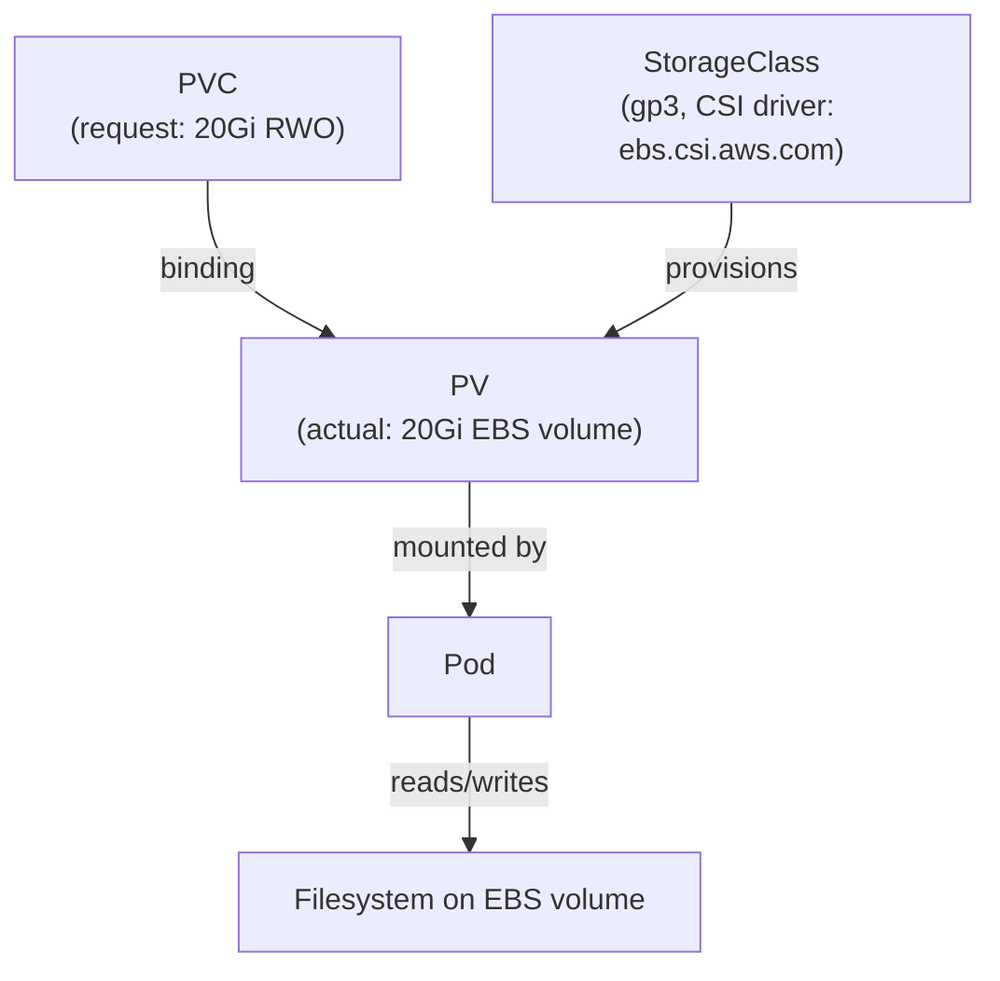
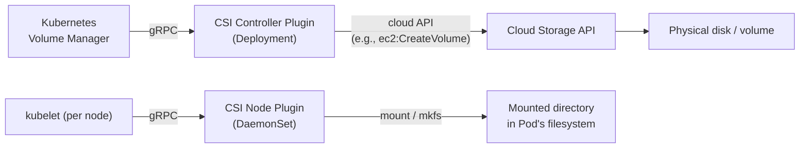

# 7 - Storage — Volumes, PV, PVC, CSI

[toc]

> **TL;DR:** Kubernetes storage is a three-layer abstraction: PersistentVolumes (PVs) represent actual storage capacity provisioned by an admin or dynamically by a StorageClass; PersistentVolumeClaims (PVCs) are a Pod's request for storage; and the CSI (Container Storage Interface) is the standard plugin API that connects Kubernetes to any storage backend. The goal is to decouple workload manifests from storage infrastructure — a Pod asks for "10Gi ReadWriteOnce" without knowing whether the underlying disk is an AWS EBS volume, a GCP Persistent Disk, or an NFS export.

## Vocabulary

**Volume**: A directory accessible to containers in a Pod. Tied to the Pod lifecycle by default — it exists as long as the Pod exists. Contrast with PersistentVolume, which outlives any individual Pod.

---

**PersistentVolume (PV)**: A cluster-scoped resource representing a piece of storage that has been provisioned. Analogous to a node — a pre-existing resource in the cluster.

---

**PersistentVolumeClaim (PVC)**: A namespace-scoped resource that is a request for storage. When bound to a PV, the claim owns that storage until deleted. Analogous to a Pod requesting a node.

---

**StorageClass**: Defines a "class" of storage (e.g., fast SSD, slow HDD, replicated NAS). Specifies which CSI driver to use and what parameters to pass (disk type, replication factor, encryption). The basis of dynamic provisioning.

---

**Dynamic provisioning**: Automatic creation of a PV in response to a PVC claim, using the StorageClass. Eliminates manual PV pre-provisioning. The CSI driver creates the actual storage object (EBS volume, Persistent Disk) and registers it as a PV.

---

**CSI (Container Storage Interface)**: The standard gRPC plugin API between Kubernetes and storage vendors. Decouples storage drivers from the Kubernetes release cycle. Every storage vendor (AWS EBS, GCP PD, NetApp, Portworx, Ceph) ships a CSI driver.

---

**Access modes**: How many nodes can mount a volume simultaneously.
- `ReadWriteOnce (RWO)`: One node at a time, read-write.
- `ReadOnlyMany (ROX)`: Many nodes simultaneously, read-only.
- `ReadWriteMany (RWX)`: Many nodes simultaneously, read-write (requires network filesystem like NFS or CephFS).
- `ReadWriteOncePod (RWOP)`: One Pod at a time (stricter than RWO, Kubernetes 1.22+).

---

**Volume binding mode**: `Immediate` (PV provisioned as soon as PVC is created) vs `WaitForFirstConsumer` (PV provisioned only when a Pod using the PVC is scheduled — enables topology-aware provisioning on the same zone as the Pod).

---

**Volume snapshot**: A point-in-time snapshot of a PV. Created via the `VolumeSnapshot` CRD (part of the CSI Snapshotter sidecar). Used for backups and cloning.

---

**emptyDir**: A simple ephemeral volume, created when a Pod starts and deleted when it terminates. Shared between containers in a Pod. Used for scratch space, inter-container communication, and caching.

---

**hostPath**: Mounts a directory from the host node's filesystem into a Pod. Powerful but dangerous — breaks Pod portability and creates security risk. Use only for node-level daemons (log collectors, CNI agents).

---

**configMap / secret volume**: Mounts a ConfigMap or Secret as a directory of files in the container. Each key becomes a filename; each value becomes the file content.

---

## Intuition

Think of the PV/PVC binding as a matchmaking system. On one side are PersistentVolumes: actual storage capacity registered in the cluster (either by an admin creating them manually, or by a StorageClass dynamically provisioning them). On the other side are PersistentVolumeClaims: requests from workloads specifying how much storage they need, what access mode, and optionally what StorageClass. The control plane matches PVCs to compatible PVs by capacity, access mode, and StorageClass — much like the scheduler matches Pods to nodes.

The CSI layer sits below all of this. When dynamic provisioning triggers, the CSI driver's Controller Plugin calls the cloud API (e.g., `aws ec2 create-volume`) to provision physical storage, then registers the volume as a PV. When a Pod is scheduled to a node, the CSI driver's Node Plugin calls the OS to attach the disk to the VM and mount it into the pod's filesystem. The Kubernetes volume manager orchestrates these calls in the right sequence: Provision → Attach → Mount, and in reverse on cleanup: Unmount → Detach → Delete.

## How it Works

### The PV/PVC Binding Lifecycle

Dynamic provisioning is the dominant pattern in cloud environments. The lifecycle:

1. You create a PVC referencing a StorageClass.
2. The PVC enters `Pending` state.
3. If `volumeBindingMode: Immediate`, the StorageClass's external-provisioner calls the CSI driver's `CreateVolume` RPC immediately. A PV is created and bound to the PVC. Both enter `Bound` state.
4. If `volumeBindingMode: WaitForFirstConsumer`, provisioning waits until a Pod using the PVC is scheduled to a node. This ensures the PV is created in the same availability zone as the scheduled node.
5. When a Pod uses the PVC, the volume manager triggers `ControllerPublishVolume` (attach the disk to the VM) and then `NodePublishVolume` (mount the volume into the container's filesystem).
6. On Pod deletion, `NodeUnpublishVolume` (unmount), `ControllerUnpublishVolume` (detach), and eventually `DeleteVolume` (if `reclaimPolicy: Delete`).



### CSI Architecture

The CSI plugin runs as two components:

**Controller Plugin** (runs as a Deployment, usually on control-plane): Handles volume provisioning, deletion, and cloud-level attachment (`CreateVolume`, `DeleteVolume`, `ControllerPublishVolume`). Talks to cloud APIs. Managed by the CSI external-provisioner, external-attacher, and external-snapshotter sidecar containers.

**Node Plugin** (runs as a DaemonSet, on every worker node): Handles volume mount/unmount on the node's OS (`NodePublishVolume`, `NodeUnpublishVolume`, `NodeStageVolume`). Runs with elevated privileges (needs to call `mount`, `mkfs`).



### Volume Types Reference

| Type | Lifecycle | Use case |
| :--- | :--- | :--- |
| `emptyDir` | Pod | Scratch space, inter-container IPC, cache |
| `hostPath` | Node | Node-level daemons only — log collector, device plugin |
| `configMap` | Pod (but data from etcd) | Config files, certificates, scripts |
| `secret` | Pod (but data from etcd) | Credentials, API keys (keep encrypted at rest) |
| `persistentVolumeClaim` | Independent of Pod | Databases, stateful apps requiring durable storage |
| `projected` | Pod | Combines serviceAccountToken + configMap + secret into one mount point |
| `nfs` | Independent | Shared filesystem (RWX), legacy support |
| `csi` | Independent | Any CSI-compatible storage backend |

### Reclaim Policy

When a PVC is deleted, the PV's `reclaimPolicy` determines what happens to the underlying storage:
- `Delete`: The PV and the underlying storage object (EBS volume, GCP PD) are deleted. Default for dynamically provisioned PVs.
- `Retain`: The PV remains; the underlying storage is preserved. Requires manual cleanup and re-binding. Use for important data where you want a safety net.
- `Recycle`: Deprecated. Do not use.

> [!CAUTION]
> `reclaimPolicy: Delete` will destroy your data when the PVC is deleted. In production, set `reclaimPolicy: Retain` on StorageClasses for databases and important stateful workloads. Recovering from an accidentally-deleted PVC with `Delete` policy requires restoring from backup — there is no undo.

## Real-world Example

Deploying a PostgreSQL instance with dynamic provisioning, verifying the PV/PVC binding, and taking a volume snapshot.

```yaml
---
# StorageClass using AWS EBS gp3
apiVersion: storage.k8s.io/v1
kind: StorageClass
metadata:
  name: ebs-gp3
provisioner: ebs.csi.aws.com
parameters:
  type: gp3
  iops: "3000"
  throughput: "125"
  encrypted: "true"
reclaimPolicy: Retain                 # keep the EBS volume if PVC is deleted
allowVolumeExpansion: true
volumeBindingMode: WaitForFirstConsumer
---
# PVC for PostgreSQL data
apiVersion: v1
kind: PersistentVolumeClaim
metadata:
  name: postgres-data
  namespace: production
spec:
  accessModes:
    - ReadWriteOnce
  resources:
    requests:
      storage: 50Gi
  storageClassName: ebs-gp3
---
# Pod using the PVC
apiVersion: v1
kind: Pod
metadata:
  name: postgres
  namespace: production
spec:
  containers:
    - name: postgres
      image: postgres:16-alpine
      env:
        - name: PGDATA
          value: /var/lib/postgresql/data/pgdata
        - name: POSTGRES_PASSWORD
          valueFrom:
            secretKeyRef:
              name: postgres-secret
              key: password
      volumeMounts:
        - name: data
          mountPath: /var/lib/postgresql/data
      resources:
        requests:
          cpu: 500m
          memory: 1Gi
        limits:
          memory: 2Gi
  volumes:
    - name: data
      persistentVolumeClaim:
        claimName: postgres-data
```

```bash
#!/usr/bin/env bash
set -euo pipefail

# Check PVC status (will be Pending until Pod is scheduled due to WaitForFirstConsumer)
kubectl get pvc postgres-data -n production
# NAME            STATUS    VOLUME   CAPACITY   ACCESS MODES   STORAGECLASS   AGE
# postgres-data   Pending                                      ebs-gp3        10s

# After Pod is scheduled, PV is provisioned:
kubectl get pvc postgres-data -n production
# NAME            STATUS   VOLUME                                     CAPACITY   ACCESS MODES
# postgres-data   Bound    pvc-a3f7bc12-8d9e-4f3c-b012-1234abcd5678   50Gi       RWO

# Inspect the PV
kubectl get pv pvc-a3f7bc12-8d9e-4f3c-b012-1234abcd5678
# Shows the EBS volume ID in the spec.csi.volumeHandle field

# Expand the PVC (StorageClass must have allowVolumeExpansion: true)
kubectl patch pvc postgres-data -n production \
  --type='merge' \
  -p '{"spec":{"resources":{"requests":{"storage":"100Gi"}}}}'

# Take a volume snapshot
kubectl apply -f - <<'EOF'
---
apiVersion: snapshot.storage.k8s.io/v1
kind: VolumeSnapshot
metadata:
  name: postgres-snapshot-$(date +%Y%m%d)
  namespace: production
spec:
  volumeSnapshotClassName: csi-aws-vsc
  source:
    persistentVolumeClaimName: postgres-data
EOF
```

> [!TIP]
> Use `kubectl get volumesnapshot` and `kubectl get volumesnapshotcontent` to verify snapshot creation. The `VolumeSnapshotContent` is the cluster-scoped object representing the actual snapshot in the storage backend (equivalent to how PV relates to PVC).

## In Practice

**EBS multi-attach:** AWS EBS `gp3` volumes are `ReadWriteOnce` — one node at a time. For multi-node read-write (`ReadWriteMany`), you need a network filesystem: EFS on AWS (via the `efs.csi.aws.com` driver), GCP Filestore, Azure Files, or a self-managed NFS/CephFS cluster. `ReadWriteMany` workloads are uncommon in Kubernetes because stateless scaling is preferred over shared-filesystem scaling.

**Volume expansion:** Most cloud CSI drivers support online volume expansion — the disk grows while the Pod is running. Set `allowVolumeExpansion: true` on the StorageClass. The actual expansion happens in two steps: CSI controller resizes the cloud disk, then the kubelet resizes the filesystem (xfs_growfs or resize2fs) on the next mount.

**Volume snapshots for backup:** Volume snapshots are crash-consistent — they capture the storage at a point in time, but if the database was writing when the snapshot was taken, you may have partial writes. For application-consistent backups, quiesce the database first (e.g., `CHECKPOINT` in PostgreSQL) then take the snapshot. Velero's backup workflow does this correctly for PostgreSQL.

> [!WARNING]
> **`emptyDir` data is lost when the Pod is deleted.** It is not lost on container restarts (within the same Pod) — only on Pod deletion or eviction. Many developers use `emptyDir` as a cache and are surprised when a Pod eviction wipes the cache. This is the correct behavior but surprises people used to Docker volumes.

## Pitfalls

- **"A PVC is storage."** — A PVC is a *claim*. The actual storage is the PV (and the underlying disk). Deleting a PVC with `reclaimPolicy: Delete` deletes the PV and the disk. Deleting a PVC with `reclaimPolicy: Retain` leaves the disk intact but makes it unbound and unusable by new PVCs until manually re-bound.
- **"ReadWriteOnce means one Pod."** — RWO means one *node*. Multiple Pods on the same node can all mount an RWO volume. `ReadWriteOncePod (RWOP)` is the mode that restricts to one Pod.
- **"StorageClass default is always present."** — A cluster may have no default StorageClass, or multiple annotated as default. A PVC with no `storageClassName` field uses the default — but if there is no default or if two defaults exist, the PVC remains `Pending`. Check with `kubectl get storageclass` and look for the `(default)` annotation.
- **"Volume expansion always works live."** — Some CSI drivers require the Pod to be restarted for the filesystem resize to take effect, even if the block device is expanded. Check your driver's documentation. GCP PD CSI and AWS EBS CSI both support live online resizing for ext4 and xfs.

## Exercises

### Exercise 1 — Conceptual: PV vs PVC vs StorageClass

Explain the three-layer model in one paragraph. What does each layer own?

#### Solution

A **StorageClass** defines a *type* of storage: the CSI driver responsible for provisioning it, parameters for provisioning (disk type, IOPS, encryption), and reclaim policy. It is owned by the cluster administrator and represents a service offering.

A **PersistentVolume** represents a *specific piece of provisioned storage* — a specific 50Gi AWS EBS volume with a specific volume ID. It can be created manually (static provisioning) or automatically by the StorageClass's external-provisioner (dynamic provisioning). PVs are cluster-scoped (not namespaced) because the underlying storage exists independently of any namespace.

A **PersistentVolumeClaim** is a workload's *request* for storage. It specifies how much, which access mode, and optionally which StorageClass. The control plane binds the PVC to a compatible PV. PVCs are namespace-scoped — they belong to a specific namespace and can only be used by Pods in that namespace.

The three-layer model decouples the "what storage exists" concern (PV) from the "what storage does this workload need" concern (PVC), with the StorageClass as the bridge that enables dynamic provisioning on demand.

### Exercise 2 — YAML: Shared Configuration Volume

Two containers in a Pod need to share a scratch directory for inter-process communication. Write the Pod manifest using an `emptyDir` volume, and explain the lifecycle.

#### Solution

```yaml
---
apiVersion: v1
kind: Pod
metadata:
  name: shared-scratch
  namespace: default
spec:
  containers:
    - name: producer
      image: busybox:1.36
      command:
        - sh
        - -c
        - |
          while true; do
            echo "$(date)" > /scratch/timestamp.txt
            sleep 5
          done
      volumeMounts:
        - name: scratch
          mountPath: /scratch
    - name: consumer
      image: busybox:1.36
      command:
        - sh
        - -c
        - |
          while true; do
            cat /scratch/timestamp.txt 2>/dev/null || echo "no file yet"
            sleep 3
          done
      volumeMounts:
        - name: scratch
          mountPath: /scratch
  volumes:
    - name: scratch
      emptyDir: {}       # created fresh when Pod starts, deleted when Pod terminates
```

The `emptyDir` is created on the node when the Pod starts and both containers share the same `/scratch` directory. Writes from `producer` are immediately visible to `consumer` because they are reading and writing the same directory on the node's filesystem (backed by a tmpfs in memory, or node disk depending on the `emptyDir.medium` setting). If either container crashes and restarts, the volume persists for the Pod's lifetime. When the Pod is deleted or evicted, the volume and all its contents are permanently deleted.

### Exercise 3 — Design: Choosing Storage for a Stateful Application

You are deploying Apache Kafka on Kubernetes with 3 brokers, each requiring 200Gi of fast storage. Kafka partitions are replicated across brokers (replication factor 3) so individual broker disk loss is tolerable, but the disk must survive broker Pod restarts and rescheduling. What configuration do you use?

#### Solution

Use a StatefulSet with `volumeClaimTemplates` and a StorageClass using `WaitForFirstConsumer` binding mode.

Key requirements:
- **Per-broker storage**: Each broker needs its own PVC. `volumeClaimTemplates` in a StatefulSet creates `kafka-data-kafka-0`, `kafka-data-kafka-1`, `kafka-data-kafka-2` automatically.
- **Survive rescheduling**: PVCs are not deleted when a Pod is rescheduled — the StatefulSet Pod `kafka-0` will always rebind to `kafka-data-kafka-0` regardless of which node it lands on.
- **Zone awareness**: Use `volumeBindingMode: WaitForFirstConsumer` so the EBS/PD volume is created in the same AZ as the scheduled broker Pod. A broker rescheduled to a different AZ would fail to mount an EBS volume from a different AZ.
- **Fast storage**: Use a StorageClass backed by `gp3` (AWS) or `pd-ssd` (GCP) with high IOPS configuration for Kafka's sequential write pattern.
- **`reclaimPolicy: Retain`**: Losing 200Gi of Kafka data due to an accidental PVC deletion is painful even with replication. Retain is safer.

```yaml
volumeClaimTemplates:
  - metadata:
      name: kafka-data
    spec:
      accessModes:
        - ReadWriteOnce
      storageClassName: ebs-gp3-retain
      resources:
        requests:
          storage: 200Gi
```

## Sources

- Kubernetes docs — Persistent Volumes. https://kubernetes.io/docs/concepts/storage/persistent-volumes/
- Kubernetes docs — Storage Classes. https://kubernetes.io/docs/concepts/storage/storage-classes/
- CSI Specification. https://github.com/container-storage-interface/spec
- AWS EBS CSI Driver. https://github.com/kubernetes-sigs/aws-ebs-csi-driver
- Lukša, M. *Kubernetes in Action*, 2nd ed. Chapter 6 (Volumes), Chapter 7 (ConfigMaps and Secrets).
- Rosso, J. et al. *Production Kubernetes*. O'Reilly. Chapter 9 (Storage).

## Related

- [4 - Pods and Workload Resources](./4-pods-and-workload-resources.md)
- [8 - ConfigMaps, Secrets, and Configuration](./8-configmaps-secrets-and-configuration.md)
- [11 - Scheduling, Autoscaling, and Resource Management](./11-scheduling-autoscaling-and-resource-management.md)
