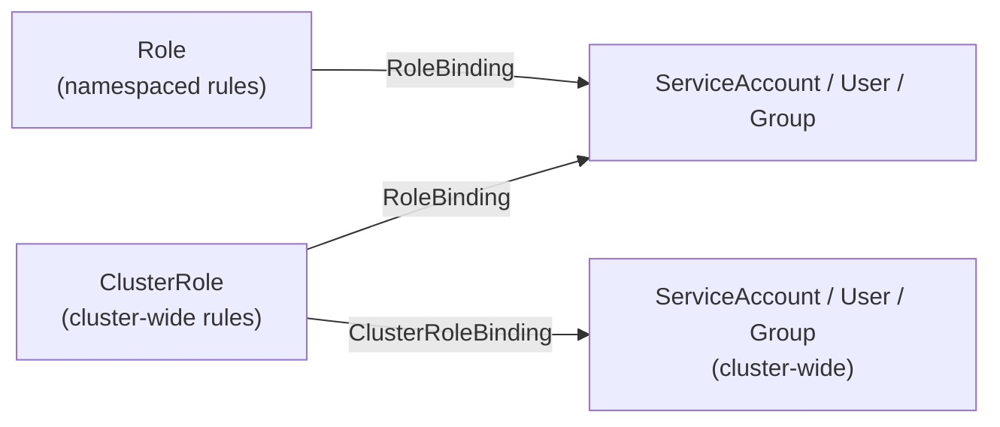
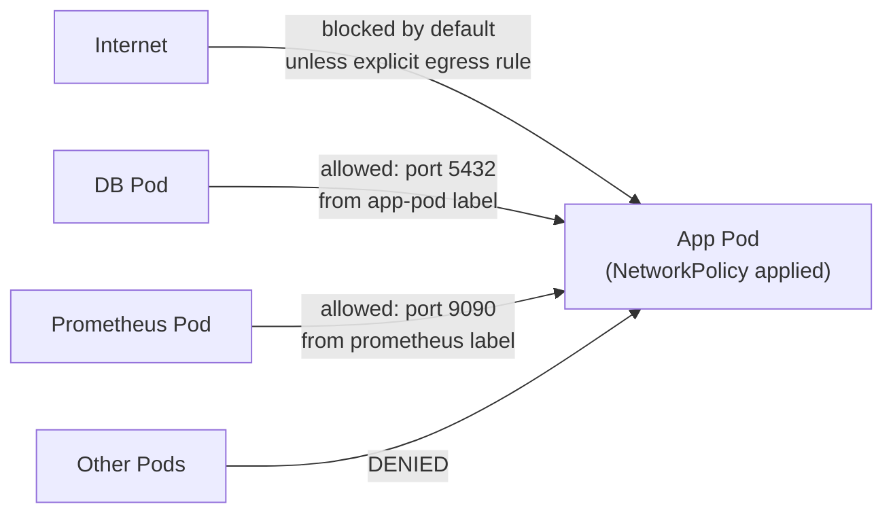

# 9 - RBAC, Service Accounts, and Security

[toc]

> **TL;DR:** Kubernetes RBAC (Role-Based Access Control) governs who can do what to which resources in the cluster. The model is: Subjects (users, groups, ServiceAccounts) bind to Roles (collections of API permissions) via RoleBindings. ServiceAccounts give Pod identities — a pod presenting its ServiceAccount token can authenticate to the API server and perform the actions its bound roles allow. Production security also requires Pod Security Standards (the replacement for deprecated PodSecurityPolicies) and NetworkPolicies to limit blast radius.

## Vocabulary

**RBAC**: Role-Based Access Control. The authorization mechanism in Kubernetes that grants API permissions based on identity-role bindings. Enabled by default since Kubernetes 1.8.

---

**Role**: A namespaced set of permission rules — specific API groups, resources, and verbs. Scoped to one namespace.

---

**ClusterRole**: A cluster-scoped set of permission rules. Can be used for cluster-scoped resources (Nodes, PersistentVolumes, Namespaces) or as a reusable template bound to specific namespaces.

---

**RoleBinding**: Binds a Role or ClusterRole to one or more subjects within a specific namespace.

---

**ClusterRoleBinding**: Binds a ClusterRole to subjects at the cluster level — the subjects get that ClusterRole's permissions in every namespace.

---

**Subject**: Who the binding grants permissions to. One of: `User` (external identity), `Group` (group of users), or `ServiceAccount` (pod identity).

---

**ServiceAccount**: A namespaced Kubernetes resource that provides an identity to Pods. The default ServiceAccount in each namespace has minimal permissions. Pods specify which ServiceAccount they use via `spec.serviceAccountName`.

---

**ServiceAccount token (projected token)**: A short-lived, audience-bound JWT token mounted into every Pod at `/var/run/secrets/kubernetes.io/serviceaccount/token`. The kubelet refreshes it automatically before expiry. Used to authenticate to the API server and to other services (Vault, AWS IRSA, GCP Workload Identity).

---

**Verb**: What action is permitted. The standard verbs: `get`, `list`, `watch`, `create`, `update`, `patch`, `delete`, `deletecollection`. Plus `exec`, `portforward`, `proxy` for subresources.

---

**Resource**: The API resource the verb applies to: `pods`, `deployments`, `secrets`, `configmaps`, `nodes`, etc. Resources can be further scoped by `resourceNames` (specific object names).

---

**API group**: Organizes resources. Core resources (pods, services, configmaps, secrets) use the empty string `""`. Extended resources use their API group (`apps`, `batch`, `networking.k8s.io`, etc.).

---

**Pod Security Standards (PSS)**: A built-in Kubernetes admission controller that enforces security profiles on Pods. Replaced PodSecurityPolicies (deprecated in 1.21, removed in 1.25). Three levels: `privileged` (no restrictions), `baseline` (prevents known privilege escalations), `restricted` (heavily restricted, best practice for most workloads).

---

**NetworkPolicy**: A Kubernetes resource that uses label selectors to define allow-rules for pod ingress and egress traffic. The default is allow-all; adding any NetworkPolicy switches the affected pods to deny-by-default for the matched direction.

---

**Audit log**: A record of all API server requests, including the subject, verb, resource, and outcome. Essential for security incident investigation.

---

## Intuition

Think of RBAC like a key system for an office building. Rooms are namespaces. Keys are Roles. The key cabinet that holds keys for the whole building is ClusterRoles. A RoleBinding is the act of handing a key to a person or a robot — you can give the "read secrets" key to a specific person in one wing (RoleBinding to a ServiceAccount in one namespace), or give the "read cluster health" key to someone who needs it everywhere (ClusterRoleBinding).

ServiceAccounts are the identities for robots (Pods). Every Pod in your cluster has an identity — by default, it is the `default` ServiceAccount of its namespace, which has minimal permissions. When you run a controller or an operator that needs to interact with the Kubernetes API, you create a dedicated ServiceAccount, grant it precisely the permissions it needs via a Role/RoleBinding, and tell the Pod to use it.

NetworkPolicy is the equivalent of firewalls between rooms. Without any NetworkPolicy, every room can talk to every other room. Once you add one NetworkPolicy to a pod, Kubernetes switches that pod to deny-all for the selected direction (ingress or egress) and only allows what you explicitly permit.

## How it Works

### RBAC Object Model

The four RBAC objects form two orthogonal axes: scope (namespace vs cluster) and what they represent (rules vs binding):



A ClusterRole can be bound via a RoleBinding to restrict it to one namespace — this is the recommended pattern for reusable roles (e.g., define `pod-reader` as a ClusterRole once, then bind it per-namespace via RoleBindings).

### Writing Roles

A Role is a list of policy rules. Each rule specifies `apiGroups`, `resources`, and `verbs`. The intersection of all three defines the permission.

The principle of least privilege applies: grant the minimum `verbs` on the minimum `resources` needed. Wildcards (`*`) are a security smell — they grant all current and future verbs/resources, including ones added in future Kubernetes versions.

> [!WARNING]
> **Wildcard RBAC rules are dangerous.** `verbs: ["*"]` on `resources: ["secrets"]` grants the ability to delete all secrets in the namespace — likely unintended for a read-only operator. Be explicit: `verbs: ["get", "list", "watch"]`. Avoid `resources: ["*"]` entirely; it grants access to new resource types without review.

### ServiceAccount Tokens and Workload Identity

Since Kubernetes 1.21, the default token type is a **projected service account token** — a short-lived JWT (default expiry: 1 hour, configurable) that is audience-bound and automatically rotated by the kubelet. This replaced the legacy long-lived tokens stored as Secrets.

The token is mounted at `/var/run/secrets/kubernetes.io/serviceaccount/token`. The controller that calls `kubernetes.io/service-account.name` gets a JWT with:
- `iss`: the API server's issuer URL (e.g., `https://kubernetes.default.svc`).
- `sub`: `system:serviceaccount:<namespace>:<name>`.
- `aud`: the intended audience (default: `["https://kubernetes.default.svc"]`).

Cloud providers use this token for workload identity: AWS IRSA, GCP Workload Identity Federation, and Azure Workload Identity all verify the Kubernetes-issued JWT via OIDC and exchange it for cloud credentials — no static cloud credentials stored in Secrets.

### Pod Security Standards

PSS is enforced by the `PodSecurity` admission controller. You configure it per namespace using the `pod-security.kubernetes.io/enforce` label:

- `privileged`: No restrictions. For system namespaces (`kube-system`).
- `baseline`: Prevents known privileged escalations: no `hostPID`, no `hostNetwork`, no `privileged: true`, no `hostPath` mounts to sensitive directories. Appropriate for most workloads.
- `restricted`: Requires `runAsNonRoot: true`, drops all capabilities (or only allows `NET_BIND_SERVICE`), requires `seccompProfile: RuntimeDefault`. The recommended level for all application workloads.

Three enforcement modes: `enforce` (rejects non-compliant Pods), `audit` (logs violations, allows Pods), `warn` (warns the user, allows Pods). Use `audit` and `warn` before `enforce` to identify non-compliant Pods.

### NetworkPolicy

A NetworkPolicy uses `podSelector` to select the Pods it applies to, and defines `ingress` and/or `egress` rules specifying what traffic is permitted. The key behavior: once any NetworkPolicy applies to a Pod for a direction, all traffic in that direction is denied unless explicitly permitted.



> [!NOTE]
> NetworkPolicy enforcement requires a CNI plugin that supports it. Flannel does NOT enforce NetworkPolicies. Calico, Cilium, Weave, and Antrea do. Applying NetworkPolicies to a cluster with Flannel has no effect — the rules exist in etcd but nothing enforces them.

## Real-world Example

Complete RBAC setup for an operator that needs to read Pods and write Deployments in a specific namespace, plus Pod Security Standards configuration.

```yaml
---
# Namespace with Pod Security Standards enforced
apiVersion: v1
kind: Namespace
metadata:
  name: production
  labels:
    pod-security.kubernetes.io/enforce: restricted
    pod-security.kubernetes.io/enforce-version: v1.30
    pod-security.kubernetes.io/audit: restricted
    pod-security.kubernetes.io/warn: restricted
---
# ServiceAccount for the operator
apiVersion: v1
kind: ServiceAccount
metadata:
  name: deployment-operator
  namespace: production
---
# Role: only what the operator actually needs
apiVersion: rbac.authorization.k8s.io/v1
kind: Role
metadata:
  name: deployment-manager
  namespace: production
rules:
  - apiGroups:
      - ""
    resources:
      - pods
    verbs:
      - get
      - list
      - watch
  - apiGroups:
      - apps
    resources:
      - deployments
    verbs:
      - get
      - list
      - watch
      - update
      - patch
  - apiGroups:
      - apps
    resources:
      - deployments/status
    verbs:
      - get
---
# RoleBinding: grant the role to the ServiceAccount
apiVersion: rbac.authorization.k8s.io/v1
kind: RoleBinding
metadata:
  name: deployment-manager-binding
  namespace: production
subjects:
  - kind: ServiceAccount
    name: deployment-operator
    namespace: production
roleRef:
  kind: Role
  name: deployment-manager
  apiGroup: rbac.authorization.k8s.io
---
# NetworkPolicy: only allow ingress to app pods from the ingress controller and prometheus
apiVersion: networking.k8s.io/v1
kind: NetworkPolicy
metadata:
  name: app-network-policy
  namespace: production
spec:
  podSelector:
    matchLabels:
      app: api-server
  policyTypes:
    - Ingress
    - Egress
  ingress:
    - from:
        - namespaceSelector:
            matchLabels:
              kubernetes.io/metadata.name: ingress-nginx
      ports:
        - protocol: TCP
          port: 8080
    - from:
        - namespaceSelector:
            matchLabels:
              kubernetes.io/metadata.name: monitoring
          podSelector:
            matchLabels:
              app: prometheus
      ports:
        - protocol: TCP
          port: 9090
  egress:
    - to:
        - podSelector:
            matchLabels:
              app: postgres
      ports:
        - protocol: TCP
          port: 5432
    - ports:                          # allow DNS resolution
        - protocol: UDP
          port: 53
        - protocol: TCP
          port: 53
```

```bash
#!/usr/bin/env bash
set -euo pipefail

# Check what a ServiceAccount can do (impersonation)
kubectl auth can-i get pods \
  --as=system:serviceaccount:production:deployment-operator \
  -n production
# yes

kubectl auth can-i delete secrets \
  --as=system:serviceaccount:production:deployment-operator \
  -n production
# no

# Check for RBAC rules that grant wildcard access (security audit)
kubectl get clusterrolebindings -o json | \
  jq '.items[] | select(.roleRef.name == "cluster-admin") | .subjects'

# Describe a ServiceAccount token (projected)
kubectl describe serviceaccount deployment-operator -n production

# Test Pod Security Standards (dry-run a privileged pod — should fail in restricted namespace)
kubectl run test-privileged \
  --image=nginx:latest \
  --overrides='{"spec":{"containers":[{"name":"test-privileged","image":"nginx","securityContext":{"privileged":true}}]}}' \
  --dry-run=server -n production
# Error from server: pods "test-privileged" is forbidden:
# violates PodSecurity "restricted:v1.30": privileged (container "test-privileged")
```

> [!TIP]
> Use `kubectl auth can-i --list --as=system:serviceaccount:<namespace>:<name>` to enumerate all permissions a ServiceAccount has. This is invaluable for auditing over-privileged operators and for debugging "permission denied" errors.

## In Practice

**Least-privilege for operators:** Third-party operators (cert-manager, ArgoCD, Prometheus operator) often request broad ClusterRoles. Audit their default RBAC manifests before installing. cert-manager needs ClusterRole access to create CertificateRequests cluster-wide but does NOT need to read Secrets in every namespace — review and restrict if your threat model warrants it.

**ServiceAccount token projection for cloud identity:** On AWS, annotate a ServiceAccount with `eks.amazonaws.com/role-arn: arn:aws:iam::123456789012:role/MyRole` and the EKS pod identity webhook injects an AWS-audience token. The Pod can then call AWS APIs without static credentials — the token is exchanged for temporary STS credentials. This is the IRSA (IAM Roles for Service Accounts) pattern and eliminates `aws_access_key_id` / `aws_secret_access_key` from Secrets entirely.

**Namespace isolation strategy for multi-tenancy:** A common production pattern: one namespace per team or application, with PSS `restricted` enforced, a namespace-scoped ResourceQuota (CPU/memory budget), LimitRange (default requests/limits), and NetworkPolicy denying cross-namespace traffic by default. Each team gets a ServiceAccount with a RoleBinding scoped to their namespace. Shared services (databases, monitoring) live in dedicated namespaces with NetworkPolicies that allow ingress from specific application namespaces.

> [!CAUTION]
> **The `default` ServiceAccount in each namespace has no special permissions by default, but applications that mount it can still reach the API server.** If an attacker compromises a Pod using the `default` ServiceAccount, they can query the API server for cluster topology information even with minimal permissions (`list pods`, `list nodes` via the `view` ClusterRole if it's bound). Disable ServiceAccount token automounting for Pods that don't need API access: `spec.automountServiceAccountToken: false`.

## Pitfalls

- **"ClusterRoleBinding to a ClusterRole = cluster-admin."** — A ClusterRoleBinding grants the ClusterRole's permissions cluster-wide, but only what that ClusterRole specifies. A ClusterRoleBinding to `view` ClusterRole gives read-only access to all namespaces. Only binding to the `cluster-admin` ClusterRole gives unrestricted access.
- **"Users are created in Kubernetes."** — Kubernetes has no user management. Users are external identities authenticated via certificates (client cert signed by the cluster CA), OIDC tokens (e.g., from Google Workspace, Okta), or webhook authentication. `kubectl config set-credentials` just configures how kubectl presents credentials to the API server; it does not create a Kubernetes user object.
- **"NetworkPolicy `podSelector: {}` selects no pods."** — An empty podSelector (`{}`) matches ALL pods in the namespace. A NetworkPolicy with `podSelector: {}` applies to every pod in the namespace. This is the standard pattern for a namespace-wide deny-all policy.
- **"PSP was removed; PSS is automatic."** — Pod Security Standards enforcement requires the `PodSecurity` admission controller to be enabled (it is, by default since 1.23) AND the namespace to be labeled with the desired level. Unlabeled namespaces get no enforcement — you must explicitly label each namespace.
- **"RBAC `list` permission is safe."** — `list` on secrets lists all secrets in the namespace, including their names. Combined with `get`, it allows reading all secret values. `list` alone without `get` still leaks secret names, which can be sensitive (e.g., `production-aws-root-credentials`).

## Exercises

### Exercise 1 — Conceptual: Role vs ClusterRole

When should you use a ClusterRole with a RoleBinding vs a Role with a RoleBinding? Give a concrete scenario for each.

#### Solution

**Use a Role (namespaced) when:** The permissions are genuinely scoped to one namespace, and you have no intention of reusing the exact same permission set in other namespaces. Example: a `db-migrator` ServiceAccount in the `production` namespace needs `create` and `list` on `jobs` and `pods` only in `production`. A namespaced Role keeps the definition co-located with the workload and avoids cluster-wide objects cluttering the ClusterRole list.

**Use a ClusterRole with a RoleBinding when:** You want to define a permission set once and reuse it across multiple namespaces via multiple RoleBindings. Example: a `pod-reader` ClusterRole that allows `get`, `list`, `watch` on `pods`. Define it once as a ClusterRole, then create RoleBindings in `dev`, `staging`, and `production` namespaces binding different ServiceAccounts to it. This avoids duplicating the Role definition in every namespace and makes updates to the permission set easier (change the ClusterRole, all bindings inherit the change).

**Use a ClusterRoleBinding only when:** The subject needs cluster-scoped permissions (access to Nodes, Namespaces, PersistentVolumes, ClusterRoles, etc.) or genuinely needs the same permissions in every namespace. Example: a cluster monitoring agent that needs to `list` and `watch` Nodes and all Pods across all namespaces. A ClusterRoleBinding to a ClusterRole granting `get/list/watch` on `nodes` and `pods` across all namespaces is appropriate.

### Exercise 2 — YAML: Least-Privilege ServiceAccount for a CI/CD Agent

Write the RBAC configuration for a CD agent (ArgoCD-style) that needs to create, update, and delete Deployments, Services, and ConfigMaps in the `staging` namespace, but should NOT be able to read or modify Secrets.

#### Solution

```yaml
---
apiVersion: v1
kind: ServiceAccount
metadata:
  name: cd-agent
  namespace: staging
  annotations:
    description: "CD agent for staging deployment automation"
---
apiVersion: rbac.authorization.k8s.io/v1
kind: Role
metadata:
  name: cd-agent-role
  namespace: staging
rules:
  - apiGroups:
      - apps
    resources:
      - deployments
      - replicasets
    verbs:
      - get
      - list
      - watch
      - create
      - update
      - patch
      - delete
  - apiGroups:
      - ""
    resources:
      - services
      - configmaps
    verbs:
      - get
      - list
      - watch
      - create
      - update
      - patch
      - delete
  - apiGroups:
      - ""
    resources:
      - pods
    verbs:
      - get
      - list
      - watch              # needed to verify rollout status
  # Explicitly NOT including secrets — no entry here = no access
---
apiVersion: rbac.authorization.k8s.io/v1
kind: RoleBinding
metadata:
  name: cd-agent-binding
  namespace: staging
subjects:
  - kind: ServiceAccount
    name: cd-agent
    namespace: staging
roleRef:
  kind: Role
  name: cd-agent-role
  apiGroup: rbac.authorization.k8s.io
```

Verify the Secret exclusion works:
```bash
kubectl auth can-i get secrets \
  --as=system:serviceaccount:staging:cd-agent \
  -n staging
# no
```

### Exercise 3 — Debugging: Pod Can't Call the API

A controller Pod keeps logging `403 Forbidden: pods is forbidden: User "system:serviceaccount:default:default" cannot list resource "pods"`. Diagnose and fix.

#### Solution

The error tells us exactly what happened:
- Subject: `system:serviceaccount:default:default` — the Pod is using the `default` ServiceAccount in the `default` namespace.
- Resource: `pods` with verb `list` — the controller is trying to list pods.
- Result: 403 Forbidden — no RBAC rule grants this permission.

**Fix option 1 — Create a dedicated ServiceAccount with the needed permissions:**

```yaml
---
apiVersion: v1
kind: ServiceAccount
metadata:
  name: pod-watcher
  namespace: default
---
apiVersion: rbac.authorization.k8s.io/v1
kind: ClusterRole
metadata:
  name: pod-reader
rules:
  - apiGroups:
      - ""
    resources:
      - pods
    verbs:
      - get
      - list
      - watch
---
apiVersion: rbac.authorization.k8s.io/v1
kind: ClusterRoleBinding
metadata:
  name: pod-watcher-binding
roleRef:
  kind: ClusterRole
  name: pod-reader
  apiGroup: rbac.authorization.k8s.io
subjects:
  - kind: ServiceAccount
    name: pod-watcher
    namespace: default
```

Then update the Deployment to use the new ServiceAccount:
```yaml
spec:
  template:
    spec:
      serviceAccountName: pod-watcher
```

**Do NOT fix this by binding `cluster-admin` to the `default` ServiceAccount** — that grants unrestricted cluster access to every Pod in the `default` namespace that doesn't specify a ServiceAccount, which is most Pods by default.

## Sources

- Kubernetes docs — RBAC. https://kubernetes.io/docs/reference/access-authn-authz/rbac/
- Kubernetes docs — Pod Security Standards. https://kubernetes.io/docs/concepts/security/pod-security-standards/
- Kubernetes docs — Network Policies. https://kubernetes.io/docs/concepts/services-networking/network-policies/
- Kubernetes docs — Service Accounts. https://kubernetes.io/docs/concepts/security/service-accounts/
- AWS IRSA documentation. https://docs.aws.amazon.com/eks/latest/userguide/iam-roles-for-service-accounts.html
- Lukša, M. *Kubernetes in Action*, 2nd ed. Chapter 12 (Security).
- Rosso, J. et al. *Production Kubernetes*. O'Reilly. Chapter 12 (Security).

## Related

- [1 - What is Kubernetes](./1-what-is-kubernetes.md)
- [2 - The Control Plane](./2-the-control-plane.md)
- [6 - Ingress, Gateway API, and Service Mesh](./6-ingress-gateway-api-and-service-mesh.md)
- [8 - ConfigMaps, Secrets, and Configuration](./8-configmaps-secrets-and-configuration.md)
- [10 - Networking Deep Dive](./10-networking-deep-dive.md)
