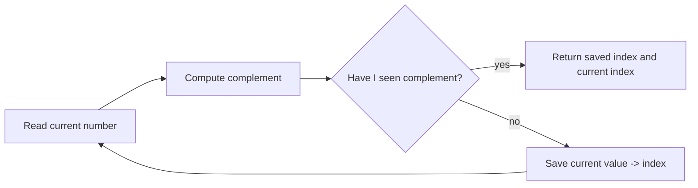

# 1 - Two Sum

[toc]

> **TL;DR:** Two Sum asks for two different indices whose values add to a target. The key move is to stop asking "which pair should I try?" and start asking "what value would complete the number I am looking at right now?"

## Vocabulary

**Index**

```math
i
```

The position of an item in a list. Python lists are zero-indexed, so the first element is at index 0.

**Pair**

```math
(i, j)
```

Two different positions in the array. The problem says you cannot use the same element twice, so i and j must be different.

**Target**

```math
target
```

The sum the two selected numbers must produce.

**Complement**

```math
complement = target - nums[i]
```

The value needed to complete the current number. If the current number is 7 and the target is 9, the complement is 2.

**Hash map**

```math
value \rightarrow index
```

A key-value table. In Python, a `dict` is the usual hash map. For Two Sum, it maps a number we have already seen to its index.

**Time complexity**

```math
O(n)
```

How the number of operations grows as the input length n grows.

**Space complexity**

```math
O(n)
```

How much extra memory the algorithm uses as the input length n grows.

## Problem Restatement

LeetCode gives an integer list `nums` and an integer `target`. Exactly one valid answer exists. Return the indices of two different elements that add to `target`; the order of the returned indices does not matter.

For example, when `nums = [2, 7, 11, 15]` and `target = 9`, the answer is `[0, 1]` because `nums[0] + nums[1]` is `2 + 7`, which equals `9`.

## How To Think About It

The naive question is: "Which two numbers should I pick?" That leads to trying every pair. The better question is: "If I am standing on this number, what number would complete it?"

That second question turns Two Sum into a lookup problem. Instead of scanning the whole list again for the missing value, store numbers you have already passed in a dictionary.



> [!IMPORTANT]
> Check for the complement before saving the current number. That prevents using the same element twice.


## Method 1: Brute Force

Brute force tries every possible pair. It is easy to understand and a good first solution during learning, but it is too slow for large inputs because the number of pairs grows quadratically.

```python
from typing import List


def two_sum_brute_force(nums: List[int], target: int) -> List[int]:
    for i in range(len(nums)):
        for j in range(i + 1, len(nums)):
            if nums[i] + nums[j] == target:
                return [i, j]

    raise ValueError("LeetCode guarantees one solution, so this should not happen.")
```

The inner loop starts at `i + 1`, not 0. That avoids checking the same pair twice and avoids using the same element.

```math
Time = O(n^2)
```

```math
Extra\ Space = O(1)
```

## Method 2: Hash Map In One Pass

The standard interview solution uses a dictionary named something like `seen`. At each index, compute the complement. If the complement is already in `seen`, return the old index and the current index. Otherwise, store the current number.

```python
from typing import List


def two_sum(nums: List[int], target: int) -> List[int]:
    seen: dict[int, int] = {}

    for i, num in enumerate(nums):
        complement = target - num

        if complement in seen:
            return [seen[complement], i]

        seen[num] = i

    raise ValueError("LeetCode guarantees one solution, so this should not happen.")
```

This is the version to memorize after you understand why it works. The dictionary stores only numbers that appear before the current index, so when a match is found, the two indices are automatically different.

```math
Time = O(n)
```

```math
Extra\ Space = O(n)
```

## Trace Example

Tracing the dictionary is the best way to understand the memory. Use `nums = [2, 7, 11, 15]` and `target = 9`.

| Step | i | num | complement | seen before check | result |
| ---: | ---: | ---: | ---: | --- | --- |
| 1 | 0 | 2 | 7 | `{}` | save `2 -> 0` |
| 2 | 1 | 7 | 2 | `{2: 0}` | found 2, return `[0, 1]` |

The algorithm does not need to keep scanning after it finds the match. The problem guarantees exactly one valid answer.

## How Memory Is Working In Python

A Python list stores references to Python objects. Conceptually, `nums` is a row of slots; each slot points to an integer object. The algorithm does not copy the whole list.

A Python dictionary stores key-value entries. In the one-pass Two Sum solution, the key is a number from `nums`, and the value is the index where that number appeared.

```python
seen = {}
seen[2] = 0

# Conceptually:
# value 2 was seen at index 0
```

When Python evaluates `complement in seen`, it hashes the complement and checks the dictionary table. Average-case dictionary membership and lookup are constant time, so each element usually costs one quick lookup and one quick insert.

> [!NOTE]
> A hash map trades memory for speed. Brute force uses almost no extra memory but does many comparisons. The dictionary version stores up to n values, but it avoids the nested loop.

## Why Duplicates Work

Duplicates are a common source of anxiety in Two Sum. The one-pass hash map handles them naturally because it stores an index, not just a boolean.

For `nums = [3, 3]` and `target = 6`, the first `3` is saved. When the second `3` appears, its complement is also `3`, and the saved index is 0.

```python
print(two_sum([3, 3], 6))  # [0, 1]
```

The check-before-save ordering is what makes this safe. On the first `3`, `seen` is empty, so the algorithm cannot accidentally use index 0 with itself.

## Method 3: Sort And Two Pointers

Two pointers are useful when an array is sorted. For Two Sum, the catch is that the problem asks for original indices, so we sort pairs of `(value, index)` instead of sorting only values.

```python
from typing import List


def two_sum_two_pointers(nums: List[int], target: int) -> List[int]:
    pairs = sorted((num, i) for i, num in enumerate(nums))
    left = 0
    right = len(pairs) - 1

    while left < right:
        total = pairs[left][0] + pairs[right][0]

        if total == target:
            return [pairs[left][1], pairs[right][1]]

        if total < target:
            left += 1
        else:
            right -= 1

    raise ValueError("LeetCode guarantees one solution, so this should not happen.")
```

This method is slower than the hash map solution because sorting dominates the runtime, but it teaches an important pattern: when the sum is too small, move the left pointer right; when the sum is too large, move the right pointer left.

```math
Time = O(n \log n)
```

```math
Extra\ Space = O(n)
```

## Big-O Comparison

Big-O ignores tiny constant details and focuses on growth. For Two Sum, the difference between nested loops and one dictionary pass becomes huge as n grows.

| Method | Idea | Time | Extra space | Good for |
| --- | --- | --- | --- | --- |
| Brute force | Try every pair | O(n squared) | O(1) | Learning the problem shape |
| Hash map | Save seen complements | O(n) average | O(n) | Best LeetCode answer |
| Sort + two pointers | Sort values with original indices | O(n log n) | O(n) | Learning pointer strategy |

For LeetCode's constraint of up to 10,000 numbers, O(n squared) can mean about 50 million pair checks. O(n) means about 10,000 loop iterations.

## Interview Explanation

Say this out loud:

> I scan the array once. For each number, I compute the complement needed to reach the target. If that complement has appeared earlier, I return the saved index and the current index. Otherwise I save the current number with its index. This uses O(n) time on average and O(n) extra space.

That explanation covers correctness, the data structure, and complexity in one clean pass.

## Runnable Practice

Run this locally or in LeetCode's Python3 editor. The assertions are small but cover the important cases: normal input, unordered answer, and duplicates.

```python
from typing import List


class Solution:
    def twoSum(self, nums: List[int], target: int) -> List[int]:
        seen: dict[int, int] = {}

        for i, num in enumerate(nums):
            complement = target - num

            if complement in seen:
                return [seen[complement], i]

            seen[num] = i

        raise ValueError("No solution found")


def check(nums: List[int], target: int) -> None:
    answer = Solution().twoSum(nums, target)
    i, j = answer
    assert i != j
    assert nums[i] + nums[j] == target


check([2, 7, 11, 15], 9)
check([3, 2, 4], 6)
check([3, 3], 6)
check([-1, -2, -3, -4, -5], -8)
print("all good")
```

## Practice Prompts

- Before writing code, say the complement for each item in `[3, 2, 4]` with target 6.
- Trace `seen` by hand for `[3, 3]` with target 6.
- Explain why the algorithm checks `if complement in seen` before `seen[num] = i`.
- Change the code to return the numbers instead of indices.
- Try to solve it again tomorrow without looking, starting from the phrase "what value would complete this number?"

## Sources

- Conversation with user on 2026-06-09.
- LeetCode Problem 1, Two Sum: https://leetcode.com/problems/two-sum/
- Python documentation, mapping types: https://docs.python.org/3/library/stdtypes.html#mapping-types-dict
- Python documentation, time complexity notes: https://wiki.python.org/moin/TimeComplexity

## Related

- [Python memory model and PyObject layout](../Programming-Languages/Python/13-memory-model-and-pyobject-layout.md)
- [Python classes and instances in memory](../Programming-Languages/Python/14-classes-and-instances-in-memory.md)
