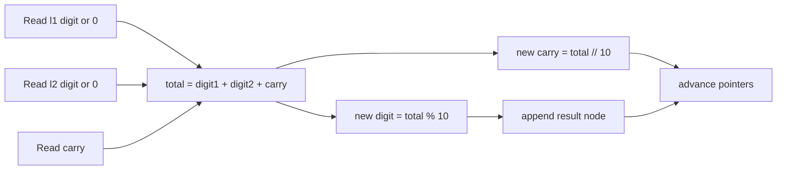

# 2 - Add Two Numbers

[toc]

> **TL;DR:** Add Two Numbers is grade-school addition, but each digit lives in a linked-list node and the digits are stored in reverse order. Walk both lists together, add matching digits plus a carry, create one output node per result digit, and keep going while either list or the carry still exists.

## Vocabulary

**Linked list node**

```math
node = (value, next)
```

A small object that stores a value and a pointer to the next node. In LeetCode, `ListNode.val` stores one digit and `ListNode.next` points to the next digit.

**Head**

```math
head
```

The first node in a linked list. LeetCode passes `l1` and `l2` as the heads of the two input lists.

**Reverse order**

```math
[2,4,3] = 342
```

The ones digit comes first. The list `[2, 4, 3]` represents 342 because 2 is ones, 4 is tens, and 3 is hundreds.

**Carry**

```math
carry = total // 10
```

The value moved into the next digit position when a column sum is 10 or more.

**Digit**

```math
digit = total \bmod 10
```

The single digit written into the current result node.

**Dummy head**

```math
dummy \rightarrow result\ head
```

A placeholder node before the real answer. It simplifies appending nodes because the result list always has a starting anchor.

## Problem Restatement

You are given two non-empty linked lists. Each list represents a non-negative integer in reverse digit order. Return a new linked list representing the sum, also in reverse digit order.

Example: `l1 = [2, 4, 3]` and `l2 = [5, 6, 4]`.

```text
  342
+ 465
-----
  807
```

Because the lists are reversed, the algorithm sees the digits in the same order you add by hand: ones first, then tens, then hundreds. The result is `[7, 0, 8]`.

## How To Think About It

Do not convert the linked lists into full integers first. The interview point is to operate on nodes while carrying state forward one digit at a time.

At each step, ask four questions:

- What digit does `l1` currently give me?
- What digit does `l2` currently give me?
- What carry came from the previous column?
- What result digit and next carry come from this total?



## Standard Python3 Solution

LeetCode provides the `ListNode` class. Your job is usually to fill in the `Solution.addTwoNumbers` method.

```python
from typing import Optional


# class ListNode:
#     def __init__(self, val=0, next=None):
#         self.val = val
#         self.next = next


class Solution:
    def addTwoNumbers(
        self,
        l1: Optional[ListNode],
        l2: Optional[ListNode],
    ) -> Optional[ListNode]:
        dummy = ListNode(0)
        current = dummy
        carry = 0

        while l1 or l2 or carry:
            val1 = l1.val if l1 else 0
            val2 = l2.val if l2 else 0

            total = val1 + val2 + carry
            carry = total // 10
            digit = total % 10

            current.next = ListNode(digit)
            current = current.next

            if l1:
                l1 = l1.next
            if l2:
                l2 = l2.next

        return dummy.next
```

The loop condition includes `carry` because the final addition may create one extra node. Example: `[9] + [9]` produces `[8, 1]`.

> [!IMPORTANT]
> Return `dummy.next`, not `dummy`. The dummy node is not part of the answer; it is only an anchor that makes list construction easier.

## Trace Example

Trace `l1 = [2, 4, 3]`, `l2 = [5, 6, 4]`.

| Step | val1 | val2 | old carry | total | digit | new carry | result so far |
| ---: | ---: | ---: | ---: | ---: | ---: | ---: | --- |
| 1 | 2 | 5 | 0 | 7 | 7 | 0 | `[7]` |
| 2 | 4 | 6 | 0 | 10 | 0 | 1 | `[7, 0]` |
| 3 | 3 | 4 | 1 | 8 | 8 | 0 | `[7, 0, 8]` |

The result list is reversed because the input lists are reversed. `[7, 0, 8]` means 807.

## Why Different Lengths Work

The lists may not have the same number of nodes. When one list ends, treat its missing digit as 0.

```python
val1 = l1.val if l1 else 0
val2 = l2.val if l2 else 0
```

This is exactly like adding:

```text
  9999999
+    9999
---------
 10009998
```

The shorter number does not stop the addition. It just contributes zero in the higher digit positions.

## Common Mistakes

- **Returning `dummy` instead of `dummy.next`**: includes a fake leading 0 node.
- **Forgetting the final carry**: fails cases like `[9] + [9]`.
- **Only looping while `l1 and l2`**: stops too early when lists have different lengths.
- **Moving `current` before attaching the new node**: loses the place where the next node should be linked.
- **Trying to index linked lists**: linked lists do not support O(1) indexing like arrays.

## Complexity

Let n be the length of `l1` and m be the length of `l2`. The algorithm visits each node once and creates one result node per output digit.

```math
Time = O(\max(n, m))
```

```math
Extra\ Space = O(\max(n, m))
```

The extra space is the returned linked list. Aside from the output, the algorithm uses only a few variables: `carry`, `dummy`, `current`, `val1`, `val2`, and `total`.

## Interview Explanation

Say this out loud:

> I traverse both linked lists at the same time. At each step I read the current digits, using 0 if one list is already finished. I add both digits and the carry, write `total % 10` as the next result node, and carry `total // 10` into the next iteration. I keep looping while either list has nodes or carry is nonzero.

That explanation covers traversal, different lengths, final carry, and complexity.

## Runnable Practice

This small local harness builds linked lists, runs the solution, and converts the answer back into a Python list for checking.

```python
from typing import Optional


class ListNode:
    def __init__(self, val: int = 0, next: Optional["ListNode"] = None):
        self.val = val
        self.next = next


class Solution:
    def addTwoNumbers(
        self,
        l1: Optional[ListNode],
        l2: Optional[ListNode],
    ) -> Optional[ListNode]:
        dummy = ListNode(0)
        current = dummy
        carry = 0

        while l1 or l2 or carry:
            val1 = l1.val if l1 else 0
            val2 = l2.val if l2 else 0

            total = val1 + val2 + carry
            carry = total // 10
            digit = total % 10

            current.next = ListNode(digit)
            current = current.next

            if l1:
                l1 = l1.next
            if l2:
                l2 = l2.next

        return dummy.next


def build_list(values: list[int]) -> Optional[ListNode]:
    dummy = ListNode(0)
    current = dummy
    for value in values:
        current.next = ListNode(value)
        current = current.next
    return dummy.next


def to_list(node: Optional[ListNode]) -> list[int]:
    values: list[int] = []
    while node:
        values.append(node.val)
        node = node.next
    return values


solution = Solution()
assert to_list(solution.addTwoNumbers(build_list([2, 4, 3]), build_list([5, 6, 4]))) == [7, 0, 8]
assert to_list(solution.addTwoNumbers(build_list([0]), build_list([0]))) == [0]
assert to_list(solution.addTwoNumbers(build_list([9, 9, 9, 9, 9, 9, 9]), build_list([9, 9, 9, 9]))) == [8, 9, 9, 9, 0, 0, 0, 1]
print("all good")
```

## Practice Prompts

- Trace `[9] + [9]` by hand and explain where the extra `1` node comes from.
- Explain why `while l1 or l2 or carry` is safer than `while l1 and l2`.
- Draw `dummy -> 7 -> 0 -> 8` and point to where `current` moves after each append.
- Rewrite the solution without looking, starting from `dummy = ListNode(0)`.

## Sources

- Conversation with user on 2026-06-10.
- LeetCode Problem 2, Add Two Numbers: https://leetcode.com/problems/add-two-numbers/
- Python documentation, numeric operations: https://docs.python.org/3/library/stdtypes.html#numeric-types-int-float-complex

## Related

- [Linked Lists](../Data-Structures-and-Algorithms/03-linked-lists.md)
- [1 - Two Sum](./1-two-sum.md)
- [Python memory model and PyObject layout](../Programming-Languages/Python/13-memory-model-and-pyobject-layout.md)
