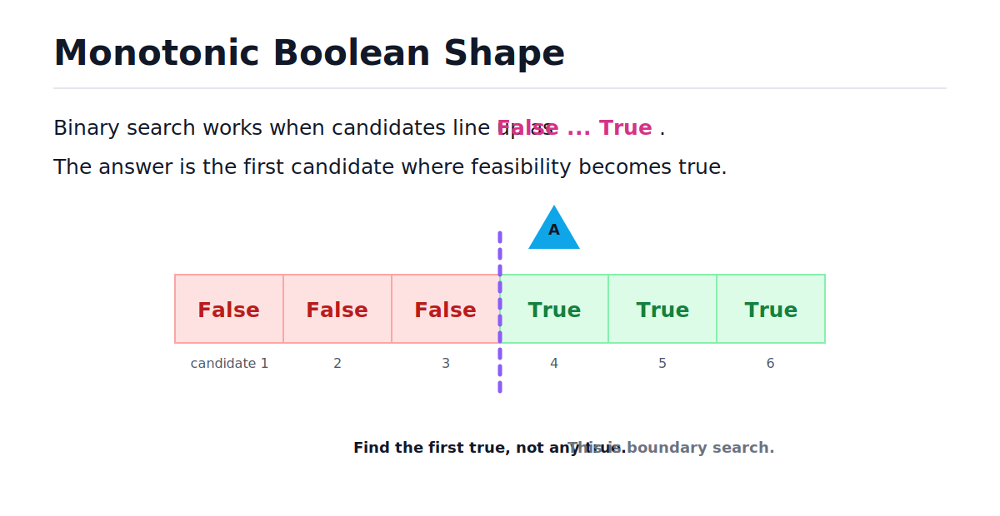
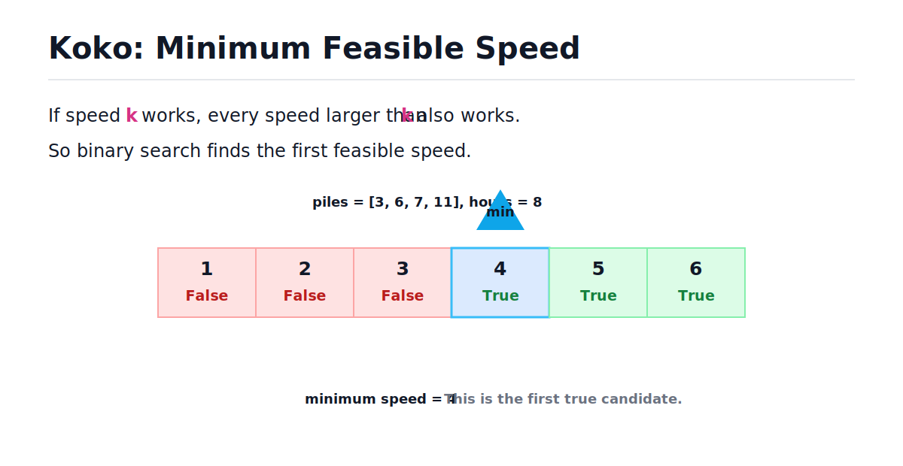
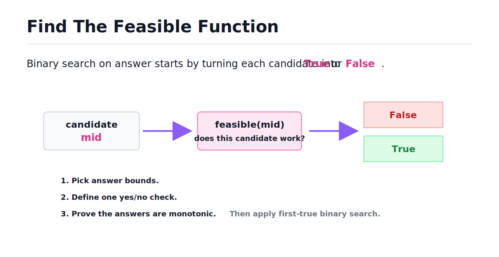

# Binary Search and Monotonic Function - Binary Search

[toc]

> **TL;DR:** Binary search is not limited to sorted arrays. It works whenever you can turn the problem into a monotonic yes/no question: `False, False, False, True, True, True`. The hard part is usually writing the `feasible` function; after that, the search is the same first-true boundary template.

## Vocabulary

**Monotonic function**

```math
x_1 > x_2 \Rightarrow f(x_1) \ge f(x_2)
```

A function that moves in only one direction. It is non-decreasing if larger inputs never produce smaller outputs, and non-increasing if larger inputs never produce larger outputs.

**Monotonic boolean predicate**

```math
False,\ False,\ False,\ True,\ True,\ True
```

A yes/no function that changes value at most once. This is the shape binary search needs when finding the first true.

**Feasible function**

```math
feasible(x) \in \{False,\ True\}
```

A function that answers whether a candidate value works for the problem constraints. In many Leetcode binary-search problems, writing this function is the real problem.

**Candidate answer**

```math
x
```

A possible value you are testing. It might be an index, a speed, a capacity, a day, a distance, or any other value in an ordered search range.

**First true**

```math
min\ x\ such\ that\ feasible(x) = True
```

The smallest candidate that satisfies the feasibility condition.

**Search range**

```math
[left, right]
```

The inclusive range of candidate answers that might still contain the first true.

## The Big Idea

Sorted arrays are only one version of binary search. A sorted array works because the values are monotonic as the index increases.

The more general version asks: if a guess works, do all larger guesses also work? If yes, the answers line up like a sorted boolean array.



> [!IMPORTANT]
> The question is not "is the input array sorted?" The better question is "can I create a monotonic true/false decision over the answer space?"

## Sorted Arrays Are A Special Case

In normal binary search on a sorted array, the feasible function is hidden inside the comparison. If the target is 8 and the middle value is 6, then values to the left are too small.

For boundary search, we make the true/false function explicit.

| Problem shape | Candidate | Feasible function | Boundary |
| --- | --- | --- | --- |
| First true boolean array | index `i` | `arr[i] == True` | first true index |
| Search insert position | index `i` | `nums[i] >= target` | first insertable index |
| Koko eating bananas | speed `k` | can finish within `h` hours | minimum working speed |
| Ship packages | capacity `c` | can ship within `d` days | minimum working capacity |

Once you have the feasible function, the problem becomes "find the first true."

## Feasible Function Template

The reusable template searches a numeric answer range. It records the first candidate that works, then keeps searching left to see if a smaller working answer exists.

This is the same idea as the first true boolean-array problem, except `feasible(mid)` replaces `arr[mid]`.

```python
from typing import Callable


def first_true(left: int, right: int, feasible: Callable[[int], bool]) -> int:
    first_true_index = -1

    while left <= right:
        mid = (left + right) // 2

        if feasible(mid):
            first_true_index = mid
            right = mid - 1
        else:
            left = mid + 1

    return first_true_index


def at_least_four(x: int) -> bool:
    return x >= 4


assert first_true(1, 6, at_least_four) == 4
assert first_true(1, 3, at_least_four) == -1
```

This template is mechanical. The creative part is defining `feasible`.

## Koko-Style Example

Imagine Koko can choose a banana-eating speed `k`. If speed 4 works, then speed 5, 6, and every larger speed also works. That gives a monotonic boolean sequence.

The candidates are speeds, not array indices.



For each speed, compute how many hours are needed. A pile of `pile` bananas takes ceiling division by speed.

```math
hours = \left\lceil \frac{pile}{speed} \right\rceil
```

In Python, integer ceiling division can be written without floating point.

```python
def hours_for_pile(pile: int, speed: int) -> int:
    return (pile + speed - 1) // speed


assert hours_for_pile(11, 4) == 3
assert hours_for_pile(12, 4) == 3
assert hours_for_pile(13, 4) == 4
```

Now define the feasible function: a speed is feasible when the total hours are less than or equal to the allowed hours.

```python
def can_finish(piles: list[int], hours: int, speed: int) -> bool:
    total_hours = 0

    for pile in piles:
        total_hours += (pile + speed - 1) // speed

    return total_hours <= hours


assert not can_finish([3, 6, 7, 11], 8, 3)
assert can_finish([3, 6, 7, 11], 8, 4)
assert can_finish([3, 6, 7, 11], 8, 5)
```

The false/true shape is what makes binary search valid.

## Full Minimum Speed Solution

The minimum speed must be at least 1 and at most the largest pile. Those are the left and right boundaries for the answer search.

This is the full solution using the monotonic feasibility template.

```python
def min_eating_speed(piles: list[int], hours: int) -> int:
    def feasible(speed: int) -> bool:
        total_hours = 0

        for pile in piles:
            total_hours += (pile + speed - 1) // speed

        return total_hours <= hours

    left, right = 1, max(piles)
    answer = -1

    while left <= right:
        mid = (left + right) // 2

        if feasible(mid):
            answer = mid
            right = mid - 1
        else:
            left = mid + 1

    return answer


assert min_eating_speed([3, 6, 7, 11], 8) == 4
assert min_eating_speed([30, 11, 23, 4, 20], 5) == 30
assert min_eating_speed([30, 11, 23, 4, 20], 6) == 23
```

Notice the separation of responsibilities:

- `feasible(speed)` answers one yes/no question.
- Binary search finds the smallest speed where that answer becomes true.

## How To Derive The Feasible Function

The template is only useful after you know what `feasible` means. Derive it from the problem statement instead of guessing.

Ask these questions in order:

1. What am I trying to minimize or maximize?
2. What candidate value can I test?
3. Given one candidate, can I answer "does this work?"
4. If this candidate works, do all larger candidates work?
5. If this candidate fails, do all smaller candidates fail?



For Koko:

| Question | Answer |
| --- | --- |
| What am I minimizing? | Eating speed. |
| What candidate do I test? | A speed `k`. |
| What does feasible mean? | Koko finishes within `h` hours. |
| If speed `k` works, do larger speeds work? | Yes. |
| If speed `k` fails, do smaller speeds fail? | Yes. |

That proves the false-then-true shape.

## Direction Matters

Most "minimum value that works" problems produce this shape:

```math
False,\ False,\ False,\ True,\ True,\ True
```

For that shape, find the first true.

Some problems are reversed:

```math
True,\ True,\ True,\ False,\ False
```

For reversed problems, either search for the last true, or invert the predicate so the sequence becomes false-then-true.

> [!TIP]
> In interviews, say the monotonic direction out loud before coding. Example: "If this speed works, every larger speed also works, so I am finding the first feasible speed."

## Complexity

Let `R` be the size of the answer range. Binary search checks O(log R) candidates.

```math
Binary\ search\ iterations = O(\log R)
```

If the feasible check scans `n` items, then each candidate costs O(n).

```math
Total\ time = O(n \log R)
```

For the Koko example, `R` is the largest pile size and `n` is the number of piles.

```math
Time = O(n \log max(piles))
```

The extra memory is constant because the algorithm only stores counters and boundaries.

```math
Extra\ Space = O(1)
```

## Common Mistakes

Most mistakes happen before the code. If the feasible function is not monotonic, binary search is not valid.

- **Searching without proving monotonicity** - binary search needs a safe discard rule.
- **Mixing up first true and last true** - know the direction before coding.
- **Returning when feasible is true** - true is only a candidate when looking for the first true.
- **Using the array length as the range when the answer is not an index** - for answer search, choose real candidate bounds.
- **Forgetting feasible cost** - total time is binary-search iterations times the cost of one feasibility check.

## Interview Questions and Answers

Use these as spoken practice. A good answer names the candidate, the feasible function, and the monotonic direction.

### 1. When can you use binary search beyond sorted arrays?

You can use it when the answer space is ordered and a yes/no predicate is monotonic.

**Answer:** I can use binary search when a candidate decision forms a monotonic sequence, such as false false false true true true.

### 2. What is a feasible function?

It is a function that checks whether one candidate answer satisfies the problem constraints.

**Answer:** `feasible(x)` returns true if candidate `x` works. Binary search then finds the first or last candidate where feasibility changes.

### 3. Why is Koko's speed monotonic?

If Koko can finish at speed `k`, then any faster speed also finishes no later.

**Answer:** Larger speeds can only reduce or preserve the needed hours, so once a speed works, every larger speed works too.

### 4. What is the hard part of this pattern?

The binary search template is mechanical. The harder part is proving the feasible function is monotonic and choosing the correct bounds.

**Answer:** The hard part is defining `feasible` and proving the answer space has a false-then-true or true-then-false shape.

### 5. What is the runtime if `feasible` takes O(n)?

Binary search runs O(log R) feasibility checks, where `R` is the answer range size.

**Answer:** The total time is O(n log R), because each feasibility check costs O(n) and binary search tries O(log R) candidates.

### 6. How do you say this in an interview?

Say the monotonic relationship first, then the candidate bounds, then the feasible function.

**Answer:** "I am binary searching the answer. For each candidate, I check if it is feasible. Since every larger candidate also works after the first feasible one, I can find the first true with binary search."

## Practice Path

Use this checklist for binary-search-on-answer problems.

1. Identify the value you are minimizing or maximizing.
2. Write the smallest and largest possible candidate values.
3. Define `feasible(candidate)`.
4. Prove the predicate is monotonic.
5. Decide whether you need first true or last true.
6. Apply the boundary-search template.
7. Multiply the binary search iterations by the cost of `feasible`.

## Copyable Takeaways

- Binary search works on monotonic decisions, not only sorted arrays.
- A sorted array is a monotonic function from index to value.
- A feasible function turns a candidate answer into true or false.
- If larger guesses work after the first success, the shape is false-then-true.
- The template is easy after `feasible` is correct.
- Total runtime is usually O(cost of feasible times log answer range).

## Sources

- Conversation with user on 2026-06-10.
- User-provided Binary Search and Monotonic Function / AlgoMonster-style excerpt in conversation on 2026-06-10.

## Related

- [First True in a Sorted Boolean Array - Binary Search](./first-true-in-a-sorted-boolean-array-binary-search.md)
- [Binary Search](../Data-Structures-and-Algorithms/23-binary-search.md)
- [Math for Technical Interviews](../Mathematics/Technical-Interview-Math/math-for-technical-interviews.md)
