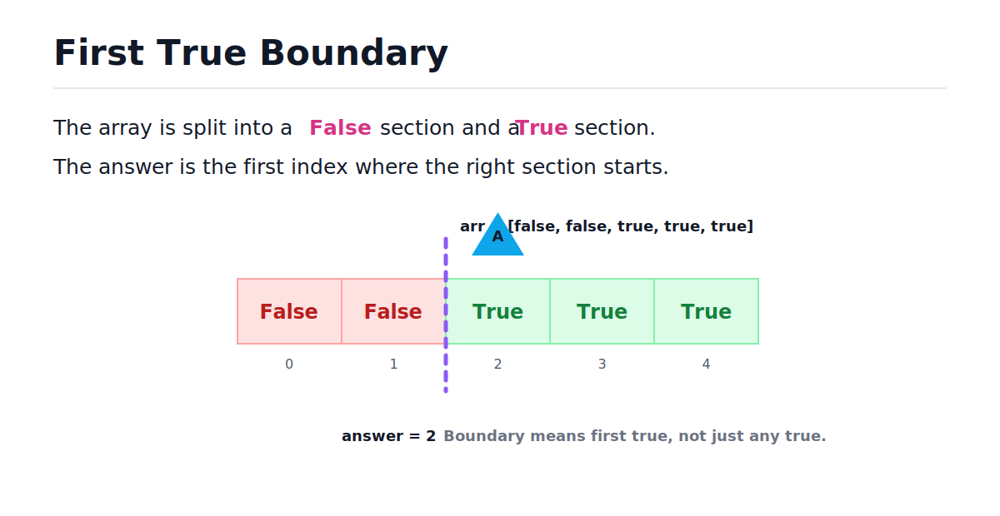
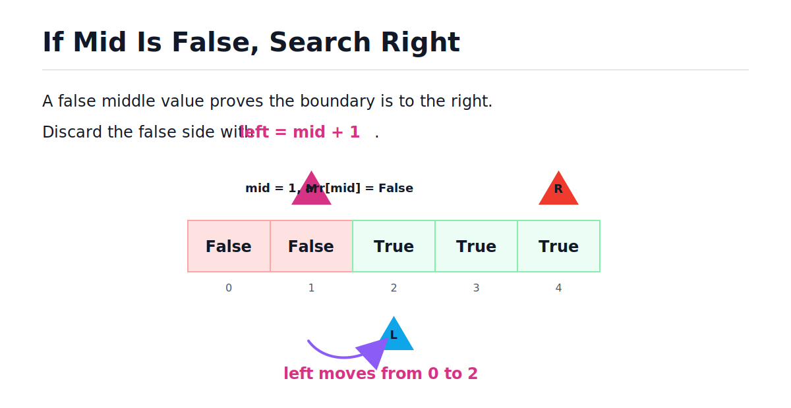
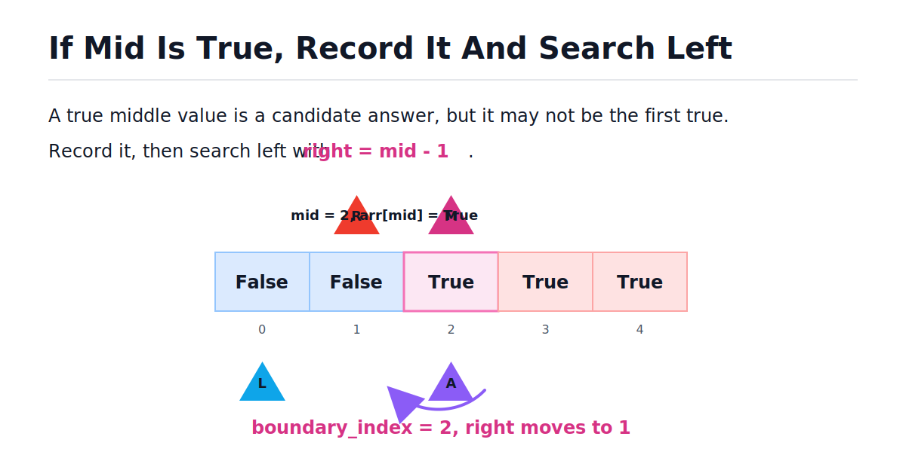

# First True in a Sorted Boolean Array - Binary Search

[toc]

> **TL;DR:** This problem is the first major boundary-search pattern: find the first position where a monotonic condition becomes true. When `arr[mid]` is `False`, search right. When `arr[mid]` is `True`, record it as a candidate and keep searching left.

## Vocabulary

**Sorted boolean array**

```math
False,\ False,\ False,\ True,\ True
```

An array split into two sections. All false values are on the left, and all true values are on the right.

**Boundary**

```math
first\ index\ i\ where\ arr_i = True
```

The first index of the true section. This is the answer the problem asks for.

**Candidate answer**

```math
boundary\_index
```

The best true index found so far. It starts at `-1` because the array might contain no true values.

**Monotonic predicate**

```math
False,\ False,\ True,\ True
```

A yes/no condition that changes direction only once. In this problem, the predicate is the array value itself.

**Progress**

```math
left\ increases\ or\ right\ decreases
```

The rule that each loop iteration must shrink the search range. This is what prevents infinite loops.

## Problem Restatement

You are given a boolean array where all `False` values appear before all `True` values. Return the index of the first `True`.

If the array has no `True`, return `-1`.

Example:

```python
arr = [False, False, True, True, True]
```

The output is `2` because index 2 is the first true value.



## Why This Is Binary Search

This problem is not asking for an exact target value like normal binary search. It asks for a boundary: the first index where the condition becomes true.

The sorted boolean structure gives a safe discard rule:

- If `arr[mid]` is `False`, every index at or left of `mid` is also false.
- If `arr[mid]` is `True`, `mid` might be the answer, but there may be an earlier true to the left.

> [!IMPORTANT]
> A true middle value is only a candidate. Do not return immediately unless the problem asks for any true value.

## Decision Table

Before writing code, make the two decisions explicit. This is the part interviewers care about because it proves you understand the algorithm instead of memorizing it.

| Case | Meaning | Action |
| --- | --- | --- |
| `arr[mid] == False` | Boundary must be to the right. | `left = mid + 1` |
| `arr[mid] == True` | `mid` is a candidate, but an earlier true may exist. | `boundary_index = mid`, then `right = mid - 1` |

The first case discards false values. The second case records a possible answer before discarding the right side.

## False Case: Search Right

If `arr[mid]` is false, the first true cannot be at `mid` or anywhere to the left. The array is false-then-true, so all earlier values are also false.

Move `left` to `mid + 1`.



Here is the false case by itself.

```python
arr = [False, False, True, True, True]
left, mid = 0, 1

if not arr[mid]:
    left = mid + 1

assert left == 2
```

## True Case: Record And Search Left

If `arr[mid]` is true, then `mid` is a valid candidate answer. But the first true might still be left of `mid`, so save `mid` before moving `right`.

Move `right` to `mid - 1` after recording the candidate.



Here is the true case by itself.

```python
arr = [False, False, True, True, True]
mid = 2
right = len(arr) - 1
boundary_index = -1

if arr[mid]:
    boundary_index = mid
    right = mid - 1

assert boundary_index == 2
assert right == 1
```

## Standard Solution

This version keeps the same loop shape as basic binary search: `while left <= right`. The only extra idea is `boundary_index`, which stores the leftmost true seen so far.

This is the solution I would use first in an interview.

```python
def find_boundary(arr: list[bool]) -> int:
    left, right = 0, len(arr) - 1
    boundary_index = -1

    while left <= right:
        mid = (left + right) // 2

        if arr[mid]:
            boundary_index = mid
            right = mid - 1
        else:
            left = mid + 1

    return boundary_index


assert find_boundary([False, False, True, True, True]) == 2
assert find_boundary([False, False, False]) == -1
assert find_boundary([True, True, True]) == 0
assert find_boundary([False, True]) == 1
assert find_boundary([True]) == 0
assert find_boundary([]) == -1
```

## CLI Practice Version

The practice prompt reads booleans as strings like `false` and `true`. Convert them into real Python booleans before calling the function.

Example input:

```text
false false true true true
```

Expected output:

```text
2
```

Full stdin/stdout version:

```python
def find_boundary(arr: list[bool]) -> int:
    left, right = 0, len(arr) - 1
    boundary_index = -1

    while left <= right:
        mid = (left + right) // 2

        if arr[mid]:
            boundary_index = mid
            right = mid - 1
        else:
            left = mid + 1

    return boundary_index


def main() -> None:
    arr = [x == "true" for x in input().split()]
    result = find_boundary(arr)
    print(result)


if __name__ == "__main__":
    main()
```

For normal note testing, use direct assertions instead of stdin.

```python
assert find_boundary([False, False, True, True, True]) == 2
assert find_boundary([False, False, False, True]) == 3
```

## Trace Example

Tracing boundary search means watching the candidate answer. When you see true, update `boundary_index`; when you see false, move rightward.

For `arr = [False, False, True, True, True]`:

| Step | left | right | mid | arr[mid] | boundary_index | Decision |
| ---: | ---: | ---: | ---: | :---: | ---: | --- |
| 1 | 0 | 4 | 2 | `True` | 2 | record 2, move `right` to 1 |
| 2 | 0 | 1 | 0 | `False` | 2 | move `left` to 1 |
| 3 | 1 | 1 | 1 | `False` | 2 | move `left` to 2 |

Now `left > right`, so the loop exits and returns `2`.

## Alternative Approach

Another style keeps the current true element inside the search range by using `right = mid`. This can work, but the loop must change to `while left < right`.

If you keep `right = mid` with `while left <= right`, then when `left == right`, `mid == right`, so the right boundary does not move. That creates an infinite loop.

> [!WARNING]
> To avoid infinite loops, each iteration must make progress and the loop needs a clear exit strategy.

The keep-current version also needs a final check for the no-true case.

```python
def find_boundary_keep_current(arr: list[bool]) -> int:
    if not arr:
        return -1

    left, right = 0, len(arr) - 1

    while left < right:
        mid = (left + right) // 2

        if arr[mid]:
            right = mid
        else:
            left = mid + 1

    return left if arr[left] else -1


assert find_boundary_keep_current([False, False, True, True, True]) == 2
assert find_boundary_keep_current([False, False, False]) == -1
assert find_boundary_keep_current([True, True]) == 0
assert find_boundary_keep_current([]) == -1
```

The `boundary_index` version is easier while learning because it changes less from vanilla binary search.

## Complexity

Each loop iteration discards about half of the remaining search range.

```math
Time = O(\log n)
```

The algorithm only stores a few integer variables.

```math
Extra\ Space = O(1)
```

## Common Mistakes

Most bugs in this problem come from forgetting that a true value is only a candidate. The first true could be farther left.

- **Returning immediately on `True`** — finds any true, not necessarily the first true.
- **Forgetting `boundary_index`** — loses the candidate before searching left.
- **Returning `0` for no true** — should return `-1`.
- **Putting `return boundary_index` inside the loop** — exits after one iteration.
- **Using `right = mid` with `while left <= right`** — can create an infinite loop.
- **Writing Python booleans as `true` and `false`** — Python uses `True` and `False`.

## Interview Questions and Answers

Use these answers to practice saying the reasoning out loud. The goal is to explain the boundary, not just write code.

### 1. Why does binary search work on this boolean array?

The array is monotonic: false values come first, then true values. A middle check tells you which side cannot contain the first true.

**Answer:** Binary search works because the predicate changes only once from false to true, so I can search for that boundary.

### 2. Why do we need `boundary_index`?

When `arr[mid]` is true, `mid` may be the answer. But there may be an earlier true, so the algorithm records `mid` before searching left.

**Answer:** `boundary_index` stores the best true candidate found so far. It lets me discard `mid` safely after recording it.

### 3. Why does false move `left` to `mid + 1`?

If the middle is false, all values to its left are false too. None of them can be the first true.

**Answer:** A false middle proves the boundary is to the right, so I discard the left side including `mid`.

### 4. Why does true move `right` to `mid - 1`?

After recording the true middle, the only possible improvement is an earlier true to the left.

**Answer:** A true middle is a candidate, so I save it, then continue left to find whether an earlier true exists.

### 5. What are the edge cases?

Important cases are an empty array, all false, all true, one false, and one true.

**Answer:** Empty and all-false arrays return `-1`; all-true arrays return `0`; single-element arrays return `0` for true and `-1` for false.

### 6. What is the complexity?

The search range halves each iteration, and no extra data structure is allocated.

**Answer:** Time is O(log n), and extra space is O(1).

## Practice Path

Boundary search shows up constantly after this problem. Learn the shape until you can derive it without memorizing.

1. Trace `[False, False, True, True, True]`.
2. Trace `[False, False, False]`.
3. Trace `[True, True, True]`.
4. Implement `find_boundary` with `boundary_index`.
5. Explain why `boundary_index` starts at `-1`.
6. Implement the keep-current alternative.
7. Generalize this into "first value where a predicate becomes true."

## Copyable Takeaways

- This is boundary binary search.
- `False` means the boundary is right of `mid`.
- `True` means record `mid`, then search left.
- `boundary_index = -1` handles the no-true case.
- The `boundary_index` version keeps `while left <= right`.
- The keep-current version needs `while left < right`.
- Time is O(log n), and extra space is O(1).

## Sources

- Conversation with user on 2026-06-10.
- User-provided First True / AlgoMonster-style excerpt in conversation on 2026-06-10.

## Related

- [Binary Search](../Data-Structures-and-Algorithms/23-binary-search.md)
- [Math for Technical Interviews](../Mathematics/Technical-Interview-Math/math-for-technical-interviews.md)
