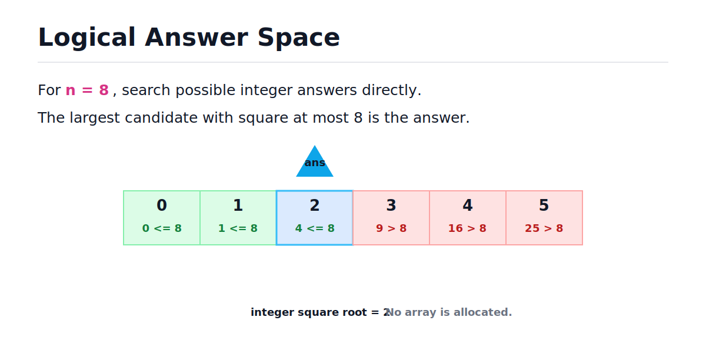
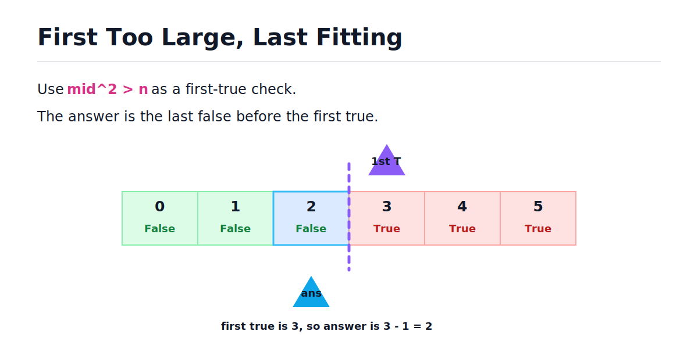
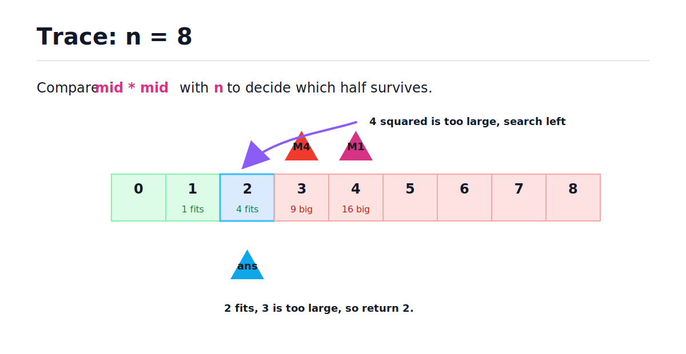

# Square Root Estimation - Binary Search

[toc]

> **TL;DR:** To estimate an integer square root, binary search the answer space of possible integers. For `n = 8`, the largest integer whose square is less than or equal to 8 is 2, so return 2. This is a boundary-search problem over a logical sorted array, not a real array you build in memory.

## Vocabulary

**Integer square root**

```math
\lfloor \sqrt{n} \rfloor
```

The square root with the decimal part removed. For example, the square root of 8 is about 2.83, so the integer square root is 2.

**Candidate answer**

```math
x
```

An integer that might be the square root estimate. For non-negative `n`, valid candidates range from 0 to `n`.

**Square check**

```math
x^2 \le n
```

The test that tells us whether a candidate is small enough to be a valid truncated square root.

**Logical array**

```math
0,\ 1,\ 2,\ 3,\ \ldots,\ n
```

The ordered answer space we search. We do not allocate this array in memory; we only search its index/value range.

**First true**

```math
x^2 > n
```

The first candidate whose square is too large. The integer square root is one less than this boundary.

**Last false**

```math
x^2 \le n
```

The largest candidate whose square is still small enough. This is the answer.

## Problem Restatement

Given a non-negative integer `n`, return the integer part of its square root without using a built-in square root function.

Examples:

```text
Input: 16
Output: 4

Input: 8
Output: 2
```

The result for `8` is `2` because the real square root is 2.83..., and the problem asks us to truncate the decimal part.

## The Key Mental Model

You can imagine a sorted array of possible answers from `0` to `n`. Each candidate has a square, and those squares increase as the candidate increases.

For `n = 8`, candidates look like this:



> [!IMPORTANT]
> This is a logical array, not a real array. We binary search the numeric range directly and compute `mid * mid` when needed.

## Boundary View

There are two equivalent ways to view the boundary.

First, ask whether a candidate is too large:

```math
mid^2 > n
```

That gives a false-then-true sequence. The first true is the first candidate above the square root, so the answer is one less.

Second, ask whether a candidate still fits:

```math
mid^2 \le n
```

That gives a true-then-false sequence. The answer is the last true.



This note uses the "last fitting candidate" version because it returns the answer directly.

## Decision Rule

At each midpoint, compare `mid * mid` with `n`. That tells you which side of the answer space can be discarded.

| Check | Meaning | Move |
| --- | --- | --- |
| `mid * mid == n` | Exact square root found. | Return `mid`. |
| `mid * mid < n` | `mid` fits, but a larger answer may also fit. | Record `mid`, move `left` right. |
| `mid * mid > n` | `mid` is too large. | Move `right` left. |

The "fits but maybe not largest" case is the boundary-search part.



## Standard Solution

This version searches for the largest candidate whose square is less than or equal to `n`. The variable `answer` stores the best fitting candidate found so far.

This is the cleanest version to write in Python.

```python
def square_root(n: int) -> int:
    left, right = 0, n
    answer = 0

    while left <= right:
        mid = (left + right) // 2
        square = mid * mid

        if square == n:
            return mid

        if square < n:
            answer = mid
            left = mid + 1
        else:
            right = mid - 1

    return answer


assert square_root(0) == 0
assert square_root(1) == 1
assert square_root(2) == 1
assert square_root(8) == 2
assert square_root(16) == 4
assert square_root(27) == 5
```

The important detail is `answer = mid` only when `mid * mid < n`. That records the best valid candidate before searching for a larger one.

## Version Matching The First-True Explanation

The source explanation frames the problem as finding the first candidate where `mid * mid > n`, then returning one less. That is also valid.

This version records the first too-large candidate in `first_too_large`.

```python
def square_root_first_true(n: int) -> int:
    if n == 0:
        return 0

    left, right = 1, n
    first_too_large = n + 1

    while left <= right:
        mid = (left + right) // 2
        square = mid * mid

        if square == n:
            return mid

        if square > n:
            first_too_large = mid
            right = mid - 1
        else:
            left = mid + 1

    return first_too_large - 1


assert square_root_first_true(0) == 0
assert square_root_first_true(8) == 2
assert square_root_first_true(16) == 4
assert square_root_first_true(26) == 5
```

Both versions are O(log n). The difference is whether you record the last fitting value or the first too-large value.

## CLI Practice Version

Coding platforms usually provide one integer on stdin. The function does the algorithm; the `main` block only reads input and prints the result.

Example input:

```text
8
```

Expected output:

```text
2
```

Full practice version:

```python
def square_root(n: int) -> int:
    left, right = 0, n
    answer = 0

    while left <= right:
        mid = (left + right) // 2
        square = mid * mid

        if square == n:
            return mid

        if square < n:
            answer = mid
            left = mid + 1
        else:
            right = mid - 1

    return answer


def main() -> None:
    n = int(input())
    result = square_root(n)
    print(result)


if __name__ == "__main__":
    main()
```

For note testing, call the function directly.

```python
assert square_root(4) == 2
assert square_root(15) == 3
assert square_root(100) == 10
```

## Trace For n = 8

Tracing the search shows why the answer is 2. The candidate 3 is too large because 3 squared is 9, so the largest fitting value is 2.

| Step | left | right | mid | mid squared | Decision | answer |
| ---: | ---: | ---: | ---: | ---: | --- | ---: |
| 1 | 0 | 8 | 4 | 16 | too large, move `right` to 3 | 0 |
| 2 | 0 | 3 | 1 | 1 | fits, record 1 and move `left` to 2 | 1 |
| 3 | 2 | 3 | 2 | 4 | fits, record 2 and move `left` to 3 | 2 |
| 4 | 3 | 3 | 3 | 9 | too large, move `right` to 2 | 2 |

Now `left > right`, so the loop exits and returns `answer = 2`.

## Why This Is Monotonic

As the candidate value increases, its square also increases. That means once `mid * mid` becomes greater than `n`, every larger candidate is also too large.

That gives us a monotonic feasible function.

```python
def too_large(candidate: int, n: int) -> bool:
    return candidate * candidate > n


assert not too_large(2, 8)
assert too_large(3, 8)
assert too_large(4, 8)
```

The boolean sequence for `n = 8` is:

```math
False,\ False,\ False,\ True,\ True,\ True
```

That is exactly the shape from the first-true boundary-search pattern.

## Complexity

The answer space has at most `n + 1` candidates from `0` to `n`. Binary search cuts that range in half each iteration.

```math
Time = O(\log n)
```

The algorithm stores only a few integer variables: `left`, `right`, `mid`, `square`, and `answer`.

```math
Extra\ Space = O(1)
```

No logical candidate array is allocated.

## Common Mistakes

Most bugs come from confusing exact square root with truncated square root. The input may not be a perfect square, so you need a boundary answer.

- **Using a built-in square root** - the problem asks you not to.
- **Returning `-1` when no exact square exists** - for `8`, the answer is `2`, not `-1`.
- **Building an actual array from `0` to `n`** - the candidate array is only a mental model.
- **Forgetting `n = 0`** - the answer should be `0`.
- **Using floating point** - integer multiplication avoids precision issues.
- **Not recording a fitting candidate** - you need the largest value whose square is at most `n`.

## Interview Questions and Answers

Use these as spoken practice. A good answer explains the boundary and why the squared values are monotonic.

### 1. Why is square root estimation a binary-search problem?

The candidate answers are ordered integers from `0` to `n`, and their squares increase as the candidate increases.

**Answer:** I can binary search the answer space because `x * x` is monotonic for non-negative integers. If a candidate is too large, every larger candidate is also too large.

### 2. Why do we return 2 for input 8?

Because 2 squared is 4, which is less than or equal to 8, but 3 squared is 9, which is too large.

**Answer:** The integer square root is the largest integer whose square is at most `n`. For 8, that value is 2.

### 3. What is the feasible function?

One option is to ask whether the candidate is too large.

**Answer:** `feasible(x)` can be `x * x > n`. Then I find the first true and subtract 1.

### 4. What is the difference between first true and last false here?

The first true for `x * x > n` is the first candidate above the square root. The answer is the last false before it.

**Answer:** First true gives the first too-large number; the truncated square root is one less than that boundary.

### 5. What is the time and space complexity?

Binary search checks logarithmically many candidates and uses only constant extra state.

**Answer:** Time is O(log n), and extra space is O(1).

### 6. How do you avoid overflow in languages with fixed-width integers?

Python integers grow as needed, so overflow is not a practical issue here. In fixed-width languages, compare carefully or use division.

**Answer:** In Python, `mid * mid` is safe. In fixed-width languages, I would avoid overflow by using a wider type or comparing `mid <= n / mid`.

## Practice Path

Practice this problem as "binary search on answer" rather than array search. The goal is to get comfortable searching a range of possible values.

1. Solve exact cases: `0`, `1`, `4`, `16`.
2. Solve truncated cases: `2`, `3`, `8`, `15`, `27`.
3. Trace `n = 8` by hand.
4. Write the last-fitting-candidate version.
5. Write the first-too-large version.
6. Explain why the logical array is not built in memory.

## Copyable Takeaways

- Square root estimation searches the answer space, not an input array.
- The logical candidates are integers from `0` to `n`.
- `mid * mid <= n` means `mid` is a valid candidate.
- The answer is the largest valid candidate.
- Equivalently, find the first `mid` where `mid * mid > n`, then subtract 1.
- Time is O(log n), and extra space is O(1).

## Sources

- Conversation with user on 2026-06-10.
- User-provided Square Root Estimation / AlgoMonster-style excerpt in conversation on 2026-06-10.

## Related

- [Binary Search and Monotonic Function - Binary Search](./binary-search-and-monotonic-function-binary-search.md)
- [First True in a Sorted Boolean Array - Binary Search](./first-true-in-a-sorted-boolean-array-binary-search.md)
- [Binary Search](../Data-Structures-and-Algorithms/23-binary-search.md)
- [Math for Technical Interviews](../Mathematics/Technical-Interview-Math/math-for-technical-interviews.md)
