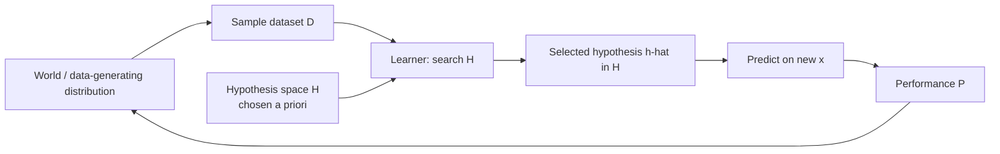
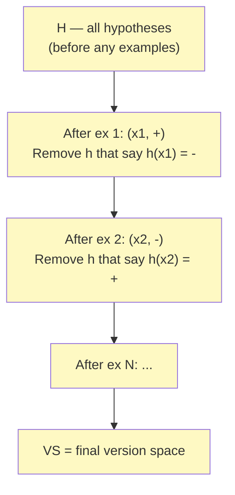
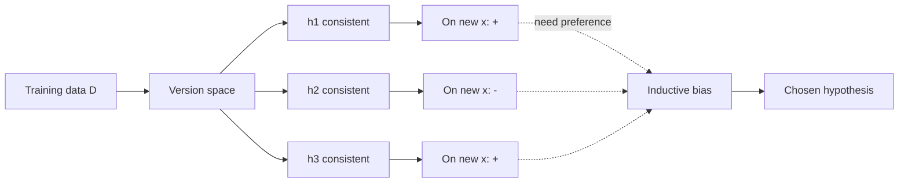

# 1 - What is Machine Learning, Hypotheses, and Version Space

[toc]

> **TL;DR:** Machine learning is the discipline of writing programs that *improve at a task with experience*, measured by some performance criterion. Every ML algorithm searches a *hypothesis space* — a structured family of candidate rules — for the hypothesis that best fits the data. The *version space* is the subset of hypotheses *still consistent* with all observed examples; learning is the act of shrinking that set, and *inductive bias* is what makes the shrinking possible at all.

## Vocabulary

**Machine Learning (Mitchell, 1997)**

> A program learns from experience $E$ w.r.t. task $T$ and performance measure $P$ if its performance at $T$, as measured by $P$, improves with $E$.

This crisp triple ($T$, $P$, $E$) is the canonical framing. Iris classification: $T$ = predict species; $P$ = accuracy; $E$ = labeled flower measurements.

---

**Instance / example**

```math
x \in \mathcal{X}
```

A single observation. For tabular ML, a vector of attribute values; for vision, an image tensor; for language, a token sequence.

---

**Attribute / feature**

A single field of an instance. Iris has four numeric features (sepal length/width, petal length/width); a soybean record has dozens of nominal features.

---

**Hypothesis**

```math
h : \mathcal{X} \to \mathcal{Y}
```

A candidate rule mapping inputs to predictions. Could be a decision-tree path, a linear weight vector, a neural network.

---

**Hypothesis space**

```math
\mathcal{H} = \{h_1, h_2, \ldots\}
```

The full family of hypotheses the learner is allowed to consider. Fixed by the algorithm before any data is seen.

---

**Consistent hypothesis**

A hypothesis that agrees with *every* training example: $h(x_i) = y_i$ for all $i$.

---

**Version space**

```math
VS_{\mathcal{H}, D} = \{ h \in \mathcal{H} : h(x_i) = y_i \ \forall (x_i, y_i) \in D \}
```

The subset of $\mathcal{H}$ consistent with the dataset $D$. Starts equal to $\mathcal{H}$, shrinks monotonically as examples arrive.

---

**Inductive bias**

The set of assumptions the learner makes *beyond* the data, which lets it generalize. Without bias, no learner can prefer one consistent hypothesis over another.

## Intuition

Imagine you've never seen a fruit and a teacher hands you one apple with the label "apple." Could you classify the next fruit? Not really — every characteristic of the apple (red, round, smooth, weighs 200g) is consistent with infinitely many rules ("apple = red things," "apple = round things," "apple = round red 200g things"). To learn, you need *more examples* (each one rules out hypotheses) *and* a preference ordering for which hypothesis to pick when several remain (inductive bias). The whole field of ML is the study of this loop: encode a hypothesis space, watch examples narrow it down, choose wisely from what remains.

The version space is the explicit representation of "what's still on the table." Early in training it's huge; as more labeled examples arrive, hypotheses inconsistent with the data are pruned. At the limit, the version space may collapse to a single hypothesis (perfect generalization), or never shrink past a non-trivial set (the data underdetermines the answer — you need bias to break the tie). Both outcomes are common in practice.

The deepest insight from this chapter: **no free lunch**. Without inductive bias, learning is impossible. Why? Because for any consistent hypothesis $h$ there exists another consistent hypothesis $h'$ that agrees on the training data but disagrees on every unseen example. So if you have *no* preference among consistent hypotheses, you cannot generalize. Every ML algorithm encodes a preference — decision trees prefer short trees, linear models prefer small weights, k-NN prefers local smoothness — and that preference is *the* thing that makes generalization possible.

## The ML loop



Every ML system instantiates this loop. The *engineering* of an ML application is mostly about (a) choosing $\mathcal{H}$ — algorithm selection — and (b) collecting / cleaning $D$ — data engineering.

## Hypothesis-space examples

Three small, illustrative spaces. The same dataset has very different version spaces under each.

### Example 1 — Conjunctions of attribute equalities

For a categorical-attribute domain with attributes $A_1, \ldots, A_d$, define $\mathcal{H}$ as conjunctions of equalities, where each attribute can also be a wildcard `*`:

```math
h(x) = \mathbb{1}\big[\forall j:\ x_j = v_j \text{ or } v_j = *\big]
```

For four binary attributes, $|\mathcal{H}| = 3^4 = 81$ (each attribute is one of `{0, 1, *}`).

### Example 2 — Disjunctions of conjunctions (DNF)

Far richer: each hypothesis is an OR of conjunctions. Decision trees and rule lists live here. Size grows exponentially in attribute count.

### Example 3 — Hyperplanes in $\mathbb{R}^d$

```math
h_{\mathbf{w}, b}(x) = \text{sign}(\mathbf{w}^\top x + b)
```

Uncountably many hypotheses parameterized by $(\mathbf{w}, b) \in \mathbb{R}^{d+1}$. Perceptrons, logistic regression, and linear SVMs all live here.

## Version space, visually



Each labeled example removes inconsistent hypotheses. With enough examples (and a finite, well-chosen $\mathcal{H}$), the version space shrinks to a useful size — sometimes a single hypothesis, more often a non-empty set whose members must be tied-broken by inductive bias.

### Most-specific and most-general hypotheses

For lattice-structured $\mathcal{H}$ (like attribute conjunctions), the version space has a *boundary* representation:

- **$S$ = most specific consistent hypotheses** — those with the *fewest* wildcards while still covering all positives.
- **$G$ = most general consistent hypotheses** — those with the *most* wildcards while still excluding all negatives.

The version space is the set of all hypotheses *between* $S$ and $G$ in the specialization order. This is the data structure behind Mitchell's **Candidate-Elimination algorithm**.

```python
from dataclasses import dataclass
from typing import Literal

Sym = str               # attribute value, '*' = wildcard, '_' = bottom (matches nothing)
Hyp = tuple[Sym, ...]   # one symbol per attribute

def matches(h: Hyp, x: tuple[str, ...]) -> bool:
    return all(hv == "*" or hv == xv for hv, xv in zip(h, x))

def more_general(h1: Hyp, h2: Hyp) -> bool:
    """h1 >= h2 — h1 covers every instance h2 covers."""
    return all(a == "*" or a == b for a, b in zip(h1, h2))

def candidate_elimination(examples: list[tuple[tuple[str, ...], Literal["+", "-"]]],
                           n_attrs: int) -> tuple[list[Hyp], list[Hyp]]:
    S: list[Hyp] = [tuple("_" for _ in range(n_attrs))]    # bottom
    G: list[Hyp] = [tuple("*" for _ in range(n_attrs))]    # top

    for x, lbl in examples:
        if lbl == "+":
            G = [g for g in G if matches(g, x)]
            new_S: list[Hyp] = []
            for s in S:
                if matches(s, x):
                    new_S.append(s)
                else:
                    # minimal generalization to include x
                    gen = tuple(xv if sv == "_" or sv == xv else "*"
                                for sv, xv in zip(s, x))
                    if any(more_general(g, gen) for g in G):
                        new_S.append(gen)
            S = new_S
        else:                                             # negative example
            S = [s for s in S if not matches(s, x)]
            new_G: list[Hyp] = []
            for g in G:
                if not matches(g, x):
                    new_G.append(g)
                else:
                    # minimal specializations excluding x
                    for j, gv in enumerate(g):
                        if gv == "*":
                            for v in {x[k] for _, lbl2 in examples if lbl2 == "+" for k in [j]} - {x[j]}:
                                cand = g[:j] + (v,) + g[j+1:]
                                if any(more_general(cand, s) for s in S):
                                    new_G.append(cand)
            G = new_G
    return S, G
```

The algorithm is mostly of historical / pedagogical interest; modern learners don't enumerate version spaces explicitly. But understanding $S$ and $G$ is the cleanest way to internalize what "consistent" means.

## Inductive bias — without it, no learning

Suppose the version space has more than one hypothesis after training: $h_1$ and $h_2$ both fit the data but disagree on a new $x$. Which do you ship? Without an additional preference, you cannot decide — and any choice is equivalent in *training* error but potentially very different in *generalization* error.



Examples of bias built into common algorithms:

| Algorithm | Inductive bias |
| :--- | :--- |
| Decision trees | Prefer short, low-impurity trees (Occam's razor). |
| Linear / logistic regression | Linear separability; minimize squared / logistic loss. |
| k-Nearest Neighbors | Local smoothness: nearby points have similar labels. |
| Naive Bayes | Feature independence given the class. |
| Neural networks | Smooth function expressible by the chosen architecture; gradient-descent landscape. |
| SVM | Maximum-margin separation. |

> [!IMPORTANT]
> Inductive bias is not optional. You don't get to ship an "unbiased" learner — you get to *choose* a bias. The right question is "is this bias appropriate for my data-generating process?", not "can I avoid bias?"

## A worked example — the EnjoySport dataset

A small dataset from Mitchell, six attributes describing weather conditions, label "EnjoySport" (`+` or `-`):

| Sky | AirTemp | Humidity | Wind | Water | Forecast | EnjoySport |
| :--- | :--- | :--- | :--- | :--- | :--- | :--- |
| Sunny | Warm | Normal | Strong | Warm | Same | + |
| Sunny | Warm | High | Strong | Warm | Same | + |
| Rainy | Cold | High | Strong | Warm | Change | - |
| Sunny | Warm | High | Strong | Cool | Change | + |

Running Candidate-Elimination over these examples in order:

- Initial: $S = \langle \emptyset, \emptyset, \emptyset, \emptyset, \emptyset, \emptyset \rangle$, $G = \langle *, *, *, *, *, * \rangle$.
- After ex 1 (+): $S$ generalizes to $\langle$Sunny, Warm, Normal, Strong, Warm, Same$\rangle$.
- After ex 2 (+): $S = \langle$Sunny, Warm, *, Strong, Warm, Same$\rangle$ (Humidity widened).
- After ex 3 (−): $G$ specializes; consistent specializations include $\langle$Sunny, *, *, *, *, *$\rangle$ and $\langle$*, Warm, *, *, *, *$\rangle$ and $\langle$*, *, *, *, *, Same$\rangle$.
- After ex 4 (+): $S = \langle$Sunny, Warm, *, Strong, *, *$\rangle$; $G$ trims to $\langle$Sunny, *, *, *, *, *$\rangle$ and $\langle$*, Warm, *, *, *, *$\rangle$.

The final version space contains all hypotheses between $S$ and $G$ — a small but non-empty set. To classify a new example, you'd apply the *bias* the algorithm encodes (any consistent hypothesis is acceptable) and either majority-vote or pick a specific one.

## In practice

> [!TIP]
> When choosing an algorithm, first ask: *what is its inductive bias, and does it match what I believe about my data?* For images, convolutional bias (spatial locality, translation equivariance) is appropriate. For tabular data, tree-ensemble biases (axis-aligned splits, non-linear interactions) usually beat linear models. Choose bias before you choose architecture.

> [!CAUTION]
> A perfect training-set fit *with no slack* is suspicious. It often signals that $\mathcal{H}$ is too rich for the available data — the version space is large and you happen to have picked one element that overfits. Cross-validation and held-out evaluation are how you detect this; regularization is how you encode preference for simpler hypotheses (smaller $|\mathcal{H}|$ effective).

> [!NOTE]
> The version-space formalism extends to *probabilistic* learning: instead of "consistent / inconsistent" hard labels, each hypothesis has a likelihood given the data, and you weight by that. This is the Bayesian view — see [Probability Primer](./2-probability-primer.md) and the conjugate-prior treatment in [Naive Bayes](../2-supervised-learning/2-naive-bayes.md).

The version-space framework is rarely used directly in modern toolchains, but it underpins every concept you'll meet later. "Bias-variance tradeoff" is "expressive $\mathcal{H}$ vs strong inductive bias." "Overfitting" is "version space contains hypotheses that fit training but disagree wildly on test." "Regularization" is "modify the search to prefer hypotheses with bias-aligned properties." Master the foundations here and the rest of the course is mechanism.

## Pitfalls

- **"More features always make $\mathcal{H}$ richer and improve learning."** Richer $\mathcal{H}$ → larger version space after the same amount of data → worse generalization. Curse of dimensionality (see [GDA](../2-supervised-learning/3-gaussian-discriminant-analysis.md)).
- **"A consistent hypothesis is correct."** Consistency = matches training data. The true target function need not be in $\mathcal{H}$ at all. Underfit and you'll find no consistent hypothesis; overfit-rich $\mathcal{H}$ and you'll find too many.
- **"Inductive bias is a bug."** It's the only reason learning is possible. The "bug" is *wrong* bias for the data; the right fix is *better* bias, not no bias.
- **"Version-space algorithms scale."** They don't — for realistic $\mathcal{H}$ they explode combinatorially. Modern learners do *implicit* version-space search via optimization (gradient descent on a loss).
- **"My algorithm is non-parametric, so it's unbiased."** k-NN, kernels, Gaussian processes all have biases — locality, smoothness, prior choices. "Non-parametric" means "parameter count grows with data," not "no assumptions."

## Exercises

### Exercise 1 — Identify the bias

For each of the following hypothesis spaces, identify the inductive bias and one task on which it would be appropriate.

(a) Decision stumps (single-attribute thresholds).
(b) Linear-threshold functions $\text{sign}(\mathbf{w}^\top x + b)$.
(c) Conjunctions of single-attribute equalities, no negations.
(d) Polynomial kernels of degree $\le 3$.

#### Solution

(a) Bias: a single attribute is sufficient to discriminate the classes. Appropriate when the data has one *dominant* feature (e.g. "is the email's length > 100 chars?" as a crude spam filter); used as the weak learner in AdaBoost.

(b) Bias: classes are linearly separable in the input space. Appropriate when feature engineering has already produced linearly-separable representations (e.g. word counts for sentiment).

(c) Bias: the concept is *monotone-positive* in the attributes — only the *presence* of values matters, never their absence. Appropriate for some rule-induction settings (medical diagnosis as "patient has symptom X AND symptom Y") but very narrow.

(d) Bias: classes are separable by a low-degree polynomial decision surface. Appropriate when the true boundary has bounded curvature (e.g. XOR-like patterns, ellipsoidal class regions).

---

### Exercise 2 — Trace candidate-elimination

Run candidate-elimination on the following 2-attribute dataset; attributes `Shape ∈ {Circle, Square}`, `Color ∈ {Red, Blue, Green}`. Examples: (Circle, Red, +), (Square, Red, +), (Circle, Blue, −).

#### Solution

Initial: $S = \langle \_, \_ \rangle$, $G = \langle *, * \rangle$.

After (Circle, Red, +):
- $S = \langle$Circle, Red$\rangle$; $G$ unchanged.

After (Square, Red, +):
- $S$ generalizes: $\langle$*, Red$\rangle$; $G$ unchanged.

After (Circle, Blue, −):
- $G$ must specialize to exclude (Circle, Blue) while remaining ≥ $S$.
- Specializations of $\langle *, *\rangle$ that exclude (Circle, Blue) and contain $S = \langle$*, Red$\rangle$:
  - $\langle$Square, *$\rangle$ — but does not cover positive (Circle, Red); rejected.
  - $\langle$*, Red$\rangle$ — covers $S$ ✓, excludes (Circle, Blue) ✓. Keep.
  - $\langle$*, Green$\rangle$ — does not cover $S$; rejected.
- Final $S = G = \langle$*, Red$\rangle$ — version space collapsed to a single hypothesis: "any shape, color Red."

---

### Exercise 3 — Cost of an empty version space

What does it mean when the version space becomes empty after processing some data? Give two distinct reasons it can happen.

#### Solution

An empty version space means *no* hypothesis in $\mathcal{H}$ is consistent with the data. Reasons:

1. **$\mathcal{H}$ is too restrictive** — the true target concept is not expressible in $\mathcal{H}$. For example, trying to learn an XOR with a linear-separator $\mathcal{H}$ leads to empty VS as soon as you have all four XOR points labeled.

2. **Label noise** — the dataset contains examples whose labels are wrong (mislabeled or measurement error). Even an in-class concept becomes unrealizable when training data contradicts the true labels.

In either case, the learner must either enrich $\mathcal{H}$ (more flexible hypothesis space), accept some training error (move from strict consistency to *low* error — the standard ML setting), or clean the data.

---

### Exercise 4 — From version space to probability

Why does practical ML quickly abandon the "consistent / inconsistent" dichotomy of version space in favor of probabilistic / loss-based formulations? Give two concrete reasons and name one algorithm that bridges the two.

#### Solution

**Two reasons:**

1. **Noise robustness.** Real labels are noisy; strict consistency makes the version space empty for any sufficiently large noisy dataset. A loss formulation lets the learner trade per-example accuracy against overall fit.

2. **Generalization control.** Two consistent hypotheses generalize very differently. A probabilistic / regularized objective lets the learner *prefer* one over the other (smaller weights, smoother fit) rather than picking arbitrarily among consistent candidates.

**Bridge algorithm.** *Soft-margin SVM* (see [SVM and Kernels](../2-supervised-learning/6-svm-and-kernels.md)) starts from version-space-like reasoning (maximize the margin to the nearest training point) but adds slack variables so noisy or non-separable points are allowed at a controlled cost. *Maximum a posteriori* estimation (MAP) is another: it's MLE plus a prior, blending data fit with a preference encoded as a probability distribution over hypotheses.

## Sources

- Mitchell, T. (1997). *Machine Learning*. McGraw-Hill. Chs. 1–2 (Concept Learning, Version Space).
- Ramakrishnan, G. & Nagesh, A. (2011). *CS725: Foundations of Machine Learning — Lecture Notes*. IIT Bombay. §1, §2.
- Wolpert, D. H. (1996). *The Lack of A Priori Distinctions between Learning Algorithms* (No Free Lunch). Neural Computation.
- Domingos, P. (2012). *A Few Useful Things to Know about Machine Learning*. CACM. https://homes.cs.washington.edu/~pedrod/papers/cacm12.pdf

## Related

- [2 - Probability Primer](./2-probability-primer.md)
- [3 - Estimation and Maximum Likelihood](./3-estimation-and-mle.md)
- [4 - Optimization and KKT](./4-optimization-and-kkt.md)
- [Decision Trees](../2-supervised-learning/1-decision-trees.md)
- [SVM and Kernels](../2-supervised-learning/6-svm-and-kernels.md)
