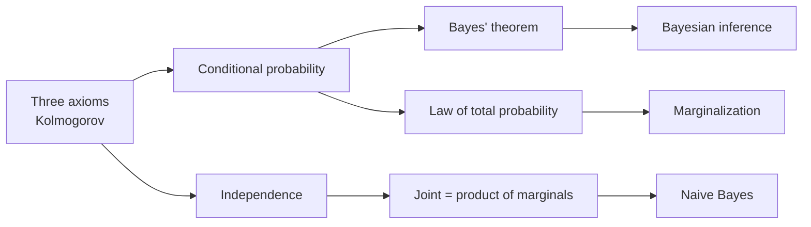
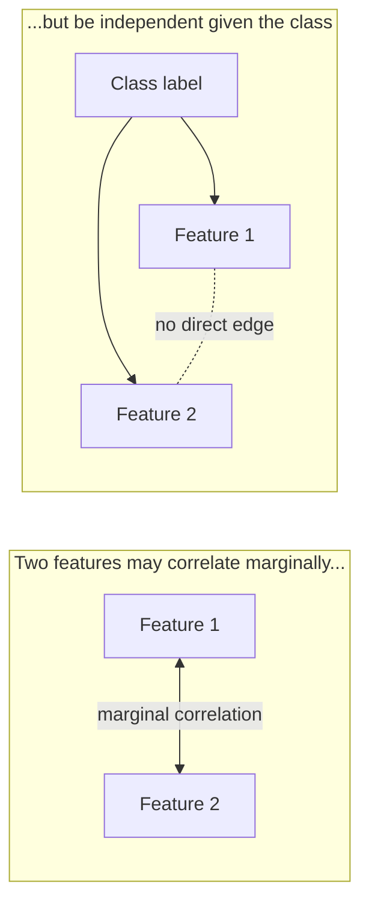
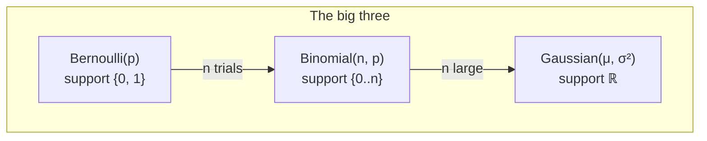

# 2 - Probability Primer for Machine Learning

[toc]

> **TL;DR:** Probability is the language ML uses to talk about uncertainty. Three axioms (non-negativity, normalization, additivity) give the whole structure. *Bayes' theorem* inverts the direction of conditioning and is the engine of every probabilistic classifier. *Independence* (joint = product of marginals) is the assumption that makes high-dimensional models tractable — and Naive Bayes pushes this assumption to the extreme. *Expectations* are the bridge between distributions and the scalar quantities (loss, error, regret) you actually optimize.

## Vocabulary

**Sample space**

```math
\Omega = \text{set of all possible outcomes}
```

The universe of an experiment. For one coin flip $\Omega = \{H, T\}$; for two rolls of a die $\Omega = \{(i, j) : 1 \le i, j \le 6\}$.

---

**Event**

```math
A \subseteq \Omega
```

A subset of outcomes. "Rolled a 6" is the event $\{6\}$; "rolled even" is $\{2, 4, 6\}$.

---

**Probability measure**

```math
P : 2^\Omega \to [0, 1]
```

A function that assigns each event a number in $[0, 1]$, satisfying the three axioms below.

---

**Random variable (RV)**

```math
X : \Omega \to \mathbb{R}
```

A measurable function from outcomes to real numbers. Lets us treat probabilistic quantities like numbers.

---

**Probability mass function (PMF) / density function (PDF)**

```math
p_X(x) = P(X = x) \ \text{(discrete)}, \qquad f_X(x) \ \text{such that}\ P(a \le X \le b) = \int_a^b f_X(x)\,dx \ \text{(continuous)}
```

The shape of the distribution. PMF for discrete RVs, PDF for continuous.

---

**Expectation**

```math
\mathbb{E}[X] = \sum_x x\, p_X(x) \quad \text{or} \quad \int x\, f_X(x)\,dx
```

The probability-weighted average value of an RV.

---

**Conditional probability**

```math
P(A \mid B) = \frac{P(A \cap B)}{P(B)}, \quad P(B) > 0
```

Probability of $A$ given that $B$ has occurred.

---

**Independence**

```math
A \perp B \iff P(A \cap B) = P(A)\,P(B)
```

Two events are independent iff their joint factorizes into the product of marginals.

## Intuition

ML lives in a world of incomplete information. We never see the full data-generating distribution; we see a finite sample. Probability is the mathematical apparatus that lets us reason about what we *don't* see: how confident we should be in a hypothesis, how much error we should expect on new examples, how to combine evidence from multiple features. Without probability, ML is a collection of heuristics; with it, the heuristics become principled and comparable.

The chapter's beating heart is *Bayes' theorem*. It tells you how to combine *prior* beliefs about hypotheses with *evidence* from data to get *posterior* beliefs. Every probabilistic classifier — Naive Bayes, logistic regression, Gaussian discriminant analysis, modern Bayesian neural networks — uses the same underlying move: write down the likelihood $P(\text{data} \mid \text{class})$, multiply by the prior $P(\text{class})$, normalize, and read off the most-probable class.

Three big-name distributions show up over and over: *Bernoulli* for binary outcomes, *Binomial* for sums of Bernoullis, *Gaussian* for everything else (thanks to the Central Limit Theorem). Knowing their mean, variance, PMF/PDF, and conjugate priors is half the battle of getting through a probabilistic ML course.

## The three axioms

```math
\begin{aligned}
&\text{(A1)} && P(A) \ge 0 \quad \forall A \\
&\text{(A2)} && P(\Omega) = 1 \\
&\text{(A3)} && A_1, A_2, \ldots \text{disjoint} \Rightarrow P\!\left(\bigcup_i A_i\right) = \sum_i P(A_i)
\end{aligned}
```

Every other property — $P(\emptyset) = 0$, $P(A^c) = 1 - P(A)$, inclusion–exclusion — follows from these three.



## Bayes' theorem

```math
P(H \mid D) = \frac{P(D \mid H)\,P(H)}{P(D)}
```

Pieces:

- $P(H)$ — **prior**: belief in hypothesis before seeing data.
- $P(D \mid H)$ — **likelihood**: probability the data would arise if $H$ were true.
- $P(H \mid D)$ — **posterior**: belief in $H$ after seeing $D$.
- $P(D)$ — **evidence / marginal likelihood**: $\sum_H P(D \mid H)\,P(H)$, a normalizer.

```python
def bayes_posterior(prior: dict[str, float],
                    likelihood: dict[str, float]) -> dict[str, float]:
    """Compute the posterior P(H | D) given prior P(H) and likelihood P(D | H) for each H."""
    unnormalized = {h: likelihood[h] * prior[h] for h in prior}
    Z = sum(unnormalized.values())
    return {h: u / Z for h, u in unnormalized.items()}

# Classic medical-test example
prior = {"sick": 0.01, "well": 0.99}
likelihood = {"sick": 0.99,   # P(positive test | sick) = sensitivity
              "well": 0.05}   # P(positive test | well) = false-positive rate
posterior = bayes_posterior(prior, likelihood)
print(f"P(sick | positive test) = {posterior['sick']:.3f}")
# ~0.167 — most positives are false alarms because the disease is rare
```

The medical-test result is a Bayesian classic: even with 99% sensitivity, a positive test for a rare disease (1% prevalence) means only ~17% chance of actually being sick. This is the *base-rate fallacy*; it's why every doctor learns Bayes early.

## Law of total probability

```math
P(B) = \sum_i P(B \mid A_i)\,P(A_i) \quad \text{where } \{A_i\} \text{ partition } \Omega
```

Used to compute marginals from conditionals — the denominator of Bayes is exactly this.

## Independence and conditional independence

```math
A \perp B \iff P(A \cap B) = P(A)\,P(B)
```

```math
A \perp B \mid C \iff P(A \cap B \mid C) = P(A \mid C)\,P(B \mid C)
```

Conditional independence is *strictly weaker* than marginal independence and is the assumption that powers Naive Bayes: features are assumed independent *given the class*, even though they may be correlated marginally.



## PMF, PDF, CDF

A discrete RV has a **probability mass function** $p_X(x) = P(X = x)$; a continuous RV has a **probability density function** $f_X(x)$ such that $P(a \le X \le b) = \int_a^b f_X(x)\,dx$. The **cumulative distribution function** $F_X(x) = P(X \le x)$ works for both.

> [!IMPORTANT]
> A PDF can be *greater than 1*. Densities are not probabilities; only their integrals over an interval are. The probability of a continuous RV taking any single exact value is zero.

## Expectation, variance, covariance

```math
\mathbb{E}[X] = \sum_x x\, p_X(x) \quad \text{or} \quad \int x\, f_X(x)\,dx
```

```math
\text{Var}(X) = \mathbb{E}\big[(X - \mathbb{E}[X])^2\big] = \mathbb{E}[X^2] - \mathbb{E}[X]^2
```

```math
\text{Cov}(X, Y) = \mathbb{E}\big[(X - \mathbb{E}[X])(Y - \mathbb{E}[Y])\big]
```

Key properties (proofs are exercises in linearity):

```math
\mathbb{E}[aX + b] = a\,\mathbb{E}[X] + b
```

```math
\text{Var}(aX + b) = a^2\,\text{Var}(X)
```

```math
X \perp Y \Rightarrow \mathbb{E}[XY] = \mathbb{E}[X]\,\mathbb{E}[Y] \text{ and } \text{Cov}(X, Y) = 0
```

(The converse — zero covariance implying independence — is false in general but true for jointly Gaussian RVs.)

## The big three distributions

### Bernoulli

```math
X \sim \text{Bernoulli}(p), \quad P(X = 1) = p, \quad P(X = 0) = 1 - p
```

Mean $p$, variance $p(1-p)$. The atom of binary classification likelihood.

### Binomial

```math
X = \sum_{i=1}^n X_i, \quad X_i \sim \text{Bernoulli}(p) \text{ i.i.d.}
```

```math
P(X = k) = \binom{n}{k} p^k (1-p)^{n-k}
```

Mean $np$, variance $np(1-p)$. Count of successes in $n$ trials.

### Gaussian (Normal)

```math
f_X(x) = \frac{1}{\sqrt{2\pi\sigma^2}} \exp\!\left(-\frac{(x - \mu)^2}{2\sigma^2}\right)
```

Parameters: mean $\mu$, variance $\sigma^2$. The most-used continuous distribution by a wide margin.



## The Central Limit Theorem

```math
\frac{1}{n}\sum_{i=1}^n X_i \xrightarrow{d} \mathcal{N}\!\left(\mu, \frac{\sigma^2}{n}\right) \quad \text{as } n \to \infty
```

For i.i.d. $X_i$ with finite mean $\mu$ and variance $\sigma^2$, the sample mean converges to a Gaussian — *regardless of the shape of the underlying distribution*. This is why Gaussian assumptions are so useful: any quantity that is itself an average (sample means, error terms accumulating over many sources) is approximately Gaussian.

```python
import numpy as np
import matplotlib.pyplot as plt

rng = np.random.default_rng(0)
# Heavily skewed underlying distribution: exponential
samples_per_mean = 30
n_means = 10_000
exp_data = rng.exponential(scale=1.0, size=(n_means, samples_per_mean))
sample_means = exp_data.mean(axis=1)

# Visual sanity check: sample-of-means histogram should look bell-shaped
plt.hist(sample_means, bins=60, density=True)
plt.title("CLT in action: means of 30 exponentials -> Gaussian-ish")
plt.show()
```

The exponential distribution is heavy-tailed and asymmetric; the sample-mean histogram nonetheless looks Gaussian. This is the CLT empirically.

## Bayesian classification with these primitives

Putting it together: given features $\mathbf{x}$ and classes $c \in \{1, \ldots, K\}$, classify by:

```math
\hat{c} = \arg\max_c P(c \mid \mathbf{x}) = \arg\max_c P(\mathbf{x} \mid c)\,P(c)
```

(We drop the $P(\mathbf{x})$ denominator since it's the same across classes.) The two factors come from data: estimate $P(c)$ by class frequencies, and $P(\mathbf{x} \mid c)$ by fitting a per-class distribution. This is the foundation of [Naive Bayes](../2-supervised-learning/2-naive-bayes.md) and [GDA](../2-supervised-learning/3-gaussian-discriminant-analysis.md).

> [!TIP]
> When you need to make a classification decision under squared-error or 0/1 loss, the *Bayes-optimal* classifier picks the most-probable class — the one maximizing $P(c \mid \mathbf{x})$. No classifier can do better in expectation; this is the *Bayes error rate*, and it's the irreducible noise floor every algorithm runs into.

## In practice

> [!CAUTION]
> Probabilities can be tiny — $10^{-100}$ is normal for the joint of 100 features. Always work in *log space*: compute $\log P$, sum log-likelihoods instead of multiplying. The same is true for likelihoods, posteriors, scores. The single most common ML implementation bug is numerical underflow from forgetting this.

> [!NOTE]
> Independence assumptions are almost always wrong (real features correlate), and yet they often produce good *predictions*. The classification decision only needs the *ordering* of class posteriors to be right — and that's more robust than the actual posterior values being correct. This is why Naive Bayes survives despite its absurd-looking assumption.

The "probability primer" really has two jobs: (1) give you the algebra to derive ML loss functions and posteriors, and (2) supply the distributional zoo (Bernoulli, Binomial, Gaussian, plus the multinomial / multivariate Gaussian / Beta / Dirichlet you'll meet in [Naive Bayes](../2-supervised-learning/2-naive-bayes.md)). Master both and most ML proofs become bookkeeping.

## Pitfalls

- **"Posterior = likelihood."** Forgetting the prior in Bayes drops the base-rate signal — exactly the medical-test fallacy.
- **"Zero covariance = independent."** True only for jointly Gaussian RVs. In general, $X$ and $X^2$ can have zero covariance (for $X \sim \mathcal{N}(0,1)$) but are obviously not independent.
- **"PDF value is a probability."** It's a density. Integrate it over an interval to get a probability.
- **"More data always makes posteriors tighter."** Only if the model is well-specified. If your likelihood is wrong (e.g. assuming Gaussian when data is heavy-tailed), more data makes you *more* confidently wrong.
- **"i.i.d. holds in real data."** It rarely does — time series have correlations, customer data has hierarchical structure. The CLT and many ML guarantees weaken or fail when i.i.d. is violated.

## Exercises

### Exercise 1 — Bayes for spam classification

A spam filter sees that 30% of training emails are spam ($P(\text{spam}) = 0.3$). The word "free" appears in 60% of spam and 5% of ham. An email contains "free." What is $P(\text{spam} \mid \text{free})$?

#### Solution

```math
P(\text{free}) = P(\text{free} \mid \text{spam})\,P(\text{spam}) + P(\text{free} \mid \text{ham})\,P(\text{ham}) = 0.6 \cdot 0.3 + 0.05 \cdot 0.7 = 0.215
```

```math
P(\text{spam} \mid \text{free}) = \frac{0.6 \cdot 0.3}{0.215} = \frac{0.18}{0.215} \approx 0.837
```

So "free" raises the spam probability from 30% to ~84%. This is exactly the Naive Bayes per-feature update; aggregating over many tokens gives the full classifier.

---

### Exercise 2 — Expectation of a non-trivial RV

Let $X \sim \text{Uniform}(0, 1)$. Compute $\mathbb{E}[X^2]$ and $\text{Var}(X)$.

#### Solution

For uniform on $[0, 1]$, $f_X(x) = 1$.

```math
\mathbb{E}[X^2] = \int_0^1 x^2 \cdot 1\,dx = \left[\frac{x^3}{3}\right]_0^1 = \frac{1}{3}
```

```math
\mathbb{E}[X] = \int_0^1 x\,dx = \frac{1}{2}
```

```math
\text{Var}(X) = \mathbb{E}[X^2] - \mathbb{E}[X]^2 = \frac{1}{3} - \frac{1}{4} = \frac{1}{12}
```

Sanity check: the general formula $\text{Var}(\text{Uniform}(a,b)) = (b-a)^2/12$ gives $1/12$. ✓.

---

### Exercise 3 — Independence vs conditional independence

Give a concrete example where features $X$ and $Y$ are *not* independent marginally but *are* conditionally independent given a third variable $C$.

#### Solution

Let $C$ be "rain today" (true/false). Let $X$ = "I carry an umbrella" and $Y$ = "the sidewalks are wet."

Marginally, $X$ and $Y$ are *correlated* — both increase when it rains. So $P(X, Y) \neq P(X)\,P(Y)$.

Conditional on $C$, they are *independent*: knowing it's raining and whether I have an umbrella tells you nothing extra about wet sidewalks beyond what "it's raining" already tells you. $P(X, Y \mid C) = P(X \mid C)\,P(Y \mid C)$.

This is exactly the *common-cause* structure that justifies Naive Bayes' assumption: features correlate marginally (via the shared cause = class) but are independent given the cause.

---

### Exercise 4 — CLT in practice

You estimate the mean processing time of a backend service. Each request's latency is heavy-tailed (90th percentile much larger than mean), with population mean 50 ms and population std 200 ms. You average 100 requests. (a) Distribution of the sample mean? (b) Probability the sample mean is above 80 ms?

#### Solution

**(a)** By the CLT, the sample mean is approximately

```math
\bar{X}_{100} \sim \mathcal{N}\!\left(50,\ \frac{200^2}{100}\right) = \mathcal{N}(50,\ 400)
```

So $\text{std}(\bar{X}_{100}) = 20$ ms.

**(b)**

```math
P(\bar{X}_{100} > 80) = P\!\left(Z > \frac{80 - 50}{20}\right) = P(Z > 1.5) \approx 0.067
```

A 7% chance per 100-request batch — meaning if you run 14 batches a day, you'll see a "false alarm" of high-latency mean about once a day even when nothing is wrong. This is why p99 latency monitoring uses larger windows and uses raw quantiles rather than means.

## Sources

- Ramakrishnan, G. & Nagesh, A. (2011). *CS725: Foundations of Machine Learning — Lecture Notes*. IIT Bombay. §4, §6.
- Bishop, C. M. (2006). *Pattern Recognition and Machine Learning*. Springer. Ch. 1, 2.
- Murphy, K. P. (2012). *Machine Learning: A Probabilistic Perspective*. MIT Press. Ch. 2.
- Wasserman, L. (2004). *All of Statistics*. Springer. Ch. 1–4.
- 3Blue1Brown. *Bayes' theorem, the geometry of changing beliefs*. https://www.3blue1brown.com/lessons/bayes-theorem

## Related

- [1 - What is ML and Version Space](./1-what-is-ml-and-version-space.md)
- [3 - Estimation and Maximum Likelihood](./3-estimation-and-mle.md)
- [Naive Bayes](../2-supervised-learning/2-naive-bayes.md)
- [Gaussian Discriminant Analysis](../2-supervised-learning/3-gaussian-discriminant-analysis.md)
- [Clustering, EM, and k-means](../3-unsupervised-and-beyond/1-clustering-em-and-kmeans.md)
