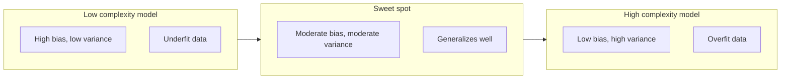
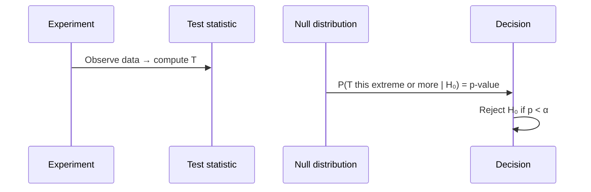

# 3 - Estimation, MLE, MAP, and Hypothesis Testing

[toc]

> **TL;DR:** Given data, how do you pick the parameters of a probabilistic model? *Maximum Likelihood Estimation (MLE)* picks the parameters under which the observed data was most probable. *Maximum a Posteriori (MAP)* adds a prior and picks the parameters with highest posterior probability. *Hypothesis testing* asks the dual question — is an observed effect compatible with a null hypothesis, or strong enough to reject it? Together these tools turn "I have data; what model should I trust?" into a tractable optimization.

## Vocabulary

**Estimator**

```math
\hat{\theta} = T(X_1, X_2, \ldots, X_n)
```

A function of the observed data that produces a guess of an unknown parameter $\theta$. Different choices of $T$ are different estimators.

---

**Likelihood function**

```math
L(\theta; D) = P(D \mid \theta) = \prod_{i=1}^n p(x_i \mid \theta)
```

Probability of the data viewed as a function of the parameter. Note: it is *not* a probability distribution over $\theta$.

---

**Log-likelihood**

```math
\ell(\theta; D) = \log L(\theta; D) = \sum_{i=1}^n \log p(x_i \mid \theta)
```

Numerically friendlier, additive form. Argmax is unchanged because $\log$ is monotone.

---

**Maximum Likelihood Estimator (MLE)**

```math
\hat{\theta}_{\text{MLE}} = \arg\max_\theta \ell(\theta; D)
```

The parameter value that makes the observed data most probable.

---

**Maximum a Posteriori (MAP)**

```math
\hat{\theta}_{\text{MAP}} = \arg\max_\theta \log P(D \mid \theta) + \log P(\theta)
```

MLE with a *prior* on $\theta$. Reduces to MLE when the prior is uniform.

---

**Bias of an estimator**

```math
\text{bias}(\hat{\theta}) = \mathbb{E}[\hat{\theta}] - \theta
```

How far the estimator's expectation is from the true value. *Unbiased* if zero.

---

**Variance of an estimator**

```math
\text{Var}(\hat{\theta}) = \mathbb{E}\big[(\hat{\theta} - \mathbb{E}[\hat{\theta}])^2\big]
```

How much $\hat{\theta}$ fluctuates around its own mean across different samples.

---

**Mean squared error (MSE)**

```math
\text{MSE}(\hat{\theta}) = \mathbb{E}\big[(\hat{\theta} - \theta)^2\big] = \text{bias}(\hat{\theta})^2 + \text{Var}(\hat{\theta})
```

The bias-variance decomposition of estimator error. Everywhere in ML.

---

**p-value**

The probability, *under the null hypothesis*, of observing a test statistic at least as extreme as the one observed. **Not** the probability the null is true.

## Intuition

You have observations; you assume they came from a parameterized family of distributions; you want a good guess of the parameters. The likelihood function is the bridge: it tells you how *plausible* each candidate parameter is, given the data. Maximum likelihood picks the peak; everything else (priors, regularization, Bayesian inference) is variations on which "peak" you're really after — peak of likelihood, peak of posterior, full posterior distribution.

A small but useful conceptual leap: the *likelihood* $L(\theta; D)$ has $D$ fixed and $\theta$ varying — it's a function of $\theta$, not a probability distribution. So a "likelihood of 0.001" doesn't mean "probability 0.001" — it means "under this parameter value, the data has joint probability 0.001." MLE picks the $\theta$ that makes this number largest. That's all.

Hypothesis testing reverses the flow. Instead of asking "what parameter best fits this data?" it asks "is this data compatible with a *specific* claim?" You set up a null hypothesis $H_0$ (e.g., "the coin is fair"), compute a test statistic, find its distribution under $H_0$, and check whether the observed value lies in the tails. If it does, you have evidence against $H_0$. The most-misunderstood concept in all of statistics — the *p-value* — is exactly this tail probability.

## Maximum Likelihood Estimation

### The recipe

1. Write the likelihood $L(\theta; D) = \prod_i p(x_i \mid \theta)$.
2. Take logs: $\ell(\theta; D) = \sum_i \log p(x_i \mid \theta)$.
3. Differentiate: $\nabla_\theta \ell = 0$.
4. Solve. (Check second-order condition to confirm it's a max, not a saddle.)


### Worked example — MLE for Bernoulli

Data: $D = \{x_1, \ldots, x_n\}$ with $x_i \in \{0, 1\}$. Model: $x_i \stackrel{\text{iid}}{\sim} \text{Bernoulli}(p)$.

```math
L(p; D) = \prod_i p^{x_i}(1-p)^{1-x_i} = p^{\sum x_i}(1-p)^{n - \sum x_i}
```

```math
\ell(p; D) = \left(\sum x_i\right) \log p + \left(n - \sum x_i\right) \log(1 - p)
```

```math
\frac{d\ell}{dp} = \frac{\sum x_i}{p} - \frac{n - \sum x_i}{1 - p} = 0 \Rightarrow \hat{p}_{\text{MLE}} = \frac{1}{n}\sum_i x_i
```

The MLE is the *sample mean* — which is exactly the intuitive estimate. This pattern recurs: MLE recovers the natural sample statistic for many simple models.

### Worked example — MLE for Gaussian

Data: $D$ from $\mathcal{N}(\mu, \sigma^2)$.

```math
\ell(\mu, \sigma^2) = -\frac{n}{2}\log(2\pi\sigma^2) - \frac{1}{2\sigma^2}\sum_i (x_i - \mu)^2
```

Setting partials to zero:

```math
\hat{\mu}_{\text{MLE}} = \frac{1}{n}\sum_i x_i
```

```math
\hat{\sigma}^2_{\text{MLE}} = \frac{1}{n}\sum_i (x_i - \hat{\mu})^2
```

Note the MLE for variance divides by $n$, not $n-1$. The unbiased estimator uses $n-1$ (Bessel's correction); MLE *underestimates* variance — a classic example of an estimator that is consistent but biased.

### MLE in code

```python
import numpy as np
from scipy.optimize import minimize

def negative_log_likelihood(params: np.ndarray, data: np.ndarray) -> float:
    """NLL of i.i.d. Gaussian data with params = (mu, log_sigma)."""
    mu, log_sigma = params
    sigma = np.exp(log_sigma)
    return 0.5 * len(data) * np.log(2 * np.pi * sigma**2) \
         + 0.5 * np.sum((data - mu)**2) / sigma**2

rng = np.random.default_rng(0)
data = rng.normal(loc=3.0, scale=2.0, size=200)

# Closed form
mu_hat = data.mean()
sigma_hat = np.sqrt(((data - mu_hat)**2).mean())
print(f"Closed form: mu = {mu_hat:.3f}, sigma = {sigma_hat:.3f}")

# Numerical optimization (matches closed form)
res = minimize(negative_log_likelihood, x0=np.array([0.0, 0.0]), args=(data,))
print(f"Optimizer  : mu = {res.x[0]:.3f}, sigma = {np.exp(res.x[1]):.3f}")
```

For Gaussians the closed form is fine. For complex models (logistic regression, neural networks, HMMs) you turn to gradient-based optimization — but the *idea* is identical: maximize log-likelihood.

## Maximum a Posteriori (MAP)

Take MLE and multiply by a prior:

```math
\hat{\theta}_{\text{MAP}} = \arg\max_\theta \big[\ell(\theta; D) + \log p(\theta)\big]
```

If the prior is uniform, MAP = MLE. If the prior is informative (Gaussian, Beta, Dirichlet), MAP pulls the estimate toward the prior's mode.

### MAP and regularization — the same thing

For Gaussian data with a Gaussian prior on $\mu$:

```math
\hat{\mu}_{\text{MAP}} = \frac{\sigma_0^2}{\sigma_0^2 + \sigma^2/n}\bar{x} + \frac{\sigma^2/n}{\sigma_0^2 + \sigma^2/n}\mu_0
```

A weighted average of the data mean $\bar{x}$ and the prior mean $\mu_0$. As $n \to \infty$, data dominates; as $\sigma_0 \to 0$, prior dominates.

> [!IMPORTANT]
> *Ridge regression is MAP with a Gaussian prior on weights; LASSO is MAP with a Laplace prior.* The $\lambda$ regularization coefficient corresponds to prior precision (inverse variance). What the optimization community calls "regularization" the Bayesian community calls "informative prior" — it's literally the same equation.

### Conjugate priors — closed-form Bayesian updates

A prior is *conjugate* to a likelihood if the posterior has the same functional form. Examples:

| Likelihood | Conjugate prior | Posterior parameters update |
| :--- | :--- | :--- |
| Bernoulli | Beta($\alpha, \beta$) | $\alpha' = \alpha + \sum x_i$, $\beta' = \beta + n - \sum x_i$ |
| Categorical | Dirichlet($\boldsymbol{\alpha}$) | $\alpha'_k = \alpha_k + \text{count}(k)$ |
| Gaussian (known $\sigma^2$, unknown $\mu$) | Gaussian | weighted avg of prior mean and sample mean |
| Poisson | Gamma | shape and rate updates |

Conjugacy is the reason "Bayesian update" sounds expensive but is sometimes free: posterior parameters are just sample counts plus prior pseudo-counts. See [Naive Bayes](../2-supervised-learning/2-naive-bayes.md) for the full Beta-Bernoulli and Dirichlet-Multinomial setup.

## Bias-variance tradeoff for estimators

```math
\text{MSE}(\hat{\theta}) = \text{bias}(\hat{\theta})^2 + \text{Var}(\hat{\theta})
```



A more complex model (more parameters, weaker prior) reduces bias but increases variance. The optimum sits at a problem-dependent middle: enough capacity to fit the true signal, not so much that you fit noise. MAP / regularization is the explicit knob.

## Hypothesis testing

A claim about the population is the *null hypothesis* $H_0$ (e.g., "coin is fair: $p = 0.5$"). The *alternative* $H_1$ is what you'd believe if $H_0$ is rejected.



### Anatomy of a test

1. **Test statistic** $T$ — a scalar function of the data, with a known sampling distribution *under $H_0$*. Examples: $\bar{X}$, $\hat{p}$, $\chi^2$.
2. **Null distribution** — the distribution of $T$ assuming $H_0$ is true. The whole machinery hinges on this being computable.
3. **p-value** — $P(|T_\text{observed}| \le |T_\text{null}|)$. Probability of seeing the observed extremeness *or more* under $H_0$.
4. **Significance level** $\alpha$ — the threshold (typically 0.05 or 0.01). Reject $H_0$ if $p < \alpha$.

> [!CAUTION]
> A p-value is **not** the probability that $H_0$ is true. That probability is the *posterior* $P(H_0 \mid D)$, which requires a prior. The p-value is the probability of the *data* under $H_0$. They are conceptually different and frequently confused — even by working scientists.

### Type I and Type II errors

| | $H_0$ true | $H_0$ false |
| :--- | :--- | :--- |
| Reject $H_0$ | Type I error (false alarm), probability $\alpha$ | Correct (power = $1 - \beta$) |
| Fail to reject | Correct | Type II error (miss), probability $\beta$ |

You control $\alpha$ by setting the significance threshold. $\beta$ depends on sample size, effect size, and $\alpha$ — there's no free way to reduce both simultaneously. More data is the answer.

### Hypothesis testing in decision-tree pruning

The PDF discusses using a $\chi^2$ test to decide whether splitting on an attribute is *statistically* warranted. If a split's resulting class distribution at children is statistically indistinguishable from the parent's (high p-value), don't split. This is the basis of *pre-pruning* — see [Decision Trees](../2-supervised-learning/1-decision-trees.md).

```python
from scipy.stats import chi2_contingency

# Parent has class counts [60+, 40-]; candidate split into two children:
# child1 [40+, 10-], child2 [20+, 30-]
table = [[40, 10], [20, 30]]
chi2, p, dof, expected = chi2_contingency(table)
print(f"chi2 = {chi2:.3f}, p = {p:.4f}")
# Low p (< 0.05) → split is informative; keep it
# High p → split is noise; prune
```

## In practice

> [!TIP]
> When choosing between MLE and MAP, the question is *whether the prior reflects something you actually believe*. A weak / wide prior contributes little except numerical stability; a strong prior dominates the data with small samples. Use MAP (or full Bayesian inference) when (a) data is scarce, (b) you have domain knowledge to encode, or (c) you want regularization with a probabilistic justification.

> [!IMPORTANT]
> Log-likelihood arithmetic prevents underflow but causes a subtler bug: arguing about *log-likelihoods on different scales*. Two models with different parameter counts can't be compared by raw log-likelihood — bigger models always win. Information criteria (AIC, BIC) and held-out likelihood are the right tools for *model* selection across complexity classes.

> [!NOTE]
> **Frequentist vs Bayesian**: frequentists treat $\theta$ as a fixed unknown and compute estimators with sampling-distribution properties (bias, variance). Bayesians treat $\theta$ as a random variable with a posterior. Modern ML cheerfully mixes both: optimization uses MLE/MAP; Bayesian methods (MCMC, variational inference) are reserved for cases where uncertainty quantification is critical.

The estimation toolkit is *the* bridge from probability theory to running ML algorithms. Every supervised learner in this series — Naive Bayes, GDA, logistic regression, linear regression, SVM — has its parameters chosen by MLE or MAP (sometimes implicitly). Understanding the bridge once means recognizing the same pattern in every algorithm you'll meet.

## Pitfalls

- **"MLE is unbiased."** Often not — MLE for Gaussian variance divides by $n$, underestimating by a factor of $(n-1)/n$. Bias decays as $1/n$ but isn't zero.
- **"More likely = more probable."** A model with high likelihood on training data may have poor posterior, and certainly may overfit. Always use held-out / cross-validation.
- **"A 95% confidence interval contains the true value with 95% probability."** It doesn't — that's a *credible interval* under a Bayesian prior. A frequentist CI is "if I repeated the experiment many times, 95% of the constructed intervals would contain the true value." Subtle but important.
- **"p < 0.05 means a real effect."** It means "this data would be observed less than 5% of the time under $H_0$." It says nothing about effect size, practical significance, or replicability. Many published "significant" results don't replicate.
- **"MAP with a uniform prior = MLE."** True technically; misleading practically. A uniform prior on $\mathbb{R}^d$ is improper (doesn't integrate to 1) and can produce different MAP point estimates than MLE under reparameterization.

## Exercises

### Exercise 1 — MLE for Poisson

Derive the MLE for $\lambda$ given i.i.d. data $x_i \sim \text{Poisson}(\lambda)$.

#### Solution

```math
P(x_i \mid \lambda) = \frac{\lambda^{x_i} e^{-\lambda}}{x_i!}
```

```math
\ell(\lambda) = \sum_i \big(x_i \log \lambda - \lambda - \log x_i!\big)
```

```math
\frac{d\ell}{d\lambda} = \frac{\sum x_i}{\lambda} - n = 0 \Rightarrow \hat{\lambda}_{\text{MLE}} = \frac{1}{n}\sum_i x_i
```

Once again, sample mean. The pattern is general: for exponential-family distributions, MLE is a function of *sufficient statistics* (sums of the observations).

---

### Exercise 2 — Beta-Bernoulli update

You believe a coin is roughly fair: prior $\text{Beta}(2, 2)$. You flip 8 heads in 10 trials. Compute the posterior, the MAP estimate, and the posterior mean.

#### Solution

```math
\text{Posterior} = \text{Beta}(\alpha + \text{heads},\ \beta + \text{tails}) = \text{Beta}(2 + 8,\ 2 + 2) = \text{Beta}(10, 4)
```

Posterior mean:

```math
\mathbb{E}[p \mid D] = \frac{\alpha'}{\alpha' + \beta'} = \frac{10}{14} \approx 0.714
```

MAP (mode of Beta when $\alpha, \beta > 1$):

```math
\hat{p}_{\text{MAP}} = \frac{\alpha' - 1}{\alpha' + \beta' - 2} = \frac{9}{12} = 0.75
```

Compare to MLE: $\hat{p}_{\text{MLE}} = 8/10 = 0.8$. The prior pulled the estimate from 0.8 toward the prior's mean (0.5), with the magnitude determined by how strong the prior was relative to the sample. With a stronger prior ($\text{Beta}(20, 20)$), the MAP would be much closer to 0.5.

---

### Exercise 3 — Detect cherry-picking via p-values

A team runs 20 A/B tests on a website. Each uses $\alpha = 0.05$. One of them shows a "statistically significant" 3% lift on a non-headline metric. Should you ship?

#### Solution

**Almost certainly not.**

Under the null of "no effect on any metric," the probability that *at least one* of 20 independent tests crosses $p < 0.05$ is

```math
1 - (1 - 0.05)^{20} = 1 - 0.358 \approx 0.642
```

So you'd expect to see at least one false positive *64% of the time* just by chance. This is the **multiple-comparisons problem**.

Mitigations:
1. **Bonferroni correction** — use threshold $\alpha / m$ where $m$ is the number of tests. Conservative but easy.
2. **Pre-register the primary metric** before running tests. Secondary metrics are exploratory and demand replication.
3. **Replicate**. Re-run the lift-showing test as a confirmatory experiment, fresh sample. If it survives, ship.

The single "significant" test is almost certainly a Type I error.

---

### Exercise 4 — MAP regression and ridge

Show that maximum-a-posteriori estimation for linear regression with Gaussian likelihood and zero-mean Gaussian prior on weights $\mathbf{w}$ is equivalent to ridge regression.

#### Solution

Likelihood (Gaussian noise $\sigma^2$):

```math
P(y \mid X, \mathbf{w}) = \prod_i \mathcal{N}(y_i \mid \mathbf{w}^\top x_i, \sigma^2)
```

Prior:

```math
P(\mathbf{w}) = \mathcal{N}(\mathbf{0}, \tau^2 I)
```

MAP:

```math
\hat{\mathbf{w}}_{\text{MAP}} = \arg\max_\mathbf{w} \log P(y \mid X, \mathbf{w}) + \log P(\mathbf{w})
```

```math
= \arg\max_\mathbf{w}\ -\frac{1}{2\sigma^2}\sum_i (y_i - \mathbf{w}^\top x_i)^2 - \frac{1}{2\tau^2}\|\mathbf{w}\|_2^2
```

Equivalent to

```math
\arg\min_\mathbf{w}\ \sum_i (y_i - \mathbf{w}^\top x_i)^2 + \lambda \|\mathbf{w}\|_2^2 \quad \text{with}\ \lambda = \sigma^2/\tau^2
```

This is *exactly* ridge regression with regularization strength $\lambda = \sigma^2/\tau^2$. Strong prior (small $\tau$) = large $\lambda$ = heavy regularization. Lasso emerges analogously from a Laplace prior on $\mathbf{w}$, producing $\ell_1$ regularization. See [Linear Regression](../2-supervised-learning/4-linear-regression.md).

## Sources

- Ramakrishnan, G. & Nagesh, A. (2011). *CS725: Foundations of Machine Learning — Lecture Notes*. IIT Bombay. §7, §8.
- Bishop, C. M. (2006). *Pattern Recognition and Machine Learning*. Springer. Ch. 1, 2.
- Murphy, K. P. (2012). *Machine Learning: A Probabilistic Perspective*. MIT Press. Ch. 3, 5.
- Wasserman, L. (2004). *All of Statistics*. Springer. Ch. 6, 10.
- Lehmann, E. L. & Casella, G. (1998). *Theory of Point Estimation* (2nd ed.). Springer.

## Related

- [1 - What is ML and Version Space](./1-what-is-ml-and-version-space.md)
- [2 - Probability Primer](./2-probability-primer.md)
- [4 - Optimization and KKT](./4-optimization-and-kkt.md)
- [Decision Trees](../2-supervised-learning/1-decision-trees.md)
- [Naive Bayes](../2-supervised-learning/2-naive-bayes.md)
- [Linear Regression](../2-supervised-learning/4-linear-regression.md)
