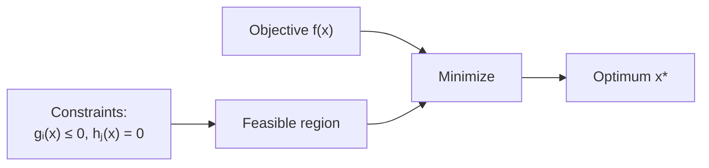
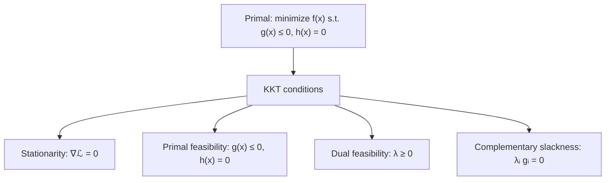

# 4 - Optimization, Lagrangians, KKT, and Duality

[toc]

> **TL;DR:** Almost every ML algorithm boils down to *minimize a loss subject to constraints*. Unconstrained problems are solved by setting the gradient to zero (or running gradient descent). Constrained problems are solved by *Lagrangian* methods: pack the constraints into multipliers, then apply the *KKT* conditions to extract the optimum. *Duality* gives a parallel optimization problem that's often easier — and it's the entire reason SVMs are tractable and kernels work.

## Vocabulary

**Optimization problem**

```math
\min_{x \in \mathcal{X}} f(x) \quad \text{s.t.}\ g_i(x) \le 0,\ h_j(x) = 0
```

Find an $x$ that minimizes the *objective* $f$ subject to inequality and equality *constraints*.

---

**Feasible set**

The set of $x$ satisfying every constraint. Optimization only considers candidates inside it.

---

**Convex function**

```math
f(\alpha x + (1-\alpha)y) \le \alpha f(x) + (1-\alpha) f(y),\ \forall \alpha \in [0,1]
```

Lies on or below any chord connecting two of its graph points. Local minima are global minima.

---

**Gradient**

```math
\nabla f(x) = \left[\frac{\partial f}{\partial x_1}, \ldots, \frac{\partial f}{\partial x_d}\right]^\top
```

Direction of steepest ascent. The single most important object in ML optimization.

---

**Hessian**

```math
H_{ij} = \frac{\partial^2 f}{\partial x_i \partial x_j}
```

Second-derivative matrix. Convex iff $H$ is positive semidefinite at every point.

---

**Lagrangian**

```math
\mathcal{L}(x, \lambda, \mu) = f(x) + \sum_i \lambda_i g_i(x) + \sum_j \mu_j h_j(x)
```

Combines objective and constraints into one function. $\lambda \ge 0$ for inequalities; $\mu$ unconstrained for equalities.

---

**KKT conditions**

A set of four conditions (stationarity, primal feasibility, dual feasibility, complementary slackness) that characterize optima of constrained problems.

---

**Dual function / dual problem**

```math
g(\lambda, \mu) = \inf_x \mathcal{L}(x, \lambda, \mu), \quad \max_{\lambda \ge 0, \mu} g(\lambda, \mu)
```

The Lagrangian minimized over $x$ gives a concave function of $(\lambda, \mu)$. Maximizing it gives a *lower bound* on the primal optimum — and equals the primal at the optimum if *strong duality* holds.

## Intuition

Optimization in machine learning is the math of "given a function and some rules, find the smallest value." Empirical risk minimization, MLE, MAP, SVMs, neural networks — all run the same algorithm: define a loss, define constraints (sometimes), find the minimum. The art is in knowing *which kind* of problem you have.

Three broad regimes. *Unconstrained convex* problems (squared loss, logistic loss, ridge regression) are easy: the gradient at the minimum is zero, and gradient descent always finds the global optimum. *Unconstrained non-convex* (neural networks) is harder: there are many local minima and saddle points, but in practice gradient descent finds good solutions anyway. *Constrained convex* (SVM, max-entropy, quadratic programming) demands the Lagrangian / KKT machinery — that's the meat of this note.

Duality is the surprise twist. For convex problems with a few mild conditions, the *primal* problem (minimize over $x$, with constraints) has an equivalent *dual* problem (maximize over multipliers $\lambda$). The dual often has fewer variables, simpler structure, and — in the SVM case — a form that admits the *kernel trick*. Every modern treatment of SVM goes through duality, not because the primal is wrong, but because the dual is more useful.

## Unconstrained optimization

### Necessary conditions

For a differentiable $f$, any local minimum $x^*$ satisfies:

```math
\nabla f(x^*) = 0 \quad \text{(first-order necessary)}
```

```math
H(x^*) \succeq 0 \quad \text{(second-order necessary)}
```

For *convex* $f$, the first-order condition is also sufficient — there are no saddles, no spurious local minima.

### Gradient descent

```math
x_{k+1} = x_k - \eta \nabla f(x_k)
```

The single most-used algorithm in ML. Step in the direction of steepest descent with step size $\eta$.

```python
import numpy as np

def gradient_descent(f, grad_f, x0: np.ndarray,
                      lr: float = 0.1, n_steps: int = 200,
                      tol: float = 1e-8) -> tuple[np.ndarray, list[float]]:
    """Vanilla gradient descent on f. Returns final x and loss history."""
    x = x0.astype(np.float64)
    history: list[float] = []
    for _ in range(n_steps):
        g = grad_f(x)
        x = x - lr * g
        history.append(f(x))
        if np.linalg.norm(g) < tol:
            break
    return x, history

# Quadratic example: f(x) = (x_1 - 2)^2 + (x_2 + 3)^2, minimum at (2, -3)
f      = lambda x: (x[0] - 2)**2 + (x[1] + 3)**2
grad_f = lambda x: np.array([2*(x[0] - 2), 2*(x[1] + 3)])

x_star, hist = gradient_descent(f, grad_f, np.zeros(2), lr=0.1, n_steps=100)
print(f"Found minimum near {x_star.round(3)}, value {hist[-1]:.2e}")
```

### Step-size choices

- **Constant**: simple; need to know a good $\eta$.
- **Line search**: pick $\eta$ each step to satisfy Armijo / Wolfe conditions. Reliable but expensive.
- **Adaptive (Adagrad, RMSProp, Adam)**: per-parameter step sizes from running gradient statistics. The default for deep learning.

### Beyond first order

Newton's method uses curvature:

```math
x_{k+1} = x_k - H(x_k)^{-1} \nabla f(x_k)
```

Quadratic convergence near the optimum but $O(d^3)$ per step from the Hessian inverse — usable only for low-dimensional problems. Quasi-Newton methods (BFGS, L-BFGS) approximate $H^{-1}$ from gradient differences and dominate medium-scale ML optimization.

## Constrained optimization

### The picture



You're looking for the lowest point of the surface $f$, but only counting candidates inside the feasible region. The optimum is either an *interior* minimum of $f$ (constraints inactive) or sits on a constraint boundary.

### Lagrangian

```math
\mathcal{L}(x, \lambda, \mu) = f(x) + \sum_i \lambda_i g_i(x) + \sum_j \mu_j h_j(x)
```

The multipliers $\lambda_i \ge 0$ (inequality) and $\mu_j \in \mathbb{R}$ (equality) penalize constraint violation. At the optimum, the Lagrangian is *stationary in $x$*.

### KKT conditions

For a problem with differentiable $f$, $g_i$, $h_j$ and appropriate regularity, *necessary* conditions for $(x^*, \lambda^*, \mu^*)$ to be optimal are:

```math
\begin{aligned}
&\text{Stationarity:} && \nabla_x \mathcal{L}(x^*, \lambda^*, \mu^*) = 0 \\
&\text{Primal feasibility:} && g_i(x^*) \le 0, \quad h_j(x^*) = 0 \\
&\text{Dual feasibility:} && \lambda^*_i \ge 0 \\
&\text{Complementary slackness:} && \lambda^*_i\, g_i(x^*) = 0
\end{aligned}
```

The complementary-slackness condition is the most distinctive: each $\lambda_i \cdot g_i$ is zero, so either the constraint is *active* ($g_i = 0$, $\lambda_i$ can be anything $\ge 0$) or the multiplier is zero ($\lambda_i = 0$, constraint is inactive). This is the algebraic engine that picks which constraints are "binding" at the optimum.

For convex problems with constraint qualification (Slater's condition: strict feasibility), KKT is also *sufficient*.



### A worked example — quadratic program with one inequality

Problem:

```math
\min_x\ x^2 \quad \text{s.t.}\ x \ge 1
```

Convert: $g(x) = 1 - x \le 0$. Lagrangian:

```math
\mathcal{L}(x, \lambda) = x^2 + \lambda(1 - x)
```

Stationarity:

```math
\frac{\partial \mathcal{L}}{\partial x} = 2x - \lambda = 0 \Rightarrow x = \lambda/2
```

Complementary slackness: $\lambda(1 - x) = 0$ — either $\lambda = 0$ (constraint inactive) or $x = 1$ (constraint active).

- Case $\lambda = 0$ → $x = 0$. Check primal feasibility: $x \ge 1$? No → infeasible.
- Case $x = 1$ → $\lambda = 2$. Check dual feasibility: $\lambda \ge 0$ ✓.

Optimum: $x^* = 1$, $\lambda^* = 2$, objective $= 1$. The constraint is active; the multiplier is the "shadow price" of relaxing it.

## Duality

Define the **dual function** by minimizing the Lagrangian in $x$:

```math
g(\lambda, \mu) = \inf_x \mathcal{L}(x, \lambda, \mu)
```

$g$ is always *concave* in $(\lambda, \mu)$, regardless of whether the primal is convex. The **dual problem** maximizes it:

```math
\max_{\lambda \ge 0, \mu}\ g(\lambda, \mu)
```

### Weak vs strong duality

```math
\max_{\lambda \ge 0, \mu} g(\lambda, \mu) \le \min_x f(x) \quad \text{(weak duality, always)}
```

```math
\max g = \min f \quad \text{(strong duality, when Slater's condition + convexity)}
```

When strong duality holds, you can solve the dual and recover the primal optimum from the multipliers. The dual often has lower dimension or simpler constraints than the primal — *that's* the win.

### Why SVMs love duality

The primal SVM:

```math
\min_{\mathbf{w}, b}\ \frac{1}{2}\|\mathbf{w}\|^2 \quad \text{s.t.}\ y_i(\mathbf{w}^\top x_i + b) \ge 1
```

has variables $(\mathbf{w}, b) \in \mathbb{R}^{d+1}$ — scales with feature dimension. The dual:

```math
\max_{\alpha \ge 0}\ \sum_i \alpha_i - \frac{1}{2}\sum_{i,j} \alpha_i \alpha_j y_i y_j (x_i^\top x_j) \quad \text{s.t.}\ \sum_i \alpha_i y_i = 0
```

has variables $\alpha \in \mathbb{R}^n$ — scales with *training-set size*, not feature dimension. The data appears only through inner products $x_i^\top x_j$, which means we can replace them with any positive-definite kernel $K(x_i, x_j)$ without ever materializing $\phi(x_i)$ in a high-dimensional feature space. This is the **kernel trick**, and it depends on the SVM being expressed in its dual form. See [SVM and Kernels](../2-supervised-learning/6-svm-and-kernels.md).

## Optimization in code

```python
from scipy.optimize import minimize
import numpy as np

# Constrained problem: minimize x1^2 + x2^2 subject to x1 + x2 >= 1
f      = lambda x: x[0]**2 + x[1]**2
grad_f = lambda x: np.array([2*x[0], 2*x[1]])

# scipy 'SLSQP' supports inequality and equality constraints
constraints = [{"type": "ineq",
                "fun":  lambda x: x[0] + x[1] - 1,           # ≥ 0
                "jac":  lambda x: np.array([1.0, 1.0])}]

res = minimize(f, x0=np.array([0.0, 0.0]), jac=grad_f,
               constraints=constraints, method="SLSQP")
print(f"x* = {res.x.round(3)}, f* = {res.fun:.3f}")
# x* = (0.5, 0.5), f* = 0.5 — constraint is active
# Lagrange multiplier from KKT: λ = 1
```

For convex QPs (SVM, LASSO, ridge with constraints), `cvxpy` is the production-quality interface; for very large scale, specialized solvers (LIBSVM, scikit-learn's coordinate-descent variants) dominate.

## In practice

> [!TIP]
> **Reach for convexity whenever possible.** A convex problem has a unique global minimum (modulo flat regions), well-understood gradient-descent convergence, and a dual that strong duality applies to. Many ML methods (logistic regression, linear SVM, lasso, ridge) are convex by construction. Non-convex methods (neural networks) trade theory for expressive power; both are useful.

> [!IMPORTANT]
> KKT is *necessary* under mild regularity but *sufficient* only under convexity + constraint qualification. For non-convex problems, KKT points can be saddle points, local maxima, or local minima. Always check the second-order condition or use a method (BFGS, trust-region) that guards against saddles.

> [!CAUTION]
> The bare statement "the optimum is where the gradient is zero" is wrong inside constraint boundaries. On an active constraint, $\nabla f$ is *not* zero; the gradient of the *Lagrangian* is. Confusing these is the #1 source of bugs in custom optimization code.

Optimization is the operating layer of ML. Every learning algorithm, every fine-tuning run, every hyperparameter search invokes some flavor of it. Knowing the four KKT conditions and the duality theorem isn't pedantic theory; it's the difference between using SVMs as a black box and understanding why they work.

## Pitfalls

- **"Gradient descent always converges to the global minimum."** Only for convex $f$ (and not always at a useful rate). For non-convex objectives, it converges to a *critical point* — which could be a saddle.
- **"More iterations of gradient descent always help."** With a too-large step size, GD oscillates or diverges. With a too-small step size, it crawls. Tune $\eta$ first.
- **"All constraints in the Lagrangian look the same."** They don't: $\lambda_i \ge 0$ for inequalities; $\mu_j$ unconstrained for equalities. Flipping a constraint's sign without flipping its multiplier sign produces wrong KKT conditions.
- **"Dual = primal."** Only when strong duality holds. Without convexity (or with infeasible problems), there's a *duality gap*: dual optimum is strictly less than primal optimum.
- **"KKT multiplier 0 means the constraint doesn't matter."** It means the constraint is *inactive at the optimum*. It still defines the feasible region — without it the optimum might be elsewhere.

## Exercises

### Exercise 1 — Convexity check

For each function, determine if it is convex on the indicated domain.

(a) $f(x) = x^4 - 2x^2$ on $\mathbb{R}$
(b) $f(x) = e^x$ on $\mathbb{R}$
(c) $f(x, y) = x^2 + y^2 + 2xy$ on $\mathbb{R}^2$
(d) $f(x) = \log x$ on $(0, \infty)$

#### Solution

(a) Hessian $f''(x) = 12x^2 - 4$. Negative when $|x| < 1/\sqrt{3}$, so **not convex**. (It's the classic double-well.)

(b) $f''(x) = e^x > 0$ everywhere → **convex** (strictly).

(c) Hessian $H = \begin{pmatrix} 2 & 2 \\ 2 & 2 \end{pmatrix}$. Eigenvalues 4 and 0. Positive semidefinite → **convex** (not strict). The function is actually $(x + y)^2$, which is convex but flat along the line $y = -x$.

(d) $f''(x) = -1/x^2 < 0$. **Concave** (so $-\log x$ is convex — useful for entropy / KL).

---

### Exercise 2 — KKT for a least-squares-with-norm-constraint

Solve:

```math
\min_\mathbf{w}\ \|X\mathbf{w} - y\|^2 \quad \text{s.t.}\ \|\mathbf{w}\|^2 \le R^2
```

via Lagrangian / KKT. Relate it to ridge regression.

#### Solution

Lagrangian:

```math
\mathcal{L}(\mathbf{w}, \lambda) = \|X\mathbf{w} - y\|^2 + \lambda(\|\mathbf{w}\|^2 - R^2)
```

Stationarity:

```math
\nabla_\mathbf{w} \mathcal{L} = 2X^\top(X\mathbf{w} - y) + 2\lambda \mathbf{w} = 0
```

```math
\Rightarrow \hat{\mathbf{w}} = (X^\top X + \lambda I)^{-1} X^\top y
```

This is **ridge regression** with regularization strength $\lambda$. KKT also says: if $\|\hat{\mathbf{w}}\|^2 < R^2$ (constraint inactive), $\lambda = 0$ and $\hat{\mathbf{w}}$ is the OLS solution; if $\|\hat{\mathbf{w}}\|^2 = R^2$ (constraint active), $\lambda > 0$. So the unconstrained ridge with strength $\lambda$ corresponds to a constrained problem with some specific $R$ — they're two views of the same trade-off. See [Linear Regression](../2-supervised-learning/4-linear-regression.md).

---

### Exercise 3 — Derive SVM primal from KKT

Show that for the hard-margin SVM primal $\min \frac{1}{2}\|\mathbf{w}\|^2$ s.t. $y_i(\mathbf{w}^\top x_i + b) \ge 1$, the optimal $\mathbf{w}^*$ is a *sparse* combination of training points: $\mathbf{w}^* = \sum_i \alpha_i^* y_i x_i$, where only points on the margin have $\alpha_i^* > 0$.

#### Solution

Lagrangian:

```math
\mathcal{L} = \frac{1}{2}\|\mathbf{w}\|^2 - \sum_i \alpha_i (y_i(\mathbf{w}^\top x_i + b) - 1), \quad \alpha_i \ge 0
```

Stationarity:

```math
\nabla_\mathbf{w} \mathcal{L} = \mathbf{w} - \sum_i \alpha_i y_i x_i = 0 \Rightarrow \mathbf{w}^* = \sum_i \alpha_i y_i x_i
```

Complementary slackness:

```math
\alpha_i \big( y_i(\mathbf{w}^\top x_i + b) - 1\big) = 0
```

So for each point, *either* $\alpha_i = 0$ (point inside the margin or strictly outside, doesn't influence $\mathbf{w}$) *or* $y_i(\mathbf{w}^\top x_i + b) = 1$ (point sits *exactly* on the margin). The points with $\alpha_i > 0$ are the **support vectors**, typically a small subset of training data. This sparsity is the algorithmic origin of the SVM's name and its computational advantage. See [SVM and Kernels](../2-supervised-learning/6-svm-and-kernels.md).

---

### Exercise 4 — Step-size disaster

A team trains a model with gradient descent. Loss plummets for ~10 steps, then explodes to NaN. What happened, and what's the simplest fix?

#### Solution

Step size is too large. The loss-surface curvature in some direction is larger than $2/\eta$ (the GD stability threshold for that direction), so updates *overshoot* the minimum and amplify rather than damp. Once magnitudes grow beyond float-range, NaN.

Fixes, in order of cheapness:

1. **Halve the learning rate.** First debug step.
2. **Gradient clipping** (cap $\|\nabla\|$ at a constant). Common in RNN / Transformer training.
3. **Warmup schedule** — start with a small $\eta$ and linearly increase. Lets the network find a low-curvature basin before stepping fast.
4. **Switch to an adaptive optimizer** (Adam, AdamW). Per-parameter learning rates handle uneven curvature automatically.
5. **Add weight decay / regularization** if the loss isn't already strongly convex — penalizes the kind of weight blowup that creates unstable curvature.

The diagnostic clue: loss going *down then up* (rather than up from step 1) almost always points to step-size overshoot, not gradient computation bugs.

## Sources

- Ramakrishnan, G. & Nagesh, A. (2011). *CS725: Foundations of Machine Learning — Lecture Notes*. IIT Bombay. §9.
- Boyd, S. & Vandenberghe, L. (2004). *Convex Optimization*. Cambridge. https://web.stanford.edu/~boyd/cvxbook/
- Nocedal, J. & Wright, S. J. (2006). *Numerical Optimization* (2nd ed.). Springer.
- Bertsekas, D. P. (1999). *Nonlinear Programming* (2nd ed.). Athena Scientific.
- Karush, W. (1939). *Minima of Functions of Several Variables with Inequalities as Side Constraints*. MSc thesis, University of Chicago.
- Kuhn, H. W. & Tucker, A. W. (1951). *Nonlinear Programming*. Berkeley Symposium.

## Related

- [1 - What is ML and Version Space](./1-what-is-ml-and-version-space.md)
- [3 - Estimation and Maximum Likelihood](./3-estimation-and-mle.md)
- [5 - Linear Algebra Essentials](./5-linear-algebra-essentials.md)
- [Linear Regression](../2-supervised-learning/4-linear-regression.md)
- [SVM and Kernels](../2-supervised-learning/6-svm-and-kernels.md)
- [Maximum Entropy and Graphical Models](../3-unsupervised-and-beyond/4-maximum-entropy-and-graphical-models.md)
