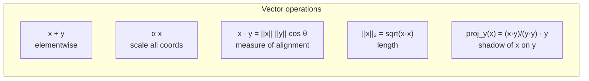
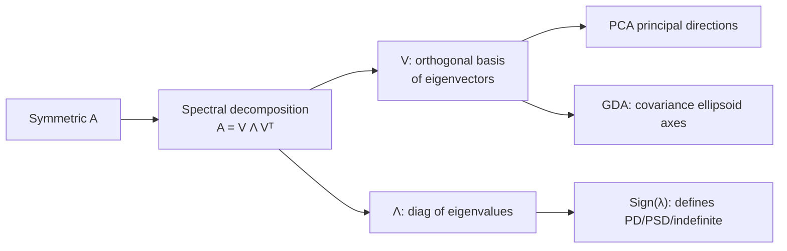
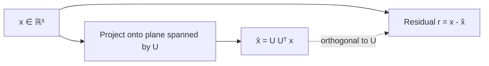

# 5 - Linear Algebra Essentials for ML

[toc]

> **TL;DR:** Linear algebra is the calculus of ML. *Vectors* are data points; *matrices* are linear maps; *eigen-decompositions* and *SVD* reveal the geometry hidden in matrices. *Inner products* measure similarity, *projections* measure how much one vector "points along" another, and *positive (semi)definiteness* is the property that makes covariances valid and quadratic forms have minima. Get fluent in this layer once and every ML algorithm becomes notation manipulation.

## Vocabulary

**Vector**

```math
\mathbf{x} \in \mathbb{R}^d
```

A column of $d$ real numbers. Geometrically: an arrow from the origin to a point in $\mathbb{R}^d$.

---

**Inner product / dot product**

```math
\langle \mathbf{x}, \mathbf{y} \rangle = \mathbf{x}^\top \mathbf{y} = \sum_{i=1}^d x_i y_i
```

Measures how aligned two vectors are. Equals $\|\mathbf{x}\|\|\mathbf{y}\|\cos\theta$.

---

**Norm**

```math
\|\mathbf{x}\|_2 = \sqrt{\mathbf{x}^\top \mathbf{x}}
```

Length of a vector. Other useful norms: $\|\mathbf{x}\|_1 = \sum |x_i|$ (sum of absolute values), $\|\mathbf{x}\|_\infty = \max |x_i|$.

---

**Matrix**

```math
A \in \mathbb{R}^{m \times n}
```

A linear map from $\mathbb{R}^n$ to $\mathbb{R}^m$. Equivalently, a stack of $m$ row-vectors or $n$ column-vectors.

---

**Eigenvalue / eigenvector**

```math
A \mathbf{v} = \lambda \mathbf{v}, \quad \mathbf{v} \neq 0
```

Directions that the matrix only *scales* (doesn't rotate). $\lambda$ is the scaling factor.

---

**Symmetric matrix**

```math
A = A^\top
```

Has all-real eigenvalues and orthogonal eigenvectors. Most matrices in ML (covariances, Gram matrices, kernel matrices) are symmetric.

---

**Positive (semi)definite**

```math
A \succ 0 \iff \mathbf{x}^\top A \mathbf{x} > 0 \ \forall \mathbf{x} \neq 0 \quad (\text{positive definite, PD})
```

```math
A \succeq 0 \iff \mathbf{x}^\top A \mathbf{x} \ge 0 \ \forall \mathbf{x} \quad (\text{positive semidefinite, PSD})
```

Equivalent to "all eigenvalues > 0" (PD) or "all eigenvalues ≥ 0" (PSD). The property that guarantees a quadratic form has a unique minimum.

---

**Singular Value Decomposition (SVD)**

```math
A = U \Sigma V^\top, \quad U \in \mathbb{R}^{m \times m},\ V \in \mathbb{R}^{n \times n},\ \Sigma \in \mathbb{R}^{m \times n}
```

Any real matrix decomposes into a rotation, a scaling, and another rotation. The most useful matrix factorization in ML.

## Intuition

Pretty much every ML quantity you'll touch is either a vector, a matrix, or built from them. A dataset is a matrix $X$ of $n$ rows and $d$ columns; a model is often a vector of weights $\mathbf{w}$; a kernel matrix collects pairwise similarities. Computing things like "the angle between two data points" or "the variance along a direction" turns into matrix-vector arithmetic — and matrix-vector arithmetic has fast implementations on GPUs, which is *the* reason ML scales the way it does.

The two big results from this chapter are the *eigen-decomposition* of symmetric matrices and the *SVD* of arbitrary matrices. Both decompose a matrix into a basis of "natural directions" along which the matrix acts simply (just scaling). Once you know those directions, almost everything else falls out: PCA is "project onto top SVD components," ridge regression has a closed form in terms of the SVD of $X$, GDA decision boundaries are determined by the eigenstructure of class covariances. Linear algebra is the lens that turns geometry into arithmetic.

Positive semidefiniteness is the underrated star. Covariance matrices are PSD by construction; valid kernel matrices are PSD; loss-function Hessians at minima are PSD; ridge-regularized normal equations always have a unique solution because adding $\lambda I$ to a PSD matrix produces a PD one. Half the time when a numerical method fails ("not invertible," "no positive variance"), the root cause is a matrix that *should* have been PD but isn't.

## Vectors and basic operations



### Useful identities

```math
\|\mathbf{x} + \mathbf{y}\|^2 = \|\mathbf{x}\|^2 + 2\mathbf{x}^\top \mathbf{y} + \|\mathbf{y}\|^2
```

```math
\mathbf{x}^\top A \mathbf{y} = (\mathbf{x}^\top A) \mathbf{y} = \mathbf{x}^\top (A \mathbf{y})
```

```math
(A B)^\top = B^\top A^\top
```

```math
\text{trace}(AB) = \text{trace}(BA) \quad \text{(cyclic property)}
```

## Matrix views — three ways to multiply

For $C = AB$ with $A \in \mathbb{R}^{m \times k}$, $B \in \mathbb{R}^{k \times n}$:

```math
C_{ij} = \sum_{p=1}^{k} A_{ip} B_{pj}
```

Three equivalent ways to read this:

1. **Inner-product view**: $C_{ij}$ = dot product of row $i$ of $A$ and column $j$ of $B$.
2. **Column view**: column $j$ of $C$ = $A \cdot (\text{column } j \text{ of } B)$. So multiplying by $A$ on the right computes a linear combination of $A$'s columns.
3. **Outer-product view**: $C = \sum_p A_{:p} B_{p:}^\top$ — sum of $k$ rank-1 matrices.

Each view is the natural one for some operation. Inner-product → Gram matrices. Column → linear systems. Outer-product → SVD / PCA decomposition.

## Eigen-decomposition of symmetric matrices

For symmetric $A \in \mathbb{R}^{d \times d}$, there exist real eigenvalues $\lambda_1, \ldots, \lambda_d$ and orthonormal eigenvectors $\mathbf{v}_1, \ldots, \mathbf{v}_d$ such that:

```math
A = V \Lambda V^\top = \sum_i \lambda_i \mathbf{v}_i \mathbf{v}_i^\top
```

with $V = [\mathbf{v}_1 \mid \ldots \mid \mathbf{v}_d]$ orthogonal ($V^\top V = I$) and $\Lambda = \text{diag}(\lambda_1, \ldots, \lambda_d)$. This is the **spectral theorem**.



### Eigen-decomposition in code

```python
import numpy as np

# A symmetric matrix (e.g., a covariance)
np.random.seed(0)
X = np.random.randn(200, 4)
C = np.cov(X, rowvar=False)              # 4x4 symmetric

# eigh is specialized for symmetric matrices: real eigenvalues, orthonormal eigenvectors
eigvals, eigvecs = np.linalg.eigh(C)
print("eigenvalues (ascending):", eigvals.round(3))
print("V is orthogonal? ||VᵀV - I|| =", np.linalg.norm(eigvecs.T @ eigvecs - np.eye(4)))

# Reconstruct
C_recon = eigvecs @ np.diag(eigvals) @ eigvecs.T
print("reconstruction error:", np.linalg.norm(C - C_recon))
```

### Positive (semi)definiteness via eigenvalues

```math
A \succeq 0 \iff \text{all eigenvalues of } A \ge 0
```

The quadratic form $\mathbf{x}^\top A \mathbf{x}$ is geometric:

- $A \succ 0$: bowl-shaped, unique minimum at origin.
- $A \succeq 0$ (not PD): flat in some directions ($\lambda = 0$).
- $A$ indefinite: saddle (some positive, some negative eigenvalues) — local minimum is *not* guaranteed.

## Singular Value Decomposition

For *any* real $A \in \mathbb{R}^{m \times n}$:

```math
A = U \Sigma V^\top
```

with $U \in \mathbb{R}^{m \times m}$, $V \in \mathbb{R}^{n \times n}$ orthogonal, and $\Sigma$ a diagonal matrix of non-negative *singular values* $\sigma_1 \ge \sigma_2 \ge \ldots \ge 0$.

Equivalent statements:

- Columns of $U$ are eigenvectors of $A A^\top$.
- Columns of $V$ are eigenvectors of $A^\top A$.
- $\sigma_i^2$ are the eigenvalues of either.
- Best rank-$k$ approximation of $A$: keep the top-$k$ singular values (Eckart–Young).

```math
A_k = \sum_{i=1}^k \sigma_i u_i v_i^\top \quad \text{(rank-} k\text{ truncation)}
```

This is the engine behind PCA, latent-semantic analysis, low-rank model compression, and many recommender-system methods.

```python
A = np.random.randn(100, 50)
U, s, Vt = np.linalg.svd(A, full_matrices=False)
print("singular values (top 5):", s[:5].round(3))

# Rank-5 approximation
k = 5
A5 = U[:, :k] @ np.diag(s[:k]) @ Vt[:k, :]
print("Frobenius error of rank-5 approximation:", np.linalg.norm(A - A5))
```

## Projections — the geometric workhorse

**Projection onto a line** spanned by unit vector $\mathbf{u}$:

```math
\text{proj}_\mathbf{u}(\mathbf{x}) = (\mathbf{u}^\top \mathbf{x})\mathbf{u}
```

**Projection onto a subspace** with orthonormal basis matrix $U$:

```math
\text{proj}_U(\mathbf{x}) = U U^\top \mathbf{x}
```

The matrix $P = U U^\top$ is idempotent ($P^2 = P$) and symmetric. Projections are everywhere: least-squares projects $\mathbf{y}$ onto the column space of $X$; PCA projects data onto top principal components; regularization geometry uses projections constantly.



## Why this matters for ML

### Covariance matrices

```math
\Sigma = \frac{1}{n-1} (X - \bar{X})^\top (X - \bar{X})
```

Symmetric, PSD. Eigenvectors are the principal directions of variance; eigenvalues are the variances along those directions. This is the foundation of PCA and Gaussian-based classifiers.

### Normal equations for linear regression

```math
\hat{\mathbf{w}} = (X^\top X)^{-1} X^\top y
```

$X^\top X$ is the *Gram matrix* (symmetric, PSD). It's invertible iff $X$ has full column rank — i.e., features are linearly independent. With redundant features ($X^\top X$ singular), you need regularization, pseudoinverse (Moore-Penrose), or SVD.

### Kernel matrices

For a kernel $K(x_i, x_j)$, the *Gram* (kernel) matrix $K_{ij} = K(x_i, x_j)$ must be PSD for the kernel to correspond to an inner product in some feature space. This is **Mercer's condition**, and it's why arbitrary similarity functions can't be plugged into a kernel SVM — they have to produce PSD Gram matrices.

> [!IMPORTANT]
> Numerical PSD is finicky. A matrix that's PSD in theory can have small negative eigenvalues from floating-point error. Cholesky factorization fails; SVD-based code keeps working. When you see "matrix not PSD" errors, add a small jitter ($\epsilon I$ for tiny $\epsilon$) before factoring; in clean math it changes the result negligibly.

## Useful matrix calculus identities

The ones you'll reach for repeatedly in deriving ML gradients:

```math
\nabla_\mathbf{x} (\mathbf{a}^\top \mathbf{x}) = \mathbf{a}
```

```math
\nabla_\mathbf{x} (\mathbf{x}^\top A \mathbf{x}) = (A + A^\top)\mathbf{x} = 2A\mathbf{x} \ (A \text{ symmetric})
```

```math
\nabla_\mathbf{w}\|y - X\mathbf{w}\|^2 = -2 X^\top (y - X\mathbf{w})
```

```math
\nabla_A \log |A| = (A^{-1})^\top \quad (A \text{ invertible})
```

```math
\nabla_A \text{trace}(A^\top B) = B
```

Once you have these, deriving the closed-form solution for least squares, ridge regression, GDA, and many likelihood-based methods is mechanical.

## In practice

> [!TIP]
> **Never invert a matrix to solve a linear system.** Use `np.linalg.solve(A, b)` (LU factorization) instead of `np.linalg.inv(A) @ b`. Faster, more numerically stable, and forces you to think about whether $A$ is invertible at all. For PSD systems, prefer `scipy.linalg.cho_solve` (Cholesky) — twice as fast.

> [!CAUTION]
> "Eigen-decomposition" and "SVD" are *not* the same. For symmetric PSD matrices they essentially coincide. For asymmetric or non-square matrices, only SVD applies. When in doubt, reach for SVD — it always exists and is numerically stable.

> [!NOTE]
> Large-scale ML rarely materializes full matrix decompositions. Methods like *randomized SVD* and *Lanczos iteration* compute only the top $k$ singular vectors in $O(mnk)$ time, vastly cheaper than full SVD for $k \ll \min(m, n)$. `scipy.sparse.linalg.svds` and `sklearn.decomposition.TruncatedSVD` are the practical tools.

The right way to learn linear algebra for ML is *with the algorithms*, not in isolation. Every later note in this series leans on something from here — PCA in [Feature Selection](../3-unsupervised-and-beyond/5-feature-selection-and-dimensionality-reduction.md), the kernel matrix in [SVM](../2-supervised-learning/6-svm-and-kernels.md), covariance ellipsoids in [GDA](../2-supervised-learning/3-gaussian-discriminant-analysis.md), normal equations in [Regression](../2-supervised-learning/4-linear-regression.md).

## Pitfalls

- **"Inverting a matrix is fine."** Use `solve`, not `inv`. The numerical accuracy and runtime differences add up.
- **"All matrices are diagonalizable."** Only some. Symmetric matrices always are; non-symmetric ones may not be. Use SVD when you need a guaranteed decomposition.
- **"Higher condition number is just a number."** It quantifies how much small input perturbations get amplified. $\kappa(A) > 10^{10}$ means single-precision arithmetic gives you ~6 reliable digits of $A^{-1}b$ — often not enough.
- **"My covariance has a negative eigenvalue!"** Numerical artifact. The math says it can't, but float64 sometimes disagrees with itself. Add $\epsilon I$ for some small $\epsilon$ and move on.
- **"The Frobenius norm and 2-norm are the same."** Frobenius is $\sqrt{\sum a_{ij}^2}$; 2-norm is the largest singular value. They're different metrics, and code that uses the wrong one silently produces wrong answers.

## Exercises

### Exercise 1 — Compute a projection by hand

Project $\mathbf{x} = (3, 4, 0)^\top$ onto the line spanned by $\mathbf{u} = (1, 1, 0)^\top$. Also compute the residual.

#### Solution

Normalize $\mathbf{u}$: $\hat{\mathbf{u}} = \mathbf{u} / \|\mathbf{u}\| = (1/\sqrt{2}, 1/\sqrt{2}, 0)^\top$.

```math
\text{proj}_\mathbf{u}(\mathbf{x}) = (\hat{\mathbf{u}}^\top \mathbf{x})\hat{\mathbf{u}} = \frac{3 + 4 + 0}{\sqrt{2}} \cdot \hat{\mathbf{u}} = \frac{7}{\sqrt{2}} \cdot \frac{1}{\sqrt{2}}(1, 1, 0)^\top = (3.5, 3.5, 0)^\top
```

Residual:

```math
\mathbf{r} = \mathbf{x} - \text{proj}_\mathbf{u}(\mathbf{x}) = (3 - 3.5, 4 - 3.5, 0)^\top = (-0.5, 0.5, 0)^\top
```

Sanity check: $\mathbf{r}^\top \mathbf{u} = -0.5 + 0.5 = 0$ ✓ (residual orthogonal to projection direction).

---

### Exercise 2 — Eigenvalues of a covariance

A 2D dataset has covariance $\Sigma = \begin{pmatrix} 4 & 2 \\ 2 & 1 \end{pmatrix}$. Compute eigenvalues, eigenvectors, and interpret geometrically.

#### Solution

Characteristic equation:

```math
\det(\Sigma - \lambda I) = (4 - \lambda)(1 - \lambda) - 4 = \lambda^2 - 5\lambda = \lambda(\lambda - 5) = 0
```

So $\lambda_1 = 5, \lambda_2 = 0$.

Eigenvectors:
- $\lambda_1 = 5$: $(4-5)v_1 + 2 v_2 = 0 \Rightarrow v_2 = v_1 / 2$. Direction $(2, 1)^\top / \sqrt{5}$.
- $\lambda_2 = 0$: $4 v_1 + 2 v_2 = 0 \Rightarrow v_2 = -2 v_1$. Direction $(1, -2)^\top / \sqrt{5}$.

**Interpretation.** All variance lies along the direction $(2, 1)$ — the data is on a line. PCA's first principal component captures everything; the second axis has zero variance, meaning the rank of the data matrix is 1. Realistically you wouldn't see exact zero variance, but small singular values indicate "approximate redundancy" you should consider compressing away.

---

### Exercise 3 — SVD for low-rank compression

A grayscale image is an $800 \times 600$ matrix. You want to store an approximation using ≤ 10% of the original size. How would you use SVD? Compute the rank $k$ that meets the budget.

#### Solution

Storing the rank-$k$ truncated SVD requires: $U_{:, 1:k}$ ($800 \times k$) + $\sigma_{1:k}$ ($k$) + $V_{:, 1:k}^\top$ ($k \times 600$). Total = $800k + k + 600k = 1401k$ values.

Original storage: $800 \times 600 = 480{,}000$ values. 10% budget = $48{,}000$.

```math
1401 k \le 48{,}000 \Rightarrow k \le 34.3 \Rightarrow k = 34
```

So a rank-34 SVD approximation fits the budget. Image quality depends on the singular-value spectrum: natural images often have heavy-tailed spectra where the top 30–40 components capture 95%+ of energy, so rank-34 is usually visually faithful. This is the same idea as JPEG (which uses a DCT instead of SVD) and is the foundation of low-rank model compression for LLMs (LoRA — see [Post-Training and Fine-tuning](../../AI-Engineering/2-foundation-models/3-post-training-and-finetuning.md)).

---

### Exercise 4 — Cholesky for a sample drawing

You have a $3 \times 3$ symmetric PSD matrix $\Sigma$ and want to draw samples from $\mathcal{N}(0, \Sigma)$. Describe an algorithm using a Cholesky factorization.

#### Solution

1. Cholesky factor $\Sigma = L L^\top$ where $L$ is lower-triangular.
2. Draw $\mathbf{z} \sim \mathcal{N}(0, I)$ — three independent standard normals.
3. Set $\mathbf{x} = L \mathbf{z}$. Then $\mathbf{x}$ has covariance $L L^\top = \Sigma$.

```python
import numpy as np

def sample_mvn(Sigma: np.ndarray, n: int = 1000) -> np.ndarray:
    L = np.linalg.cholesky(Sigma)            # Σ = L Lᵀ
    z = np.random.standard_normal((Sigma.shape[0], n))
    return L @ z                              # columns are samples

Sigma = np.array([[2.0, 1.0, 0.5],
                  [1.0, 3.0, 0.2],
                  [0.5, 0.2, 1.0]])
samples = sample_mvn(Sigma, n=50_000)
print("empirical covariance:\n", np.cov(samples).round(3))
```

The empirical covariance should match $\Sigma$ to within sampling error. Cholesky is the standard tool for any Gaussian-from-Gaussian transformation; it's also the workhorse for Bayesian linear regression posteriors and Kalman filters.

## Sources

- Ramakrishnan, G. & Nagesh, A. (2011). *CS725: Foundations of Machine Learning — Lecture Notes*. IIT Bombay. §9.2.
- Strang, G. (2016). *Introduction to Linear Algebra* (5th ed.). Wellesley-Cambridge Press.
- Trefethen, L. N. & Bau, D. (1997). *Numerical Linear Algebra*. SIAM.
- Golub, G. H. & Van Loan, C. F. (2013). *Matrix Computations* (4th ed.). Johns Hopkins.
- Petersen, K. B. & Pedersen, M. S. (2012). *The Matrix Cookbook*. https://www.math.uwaterloo.ca/~hwolkowi/matrixcookbook.pdf

## Related

- [4 - Optimization and KKT](./4-optimization-and-kkt.md)
- [Linear Regression](../2-supervised-learning/4-linear-regression.md)
- [Gaussian Discriminant Analysis](../2-supervised-learning/3-gaussian-discriminant-analysis.md)
- [SVM and Kernels](../2-supervised-learning/6-svm-and-kernels.md)
- [Feature Selection and Dimensionality Reduction](../3-unsupervised-and-beyond/5-feature-selection-and-dimensionality-reduction.md)
