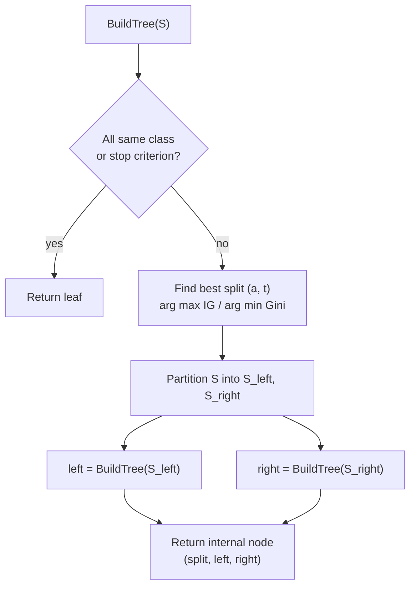
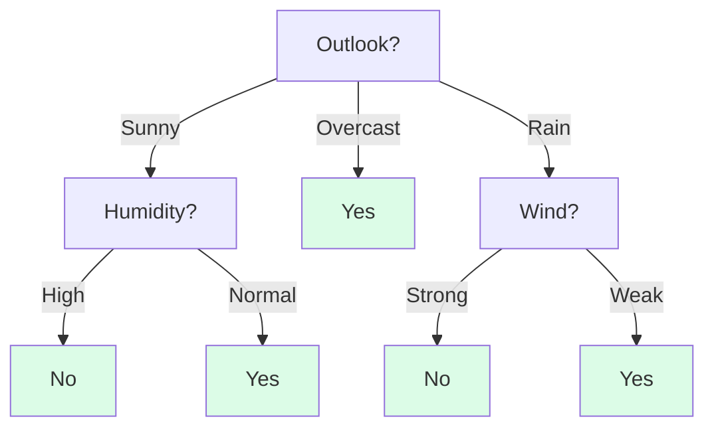
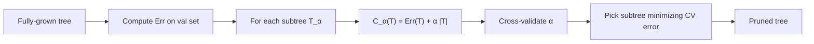

# 1 - Decision Trees: Splitting, Impurity, and Pruning

[toc]

> **TL;DR:** A decision tree is a piecewise-constant classifier (or regressor) that recursively partitions the input space by axis-aligned splits. Each split is chosen to maximally *reduce impurity* — entropy, Gini, or misclassification — in the resulting child nodes. Left unchecked, trees overfit horribly; *pruning* (pre- or post-hoc) is the rest of the algorithm. Trees are the substrate of every gradient-boosted ensemble, the most successful tabular method of the modern era.

## Vocabulary

**Decision tree**

A rooted directed tree where each internal node tests one attribute, each branch is one outcome of the test, and each leaf is a class label (classification) or a numeric value (regression).

---

**Split**

A test at an internal node that partitions training examples into children. For numeric features it's a threshold (`x_j <= t`); for categorical features it's a value match (`x_j = v`) or a partition of categories.

---

**Impurity**

A measure of how "mixed" a node's class labels are. Pure node (all same class) → impurity 0. Maximum at uniform mixture.

---

**Information gain**

```math
\text{IG}(S, A) = I(S) - \sum_v \frac{|S_v|}{|S|} I(S_v)
```

The reduction in impurity from splitting set $S$ on attribute $A$ (which partitions $S$ into $\{S_v\}$). The ID3 / C4.5 splitting criterion.

---

**Gini index**

```math
\text{Gini}(S) = 1 - \sum_c p_c^2
```

Probability that two random elements from $S$ have different labels. The CART splitting criterion.

---

**Entropy**

```math
H(S) = -\sum_c p_c \log_2 p_c
```

Bits needed to encode a label drawn from $S$'s class distribution. ID3 splitting criterion.

---

**Pruning**

The process of simplifying a fully-grown tree to combat overfitting. *Pre-pruning* halts splitting early; *post-pruning* grows the tree fully then collapses internal nodes.

---

**Greedy / recursive partitioning**

Tree construction picks the locally best split at each node, not the globally best tree (which is NP-hard).

## Intuition

A decision tree carves the feature space into axis-aligned rectangles, each labeled with a single prediction. The carving is done greedily: at the root, ask "which single feature, with which threshold, best separates my classes?" Recurse on each resulting child. The "best" split is whichever one purifies the children the most — formalized by entropy / Gini / misclassification.

What makes trees attractive: *interpretability* (every prediction traces a path of yes/no decisions), *no scaling needed* (splits are invariant under monotone feature transformations), *handles mixed feature types* (numeric and categorical natively), and *automatic feature interactions* (any path of length $k$ encodes a $k$-way interaction). What makes them tricky: they overfit eagerly, and single trees rarely beat well-tuned linear models on tabular data — until you ensemble them.

The two-stage workflow — *grow then prune* — is essential. A tree that fits the training data perfectly is a tree with one leaf per training example; it generalizes terribly. Pruning collapses internal nodes whose children don't justify the complexity. After pruning, modern boosted ensembles (XGBoost, LightGBM, CatBoost) combine many shallow trees into a single ensemble that consistently wins tabular competitions.

## The tree algorithm



Stopping criteria — any one ends recursion:

1. All examples in $S$ have the same label → leaf.
2. No attributes left, or all attributes already tested → leaf with majority label.
3. $|S| <$ `min_samples_split` → leaf.
4. Depth ≥ `max_depth` → leaf.
5. No split has impurity gain ≥ threshold → leaf.

## Impurity measures

Three measures, all $\ge 0$, all maximized at uniform class distribution, all $= 0$ at pure node.

### Entropy

```math
H(S) = -\sum_c p_c \log_2 p_c
```

For binary classes, $H$ peaks at $p = 0.5$ (1 bit) and is zero at $p \in \{0, 1\}$.

### Gini

```math
\text{Gini}(S) = 1 - \sum_c p_c^2 = \sum_{c \neq c'} p_c p_{c'}
```

For binary: $\text{Gini}(p) = 2p(1-p)$. Peaks at 0.5 (= 0.5), zero at endpoints.

### Misclassification

```math
\text{Err}(S) = 1 - \max_c p_c
```

For binary: peaks at 0.5 (= 0.5), piecewise-linear. Less sensitive to changes than entropy / Gini, so rarely used for split *selection* — but standard for *pruning* decisions.

```python
import numpy as np

def entropy(counts: np.ndarray) -> float:
    p = counts / counts.sum()
    p = p[p > 0]
    return float(-(p * np.log2(p)).sum())

def gini(counts: np.ndarray) -> float:
    p = counts / counts.sum()
    return float(1 - (p ** 2).sum())

def misclassification(counts: np.ndarray) -> float:
    p = counts / counts.sum()
    return float(1 - p.max())
```

### Information gain

```math
\text{IG}(S, A) = I(S) - \sum_v \frac{|S_v|}{|S|}\, I(S_v)
```

where $I$ is any of entropy / Gini / misclass. Pick the attribute $A$ (and threshold for numeric features) maximizing IG.

> [!IMPORTANT]
> Information gain is *biased toward features with many values* — a feature with 50 distinct values can chop $S$ into 50 nearly-pure singletons and look amazing. C4.5 addresses this with **gain ratio**: $\text{GainRatio}(S, A) = \text{IG}(S, A) / \text{SplitInfo}(S, A)$ where $\text{SplitInfo}$ is the entropy of the *split sizes* (high if the split is balanced). Penalizes overly fine-grained splits.

## A worked example — PlayTennis

The canonical toy: predict "PlayTennis" (yes/no) from Outlook, Temp, Humidity, Wind.

| Outlook | Temp | Humidity | Wind | PlayTennis |
| :--- | :--- | :--- | :--- | :--- |
| Sunny | Hot | High | Weak | No |
| Sunny | Hot | High | Strong | No |
| Overcast | Hot | High | Weak | Yes |
| Rain | Mild | High | Weak | Yes |
| Rain | Cool | Normal | Weak | Yes |
| Rain | Cool | Normal | Strong | No |
| Overcast | Cool | Normal | Strong | Yes |
| Sunny | Mild | High | Weak | No |
| Sunny | Cool | Normal | Weak | Yes |
| Rain | Mild | Normal | Weak | Yes |
| Sunny | Mild | Normal | Strong | Yes |
| Overcast | Mild | High | Strong | Yes |
| Overcast | Hot | Normal | Weak | Yes |
| Rain | Mild | High | Strong | No |

Overall: 9 Yes, 5 No. Initial entropy:

```math
H(S) = -\frac{9}{14}\log_2\frac{9}{14} - \frac{5}{14}\log_2\frac{5}{14} \approx 0.940
```

Information gain for each attribute (worked):

| Attribute | IG |
| :--- | ---: |
| Outlook | 0.247 |
| Humidity | 0.151 |
| Wind | 0.048 |
| Temperature | 0.029 |

→ Root split is **Outlook**. Recurse on each branch; the final tree has 5 leaves and asks at most 3 questions per example. This is the canonical ID3 trace from Mitchell's textbook.



## A minimal tree from scratch

```python
from __future__ import annotations
from dataclasses import dataclass
import numpy as np

@dataclass
class Node:
    is_leaf: bool
    prediction: int | None = None
    feature: int | None = None
    threshold: float | None = None
    left: "Node | None" = None
    right: "Node | None" = None

def best_split(X: np.ndarray, y: np.ndarray, impurity) -> tuple[int, float, float]:
    """Find feature, threshold, info-gain that maximizes impurity reduction."""
    n, d = X.shape
    parent_imp = impurity(np.bincount(y))
    best_gain, best_feat, best_thr = 0.0, -1, 0.0
    for j in range(d):
        thresholds = np.unique(X[:, j])
        for t in thresholds:
            left_mask = X[:, j] <= t
            if left_mask.all() or not left_mask.any():
                continue
            lc, rc = np.bincount(y[left_mask]), np.bincount(y[~left_mask])
            child_imp = (left_mask.sum() * impurity(lc)
                       + (~left_mask).sum() * impurity(rc)) / n
            gain = parent_imp - child_imp
            if gain > best_gain:
                best_gain, best_feat, best_thr = gain, j, float(t)
    return best_feat, best_thr, best_gain

def build_tree(X: np.ndarray, y: np.ndarray,
               impurity = gini, max_depth: int = 5,
               min_samples: int = 2, depth: int = 0) -> Node:
    if depth >= max_depth or len(y) < min_samples or len(np.unique(y)) == 1:
        return Node(is_leaf=True, prediction=int(np.bincount(y).argmax()))
    feat, thr, gain = best_split(X, y, impurity)
    if gain == 0:
        return Node(is_leaf=True, prediction=int(np.bincount(y).argmax()))
    left_mask = X[:, feat] <= thr
    return Node(
        is_leaf=False, feature=feat, threshold=thr,
        left=build_tree(X[left_mask], y[left_mask], impurity, max_depth, min_samples, depth+1),
        right=build_tree(X[~left_mask], y[~left_mask], impurity, max_depth, min_samples, depth+1),
    )

def predict_one(node: Node, x: np.ndarray) -> int:
    while not node.is_leaf:
        node = node.left if x[node.feature] <= node.threshold else node.right
    return node.prediction
```

This is a working CART implementation. Production trees (sklearn, XGBoost) add: weighted samples, missing-value handling, histogram-binned numerics for speed, and parallel split search.

## Pruning — the rest of the algorithm

A fully-grown tree often has 100% training accuracy and terrible test accuracy. Two strategies:

### Pre-pruning (early stopping)

Halt growth when a node fails some criterion *before* splitting. Common criteria:

- `max_depth` reached.
- `min_samples_split` not met.
- $\chi^2$ test on the split shows it's not statistically significant ($p > \alpha$).
- Impurity gain below threshold.

Simple and fast, but tends to *under*-prune popular nodes that early gains predicted poorly.

### Post-pruning

Grow the full tree, then prune.

**Reduced-error pruning**: hold out a validation set. For each internal node (bottom-up), see if collapsing it to a leaf *improves* validation accuracy. If yes, prune.

**Cost-complexity pruning (CART)**: minimize $C_\alpha(T) = \text{Err}(T) + \alpha |T|$ over all subtrees $T$. As $\alpha$ rises, the optimal subtree shrinks. Choose $\alpha$ by cross-validation.

```math
C_\alpha(T) = \sum_{\ell \in \text{leaves}} \text{Err}(\ell) + \alpha \cdot |\text{leaves}(T)|
```



## Trees in practice

> [!TIP]
> A single decision tree is rarely the right answer in production. **Random Forests** (bagged trees on random feature subsets) and **gradient-boosted trees** (XGBoost, LightGBM, CatBoost) dominate tabular ML. Reach for them by default; reserve single trees for explainability-critical settings.

> [!IMPORTANT]
> Don't normalize features for trees. Splits are based on per-feature thresholds; the absolute scale never matters. Normalizing buys nothing and confuses pipelines that depend on raw values.

> [!CAUTION]
> Trees split on individual features, so they handle interactions only through deep paths. A 2D XOR pattern needs at least depth-2 to learn; a $k$-way interaction needs depth-$k$. If you suspect important interactions, *boost shallow trees* (gradient boosting with `max_depth=3-8` is the standard) — each tree contributes one piece of the boundary; many shallow trees combine richer than one deep tree.

### Continuous targets — regression trees

Same algorithm, different leaf prediction and impurity:

```math
\text{Imp}(S) = \frac{1}{|S|}\sum_{i \in S} (y_i - \bar{y}_S)^2 \quad (\text{variance})
```

Leaf prediction: mean of $y$ in the leaf. The CART regression tree, used as the base learner in gradient-boosted regressors.

## In practice — when to choose what

| Setting | Recommended |
| :--- | :--- |
| Small dataset, interpretability is critical | Single shallow tree (depth ≤ 5) |
| Tabular regression / classification, < 10⁶ rows | XGBoost / LightGBM with default depth 6 |
| Tabular ML, very high-cardinality categoricals | CatBoost (handles categoricals natively) |
| Tabular ML at scale, billions of rows | LightGBM with histogram binning |
| Need calibrated probabilities | Calibrate boosted-tree outputs with isotonic regression or Platt scaling |
| Mixed numeric + text + image | Trees for tabular, neural for the rest, stack with logistic-regression meta-learner |

## Pitfalls

- **"My tree has 100% training accuracy — it's great."** It's overfit. Always evaluate on held-out data.
- **"I'll use information gain for all my splits."** IG is biased toward many-value features. Use gain ratio (C4.5) or Gini (CART) by default; engineers reach for sklearn's defaults rarely realizing this.
- **"I can just deep-tune max_depth on training."** You'll over-tune. Use cross-validation, or rely on cost-complexity pruning's natural $\alpha$ regularization.
- **"Trees natively handle missing values."** Most implementations require explicit handling — surrogate splits (CART), missing-as-its-own-branch (C4.5), or imputation upfront. sklearn requires imputation; XGBoost and LightGBM learn missing-value routing automatically.
- **"Trees give you free feature importance."** Mean Decrease in Impurity (MDI) is biased toward high-cardinality features. Use *permutation* importance on a held-out set for reliable rankings.

## Exercises

### Exercise 1 — Compute information gain

A node has 30 positive examples and 20 negative. A candidate split partitions them into:
- Left child: 20 pos, 5 neg.
- Right child: 10 pos, 15 neg.

Compute entropy of the parent and the IG of this split.

#### Solution

Parent entropy ($p_+ = 30/50 = 0.6$):

```math
H_\text{parent} = -0.6 \log_2 0.6 - 0.4 \log_2 0.4 \approx 0.971
```

Left child ($p_+ = 20/25 = 0.8$):

```math
H_\text{left} = -0.8 \log_2 0.8 - 0.2 \log_2 0.2 \approx 0.722
```

Right child ($p_+ = 10/25 = 0.4$):

```math
H_\text{right} = -0.4 \log_2 0.4 - 0.6 \log_2 0.6 \approx 0.971
```

Weighted children:

```math
\frac{25}{50} \cdot 0.722 + \frac{25}{50} \cdot 0.971 \approx 0.847
```

```math
\text{IG} = 0.971 - 0.847 \approx 0.124 \text{ bits}
```

Decent split — but if a competing split gave IG = 0.3, you'd pick that.

---

### Exercise 2 — Why does an unpruned tree overfit?

Explain in one paragraph why fully-grown trees overfit, and identify two concrete signals you'd see if it's happening.

#### Solution

A fully-grown tree continues splitting until every leaf has zero impurity. In the limit, each training example sits in its own leaf, and the tree has memorized the training data exactly — including noise (mislabels, idiosyncratic samples). Generalization to unseen data depends on the *signal* learned, but a tree that has zero training error has fit both signal and noise indistinguishably. Tiny perturbations in the input can route a test example to an unrelated leaf, producing nonsense predictions.

**Signals:**

1. **Training accuracy ≈ 100% but validation accuracy ≪ 100%.** The classic train-test gap.
2. **Leaves with only 1–2 examples.** These can't be reliable; their majority class is just whichever class was sampled.

Mitigations: `max_depth`, `min_samples_leaf`, cost-complexity pruning, or moving to a bagged / boosted ensemble.

---

### Exercise 3 — Pre-prune with chi-square

A node has 60+ / 40- examples. A candidate split puts (50+, 10-) on the left and (10+, 30-) on the right. Use a $\chi^2$ test (α = 0.05) to decide whether to keep this split.

#### Solution

Expected counts if the split is statistically irrelevant (same class proportions as parent: 60% +, 40% −):
- Left (size 60): expected 36+, 24−.
- Right (size 40): expected 24+, 16−.

```math
\chi^2 = \sum \frac{(O - E)^2}{E}
       = \frac{(50-36)^2}{36} + \frac{(10-24)^2}{24} + \frac{(10-24)^2}{24} + \frac{(30-16)^2}{16}
```

```math
       = \frac{196}{36} + \frac{196}{24} + \frac{196}{24} + \frac{196}{16}
       \approx 5.44 + 8.17 + 8.17 + 12.25 = 34.03
```

Degrees of freedom = (rows - 1)(cols - 1) = 1. Critical value at α = 0.05 is 3.84. $34.03 \gg 3.84$, $p \ll 0.05$.

→ Split is highly significant. **Keep it.** (If $\chi^2 < 3.84$, you would have pruned the candidate split rather than performing it.)

---

### Exercise 4 — When to choose Gini vs entropy

Both Gini and entropy give qualitatively similar splits. When would you prefer one over the other, and what's the practical performance difference?

#### Solution

**Practical performance**: virtually identical on real-world tasks. Empirical studies find < 0.5% accuracy difference on standard benchmarks. The choice is rarely the difference between a good and bad model.

**When to prefer Gini**:
- *Slightly faster*: no `log` computation. Matters at very high tree counts (XGBoost trains thousands of trees).
- *Default in CART* and in sklearn's `DecisionTreeClassifier`.

**When to prefer entropy / information gain**:
- *Information-theoretic intuition* — connects to compression, code length, MDL. Useful for explaining the tree to a stats-trained audience.
- *Default in ID3 / C4.5* and Quinlan's original line.

**Both share a bias toward high-cardinality features**; use gain ratio (C4.5) if your data has many-value categoricals. **Misclassification rate** is less sensitive than either and tends to prefer balanced splits less reliably — use it only at the *pruning* step, where you're optimizing classifier error directly.

In practice: trust the default of your library. If you're tuning hyperparameters for the 0.3% accuracy gain, you have bigger wins available elsewhere (more features, more data, ensembling).

## Sources

- Ramakrishnan, G. & Nagesh, A. (2011). *CS725: Foundations of Machine Learning — Lecture Notes*. IIT Bombay. §3, §5.
- Quinlan, J. R. (1986). *Induction of Decision Trees*. Machine Learning 1(1).
- Quinlan, J. R. (1993). *C4.5: Programs for Machine Learning*. Morgan Kaufmann.
- Breiman, L. et al. (1984). *Classification and Regression Trees (CART)*. Wadsworth.
- Mitchell, T. (1997). *Machine Learning*. McGraw-Hill. Ch. 3.
- Chen, T. & Guestrin, C. (2016). *XGBoost: A Scalable Tree Boosting System*. https://arxiv.org/abs/1603.02754
- Ke, G. et al. (2017). *LightGBM: A Highly Efficient Gradient Boosting Decision Tree*. NeurIPS.

## Related

- [What is ML and Version Space](../1-foundations/1-what-is-ml-and-version-space.md)
- [Estimation and Maximum Likelihood](../1-foundations/3-estimation-and-mle.md)
- [Naive Bayes](./2-naive-bayes.md)
- [Linear Regression](./4-linear-regression.md)
- [Feature Selection and Dimensionality Reduction](../3-unsupervised-and-beyond/5-feature-selection-and-dimensionality-reduction.md)
