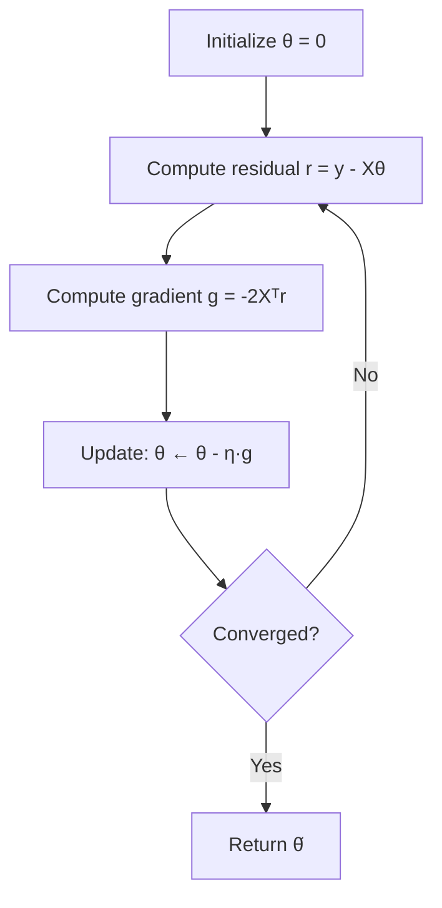

# 1 - Linear Regression

[toc]

> **TL;DR:** Linear regression is the foundational supervised learning algorithm: given n input-output pairs, fit a hyperplane that minimizes squared residuals. The closed-form solution — the normal equations — gives the exact optimal weights in one shot, while gradient descent provides the iterative path used when n or d is large. Everything that follows in supervised learning (logistic regression, SVMs, neural nets) either generalises this setup or regularises it.

## Vocabulary

**Supervised learning**: Learning a mapping f: ℝᵈ → ℝ from labeled training pairs {(xᵢ, yᵢ)}.

**Feature vector**: The input to the model. Each xᵢ ∈ ℝᵈ collects d measurements for the i-th example.

**Augmented feature vector**: Prepend a constant 1 to absorb the bias term into the weight vector.

```math
\tilde{x}_i = [1, x_{i1}, x_{i2}, \ldots, x_{id}]^\top \in \mathbb{R}^{d+1}
```

---

**Weight vector** (θ): Parameters of the linear model, learned from data.

```math
\theta \in \mathbb{R}^{d+1}
```

---

**Hypothesis**: The prediction function.

```math
h_\theta(x) = \theta^\top \tilde{x} = \theta_0 + \theta_1 x_1 + \cdots + \theta_d x_d
```

---

**Residual**: The error on one training example.

```math
\epsilon_i = y_i - h_\theta(x_i) = y_i - \theta^\top \tilde{x}_i
```

---

**Design matrix** (X): Stack all augmented feature vectors as rows. The entire dataset in one matrix.

```math
X \in \mathbb{R}^{n \times (d+1)}, \quad X_{ij} = \tilde{x}_{ij}
```

---

**RSS / Least-squares cost**:

```math
J(\theta) = \sum_{i=1}^n (y_i - \theta^\top \tilde{x}_i)^2 = \|y - X\theta\|_2^2
```

---

**Normal equations**: The closed-form solution to the least-squares problem.

```math
\hat{\theta} = (X^\top X)^{-1} X^\top y
```

---

**Gram matrix** (XᵀX): A (d+1) × (d+1) positive semi-definite matrix. Invertible iff X has full column rank.

**Learning rate** (η / α): Step size for gradient descent updates.

**Hyperplane**: In ℝᵈ, the decision surface θᵀx = c is a (d−1)-dimensional affine subspace. Linear regression fits the hyperplane that minimises vertical distances to all training points.

## Intuition

Picture a scatter plot of house sizes (x-axis) against prices (y-axis). Linear regression draws the unique straight line such that the sum of *squared* vertical distances from each point to the line is minimised. Squaring residuals penalises large errors more than small ones and makes the optimisation problem smooth (differentiable everywhere).

In d dimensions the "line" becomes a hyperplane — the same idea, just harder to draw. The normal equations give you the exact foot of the perpendicular from the label vector y onto the column space of X; geometrically, ŷ = Xθ̂ is the orthogonal projection of y onto col(X).

> [!IMPORTANT]
> The normal equations minimise RSS *exactly* only when XᵀX is invertible. If the features are collinear (rank-deficient X), the solution is non-unique. Ridge regression (Note 3) breaks this degeneracy by adding λI to XᵀX.

## How it works

The linear regression pipeline has three logical stages: write the cost, minimise it analytically (normal equations), and then see how gradient descent recovers the same solution iteratively. Both routes converge to the same θ̂, but one is O(d³) and the other is O(nd) per step.

### Stage 1 — Write the least-squares cost

Given n training pairs (xᵢ, yᵢ) and augmented inputs x̃ᵢ, the squared-error cost is additive over examples and convex in θ. Convexity means there is a unique global minimum — no local optima to worry about.

```math
J(\theta) = \sum_{i=1}^n \left(y_i - \theta^\top \tilde{x}_i\right)^2 = (y - X\theta)^\top(y - X\theta)
```

### Stage 2 — Normal equations (closed form)

Expanding J(θ) = yᵀy − 2θᵀXᵀy + θᵀXᵀXθ and differentiating with respect to θ yields the gradient:

```math
\nabla_\theta J = -2X^\top y + 2X^\top X\theta
```

Setting the gradient to zero gives the normal equations. When XᵀX is invertible, the unique minimiser is:

```math
\hat{\theta} = (X^\top X)^{-1} X^\top y
```

The matrix (XᵀX)⁻¹Xᵀ is the Moore–Penrose pseudoinverse of X. Solving via LU or Cholesky decomposition costs O(d³) floating-point operations — practical for d in the hundreds or low thousands, but prohibitive for high-dimensional feature spaces.

> [!TIP]
> In practice, never form (XᵀX)⁻¹ explicitly. Solve the linear system XᵀX θ = Xᵀy using `np.linalg.solve` or a Cholesky decomposition (`np.linalg.lstsq`). This is more numerically stable and roughly twice as fast.

### Stage 3 — Gradient descent (iterative)

Gradient descent takes a step opposite the gradient at each iteration. For linear regression the gradient has a closed form (see Stage 2), so each update is:

```math
\theta^{(t+1)} = \theta^{(t)} - \eta \cdot \nabla_\theta J = \theta^{(t)} + 2\eta X^\top(y - X\theta^{(t)})
```

The residual (y − Xθ) captures how wrong the current θ is. The update adds to θ a weighted sum of all training inputs, with the residuals as weights. When η is small enough (η < 1/‖XᵀX‖₂), the iterates converge to θ̂. Choosing η is discussed in Note 5.



## Math

### Deriving the gradient of RSS

Expand J(θ) = (y − Xθ)ᵀ(y − Xθ):

```math
J(\theta) = y^\top y - 2\theta^\top X^\top y + \theta^\top X^\top X\theta
```

Differentiate using the identities ∇_θ(aᵀθ) = a and ∇_θ(θᵀAθ) = 2Aθ for symmetric A:

```math
\nabla_\theta J = -2X^\top y + 2X^\top X\theta
```

Setting to zero: XᵀXθ = Xᵀy. For invertible XᵀX, the unique solution is the normal equations.

### Geometric interpretation

The prediction vector ŷ = Xθ̂ = X(XᵀX)⁻¹Xᵀy is the orthogonal projection of y onto the column space of X. The hat matrix H = X(XᵀX)⁻¹Xᵀ is idempotent (H² = H) and symmetric.

```math
\hat{y} = Hy, \quad H^2 = H, \quad H^\top = H
```

The residual vector r = y − ŷ is orthogonal to every column of X: Xᵀr = 0.

### Complexity

| Method | Time | Memory |
| :--- | :--- | :--- |
| Normal equations (naïve) | O(nd² + d³) | O(d²) |
| `linalg.lstsq` (LAPACK) | O(nd² + d³) | O(d²) |
| Gradient descent (per step) | O(nd) | O(d) |
| SGD (per step) | O(d) | O(d) |

For n >> d, assembling XᵀX is O(nd²) and dominates. For d >> n (wide data), the SVD-based pseudoinverse in O(n²d) may be cheaper.

## Real-world example

A production scenario: fitting a linear model to predict energy consumption from building features (area, number of occupants, outdoor temperature, time-of-day encodings). The code below implements both the normal equations and gradient descent from scratch, then verifies agreement.

```python
import numpy as np
from sklearn.datasets import make_regression
from sklearn.preprocessing import StandardScaler
from sklearn.metrics import mean_squared_error

rng = np.random.default_rng(42)

# --- Generate synthetic data ---
n, d = 500, 10
X_raw, y = make_regression(n_samples=n, n_features=d, noise=15.0,
                             random_state=42)

# --- Standardise features (important for gradient descent convergence) ---
scaler = StandardScaler()
X_scaled = scaler.fit_transform(X_raw)

# Augment with bias column
X = np.c_[np.ones(n), X_scaled]           # shape: (500, 11)

# -----------------------------------------------------------------------
# Method 1: Normal equations
# -----------------------------------------------------------------------
def normal_equations(X: np.ndarray, y: np.ndarray) -> np.ndarray:
    """Compute θ = (XᵀX)⁻¹Xᵀy via least-squares solve."""
    return np.linalg.lstsq(X, y, rcond=None)[0]

theta_ne = normal_equations(X, y)

# -----------------------------------------------------------------------
# Method 2: Gradient descent
# -----------------------------------------------------------------------
def gradient_descent(
    X: np.ndarray,
    y: np.ndarray,
    lr: float = 1e-2,
    n_iter: int = 2000,
) -> np.ndarray:
    """Batch gradient descent for least squares."""
    theta = np.zeros(X.shape[1])
    n = len(y)
    for _ in range(n_iter):
        residual = y - X @ theta          # (n,)
        grad = -2.0 / n * X.T @ residual  # (d+1,)
        theta = theta - lr * grad
    return theta

theta_gd = gradient_descent(X, y)

# -----------------------------------------------------------------------
# Compare
# -----------------------------------------------------------------------
y_hat_ne = X @ theta_ne
y_hat_gd = X @ theta_gd

print(f"Normal Eqn  MSE: {mean_squared_error(y, y_hat_ne):.4f}")
print(f"Grad Desc   MSE: {mean_squared_error(y, y_hat_gd):.4f}")
print(f"Max θ diff: {np.max(np.abs(theta_ne - theta_gd)):.6f}")
# Both should give near-identical MSE; max diff < 1e-3 after 2000 steps
```

> [!WARNING]
> If you forget to standardise features before gradient descent, the learning rate that works for one feature scale will cause oscillation (too large) or extreme slowness (too small) for features on other scales. The normal equations are scale-invariant but gradient descent is not.

## In practice

**When to use normal equations vs gradient descent:**

The normal equations require O(d³) to solve and O(d²) memory for XᵀX. For d ≤ 10,000 this is fast. For d = 100,000 (e.g., bag-of-words features), forming XᵀX costs 80 GB — use gradient descent or stochastic variants instead.

**Numerical stability:** XᵀX can be ill-conditioned when features are nearly collinear. `np.linalg.solve` can give catastrophic cancellation; `np.linalg.lstsq` uses an SVD-based pseudoinverse which is numerically robust but slower. Condition number κ(XᵀX) = κ(X)² — small correlations in X amplify dramatically in XᵀX.

> [!TIP]
> Prefer `np.linalg.lstsq(X, y)` over `np.linalg.inv(X.T @ X) @ X.T @ y` in every case. The latter fails silently on near-singular XᵀX; lstsq handles rank deficiency gracefully.

**Basis functions:** Linear regression is not limited to linear features. You can apply nonlinear feature maps φ(x) = [1, x, x², sin(x), …] and then run ordinary linear regression on the transformed inputs Φ = φ(X). The model is still linear *in the parameters* (see Note 3 for polynomial regression and kernel regression).

**The inductive bias:** Linear regression embodies the assumption that the true relationship is (approximately) a hyperplane. This assumption is almost never literally true, but it is a useful first approximation and serves as the baseline against which every nonlinear method is compared.

## Pitfalls

- **Confusing "linear in features" with "linear in parameters"** — A model yhat = θ₀ + θ₁x + θ₂x² is *linear regression* because it is linear in θ, even though x² is nonlinear. The word "linear" refers to the parameter space, not the feature space.
- **Not standardising before gradient descent** — Gradient descent on unstandardised features converges orders of magnitude slower. The normal equations are immune, but every iterative method needs scaled inputs.
- **Inverting XᵀX directly** — Numerically dangerous. Use lstsq or a Cholesky factorisation. Near-collinear features blow up the condition number.
- **Ignoring the assumption of additive Gaussian noise** — The least-squares criterion is optimal (in the BLUE sense) only when residuals are i.i.d. Gaussian. For heavy-tailed or heteroscedastic noise, robust regression or weighted least squares is preferable.
- **Mistaking R² for a diagnostic** — R² increases monotonically with the number of features, even for useless ones. Use adjusted R² or hold-out MSE to compare models with different numbers of parameters.

## Exercises

### Exercise 1 — Derive the normal equations from scratch

Starting from J(θ) = (y − Xθ)ᵀ(y − Xθ), expand the product, differentiate with respect to θ, and set the gradient to zero to derive θ̂ = (XᵀX)⁻¹Xᵀy.

#### Solution

Expand the quadratic form:

```math
J(\theta) = y^\top y - y^\top X\theta - \theta^\top X^\top y + \theta^\top X^\top X\theta
= y^\top y - 2\theta^\top X^\top y + \theta^\top X^\top X\theta
```

(Using yᵀXθ = θᵀXᵀy since both sides are scalars.)

Differentiate using ∇_θ(aᵀθ) = a and ∇_θ(θᵀBθ) = 2Bθ for symmetric B = XᵀX:

```math
\nabla_\theta J = -2X^\top y + 2X^\top X\theta
```

Setting to zero:

```math
X^\top X\theta = X^\top y \quad \Rightarrow \quad \hat{\theta} = (X^\top X)^{-1}X^\top y
```

The second-order condition: ∇²J = 2XᵀX, which is positive semi-definite (positive definite if X has full column rank), confirming this is a global minimum.

---

### Exercise 2 — One-dimensional case

For n points (xᵢ, yᵢ) with scalar features, derive the closed-form expressions for the slope θ₁ and intercept θ₀ of the least-squares line.

#### Solution

With X = [[1, x₁], …, [1, xₙ]], the normal equations XᵀXθ = Xᵀy expand to a 2×2 system:

```math
\begin{bmatrix} n & \sum x_i \\ \sum x_i & \sum x_i^2 \end{bmatrix} \begin{bmatrix} \theta_0 \\ \theta_1 \end{bmatrix} = \begin{bmatrix} \sum y_i \\ \sum x_i y_i \end{bmatrix}
```

From the first equation: θ₀ = ȳ − θ₁x̄. Substituting into the second and solving:

```math
\theta_1 = \frac{\sum_i (x_i - \bar{x})(y_i - \bar{y})}{\sum_i (x_i - \bar{x})^2} = \frac{\text{Cov}(x, y)}{\text{Var}(x)}
```

```math
\theta_0 = \bar{y} - \theta_1 \bar{x}
```

This is the familiar covariance-over-variance formula from statistics. The intercept ensures the regression line passes through the centroid (x̄, ȳ).

---

### Exercise 3 — Geometric interpretation

Show that the residual vector r = y − Xθ̂ is orthogonal to every column of X.

#### Solution

At the optimal θ̂, the gradient is zero: ∇J = −2Xᵀ(y − Xθ̂) = 0. Therefore:

```math
X^\top(y - X\hat{\theta}) = X^\top r = 0
```

This means Xᵀr = 0, i.e., r is orthogonal to every column of X. Geometrically, ŷ = Xθ̂ is the orthogonal projection of y onto col(X), and the residual is the component of y that lies in the orthogonal complement of col(X). This is the fundamental theorem of least squares.

---

### Exercise 4 — Gradient descent update derivation

Derive the gradient descent update rule for linear regression and explain why each term has its sign.

#### Solution

The gradient is ∇J = −2Xᵀ(y − Xθ) = −2Xᵀr where r = y − Xθ is the residual vector. The gradient descent update subtracts a fraction of the gradient:

```math
\theta^{(t+1)} = \theta^{(t)} - \eta\nabla J = \theta^{(t)} + 2\eta X^\top(y - X\theta^{(t)})
```

The sign is positive (adding, not subtracting, the residual term) because moving in the direction opposite the gradient means moving toward lower cost. When r > 0 (model underpredicts), θ increases; when r < 0 (model overpredicts), θ decreases. The factor Xᵀr is the "feedback" from the data: each training point xᵢ contributes a push proportional to its residual rᵢ.

---

### Exercise 5 — When does XᵀX fail to be invertible?

Describe two distinct scenarios in which XᵀX is singular and explain the remedy for each.

#### Solution

**Scenario 1 — Feature collinearity.** If two features are linearly dependent (e.g., x₂ = 3x₁ + 5), then two columns of X are collinear, the column space of X has dimension less than d+1, and XᵀX is singular. *Remedy:* Remove redundant features, use PCA to orthogonalise, or add ridge regularisation (λI) to make XᵀX + λI strictly positive definite.

**Scenario 2 — Fewer examples than features (n < d+1).** When there are more parameters than data points, X has at most n linearly independent rows, so rank(X) ≤ n < d+1 and XᵀX is rank-deficient. The problem is underdetermined: infinitely many hyperplanes fit n points perfectly. *Remedy:* Add regularisation (ridge or lasso) to impose a unique solution, or use the minimum-norm pseudoinverse solution θ̂ = X†y.

## Sources

- Nando de Freitas, *Machine Learning Lectures — Oxford University* (2015): Linear regression (oxf6), Maximum Likelihood (oxf7). https://www.cs.ox.ac.uk/people/nando.defreitas/machinelearning/
- Lindsten, F. et al. (2018). *Statistical Machine Learning: Lecture notes*. Uppsala University. §2.
- Murphy, K. P. (2012). *Machine Learning: A Probabilistic Perspective*. MIT Press. Ch. 7.
- Bishop, C. M. (2006). *Pattern Recognition and Machine Learning*. Springer. Ch. 3.
- Andrew Ng. *CS229 Machine Learning Lecture Notes* (2012). §1.

## Related

- [2 - Maximum Likelihood Estimation](./2-maximum-likelihood-estimation.md)
- [3 - Regularization and Cross-Validation](./3-regularization-and-cross-validation.md)
- [5 - Optimization for ML](./5-optimization-for-ml.md)
- [3 - Estimation and MLE](../1-foundations/3-estimation-and-mle.md)
- [4 - Optimization and KKT](../1-foundations/4-optimization-and-kkt.md)
- [5 - Linear Algebra Essentials](../1-foundations/5-linear-algebra-essentials.md)
