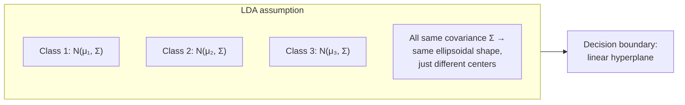
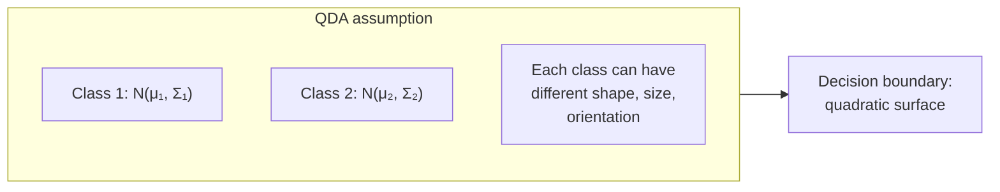
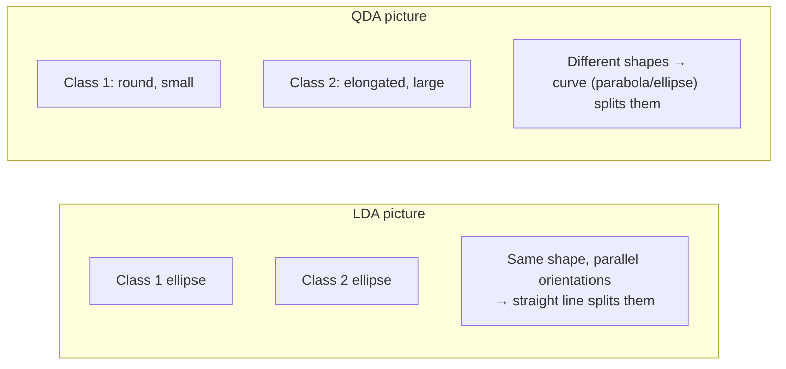

# 3 - Gaussian Discriminant Analysis (LDA and QDA)

[toc]

> **TL;DR:** *Gaussian Discriminant Analysis* models each class as a multivariate Gaussian and classifies by which class is most probable. When all classes share one covariance matrix, the decision boundary is *linear* (LDA — Linear Discriminant Analysis). When each class has its own covariance, the boundary is *quadratic* (QDA — Quadratic Discriminant Analysis). LDA is the older, simpler cousin of Naive Bayes — it drops independence assumptions in exchange for assuming Gaussianity, gaining the ability to capture feature correlations.

## Vocabulary

**Generative classifier**

A model that learns $P(\mathbf{x}, c) = P(\mathbf{x} \mid c)\,P(c)$ and classifies via $\arg\max_c P(c \mid \mathbf{x})$. GDA, Naive Bayes are generative; logistic regression and SVM are *discriminative*.

---

**Multivariate Gaussian**

```math
\mathcal{N}(\mathbf{x}; \boldsymbol{\mu}, \Sigma) = \frac{1}{(2\pi)^{d/2} |\Sigma|^{1/2}} \exp\!\left(-\frac{1}{2}(\mathbf{x} - \boldsymbol{\mu})^\top \Sigma^{-1} (\mathbf{x} - \boldsymbol{\mu})\right)
```

The $d$-dimensional bell. Parameters: mean vector $\boldsymbol{\mu}$, covariance matrix $\Sigma$.

---

**Covariance matrix**

```math
\Sigma_{ij} = \text{Cov}(X_i, X_j) = \mathbb{E}[(X_i - \mu_i)(X_j - \mu_j)]
```

Symmetric, PSD. Diagonal = per-feature variances; off-diagonal = pairwise correlations.

---

**Mahalanobis distance**

```math
d_M(\mathbf{x}, \boldsymbol{\mu}) = \sqrt{(\mathbf{x} - \boldsymbol{\mu})^\top \Sigma^{-1} (\mathbf{x} - \boldsymbol{\mu})}
```

The metric that the multivariate Gaussian uses. Generalizes Euclidean distance to account for correlation and scale.

---

**Linear Discriminant Analysis (LDA)**

```math
\Sigma_1 = \Sigma_2 = \ldots = \Sigma
```

GDA with one shared covariance across classes. Decision boundary is linear in $\mathbf{x}$.

---

**Quadratic Discriminant Analysis (QDA)**

Each class has its own covariance $\Sigma_c$. Decision boundary is a *quadric* (ellipse, hyperbola, parabola depending on covariance differences).

---

**Curse of dimensionality**

The phenomenon that high-dimensional spaces are *empty* — sample size requirements explode, distances become uniform, parameter estimates become unstable. GDA is hit hard because covariance matrices have $O(d^2)$ parameters.

## Intuition

Naive Bayes assumed features are independent given the class — a bold and usually wrong assumption that's redeemed only by classifier robustness. GDA replaces it with a different assumption: features within a class follow a *multivariate Gaussian*. This *allows* correlated features (off-diagonal entries in $\Sigma$ encode them) but requires the data to actually be roughly Gaussian-shaped per class.

Two sub-flavors. **LDA** assumes the same covariance across all classes — so the classes are translations of one another. This forces the decision boundary to be linear (the quadratic terms cancel out). It needs only $K$ means plus 1 covariance = $Kd + d^2/2$ parameters. **QDA** lets each class have its own covariance, so the classes can have different shapes. Decision boundary is quadratic. Parameter count climbs to $Kd + Kd^2/2$ — meaningful when $d$ is large.

GDA's central tradeoff is the *bias-variance dial* set by how much data you trust per class. With abundant data, QDA is the more expressive model and often wins. With scarce data per class, LDA's pooled covariance is a more reliable estimate, and LDA generalizes better despite the misspecification. *Regularized discriminant analysis* (RDA) interpolates between the two — a shrinkage hyperparameter you tune by cross-validation.

## The model

For each class $c$, assume $\mathbf{x} \mid c \sim \mathcal{N}(\boldsymbol{\mu}_c, \Sigma_c)$ with class priors $\pi_c = P(c)$:

```math
P(c \mid \mathbf{x}) \propto \pi_c \cdot \mathcal{N}(\mathbf{x}; \boldsymbol{\mu}_c, \Sigma_c)
```

Take logs:

```math
\log P(c \mid \mathbf{x}) = \log \pi_c - \frac{1}{2}\log|\Sigma_c| - \frac{1}{2}(\mathbf{x} - \boldsymbol{\mu}_c)^\top \Sigma_c^{-1}(\mathbf{x} - \boldsymbol{\mu}_c) + \text{const}
```

The *discriminant function* $\delta_c(\mathbf{x})$ collects only the parts that depend on $c$:

```math
\delta_c(\mathbf{x}) = \log \pi_c - \frac{1}{2}\log|\Sigma_c| - \frac{1}{2}(\mathbf{x} - \boldsymbol{\mu}_c)^\top \Sigma_c^{-1}(\mathbf{x} - \boldsymbol{\mu}_c)
```

Classify by $\hat{c} = \arg\max_c \delta_c(\mathbf{x})$.

## LDA — when $\Sigma_c = \Sigma$ for all $c$



With shared covariance, the quadratic term $-\frac{1}{2}\mathbf{x}^\top \Sigma^{-1} \mathbf{x}$ is the same for every class and cancels when comparing discriminants. The LDA discriminant simplifies to:

```math
\delta_c(\mathbf{x}) = \mathbf{x}^\top \Sigma^{-1} \boldsymbol{\mu}_c - \frac{1}{2}\boldsymbol{\mu}_c^\top \Sigma^{-1} \boldsymbol{\mu}_c + \log \pi_c
```

Linear in $\mathbf{x}$ → decision boundary $\delta_a = \delta_b$ is a hyperplane.

### Parameter estimation (MLE)

For each class $c$ with $n_c$ training examples:

```math
\hat{\pi}_c = \frac{n_c}{n}
```

```math
\hat{\boldsymbol{\mu}}_c = \frac{1}{n_c} \sum_{i : y_i = c} \mathbf{x}_i
```

The shared covariance (pooled):

```math
\hat{\Sigma} = \frac{1}{n - K} \sum_c \sum_{i : y_i = c} (\mathbf{x}_i - \hat{\boldsymbol{\mu}}_c)(\mathbf{x}_i - \hat{\boldsymbol{\mu}}_c)^\top
```

## QDA — different $\Sigma_c$ per class



Per-class covariance estimation:

```math
\hat{\Sigma}_c = \frac{1}{n_c} \sum_{i : y_i = c} (\mathbf{x}_i - \hat{\boldsymbol{\mu}}_c)(\mathbf{x}_i - \hat{\boldsymbol{\mu}}_c)^\top
```

QDA's discriminant retains the $-\frac{1}{2}\mathbf{x}^\top \Sigma_c^{-1} \mathbf{x}$ term, so the boundary $\delta_a = \delta_b$ involves a quadratic form in $\mathbf{x}$ → ellipses, hyperbolas, etc.

## Implementation

```python
import numpy as np

class GDA:
    def __init__(self, shared_covariance: bool = True) -> None:
        self.shared_covariance = shared_covariance

    def fit(self, X: np.ndarray, y: np.ndarray) -> "GDA":
        self.classes_ = np.unique(y)
        n, d = X.shape
        K = len(self.classes_)
        self.mu_ = np.zeros((K, d))
        self.log_prior_ = np.zeros(K)
        if self.shared_covariance:
            self.sigma_ = np.zeros((d, d))
            for k, c in enumerate(self.classes_):
                Xc = X[y == c]
                self.mu_[k] = Xc.mean(axis=0)
                self.log_prior_[k] = np.log(len(Xc) / n)
                diff = Xc - self.mu_[k]
                self.sigma_ += diff.T @ diff
            self.sigma_ /= (n - K)
        else:
            self.sigma_ = np.zeros((K, d, d))
            for k, c in enumerate(self.classes_):
                Xc = X[y == c]
                self.mu_[k] = Xc.mean(axis=0)
                self.log_prior_[k] = np.log(len(Xc) / n)
                diff = Xc - self.mu_[k]
                self.sigma_[k] = diff.T @ diff / len(Xc)
        return self

    def _discriminant(self, X: np.ndarray) -> np.ndarray:
        n, d = X.shape
        K = len(self.classes_)
        scores = np.zeros((n, K))
        for k in range(K):
            sigma_k = self.sigma_ if self.shared_covariance else self.sigma_[k]
            sigma_inv = np.linalg.inv(sigma_k + 1e-9 * np.eye(d))
            sign, logdet = np.linalg.slogdet(sigma_k + 1e-9 * np.eye(d))
            diff = X - self.mu_[k]
            mahal2 = (diff @ sigma_inv * diff).sum(axis=1)
            scores[:, k] = self.log_prior_[k] - 0.5 * logdet - 0.5 * mahal2
        return scores

    def predict(self, X: np.ndarray) -> np.ndarray:
        return self.classes_[np.argmax(self._discriminant(X), axis=1)]
```

Toggle `shared_covariance` to switch between LDA and QDA.

## A worked geometric intuition



For Iris-style data where the two species are equally "blob-shaped" with the same orientation, LDA is sufficient. For data where one class is concentrated and another spread out, QDA captures the asymmetry that LDA misses.

## Comparison to other classifiers

| Property | Naive Bayes (Gaussian) | LDA | QDA | Logistic Regression |
| :--- | :--- | :--- | :--- | :--- |
| Class model | Per-class diagonal $\Sigma$ | Shared full $\Sigma$ | Per-class full $\Sigma_c$ | None — discriminative |
| Decision boundary | Quadratic (per-class variances) | Linear | Quadratic | Linear |
| Parameters | $2Kd$ | $Kd + d^2$ | $Kd + Kd^2$ | $K(d+1)$ |
| Handles correlated features | ✗ | ✓ | ✓ | ✓ |
| Robust to non-Gaussian data | meh | meh | meh | ✓ |

## The curse of dimensionality

GDA's parameter count scales with $d^2$ (LDA) or $Kd^2$ (QDA). For $d = 1{,}000$ features, LDA needs 500,500 covariance parameters; QDA with 5 classes needs 2.5 million. With finite training data, these estimates become wildly noisy.

```math
\hat{\Sigma} \text{ is nearly singular when } n < d
```

When the sample covariance is singular (or nearly so), $\Sigma^{-1}$ explodes; the Mahalanobis distance becomes meaningless; classification degenerates. This is one face of the *curse of dimensionality*: even modest-sized feature counts can overwhelm available data.

**Mitigations:**

1. **Feature selection** — reduce $d$ first (see [Feature Selection](../3-unsupervised-and-beyond/5-feature-selection-and-dimensionality-reduction.md)).
2. **Regularized Discriminant Analysis (RDA)** — shrink $\Sigma$ toward the diagonal:

```math
\hat{\Sigma}_\text{RDA} = (1 - \gamma) \hat{\Sigma} + \gamma \,\text{diag}(\hat{\Sigma})
```

with $\gamma \in [0, 1]$ chosen by CV.

3. **Diagonal LDA / QDA** — force $\Sigma$ to be diagonal. Equivalent to Gaussian Naive Bayes.

> [!IMPORTANT]
> When $d > n$, the sample covariance is rank-deficient (rank $\le n - 1$). LDA and QDA both fail without regularization. Diagonal NB, ridge-style shrinkage, or pre-feature-selection are mandatory in the "wide" data regime (e.g., gene-expression studies with $d \sim 20{,}000$ and $n \sim 100$).

## LDA's relationship to dimensionality reduction

LDA has a *second* interpretation as a *supervised* dimensionality-reduction method. It projects $d$-dimensional data onto a $(K-1)$-dimensional subspace that maximizes class separation. The directions of projection are the eigenvectors of $\Sigma^{-1} \Sigma_B$, where $\Sigma_B$ is the between-class scatter. See [Feature Selection / PCA](../3-unsupervised-and-beyond/5-feature-selection-and-dimensionality-reduction.md) for the comparison to PCA (which is *unsupervised* and maximizes overall variance instead).

## In practice

> [!TIP]
> LDA / QDA are excellent *baselines* alongside Naive Bayes and logistic regression. Closed-form solutions, fast training, no hyperparameters except the shared-vs-not toggle. If they perform well, you've also learned something about your data — it's Gaussian-ish per class.

> [!CAUTION]
> If features are heavy-tailed, bimodal, or categorical-shaped within a class, the Gaussian assumption is wrong and GDA gives over-confident predictions. Always inspect class-conditional histograms before trusting GDA.

> [!NOTE]
> LDA produces the same decision boundary as logistic regression in the limit of correctly-specified Gaussian classes — but LDA's parameters are *more efficient* (lower variance) when the assumption holds, and *less robust* when it doesn't. Modern practice often defaults to logistic regression for robustness; LDA persists in domains where the Gaussian model is genuinely appropriate (signal processing, finance).

In modern toolkits (`sklearn.discriminant_analysis.{Linear,Quadratic}DiscriminantAnalysis`), shrinkage is built in (`shrinkage='auto'` does Ledoit-Wolf optimal shrinkage automatically). Use these defaults; they're a step beyond pure MLE.

## Pitfalls

- **"LDA = PCA."** No — LDA is supervised (uses class labels); PCA is unsupervised (only uses variance). LDA's projection separates classes; PCA's preserves variance regardless of class. They can pick very different directions.
- **"My data isn't Gaussian, so GDA can't work."** GDA can still be a useful baseline. The Gaussian is an *approximation*; classification accuracy depends on the boundary geometry being correctly captured, not on full distributional fit.
- **"More classes → use QDA."** QDA's parameter count grows linearly in $K$; LDA's is constant in $K$. Many classes with little data per class is the *wrong* regime for QDA — prefer LDA.
- **"I don't need to scale features."** GDA is scale-aware via $\Sigma$, so scaling has less effect than in distance-based methods. But severely different scales between features can cause numerical issues with $\Sigma^{-1}$. Standardize anyway.
- **"My sample covariance is positive definite, so I'm fine."** Mathematically yes — but with $n$ close to $d$, condition numbers can be huge, and $\Sigma^{-1}$ amplifies noise. Regularize.

## Exercises

### Exercise 1 — Derive the LDA decision boundary

Show that the boundary $\delta_1(\mathbf{x}) = \delta_2(\mathbf{x})$ for two classes with shared $\Sigma$ is a *hyperplane*.

#### Solution

The LDA discriminant for class $c$:

```math
\delta_c(\mathbf{x}) = \mathbf{x}^\top \Sigma^{-1} \boldsymbol{\mu}_c - \frac{1}{2}\boldsymbol{\mu}_c^\top \Sigma^{-1} \boldsymbol{\mu}_c + \log \pi_c
```

Setting $\delta_1 = \delta_2$:

```math
\mathbf{x}^\top \Sigma^{-1}(\boldsymbol{\mu}_1 - \boldsymbol{\mu}_2) = \frac{1}{2}(\boldsymbol{\mu}_1^\top \Sigma^{-1} \boldsymbol{\mu}_1 - \boldsymbol{\mu}_2^\top \Sigma^{-1} \boldsymbol{\mu}_2) - \log(\pi_1/\pi_2)
```

Let $\mathbf{w} = \Sigma^{-1}(\boldsymbol{\mu}_1 - \boldsymbol{\mu}_2)$ and the right-hand side $b$. The boundary is:

```math
\mathbf{w}^\top \mathbf{x} = b
```

A hyperplane with normal $\mathbf{w}$ and bias $b$ — exactly a *linear* decision rule. The quadratic terms cancel because the same $\Sigma^{-1}$ shows up in both discriminants.

---

### Exercise 2 — When does QDA beat LDA?

Give two concrete situations where QDA outperforms LDA, and one situation where LDA wins.

#### Solution

**QDA wins:**

1. **Classes have different covariance structures.** Example: a credit-fraud classifier where legitimate transactions are tightly clustered in a few features (low variance) and fraudulent ones are spread (high variance). LDA's pooled $\Sigma$ averages these — losing the diagnostic feature.

2. **Classes have different orientations.** Example: two clusters at the same center but rotated differently in feature space. LDA cannot represent this; QDA can.

**LDA wins:**

- **Limited data per class.** With $n_c \sim d$ training examples per class, QDA's per-class covariance estimate is unstable. LDA pools data across classes, giving a more reliable $\Sigma$ estimate. Even when LDA's bias is wrong (covariances *do* differ), the variance reduction from pooling often beats QDA's lower bias.

This is a classical bias-variance tradeoff: QDA is less biased (more expressive) but higher variance (more parameters per class).

---

### Exercise 3 — Numerical demo: 2D Gaussian classification

Generate two 2D Gaussian clusters with the same covariance but different means. Train LDA and QDA. Compare decision boundaries.

#### Solution

```python
import numpy as np
import matplotlib.pyplot as plt
from sklearn.discriminant_analysis import LinearDiscriminantAnalysis, QuadraticDiscriminantAnalysis

rng = np.random.default_rng(0)
cov = np.array([[1.0, 0.5], [0.5, 1.0]])
X1 = rng.multivariate_normal([0, 0], cov, 200)
X2 = rng.multivariate_normal([3, 3], cov, 200)
X = np.vstack([X1, X2])
y = np.array([0]*200 + [1]*200)

lda = LinearDiscriminantAnalysis().fit(X, y)
qda = QuadraticDiscriminantAnalysis().fit(X, y)

# Plot boundaries
xx, yy = np.meshgrid(np.linspace(-3, 6, 200), np.linspace(-3, 6, 200))
grid = np.c_[xx.ravel(), yy.ravel()]

for name, model in [("LDA", lda), ("QDA", qda)]:
    z = model.predict(grid).reshape(xx.shape)
    plt.figure()
    plt.contourf(xx, yy, z, alpha=0.3)
    plt.scatter(X[:, 0], X[:, 1], c=y, s=8)
    plt.title(name)
plt.show()
```

You'll see LDA producing a perfectly straight separator; QDA producing a slight curve because its per-class covariance estimates differ from each other and from the true shared covariance due to sampling noise. On this dataset (true covariances are equal), LDA should *slightly* outperform QDA on held-out data — QDA's extra flexibility costs it variance without buying bias improvement.

---

### Exercise 4 — Show LDA → diagonal NB when features are uncorrelated

If the shared covariance $\Sigma$ is diagonal, show that LDA's predictions are identical to Gaussian Naive Bayes with shared (across classes) variance.

#### Solution

With diagonal $\Sigma = \text{diag}(\sigma_1^2, \ldots, \sigma_d^2)$, $\Sigma^{-1} = \text{diag}(1/\sigma_1^2, \ldots, 1/\sigma_d^2)$. The Mahalanobis distance decomposes:

```math
(\mathbf{x} - \boldsymbol{\mu}_c)^\top \Sigma^{-1} (\mathbf{x} - \boldsymbol{\mu}_c) = \sum_j \frac{(x_j - \mu_{cj})^2}{\sigma_j^2}
```

The LDA discriminant becomes:

```math
\delta_c(\mathbf{x}) = \log \pi_c - \frac{1}{2}\sum_j \log(2\pi\sigma_j^2) - \frac{1}{2}\sum_j \frac{(x_j - \mu_{cj})^2}{\sigma_j^2}
```

But this is exactly $\log P(c) + \sum_j \log \mathcal{N}(x_j; \mu_{cj}, \sigma_j^2)$ — the log-posterior of Gaussian Naive Bayes with per-feature variance $\sigma_j^2$ (shared across classes).

**Takeaway**: when off-diagonal entries are zero (features independent given class), LDA reduces to Gaussian NB. The "naive" assumption is exactly the *diagonal-covariance* assumption. NB is LDA's special case, not a different family.

## Sources

- Ramakrishnan, G. & Nagesh, A. (2011). *CS725: Foundations of Machine Learning — Lecture Notes*. IIT Bombay. §10.5, §10.6, §11.
- Fisher, R. A. (1936). *The Use of Multiple Measurements in Taxonomic Problems* (original LDA paper).
- Hastie, T., Tibshirani, R., & Friedman, J. (2009). *The Elements of Statistical Learning* (2nd ed.). Springer. Ch. 4.
- Bishop, C. M. (2006). *Pattern Recognition and Machine Learning*. Springer. Ch. 4.
- Friedman, J. H. (1989). *Regularized Discriminant Analysis*. JASA.
- Ledoit, O. & Wolf, M. (2004). *A well-conditioned estimator for large-dimensional covariance matrices*. J. Multivariate Analysis.

## Related

- [Probability Primer](../1-foundations/2-probability-primer.md)
- [Linear Algebra Essentials](../1-foundations/5-linear-algebra-essentials.md)
- [Estimation and Maximum Likelihood](../1-foundations/3-estimation-and-mle.md)
- [Naive Bayes](./2-naive-bayes.md)
- [Linear Regression](./4-linear-regression.md)
- [Perceptron and Logistic Regression](./5-perceptron-and-logistic-regression.md)
- [Feature Selection and Dimensionality Reduction](../3-unsupervised-and-beyond/5-feature-selection-and-dimensionality-reduction.md)
