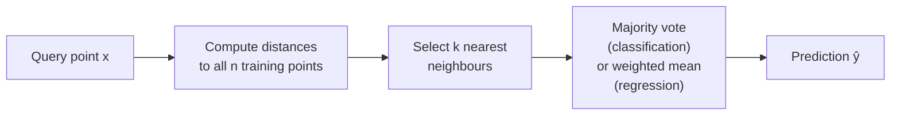

# 10 - K-Nearest Neighbours

[toc]

> **TL;DR:** K-Nearest Neighbours (KNN) is a non-parametric classifier and regressor that predicts by looking at the k closest training points in feature space and taking a majority vote (classification) or weighted average (regression). There is no explicit training phase — the entire dataset is the model. KNN is the simplest instance-based learner and a crucial non-parametric baseline, but it collapses in high dimensions due to the curse of dimensionality and requires O(n) query time without a spatial index.

## Vocabulary

**Non-parametric model**

A model whose complexity grows with the training data — there is no fixed parameter vector. KNN's "model" is the entire training set. Contrasts with parametric models (linear regression, neural nets) that compress data into a fixed-size parameter vector.

---

**Instance-based learning (lazy learning)**

Training consists only of storing examples; generalisation is deferred to query time. KNN, Parzen windows, and locally weighted regression are all lazy learners.

---

**Voronoi tessellation**

For k = 1, the decision regions of 1-NN are the Voronoi cells of the training set: the set of all points closer to a given training point than to any other.

---

**Curse of dimensionality**

In high dimensions, all points become approximately equidistant from any query point. The neighbourhood of a query point must expand to cover a fixed fraction of the data, but the neighbours it includes are no longer "close" in any meaningful sense.

---

**kd-tree**

A binary spatial data structure that recursively splits the feature space by axis-aligned hyperplanes. Supports O(log n) average-case nearest-neighbour queries in low dimensions (d ≲ 30).

---

**Ball tree**

A spatial index that partitions points into nested hyperspheres rather than hyperrectangles. More efficient than kd-trees when d is moderate (20–100) because sphere-triangle inequality allows tighter pruning.

---

**Weighted KNN**

Assigns each of the k neighbours a weight inversely proportional to its distance to the query point, rather than treating all k votes equally.

---

**Minkowski distance**

A family of distances parameterised by p: dₚ(x, y) = (Σⱼ |xⱼ − yⱼ|ᵖ)^(1/p). Euclidean distance = p = 2; Manhattan distance = p = 1; Chebyshev distance = p → ∞.

---

**Condensed NN**

A heuristic approximation of the full 1-NN classifier using a subset of training points, reducing storage and query time.

---

## Intuition

KNN embodies the simplest possible assumption: nearby points in feature space should have similar labels. You classify a new point by looking at its neighbourhood and asking "what do the locals believe?" The only design choice is the size of the neighbourhood (k) and the geometry of "nearness" (distance metric).

For k = 1, the classifier draws every possible boundary implied by the training data — an infinitely complex decision surface that passes between every pair of training points from different classes. This memorises the training set perfectly but overfits badly. Increasing k is the regularisation knob: k = n gives the majority-class classifier (maximum regularisation, maximum bias, zero variance). The optimal k balances these.



## How it Works

### Phase 1 — Distance computation

For each query point x, compute its distance to every training example xᵢ. The default is Euclidean (L2) distance, but the choice of metric encodes domain assumptions. For mixed data types or when features have different scales, use the Mahalanobis distance (which normalises by the covariance matrix) or normalise features to zero mean and unit variance first.

> [!WARNING]
> KNN is extremely sensitive to feature scales. A feature measured in kilometres will dominate one measured in millimetres — the large-scale feature effectively defines the neighbourhood. Always standardise features (zero mean, unit variance) before applying KNN. Failing to standardise is the single most common KNN pitfall.

### Phase 2 — Neighbour selection

Sort the n training examples by distance to x and take the k smallest. The time complexity of naive KNN is O(n·d) per query (n distance computations, each O(d) for d features), and O(n·d) storage. For n = 10⁶ and d = 100, each query requires 10⁸ floating-point operations — 100 milliseconds on a CPU, too slow for interactive applications.

### Phase 3 — Prediction

**Classification:** Plurality vote among the k neighbours. If tie-breaking matters, set k to an odd number or use weighted voting. **Weighted KNN** assigns each neighbour weight wᵢ = 1/d(x, xᵢ)² (inverse-square distance) so closer neighbours dominate. This reduces the discretisation artefacts that appear near class boundaries.

**Regression:** For KNN regression, predict the (possibly weighted) average of the k neighbours' target values. This is a local constant estimator — the simplest nonparametric smoother.

### Phase 4 — Spatial indexing for fast queries

The kd-tree partitions ℝ^d by successively splitting on the feature with the greatest range (or by rotating through features). Each internal node stores the split dimension and threshold; leaves store up to a bucket of points. A query descends the tree to the candidate leaf, then backtracks to check whether the query-sphere could intersect sibling subtrees — pruning the search wherever the distance to the bounding box exceeds the current best distance.

In the best case (low d, balanced tree), kd-tree queries cost O(log n). In high dimensions (d > 30), the pruning becomes ineffective because the query-sphere always intersects most bounding boxes — the algorithm degrades toward O(n).

```
           Split: feature 0, θ = 5.0
          ┌─────────────┬─────────────┐
          │  Left half  │  Right half │
          │  (x₀ ≤ 5)  │  (x₀ > 5)  │
          │             │             │
          │  Split:     │  Split:     │
          │  feature 1  │  feature 1  │
          │  θ = 3.0   │  θ = 7.0   │
          └─────────────┴─────────────┘
```

**Figure:** kd-tree partitions space by alternating axis-aligned hyperplanes. Each leaf contains a small bucket of training points.

## Math

### Minkowski distance family

```math
d_p(x, z) = \left(\sum_{j=1}^{d} |x_j - z_j|^p\right)^{1/p}
```

Special cases: p = 1 (Manhattan / taxicab), p = 2 (Euclidean), p → ∞ (Chebyshev / L∞ = max|xⱼ − zⱼ|).

### Weighted KNN prediction (regression)

```math
\hat{y}(x) = \frac{\sum_{i \in \mathcal{N}_k(x)} w_i\, y_i}{\sum_{i \in \mathcal{N}_k(x)} w_i}, \quad w_i = \frac{1}{d(x, x_i)^2}
```

### Curse of dimensionality: neighbourhood volume

To capture a fraction f of the unit hypercube's volume in d dimensions, the edge length of the hypercube neighbourhood must be:

```math
\ell = f^{1/d}
```

For f = 0.01 (1% of the data) and d = 100: ℓ = 0.01^(1/100) = 10^(−2/100) = 10^(−0.02) ≈ 0.955. The neighbourhood spans 95.5% of each feature's range — it is not "local" at all.

### KNN asymptotic error bound

As n → ∞ and k → ∞ with k/n → 0, the 1-NN error converges to at most twice the Bayes error:

```math
\lim_{n \to \infty} R^* \leq R_{1\text{-NN}} \leq 2 R^*\left(1 - R^*\right) \leq 2 R^*
```

where R* is the irreducible Bayes error. This shows that 1-NN is an asymptotically consistent classifier — it converges to within a factor of 2 of optimal — a non-trivial guarantee for such a simple method.

## Real-world Example

KNN for handwritten digit classification on MNIST, comparing naive brute-force with a kd-tree index, and showing the effect of k and feature scaling.

```python
import numpy as np
from sklearn.datasets import fetch_openml
from sklearn.neighbors import KNeighborsClassifier
from sklearn.preprocessing import StandardScaler
from sklearn.model_selection import train_test_split, cross_val_score
import time

# Load a subset of MNIST (full 70k is slow for brute-force KNN demo)
mnist = fetch_openml("mnist_784", version=1, as_frame=False, parser="auto")
X, y = mnist.data[:10_000].astype(np.float32), mnist.target[:10_000]

X_train, X_test, y_train, y_test = train_test_split(X, y, test_size=0.2, random_state=42)

# ---- 1. Unscaled brute-force KNN (k=5) ----
knn_raw = KNeighborsClassifier(n_neighbors=5, algorithm="brute", metric="euclidean")
t0 = time.perf_counter()
knn_raw.fit(X_train, y_train)
fit_time = time.perf_counter() - t0  # near-zero: just stores data

t0 = time.perf_counter()
acc_raw = knn_raw.score(X_test, y_test)
query_time = time.perf_counter() - t0
print(f"Brute-force KNN k=5 (raw pixels): acc={acc_raw:.3f}, query_time={query_time:.2f}s")

# ---- 2. Standardised features with kd-tree ----
scaler = StandardScaler()
X_train_s = scaler.fit_transform(X_train)
X_test_s  = scaler.transform(X_test)

knn_kd = KNeighborsClassifier(n_neighbors=5, algorithm="kd_tree")
knn_kd.fit(X_train_s, y_train)
t0 = time.perf_counter()
acc_kd = knn_kd.score(X_test_s, y_test)
print(f"kd-tree KNN k=5 (scaled):         acc={acc_kd:.3f}, query_time={time.perf_counter()-t0:.2f}s")

# ---- 3. Sweep k to find optimal ----
# Note: for 784-dim features kd_tree degrades; auto will pick brute
scores = []
k_values = [1, 3, 5, 7, 11, 15, 21]
for k in k_values:
    clf = KNeighborsClassifier(n_neighbors=k, algorithm="auto")
    s = cross_val_score(clf, X_train_s, y_train, cv=3, scoring="accuracy")
    scores.append(s.mean())
    print(f"k={k:>2}: CV acc = {s.mean():.3f}")

best_k = k_values[np.argmax(scores)]
print(f"\nBest k = {best_k}")
```

> [!TIP]
> For MNIST and other high-dimensional image tasks, reduce dimensionality with PCA before applying KNN. Projecting 784 pixels to 50–100 principal components loses minimal discriminative information but dramatically speeds up distance computations and makes the kd-tree effective. This is the standard trick: `PCA(n_components=50)` → `KNeighborsClassifier`.

## In Practice

**When KNN actually wins.** KNN is hard to beat when: (a) the decision boundary is highly non-linear and irregular; (b) the number of classes is large; (c) the data is low-dimensional and the feature space has meaningful geometry; (d) the training set is small and you cannot afford to overfit a parametric model. For recommendation systems, KNN on item/user embeddings is still state of the art for cold-start retrieval.

**Approximate nearest neighbour (ANN).** For n > 10⁶ or d > 100, exact KNN is impractical. ANN libraries (FAISS, HNSW, ScaNN, Annoy) sacrifice a small amount of accuracy (finding the 0.99-approximate nearest neighbour) in exchange for O(log n) or sub-linear query time and GPU acceleration. FAISS with IVF-PQ compression is the standard for billion-scale vector retrieval in production.

**Locality-Sensitive Hashing (LSH).** For very high dimensions, LSH hashes points so that nearby points collide with high probability. For Euclidean distance, random projections with quantisation form the hash family. LSH supports sub-linear query time without a tree structure.

**KNN in the LLM era.** Vector databases (Pinecone, Weaviate, pgvector, Milvus) implement ANN on embedding vectors from LLMs. Every RAG (retrieval-augmented generation) system is, at its core, a KNN query over a document embedding index. The "classifier" is replaced by a similarity search, and the "label" is the retrieved document chunk.

> [!IMPORTANT]
> KNN has no explicit training phase, but its query cost is O(n·d) per example without indexing. At inference time with n = 10⁶ training examples and d = 512 embedding dimensions, a single naive KNN lookup costs ~512M FLOPs. This is why ANN indices (HNSW, IVF-FLAT) exist and why raw KNN is never used in production at scale.

## Pitfalls

- **"KNN is scale-invariant."** — It is not. The Euclidean distance is dominated by high-variance features. Standardise all features to zero mean and unit variance, or use Mahalanobis distance.
- **"k = 1 is always overfit; k should be large."** — Larger k increases bias. In sparse data, k = 1 may generalise better than k = 50 if the neighbourhood is large enough to be dominated by irrelevant points. Cross-validate.
- **"KNN works in high dimensions."** — The curse of dimensionality means that for d ≳ 30, all pairwise distances concentrate around the mean distance. The "nearest" neighbour is not meaningfully closer than the farthest. Use dimensionality reduction first.
- **"kd-trees are always faster than brute force."** — For d > 20–30, kd-tree pruning fails and query time approaches O(n). Ball trees do better in moderate dimensions. For d > 100, use FAISS or HNSW.
- **"Majority vote is optimal."** — In regions with class imbalance, majority vote ignores distance information. Inverse-distance weighting consistently outperforms simple voting when classes are imbalanced near boundaries.

## Exercises

### Exercise 1 — Compute KNN prediction by hand

Training data: {x₁ = (0, 0), class 0}, {x₂ = (1, 0), class 1}, {x₃ = (0.5, 1), class 1}, {x₄ = (−1, 0), class 0}. Query: x = (0.3, 0.4), k = 3. Predict class using (a) majority vote and (b) inverse-distance weighting.

#### Solution 1

**Step 1 — Compute Euclidean distances:**

- d(x, x₁) = √(0.3² + 0.4²) = √(0.09 + 0.16) = √0.25 = 0.50
- d(x, x₂) = √((0.3−1)² + 0.4²) = √(0.49 + 0.16) = √0.65 ≈ 0.806
- d(x, x₃) = √((0.3−0.5)² + (0.4−1)²) = √(0.04 + 0.36) = √0.40 ≈ 0.632
- d(x, x₄) = √((0.3+1)² + 0.4²) = √(1.69 + 0.16) = √1.85 ≈ 1.360

**Step 2 — Select k = 3 nearest:** x₁ (d = 0.50), x₃ (d = 0.632), x₂ (d = 0.806). Labels: class 0, class 1, class 1.

**(a) Majority vote:** 2 votes for class 1, 1 vote for class 0 → **predict class 1**.

**(b) Inverse-distance weighting:**
- w₁ = 1/0.50² = 4.00 → class 0
- w₃ = 1/0.632² ≈ 2.50 → class 1
- w₂ = 1/0.806² ≈ 1.54 → class 1

Score(class 0) = 4.00; Score(class 1) = 2.50 + 1.54 = 4.04 → **predict class 1** (same, but closer margin: 4.04 vs 4.00).

---

### Exercise 2 — Curse of dimensionality

In d dimensions with n uniformly distributed points in the unit hypercube, what fraction of the cube's volume does the k-NN neighbourhood (for k = 10) cover, on average, when d = 2 and d = 50?

#### Solution 2

On average, the k-NN neighbourhood covers a fraction f ≈ k/n of the total volume. For k = 10 and n = 1000: f = 10/1000 = 0.01 (1%).

The edge length of an axis-aligned cube containing this fraction:

```math
\ell = f^{1/d} = (0.01)^{1/d}
```

- d = 2: ℓ = (0.01)^(1/2) = 0.1 → neighbourhood spans 10% of each axis. This is genuinely local.
- d = 50: ℓ = (0.01)^(1/50) = 10^(−2/50) = 10^(−0.04) ≈ 0.912 → neighbourhood spans 91.2% of each axis. The "nearest" 10 points are nearly uniformly spread across the entire feature space — the concept of "local" has collapsed.

---

### Exercise 3 — kd-tree splitting strategy

You have 8 points: (1,4), (5,2), (3,7), (7,3), (2,1), (6,5), (4,8), (8,6). Build a kd-tree (depth 2, binary splits, split on feature with greatest range, value = median). Draw the tree structure.

#### Solution 3

**Root split:** Feature ranges: x₁ ∈ [1,8] (range 7), x₂ ∈ [1,8] (range 7). Tie — split on feature 1 (x-axis). Sorted x₁ values: 1,2,3,4,5,6,7,8. Median between 4th and 5th = 4.5. Left: {(1,4),(3,7),(2,1),(4,8)} (x₁ ≤ 4). Right: {(5,2),(7,3),(6,5),(8,6)} (x₁ > 4).

**Left child split:** x₂ values: 4,7,1,8 → range 7. x₁ values: 1,3,2,4 → range 3. Split on x₂. Sorted: 1,4,7,8. Median = 5.5. Left-Left: {(2,1),(1,4)}. Left-Right: {(3,7),(4,8)}.

**Right child split:** x₂ values: 2,3,5,6 → range 4. x₁ values: 5,7,6,8 → range 3. Split on x₂. Median = 4.0. Right-Left: {(5,2),(7,3)}. Right-Right: {(6,5),(8,6)}.

```
                    Root: x₁ ≤ 4.5
                   /                \
       Left: x₂ ≤ 5.5          Right: x₂ ≤ 4.0
       /          \               /          \
{(2,1),(1,4)} {(3,7),(4,8)} {(5,2),(7,3)} {(6,5),(8,6)}
```

---

### Exercise 4 — When does weighted KNN help?

Give a concrete example where k = 3 majority-vote KNN predicts the wrong class but k = 3 inverse-distance-weighted KNN predicts the correct class.

#### Solution 4

Suppose the query point x = (0, 0) and the 3 nearest neighbours are:
- x₁ = (0.1, 0), class A, distance 0.1
- x₂ = (0.9, 0), class B, distance 0.9
- x₃ = (0.95, 0), class B, distance 0.95

**Majority vote:** 2 votes for class B, 1 for class A → predicts class B.

**Inverse-distance weighting:**
- w₁ = 1/0.01 = 100 → class A
- w₂ = 1/0.81 ≈ 1.23 → class B
- w₃ = 1/0.90 ≈ 1.11 → class B

Score(A) = 100; Score(B) = 1.23 + 1.11 = 2.34 → predicts **class A**.

The very close neighbour (x₁ at distance 0.1) is overwhelmed in majority voting by two distant class-B neighbours. Inverse-distance weighting correctly emphasises that the query is almost on top of x₁. This situation arises most commonly near decision boundaries where one class is densely packed and the other has a few distant outliers.

## Sources

- Cover, T., & Hart, P. (1967). Nearest Neighbor Pattern Classification. *IEEE Transactions on Information Theory*, 13(1), 21–27.
- Bentley, J. L. (1975). Multidimensional Binary Search Trees Used for Associative Searching. *CACM*, 18(9), 509–517. (kd-tree original paper)
- Friedman, J. H., Bentley, J. L., & Finkel, R. A. (1977). An Algorithm for Finding Best Matches in Logarithmic Expected Time. *ACM TOMS*, 3(3), 209–226.
- Johnson, J., Douze, M., & Jégou, H. (2019). Billion-Scale Similarity Search with GPUs. *IEEE Big Data*. https://arxiv.org/abs/1702.08734 (FAISS)
- Hastie, T., Tibshirani, R., & Friedman, J. (2009). *Elements of Statistical Learning*, 2nd ed. Springer. Section 2.3.
- Lecture notes: ail(23).pdf — CS 189, Concise Machine Learning (Shewchuk, Berkeley): Voronoi diagrams and kd-trees
- Lecture notes: ail(8).pdf — CSE176, UC Merced (Carreira-Perpiñán): non-parametric methods

## Related

- [7 - Naive Bayes Classifier](./7-naive-bayes-classifier.md)
- [8 - Decision Trees](./8-decision-trees.md)
- [9 - Ensemble Methods](./9-ensemble-methods.md)
- [3 - Gaussian Discriminant Analysis](./3-gaussian-discriminant-analysis.md)
