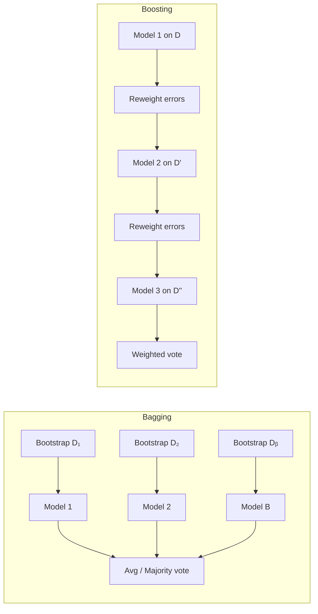

# 9 - Ensemble Methods: Bagging, Boosting, and Stacking

[toc]

> **TL;DR:** Ensemble methods aggregate the predictions of many weak learners to produce a strong one, exploiting Condorcet's jury theorem: independent classifiers that are each better than chance, when combined by majority vote, converge to certainty. Bagging reduces variance by averaging independent models trained on bootstrap samples; boosting reduces bias by sequentially fitting residuals; stacking learns a meta-model to combine diverse base learners. Gradient-boosted trees (XGBoost, LightGBM) are the dominant method on structured tabular data as of 2026.

## Vocabulary

**Weak learner**

A classifier that performs only slightly better than random (error < 0.5 for binary classification). Decision stumps are the canonical example.

---

**Strong learner**

A classifier with arbitrarily low error (with sufficient data and computation). The Kearns-Valiant theorem shows that weak learnability implies strong learnability.

---

**Bootstrap sample**

A sample of size n drawn with replacement from the training set of size n. On average, each bootstrap sample contains ~63.2% of unique training examples.

---

**Out-of-bag (OOB) examples**

The ~36.8% of training examples not selected in a given bootstrap sample. Used as a built-in validation set for bagging/random forests.

---

**Bagging (Bootstrap Aggregating)**

Train B independent models on B bootstrap samples, then average predictions (regression) or majority-vote (classification). Breiman (1994).

---

**Random Forest**

Bagging of decision trees with an added decorrelation step: at each split, only m randomly chosen features are considered (typically m = √d). Breiman (2001).

---

**Boosting**

Train weak learners sequentially, each focusing on the examples that prior models got wrong (upweighted). Combine with weighted majority vote.

---

**AdaBoost (Adaptive Boosting)**

Freund & Schapire (1997). Binary classification boosting. Reweights training examples; assigns importance αₘ to each weak learner inversely proportional to its weighted error.

---

**Gradient Boosting**

Friedman (2001). Fits each new tree to the negative gradient of the loss function — the "pseudo-residuals." Generalises to any differentiable loss. Subsumes AdaBoost as a special case.

---

**XGBoost / LightGBM / CatBoost**

High-performance implementations of gradient boosting with regularisation, histogram-based split finding, and hardware-aware execution. XGBoost (Chen & Guestrin, 2016) added a regularisation term to the tree-building objective; LightGBM introduced leaf-wise growth and GOSS sampling.

---

**Stacking (Stacked Generalisation)**

Train L diverse base learners, then train a meta-learner on their out-of-fold predictions. Wolpert (1992).

---

**Bias-variance decomposition**

Expected error = Bias² + Variance + Irreducible noise. Bagging targets variance; boosting targets bias.

---

## Intuition

Imagine polling 1,000 independent experts, each with 55% individual accuracy on a binary question. By Condorcet's jury theorem, the majority vote converges to near-certainty as the crowd grows — because independent errors cancel. The challenge: how do you get 1,000 *independent* models trained on the *same* dataset?

**Bagging** introduces independence by randomising the training data: each model sees a different bootstrap sample. The resulting models are approximately independent (not exactly, because they share the same underlying distribution). Averaging washes out their independent noise, reducing variance without increasing bias.

**Boosting** takes the opposite tack: it makes each successive model *dependent* on the previous ones by focusing on hard examples. The sequence of models jointly learns to explain the training set, each covering the blind spots of its predecessors. The ensemble's bias decreases with each round; variance can increase if not regularised.



## How it Works

### Bagging

The key insight is that a high-variance, low-bias estimator (a fully grown decision tree) trained on n data points has mean error ≈ Bias² + σ²/B when averaged over B independent samples — variance shrinks by a factor of B while bias is unchanged. Each bootstrap sample of size n (drawn with replacement) is a proxy for an independent draw from the data distribution.

For classification, the final prediction is a plurality vote; for regression, a simple average. No hyperparameter controls the combination weight — all models contribute equally. The OOB error estimate (predicting each training example using only the models that did not see it) is a nearly unbiased estimate of test error, often eliminating the need for a separate validation set.

### Random Forests

Bagging of fully grown trees still produces correlated models: if one strong feature dominates, every tree will split on it first, and the trees will resemble each other. Random forests break this correlation by restricting each split to a random subset of m features. Typical recommendations: m = √d for classification, m = d/3 for regression. Smaller m → lower correlation between trees, but also worse individual trees (higher variance per tree); the sweet spot is empirical.

> [!NOTE]
> Random forests are remarkably robust to hyperparameter choices. The default sklearn settings (`n_estimators=100`, `max_features="sqrt"`) work well across a wide range of datasets. The most important hyperparameter is `n_estimators`: more trees always helps (converges to a fixed error floor), so set as high as your compute budget allows.

### AdaBoost

AdaBoost (Algorithm M1 for binary classification, Freund & Schapire 1997) maintains a weight distribution over training examples, initially uniform. At round m, it:

1. Fits classifier Gₘ to the weighted training set.
2. Computes weighted error: errₘ = Σᵢ wᵢ · 1[yᵢ ≠ Gₘ(xᵢ)] / Σᵢ wᵢ.
3. Computes model weight: αₘ = log((1 − errₘ) / errₘ). A near-perfect classifier gets large α; a near-random one gets small α.
4. Upweights misclassified examples: wᵢ ← wᵢ · exp(αₘ · 1[yᵢ ≠ Gₘ(xᵢ)]).
5. Normalises weights to sum to 1.

Final classifier: G(x) = sign(Σₘ αₘ Gₘ(x)).

> [!IMPORTANT]
> AdaBoost minimises the *exponential loss* e^(−y·F(x)) on the training set — this was proven post-hoc by Friedman, Hastie, and Tibshirani (2000). This connection reveals why AdaBoost is sensitive to noisy labels: the exponential loss gives infinite cost to confidently wrong predictions, and mislabelled examples receive ever-increasing weight.

### Gradient Boosting

Friedman (2001) generalised boosting as stage-wise gradient descent in function space. At step m, the new weak learner hₘ fits the negative gradient of the loss L with respect to the current ensemble prediction Fₘ₋₁(xᵢ). These negative gradients are called pseudo-residuals.

```math
r_{im} = -\left[\frac{\partial L(y_i, F(x_i))}{\partial F(x_i)}\right]_{F = F_{m-1}}
```

For squared-error loss L = (y − F)²/2, the pseudo-residuals are exactly the ordinary residuals rᵢₘ = yᵢ − Fₘ₋₁(xᵢ). For log-loss, they are scaled versions of the classification error probability. The key insight: boosting under any loss is just gradient descent, but in function space rather than parameter space.

### XGBoost Key Ideas

XGBoost (Chen & Guestrin, NeurIPS 2016) adds three improvements to vanilla gradient boosting: (1) a regularisation term Ω(T) = γ|T| + (λ/2)‖w‖² added to the split-finding objective, preventing individual trees from growing too deep; (2) second-order Taylor expansion of the loss for more accurate leaf-weight computation; (3) column subsampling per tree and per split (like random forests), plus row subsampling for variance reduction.

### Stacking

Stacking trains L base learners (linear model, decision tree, SVM, neural net, etc.) and then learns a meta-learner on their out-of-fold predictions. The critical implementation detail: base learners must generate their predictions on held-out folds they weren't trained on (cross-validation), otherwise the meta-learner sees in-sample predictions and overfits catastrophically.

## Math

### Bagging variance reduction

For independent (uncorrelated) models with variance σ²:

```math
\text{Var}\left[\frac{1}{B}\sum_{b=1}^{B} f_b(x)\right] = \frac{\sigma^2}{B}
```

For correlated models (pairwise correlation ρ):

```math
\text{Var} = \rho \sigma^2 + \frac{1-\rho}{B} \sigma^2
```

As B → ∞, variance → ρσ². The floor is set by inter-tree correlation, not B. This is why random forests reduce ρ (via feature subsampling) — it is more important than increasing B past ~100.

### AdaBoost model weights

```math
\alpha_m = \log\left(\frac{1 - \text{err}_m}{\text{err}_m}\right)
```

For errₘ = 0.5 (random): αₘ = 0 (contributes nothing). For errₘ → 0: αₘ → +∞ (dominates the vote).

### Gradient boosting update

```math
F_m(x) = F_{m-1}(x) + \nu \cdot h_m(x)
```

where ν ∈ (0, 1] is the learning rate (shrinkage). Smaller ν requires more rounds M but generalises better by regularising the step size.

### XGBoost split gain

```math
\text{Gain} = \frac{1}{2}\left[
  \frac{G_L^2}{H_L + \lambda} + \frac{G_R^2}{H_R + \lambda} - \frac{(G_L+G_R)^2}{H_L+H_R+\lambda}
\right] - \gamma
```

where Gₗ, Gᵣ are first-derivative (gradient) sums, Hₗ, Hᵣ are second-derivative (Hessian) sums, λ is L2 leaf weight regularisation, and γ is the minimum gain needed to make the split. If Gain < 0, the split is not made.

## Real-world Example

Comparing bagging, random forests, AdaBoost, and gradient boosting on the Titanic survival dataset — a classic tabular binary classification benchmark.

```python
import pandas as pd
import numpy as np
from sklearn.ensemble import (
    BaggingClassifier, RandomForestClassifier,
    AdaBoostClassifier, GradientBoostingClassifier
)
from sklearn.tree import DecisionTreeClassifier
from sklearn.model_selection import cross_val_score
from sklearn.preprocessing import LabelEncoder
from sklearn.impute import SimpleImputer

# --- Minimal Titanic feature engineering ---
url = "https://raw.githubusercontent.com/datasciencedojo/datasets/master/titanic.csv"
df = pd.read_csv(url)
df["Sex"] = LabelEncoder().fit_transform(df["Sex"])
features = ["Pclass", "Sex", "Age", "SibSp", "Parch", "Fare"]
X = df[features].copy()
y = df["Survived"].values

imp = SimpleImputer(strategy="median")
X = imp.fit_transform(X)

base_stump = DecisionTreeClassifier(max_depth=1)
base_deep  = DecisionTreeClassifier(max_depth=None)

models = {
    "Single deep tree":     DecisionTreeClassifier(max_depth=None),
    "Bagging (stumps)":     BaggingClassifier(base_stump, n_estimators=200, random_state=0),
    "Bagging (deep trees)": BaggingClassifier(base_deep,  n_estimators=200, random_state=0),
    "Random Forest":        RandomForestClassifier(n_estimators=200, random_state=0),
    "AdaBoost":             AdaBoostClassifier(base_stump, n_estimators=200, learning_rate=1.0, random_state=0),
    "GradBoost":            GradientBoostingClassifier(n_estimators=200, learning_rate=0.1, max_depth=3, random_state=0),
}

print(f"{'Model':<28} {'CV Acc (5-fold)':<20} {'±std'}")
for name, model in models.items():
    scores = cross_val_score(model, X, y, cv=5, scoring="accuracy")
    print(f"{name:<28} {scores.mean():.3f}                  {scores.std():.3f}")
```

> [!TIP]
> For tabular data in production, start with LightGBM (`pip install lightgbm`). It is 5–20× faster than sklearn's GradientBoostingClassifier, handles missing values natively, supports categorical features directly (no one-hot encoding needed), and matches or exceeds XGBoost accuracy on most benchmarks. The API mirrors sklearn's estimator interface.

## In Practice

**Number of estimators.** For random forests, the OOB error stabilises typically around 100–200 trees. Adding more trees never hurts accuracy (only time and memory). For gradient boosting, more rounds can overfit; use early stopping on a validation set.

**Gradient boosting hyperparameter priority.** The three most impactful: (1) `n_estimators` (number of rounds), controlled by early stopping; (2) `learning_rate` — lower is better but requires more rounds; (3) `max_depth` — gradient boosting trees are typically shallow (depth 3–6), unlike random forest trees which are grown fully.

**Stacking in competition ML.** Kaggle winners routinely stack 3–4 layers: diverse base learners (trees, linear models, neural nets) → level-1 meta-learner (logistic regression or another tree) → final prediction. The key constraint: each level must generate out-of-fold predictions to prevent leakage. In production, multi-level stacking adds latency and complexity for marginal gains; a single-layer meta-learner is usually sufficient.

> [!WARNING]
> AdaBoost is extremely sensitive to noisy labels. A single mislabelled example that a stump confidently misclassifies will receive exponentially growing weight across rounds. With 5% label noise, AdaBoost's training error can stop converging. Gradient boosting with shrinkage (ν < 0.1) is far more robust because individual tree contributions are bounded.

**Feature importance in ensembles.** Random forest importance (mean impurity decrease across all trees) is biased toward high-cardinality continuous features. SHAP (SHapley Additive exPlanations) values — natively supported in XGBoost and LightGBM — give theoretically grounded per-prediction attributions and are the recommended choice for production explanations.

## Pitfalls

- **"More boosting rounds always helps."** — Without regularisation (shrinkage + depth limit + early stopping), gradient boosting overfits. Training loss goes to zero while test loss rises. Use a validation set and `early_stopping_rounds`.
- **"Random forests can't overfit."** — They can, especially with small datasets and unlimited depth. The OOB error can be optimistically biased; use a proper holdout set.
- **"Stacking base learner predictions directly is fine."** — This leaks information: if base learners see the target in their training fold, the meta-learner gets in-sample predictions and learns to ignore variance. Always use out-of-fold predictions for the level-1 features.
- **"Bagging with dependent models still halves the variance."** — The variance floor is ρσ², not zero. If all trees make the same split on the dominant feature, ρ ≈ 1 and bagging barely helps. Feature subsampling (random forests) is specifically designed to address this.
- **"AdaBoost and gradient boosting are the same algorithm."** — AdaBoost reweights examples and uses exponential loss; gradient boosting fits pseudo-residuals (negative loss gradients) with any differentiable loss. AdaBoost is a special case of gradient boosting with exponential loss and specific step-size choices.

## Exercises

### Exercise 1 — Condorcet's jury theorem calculation

50 independent classifiers each have 60% accuracy on a binary problem. What is the probability that a majority vote of all 50 is correct? What if accuracy is 51%?

#### Solution 1

For n independent classifiers each with accuracy p, the majority vote is correct when more than n/2 are correct. For n = 50 and binary outcomes, this is a binomial tail probability:

```math
P(\text{majority correct}) = \sum_{k=26}^{50} \binom{50}{k} p^k (1-p)^{50-k}
```

For p = 0.60: P(majority correct) ≈ 0.976 (97.6% — a large improvement from 60%).
For p = 0.51: P(majority correct) ≈ 0.554 (55.4% — a small improvement from 51%).

The key lesson: Condorcet's improvement is large when base classifiers are good (60%) but tiny when they are barely above chance (51%). This explains why boosting focuses on producing classifiers that are meaningfully better than random — a 51%-accurate ensemble of 1000 classifiers still only reaches ~55% majority vote accuracy.

---

### Exercise 2 — Bias-variance for bagging

A model has bias 0.1 and variance 0.5. If you train B = 10 independent models and average them, what is the expected squared error reduction? What if the models have pairwise correlation ρ = 0.7?

#### Solution 2

**Independent models (ρ = 0):**

```math
\text{Var}[\bar{f}] = \frac{0.5}{10} = 0.05
```

Expected error of average = Bias² + Var = 0.01 + 0.05 = 0.06. Compared to single model error = 0.01 + 0.5 = 0.51. Bagging reduces error by ~88%.

**Correlated models (ρ = 0.7):**

```math
\text{Var}[\bar{f}] = \rho \sigma^2 + \frac{1-\rho}{B}\sigma^2 = 0.7 \times 0.5 + \frac{0.3}{10} \times 0.5 = 0.35 + 0.015 = 0.365
```

Expected error = 0.01 + 0.365 = 0.375. Bagging reduces error by ~26%. High inter-model correlation is the enemy of bagging. This is why random forests de-correlate trees by subsampling features.

---

### Exercise 3 — AdaBoost weight update by hand

Training set with 4 examples, initially all weights = 1/4. Round 1 stump misclassifies examples 2 and 3 (weighted error = 2/4 = 0.5 − ε for small ε). Compute α₁ and the new weights after normalisation for ε = 0.05 (error = 0.45).

#### Solution 3

**Compute α₁:**

```math
\alpha_1 = \log\left(\frac{1 - 0.45}{0.45}\right) = \log\left(\frac{0.55}{0.45}\right) = \log(1.222) \approx 0.200
```

**Update weights:** Correctly classified examples (1, 4) stay at 0.25; misclassified examples (2, 3) get multiplied by exp(α₁):

- wᵢ(correct) = 0.25 × exp(0) = 0.25 (unchanged for correct)
- wᵢ(wrong)   = 0.25 × exp(0.200) = 0.25 × 1.221 = 0.305

**Normalise** (sum = 2 × 0.25 + 2 × 0.305 = 0.5 + 0.610 = 1.110):

- w₁ = w₄ = 0.25 / 1.110 ≈ 0.225
- w₂ = w₃ = 0.305 / 1.110 ≈ 0.275

The two misclassified examples are now slightly more heavily weighted (0.275 vs. 0.225), pushing round 2 to focus on them.

---

### Exercise 4 — Gradient boosting as gradient descent

For squared-error loss L(y, F) = (y − F)²/2, show that the pseudo-residuals at step m are exactly the ordinary residuals.

#### Solution 4

The pseudo-residual for example i at step m is the negative gradient of the loss with respect to the current prediction Fₘ₋₁(xᵢ):

```math
r_{im} = -\frac{\partial L(y_i, F(x_i))}{\partial F(x_i)}\bigg|_{F = F_{m-1}}
       = -\frac{\partial}{\partial F}\frac{(y_i - F)^2}{2}\bigg|_{F = F_{m-1}}
       = -(-1)(y_i - F_{m-1}(x_i))
       = y_i - F_{m-1}(x_i)
```

This is exactly the ordinary residual: how much the current ensemble prediction is missing from the true label. For squared-error loss, gradient boosting is literally fitting each new tree to the remaining residuals — the geometric interpretation of iterative least-squares residual fitting. For other losses (log-loss, Huber, quantile), the pseudo-residuals differ but the same Newton-step update applies.

---

### Exercise 5 — Why stacking needs out-of-fold predictions

A stacked ensemble trains 3 base learners on the full training set, then trains a logistic regression meta-learner on their predictions for the same training set. Why will this perform poorly at test time?

#### Solution 5

Base learners that have seen their own training labels will produce near-perfect predictions on those same examples — they have memorised the training set. The meta-learner therefore trains on these over-confident in-sample predictions. It learns that "when all base learners agree" → the label is that value, which is trivially true for in-sample examples but tells it nothing about how to combine predictions on unseen data.

At test time, the base learners produce less confident, more realistic predictions on new examples, but the meta-learner was never trained on realistic predictions — it was trained on near-perfect in-sample signals. The meta-learner effectively overfits to the base learners' training artefacts.

The fix: generate level-1 features using K-fold cross-validation. For each fold, train base learners on the other K−1 folds, then predict on the held-out fold. The resulting level-1 features are out-of-fold predictions that reflect how each base learner generalises — the same signal the meta-learner will see at test time.

## Sources

- Breiman, L. (1994). Bagging Predictors. *Machine Learning*, 24(2), 123–140.
- Breiman, L. (2001). Random Forests. *Machine Learning*, 45(1), 5–32.
- Freund, Y., & Schapire, R. E. (1997). A Decision-Theoretic Generalisation of On-Line Learning and an Application to Boosting. *JCSS*, 55(1), 119–139.
- Friedman, J. H. (2001). Greedy Function Approximation: A Gradient Boosting Machine. *Annals of Statistics*, 29(5), 1189–1232.
- Chen, T., & Guestrin, C. (2016). XGBoost: A Scalable Tree Boosting System. *KDD 2016*. https://arxiv.org/abs/1603.02754
- Hastie, T., Tibshirani, R., & Friedman, J. (2009). *Elements of Statistical Learning*, 2nd ed. Springer. Chapters 8, 10, 15.
- Lecture notes: air(11).pdf — AI & ML, Ensemble Methods (course slides)

## Related

- [1 - Decision Trees](./1-decision-trees.md)
- [8 - Decision Trees](./8-decision-trees.md)
- [7 - Naive Bayes Classifier](./7-naive-bayes-classifier.md)
- [10 - K-Nearest Neighbours](./10-k-nearest-neighbours.md)
