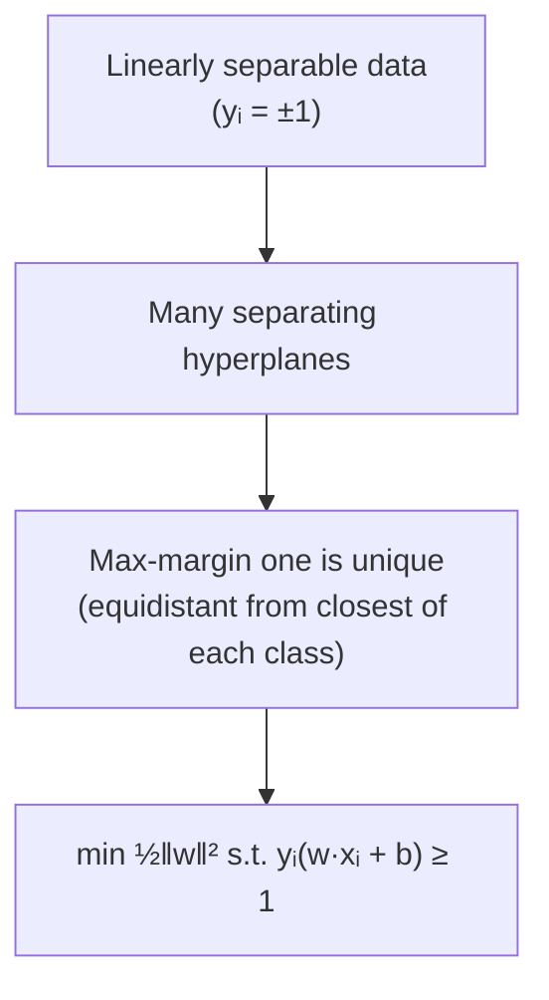
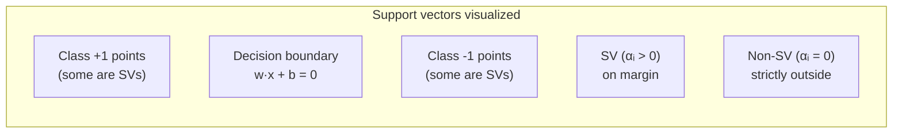

# 6 - Support Vector Machines and Kernels

[toc]

> **TL;DR:** A *Support Vector Machine* finds the *maximum-margin* hyperplane separating two classes — uniquely, by a convex quadratic program. Solving the *dual* exposes two key facts: (1) the solution depends only on a sparse subset of training points (the **support vectors**), and (2) the data appears only through inner products $\mathbf{x}_i^\top \mathbf{x}_j$, which we can replace with any positive-definite *kernel* $K(\mathbf{x}_i, \mathbf{x}_j)$. This **kernel trick** lets a linear SVM operate in implicit, possibly infinite-dimensional feature spaces — RBF, polynomial, string kernels — without ever materializing the features.

## Vocabulary

**Hard-margin SVM**

```math
\min_{\mathbf{w}, b}\ \frac{1}{2}\|\mathbf{w}\|^2 \quad \text{s.t.}\ y_i(\mathbf{w}^\top \mathbf{x}_i + b) \ge 1
```

Finds the unique max-margin hyperplane on linearly separable data. Fails (infeasible) on non-separable data.

---

**Soft-margin SVM**

```math
\min_{\mathbf{w}, b, \boldsymbol{\xi}}\ \frac{1}{2}\|\mathbf{w}\|^2 + C\sum_i \xi_i \quad \text{s.t.}\ y_i(\mathbf{w}^\top \mathbf{x}_i + b) \ge 1 - \xi_i,\ \xi_i \ge 0
```

Adds slack variables $\xi_i$ allowing margin violations, penalized at rate $C$. The standard production SVM.

---

**Margin**

```math
\gamma = \frac{2}{\|\mathbf{w}\|}
```

The width of the margin (distance between the two supporting hyperplanes). Maximizing margin ⇔ minimizing $\|\mathbf{w}\|$.

---

**Support vector**

A training point $\mathbf{x}_i$ for which $\alpha_i^* > 0$ in the dual solution. Lies on the margin or violates it; the only points that influence $\mathbf{w}^*$.

---

**Kernel function**

```math
K(\mathbf{x}, \mathbf{x}') = \phi(\mathbf{x})^\top \phi(\mathbf{x}')
```

A function that computes an inner product in some (possibly implicit, possibly infinite-dimensional) feature space without materializing $\phi$.

---

**Mercer's condition**

A kernel is a valid inner product in some feature space iff its Gram matrix is positive semidefinite for every choice of points.

---

**RBF (Radial Basis Function) kernel**

```math
K(\mathbf{x}, \mathbf{x}') = \exp\!\left(-\gamma \|\mathbf{x} - \mathbf{x}'\|^2\right)
```

The default kernel for non-linear problems. Corresponds to an *infinite-dimensional* feature space.

---

**Polynomial kernel**

```math
K(\mathbf{x}, \mathbf{x}') = (\mathbf{x}^\top \mathbf{x}' + c)^d
```

Corresponds to all monomials up to degree $d$.

## Intuition

When you have a linearly separable dataset, infinitely many hyperplanes separate the classes. The perceptron picks any of them; the SVM picks the *unique* one whose margin is widest. The intuition: a separator with wider margin is more robust to noise — small perturbations of training data won't flip its label. Vapnik's seminal result: maximum-margin classification has the lowest VC dimension (best generalization bound) of any linear classifier.

The brilliance of SVMs lies in two consecutive moves. **Move 1**: cast the max-margin problem as a convex quadratic program. Convex means unique global optimum; quadratic with linear constraints means a well-understood algorithm exists. **Move 2**: solve the *dual* rather than the primal. The dual has fewer variables (one per training point) and an extremely useful structure: the data appears only through inner products. This sets up the **kernel trick** — swap the inner product for any valid kernel and you've extended the SVM to non-linear classification *without changing a single line of the algorithm*.

The soft-margin extension handles real-world non-separable data. Allow each point to violate the margin by a slack $\xi_i$, penalize the sum of slacks with coefficient $C$. High $C$ → low tolerance for violations → tight fit, risk of overfit. Low $C$ → permissive → wide margin, possibly underfit. Choose $C$ by cross-validation. Same convex QP structure; same dual; same kernel trick.

## The hard-margin primal



The margin is $2/\|\mathbf{w}\|$ when we normalize so the closest training points satisfy $y_i(\mathbf{w}^\top \mathbf{x}_i + b) = 1$. Maximizing the margin equals minimizing $\|\mathbf{w}\|$, or equivalently $\frac{1}{2}\|\mathbf{w}\|^2$ for differentiability.

## The dual via Lagrangian / KKT

Lagrangian:

```math
\mathcal{L}(\mathbf{w}, b, \boldsymbol{\alpha}) = \frac{1}{2}\|\mathbf{w}\|^2 - \sum_i \alpha_i\big(y_i(\mathbf{w}^\top \mathbf{x}_i + b) - 1\big), \quad \alpha_i \ge 0
```

Stationarity:

```math
\nabla_\mathbf{w} \mathcal{L} = \mathbf{w} - \sum_i \alpha_i y_i \mathbf{x}_i = 0 \Rightarrow \mathbf{w} = \sum_i \alpha_i y_i \mathbf{x}_i
```

```math
\nabla_b \mathcal{L} = -\sum_i \alpha_i y_i = 0
```

Substitute back into $\mathcal{L}$:

```math
g(\boldsymbol{\alpha}) = \sum_i \alpha_i - \frac{1}{2}\sum_{i,j} \alpha_i \alpha_j y_i y_j (\mathbf{x}_i^\top \mathbf{x}_j)
```

Dual problem:

```math
\max_{\boldsymbol{\alpha} \ge 0}\ \sum_i \alpha_i - \frac{1}{2}\sum_{i,j} \alpha_i \alpha_j y_i y_j (\mathbf{x}_i^\top \mathbf{x}_j) \quad \text{s.t.}\ \sum_i \alpha_i y_i = 0
```

**The key observation**: the optimization sees $\mathbf{x}_i$ only via inner products $\mathbf{x}_i^\top \mathbf{x}_j$. This invites the kernel trick.

### Complementary slackness — and support vectors

KKT complementary slackness:

```math
\alpha_i \big(y_i(\mathbf{w}^\top \mathbf{x}_i + b) - 1\big) = 0
```

Two cases per point:
- $\alpha_i = 0$: the point is *strictly outside* the margin; doesn't influence $\mathbf{w}^*$.
- $\alpha_i > 0$: the point is *exactly on* the margin ($y_i(\mathbf{w}^\top \mathbf{x}_i + b) = 1$). Called a **support vector**.

The solution is *sparse*: typically only 5–30% of training points are support vectors. This sparsity is both an algorithmic advantage (the solution is determined by a small subset) and an interpretability win (you can show the user which points define the boundary).



## Soft-margin SVM

Real data is rarely linearly separable. Introduce per-point slack $\xi_i \ge 0$:

```math
\min_{\mathbf{w}, b, \boldsymbol{\xi}}\ \frac{1}{2}\|\mathbf{w}\|^2 + C\sum_i \xi_i \quad \text{s.t.}\ y_i(\mathbf{w}^\top \mathbf{x}_i + b) \ge 1 - \xi_i,\ \xi_i \ge 0
```

The dual is almost identical, with an upper bound on $\alpha_i$:

```math
\max_{0 \le \alpha_i \le C}\ \sum_i \alpha_i - \frac{1}{2}\sum_{i,j} \alpha_i \alpha_j y_i y_j (\mathbf{x}_i^\top \mathbf{x}_j) \quad \text{s.t.}\ \sum_i \alpha_i y_i = 0
```

KKT cases (now three per point):
- $\alpha_i = 0$: strictly outside margin.
- $0 < \alpha_i < C$: on margin (margin support vector).
- $\alpha_i = C$: violated margin or misclassified (bound support vector).

$C$ is a regularization knob. Large $C$ → small margin, few violations, risk of overfit. Small $C$ → wide margin, more violations tolerated, more bias. Tune by CV.

## The kernel trick

Replace $\mathbf{x}_i^\top \mathbf{x}_j$ everywhere with $K(\mathbf{x}_i, \mathbf{x}_j)$. The dual becomes:

```math
\max_{\boldsymbol{\alpha}}\ \sum_i \alpha_i - \frac{1}{2}\sum_{i,j} \alpha_i \alpha_j y_i y_j K(\mathbf{x}_i, \mathbf{x}_j) \quad \text{s.t.}\ 0 \le \alpha_i \le C,\ \sum_i \alpha_i y_i = 0
```

Prediction:

```math
f(\mathbf{x}) = \text{sign}\!\left(\sum_i \alpha_i y_i K(\mathbf{x}_i, \mathbf{x}) + b\right)
```

Without ever computing the explicit feature mapping $\phi$, the SVM is now classifying in the (possibly infinite-dimensional) feature space induced by $K$. This is one of the most beautiful tricks in ML.


### The kernel zoo

| Kernel | Formula | Use case |
| :--- | :--- | :--- |
| Linear | $\mathbf{x}^\top \mathbf{x}'$ | High-d, already-good features (text TF-IDF) |
| Polynomial | $(\mathbf{x}^\top \mathbf{x}' + c)^d$ | Polynomial decision boundaries; needs careful scaling |
| RBF (Gaussian) | $\exp(-\gamma \|\mathbf{x} - \mathbf{x}'\|^2)$ | Default non-linear choice |
| Sigmoid | $\tanh(\kappa \mathbf{x}^\top \mathbf{x}' + c)$ | Historically used, rarely PSD — avoid |
| String kernel | Subsequence overlap | Text / biological sequences |
| Graph kernel | Random-walk similarity | Molecular property prediction |

### Mercer's condition

A function $K(\mathbf{x}, \mathbf{x}')$ is a valid kernel (= corresponds to *some* inner product) iff the Gram matrix $K_{ij} = K(\mathbf{x}_i, \mathbf{x}_j)$ is positive semidefinite for *every* finite set of points.

```math
\mathbf{c}^\top K \mathbf{c} \ge 0 \quad \forall \mathbf{c}
```

Linear, polynomial, RBF kernels all satisfy this. The sigmoid kernel doesn't (for some parameter values), which is why it occasionally produces strange behavior.

## Implementation — solving the dual

For small problems, off-the-shelf QP solvers (CVXPY). For production, *Sequential Minimal Optimization* (SMO) and its successors (LIBSVM internals).

```python
# Toy example using cvxpy on the dual
import cvxpy as cp
import numpy as np

def svm_dual(X: np.ndarray, y: np.ndarray, C: float = 1.0,
             kernel=lambda a, b: a @ b.T) -> tuple[np.ndarray, np.ndarray, float]:
    n = len(y)
    K = kernel(X, X)
    Q = np.outer(y, y) * K            # Q_ij = y_i y_j K(x_i, x_j)
    alpha = cp.Variable(n)
    objective = cp.Maximize(cp.sum(alpha) - 0.5 * cp.quad_form(cp.multiply(y, alpha), K))
    # ^^^ equivalent expression; cvxpy needs a PSD form
    constraints = [alpha >= 0, alpha <= C, y @ alpha == 0]
    cp.Problem(objective, constraints).solve()
    alpha_val = alpha.value

    # Recover b from any margin support vector (0 < alpha_i < C)
    sv_mask = (alpha_val > 1e-5) & (alpha_val < C - 1e-5)
    if sv_mask.any():
        i = np.where(sv_mask)[0][0]
        b = y[i] - np.sum(alpha_val * y * K[:, i])
    else:
        b = 0.0
    return alpha_val, y, b

# Use sklearn in practice — far more efficient
from sklearn.svm import SVC

X = np.random.randn(200, 2)
y = (X[:, 0] + X[:, 1] > 0).astype(int) * 2 - 1
clf = SVC(kernel="rbf", C=1.0, gamma=0.5).fit(X, y)
print("support vectors:", clf.support_.shape[0])
```

`sklearn.svm.SVC` wraps LIBSVM, which uses SMO under the hood — far faster than a generic QP solver for SVM-shaped problems.

## Hyperparameters — `C` and kernel parameters

| Parameter | Effect of larger value | Effect of smaller value |
| :--- | :--- | :--- |
| $C$ (regularization inverse) | Tighter fit, more SVs, risk of overfit | Wider margin, fewer SVs, risk of underfit |
| $\gamma$ (RBF) | Tighter, more curvy boundaries (overfit) | Smoother, broader boundaries (underfit) |
| degree (polynomial) | Higher-order interactions | Simpler boundaries |

Tune $C$ and $\gamma$ jointly by grid search with cross-validation. Common grid: $C \in \{0.1, 1, 10, 100\}$, $\gamma \in \{0.01, 0.1, 1\}$.


## Support Vector Regression (SVR)

Same machinery for regression: build a tube of width $2\epsilon$ around the regression line, penalize only points outside the tube (the *$\epsilon$-insensitive loss*):

```math
\min\ \frac{1}{2}\|\mathbf{w}\|^2 + C\sum_i (\xi_i + \xi_i^*) \quad \text{s.t.}\ y_i - \mathbf{w}^\top \mathbf{x}_i - b \le \epsilon + \xi_i,\ \ldots
```

Same dual structure, same kernel trick, same sparsity (only points outside the tube are SVs).

## In practice

> [!IMPORTANT]
> **SVMs scale as $O(n^2)$ to $O(n^3)$** in training (depending on solver). They're great for $n < 10^5$; beyond that, switch to linear SVMs (Liblinear, sklearn's `LinearSVC`) or gradient-boosted ensembles for non-linear problems. The kernel trick's elegance comes with a serious price tag at large scale.

> [!TIP]
> For RBF kernels, **always standardize features** to zero mean / unit variance before fitting. The kernel $\exp(-\gamma \|\mathbf{x} - \mathbf{x}'\|^2)$ is distance-based; without standardization, large-scale features dominate the distance.

> [!CAUTION]
> SVM outputs from `decision_function` are *not* probabilities. If you need probability estimates, enable `probability=True` in sklearn — but be warned, it adds Platt scaling on top of the SVM and is much slower. For probability outputs, logistic regression is the more natural choice; SVM is for hard decisions and decision-boundary geometry.

In the deep-learning era, SVMs occupy a niche. They are still the best choice for:
- Small datasets where neural networks overfit ($n < 5000$).
- Problems where the right kernel encodes useful structure (string kernels for sequences, graph kernels for molecules).
- Problems where interpretability via support vectors is valuable.
- Production systems where deployment of a sparse model is preferred.

## Pitfalls

- **"SVM is the best classifier."** It *was*, in the mid-2000s. Now: tabular → gradient-boosted trees; images / language / audio → neural networks; small structured data → SVM still very competitive.
- **"Use a polynomial kernel for ‘richer’ features."** Poly kernels can produce numerical issues (terms grow as $(\mathbf{x}^\top \mathbf{x}')^d$). RBF is usually safer.
- **"The kernel trick is free."** Computing $K(\mathbf{x}_i, \mathbf{x}_j)$ for all $n^2$ pairs is the bottleneck of training, and predict-time inference is $O(\text{SVs})$ per query. For large $n$ and dense kernels, costs compound.
- **"I can use any similarity function as a kernel."** Only PSD kernels (Mercer's condition). Using a non-PSD "kernel" gives a non-convex problem and unreliable solutions.
- **"SVM doesn't have hyperparameters."** $C$ and kernel parameters are critical. Default values almost never produce the best result; cross-validate.

## Exercises

### Exercise 1 — Derive the margin width

Given a separating hyperplane $\mathbf{w}^\top \mathbf{x} + b = 0$, show that the margin (distance from the boundary to the nearest training point on either side) is $2/\|\mathbf{w}\|$ when scaled so the closest points satisfy $y_i(\mathbf{w}^\top \mathbf{x}_i + b) = 1$.

#### Solution

A point $\mathbf{x}_i$ on the margin satisfies $y_i(\mathbf{w}^\top \mathbf{x}_i + b) = 1$ — i.e., $\mathbf{w}^\top \mathbf{x}_i + b = y_i = \pm 1$.

Distance from $\mathbf{x}_i$ to the hyperplane $\{\mathbf{x} : \mathbf{w}^\top \mathbf{x} + b = 0\}$:

```math
d = \frac{|\mathbf{w}^\top \mathbf{x}_i + b|}{\|\mathbf{w}\|} = \frac{1}{\|\mathbf{w}\|}
```

The margin is the gap between the $+1$ and $-1$ supporting hyperplanes:

```math
\gamma = \frac{1}{\|\mathbf{w}\|} - \frac{-1}{\|\mathbf{w}\|} = \frac{2}{\|\mathbf{w}\|}
```

Maximizing $\gamma$ is equivalent to minimizing $\|\mathbf{w}\|$, or for convenience $\frac{1}{2}\|\mathbf{w}\|^2$.

---

### Exercise 2 — Compute the RBF feature map

Show that the RBF kernel $K(\mathbf{x}, \mathbf{x}') = \exp(-\gamma\|\mathbf{x} - \mathbf{x}'\|^2)$ corresponds to an *infinite-dimensional* feature space by expanding in a Taylor series.

#### Solution

Expand $K(\mathbf{x}, \mathbf{x}') = e^{-\gamma\|\mathbf{x}\|^2} e^{-\gamma\|\mathbf{x}'\|^2} e^{2\gamma\,\mathbf{x}^\top \mathbf{x}'}$. Taylor:

```math
e^{2\gamma\,\mathbf{x}^\top \mathbf{x}'} = \sum_{k=0}^\infty \frac{(2\gamma)^k}{k!}(\mathbf{x}^\top \mathbf{x}')^k
```

Each term $(\mathbf{x}^\top \mathbf{x}')^k$ expands into a sum of monomial inner products of degree $k$ — finite-dimensional but unbounded as $k \to \infty$. So:

```math
K(\mathbf{x}, \mathbf{x}') = \phi(\mathbf{x})^\top \phi(\mathbf{x}'), \quad \phi: \mathbb{R}^d \to \mathbb{R}^\infty
```

with $\phi$ containing all monomials of all orders (weighted by exponential factors). The feature space is infinite-dimensional, but you never materialize $\phi$ — the kernel computation in input space is $O(d)$.

---

### Exercise 3 — Identify support vectors

Hard-margin SVM is trained on a separable dataset. The optimization yields $\boldsymbol{\alpha}^* = (0, 0, 0.5, 0, 0.3, 0.2, 0)^\top$ for 7 training points. (a) Which points are support vectors? (b) Express $\mathbf{w}^*$ in terms of training data. (c) Why is the solution called "sparse"?

#### Solution

**(a)** Support vectors have $\alpha_i > 0$. Points 3, 5, 6 (with $\alpha_3 = 0.5, \alpha_5 = 0.3, \alpha_6 = 0.2$). Points 1, 2, 4, 7 have $\alpha_i = 0$ and lie strictly outside the margin.

**(b)**

```math
\mathbf{w}^* = \sum_i \alpha_i^* y_i \mathbf{x}_i = 0.5\,y_3\,\mathbf{x}_3 + 0.3\,y_5\,\mathbf{x}_5 + 0.2\,y_6\,\mathbf{x}_6
```

$\mathbf{w}^*$ is a linear combination of only the support vectors — none of the other training points contribute.

**(c)** *Sparse* in the sense that the dual solution has many zero coordinates — only a small fraction (here 3 out of 7) of training examples appear in the final classifier. At test time, predicting on a new $\mathbf{x}$ costs $O(\text{SVs} \cdot d)$, not $O(n \cdot d)$. The model also has a natural compression: ship the support vectors and the $\alpha$'s, discard the rest of the training set.

---

### Exercise 4 — Why is the dual preferred over the primal?

Give two concrete reasons to solve an SVM via its dual rather than its primal.

#### Solution

1. **Kernel trick.** The primal involves $\mathbf{w}$ in the explicit feature space — if you applied a feature map $\phi$ mapping to a million dimensions, the primal would have a million parameters. The dual has $n$ parameters (one per training point) and accesses features only through inner products. This is *the* reason kernels work computationally — without going through the dual, infinite-dimensional feature spaces would be impossible.

2. **Sparsity / interpretability.** The dual solution exposes support vectors directly — most $\alpha_i^* = 0$. You can see which training points define the boundary, store only them, and predict in $O(\text{SVs})$ time. The primal solution gives you $\mathbf{w}$ as one big dense vector with no such structure.

**Bonus consideration**: when $d > n$ (more features than training points), the primal has more variables than the dual. The dual is faster to solve in this regime even without kernels. The bioinformatics / genomics community uses kernel SVMs specifically because $d \sim 10^4{-}10^5$ is normal and $n$ is small.

## Sources

- Ramakrishnan, G. & Nagesh, A. (2011). *CS725: Foundations of Machine Learning — Lecture Notes*. IIT Bombay. §21, §22.
- Cortes, C. & Vapnik, V. (1995). *Support-Vector Networks*. Machine Learning 20.
- Vapnik, V. (1998). *Statistical Learning Theory*. Wiley.
- Schölkopf, B. & Smola, A. J. (2002). *Learning with Kernels*. MIT Press.
- Platt, J. (1998). *Sequential Minimal Optimization* (SMO).
- Burges, C. J. C. (1998). *A Tutorial on Support Vector Machines for Pattern Recognition*. Data Mining and Knowledge Discovery.
- Bishop, C. M. (2006). *Pattern Recognition and Machine Learning*. Springer. Ch. 7.
- Hsu, C.-W., Chang, C.-C., & Lin, C.-J. (2003). *A Practical Guide to Support Vector Classification*. https://www.csie.ntu.edu.tw/~cjlin/papers/guide/guide.pdf

## Related

- [Optimization and KKT](../1-foundations/4-optimization-and-kkt.md)
- [Linear Algebra Essentials](../1-foundations/5-linear-algebra-essentials.md)
- [Linear Regression](./4-linear-regression.md)
- [Perceptron and Logistic Regression](./5-perceptron-and-logistic-regression.md)
- [Maximum Entropy and Graphical Models](../3-unsupervised-and-beyond/4-maximum-entropy-and-graphical-models.md)
- [Feature Selection and Dimensionality Reduction](../3-unsupervised-and-beyond/5-feature-selection-and-dimensionality-reduction.md)
