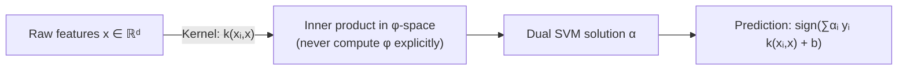

# 6 - SVMs and Max-Margin Learning

[toc]

> **TL;DR:** A Support Vector Machine finds the unique hyperplane that separates two classes with the *maximum margin* — the widest possible gap between the nearest training points on each side. This max-margin criterion is equivalent to minimising a convex objective (hinge loss + L2 regularisation) and produces a classifier that depends only on a small subset of training points (the support vectors). The kernel trick extends SVMs to nonlinear boundaries by replacing dot products with kernel functions, without ever computing the explicit feature map.

## Vocabulary

**Margin**: The perpendicular distance from the decision boundary to the nearest training point on either side.

```math
\text{margin} = \frac{2}{\|\theta\|_2}
```

---

**Support vectors**: The training examples that lie exactly on the margin boundaries. These are the *only* examples that determine the decision boundary.

**Hard-margin SVM**: Assumes the data is linearly separable; no examples may violate the margin.

**Soft-margin SVM**: Allows margin violations via slack variables ξᵢ ≥ 0, controlled by a penalty C.

**Hinge loss**: The loss function for SVMs.

```math
\ell_{\text{hinge}}(y, \hat{y}) = \max(0,\; 1 - y\hat{y}), \quad y \in \{-1, +1\}
```

---

**Dual problem**: A reformulation of the SVM optimisation using Lagrange multipliers αᵢ ≥ 0 — one per training example. The solution is sparse (most αᵢ = 0; only support vectors have αᵢ > 0).

**Kernel function**: A symmetric positive-definite function k(x, x') = φ(x)ᵀφ(x') that computes the inner product in some (possibly infinite-dimensional) feature space φ.

**Kernel trick**: Replace every dot product xᵢᵀxⱼ in the dual with k(xᵢ, xⱼ), enabling nonlinear boundaries without computing φ explicitly.

**Max-margin principle (generalised)**: Beyond SVMs, any learner that maximises the functional margin over a hypothesis class — including large-margin ranking, max-margin structured prediction, and siamese networks — inherits the same geometric intuition.

## Intuition

Two classes are separated by a gap in feature space. There are infinitely many hyperplanes that separate them. Which one should you pick? The *maximum-margin* hyperplane: the one that leaves the largest possible buffer zone on both sides. This is the SVM solution.

Why does large margin matter? The Vapnik-Chervonenkis theory and related results show that the generalisation error is bounded not by the number of parameters but by the *margin*: a large margin means the classifier is robust to small perturbations of the inputs. Intuitively, a thin-margin classifier is brittle — a small shift in the data could flip predictions. A wide-margin classifier has room to spare.

```
Class +1 (circles):   O   O   O   O
                              ↕ margin width = 2/‖θ‖
Decision boundary:    ──── ← θᵀx = 0 ────
                              ↕
Class -1 (crosses):   X   X   X   X

Support vectors: the O and X nearest the boundary.
```

The support vectors are the *load-bearing* examples — remove any non-support-vector example and the boundary doesn't move. This sparsity is both an efficiency advantage (prediction depends on a few kernel evaluations) and an interpretability feature.

## How it works

### Hard-margin SVM: the primal problem

Assume linear separability. Encode labels as yᵢ ∈ {−1, +1}. A linear classifier with weight vector w and bias b predicts:

```math
\hat{y}(x) = \text{sign}(w^\top x + b)
```

A point is correctly classified with functional margin ≥ 1 iff yᵢ(wᵀxᵢ + b) ≥ 1. The geometric margin to the hyperplane is |wᵀxᵢ + b| / ‖w‖. Maximising the margin 2/‖w‖ while ensuring all points are correctly classified gives the primal SVM:

```math
\min_{w, b}\; \frac{1}{2}\|w\|_2^2 \quad \text{s.t.}\; y_i(w^\top x_i + b) \geq 1 \;\forall\, i
```

This is a convex quadratic program (QP). The objective ½‖w‖² is the squared inverse margin; minimising it maximises the margin.

### Soft-margin SVM

Real data is rarely linearly separable. Introduce slack variables ξᵢ ≥ 0 to allow constraint violations:

```math
\min_{w, b, \xi}\; \frac{1}{2}\|w\|_2^2 + C\sum_{i=1}^n \xi_i
\quad \text{s.t.}\; y_i(w^\top x_i + b) \geq 1 - \xi_i,\; \xi_i \geq 0
```

The hyperparameter C controls the tradeoff between margin size and misclassification penalty. Large C → narrow margin, fewer violations (like ridge with small λ); small C → wide margin, more violations allowed.

Substituting ξᵢ = max(0, 1 − yᵢ(wᵀxᵢ + b)), the soft-margin SVM is equivalent to the unconstrained problem:

```math
\min_{w, b}\; \frac{1}{2}\|w\|_2^2 + C\sum_{i=1}^n \max\!\left(0,\; 1 - y_i(w^\top x_i + b)\right)
```

The second term is the **hinge loss** summed over all training examples.

> [!IMPORTANT]
> The soft-margin SVM with hinge loss is equivalent to L2-regularised empirical risk minimisation with hinge loss. Setting C = 1/(2nλ), the SVM objective is (1/n)Σ max(0, 1 − yᵢf(xᵢ)) + λ‖w‖². This shows that SVM training is just another form of regularised ERM — the same family as ridge and logistic regression.

### The dual problem

Introducing Lagrange multipliers αᵢ ≥ 0 for the constraints yᵢ(wᵀxᵢ + b) ≥ 1, the Lagrangian is:

```math
\mathcal{L}(w, b, \alpha) = \frac{1}{2}\|w\|^2 - \sum_i \alpha_i [y_i(w^\top x_i + b) - 1]
```

Setting ∂ℒ/∂w = 0 gives w* = Σᵢ αᵢ yᵢ xᵢ. Substituting into the Lagrangian and maximising over α gives the dual:

```math
\max_\alpha \sum_i \alpha_i - \frac{1}{2}\sum_{i,j} \alpha_i\alpha_j y_i y_j x_i^\top x_j
\quad \text{s.t.}\; \alpha_i \geq 0,\; \sum_i \alpha_i y_i = 0
```

The dual is also a convex QP, but the objective contains only inner products xᵢᵀxⱼ — this is where the kernel trick enters.

KKT complementary slackness: αᵢ > 0 only for support vectors (points for which yᵢ(wᵀxᵢ + b) = 1). All other αᵢ = 0. This sparsity makes prediction cost O(n_sv · d) where n_sv << n.

### The kernel trick

Replace every inner product xᵢᵀxⱼ in the dual with a kernel k(xᵢ, xⱼ). The solution lives in the feature space defined by φ but is computed entirely through kernel evaluations. Common kernels:

| Kernel | Formula | Feature space |
| :--- | :--- | :--- |
| Linear | k(x, x') = xᵀx' | ℝᵈ |
| Polynomial | k(x, x') = (xᵀx' + c)ᴹ | monomials up to degree M |
| RBF / Gaussian | k(x, x') = exp(−γ‖x−x'‖²) | infinite-dimensional |
| Sigmoid | k(x, x') = tanh(α xᵀx' + c) | (valid for some α, c) |

The prediction function becomes:

```math
\hat{y}(x) = \text{sign}\!\left(\sum_{i \in \text{SV}} \alpha_i y_i k(x_i, x) + b\right)
```



### Hinge loss vs logistic loss

| Property | Hinge loss | Logistic loss |
| :--- | :--- | :--- |
| Value at correctly classified point with large margin | 0 (exact zero) | > 0 (exponentially small) |
| Output type | Deterministic ±1 | Probability in (0,1) |
| Sparsity | Yes (support vectors only) | No (all examples contribute) |
| Differentiability | Non-differentiable at yf(x) = 1 | Smooth everywhere |
| Convexity | Convex | Convex |

The hinge loss's exact zeros at well-classified points produce the sparse support-vector solution. Logistic regression uses every training point in its gradient, giving a non-sparse solution but calibrated probabilities.

## Math

### Primal-dual optimality (KKT conditions)

At the solution of the soft-margin SVM:

```math
w^* = \sum_i \alpha_i y_i x_i
```

```math
\alpha_i \geq 0, \quad \xi_i \geq 0, \quad \alpha_i[y_i(w^{*\top}x_i + b^*) - 1 + \xi_i] = 0
```

The complementary slackness condition αᵢ[…] = 0 means: if αᵢ > 0, the point lies on or inside the margin (yᵢ(wᵀxᵢ + b) = 1 − ξᵢ). These are the support vectors. All other points have αᵢ = 0 and do not contribute to w*.

### VC dimension and generalisation

For a linear SVM with margin γ and training examples in a ball of radius R, the Rademacher generalisation bound gives:

```math
\text{Test error} \leq \text{Train error} + O\!\left(\sqrt{\frac{R^2/\gamma^2}{n}}\right)
```

The complexity term depends on R²/γ² (the inverse squared margin), not on the dimension d. This is why SVMs work well in high-dimensional settings: maximising the margin directly controls the VC dimension without depending on d.

### Representer theorem

The SVM solution w* = Σᵢ αᵢ yᵢ xᵢ lies in the span of the training examples. This is a special case of the *representer theorem*: for any regularised ERM problem with a smooth loss and ‖w‖² regulariser in a reproducing kernel Hilbert space (RKHS), the optimal solution is a linear combination of training points in feature space.

## Real-world example

Classifying handwritten digits (binary: 0 vs 1) using an RBF kernel SVM, comparing kernel SVM to linear SVM and logistic regression.

```python
import numpy as np
from sklearn.datasets import load_digits
from sklearn.svm import SVC, LinearSVC
from sklearn.linear_model import LogisticRegression
from sklearn.model_selection import train_test_split, GridSearchCV
from sklearn.preprocessing import StandardScaler
from sklearn.metrics import accuracy_score

# --- Load binary subset: digits 0 and 1 ---
digits = load_digits()
mask = digits.target < 2
X, y = digits.data[mask], digits.target[mask]   # (360, 64), labels {0, 1}
y_svm = 2 * y - 1   # recode to {-1, +1} for SVM convention

X_tr, X_te, y_tr, y_te = train_test_split(X, y_svm, test_size=0.25, random_state=0)

scaler = StandardScaler()
X_tr_s = scaler.fit_transform(X_tr)
X_te_s = scaler.transform(X_te)

# --- Linear SVM ---
lin_svm = LinearSVC(C=1.0, max_iter=5000)
lin_svm.fit(X_tr_s, y_tr)
print(f"Linear SVM   accuracy: {accuracy_score(y_te, lin_svm.predict(X_te_s)):.4f}")

# --- RBF kernel SVM (dual) ---
rbf_svm = SVC(kernel="rbf", C=5.0, gamma="scale")
rbf_svm.fit(X_tr_s, y_tr)
print(f"RBF SVM      accuracy: {accuracy_score(y_te, rbf_svm.predict(X_te_s)):.4f}")
print(f"# support vectors: {rbf_svm.n_support_}  (total {sum(rbf_svm.n_support_)})")

# --- Grid-search C and γ ---
param_grid = {"C": [0.1, 1.0, 10.0], "gamma": [0.001, 0.01, 0.1]}
gs = GridSearchCV(SVC(kernel="rbf"), param_grid, cv=5, scoring="accuracy")
gs.fit(X_tr_s, y_tr)
print(f"Best params: {gs.best_params_}")
print(f"CV accuracy: {gs.best_score_:.4f}")
```

> [!NOTE]
> `rbf_svm.n_support_` gives the number of support vectors per class. On this clean digit dataset, usually fewer than 20% of training examples are support vectors. Removing all other training examples would give the same decision boundary — this is the kernel SVM's hallmark sparsity.

## In practice

**SVM scaling:** Training a kernel SVM requires forming the n×n kernel matrix (Gram matrix), which costs O(n²d) time and O(n²) memory. For n = 50,000 this is ~20 GB. Practical limits: kernel SVMs are fast up to ~10,000 examples; beyond that, use approximations (Nyström method, random kitchen sinks) or switch to logistic regression / neural networks.

**Choosing C and γ:** The two hyperparameters for RBF SVM interact. A large C with a small γ (broad kernels) gives a near-linear boundary; a small C with a large γ (narrow kernels) gives very local, potentially overfit boundaries. Always grid-search jointly on a log-scale. The sweet spot for most datasets is C ∈ [1, 100] and γ set to 1/(d · Var(X)) (scikit-learn's `gamma="scale"`).

> [!TIP]
> For multi-class SVM, scikit-learn uses one-vs-one (K(K−1)/2 binary classifiers) by default with `SVC`. For large K, this is expensive. `LinearSVC` uses a crammer-singer formulation which trains a single K-class model and is much faster when K is large and features are sparse (text classification).

**SVMs vs neural networks:** SVMs dominated the 2000s for structured prediction (image segmentation, parsing, machine translation). Deep networks have largely replaced them for raw-feature tasks (images, speech, text) because they learn feature representations end-to-end. SVMs remain competitive for small datasets, structured outputs, and when kernel functions encode domain knowledge directly.

> [!WARNING]
> Failing to standardise features before training an RBF SVM effectively distorts the distance metric used by the kernel. Features with large variance dominate the RBF distance, making the kernel insensitive to low-variance features. Always standardise or normalise to unit variance before any kernel method.

## Pitfalls

- **"SVMs always outperform logistic regression."** On large datasets with dense features, logistic regression is often comparable and much faster. SVMs excel when n is small, when kernel functions encode structure (sequences, graphs), or when the exact decision boundary matters more than probability calibration.
- **"The SVM dual always has fewer variables than the primal."** The dual has n variables (one αᵢ per example), the primal has d+1 (one wⱼ per feature). When n >> d (many examples, few features), the dual is larger. When d >> n (high-dimensional, few examples), the dual is smaller and easier. Choose primal vs dual accordingly.
- **"Support vectors are the most important training examples."** They define the boundary, but they are the *closest* examples to the boundary — the ones the model is most uncertain about. Removing them changes the model dramatically. Removing any non-support-vector doesn't change the model at all.
- **"The kernel trick computes in an infinite-dimensional feature space."** The computation is finite — n kernel evaluations. The feature space may be infinite-dimensional, but the solution (the representer theorem) is a finite linear combination in that space. The trick is that we never need to work with the infinite-dimensional φ explicitly.
- **"Hinge loss and logistic loss give similar models."** They often do in practice, but hinge produces sparse solutions while logistic does not. For probability estimates, logistic is calibrated; SVM outputs are scores that require Platt scaling for calibration.

## Exercises

### Exercise 1 — Maximum margin derivation

Given that the margin is 2/‖w‖, explain why maximising the margin is equivalent to minimising ½‖w‖².

#### Solution

We want to maximise 2/‖w‖ subject to all examples satisfying yᵢ(wᵀxᵢ + b) ≥ 1. Maximising 2/‖w‖ is the same as minimising ‖w‖ (since 2/x is decreasing for x > 0). Minimising ‖w‖ has the same solution as minimising ‖w‖² (same argmin, since ‖w‖ = 0 iff ‖w‖² = 0 and both are convex). The factor of 1/2 is conventional — it simplifies the gradient: ∇(½‖w‖²) = w.

---

### Exercise 2 — Hinge loss at margin

Compute the hinge loss for the following four examples and explain the result.

| Example | y | wᵀx + b | Hinge loss |
| :--- | :---: | :---: | :---: |
| Correctly classified, margin > 1 | +1 | +2 | ? |
| Correctly classified, margin = 1 | +1 | +1 | ? |
| Correctly classified, margin < 1 | +1 | +0.5 | ? |
| Misclassified | +1 | −0.5 | ? |

#### Solution

Hinge loss = max(0, 1 − y·(wᵀx+b)):

```math
\ell_1 = \max(0, 1 - (+1)(+2)) = \max(0, -1) = 0
```

```math
\ell_2 = \max(0, 1 - (+1)(+1)) = \max(0, 0) = 0
```

```math
\ell_3 = \max(0, 1 - (+1)(+0.5)) = \max(0, 0.5) = 0.5
```

```math
\ell_4 = \max(0, 1 - (+1)(-0.5)) = \max(0, 1.5) = 1.5
```

Observations: points correctly classified with functional margin ≥ 1 contribute zero loss (they lie outside the margin). Points inside the margin (margin < 1) incur loss proportional to how far they are inside. Misclassified points incur loss > 1. This is the key difference from the 0-1 loss, which gives 0 or 1 only.

---

### Exercise 3 — Why the kernel trick works

Explain why replacing xᵢᵀxⱼ with k(xᵢ, xⱼ) in the SVM dual gives a valid algorithm for nonlinear classification.

#### Solution

The dual SVM objective only depends on training examples through their pairwise inner products xᵢᵀxⱼ. If we apply a feature map φ: ℝᵈ → ℝᵐ, all inner products become φ(xᵢ)ᵀφ(xⱼ). Any positive definite function k(xᵢ, xⱼ) is an inner product in some feature space (Mercer's theorem), so we can use k directly without ever computing φ. The dual variables αᵢ are found by the same convex QP as before; the decision function becomes:

```math
f(x) = \sum_i \alpha_i y_i k(x_i, x) + b
```

This is a linear function in φ-space but a nonlinear function in x-space. The entire computation requires only kernel evaluations, never the explicit feature vectors φ(xᵢ), which may be infinite-dimensional.

---

### Exercise 4 — C parameter effect

Describe qualitatively what happens to the SVM solution as C → 0 and C → ∞.

#### Solution

The soft-margin objective is ½‖w‖² + C·Σᵢ ξᵢ.

**C → 0:** The penalty on slack becomes negligible. The optimiser focuses entirely on maximising the margin (minimising ‖w‖²), ignoring training errors. The boundary becomes the maximum-margin hyperplane for the *separable* problem on just the most separated subset of the data, potentially misclassifying many points. This is *underfitting*.

**C → ∞:** Each slack variable ξᵢ must be zero (any nonzero ξᵢ incurs infinite penalty). This reduces to the hard-margin SVM. If the data is linearly separable, this gives zero training error. If the data is not separable, the problem is infeasible. The boundary is tight against the support vectors. This is *overfitting* in the sense that the boundary is highly sensitive to outliers.

The optimal C is found by cross-validation between these extremes.

## Sources

- Nando de Freitas, *Machine Learning Lectures — Oxford University* (2015): Max-margin learning (oxf14). https://www.cs.ox.ac.uk/people/nando.defreitas/machinelearning/
- Vapnik, V. (1995). *The Nature of Statistical Learning Theory*. Springer.
- Cortes, C. & Vapnik, V. (1995). Support-vector networks. *Machine Learning* 20, 273–297.
- Schölkopf, B. & Smola, A. J. (2002). *Learning with Kernels*. MIT Press.
- Bishop, C. M. (2006). *Pattern Recognition and Machine Learning*. Springer. Ch. 7.
- Murphy, K. P. (2012). *Machine Learning: A Probabilistic Perspective*. MIT Press. Ch. 14.

## Related

- [4 - Logistic Regression](./4-logistic-regression.md)
- [3 - Regularization and Cross-Validation](./3-regularization-and-cross-validation.md)
- [5 - Optimization for ML](./5-optimization-for-ml.md)
- [4 - Optimization and KKT](../1-foundations/4-optimization-and-kkt.md)
